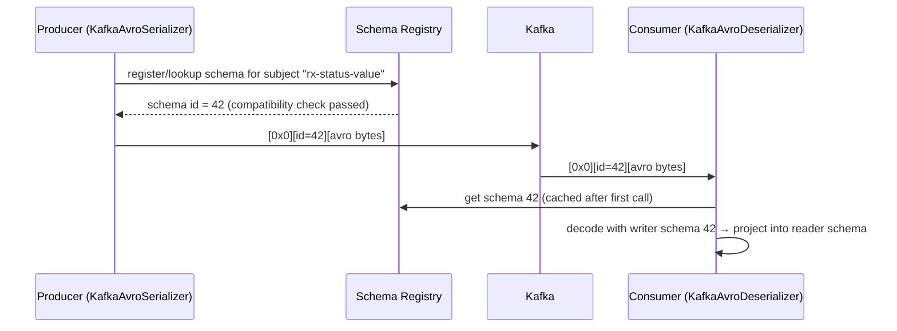

# Schema Management: Avro, Protobuf, JSON Schema & Schema Registry

!!! abstract "TL;DR"
    - Kafka stores **bytes**. Schemas are an application-level contract, and without governance one producer change can break every consumer.
    - **Schema Registry** stores versioned schemas per **subject**. Serializers register or look up the schema and prefix each message with a small **schema ID** (magic byte + 4-byte ID).
    - **Compatibility modes:** `BACKWARD` (default: new readers can read old data → **upgrade consumers first**), `FORWARD` (old readers can read new data → upgrade producers first), `FULL` (both), plus `_TRANSITIVE` variants against all versions, and `NONE`.
    - Safe evolution: **add optional fields with defaults**. Never rename, change type or reuse fields. Breaking changes go to a new topic or version.
    - **Avro** (compact, strong evolution rules), **Protobuf** (field numbers, great for gRPC shops), **JSON Schema** (readable, larger, weaker evolution).

## Why it matters

"How did you handle schema changes across teams?" is a standard senior question. Schema breaks are a leading cause of poison-pill incidents.

## Core concepts

### How the registry fits in


*Notice that messages carry only a 5-byte header, not the full schema. The registry rejects incompatible schemas at registration time, before bad data reaches the topic.*

**Subject naming strategies:** `TopicNameStrategy` (default: `<topic>-value`, one schema per topic), `RecordNameStrategy` (per record type; multiple event types per topic), `TopicRecordNameStrategy`.

### Compatibility modes

| Mode | Guarantee | Allowed changes (Avro) | Deploy order |
|---|---|---|---|
| `BACKWARD` (default) | New schema reads data written with the previous one | Delete fields; add fields **with defaults** | Consumers first |
| `FORWARD` | Previous schema reads data written with the new one | Add fields; delete fields **with defaults** | Producers first |
| `FULL` | Both | Add/delete only fields with defaults | Any order |
| `*_TRANSITIVE` | Against **all** previous versions, not just the last | Same | Same |
| `NONE` | No checks | Anything | Coordinated big bang |

!!! tip "Practical default"
    `BACKWARD_TRANSITIVE` or `FULL_TRANSITIVE` for long-retention topics, so a new consumer can read *any* historical message during replay.

### Format comparison

| | Avro | Protobuf | JSON Schema |
|---|---|---|---|
| Encoding | Binary, compact; needs the writer schema to decode | Binary, field-numbered | Text JSON |
| Evolution | Defaults + resolution rules | Field numbers; never reuse; optional fields | Weaker; `additionalProperties` pitfalls |
| Codegen | Yes (Java SpecificRecord) or GenericRecord | Yes (`protoc`) | Optional |
| Best for | Data pipelines, Kafka-native shops | gRPC + Kafka polyglot orgs | Low-friction, human-readable, web teams |

## In practice: code & configuration

Avro schema (`PrescriptionStatusChanged.avsc`):

```json
{
  "type": "record",
  "name": "PrescriptionStatusChanged",
  "namespace": "com.example.rx.events",
  "fields": [
    {"name": "eventId",        "type": "string"},
    {"name": "prescriptionId", "type": "string"},
    {"name": "status",         "type": {"type": "enum", "name": "RxStatus",
                                         "symbols": ["CREATED","APPROVED","SHIPPED","CANCELLED","UNKNOWN"],
                                         "default": "UNKNOWN"}},
    {"name": "version",        "type": "long"},
    {"name": "pharmacyId",     "type": ["null", "string"], "default": null}
  ]
}
```

*`pharmacyId` was added in v2 as optional with a default, which is backward compatible. The enum `default` lets old readers handle new symbols.*

```yaml
spring:
  kafka:
    producer:
      value-serializer: io.confluent.kafka.serializers.KafkaAvroSerializer
      properties:
        schema.registry.url: https://schema-registry:8081
        auto.register.schemas: false      # register via CI, not at runtime in prod
        use.latest.version: true
    consumer:
      value-deserializer: org.springframework.kafka.support.serializer.ErrorHandlingDeserializer
      properties:
        spring.deserializer.value.delegate.class: io.confluent.kafka.serializers.KafkaAvroDeserializer
        schema.registry.url: https://schema-registry:8081
        specific.avro.reader: true
```

=== "❌ Breaking change"
    ```json
    {"name": "status", "type": "string"}               // was an enum → type change
    {"name": "rxId",   "type": "string"}               // renamed from prescriptionId
    {"name": "copay",  "type": "double"}               // new required field, no default
    ```

=== "✅ Compatible evolution"
    ```json
    {"name": "copay", "type": ["null","double"], "default": null}   // optional + default
    // rename = add the new optional field, populate both, deprecate the old one later (or use Avro aliases)
    // type change = new field or a new event version/topic
    ```

CI gate: run a compatibility check before merge (Confluent Maven/Gradle plugin `test-compatibility`, or the registry REST API `POST /compatibility/subjects/{subject}/versions/latest`).

## Real-world usage

- **Data contracts:** companies put schemas in a shared repo with code owners, CI compatibility checks and auto-registration from the pipeline. Producers own their schemas, and consumers review changes.
- **Registries:** Confluent Schema Registry, AWS Glue Schema Registry, Apicurio (Red Hat). Same concepts, different APIs.
- **Healthcare:** schemas document which fields hold PHI, which supports access control, masking and audits.

## Trade-offs & production gotchas

!!! warning "Gotchas"
    - `auto.register.schemas=true` in production lets any service register schemas, bypassing review. Disable it and register from CI.
    - Avro **enums without a default** break old consumers when a new symbol is added.
    - Changing the **compatibility mode** later doesn't revalidate existing versions.
    - JSON without a registry ("we just use Jackson") works until a field rename silently becomes `null` downstream.
    - The registry is critical infrastructure: clients cache schemas, but new schema IDs need the registry. Run it highly available.

## How this connects to my experience

- **Where I used it:** event contracts between services at OptumRx (Kafka) and Deloitte (event-driven analytics).
- **Talking points:**
    - Format used (JSON vs Avro) and how schema changes were coordinated across teams and 5 upstream systems. *[confirm]*
    - If JSON without a registry: explain what you'd add today (registry, CI checks) and why. That's a strong senior answer.
- **Likely follow-up chain:** "How did you version events?" → "A producer adds a field. What breaks?" → "Rename a field safely?" → "Who owns the schema?"

## Interview questions

### Fundamentals

??? question "Q1. What problem does Schema Registry solve?"
    **Answer:** A central, versioned contract for message formats. It enforces compatibility rules at registration so producers can't publish breaking changes, and it reduces payload size by sending a schema ID instead of the schema.

??? question "Q2. Explain BACKWARD vs FORWARD compatibility."
    **Answer:** BACKWARD: consumers on the new schema can read data from the old schema, so upgrade consumers first. FORWARD: consumers on the old schema can read data from the new schema, so upgrade producers first. FULL: both.

### Intermediate

??? question "Q3. Which changes are backward compatible in Avro?"
    **Answer:** Adding a field with a default, and deleting a field. Not compatible: adding a required field without a default, changing a type (except allowed promotions like int→long), renaming without aliases.

??? question "Q4. Avro vs Protobuf vs JSON Schema?"
    **Answer:** Avro: compact, schema-resolution rules, great Kafka ecosystem support. Protobuf: compact, field numbers, strong tooling and gRPC alignment. JSON Schema: human-readable and easy to adopt, but larger payloads and looser evolution. Choose by ecosystem and governance needs.

??? question "Q5. How do you rename a field safely?"
    **Answer:** Add the new optional field, have producers write both, migrate consumers to the new one, then remove the old field once no consumer reads it (with compatibility checks at each step). Avro aliases can map old names on the reader side.

### Senior

??? question "Q6. How do you handle a truly breaking change?"
    **Answer:** Introduce a new event version: a new topic (`rx-status.v2`) or a new record type with RecordNameStrategy. Dual-publish v1 and v2 during migration, migrate consumers, then retire v1. Communicate through the event catalogue and deprecation timeline.

??? question "Q7. Multiple event types on one topic: what are the schema implications?"
    **Answer:** Use `RecordNameStrategy` / `TopicRecordNameStrategy`, or a union schema, so each type evolves independently. Keeping related events on one topic preserves ordering for the same key across types (e.g. all prescription lifecycle events).

### Scenario-based

??? question "Q8. A producer deployed a change and all consumers started failing deserialization. Response?"
    **Answer:** Immediate: roll back the producer. Consumers with `ErrorHandlingDeserializer` + DLT keep flowing (bad records parked). Replay the parked records after a fix. Prevent it with a registry, compatibility mode, CI compatibility checks, disabling runtime auto-registration, and contract tests between teams.

## Cheat sheet

| Concept | Remember |
|---|---|
| Wire format | Magic byte + 4-byte schema ID + payload |
| Default mode | BACKWARD → upgrade consumers first |
| Long retention | Use `_TRANSITIVE` modes |
| Safe change | Add optional field with default |
| Prod setting | `auto.register.schemas=false`, register via CI |
| Breaking change | New version/topic + dual publish |

## Sources

1. [Confluent: Schema Evolution and Compatibility](https://docs.confluent.io/platform/current/schema-registry/fundamentals/schema-evolution.html).
2. [Apache Avro specification: Schema Resolution](https://avro.apache.org/docs/current/specification/#schema-resolution).
3. [Protocol Buffers: Updating a message type](https://protobuf.dev/programming-guides/proto3/#updating).
4. [Confluent: Wire format](https://docs.confluent.io/platform/current/schema-registry/fundamentals/serdes-develop/index.html#wire-format).
5. [AWS Glue Schema Registry](https://docs.aws.amazon.com/glue/latest/dg/schema-registry.html).
