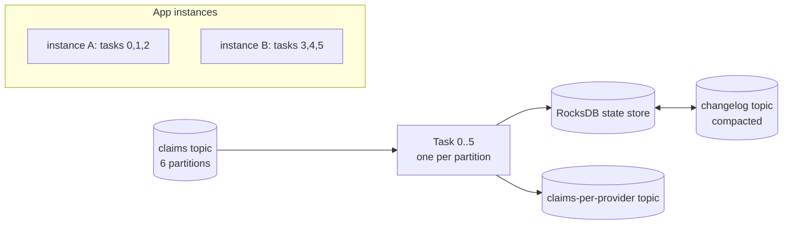
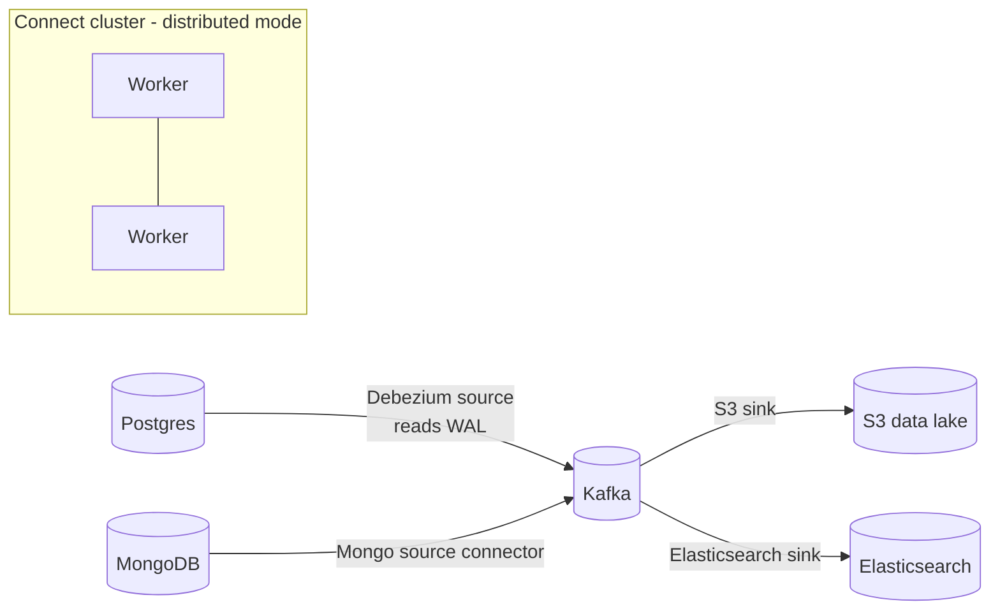

# Kafka Streams & Kafka Connect (Overview)

!!! abstract "TL;DR"
    - **Kafka Streams** is a **Java library** (no separate cluster) for stateful stream processing: filter, map, join, aggregate, windowing. It scales by running more app instances (one task per input partition).
    - Core abstractions: **KStream** (an event stream), **KTable** (a changelog / latest value per key), **GlobalKTable** (fully replicated table). State lives in local **RocksDB** stores backed by **changelog topics**.
    - **Kafka Connect** is a framework for **moving data in and out of Kafka without code**: **source** connectors (DB/CDC → Kafka) and **sink** connectors (Kafka → S3/Elasticsearch/DB), with **SMTs** for light transforms.
    - **Debezium** (CDC on Connect) is the standard way to stream database changes and implement the outbox relay.
    - Choose: plain consumer for simple per-event logic, Streams for stateful joins and aggregations in a Java app, Flink for large or complex multi-source jobs, Connect for integration.

## Why it matters

At lead level you're asked "how would you build X?", and knowing when *not* to hand-roll a consumer (use Connect, use Streams) shows architectural maturity.

## Core concepts

### Kafka Streams


*Notice that scaling means starting another instance, and tasks are rebalanced across instances. If an instance dies, its state is restored from the changelog topic (or from standby replicas).*

| Concept | Meaning |
|---|---|
| **KStream** | Every record is an independent event (insert semantics) |
| **KTable** | Latest value per key (upsert semantics); backed by a compacted topic |
| **GlobalKTable** | A full copy on every instance; lookups without co-partitioning |
| **Windowing** | Tumbling, hopping, sliding, session windows; grace period for late events |
| **Joins** | Stream-stream (windowed), stream-table (enrichment), table-table |
| **Co-partitioning** | Joined topics need the same key and partition count (except GlobalKTable) |
| **Interactive queries** | Query local state stores via your own REST API |
| **EOS** | `processing.guarantee=exactly_once_v2` |

### Kafka Connect


*Notice that Connect runs as its own scalable cluster of workers. Connectors are configured with JSON over REST, not written as code.*

- **Workers** (distributed mode) store configs, offsets and status in Kafka topics, so they're fault tolerant.
- **Converters** handle serialization (Avro/JSON/Protobuf). **SMTs** do single-message transforms (rename, mask, route).
- **Error handling:** `errors.tolerance=all` + `errors.deadletterqueue.topic.name` for sink connectors.

## In practice: code & configuration

### Kafka Streams: claims per provider per hour

```java
@Bean
KStream<String, Claim> claimsTopology(StreamsBuilder builder) {
    KStream<String, Claim> claims = builder.stream("claims",
            Consumed.with(Serdes.String(), claimSerde));

    claims
        .filter((k, c) -> c.status() == ClaimStatus.SUBMITTED)
        .groupBy((k, c) -> c.providerId(), Grouped.with(Serdes.String(), claimSerde))   // repartition by provider
        .windowedBy(TimeWindows.ofSizeAndGrace(Duration.ofHours(1), Duration.ofMinutes(5)))
        .count(Materialized.as("claims-per-provider-hourly"))
        .toStream()
        .map((windowedKey, count) -> KeyValue.pair(windowedKey.key(),
                new ProviderHourlyCount(windowedKey.key(), windowedKey.window().startTime(), count)))
        .to("claims-per-provider", Produced.with(Serdes.String(), countSerde));
    return claims;
}
```

```yaml
spring:
  kafka:
    streams:
      application-id: claims-analytics       # also the consumer group and state-dir prefix
      properties:
        processing.guarantee: exactly_once_v2
        num.standby.replicas: 1
```

### Kafka Connect: Debezium outbox relay

```json
{
  "name": "orders-outbox",
  "config": {
    "connector.class": "io.debezium.connector.postgresql.PostgresConnector",
    "database.hostname": "orders-db",
    "database.dbname": "orders",
    "table.include.list": "public.outbox",
    "topic.prefix": "orders",
    "transforms": "outbox",
    "transforms.outbox.type": "io.debezium.transforms.outbox.EventRouter",
    "transforms.outbox.route.by.field": "aggregate_type"
  }
}
```

### S3 sink with DLQ

```json
{
  "connector.class": "io.confluent.connect.s3.S3SinkConnector",
  "topics": "claims",
  "s3.bucket.name": "claims-lake",
  "format.class": "io.confluent.connect.s3.format.parquet.ParquetFormat",
  "errors.tolerance": "all",
  "errors.deadletterqueue.topic.name": "claims-s3-dlq",
  "errors.deadletterqueue.context.headers.enable": true
}
```

## Real-world usage

- **CDC to the data lake:** Debezium → Kafka → S3/Iceberg is a standard modern pipeline, with no batch ETL against production databases.
- **Search indexing:** DB changes → Kafka → Elasticsearch sink keeps search in sync (relevant to Deloitte's Elasticsearch work).
- **Real-time features:** fraud scores, running totals and alerts with Kafka Streams inside a Spring Boot service.
- Alternatives: **Apache Flink** for large-scale or complex event-time processing, and managed services (Confluent Cloud, Amazon MSK Connect).

## Trade-offs & production gotchas

| Need | Choose |
|---|---|
| Simple per-event processing | Plain consumer / Spring listener |
| Stateful joins, windows, aggregations in a Java service | Kafka Streams |
| Huge state, complex event time, multiple sources and sinks, SQL | Flink |
| DB/S3/search integration without custom code | Kafka Connect (+ Debezium) |

!!! warning "Gotchas"
    - Streams `groupBy`/`selectKey` cause **repartition topics** (extra I/O). Key correctly upstream when possible.
    - Large state means slow restores after rebalance. Use standby replicas and persistent volumes.
    - Co-partitioning violations cause joins that silently miss.
    - Connect: a connector "RUNNING" with a failed task is still broken. Monitor task status.
    - CDC exposes your **table schema as a contract**. Prefer the outbox table for integration events.

## How this connects to my experience

- **Where I used it:** event-driven analytics at Deloitte (healthcare data discovery, Elasticsearch); Kafka at OptumRx.
- **Talking points:**
    - Whether you used Streams or Connect, or plain consumers, and why. *[confirm]*
    - How Elasticsearch indexing was kept in sync (Connect sink vs custom consumer vs batch). *[confirm]*
- **Likely follow-up chain:** "Why not Kafka Streams for that?" → "KStream vs KTable?" → "How would you sync DB → search?"

## Interview questions

### Fundamentals

??? question "Q1. KStream vs KTable?"
    **Answer:** A KStream is an unbounded sequence of independent events (each record is a fact). A KTable is a changelog where each record updates the latest value for its key (upsert, with tombstones for delete). Aggregating a KStream produces a KTable.

??? question "Q2. What is Kafka Connect and when do you use it?"
    **Answer:** A framework and runtime for configurable, scalable connectors that move data between Kafka and external systems (source/sink) without custom code. Use it for standard integrations: CDC from DBs, sinking to S3, Elasticsearch, warehouses.

### Intermediate

??? question "Q3. How does Kafka Streams scale and recover state?"
    **Answer:** Each input partition maps to a task, and tasks are distributed across instances sharing the `application.id` (a consumer group). State lives in local RocksDB with a compacted changelog topic. On failover the new owner restores from the changelog, and standby replicas shorten that.

??? question "Q4. What is co-partitioning and why does it matter for joins?"
    **Answer:** Joined streams or tables must have the same key and the same partition count so matching keys are processed by the same task. Otherwise, repartition first or use a GlobalKTable for the smaller side.

??? question "Q5. What is CDC and why use Debezium?"
    **Answer:** Change data capture reads the database's transaction log (WAL/binlog/oplog) to emit row-level changes as events. It's low-impact, ordered per row and doesn't miss changes. Debezium runs on Connect and includes an outbox router.

### Senior

??? question "Q6. Kafka Streams vs Flink: how do you choose?"
    **Answer:** Streams is a library embedded in microservices, Kafka-to-Kafka only, simpler ops, great for moderate state. Flink is a separate cluster with richer event-time handling, huge state, many sources and sinks, SQL and batch-stream unification. Choose by team skills, state size and deployment model.

??? question "Q7. Design: keep Elasticsearch in sync with a MongoDB system of record."
    **Answer:** CDC from MongoDB (Debezium or the Mongo source connector, using change streams) → Kafka topic keyed by document ID → Elasticsearch sink connector (upserts by ID, idempotent, DLQ for mapping errors). Handle deletes via tombstones. Do the initial snapshot via the connector's snapshot mode. Monitor lag as "search staleness".

### Scenario-based

??? question "Q8. A windowed aggregation is missing some events. Why?"
    **Answer:** Late-arriving events beyond the grace period are dropped. Other causes: timestamp extraction using the wrong time (processing vs event time), co-partitioning issues in joins, or the filter logic. Increase the grace period, use the correct `TimestampExtractor`, and monitor the dropped-records metric.

## Cheat sheet

| Concept | Remember |
|---|---|
| Streams | Library; tasks = partitions; RocksDB + changelog |
| KTable | Latest per key (compacted) |
| Joins | Need co-partitioning (except GlobalKTable) |
| EOS | `exactly_once_v2` |
| Connect | Source/sink, REST-configured, distributed workers |
| CDC | Debezium; outbox EventRouter |
| Connect DLQ | `errors.tolerance=all` + DLQ topic (sinks) |

## Sources

1. [Kafka Streams documentation](https://kafka.apache.org/documentation/streams/).
2. [Kafka Connect documentation](https://kafka.apache.org/documentation/#connect).
3. [Debezium documentation](https://debezium.io/documentation/reference/stable/index.html).
4. [Spring for Apache Kafka: Kafka Streams support](https://docs.spring.io/spring-kafka/reference/streams.html).
5. [Confluent: Kafka Connect error handling and DLQs](https://www.confluent.io/blog/kafka-connect-deep-dive-error-handling-dead-letter-queues/).
