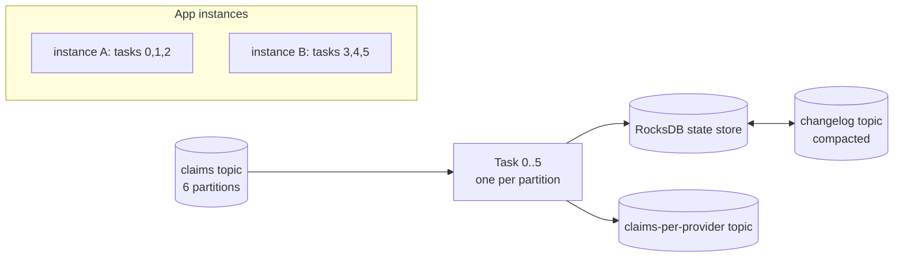
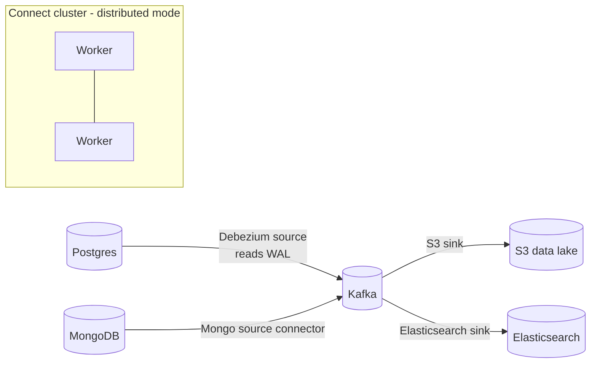

# Kafka Streams & Kafka Connect (Overview)

!!! abstract "Key takeaways"
    - **Kafka Streams** is a **Java library** (no separate cluster) for stateful stream processing: filter, map, join, aggregate, windowing. It scales by running more app instances (one task per input partition).
    - Core abstractions: **KStream** (an event stream), **KTable** (a changelog / latest value per key), **GlobalKTable** (fully replicated table). State lives in local **RocksDB** stores backed by **changelog topics**.
    - **Kafka Connect** is a framework for **moving data in and out of Kafka without code**: **source** connectors (DB/CDC → Kafka) and **sink** connectors (Kafka → S3/Elasticsearch/DB), with **SMTs** for light transforms.
    - **Debezium** (CDC on Connect) is the standard way to stream database changes and implement the outbox relay.
    - Choose: plain consumer for simple per-event logic, Streams for stateful joins and aggregations in a Java app, Flink for large or complex multi-source jobs, Connect for integration.

## Why it matters

At lead level you're asked "how would you build X?", and knowing when *not* to hand-roll a consumer (use Connect, use Streams) shows architectural maturity.

## Core concepts

### Kafka Streams


*Notice that scaling means starting another instance, and tasks are rebalanced across instances. If an instance dies, its state is restored from the changelog topic (or from standby replicas).*

| Concept | Meaning |
|---|---|
| **KStream** | Every record is an independent event (insert semantics) |
| **KTable** | Latest value per key (upsert semantics, `null` value = delete); usually read from a compacted topic, and its state store is backed by a compacted changelog |
| **GlobalKTable** | A full copy on every instance; lookups without co-partitioning, and you can join on any field derived from the stream record |
| **Windowing** | Tumbling, hopping, sliding, session windows; grace period for late (out-of-order) events |
| **Joins** | Stream-stream (windowed), stream-table (enrichment), table-table (including foreign-key joins) |
| **Co-partitioning** | Joined topics need the same key, the same partition count and the same partitioning strategy (not needed for GlobalKTable joins or KTable foreign-key joins) |
| **Interactive queries** | Query local state stores via your own REST API; use `application.server` metadata to route to the instance that owns the key |
| **EOS** | `processing.guarantee=exactly_once_v2` (the default is `at_least_once`; the older `exactly_once` and `exactly_once_beta` values were removed in Kafka 4.0) |

{ loading=lazy }
*Notice that the broken join throws nothing. The only symptom is an output topic that stays empty, which is why co-partitioning is a classic interview probe.*

!!! note "Version notes (Kafka 3.x → 4.x)"
    - Streams never talked to ZooKeeper directly (it only uses the client protocol), so KRaft changes nothing for the application code.
    - Classic Streams apps use the classic consumer group protocol with a client-side assignor. The KIP-848 consumer protocol (`group.protocol=consumer`) is **not** used by Streams. Streams has its own server-side protocol, **KIP-1071** (`group.protocol=streams`), early access in 4.0/4.1 and GA with a limited feature set in 4.2.
    - Kafka 4.2 added built-in DLQ support to the Streams exception handlers (KIP-1034). Before that you produce to a DLQ topic yourself or just log-and-continue.

### Kafka Connect


*Notice that Connect runs as its own scalable cluster of workers. Connectors are configured with JSON over REST, not written as code.*

- **Workers** (distributed mode) store connector configs, source offsets and status in three internal Kafka topics (`config.storage.topic`, `offset.storage.topic`, `status.storage.topic`), so they're fault tolerant. Workers with the same `group.id` form one Connect cluster.
- A **connector** is the logical job; it splits work into **tasks** (`tasks.max`), and tasks are what actually copy data. Workers rebalance connectors and tasks among themselves (incremental cooperative rebalancing).
- **Sink** connectors are ordinary consumers: offsets are committed to `__consumer_offsets` under the group `connect-<connector-name>`. **Source** connectors track their position (for example a WAL LSN) in the offsets topic.
- **Converters** handle serialization (Avro/JSON/Protobuf). **SMTs** do single-message transforms (rename, mask, route). They are stateless and per record. Anything needing joins or aggregation belongs in Streams or Flink.
- **Delivery:** at-least-once by default. Exactly-once for source connectors exists since Kafka 3.3 (KIP-618, worker setting `exactly.once.source.support=enabled`, and the connector must support it). Sink exactly-once depends on the sink being idempotent or storing offsets with the data.
- **Error handling:** `errors.tolerance=all` (default is `none`, which fails the task on the first bad record) + `errors.deadletterqueue.topic.name`. The DLQ is for **sink** connectors only.

## In practice: code & configuration

### Kafka Streams: claims per provider per hour

This needs `kafka-streams` on the classpath (it is an optional dependency of Spring for Apache Kafka) and `@EnableKafkaStreams` on a `@Configuration` class. Spring Boot then builds the `StreamsBuilder` from `spring.kafka.streams.*`.

```java
@Bean
KStream<String, Claim> claimsTopology(StreamsBuilder builder) {
    KStream<String, Claim> claims = builder.stream("claims",
            Consumed.with(Serdes.String(), claimSerde));

    claims
        .filter((k, c) -> c.status() == ClaimStatus.SUBMITTED)
        .groupBy((k, c) -> c.providerId(), Grouped.with(Serdes.String(), claimSerde))   // repartition by provider
        .windowedBy(TimeWindows.ofSizeAndGrace(Duration.ofHours(1), Duration.ofMinutes(5)))
        .count(Materialized.as("claims-per-provider-hourly"))
        .toStream()
        .map((windowedKey, count) -> KeyValue.pair(windowedKey.key(),
                new ProviderHourlyCount(windowedKey.key(), windowedKey.window().startTime(), count)))
        .to("claims-per-provider", Produced.with(Serdes.String(), countSerde));
    return claims;
}
```

```yaml
spring:
  kafka:
    streams:
      application-id: claims-analytics       # also the consumer group id, the internal-topic prefix and the state-dir subfolder
      state-dir: /var/lib/kafka-streams      # default is under java.io.tmpdir, which is usually wiped on restart
      properties:
        processing.guarantee: exactly_once_v2   # default: at_least_once
        num.standby.replicas: 1                 # default: 0
```

Things to notice in this topology:

- `groupBy` changes the key, so Streams creates an internal **repartition topic** (`claims-analytics-...-repartition`). The count store gets a **changelog topic** (`claims-analytics-claims-per-provider-hourly-changelog`).
- By default a windowed aggregation emits an **updated count on every input record** (subject to caching and the commit interval), not one final row per window. Downstream consumers must treat the output as upserts. For one final result per window add `.emitStrategy(EmitStrategy.onWindowClose())` before `count` (Kafka 3.3+) or `.suppress(Suppressed.untilWindowCloses(BufferConfig.unbounded()))` after it.
- Windows are driven by **event time** (the record timestamp via the `TimestampExtractor`), and "stream time" only advances when new records arrive.
- With `exactly_once_v2`, `commit.interval.ms` defaults to 100 ms instead of 30 s.

### Co-partitioning: a join that silently misses

=== "❌ Common mistake"
    ```java
    // "claims" is keyed by claimId, "providers" is keyed by providerId.
    KStream<String, Claim> claims = builder.stream("claims");
    KTable<String, Provider> providers = builder.table("providers");

    // Joins on the record key: claimId never equals providerId, so nothing matches.
    // No error is thrown. The output is just empty (or full of nulls with leftJoin).
    claims.join(providers, (claim, provider) -> enrich(claim, provider));
    ```

=== "✅ Correct approach"
    ```java
    KStream<String, Claim> claims = builder.stream("claims");
    KTable<String, Provider> providers = builder.table("providers");

    // Re-key first. Streams inserts a repartition topic with the right partition count,
    // so both sides are co-partitioned on providerId.
    claims
        .selectKey((claimId, claim) -> claim.providerId())
        .join(providers, (claim, provider) -> enrich(claim, provider));

    // Alternative for small reference data: GlobalKTable, no repartition needed.
    GlobalKTable<String, Provider> providersGlobal = builder.globalTable("providers-ref");
    claims.join(providersGlobal,
            (claimId, claim) -> claim.providerId(),          // key extractor
            (claim, provider) -> enrich(claim, provider));
    ```

### Kafka Connect: Debezium outbox relay

```json
{
  "name": "orders-outbox",
  "config": {
    "connector.class": "io.debezium.connector.postgresql.PostgresConnector",
    "database.hostname": "orders-db",
    "database.dbname": "orders",
    "table.include.list": "public.outbox",
    "topic.prefix": "orders",
    "transforms": "outbox",
    "transforms.outbox.type": "io.debezium.transforms.outbox.EventRouter",
    "transforms.outbox.route.by.field": "aggregate_type"
  }
}
```

This is trimmed to the interesting parts. A real config also needs `database.port`, `database.user`, `database.password` and usually `plugin.name=pgoutput`. EventRouter defaults: it routes by the `aggregatetype` column (overridden above because this table names it `aggregate_type`), uses `aggregateid` as the Kafka key and `payload` as the value, and writes to the topic `outbox.event.<aggregate type value>` (change with `route.topic.replacement`).

{ loading=lazy }
*Notice there is no "sent" column to update: the WAL position in the offsets topic is the relay's only bookmark.*

### S3 sink with DLQ

```json
{
  "connector.class": "io.confluent.connect.s3.S3SinkConnector",
  "topics": "claims",
  "s3.bucket.name": "claims-lake",
  "format.class": "io.confluent.connect.s3.format.parquet.ParquetFormat",
  "errors.tolerance": "all",
  "errors.deadletterqueue.topic.name": "claims-s3-dlq",
  "errors.deadletterqueue.context.headers.enable": true
}
```

Also trimmed: the S3 sink additionally requires `s3.region`, `storage.class` (`io.confluent.connect.s3.storage.S3Storage`) and `flush.size`. Parquet output needs records with a schema (Avro, Protobuf or JSON Schema converter), not schemaless JSON. `errors.deadletterqueue.topic.replication.factor` defaults to 3, so set it to 1 on a single-broker dev cluster.

## Real-world usage

- **CDC to the data lake:** Debezium → Kafka → S3/Iceberg is a standard modern pipeline, with no batch ETL against production databases.
- **Search indexing:** DB changes → Kafka → Elasticsearch sink keeps search in sync (relevant to Deloitte's Elasticsearch work).
- **Real-time features:** fraud scores, running totals and alerts with Kafka Streams inside a Spring Boot service.
- Alternatives: **Apache Flink** for large-scale or complex event-time processing, and managed services (Confluent Cloud, Amazon MSK Connect).

## Trade-offs & production gotchas

| Need | Choose |
|---|---|
| Simple per-event processing | Plain consumer / Spring listener |
| Stateful joins, windows, aggregations in a Java service | Kafka Streams |
| Huge state, complex event time, multiple sources and sinks, SQL | Flink |
| DB/S3/search integration without custom code | Kafka Connect (+ Debezium) |

!!! warning "Gotchas"
    - Streams `groupBy`/`selectKey` cause **repartition topics** (extra I/O). Key correctly upstream when possible.
    - Large state means slow restores after rebalance. Use standby replicas and persistent volumes. The default `state.dir` is under the JVM temp directory, so set it explicitly.
    - Co-partitioning: a partition-count mismatch fails fast with a `TopologyException` at startup, but a different key or a different partitioner on the producer side is **not** detected and the join silently misses.
    - Changing the topology (adding or reordering stateful operators) can rename internal topics and stores. Name your operators and stores explicitly, and plan a reset (`kafka-streams-application-reset`) or a new `application.id` for incompatible changes.
    - Connect: a connector "RUNNING" with a failed task is still broken. Monitor task status (`GET /connectors/{name}/status`) and restart tasks with `POST /connectors/{name}/restart?includeTasks=true&onlyFailed=true`.
    - Connect DLQ covers converter and SMT failures, plus sink write failures only if the connector reports them through the errant record reporter (Kafka 2.6+). A sink that throws from `put()` still kills the task. `errors.tolerance=all` **without** a DLQ topic silently drops bad records.
    - Debezium on Postgres holds a **replication slot**. If the connector is down for long, WAL piles up and can fill the database disk.
    - CDC exposes your **table schema as a contract**. Prefer the outbox table for integration events.

## How this connects to my experience

- **Where I used it:**
    - **OptumRx Meteor (Publicis Sapient):** "Designed Kafka-based event-driven workflows with retry and DLQ handling" and microservices on Java, Spring Boot, Kafka, MongoDB, Redis and GraphQL. The resume does not say Kafka Streams or Kafka Connect were used. *[confirm]*
    - **ConvergeHealth Data Asset Explorer (Deloitte):** "Developed event-driven healthcare analytics workflows" and "Elasticsearch-powered search capabilities". The resume lists SQS and SNS for this project, not Kafka. *[confirm whether Kafka was involved at all]*
- **Talking points:**
    - Whether you used Streams or Connect, or plain consumers, at OptumRx, and why. *[confirm]* If it was plain `@KafkaListener` consumers, say so and explain the choice: per-event logic with retry and DLQ needs no state store.
    - How Elasticsearch indexing was kept in sync at Deloitte (Connect sink vs custom consumer vs batch). *[confirm]*
    - Be honest about depth: "I have not run Streams or Connect in production *[confirm]*, but here is when I would reach for them and what I would watch out for" is a strong lead-level answer when backed by the trade-offs on this page.
- **Likely follow-up chain:** "Why not Kafka Streams for that?" → "KStream vs KTable?" → "How would you sync DB → search?"

## Interview questions

### Fundamentals

??? question "Q1. KStream vs KTable?"
    **Answer:** A KStream is an unbounded sequence of independent events (each record is a fact). A KTable is a changelog where each record updates the latest value for its key (upsert, with tombstones for delete). Aggregating a KStream produces a KTable, and `toStream()` turns a KTable back into its stream of updates (stream-table duality). A GlobalKTable is a KTable fully loaded on every instance, used for small reference data.

    **Interviewer listens for:** insert vs upsert semantics, tombstones, stream-table duality, and that the same topic can be read either way depending on what the data means.

    **Common wrong answer:** "A KTable is a database table stored in Kafka" with no mention of the changelog, or saying a KTable only works on compacted topics.

??? question "Q2. What is Kafka Connect and when do you use it?"
    **Answer:** A framework and runtime for configurable, scalable connectors that move data between Kafka and external systems (source/sink) without custom code. Use it for standard integrations: CDC from DBs, sinking to S3, Elasticsearch, warehouses. You get offset tracking, scaling via tasks, rebalancing, converters, SMTs, a REST API and DLQs for free. I would not use it for business logic or stateful processing. SMTs are per-record and stateless.

    **Interviewer listens for:** source vs sink, workers/connectors/tasks, configuration over code, and a clear line on what does not belong in Connect.

    **Common wrong answer:** "It's a tool to connect applications to Kafka", confusing it with the client libraries.

### Intermediate

??? question "Q3. How does Kafka Streams scale and recover state?"
    **Answer:** Each input partition maps to a task, and tasks are distributed across instances sharing the `application.id` (a consumer group). State lives in local RocksDB with a compacted changelog topic. On failover the new owner restores from the changelog, and standby replicas shorten that. Parallelism is capped by the partition count: more instances (or `num.stream.threads`) than tasks just sit idle. In Kubernetes I would use a StatefulSet with persistent volumes and a stable `group.instance.id` (static membership) so a rolling restart reuses local state instead of triggering a full restore.

    **Interviewer listens for:** task = partition, `application.id` as the group, changelog + standby replicas, the partition-count ceiling, and an operational answer for restarts.

    **Common wrong answer:** "State is in memory, so it is lost on restart" or "state is stored on the broker".

??? question "Q4. What is co-partitioning and why does it matter for joins?"
    **Answer:** Joined streams or tables must have the same key, the same partition count and the same partitioning strategy so matching keys land in the same partition number and are processed by the same task. Streams checks the partition count at startup (`TopologyException`) but cannot check the key or the partitioner, so those mistakes silently produce no matches. Fix it by re-keying (`selectKey`, or `repartition()` to set the partition count), which adds a repartition topic, or use a GlobalKTable for the smaller side. KTable foreign-key joins also do not require co-partitioning.

    **Interviewer listens for:** all three conditions, why (task-local state), what is validated and what is not, and the GlobalKTable escape hatch.

    **Common wrong answer:** "Both topics just need the same key type."

??? question "Q5. What is CDC and why use Debezium?"
    **Answer:** Change data capture reads the database's transaction log (Postgres WAL, MySQL binlog, MongoDB change streams) to emit row-level changes as events. Compared with polling on a timestamp column, it's low-impact, keeps commit order, captures deletes and doesn't miss intermediate updates. Debezium runs on Connect, does an initial snapshot and then streams, and includes an outbox EventRouter SMT. Delivery is at-least-once, so consumers must be idempotent. Costs: it couples consumers to the table schema unless you use an outbox table, and on Postgres an idle or stopped connector holds a replication slot that retains WAL.

    **Interviewer listens for:** log-based vs query-based CDC, deletes, snapshot then streaming, at-least-once, the schema-coupling trade-off.

    **Common wrong answer:** "Debezium polls the tables for changes."

??? question "Q6. How does exactly-once work in Kafka Streams, and what are its limits?"
    **Answer:** With `processing.guarantee=exactly_once_v2`, Streams wraps the consume-process-produce cycle in a Kafka transaction: output records, changelog writes and the input offset commit are committed atomically, and downstream consumers must read with `isolation.level=read_committed`. If the instance crashes mid-transaction, the transaction is aborted and the work is replayed, and the state store is rolled back to match the changelog. v2 uses one producer per stream thread instead of one per task. Limits: it only covers Kafka-to-Kafka. A REST call or DB write inside a processor is still at-least-once, so it needs idempotency. It costs some throughput and latency (commit interval drops to 100 ms by default), and the brokers need a healthy transaction state log (in production, replication factor 3 and min ISR 2).

    **Interviewer listens for:** atomic offsets + state + output, `read_committed`, "exactly-once processing, not exactly-once side effects".

    **Common wrong answer:** "It guarantees each message is delivered once", or claiming it makes external calls exactly-once.

??? question "Q7. Stream-table join vs GlobalKTable join: what is the difference?"
    **Answer:** A stream-KTable join is partitioned: each task holds only its partitions of the table, so the topics must be co-partitioned and the join is on the record key. Only the stream side triggers output. A table update does not re-emit earlier stream records. A GlobalKTable is fully replicated to every instance and bootstrapped before processing starts, so there is no co-partitioning requirement and you can join on any field through a key-extractor function. The cost is disk and restore time on every instance, so it suits small, slowly changing reference data. Timing differs too: KTable joins are timestamp-synchronised on a best-effort basis, so a stream record that arrives before its table row finds nothing (use `leftJoin`, or a versioned table plus a join grace period in newer versions), while a GlobalKTable is simply looked up at its current state.

    **Interviewer listens for:** partitioned vs replicated, key vs any-field lookup, the stream side drives the join, the size trade-off.

    **Common wrong answer:** "GlobalKTable is just a faster KTable, always use it."

### Senior

??? question "Q8. Kafka Streams vs Flink: how do you choose?"
    **Answer:** Streams is a library embedded in a JVM service. It reads from and writes to Kafka only, has no separate cluster to run, deploys like any microservice and is great for moderate state. Flink is a separate cluster (JobManager and TaskManagers) with richer event-time handling (watermarks), checkpointed state that scales to very large sizes, many sources and sinks, SQL and batch-stream unification. I choose by team skills, state size, whether sources other than Kafka are involved and who operates it. For a Spring Boot team doing a few joins and aggregations on Kafka topics, Streams. For a platform team running many large jobs, Flink.

    **Interviewer listens for:** library vs cluster, Kafka-only vs many connectors, operational ownership, a concrete decision rule instead of "Flink is more powerful".

    **Common wrong answer:** "Kafka Streams can't do stateful processing" or "Streams needs its own cluster".

??? question "Q9. Design: keep Elasticsearch in sync with a MongoDB system of record."
    **Answer:** CDC from MongoDB (Debezium MongoDB connector or the official MongoDB source connector, both built on change streams) → Kafka topic keyed by document ID → Elasticsearch sink connector. Key by ID so all changes to one document stay in order in one partition. In the sink use the record key as the document ID (`key.ignore=false`) so replays overwrite the same document, which makes at-least-once delivery idempotent. Deletes: the source emits a tombstone, and the sink must be told to act on it with `behavior.on.null.values=DELETE` (the default is `FAIL`). Flatten the CDC envelope with an SMT (Debezium's `ExtractNewDocumentState`) or map it in a small Streams or consumer step if the search document differs from the stored one. Do the initial load with the connector's snapshot. Add a DLQ for mapping errors, alert on connector task state and on consumer lag as "search staleness", and keep a re-index path (replay from a compacted topic or re-snapshot into a new index, then switch an alias). I would avoid dual writes from the service because the two writes can't be atomic.

    **Interviewer listens for:** why not dual-write, ordering by key, idempotent upserts, delete handling, initial snapshot, re-index strategy, monitoring.

    **Common wrong answer:** "Write to MongoDB and then call Elasticsearch in the same request."

??? question "Q10. How does Kafka Connect distributed mode work, and what delivery guarantees do you get?"
    **Answer:** Workers started with the same `group.id` form a cluster and coordinate through Kafka's group protocol. Connector configs, source offsets and statuses live in three compacted internal topics, so any worker can pick up work, and you manage everything through the REST API on any worker. A connector splits its job into up to `tasks.max` tasks, and workers rebalance tasks incrementally (cooperative) when a worker joins or dies. Sink tasks are consumers in the group `connect-<name>`, so lag monitoring works as usual. Guarantees are at-least-once by default. Source connectors can be exactly-once since Kafka 3.3 if the worker enables `exactly.once.source.support` and the connector supports it. Sinks get effectively-once only when the target write is idempotent (upsert by key) or the connector stores offsets with the data. Standalone mode keeps offsets in a local file and has no failover, so it's for dev or edge agents only.

    **Interviewer listens for:** internal topics, connector vs task, rebalancing, sink = consumer group, honest at-least-once answer with the idempotency fix.

    **Common wrong answer:** "Connect guarantees exactly-once out of the box."

### Scenario-based

??? question "Q11. A windowed aggregation is missing some events. Why?"
    **Answer:** I'd check in this order:

    1. Late records: anything arriving after window end + grace is dropped. Confirm with the task-level `dropped-records-total` metric and the WARN log line.
    2. Wrong timestamps: windows use the record timestamp from the `TimestampExtractor`, so if producers set it wrongly or the topic uses `LogAppendTime`, events land in the wrong window. Extract event time from the payload.
    3. Stream time only advances with new records, so one partition replaying old data after another has moved ahead makes its records look late. With `suppress` or `onWindowClose`, a quiet topic never closes the last window, so the result appears "missing".
    4. Upstream of the window: the `filter`, a deserialization handler set to log-and-continue, or a re-key that sends records to a different key than expected. Fixes: size the grace period from the observed lateness, fix the extractor, and reprocess with the application reset tool if the history must be corrected.

    **Interviewer listens for:** grace period, event time vs processing time, the stream-time concept, a metric to confirm instead of guessing.

    **Common wrong answer:** "Kafka lost the messages" or "increase the window size".

??? question "Q12. A Kafka Streams app takes 40 minutes to become ready after every deploy. Why, and how do you fix it?"
    **Answer:** It is **restoring local state** (RocksDB) from the changelog topics because the new pods start with empty disks. Fixes:

    - Keep state on **persistent volumes** (StatefulSet) so restarts reuse local RocksDB and only replay the tail.
    - Set `num.standby.replicas=1` so a warm copy exists on another instance and failover is quick.
    - Use **static membership** (`group.instance.id`) so a quick restart does not trigger a full rebalance and task movement.
    - Keep changelogs compacted and avoid huge unbounded stores (windowed stores with retention).
    - Watch restore progress with the `StateRestoreListener` and lag metrics.

    **Interviewer listens for:** local RocksDB vs changelog, persistent volumes, standby replicas, static membership, store retention.

    **Common wrong answer:** "Add more partitions or more pods." More instances do not make a cold restore faster; they still read the changelogs from the start.

## Cheat sheet

| Concept | Remember |
|---|---|
| Streams | Library; tasks = partitions; RocksDB + changelog |
| KTable | Latest per key (compacted) |
| Joins | Need co-partitioning (except GlobalKTable) |
| GlobalKTable | Full copy per instance; join on any field; small reference data |
| EOS | `exactly_once_v2`; Kafka-to-Kafka only; consumers need `read_committed` |
| Windows | Event time; late beyond grace = dropped; emits every update unless `onWindowClose`/`suppress` |
| Streams defaults | `at_least_once`, `num.standby.replicas=0`, `state.dir` under temp dir |
| Streams group protocol | Classic by default; KIP-1071 `group.protocol=streams` GA (limited) in 4.2; not KIP-848 |
| Connect | Source/sink, REST-configured, distributed workers, 3 internal topics |
| Connect semantics | At-least-once; exactly-once source since 3.3 (opt-in) |
| CDC | Debezium; outbox EventRouter (`aggregatetype`, `aggregateid`, `payload`) |
| Connect DLQ | `errors.tolerance=all` + DLQ topic (sinks only; default tolerance `none`) |
| ES sink deletes | `behavior.on.null.values=DELETE` (default `FAIL`) |

## Sources

1. [Kafka Streams documentation](https://kafka.apache.org/documentation/streams/): KStream/KTable/GlobalKTable, windowing, joins and co-partitioning, state stores, `processing.guarantee`.
2. [Kafka Connect documentation](https://kafka.apache.org/documentation/#connect): workers, connectors and tasks, internal topics, `errors.tolerance` and DLQ settings, exactly-once source support.
3. [Debezium documentation](https://debezium.io/documentation/reference/stable/index.html): log-based CDC connectors and snapshots.
4. [Debezium Outbox Event Router](https://debezium.io/documentation/reference/stable/transformations/outbox-event-router.html): EventRouter defaults (`route.by.field`, `route.topic.replacement`, key and payload columns).
5. [Spring for Apache Kafka: Kafka Streams support](https://docs.spring.io/spring-kafka/reference/streams.html): `@EnableKafkaStreams`, `StreamsBuilderFactoryBean`, defining a `KStream` bean.
6. [Confluent: Kafka Connect error handling and DLQs](https://www.confluent.io/blog/kafka-connect-deep-dive-error-handling-dead-letter-queues/): `errors.tolerance`, DLQ topic and context headers.
7. [Confluent Elasticsearch sink configuration](https://docs.confluent.io/kafka-connectors/elasticsearch/current/configuration_options.html): `key.ignore`, `behavior.on.null.values`, `write.method`.
8. [Apache Kafka 4.2.0 release announcement](https://kafka.apache.org/blog/2026/02/17/apache-kafka-4.2.0-release-announcement/): KIP-1071 Streams rebalance protocol GA, KIP-1034 Streams DLQ.
