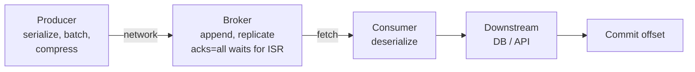
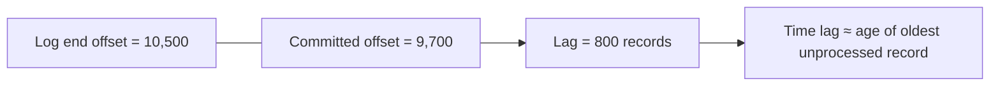

# Performance Tuning, Consumer Lag & Monitoring

!!! abstract "TL;DR"
    - Tune with a method: **define the SLO** (throughput or latency) → **measure** → find the **bottleneck** (producer, broker, network, consumer, downstream) → change **one knob** → re-measure.
    - **Producer throughput:** batching (`linger.ms`, `batch.size`), compression (`lz4`/`zstd`), async sends. **Consumer throughput:** partitions × concurrency, `max.poll.records`, `fetch.min.bytes`, batch processing, and fast downstream calls.
    - **Consumer lag** (log end offset − committed offset) is the #1 application metric. Alert on **lag growth and time-lag**, not just absolute numbers.
    - Broker health: **under-replicated partitions**, **offline partitions**, active controller count, request latency, disk and network.
    - The bottleneck is usually **the consumer's downstream** (DB/API), not Kafka.

## Why it matters

"Lag is growing, what do you do?" and "how did you monitor Kafka?" are near-certain questions for anyone with Kafka on their resume, and lead-level interviewers expect a structured diagnosis.

## Core concepts

### Where time goes


*Notice that end-to-end latency = producer queue + network + replication + consumer fetch wait + processing. Most "Kafka is slow" cases are actually the D box.*

### Tuning levers

| Layer | Throughput ↑ | Latency ↓ |
|---|---|---|
| Producer | `linger.ms` 10–50, `batch.size` 64–256 KB, `lz4`/`zstd`, async | `linger.ms` 0–5, small batches |
| Topic | More partitions (planned), RF 3 | Fewer hops, rack-local reads |
| Consumer | More consumers (≤ partitions), `fetch.min.bytes` ↑, `max.poll.records` ↑, batch DB writes | `fetch.max.wait.ms` ↓, small polls |
| Processing | Batch inserts, async non-blocking I/O, caching (Redis), connection pools | Avoid sync remote calls per record |
| Broker | More brokers/disks, `num.io.threads`, `num.network.threads` | Fast disks, page cache headroom |

### Consumer lag


*Notice that a record count means little without rate. 800 records at 10K/s is 80 ms behind, while 800 at 1/s is 13 minutes. Alert on time lag or a sustained upward trend.*

Lag patterns and what they mean:

| Pattern | Likely cause |
|---|---|
| All partitions rising steadily | Consumers under-provisioned or downstream slow; input spike |
| One partition rising | Stuck record (poison pill/blocking retry) or hot key |
| Sawtooth spikes at deploy times | Rebalances (use cooperative/static membership/KIP-848) |
| Lag flat but high | Consumer group stopped / crashed (no commits) |
| Lag on retry topics | Downstream dependency degraded |

### What to monitor

| Area | Metric | Alert when |
|---|---|---|
| Brokers | `UnderReplicatedPartitions` | > 0 for minutes |
| Brokers | `OfflinePartitionsCount` | > 0 (data unavailable) |
| Brokers | `ActiveControllerCount` (sum) | ≠ 1 |
| Brokers | Request latency p99 (Produce/Fetch), disk usage, network | Trend/threshold |
| Producers | `record-error-rate`, `request-latency-avg`, `buffer-available-bytes` | Errors > 0, buffer near 0 |
| Consumers | `records-lag-max`, time lag, commit rate, rebalance rate | Growth / SLO breach |
| App | Processing time p99, DLT arrival rate, retry topic lag | SLO breach / any DLT on critical flows |

Tools: **Burrow** or **Kafka Lag Exporter**/**kminion** → Prometheus → Grafana; Confluent Control Center; AWS MSK CloudWatch metrics; Micrometer metrics from Spring Kafka (`spring.kafka.listener` / `kafka.consumer.*`).

## In practice: code & configuration

High-throughput consumer with a batch listener and bulk writes:

```yaml
spring:
  kafka:
    consumer:
      max-poll-records: 500
      fetch-min-size: 65536          # wait for 64KB...
      fetch-max-wait: 200ms          # ...or 200ms, whichever first
    listener:
      type: batch
      concurrency: 6
```

```java
@KafkaListener(topics = "claims", batch = "true")
void onBatch(List<ConsumerRecord<String, Claim>> records) {
    try {
        claimRepository.bulkUpsert(records.stream().map(ConsumerRecord::value).toList());  // 1 round-trip, not 500
    } catch (DataAccessException ex) {
        throw new BatchListenerFailedException("bulk upsert failed", ex, 0);
    }
}
```

=== "❌ Common mistake"
    ```java
    @KafkaListener(topics = "claims")
    void on(Claim c) {
        var member = memberApi.get(c.memberId());   // sync HTTP per record, 80ms
        repo.save(enrich(c, member));               // 1 DB round-trip per record
    }                                               // ≈ 10 records/s per thread
    ```

=== "✅ Correct approach"
    ```java
    @KafkaListener(topics = "claims", batch = "true")
    void on(List<Claim> claims) {
        var members = memberCache.getAll(ids(claims));      // Redis multi-get / bulk API
        repo.bulkUpsert(enrichAll(claims, members));        // one batch write
    }
    ```

Command-line checks:

```bash
# Lag per partition
kafka-consumer-groups.sh --bootstrap-server broker:9092 --describe --group claims-loader

# Benchmark producer/consumer throughput
kafka-producer-perf-test.sh --topic perf --num-records 1000000 --record-size 1024 \
  --throughput -1 --producer-props bootstrap.servers=broker:9092 acks=all linger.ms=20 compression.type=lz4
kafka-consumer-perf-test.sh --bootstrap-server broker:9092 --topic perf --messages 1000000
```

## Real-world usage

- **Capacity planning:** teams load-test with the perf-test tools at 2–3× peak, then size partitions and consumers with headroom for replay (consumers must catch up *faster* than the production rate).
- **AWS MSK:** CloudWatch exposes `MaxOffsetLag`, `SumOffsetLag` and `EstimatedMaxTimeLag` per consumer group, which is useful for SLO alerts.
- **Incident pattern:** a slow downstream DB triggers lag, then autoscaling consumers (more pods), then more DB load, then a slower DB. Scale consumers only when the downstream has headroom. Otherwise apply backpressure (pause) and fix the DB.

## Trade-offs & production gotchas

!!! warning "Gotchas"
    - Scaling consumers past the partition count does nothing.
    - Bigger `max.poll.records` without faster processing risks `max.poll.interval.ms` timeouts and rebalance storms.
    - Compression is CPU on producers and consumers, but it usually wins overall (network and disk).
    - Lag alerts on absolute counts are noisy. Use time lag or a growth rate.
    - Catch-up after an outage: consumers must process *above* the input rate. Plan headroom (e.g. 2× normal throughput).

## How this connects to my experience

- **Where I used it:** OptumRx Meteor (750K+ users) Kafka workflows; AWS-based services at Deloitte (CloudWatch).
- **Talking points:**
    - How consumer lag was monitored and alerted on (Grafana/CloudWatch/Splunk?). *[confirm]*
    - A performance issue you diagnosed: slow downstream, batch writes, Redis caching to cut lookups. *[confirm — Redis caching on the resume may tie in]*
- **Likely follow-up chain:** "What metrics did you watch?" → "Lag spiked. What did you do?" → "How many messages per second?" → "How did you load test?"

## Interview questions

### Fundamentals

??? question "Q1. What is consumer lag?"
    **Answer:** The difference between the latest offset in a partition and the group's committed offset: how far behind the consumer is. Combine it with the input rate to get time lag.

??? question "Q2. Key broker metrics to alert on?"
    **Answer:** Under-replicated partitions > 0, offline partitions > 0, active controller count ≠ 1, request latency p99, disk usage, ISR shrink/expand rate, network saturation.

### Intermediate

??? question "Q3. How do you increase producer throughput?"
    **Answer:** Async sends, a larger `batch.size` and `linger.ms`, `lz4`/`zstd` compression, enough partitions to spread load, avoid hot keys, and check that `acks=all` isn't bottlenecked by a slow follower.

??? question "Q4. How do you increase consumer throughput?"
    **Answer:** More consumers up to the partition count, batch processing and bulk writes, caching lookups, non-blocking I/O, tuning `fetch.min.bytes`/`max.poll.records`, and offloading slow failures to retry topics. Add partitions (planned) if parallelism is capped.

??? question "Q5. Lag is high on one partition only. Why?"
    **Answer:** A hot key (skewed traffic), a poison pill or blocking retry stuck on one offset, or a slow consumer instance owning that partition. Inspect the per-partition rate and logs at that offset.

### Senior

??? question "Q6. How would you set up end-to-end latency monitoring?"
    **Answer:** Stamp the event creation time in a header or payload. On consume, record `now - createdAt` as a histogram (Micrometer → Prometheus), per topic and consumer group. Use OpenTelemetry trace propagation through headers for per-message traces. Alert on p99 against the SLO.

??? question "Q7. Design capacity for 3× traffic growth over a year."
    **Answer:** Measure current per-partition and per-consumer throughput, project the peak × 3, and add replay headroom (×2). Derive partitions and consumers. Check broker disk (retention × ingress × RF), network and CPU (compression, TLS). Load-test to validate. Increase partitions early (before key-order-sensitive growth) or create new topics.

### Scenario-based

??? question "Q8. After a 2-hour downstream outage, consumers have 10M records of lag. Plan the recovery."
    **Answer:** Confirm the downstream is healthy and has headroom. Scale consumers up to the partition count. Enable batch processing. Temporarily deprioritise non-critical consumers. Watch the downstream load (rate-limit the catch-up if needed). Track time lag to estimate ETA. Post-incident: pause-on-circuit-open instead of DLQ flooding, and alerts on time lag.

??? question "Q9. Kafka produce latency p99 jumped from 5 ms to 200 ms. Investigate."
    **Answer:** Check ISR shrink (a slow follower with `acks=all`), broker disk I/O or GC, network, partition leadership imbalance (run preferred leader election), a traffic spike or large messages, and producer-side `record-queue-time` (client batching or buffer pressure). Correlate with deploys and broker metrics.

## Cheat sheet

| Concept | Remember |
|---|---|
| Method | SLO → measure → bottleneck → one change → re-measure |
| Usual bottleneck | Consumer's downstream |
| Lag | LEO − committed; alert on time lag/trend |
| Broker alerts | URP > 0, offline > 0, controller ≠ 1 |
| Throughput | Batching + compression + partitions + bulk processing |
| Catch-up | Consumers must exceed the input rate; plan 2× headroom |

## Sources

1. [Apache Kafka documentation: Monitoring](https://kafka.apache.org/documentation/#monitoring).
2. [Apache Kafka: Producer](https://kafka.apache.org/documentation/#producerconfigs) and [Consumer configs](https://kafka.apache.org/documentation/#consumerconfigs).
3. [Confluent: Optimizing Your Apache Kafka Deployment](https://docs.confluent.io/cloud/current/client-apps/optimizing/overview.html).
4. [Amazon MSK: Monitoring consumer lag](https://docs.aws.amazon.com/msk/latest/developerguide/consumer-lag.html).
5. [LinkedIn Burrow](https://github.com/linkedin/Burrow): lag evaluation.
