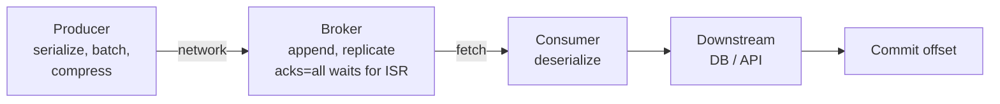
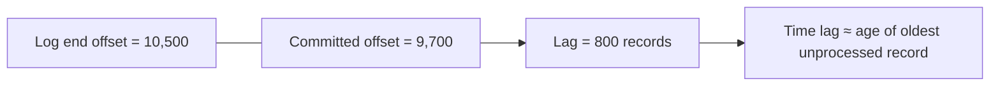

# Performance Tuning, Consumer Lag & Monitoring

!!! abstract "Key takeaways"
    - Tune with a method: **define the SLO** (throughput or latency) → **measure** → find the **bottleneck** (producer, broker, network, consumer, downstream) → change **one knob** → re-measure.
    - **Producer throughput:** batching (`linger.ms`, `batch.size`), compression (`lz4`/`zstd`), async sends. **Consumer throughput:** partitions × concurrency, `max.poll.records`, `fetch.min.bytes`, batch processing, and fast downstream calls.
    - **Consumer lag** (log end offset − committed offset, per partition per group) is the #1 application metric. Alert on **lag growth and time-lag**, not just absolute numbers.
    - Broker health: **under-replicated partitions**, **offline partitions**, active controller count, request latency, disk and network.
    - The bottleneck is usually **the consumer's downstream** (DB/API), not Kafka.

## Why it matters

"Lag is growing, what do you do?" and "how did you monitor Kafka?" are near-certain questions for anyone with Kafka on their resume, and lead-level interviewers expect a structured diagnosis.

## Core concepts

### Where time goes


*Notice that end-to-end latency = producer queue + network + replication + consumer fetch wait + processing. Most "Kafka is slow" cases are actually the D box.*

### Tuning levers

| Layer | Throughput ↑ | Latency ↓ |
|---|---|---|
| Producer | `linger.ms` 10–50, `batch.size` 64–256 KB, `lz4`/`zstd`, async | `linger.ms` 0–5, small batches |
| Topic | More partitions (planned). RF 3 is for durability, not speed | Fewer hops, rack-local reads (follower fetching, `client.rack`) |
| Consumer | More consumers (≤ partitions), `fetch.min.bytes` ↑, `max.poll.records` ↑, batch DB writes | `fetch.max.wait.ms` ↓, small polls |
| Processing | Batch inserts, async non-blocking I/O, caching (Redis), connection pools | Avoid sync remote calls per record |
| Broker | More brokers/disks, `num.io.threads`, `num.network.threads` | Fast disks, page cache headroom |

Defaults worth knowing (Kafka 4.x clients): `batch.size` = 16384 bytes (16 KB), `linger.ms` = **5** (it was 0 before Kafka 4.0, changed by KIP-1030), `compression.type` = `none`, `buffer.memory` = 32 MB, `fetch.min.bytes` = 1, `fetch.max.wait.ms` = 500, `max.poll.records` = 500, `max.poll.interval.ms` = 300000 (5 min), `max.partition.fetch.bytes` = 1 MB. Broker: `num.network.threads` = 3, `num.io.threads` = 8.

A batch is sent when it is full (`batch.size`) **or** `linger.ms` expires, whichever comes first. `batch.size` is an upper bound in bytes, not a record count.

### Consumer lag


*Notice that a record count means little without rate. 800 records at 10K/s is 80 ms behind, while 800 at 1/s is 13 minutes. Alert on time lag or a sustained upward trend.*

Two ways lag is measured, and they can disagree:

- **Broker-side (group lag):** log end offset − **committed** offset. This is what `kafka-consumer-groups.sh`, Burrow, kminion and MSK report. It still works when the consumer is dead.
- **Client-side (`records-lag-max`):** the consumer's own fetch **position** vs the partition end, from the consumer's fetch metrics. It disappears when the consumer stops, so never rely on it alone.

Lag patterns and what they mean:

| Pattern | Likely cause |
|---|---|
| All partitions rising steadily | Consumers under-provisioned or downstream slow; input spike |
| One partition rising | Stuck record (poison pill/blocking retry) or hot key |
| Sawtooth spikes at deploy times | Rebalances (use cooperative/static membership/KIP-848) |
| Lag flat but high | Consumer keeps pace with input but has no spare capacity to catch up a backlog |
| Lag rising at exactly the produce rate, committed offset frozen | Consumer group stopped, crashed or stuck (no commits) |
| Lag on retry topics | Downstream dependency degraded |

### What to monitor

| Area | Metric | Alert when |
|---|---|---|
| Brokers | `UnderReplicatedPartitions` | > 0 for minutes |
| Brokers | `UnderMinIsrPartitionCount` | > 0 (`acks=all` producers are being rejected) |
| Brokers | `OfflinePartitionsCount` | > 0 (data unavailable) |
| Brokers | `ActiveControllerCount` (sum across the cluster; in KRaft it is reported by the controller quorum nodes) | ≠ 1 |
| Brokers | Request latency p99 (Produce/Fetch), disk usage, network | Trend/threshold |
| Producers | `record-error-rate`, `request-latency-avg`, `buffer-available-bytes` | Errors > 0, buffer near 0 |
| Consumers | `records-lag-max`, group lag from the broker side, time lag, `commit-rate`, `rebalance-rate-per-hour`, `poll-idle-ratio-avg` | Growth / SLO breach |
| App | Processing time p99, DLT arrival rate, retry topic lag | SLO breach / any DLT on critical flows |

Tools: **Burrow** or **kminion** (the older **Kafka Lag Exporter** project is no longer actively maintained *[confirm before recommending it]*) → Prometheus → Grafana; Confluent Control Center; AWS MSK CloudWatch metrics; Micrometer metrics from Spring Kafka (`spring.kafka.listener` / `kafka.consumer.*`).

## In practice: code & configuration

High-throughput consumer with a batch listener and bulk writes:

```yaml
spring:
  kafka:
    consumer:
      max-poll-records: 500
      fetch-min-size: 65536          # wait for 64KB...
      fetch-max-wait: 200ms          # ...or 200ms, whichever first
    listener:
      type: batch
      concurrency: 6
```

```java
@KafkaListener(topics = "claims", batch = "true")
void onBatch(List<ConsumerRecord<String, Claim>> records) {
    // 1 round-trip, not 500. If the whole bulk write fails (DB down, timeout), let the
    // exception propagate: DefaultErrorHandler then retries the WHOLE batch per its BackOff.
    claimRepository.bulkUpsert(records.stream().map(ConsumerRecord::value).toList());
}
```

Throw `BatchListenerFailedException` only when you know **which** record is bad. The error handler then commits the records before it, retries from that record, and after retries are exhausted sends only that record to the recoverer (for example a DLT):

```java
@KafkaListener(topics = "claims", batch = "true")
void onBatch(List<ConsumerRecord<String, Claim>> records) {
    for (int i = 0; i < records.size(); i++) {
        try {
            validate(records.get(i).value());
        } catch (ValidationException ex) {                      // your own exception type
            throw new BatchListenerFailedException("invalid claim", ex, i);   // index of the bad record
        }
    }
    claimRepository.bulkUpsert(records.stream().map(ConsumerRecord::value).toList());
}
```

!!! warning "Don't blame record 0 for a whole-batch failure"
    Throwing `new BatchListenerFailedException("bulk upsert failed", ex, 0)` when the database is down tells the error handler that record 0 is the poison pill. After retries it is sent to the DLT and the next record becomes "index 0", so a healthy batch drains into the DLT one record at a time. For a failure that is not tied to one record, rethrow the original exception.

=== "❌ Common mistake"
    ```java
    @KafkaListener(topics = "claims")
    void on(Claim c) {
        var member = memberApi.get(c.memberId());   // sync HTTP per record, 80ms
        repo.save(enrich(c, member));               // 1 DB round-trip per record
    }                                               // ≈ 10 records/s per thread
    ```

=== "✅ Correct approach"
    ```java
    @KafkaListener(topics = "claims", batch = "true")
    void on(List<Claim> claims) {
        var members = memberCache.getAll(ids(claims));      // Redis multi-get / bulk API
        repo.bulkUpsert(enrichAll(claims, members));        // one batch write
    }
    ```

Command-line checks:

```bash
# Lag per partition
kafka-consumer-groups.sh --bootstrap-server broker:9092 --describe --group claims-loader

# Benchmark producer/consumer throughput
kafka-producer-perf-test.sh --topic perf --num-records 1000000 --record-size 1024 \
  --throughput -1 --producer-props bootstrap.servers=broker:9092 acks=all linger.ms=20 compression.type=lz4
kafka-consumer-perf-test.sh --bootstrap-server broker:9092 --topic perf --messages 1000000
```

Version note: from Kafka 4.2 (KIP-1147) `--producer-props` is deprecated in favour of `--command-property`, `--messages` is deprecated in favour of `--num-records`, and the producer perf tool gained `--bootstrap-server`. The older flags above still work in 4.x but print a deprecation warning.

## Real-world usage

- **Capacity planning:** teams load-test with the perf-test tools at 2–3× peak, then size partitions and consumers with headroom for replay (consumers must catch up *faster* than the production rate).
- **AWS MSK:** CloudWatch exposes `MaxOffsetLag`, `SumOffsetLag` and `EstimatedMaxTimeLag` per consumer group, which is useful for SLO alerts.
- **Incident pattern:** a slow downstream DB triggers lag, then autoscaling consumers (more pods), then more DB load, then a slower DB. Scale consumers only when the downstream has headroom. Otherwise apply backpressure (pause) and fix the DB.

## Trade-offs & production gotchas

!!! warning "Gotchas"
    - Scaling consumers past the partition count does nothing.
    - Bigger `max.poll.records` without faster processing risks `max.poll.interval.ms` timeouts and rebalance storms.
    - Compression is CPU on producers and consumers, but it usually wins overall (network and disk).
    - Lag alerts on absolute counts are noisy. Use time lag or a growth rate.
    - Catch-up after an outage: consumers must process *above* the input rate. Plan headroom (e.g. 2× normal throughput).
    - A lagging consumer reads old data that is no longer in the page cache, so the broker does disk reads and can slow down *healthy* producers and consumers on the same broker.
    - If lag in time exceeds `retention.ms`, the unread records are deleted. The consumer then hits `auto.offset.reset` and silently skips data (`latest`) or re-reads (`earliest`).
    - Client-side lag metrics vanish when the consumer dies. Always have a broker-side lag source.

| Option | Pros | Cons | Use when |
|---|---|---|---|
| Larger `linger.ms` / `batch.size` | Fewer, bigger requests; better compression; higher throughput | Adds up to `linger.ms` of latency at low traffic; more memory per partition | Throughput or cost matters more than single-digit-ms latency |
| `zstd` compression | Best ratio, lower network and disk | Most CPU | Bandwidth or storage is the constraint |
| `lz4` compression | Very cheap CPU, decent ratio | Larger than `zstd` | General default for latency-sensitive paths |
| More consumer instances | Linear scaling up to the partition count | Rebalances; more downstream load | Processing is CPU-bound or the downstream has headroom |
| Batch listener + bulk writes | Large gain when I/O-bound | Harder error handling (which record failed?); bigger redelivery on failure | Downstream supports bulk operations and idempotent writes |
| More partitions | Higher parallelism ceiling | Changes key → partition mapping; more files, longer failover and rebalances | Planned growth, ideally before key ordering matters |
| `acks=all` + `min.insync.replicas=2` | No acknowledged data loss on one broker failure | Latency tied to the slowest in-sync follower | Default for business data (it is the producer default since Kafka 3.0) |

## How this connects to my experience

- **Where I used it:** Publicis Sapient, OptumRx Meteor (750K+ users): "Designed Kafka-based event-driven workflows with retry and DLQ handling" and "Implemented Redis-based caching for frequently accessed queries and UI reference data". The resume does not state Kafka performance tuning, lag monitoring or load testing, so treat everything below as a prompt to fill in. *[confirm]*
- **Not Kafka:** the Deloitte ConvergeHealth work was event-driven on AWS with SQS/SNS, not Kafka. The equivalent of consumer lag there is SQS `ApproximateAgeOfOldestMessage` / queue depth; whether CloudWatch alarms were set on these is *[confirm]*.
- **Talking points:**
    - How consumer lag was monitored and alerted on at OptumRx (Grafana/CloudWatch/Splunk?). *[confirm]*
    - A performance issue you diagnosed: slow downstream, batch writes, Redis caching to cut lookups. *[confirm — Redis caching is on the resume for queries and UI reference data; using it inside a Kafka consumer is not stated]*
    - Throughput numbers (messages/sec, partition count, consumer concurrency) for the Meteor topics. *[confirm]*
    - How retry and DLQ topics were monitored (DLT arrival rate, retry-topic lag). *[confirm]*
- **Likely follow-up chain:** "What metrics did you watch?" → "Lag spiked. What did you do?" → "How many messages per second?" → "How did you load test?"

## Interview questions

### Fundamentals

??? question "Q1. What is consumer lag?"
    **Answer:** For one partition and one consumer group, it is the log end offset minus the group's committed offset: how many records the group has not yet processed. It is per partition, so group lag is a sum or max over partitions. A count alone is not enough. Combine it with the consume rate, or measure record timestamps, to get **time lag** (how old the oldest unprocessed record is), which is what the business SLO is about. Note the two sources: broker-side lag (committed offsets, works when the consumer is down) and the client metric `records-lag-max` (the consumer's fetch position, gone when the consumer is gone).

    **Interviewer listens for:** per partition and per group; committed offset vs log end offset; time lag vs record lag; broker-side vs client-side measurement.

    **Common wrong answer:** "Messages in the queue that are not read yet", with no mention of groups or partitions, or treating a fixed number such as 10,000 as "bad" without the rate.

??? question "Q2. Key broker metrics to alert on?"
    **Answer:** Under-replicated partitions > 0 (a follower is behind or a broker is down), under-min-ISR partitions > 0 (`acks=all` producers now fail), offline partitions > 0 (no leader, data unavailable), active controller count ≠ 1 across the cluster, ISR shrink/expand rate (flapping followers), request latency p99 for Produce and Fetch, request handler and network processor idle ratios (thread saturation), disk usage, and network saturation. In KRaft mode there is no ZooKeeper to watch. Instead watch the controller quorum (active controller, metadata lag).

    **Interviewer listens for:** URP, offline partitions and controller count named without prompting; knowing what each one *means*; idle-ratio metrics for saturation.

    **Common wrong answer:** Only host metrics (CPU, memory) with no Kafka-specific signals, or mentioning ZooKeeper metrics for a Kafka 4.x cluster (ZooKeeper mode was removed in 4.0).

### Intermediate

??? question "Q3. How do you increase producer throughput?"
    **Answer:** Send asynchronously with a callback (never block on `send().get()` per record). Raise `linger.ms` and `batch.size` so more records share one request. A batch goes when it is full or when `linger.ms` expires. Turn on `lz4` or `zstd` compression, which works better on bigger batches. Make sure `buffer.memory` is large enough, otherwise `send()` blocks for up to `max.block.ms`. Spread load across enough partitions and avoid hot keys. With `acks=all`, check that a slow follower is not setting the pace. Keep idempotence on (the default since 3.0): it allows up to 5 in-flight requests with ordering preserved, so it does not cost throughput. Then measure with `kafka-producer-perf-test.sh` and watch `batch-size-avg`, `record-queue-time-avg` and `compression-rate-avg`.

    **Interviewer listens for:** batching + compression as the main levers; the full-or-linger rule; async sends; measuring rather than guessing; not trading away `acks=all` casually.

    **Common wrong answer:** "Set `acks=0`" or "add more partitions" as the first move, or believing `batch.size` is a number of records.

??? question "Q4. How do you increase consumer throughput?"
    **Answer:** First find out whether the consumer is fetch-bound or processing-bound. It is almost always processing. Then: more consumers up to the partition count, batch processing with bulk writes, caching lookups, non-blocking or parallel I/O, and moving slow failures to retry topics so they do not block the partition. For the fetch side, raise `fetch.min.bytes` and `max.partition.fetch.bytes`, and tune `max.poll.records` to what one poll loop can finish well inside `max.poll.interval.ms`. If parallelism is capped by the partition count, add partitions (planned, because key mapping changes) or process a partition's records in parallel per key with ordered commits.

    **Interviewer listens for:** diagnosing downstream first; the partition-count ceiling; bulk I/O; awareness that `max.poll.records` is not a throughput knob by itself.

    **Common wrong answer:** "Just add more consumers" with no mention of the partition limit or of the downstream being the real bottleneck.

??? question "Q5. Lag is high on one partition only. Why?"
    **Answer:** A hot key (skewed traffic) sends more to that partition than one consumer can handle. Or a poison pill or blocking retry is stuck on one offset. Or the consumer instance that owns the partition is slow (GC, noisy neighbour, a bad node). Check the per-partition produce rate (skew), whether the committed offset is moving at all (stuck vs slow), and the logs of the owning instance at that offset. Fixes: a better key or key salting for skew, non-blocking retry and DLT for poison pills, replacing the bad instance.

    **Interviewer listens for:** separating "stuck" (offset not moving) from "slow" (moving, but below the input rate); hot key vs poison pill.

    **Common wrong answer:** "Add more consumers". That does not help, because one partition is read by only one consumer in the group.

??? question "Q6. Lag is growing on a consumer group. Walk me through your diagnosis."
    **Answer:** 1) **Scope:** all partitions or one? One group or all groups on the topic? If every group lags, suspect the broker or a produce spike. 2) **Is the consumer alive?** Check group state and whether committed offsets move. `kafka-consumer-groups.sh --describe` shows members, and no owner means no consumer. 3) **Input vs output rate:** did the produce rate jump (campaign, replay, upstream retry storm) or did the consume rate drop? 4) **If the consume rate dropped:** look at processing time p99 and downstream latency (DB, HTTP, cache misses), then rebalance rate (members leaving because of `max.poll.interval.ms`), then errors and retries, then GC and CPU. 5) **Mitigate:** if the downstream has headroom, scale consumers up to the partition count. If the downstream is the bottleneck, do not scale. Fix or protect the downstream, and pause or rate-limit. 6) **Verify:** lag slope turns negative, and estimate the ETA as lag ÷ (consume rate − produce rate). 7) **Follow-up:** alert on time lag, add a capacity test.

    **Interviewer listens for:** a structured order (scope → liveness → rates → downstream → rebalances), not a list of configs; knowing that scaling can make it worse; the ETA formula.

    **Common wrong answer:** Jumping straight to "increase partitions" or "increase `max.poll.records`" without finding the bottleneck.

??? question "Q7. How do you choose the number of partitions for a topic?"
    **Answer:** Start from throughput: partitions ≥ max(target produce rate ÷ measured per-partition produce rate, target consume rate ÷ measured per-consumer rate). The consumer side usually dominates because processing is slower. Add headroom for growth and for catch-up (about 2×), since increasing partitions later changes the key → partition mapping and breaks per-key ordering for existing keys. Then weigh the costs of too many: more open files and memory, longer leader election and recovery, slower rebalances, and less effective batching because each batch is per partition. KRaft raises the cluster-wide limit a lot compared with ZooKeeper, but per-broker cost still applies. Measure with the perf tools instead of guessing.

    **Interviewer listens for:** deriving it from measured throughput; consumer parallelism as the driver; the re-keying problem; costs of over-partitioning.

    **Common wrong answer:** "One partition per consumer" with no numbers, or "more is always better".

### Senior

??? question "Q8. How would you set up end-to-end latency monitoring?"
    **Answer:** Stamp the event creation time in a header or payload (the record timestamp is `CreateTime` by default, but it is the producer's send time, not the business event time). On consume, record `now - createdAt` as a histogram (Micrometer → Prometheus), tagged per topic and consumer group, and record it *after* processing so it includes your own work. Use OpenTelemetry trace propagation through headers for per-message traces. Alert on p99 against the SLO. Watch for clock skew between hosts, and add a synthetic heartbeat message so a silent pipeline (no traffic, so no samples) is still detected.

    **Interviewer listens for:** percentiles, not averages; event time vs send time; clock skew; the "no data" blind spot.

    **Common wrong answer:** "Consumer lag tells me the latency." Lag is a count, and it says nothing about producer-side or processing delay.

??? question "Q9. Design capacity for 3× traffic growth over a year."
    **Answer:** Measure current per-partition and per-consumer throughput, project the peak × 3, and add replay headroom (×2). Derive partitions and consumers from that. Check broker disk (ingress bytes × retention × RF, plus about 30–40% free for reassignments), network (replication multiplies traffic by RF − 1, and consumers add fan-out) and CPU (compression, TLS). Check the downstream too, since it has to take 3× writes. Load-test to validate. Increase partitions early (before key-order-sensitive growth) or create new topics. Size so the cluster still meets the SLO with one broker down.

    **Interviewer listens for:** measured baselines; disk formula with RF and retention; N−1 broker sizing; downstream included in the plan.

    **Common wrong answer:** "Triple the brokers and partitions", with no measurement and no mention of the consumer or downstream.

### Scenario-based

??? question "Q10. After a 2-hour downstream outage, consumers have 10M records of lag. Plan the recovery."
    **Answer:** First check retention: if the backlog is close to `retention.ms`, extend retention on the topic before anything else, or data will be deleted unread. Confirm the downstream is healthy and has headroom. Scale consumers up to the partition count. Enable batch processing if it is safe. Temporarily deprioritise non-critical consumers. Rate-limit the catch-up so the recovering downstream is not knocked over again. Estimate ETA = lag ÷ (consume rate − produce rate). For example, 10M lag with 3K/s consume and 1K/s produce is about 83 minutes. Tell stakeholders whether stale events are still valid (some should be skipped or compacted instead of replayed). Expect extra broker disk I/O, because the old data is out of page cache. Post-incident: pause the container when the circuit opens instead of flooding the DLQ, and alert on time lag.

    **Interviewer listens for:** retention risk; the ETA calculation; protecting the downstream; idempotent processing on replay; business handling of stale events.

    **Common wrong answer:** "Reset offsets to latest" (data loss) or "scale to 50 consumers" on a 12-partition topic.

??? question "Q11. Kafka produce latency p99 jumped from 5 ms to 200 ms. Investigate."
    **Answer:** Split the time first. On the client: `record-queue-time-avg`/`-max` (time waiting in the accumulator: batching, `linger.ms`, buffer pressure) vs `request-latency-avg` (broker round-trip). On the broker, the Produce request metrics break `TotalTimeMs` into `RequestQueueTimeMs` (I/O threads saturated), `LocalTimeMs` (leader disk append), `RemoteTimeMs` (waiting for followers, which is the `acks=all` cost), `ResponseQueueTimeMs` and `ResponseSendTimeMs` (network threads). High `RemoteTimeMs` plus ISR shrinks points to a slow follower. High `LocalTimeMs` points to disk I/O. High queue time points to thread saturation or GC. Also check leadership imbalance (run preferred leader election), a traffic spike or large messages, quota throttling (`produce-throttle-time-avg`), and correlate with deploys, config changes and broker restarts.

    **Interviewer listens for:** client vs broker split; the request time breakdown; linking `acks=all` to follower replication time; correlation with changes.

    **Common wrong answer:** "Restart the broker" or "increase `linger.ms`", which changes configs before locating where the 200 ms is spent.

??? question "Q12. Autoscaling added consumers during a lag spike and the lag got worse. Why, and what would you change?"
    **Answer:** Three likely reasons. 1) The bottleneck was the downstream (DB or API). More consumers sent more concurrent load, so it got slower. 2) Each scale event triggers a rebalance. With the eager protocol every consumer stops, and even with cooperative rebalancing partitions move and in-flight work is redone, so frequent scaling means constant churn. 3) The group was already at the partition count, so extra pods sat idle. Changes: scale on lag *and* downstream health, cap replicas at the partition count, add a cooldown or stabilisation window (for example KEDA's Kafka scaler with `lagThreshold` and a cooldown), use cooperative rebalancing with static membership or the KIP-848 protocol (`group.protocol=consumer`, GA in Kafka 4.0), and apply backpressure (pause the listener, circuit breaker) when the downstream is degraded.

    **Interviewer listens for:** the positive-feedback loop; rebalance cost of scaling; partition ceiling; backpressure as the alternative.

    **Common wrong answer:** "Scale even more" or "the autoscaler threshold was too high".

## Cheat sheet

| Concept | Remember |
|---|---|
| Method | SLO → measure → bottleneck → one change → re-measure |
| Usual bottleneck | Consumer's downstream |
| Lag | LEO − committed; alert on time lag/trend |
| Broker alerts | URP > 0, under-min-ISR > 0, offline > 0, controller ≠ 1 |
| Defaults (4.x) | `linger.ms` 5, `batch.size` 16 KB, `max.poll.records` 500, `fetch.max.wait.ms` 500 |
| Catch-up ETA | lag ÷ (consume rate − produce rate) |
| Batch errors | Known bad record → `BatchListenerFailedException(index)`; otherwise rethrow and the whole batch is retried |
| Throughput | Batching + compression + partitions + bulk processing |
| Catch-up | Consumers must exceed the input rate; plan 2× headroom |

## Sources

1. [Apache Kafka documentation: Monitoring](https://kafka.apache.org/documentation/#monitoring): broker, producer and consumer metric names.
2. [Apache Kafka: Producer](https://kafka.apache.org/documentation/#producerconfigs) and [Consumer configs](https://kafka.apache.org/documentation/#consumerconfigs): property names and defaults.
3. [Apache Kafka: Upgrade notes](https://kafka.apache.org/42/getting-started/upgrade/): `linger.ms` default 0 → 5 in 4.0; perf-test flag deprecations in 4.2.
4. [Confluent: Optimizing Your Apache Kafka Deployment](https://docs.confluent.io/cloud/current/client-apps/optimizing/overview.html): throughput vs latency vs durability tuning.
5. [Spring for Apache Kafka: Handling Exceptions](https://docs.spring.io/spring-kafka/reference/kafka/annotation-error-handling.html): `BatchListenerFailedException` and whole-batch retry fallback.
6. [Amazon MSK: Monitoring consumer lag](https://docs.aws.amazon.com/msk/latest/developerguide/consumer-lag.html): `MaxOffsetLag`, `SumOffsetLag`, `EstimatedMaxTimeLag`.
7. [LinkedIn Burrow](https://github.com/linkedin/Burrow): lag evaluation.
