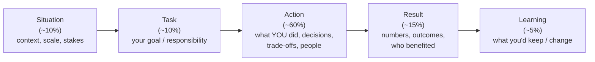
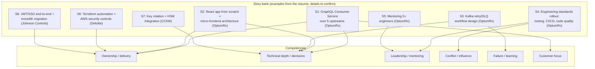

# STAR Framework & Building a Story Bank

!!! abstract "Key takeaways"
    - **STAR** = **Situation** (brief context) → **Task** (your responsibility or goal) → **Action** (what **you** did, step by step, most of the time) → **Result** (measurable outcome). Add **L**earning (**STAR-L**) for senior roles: what you'd repeat or change.
    - **Time split** for a 2–3 minute answer: S+T ≈ 20%, **A ≈ 60%**, R+L ≈ 20%. Interviewers score the **Action**: decisions, trade-offs, influence, how you handled people.
    - **Say "I" for your actions, "we" for the team's.** Quantify results (latency, defects, delivery dates, team growth). Where you don't have exact numbers, give an honest estimate and **say it's an estimate**.
    - **Build a story bank:** 8–12 real stories, each mapped to several competencies (ownership, leadership, conflict, failure, customer focus, technical depth, delivery under pressure, mentoring, hiring, influence without authority). One story can answer many questions.
    - **Prepare follow-ups:** "What would you do differently?", "What was the hardest part?", "How did others react?", "What did the data show?" Interviewers drill down 2–4 levels.

## Why it matters

For Lead and Senior roles, behavioural rounds are often **equal in weight to technical rounds**. Amazon-style "bar raiser" loops, leadership-principle interviews and hiring-manager rounds all use STAR-style probing. Candidates with strong technical answers often fail here because they are **vague** ("we improved performance"), **hide their own role** ("we did everything"), **ramble through the situation**, or **can't go deeper**. A prepared story bank turns this into a repeatable skill.

## Core concepts

### STAR, with time allocation


*Notice where the weight is. The Action is where the interviewer finds evidence of competencies, so a long Situation at the expense of the Action is the most common mistake.*

{ loading=lazy }
*Watch the Action segment: same answer length, three times as much evidence for the interviewer to score.*

| Part | Good | Weak |
|---|---|---|
| Situation | "A healthcare app with 750K+ users. Our GraphQL layer aggregated 5 upstream systems, and p95 latency was hurting the main screen." | Five minutes of company history |
| Task | "I owned the service end to end and had to bring latency within target before the release." | "The team had to fix it." |
| Action | "I profiled the resolvers, found N+1 calls, introduced batching, proposed Redis caching for reference data, and aligned with the architect on TTLs…" | "We optimised things." |
| Result | "p95 dropped from X to Y *[confirm]*, and upstream call volume fell by about Z% *[confirm]*." | "It was much better." |
| Learning | "I'd add load tests to CI earlier, so this shows up before release." | "Nothing, it went great." |

### What interviewers listen for

- **Ownership:** you drove it and didn't wait to be told.
- **Judgement:** you considered options and trade-offs.
- **Influence:** you aligned people without just using authority.
- **Self-awareness:** honest about mistakes and growth.
- **Impact:** a measurable, meaningful result.
- **Level-appropriate scope:** team-level for Senior, cross-team or org-level for Lead/Staff.

### Building the story bank

1. **List raw material** from each role: launches, incidents, conflicts, migrations, hires, mentoring, mistakes, difficult stakeholders, process changes.
2. **Write each as STAR-L bullets** (not scripts): 3–5 bullets per section, including numbers.
3. **Map each story to competencies** in a matrix. Aim for each competency to have **2+ stories** and each story to cover **3+ competencies**.
4. **Prepare 2 levels of follow-up** per story (hardest part, what you'd change, how you measured).
5. **Practise aloud**, timed to 2–3 minutes, then cut the Situation down.

{ loading=lazy }
*Notice that each follow-up maps to a field in the worksheet below. If a field is empty, that is where the interview will stall.*


*Notice that every story connects to several competencies, so you need fewer stories than questions. The stories come from real resume bullets. The details (numbers, conflicts, mistakes) are yours to fill in.*

### Story bank matrix (fill in)

| # | Story (resume source) | Ownership | Leadership | Conflict | Failure | Tech depth | Customer | Hiring/mentoring |
|---|---|---|---|---|---|---|---|---|
| S1 | GraphQL Consumer Service, 5 upstreams | ✓ | | *[confirm conflict?]* | | ✓ | ✓ | |
| S2 | React app from scratch + micro-frontends | ✓ | ✓ | *[confirm]* | | ✓ | ✓ | |
| S3 | Kafka workflows with retry/DLQ | ✓ | | | *[confirm incident?]* | ✓ | | |
| S4 | Engineering standards (testing, CI/CD, quality) | ✓ | ✓ | ✓ *[confirm pushback]* | | | | ✓ |
| S5 | Mentoring 5+ engineers | | ✓ | | | | | ✓ |
| S6 | Hiring: technical interviews | | ✓ | | | | | ✓ |
| S7 | Production support / an incident | ✓ | | | ✓ *[confirm]* | ✓ | ✓ | |
| S8 | Terraform automation, AWS security (Deloitte) | ✓ | | | | ✓ | | |
| S9 | Key rotation + HSM (CCKM) | ✓ | | | | ✓ | ✓ | |
| S10 | JWT/SSO end-to-end + monolith migration (JCI) | ✓ | | | *[confirm]* | ✓ | | |

**Your to-do:** for each row, write the real numbers, the hardest moment, one thing you'd change, and any conflict or failure. **Never invent.** If a story lacks a conflict, don't add one. Pick a different story for conflict questions.

## In practice: code & configuration

The same story told badly and well (a template using resume facts, with specifics to confirm):

=== "❌ Common mistake"
    ```text
    "So at Publicis Sapient we were working on the OptumRx project, which is a big
    pharmacy project for Optum, which is part of UnitedHealth... [2 minutes of context]...
    and we had performance issues so we did some optimisation with caching and stuff,
    and the team worked really hard and it got much faster. Everyone was happy."
    - No personal action, no decisions, no numbers, no learning, all context.
    ```

=== "✅ Correct approach"
    ```text
    S: "On OptumRx Meteor, a healthcare app with 750K+ users, I owned the GraphQL Consumer
        Service, which aggregated 5 upstream systems for multiple consumers."
    T: "The main screens were slow, and upstream teams were worried about our call volume.
        I needed to fix latency without overloading them." [confirm the actual trigger]
    A: "First I measured: tracing per resolver showed repeated per-item upstream calls (N+1).
        I introduced batching with DataLoader, then proposed Redis caching for reference
        data and frequently repeated queries. I agreed TTLs with the upstream owners and
        architects so freshness rules were explicit. I added per-upstream timeouts so one
        slow system couldn't stall the whole response. I paired with two engineers to roll
        it out and added dashboards." [confirm specifics]
    R: "Main-screen p95 went from ~X to ~Y and upstream calls dropped by ~Z%." [confirm]
    L: "Next time I'd put load tests in CI from day one so regressions surface earlier."
    ```

**Worksheet per story (copy this):**

```yaml
story: S1 GraphQL Consumer Service
competencies: [ownership, technical-depth, customer-focus, influence]
situation: "<1-2 lines: product, scale, stakes>"
task: "<your responsibility / goal / constraint>"
actions:
  - "<what you did first and why>"
  - "<key decision + alternatives considered>"
  - "<how you brought people along>"
  - "<how you handled a setback>"
result: "<numbers + who benefited>  [confirm]"
learning: "<what you'd repeat / change>"
follow_ups:
  hardest_part: "<…>"
  do_differently: "<…>"
  how_measured: "<…>"
```

## Real-world usage

- **Amazon** maps behavioural questions to its 16 Leadership Principles and expects STAR answers with data. "Bar raisers" probe several follow-up levels.
- **Google** uses structured behavioural questions ("Googleyness and leadership") with rubrics. Many companies use competency matrices (ownership, collaboration, technical leadership, communication) per level.
- **Indian product companies and consultancies** (Publicis Sapient, Deloitte and similar) commonly run a hiring-manager round and a leadership/culture round for Lead roles, focused on team leadership, stakeholder management and delivery.
- **Common failure patterns** reported by interviewers: answers without "I", no numbers, blaming others, generic "best practice" talk instead of a real story, and an inability to name a failure.

## Trade-offs & production gotchas

| Choice | Pros | Cons |
|---|---|---|
| Fully scripted answers | Polished | Sound rehearsed. Break under follow-ups |
| Bullet-point stories | Natural, adaptable | Need practice to stay concise |
| One flagship story for everything | Deep familiarity | Repetitive. Interviewers notice |
| 8–12 story bank | Coverage and variety | Preparation time |
| Precise numbers | Credible | Must be true and defensible |
| Honest estimates ("roughly 40%") | Credible if labelled | Vague if overused |

!!! warning "Gotchas"
    - **Never invent or inflate.** Experienced interviewers drill into details, and fabricated stories collapse. If you don't know a number, say how you'd measure it or give a labelled estimate.
    - **Don't trash others** (previous managers, teammates, architects). Describe the disagreement neutrally.
    - **Keep confidential details out** (client internals, patient data). Describe the scale and pattern, not secrets.
    - **Match the level:** Lead-level stories should show influence beyond your own code (team, cross-team, standards).

## How this connects to my experience

- **Where I used it:** the resume gives strong raw material:
    - 8–10 engineer team leadership.
    - 5+ engineers mentored.
    - Technical interviews.
    - Sprint planning, estimation, stakeholder communication, release management, production support.
    - The GraphQL service over 5 upstreams.
    - The React app from scratch + micro-frontends.
    - Kafka retry/DLQ.
    - Engineering standards.
    - Terraform + AWS security.
    - CCKM key rotation + HSMs.
    - JWT/SSO + monolith migration.
- **Talking points:**
    - Build the bank from the 10 rows above. Each needs your real numbers and moments. *[confirm all]*
    - Pick **two failure stories** and **two conflict stories** that genuinely happened. These are the categories most candidates lack. *[confirm]*
    - Prepare one **cross-team influence** story (with architects or upstream teams) for Lead-level signal. *[confirm]*
- **Likely follow-up chain:** "Tell me about a time you led a technical initiative." → "What pushback did you get?" → "How did you measure success?" → "What would you do differently?" Have the answer to each level written in the worksheet.

## Interview questions

### Fundamentals

??? question "Q1. Tell me about a time you took ownership of something outside your job description."
    **Answer structure:** S: a gap nobody owned (for example flaky deployments, or missing standards). T: you decided to fix it. A: how you scoped it, got buy-in and delivered it while keeping your main work going. R: the measurable improvement. L: how you made it sustainable (handed over, documented).

    **Interviewer listens for:** initiative, follow-through, impact beyond your role.

    **Common wrong answer:** "My manager asked me to…" (that's assigned work).

??? question "Q2. Describe a project you're most proud of."
    **Answer structure:** Choose a flagship story (the GraphQL Consumer Service or React + micro-frontends *[confirm]*). Explain why it mattered (users, business), your specific decisions, the hardest problem, the results, and what you learned. Keep it to 3 minutes. Offer to go deeper on architecture.

    **Interviewer listens for:** a clear personal contribution and why you're proud of it.

    **Common wrong answer:** listing technologies.

??? question "Q3. How do you structure answers to behavioural questions?"
    **Answer:** STAR-L: brief context and task, most of the time on my actions and decisions, a measurable result, and what I learned. I say "I" for my actions and credit the team for theirs.

    **Interviewer listens for:** a conscious structure (asked sometimes as a warm-up).

    **Common wrong answer:** "I just tell the story".

??? question "Q4. Give an example of a goal you didn't meet."
    **Answer structure:** A real miss (a date, a performance target). Own your part. Explain how you communicated early, what you changed (plan, scope, approach), the eventual outcome, and the lesson you've applied since. *[confirm a real example]*

    **Interviewer listens for:** ownership without excuses, plus learning.

    **Common wrong answer:** "I always meet my goals".

### Intermediate

??? question "Q5. Tell me about a time you had to make a decision with incomplete information."
    **Answer structure:** S/T: a deadline or incident with unknowns. A: what you knew and didn't, how you reduced risk (a spike, a reversible choice, a feature flag), who you consulted, how you decided. R: the outcome. L: how you'd judge the risk next time (one-way vs two-way door).

    **Interviewer listens for:** judgement, reversibility thinking.

    **Common wrong answer:** waiting for perfect information.

??? question "Q6. Tell me about a time you influenced without authority."
    **Answer structure:** For example, aligning upstream teams or architects on a caching or API contract change *[confirm]*. A: data you gathered, how you framed it in their interests, the prototype or proposal, the compromise reached. R: adoption. L: what made it work.

    **Interviewer listens for:** persuasion through data and empathy.

    **Common wrong answer:** "I escalated to my manager".

??? question "Q7. Describe a time you simplified something complex."
    **Answer structure:** A design or process that was over-complex. Your analysis, what you removed or standardised, how you brought the team along, and the result (faster onboarding, fewer bugs).

    **Interviewer listens for:** pragmatism.

    **Common wrong answer:** "I rewrote it from scratch".

??? question "Q8. Tell me about a time you had to deliver bad news to a stakeholder."
    **Answer:** Structure: what the news was (a slip, a defect, a risk) → **when you found out and how fast you told them** → the facts and impact in one sentence → the options you brought (cut scope, move date, add a workaround) with a recommendation → what you did to stop it happening again → how the relationship looked afterwards. Pick a real example from the Meteor or CCKM work where you surfaced a delay or risk early. *[confirm]*

    **Interviewer listens for:** telling early, options rather than only problems, ownership without blame, a follow-up that rebuilt trust.

    **Common wrong answer:** A story where the stakeholder found out from someone else first, or where the bad news was blamed on another team.

### Senior

??? question "Q9. Tell me about the biggest technical risk you managed."
    **Answer structure:** A risk at Lead scope (an upstream dependency, a migration, security). How you identified it, quantified it, mitigated it (fallbacks, phased rollout, monitoring), and communicated it to stakeholders. The result.

    **Interviewer listens for:** risk management, not heroics.

    **Common wrong answer:** a last-minute firefight with no prevention.

??? question "Q10. How do you show impact when you lead rather than write most of the code?"
    **Answer:** Through team outcomes I enabled:
    - delivery predictability
    - quality (escaped defects, incident rate)
    - engineers' growth (promotions, ownership)
    - standards adopted
    - architecture decisions that held up

    Then give a specific story with metrics. *[confirm]*

    **Interviewer listens for:** a leader's view of impact.

    **Common wrong answer:** "I still wrote 70% of the code".

### Scenario-based

??? question "Q11. The interviewer keeps asking 'and what did YOU do?' What does that mean, and how do you respond?"
    **Answer:** They aren't hearing your personal contribution. Switch to first person and specifics: "I made the call to…", "I wrote the proposal…", "I paired with…". Name decisions and alternatives. Acknowledge the team's work separately.

    **Interviewer listens for:** adapting quickly.

    **Common wrong answer:** repeating "we".

??? question "Q12. You're asked about a competency you have no story for (e.g. firing someone). What do you do?"
    **Answer:** Be honest: "I haven't had to do that directly. The closest is…" Then give a related story (for example a difficult performance conversation handled with your manager) and explain how you'd approach the situation, step by step. Never fabricate.

    **Interviewer listens for:** honesty plus transferable judgement.

    **Common wrong answer:** inventing a story.

## Cheat sheet

| Item | Remember |
|---|---|
| STAR-L | Situation, Task (≈20%) → **Action (≈60%)** → Result + Learning (≈20%) |
| Length | 2–3 minutes. Offer to go deeper |
| Voice | "I" for your actions, "we" for the team's |
| Results | Numbers (latency, defects, dates, people). Labelled estimates if needed |
| Bank | 8–12 stories × competency matrix. 2+ stories per competency |
| Must-have | 2 failures, 2 conflicts, 1 cross-team influence, 1 mentoring, 1 incident |
| Follow-ups | Hardest part, do differently, how measured, others' reactions |
| Never | Invent, blame, ramble on context, reveal confidential data |

## Sources
1. [Amazon Jobs: Interviewing at Amazon (STAR method, Leadership Principles)](https://www.amazon.jobs/content/en/how-we-hire/interview-prep).
2. [Google re:Work: Use structured interviewing](https://rework.withgoogle.com/en/guides/hiring-use-structured-interviewing): behavioural question design and rubrics.
3. Gayle Laakmann McDowell, *Cracking the PM / Coding Interview*: behavioural preparation grids.
4. Will Larson, *Staff Engineer: Leadership beyond the management track*: how impact is assessed at senior levels.
5. [The Muse / MIT CAPD: The STAR method](https://capd.mit.edu/resources/the-star-method-for-behavioral-interviews/).
