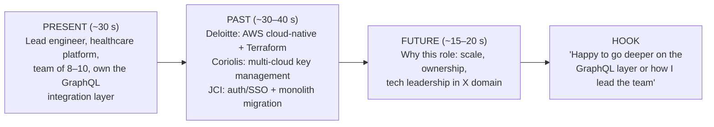
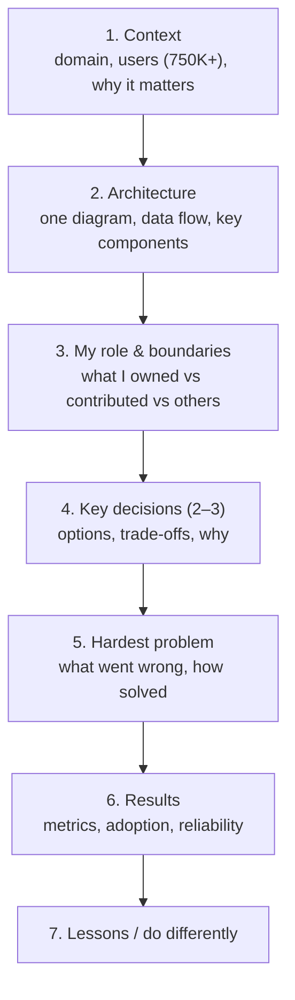
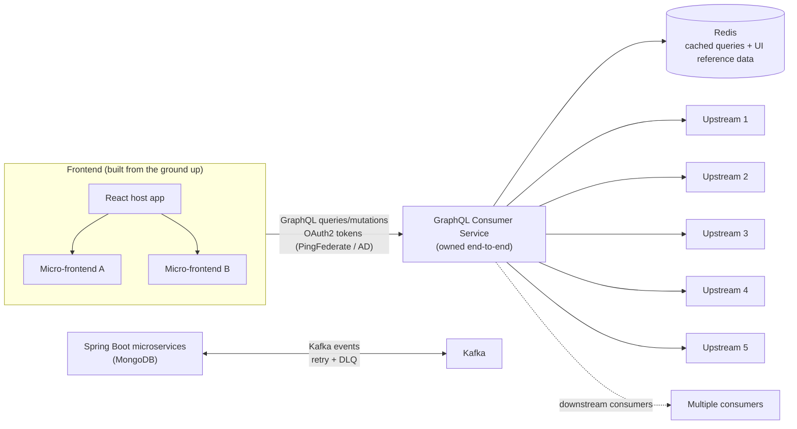

# "Tell Me About Yourself" & Project Deep-Dive Narrative (OptumRx Meteor)

!!! abstract "TL;DR"
    - **"Tell me about yourself" is your 60–90 second pitch**, and it sets the agenda for the interview. Structure: **Present** (role, scope, what you own) → **Past** (2–3 career highlights that build to now) → **Future** (why this role, what you want to do next). Close with a **hook** that invites a follow-up on your strongest story.
    - **Tailor the emphasis:**
        - Hiring manager: leadership + delivery.
        - Tech round: architecture + depth.
        - HR: motivation + fit.

        The facts stay the same.
    - **The project deep dive** (often 20–40 minutes) follows a narrative arc:
        - **context** (domain, users, scale)
        - **architecture** (one diagram)
        - **your role and boundaries**
        - **2–3 key decisions** with trade-offs
        - **the hardest problem**
        - **results**
        - **what you'd do differently**
    - **For OptumRx Meteor**, the resume supports these facts: 750K+ users, an 8–10 engineer cross-functional team, **end-to-end ownership of the GraphQL Consumer Service** integrating **5 upstream systems** with multiple downstream consumers, Java/Spring Boot/Kafka/MongoDB/Redis/GraphQL microservices, Redis caching, OAuth2/PingFederate/AD security, Kafka retry/DLQ workflows, a ReactJS app built from the ground up with micro-frontends, and engineering standards. **Everything else (numbers, specific incidents, decisions) is *[confirm]*.**
    - **Never claim more than you did.** Separate "I owned / I designed" from "I contributed to / the team built / the architects decided".

## Why it matters

This is the **first question** in most interviews, and the project deep dive is often the **longest technical conversation**. A crisp, confident opening frames you as a technical lead and steers the interviewer towards your strongest material. A rambling or chronological life story wastes the first impression. In the deep dive, interviewers check **depth and authenticity**: whether you really understood and drove the system.

## Core concepts

### The present → past → future structure


*Notice the narrative thread: each past role adds a capability (cloud, security, auth) that shows up in the current role. The hook hands the interviewer an easy next question about your best story.*

### Draft pitch (resume facts only)

> "I'm a Lead Software Engineer with 9+ years building cloud-native platforms in healthcare, banking and cloud security, mostly with Java, Spring Boot, Kafka, GraphQL, AWS and React.
>
> Right now, at Publicis Sapient, I lead a cross-functional team of 8–10 engineers on OptumRx Meteor, a healthcare application with 750K+ users. I own the GraphQL Consumer Service end to end, which is the integration layer between 5 upstream systems and multiple downstream consumers. I also built the React application from the ground up and set up its micro-frontend architecture, and I set the team's standards for testing, CI/CD and code quality.
>
> Before that, at Deloitte, I built AWS microservices (Lambda, ECS, EKS, API Gateway, DynamoDB, SQS) with Terraform for a healthcare data platform. At Coriolis, I worked on CipherTrust Cloud Key Management: multi-cloud key rotation and HSM integrations. I started at Johnson Controls, where I owned JWT authentication and SSO end to end and helped migrate a monolith to microservices.
>
> I'm an AWS Certified Solutions Architect. I'm looking for a role where I can [*tailor: lead the architecture of a high-scale platform / grow a team / go deeper into distributed systems*]. Happy to go deeper into the GraphQL integration layer or how I run the team."

**Variants:**

| Audience | Emphasise | Trim |
|---|---|---|
| Hiring manager / EM | Team leadership, delivery, stakeholders, mentoring, hiring | Technology lists |
| Architect / tech panel | GraphQL over 5 upstreams, Kafka retry/DLQ, caching, security, cloud | Process details |
| HR / recruiter | Career progression, motivation, domain, location/notice | Deep technical content |
| Startup / product | Ownership end to end, building from scratch (React app), speed | Enterprise processes |

### The project deep-dive arc


*Notice that the arc moves from **what** to **why** to **what I learned**. Interviewers usually interrupt at steps 2–5, so have the diagram and two decisions ready to discuss in depth.*

### OptumRx Meteor: architecture as supported by the resume


*Notice that this diagram contains only what the resume states: a React shell with micro-frontends, the GraphQL layer over 5 upstreams with Redis, OAuth2/PingFederate/AD, Kafka workflows with retry/DLQ, and Spring Boot + MongoDB microservices. The upstream names, exact data flows and which services emit which events are **[confirm]**. Redraw it with the real details before interviews.*

**Deep-dive talking points to prepare** (each is *[confirm]* for specifics):

1. **Why GraphQL as the integration layer:** different consumers needed different shapes of data from 5 systems. One schema, client-driven queries, and a single place for auth, caching and resilience.
2. **Performance:** N+1 across upstreams → batching (DataLoader), per-upstream timeouts, parallel resolution, Redis for reference data and repeated queries, cache TTLs agreed with data owners.
3. **Resilience:** a slow or failing upstream → timeouts, circuit breakers, partial responses with field-level errors instead of a failed page.
4. **Security:** OAuth2 tokens from PingFederate (AD-backed), validated in the service, with field- or resource-level authorisation for PHI.
5. **Event-driven workflows:** Kafka with retries and DLQ, idempotent consumers, replay procedures.
6. **Frontend:** why micro-frontends (independent team delivery, domain boundaries), shared design system, how the host composes them (module federation or similar *[confirm]*), and their trade-offs (bundle duplication, versioning).
7. **Team and process:** how you split ownership across 8–10 engineers, standards (tests, CI/CD, code review), and release management.

## In practice: code & configuration

=== "❌ Common mistake"
    ```text
    "So I did my B.Tech in ... then in 2017 I joined Johnson Controls as a GET where I
    worked on Metasys which is a building management product ... then in 2018 I moved
    to Coriolis ... [chronological for 4 minutes] ... and currently I'm at Publicis
    Sapient. I know Java, Spring Boot, Kafka, React, AWS, Azure, Kubernetes, Docker,
    Terraform, MongoDB, PostgreSQL, MySQL, Redis, DynamoDB ..."
    - Chronological, too long, a technology dump, no ownership, no hook.
    ```

=== "✅ Correct approach"
    ```text
    Present (lead, scope, ownership) → Past (3 highlights that build to now)
    → Future (why this role) → Hook ("happy to go deeper on X").
    60–90 seconds, practised aloud, numbers only where you're sure.
    ```

**Deep-dive preparation sheet (fill in):**

```yaml
project: OptumRx Meteor (Publicis Sapient, Jan 2023 – present)
facts_from_resume:
  users: "750K+"
  team: "8–10 engineers, backend + frontend + QA"
  owned: "GraphQL Consumer Service end-to-end (5 upstreams → multiple consumers)"
  built: "ReactJS app from the ground up; micro-frontend architecture"
  stack: [Java, Spring Boot, Kafka, MongoDB, Redis, GraphQL, React, OAuth2, PingFederate, AD]
  patterns: ["Redis caching for frequent queries + UI reference data", "Kafka retry + DLQ"]
  practices: ["testing", "CI/CD", "code quality", "deployment standards"]
confirm_before_interview:
  upstream_systems: "<names/domains of the 5>"
  traffic: "<peak RPS / daily requests>"
  latency_before_after: "<p95 numbers>"
  cache_hit_ratio: "<%>"
  key_decision_1: "<e.g. DataLoader + caching; alternatives; why>"
  key_decision_2: "<e.g. micro-frontend split; alternatives; why>"
  hardest_problem: "<incident or design challenge>"
  what_id_change: "<honest lesson>"
  my_boundaries: "<what architects decided vs what I decided>"
```

## Real-world usage

- **Interviewers form an impression in the first few minutes.** A crisp opener frames the rest of the conversation, and many interviewers pick their first deep-dive question from your hook.
- **Deep dives are standard** at product companies ("walk me through a system you built") and in lead and architect loops. They often include drawing the architecture and defending decisions.
- **Consulting backgrounds** (Publicis Sapient, Deloitte) need clear **role boundaries**, because client projects involve many parties. State what you owned and decided versus what client architects or other vendors did.
- **Confidentiality:** describe client systems at the level of pattern and scale. Don't reveal internal names, data or security details beyond what's public.

## Trade-offs & production gotchas

| Choice | Pros | Cons |
|---|---|---|
| Chronological story | Easy to tell | Long. Buries current scope |
| Present-past-future | Puts your strongest current role first, clear narrative | Needs practice |
| Technology list | Covers keywords | Sounds junior. No ownership signal |
| Ending with a hook | Steers the interview | Must be ready for that deep dive |
| One deep-dive project | Depth | Have a backup (Deloitte AWS or CCKM) for variety |

!!! warning "Gotchas"
    - **Don't overclaim architecture ownership.** The resume says you "collaborated with senior architects", so own your service and your decisions, and credit the architects' platform decisions.
    - **Don't read the resume aloud.** Interpret it: why each step mattered.
    - **Keep PHI and client secrets out.**
    - **Watch the clock:** 90 seconds for the pitch. Offer depth instead of forcing it.

## How this connects to my experience

- **Where I used it:** this page *is* the experience narrative. Every factual statement above comes from the resume:
    - Publicis Sapient/OptumRx Meteor (Jan 2023–present).
    - Deloitte/ConvergeHealth Data Asset Explorer (Jun 2021–Jan 2023).
    - Coriolis/CCKM (Jul 2018–Jun 2021).
    - Johnson Controls/Metasys (Aug 2017–Jul 2018).
    - AWS Certified Solutions Architect – Associate (2023).
- **Talking points:**
    - Fill in the `confirm_before_interview` block with real numbers and decisions. *[confirm]*
    - Prepare a **backup deep dive** on Deloitte (AWS + Terraform + Elasticsearch + Personalize) or CCKM (key rotation + HSM) in case the interviewer wants something different. *[confirm details]*
    - Decide on the **"future" sentence** for each target company (domain, scale, leadership scope).
- **Likely follow-up chain:** "Draw the architecture." → "Why GraphQL instead of a REST BFF?" → "How did you handle an upstream being down?" → "What would you change?" Have the diagram, the trade-off (consumer flexibility vs complexity/caching), resilience patterns, and an honest lesson ready.

## Interview questions

### Fundamentals

??? question "Q1. Tell me about yourself."
    **Answer:** Use the 60–90 second present → past → future → hook pitch above, tailored to the audience. Practise it until it sounds conversational, not memorised.

    **Interviewer listens for:** clarity, current scope, a coherent narrative, motivation.

    **Common wrong answer:** a 5-minute chronological history.

??? question "Q2. Walk me through your current project."
    **Answer:** Context (healthcare, 750K+ users) → one architecture diagram → my role (owner of the GraphQL Consumer Service, team lead, React + micro-frontends) → 2 key decisions → the hardest problem → results *[confirm]* → lessons.

    **Interviewer listens for:** structure, depth, role clarity.

    **Common wrong answer:** a list of microservices and tools.

??? question "Q3. What exactly was your role vs the architects'?"
    **Answer:** "The senior architects owned the platform-level direction [confirm specifics]. I owned the GraphQL Consumer Service end to end: schema design, resolvers, upstream integration, caching, resilience and delivery. I collaborated with the architects on API strategy and integration patterns, and led my team's implementation."

    **Interviewer listens for:** honest boundaries.

    **Common wrong answer:** claiming you designed everything.

??? question "Q4. Why are you looking for a change?"
    **Answer:** Positive and forward-looking: the scope you want next (larger architecture ownership, product company scale, a specific domain), and what you've achieved where you are. No complaints about the current employer. *[tailor per company]*

    **Interviewer listens for:** motivation that matches the role.

    **Common wrong answer:** "salary" or criticising the employer.

### Intermediate

??? question "Q5. Why GraphQL for the integration layer?"
    **Answer:** Multiple consumers needed different shapes of data from 5 upstreams. GraphQL gives one schema, client-driven selection (no over- or under-fetching), and a single place for auth, caching, batching and resilience. The trade-offs: caching is harder than REST, N+1 risk, and query-cost control. You mitigate with DataLoader, persisted queries and complexity limits *[confirm what was used]*.

    **Interviewer listens for:** the trade-off, not hype.

    **Common wrong answer:** "GraphQL is modern".

??? question "Q6. What was the hardest problem on the project?"
    **Answer:** A real one *[confirm]*: for example upstream latency and N+1, an upstream outage, cache consistency for reference data, or micro-frontend integration issues. Explain the diagnosis, the options, your decision, the result and the lesson.

    **Interviewer listens for:** technical depth and personal action.

    **Common wrong answer:** "nothing was really hard".

??? question "Q7. Why micro-frontends, and would you do it again?"
    **Answer:**
    - **Benefits:** independent delivery by domain teams, clear ownership, incremental upgrades.
    - **Costs:** shared dependency and version management, bundle duplication, UX consistency, an integration testing burden.
    - **Would I again?** Yes when several teams own distinct domains. A modular monolith frontend for one team. *[confirm the actual motivation and outcome]*

    **Interviewer listens for:** a balanced reflection.

    **Common wrong answer:** "always the best architecture".

### Senior

??? question "Q8. If you rebuilt Meteor's integration layer today, what would you change?"
    **Answer:** A thoughtful but honest list, for example:
    - contract tests with upstreams from day one
    - persisted queries and cost limits earlier
    - better observability per resolver and upstream
    - schema governance/federation if more teams join
    - load tests in CI

    *[confirm which apply]*

    **Interviewer listens for:** self-critique and growth.

    **Common wrong answer:** "nothing, it was perfect".

??? question "Q9. How did you lead 8–10 people while owning a critical service?"
    **Answer:** Delegated by ownership areas, kept the critical architecture decisions and reviews, paired on the hardest parts, used standards and automation to scale quality, and protected focus time. Give an example of a delegation that grew someone. *[confirm]*

    **Interviewer listens for:** a balance of IC and leadership work.

    **Common wrong answer:** "I did the hard parts myself".

### Scenario-based

??? question "Q10. The interviewer says 'skip the overview, tell me one decision you'd defend'."
    **Answer:** Pick one decision (for example caching reference data in Redis with agreed TTLs and per-upstream timeouts) and explain the problem, options (no cache, client cache, Redis, upstream changes), the decision criteria (freshness, load, latency, ownership), the risks and mitigations, and the outcome *[confirm]*.

    **Interviewer listens for:** decision quality.

    **Common wrong answer:** returning to the overview.

??? question "Q11. You can't share client details under NDA. How do you still give a strong deep dive?"
    **Answer:** Describe the domain generically ("a pharmacy benefits platform"), the scale (users, number of upstreams), the patterns and decisions, and anonymised metrics. Say upfront that you're keeping client specifics confidential. Interviewers respect this.

    **Interviewer listens for:** professionalism.

    **Common wrong answer:** refusing to discuss the project at all, or oversharing.

## Cheat sheet

| Item | Remember |
|---|---|
| Pitch | Present → past → future → hook. 60–90 s |
| Present | Lead, 8–10 engineers, 750K+ users, owner of the GraphQL Consumer Service (5 upstreams), React + MFEs, standards |
| Past | Deloitte AWS + Terraform. Coriolis CCKM key rotation + HSM. JCI JWT/SSO + monolith migration |
| Future | Tailored: scope, scale, domain, leadership |
| Deep dive | Context → diagram → role → 2–3 decisions → hardest problem → results → lessons |
| Boundaries | "I owned / I decided" vs "collaborated with architects" |
| Confirm | Upstream names, traffic, latency numbers, hit ratio, decisions, hardest problem |
| Never | Overclaim, read the resume aloud, share PHI or client secrets |

## Sources
1. [Harvard Business Review: How to answer "Tell me about yourself"](https://hbr.org/2021/11/how-to-answer-tell-me-about-yourself-in-a-job-interview).
2. [Amazon Jobs: interview preparation (deep dives, STAR)](https://www.amazon.jobs/content/en/how-we-hire/interview-prep).
3. Gergely Orosz, *The Software Engineer's Guidebook*: describing impact and projects at senior levels.
4. Will Larson, *Staff Engineer*: telling the story of technical leadership.
5. Resume: `Vishal_Hulawale_Resume_10012026.pdf` (source of every factual claim on this page).
