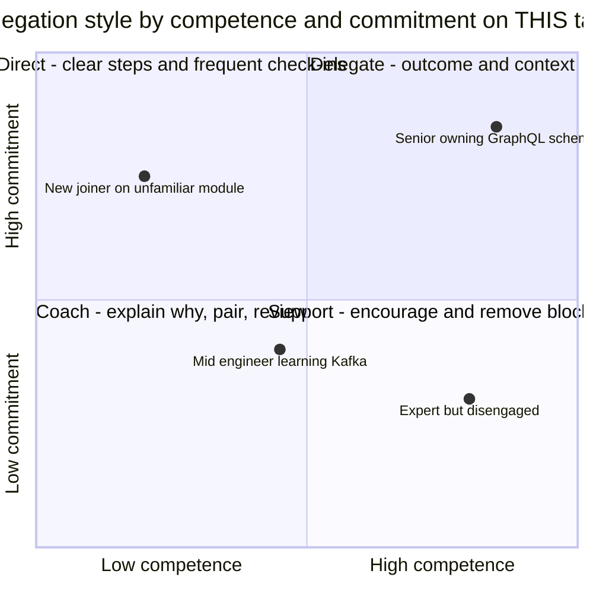
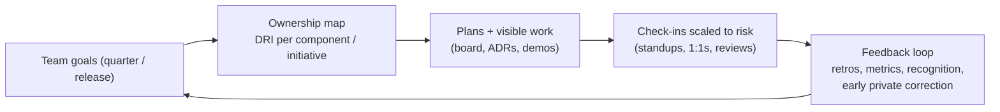

# Leading a Team of 8–10: Delegation, Ownership, Accountability

!!! abstract "Key takeaways"
    - **A tech lead's job is team output, not personal output.** Success means the team delivers predictably, with quality, and **people grow**. Your own code is one input among several.
    - **Delegation:** match **how much you hand over** to each person's **task-relevant maturity**. Direct a newcomer on an unfamiliar task, coach a growing engineer, support or delegate fully to an expert. Delegate **outcomes + context + constraints**, not step-by-step instructions.
    - **Ownership:**
        - One **directly responsible individual (DRI)** per component or initiative. Component ownership maps (who owns the GraphQL schema, which micro-frontend, the CI pipeline).
        - **RACI** for cross-functional decisions.
        - Written decisions (ADRs).
    - **Accountability without micromanagement:**
        - clear expectations
        - visible work (board, demos)
        - lightweight check-ins tied to risk
        - blameless retros
        - addressing misses early and privately
    - **Health signals:**
        - delivery predictability
        - DORA metrics (lead time, deploy frequency, change-failure rate, time to restore)
        - escaped defects
        - on-call load
        - review turnaround
        - **people signals** (engagement, growth, attrition risk)

## Why it matters

"How do you lead your team?" is the central question for Lead and Tech Lead roles. Interviewers probe whether you **scale yourself** (delegation, standards, growing others) or **bottleneck** the team (reviewing everything, doing the hard parts yourself), and whether you can hold people accountable while keeping trust. The resume claims leadership of **8–10 engineers across backend, frontend and QA**, so expect detailed follow-ups.

## Core concepts

### Delegation by task-relevant maturity


*Notice that style depends on the **person and the task**. The same senior engineer may need directing on an unfamiliar domain (security) and full delegation on their own area. Situational Leadership (Hersey–Blanchard) and Andy Grove's "task-relevant maturity" describe this.*

**How to delegate well:**

1. **Outcome:** what done looks like (acceptance criteria, quality bar, date).
2. **Context:** why it matters, constraints, who's affected.
3. **Authority:** which decisions they can make alone and which need review.
4. **Check-ins:** proportional to risk (daily for a newcomer on a critical path, weekly for experts).
5. **Support:** an offer to pair, plus escalation paths.
6. **Credit:** they present the result.

**What to keep:**

- Decisions with cross-team or architectural impact.
- Unblocking.
- Hiring and performance input.
- The most ambiguous problems **early**, then hand them over once they're shaped.

### Ownership and accountability


*Notice that accountability is a **system**, not pressure: clear owners plus visible progress plus regular feedback. Problems show up early, and nobody needs to be micromanaged.*

| Tool | Use |
|---|---|
| DRI per component | GraphQL schema & resolvers, each micro-frontend, Kafka consumers, CI/CD pipeline, test strategy |
| RACI | Cross-functional decisions (release go/no-go: R = tech lead, A = delivery manager, C = QA lead, I = stakeholders) |
| ADRs | Record decisions and their owners, so the "why" survives turnover |
| Working agreements | Review SLAs, Definition of Done, on-call rules, meeting norms |
| 1:1s | Growth, blockers, feedback both ways (weekly/bi-weekly) |

### Team rituals (Agile) and what a lead adds

- **Sprint planning:** capacity-aware commitments, with the lead flagging risks and dependencies (upstream teams).
- **Standups:** focus on flow and blockers, not status theatre.
- **Backlog refinement:** split work so it can be delegated, and add technical tasks and tech debt.
- **Reviews and demos:** engineers present their work (visibility and credit).
- **Retros:** blameless, with **action items that have owners**.
- **Release management:** checklists, feature flags, go/no-go criteria, rollback plans.

### Balancing hands-on work and leadership

- With 8–10 people, expect **30–50% coding at most**. Prefer **non-critical-path** code, prototypes, reviews and pairing, so you don't block the team.
- Protect maker time (meeting-free blocks), and batch reviews twice a day.
- **Anti-patterns:**
    - The hero lead who takes all the hard tickets.
    - The bottleneck reviewer.
    - The absent lead who only manages tickets.
    - Avoiding feedback conversations.

## In practice: code & configuration

Answer templates (STAR skeletons drawn from resume facts, specifics to confirm):

=== "❌ Common mistake"
    ```text
    Q: "How do you lead your team?"
    A: "I'm very hands-on. I take the most complex tasks myself so quality is good, I review
       every PR, and I make sure everyone updates the board daily. If someone is late I
       escalate to the manager."
    - Hero / bottleneck lead, control instead of growth, escalation instead of ownership.
    ```

=== "✅ Correct approach"
    ```text
    S: "On OptumRx Meteor I led 8–10 engineers across backend, frontend and QA on a healthcare
        app with 750K+ users."
    T: "Deliver features predictably while I also owned the GraphQL Consumer Service, which
        meant I couldn't be the bottleneck."
    A: "I set up an ownership map: a DRI for the GraphQL schema, one per micro-frontend, and
        one for the Kafka consumers [confirm]. I delegated by experience: seniors got outcomes
        and constraints, newer engineers paired with me first. We wrote down standards
        (Definition of Done, review SLAs, testing expectations) so quality didn't depend on me
        reviewing everything. I kept cross-team decisions and the riskiest design work, and
        ran weekly 1:1s."
    R: "Sprint predictability improved from ~X% to ~Y% [confirm]; two engineers grew into
        component owners [confirm]; review turnaround dropped [confirm]."
    L: "I learned to hand over ambiguous problems earlier, once they're shaped, instead of
        finishing them myself."
    ```

A one-page **team operating model** to describe in interviews:

```yaml
team: OptumRx Meteor squad (8–10: backend, frontend, QA)   # [confirm composition]
ownership:
  graphql-consumer-service: "<DRI>"        # I owned end-to-end; deputy for continuity
  react-host + micro-frontends: "<DRIs>"
  kafka-workflows: "<DRI>"
  ci-cd + quality-gates: "<DRI>"
cadence:
  planning: "bi-weekly, capacity-based"     # [confirm]
  standup: "15 min, flow + blockers"
  one-on-ones: "weekly / bi-weekly"
  retro: "every sprint, owned actions"
quality:
  definition_of_done: [tests, review, docs, monitoring]
  review_sla: "< 1 working day"             # [confirm]
metrics: [sprint predictability, escaped defects, lead time, change failure rate]
```

## Real-world usage

- **Google's Project Oxygen** found that good managers coach, empower without micromanaging, care about well-being, are results-oriented, communicate well, support career development, have a clear vision and have key technical skills. These are the same traits interviewers probe in tech leads.
- **DORA research** links lead time, deployment frequency, change-failure rate and time to restore with organisational performance. Leads use them to discuss delivery health without blaming individuals.
- **Team Topologies** (stream-aligned teams, clear ownership, limited cognitive load) shapes how leads split ownership across components.
- **Common failure modes:** a lead who stays the top individual contributor and becomes the bottleneck, unclear ownership ("everyone owns it, nobody owns it"), and accountability conversations postponed until a crisis.

## Trade-offs & production gotchas

| Choice | Pros | Cons |
|---|---|---|
| Lead takes the hardest work | Fast short-term | Bottleneck, team doesn't grow, bus factor |
| Delegate everything | Growth, scale | Quality and alignment risk without check-ins |
| Strict process | Predictable | Bureaucracy, low autonomy |
| Light process + strong ownership | Autonomy, speed | Needs mature engineers and clear goals |
| Individual metrics | Easy to measure | Gaming, damages collaboration |
| Team metrics (DORA, outcomes) | Encourage collaboration | Less visibility into individual issues (use 1:1s) |

!!! warning "Gotchas"
    - **Don't use metrics to judge individuals publicly.** Use them to improve the system.
    - **Accountability conversations happen early and privately,** with specifics (SBI). Not in standups, and not first at appraisal time.
    - **A deputy for every critical component** (your own included) avoids single points of failure in people.
    - **As a tech lead without formal reporting lines,** know where your authority ends: involve the people manager in performance and HR matters.

## How this connects to my experience

- **Where I used it:**
    - "Led Agile teams of 8–10 engineers across backend, frontend, and QA functions."
    - "Led sprint planning, estimation, stakeholder communication, release management, and production support."
    - "Led a cross-functional team of 8–10 engineers delivering enterprise healthcare applications serving 750K+ users" (OptumRx).
    - "Established engineering standards around testing, CI/CD, code quality, and deployment practices."
- **Talking points:**
    - "I scale myself through ownership and standards: DRIs per component, written standards, automation in CI, so quality doesn't depend on me reviewing every line." *[confirm]*
    - "I stay hands-on in the GraphQL service and cross-team design, but I delegate feature work and pair to grow people." *[confirm balance]*
    - **One concrete delegation story** where someone grew (they took over a component or led a feature). *[confirm]*
    - **One accountability story** where a commitment slipped and you handled it constructively. *[confirm]*
- **Likely follow-up chain:** "How do you delegate?" → "Tell me about someone who struggled with a delegated task." → "How do you know your team is healthy?" → "How much do you code?" Answer: maturity-based delegation → a coaching story → predictability, quality, DORA and people signals → the percentage and what kind of code.

## Interview questions

### Fundamentals

??? question "Q1. How do you lead your team day to day?"
    **Answer:** Clear goals and an ownership map, delegation matched to experience, rituals that surface risk early (planning, standups focused on blockers, retros), weekly 1:1s, written standards, and staying hands-on in design, reviews and the riskiest areas without being the bottleneck. Give the OptumRx example. *[confirm]*

    **Interviewer listens for:** a system, not heroics.

    **Common wrong answer:** "I assign tasks and track them".

??? question "Q2. How do you decide what to delegate and to whom?"
    **Answer:** Based on task-relevant maturity and growth goals. Experts get outcomes plus constraints. Growing engineers get coaching and pairing with more check-ins. Newcomers get clear steps and a buddy. I keep cross-team or irreversible decisions and early shaping of ambiguous work.

    **Interviewer listens for:** a situational approach.

    **Common wrong answer:** "whoever is free".

??? question "Q3. How much do you code as a lead?"
    **Answer:** Enough to stay credible and close to the system, typically 30–50% with 8–10 people. That means prototypes, the hardest design spikes, non-critical-path work, reviews and pairing. I avoid owning critical-path tickets that would block others when meetings pull me away.

    **Interviewer listens for:** awareness of the bottleneck risk.

    **Common wrong answer:** "80%, I'm the best coder".

??? question "Q4. How do you ensure accountability without micromanaging?"
    **Answer:** Clear expectations (DoD, dates), DRIs, visible work, check-ins proportional to risk, early private feedback using SBI, recognition, and blameless retros for system issues. People own commitments and flag risks early because it's safe to do so.

    **Interviewer listens for:** psychological safety plus standards.

    **Common wrong answer:** "daily status reports".

### Intermediate

??? question "Q5. Tell me about a time a delegated task went wrong."
    **Answer structure:** S/T: what was delegated, and to whom. A: how you noticed (check-in, review), how you helped without taking it back (pairing, narrowing scope, unblocking), and the conversation you had. R: delivered or re-planned. L: what you changed in how you delegate (clearer acceptance criteria, earlier check-in). *[confirm a real example]*

    **Interviewer listens for:** support, not rescue.

    **Common wrong answer:** "I took it back and did it myself".

??? question "Q6. How do you measure your team's health?"
    **Answer:** Delivery (predictability, lead time, deployment frequency), quality (change-failure rate, escaped defects, incidents, time to restore), and people (engagement in 1:1s, workload and on-call balance, growth, retention risk). Trends over time, discussed with the team, never used to rank individuals.

    **Interviewer listens for:** a balanced set of metrics.

    **Common wrong answer:** "velocity".

??? question "Q7. How do you handle a team member who disagrees with your technical direction?"
    **Answer:** Invite the disagreement early, ask for their reasoning and data, consider a spike or prototype, write the trade-offs into an ADR, and decide (or escalate if it's beyond your authority). Once decided, commit together. If they were right, say so publicly. (See [conflict](05-handling-conflict-and-technical-disagreements.md).)

    **Interviewer listens for:** openness plus decisiveness.

    **Common wrong answer:** "I'm the lead, so my decision stands".

??? question "Q8. How do you set priorities and goals for your team?"
    **Answer:** Start from the product and platform goals for the quarter, then agree a short list of team outcomes (two or three), not a long task list. Make trade-offs explicit: what we will **not** do this quarter. Break the outcomes into milestones with owners, review progress weekly, and re-plan when something important changes. Keep a fixed share of capacity for support and tech debt so it doesn't silently eat the plan. *[confirm]*

    **Interviewer listens for:** outcomes over tasks, explicit trade-offs, owners, a review rhythm, protected capacity for support and debt.

    **Common wrong answer:** "My manager gives me the priorities and I assign tickets." That describes dispatching work, not leading.

### Senior

??? question "Q9. How do you onboard a new engineer so they're productive quickly?"
    **Answer:** A buddy, an onboarding doc and environment setup automation, a first good-first-issue within days, architecture walkthroughs, pairing on real work, gradually growing ownership with a 30/60/90-day plan, and feedback at each milestone.

    **Interviewer listens for:** structured onboarding.

    **Common wrong answer:** "they read the wiki".

??? question "Q10. How do you avoid becoming the single point of failure for your own service?"
    **Answer:** Name a deputy owner, write runbooks and ADRs, rotate on-call and reviews, pair on complex changes, and ask others to lead some incidents and releases with you as backup. Measure the bus factor.

    **Interviewer listens for:** a deliberate knowledge spread.

    **Common wrong answer:** "I'm always available".

### Scenario-based

??? question "Q11. Two seniors on your team both want to own the same high-visibility feature. What do you do?"
    **Answer:**
    1. Understand each person's motivation (growth area, visibility).
    2. Look for a split with clear ownership boundaries (for example the API vs the frontend experience), or a rotation (one leads this release, the other the next).
    3. Assign by growth goals and fairness, and explain it transparently.
    4. Make sure the other gets an equally meaningful opportunity.
    5. Recognise both publicly.

    **Interviewer listens for:** fairness, growth and transparency.

    **Common wrong answer:** "first come, first served".

??? question "Q12. Velocity dropped 30% over three sprints. How do you respond?"
    **Answer:** Investigate before reacting:
    - scope churn
    - unplanned work (production support, incidents)
    - tech debt friction
    - upstream dependency delays
    - attrition, onboarding
    - morale

    Look at the data (board, incidents), talk in 1:1s and the retro. Then act on causes: protect focus, negotiate scope, pay down debt, fix the process. Communicate the plan to stakeholders.

    **Interviewer listens for:** diagnosis over pressure.

    **Common wrong answer:** "ask everyone to work harder".

## Cheat sheet

| Item | Remember |
|---|---|
| Goal | Team outcomes + people growth, not personal output |
| Delegation | By task-relevant maturity: direct → coach → support → delegate. Outcome + context + authority |
| Ownership | DRI per component, deputies, RACI for cross-functional decisions, ADRs |
| Accountability | Clear expectations, visible work, risk-scaled check-ins, early private SBI feedback |
| Rituals | Planning, standups (blockers), refinement, demos (engineers present), retros (owned actions) |
| Hands-on | 30–50%, off the critical path, reviews + pairing + spikes |
| Health | Predictability, DORA, escaped defects, on-call load, engagement |
| Anti-patterns | Hero lead, bottleneck reviewer, absent lead, delayed feedback |

## Sources
1. Andy Grove, *High Output Management*: task-relevant maturity, leverage, one-on-ones.
2. Hersey & Blanchard, *Situational Leadership* model.
3. Camille Fournier, *The Manager's Path*: tech lead responsibilities, delegation, team health.
4. [Google re:Work: Project Oxygen (manager behaviours)](https://rework.withgoogle.com/en/guides/managers-identify-what-makes-a-great-manager).
5. [DORA: Four key metrics (State of DevOps research)](https://dora.dev/guides/dora-metrics-four-keys/).
6. Matthew Skelton & Manuel Pais, *Team Topologies*: ownership and cognitive load.
7. Resume: `Vishal_Hulawale_Resume_10012026.pdf` (leadership highlights, OptumRx role).
