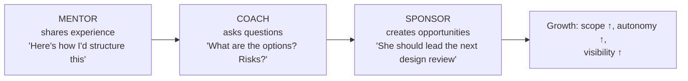
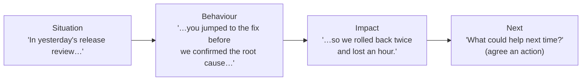

# Mentoring & Growing Engineers

!!! abstract "TL;DR"
    - **Three modes:**
        - **Mentoring:** share your experience and advice ("here's how I'd approach it").
        - **Coaching:** ask questions so they find the answer ("what options do you see?").
        - **Sponsoring:** spend your credibility to create opportunities and visibility for them ("I recommend Priya to lead the migration").

        Senior leaders do all three, and sponsorship is the most under-used.
    - **Growth starts from their goals:** a short **growth plan** with 1–3 focus areas tied to the **career ladder** (scope, autonomy, technical depth, influence), concrete **stretch assignments**, and regular check-ins.
    - **Use everyday work as the classroom:**
        - **Code reviews** that explain the *why* and link to standards.
        - **Design reviews** where they present.
        - **Pairing** on hard problems.
        - **Leading** incidents and releases with backup.
    - **Feedback:** frequent, specific, kind and actionable. **SBI** (Situation, Behaviour, Impact) for positive and corrective feedback. Praise in public, correct in private.
    - **Measure growth by outcomes:** larger scope owned, decisions made independently, others learning from them, promotions. Not by how many hours you spent mentoring.

## Why it matters

The resume claims "**Mentored 5+ engineers** through code reviews, design reviews, and technical coaching". Lead-level interviews test whether you **multiply** the team's capability. Expect "tell me about someone you mentored", "how do you give tough feedback?" and "how do you grow a mid-level engineer to senior?", with follow-ups on what changed for that person.

## Core concepts

### Mentor, coach, sponsor


*Notice the progression: mentoring transfers knowledge, coaching builds their own judgement, and sponsorship gives them the **stage** to prove it. Many engineers stall because nobody sponsors them, even when they're coached well.*

| Mode | When | Example |
|---|---|---|
| Mentoring | Knowledge gap, new domain | Explain Kafka consumer-group rebalancing and our retry/DLQ design |
| Coaching | They have the knowledge but are building judgement | "What would you do if the upstream times out? What are the trade-offs?" |
| Sponsoring | They're ready for more scope | Recommend them to own a micro-frontend or to present a design to the architects |
| Teaching through structure | Team-wide gaps | Brown-bags, guilds, written standards, review checklists |

### A lightweight growth plan

```yaml
engineer: "<name>"          # mid-level backend → senior
goal: "Own a service end-to-end and lead its design"
focus_areas:
  - technical: "Resilience patterns for upstream calls (timeouts, breakers, caching)"
  - scope: "Own the Kafka consumer workflow incl. on-call runbook"
  - influence: "Present one design review to the architects this quarter"
stretch_assignment: "Lead the retry/DLQ redesign with me as reviewer"
support: ["weekly pairing hour", "reading list", "shadow two incident commanders"]
evidence_of_growth: ["design doc approved", "led incident review", "mentors a newer engineer"]
check_in: "monthly in 1:1; adjust plan"
```

### Reviews as teaching

- **Code review:**
    - Explain the *why* ("this blocks the event loop because…"), link to the standard or doc.
    - Separate **must-fix** from **nit/optional**.
    - Ask questions instead of dictating where judgement is involved.
    - Praise good solutions.
    - Respond quickly (an SLA), because slow reviews hurt learning.
- **Design review:** let them present and defend. Ask "what would make this fail?", "what did you consider and reject?". Coach before the meeting, not in front of others.
- **Pairing:** driver/navigator. Let them drive on your expertise area, and you drive on theirs.

### Feedback with SBI


*Notice that SBI describes **observable behaviour and its impact**, not personality ("you're careless"). That makes the feedback actionable and less defensive. The same structure works for praise.*

### Growing different levels

| From → to | Focus | Typical stretch |
|---|---|---|
| Junior → mid | Independence on well-defined tasks, testing, debugging | Own a feature end to end with a buddy |
| Mid → senior | Ambiguity, design, operational ownership, reviewing others | Lead a component's design + on-call. Mentor a junior |
| Senior → lead/staff | Cross-team influence, technical strategy, multiplying others | Drive a cross-team standard or migration. Present to architects |

## In practice: code & configuration

=== "❌ Common mistake"
    ```text
    Q: "Tell me about mentoring."
    A: "I help everyone. Juniors come to me with doubts and I fix their code quickly.
       In reviews I rewrite their code so it's correct. I've mentored many people."
    - Rescuing, not growing; no specific person, plan, or outcome; reviews as rewrites.
    ```

=== "✅ Correct approach"
    ```text
    S: "On OptumRx I mentored 5+ engineers through code reviews, design reviews and coaching.
        One mid-level backend engineer wanted to grow towards senior." [confirm person/level]
    T: "My goal was for them to own a service area end to end, not just tickets."
    A: "We agreed a growth plan with two focus areas: resilience design and operational
        ownership. I paired with them on our upstream-client timeouts and caching, then
        had them lead the Kafka retry/DLQ change with me as reviewer. I coached them before
        the design review instead of correcting them in it, and sponsored them to present
        to the architects. In reviews I separated must-fix from nits and explained the why."
        [confirm]
    R: "They became the owner of that workflow, led an incident review, and later mentored a
        newer engineer [confirm outcome / promotion]."
    L: "I learned to hand over the stage earlier. Sponsorship moved them faster than more
        advice would have."
    ```

## Real-world usage

- **Career ladders** (open-source examples from Dropbox, GitLab and Rent the Runway, plus progression.fyi) define expectations per level. Mentors use them to make growth plans concrete.
- **Sponsorship gap:** research and industry reports show under-represented engineers often receive mentoring but less sponsorship. Deliberate sponsorship (stretch assignments, visibility) is a leadership responsibility.
- **Engineering guilds and brown-bags** scale mentoring beyond 1:1. Written standards and review checklists turn repeated advice into team knowledge.
- **Failure modes:** "mentoring" that means doing their work, feedback saved for appraisal time, and only mentoring people similar to yourself.

## Trade-offs & production gotchas

| Approach | Pros | Cons |
|---|---|---|
| Fix their code for them | Fast now | No learning, dependency on you |
| Pure coaching (questions only) | Builds judgement | Frustrating when they lack basics, so mix with mentoring |
| Stretch assignments | Fast growth, visible | Delivery risk, so add a safety net (reviewer, scope) |
| Formal growth plans | Clear direction | Overhead. Keep them to one page |
| Group mentoring (guilds, talks) | Scales | Less personal |

!!! warning "Gotchas"
    - **Don't mentor only the people you like or who resemble you.** Distribute stretch opportunities fairly.
    - **Respect the reporting line:** as a tech lead, coordinate growth plans with the people manager.
    - **Avoid public correction** in reviews and meetings. Keep review comments about the code, not the person.
    - **Make growth visible** to their manager (written notes, achievements). This is a big part of sponsorship.

## How this connects to my experience

- **Where I used it:**
    - "Mentored 5+ engineers through code reviews, design reviews, and technical coaching" (Leadership highlights).
    - "Established engineering standards around testing, CI/CD, code quality" (OptumRx), which scales mentoring through standards.
    - "Conducted technical interviews" (calibrating what "good" looks like).
- **Talking points:**
    - **Story 1:** growing an engineer into a component owner (growth plan, stretch, sponsorship, outcome). *[confirm person, level, outcome]*
    - **Story 2:** a difficult feedback conversation using SBI and how the behaviour changed. *[confirm]*
    - **Story 3:** scaling mentoring through standards: review checklists, a testing guide, a brown-bag on GraphQL/DataLoader or Kafka retry patterns. *[confirm what was run]*
- **Likely follow-up chain:** "Tell me about someone you mentored." → "What was hard?" → "How did you know it worked?" → "Have you had a mentoring relationship that failed?" Answer: the specific person and plan → resistance or confidence issues → scope and independence outcomes → an honest example and what you changed. *[confirm]*

## Interview questions

### Fundamentals

??? question "Q1. Tell me about an engineer you mentored. What changed for them?"
    **Answer structure:** Their starting point and goal, the plan (focus areas, stretch assignment), your methods (pairing, coaching, reviews, sponsorship), and the concrete outcome (owned X, led Y, promoted). What you learned as a mentor. *[confirm]*

    **Interviewer listens for:** an outcome for the person, not your effort.

    **Common wrong answer:** "I helped many people with doubts".

??? question "Q2. Mentoring vs coaching vs sponsoring?"
    **Answer:** Mentoring shares experience and advice, coaching asks questions to build their judgement, and sponsoring uses your influence to create opportunities and visibility for them. I use all three depending on the gap.

    **Interviewer listens for:** knowing sponsorship.

    **Common wrong answer:** treating them as synonyms.

??? question "Q3. How do you use code reviews to grow people?"
    **Answer:** Explain the why and link to standards, separate must-fix from nits, ask questions where judgement is involved, praise good work, respond quickly, and turn repeated comments into a checklist or lint rule. For big gaps, pair instead of writing 40 comments.

    **Interviewer listens for:** teaching, not gatekeeping.

    **Common wrong answer:** "I rewrite it correctly in the comments".

??? question "Q4. How do you give constructive feedback?"
    **Answer:** Promptly, privately, with SBI (situation, behaviour, impact), then ask for their view and agree a next step. I balance it with genuine positive feedback and follow up later to recognise improvement.

    **Interviewer listens for:** a structure plus follow-up.

    **Common wrong answer:** "I tell them directly what they did wrong".

### Intermediate

??? question "Q5. How would you grow a mid-level engineer to senior?"
    **Answer:** Map against the ladder: gaps are usually ambiguity handling, design, operational ownership and influence. Give a stretch assignment (own a component's design and on-call), coach through the design doc and review, sponsor visibility (present to architects), and have them mentor someone. Review monthly.

    **Interviewer listens for:** a ladder-based plan.

    **Common wrong answer:** "give them harder tickets".

??? question "Q6. A mentee keeps asking you for answers instead of thinking it through. What do you do?"
    **Answer:** Shift to coaching: "what have you tried? What are two options?" Agree a norm (spend 30 minutes, write down the options, then come to me). Praise independent attempts. Make sure they have the basics (docs, a pairing session) so the questions aren't a knowledge gap.

    **Interviewer listens for:** building independence kindly.

    **Common wrong answer:** "I stop helping them".

??? question "Q7. How do you mentor people on a different stack from yours (e.g. frontend vs backend)?"
    **Answer:** Focus on transferable skills (design, debugging, ownership, communication), pair them with a domain expert for stack depth, and use my cross-stack experience (I built the React app and the backend services) to help with integration and architecture. *[confirm]*

    **Interviewer listens for:** knowing your limits.

    **Common wrong answer:** "I only mentor backend".

??? question "Q8. How do you know your mentoring is working?"
    **Answer:** Look for changes in **behaviour and scope**, not hours spent: the person makes decisions you used to make, their designs need fewer review rounds, they own an area end to end, others start asking them for help, they mentor someone in turn. Agree the goal and a few signals at the start, check them in 1:1s every month or two, and ask the mentee directly what is and isn't helping. *[confirm]*

    **Interviewer listens for:** agreed goals, observable signals, regular check-ins, mentee feedback, the mentee eventually mentoring others.

    **Common wrong answer:** "They said the sessions were useful." Satisfaction is not growth.

### Senior

??? question "Q9. How do you scale mentoring when you lead 8–10 people?"
    **Answer:** Standards and checklists (repeated advice becomes documentation), guild sessions and brown-bags, pairing rotations, senior engineers mentoring juniors (mentoring the mentors), growth plans in 1:1s, and stretch assignments planned into sprints.

    **Interviewer listens for:** leverage.

    **Common wrong answer:** "more 1:1 time".

??? question "Q10. Describe a mentoring relationship that didn't work."
    **Answer structure:** An honest example *[confirm]*: a mismatch of goals, too much advice and too little autonomy, or the wrong timing. What you noticed, what you changed (a different mentor, an adjusted approach, a conversation with their manager), and the outcome and lesson.

    **Interviewer listens for:** self-awareness.

    **Common wrong answer:** "All my mentoring succeeded".

### Scenario-based

??? question "Q11. A talented engineer is overlooked for promotion because nobody outside the team knows their work. What do you do?"
    **Answer:** Sponsor them:
    - Give them visible ownership (lead a design review or demo, write the ADR).
    - Credit them in stakeholder updates.
    - Put them on cross-team initiatives.
    - Document their impact for their manager and the promotion packet.
    - Coach them on communicating impact.

    **Interviewer listens for:** active sponsorship.

    **Common wrong answer:** "Good work speaks for itself".

??? question "Q12. A senior engineer gives harsh code review comments that discourage juniors. How do you handle it?"
    **Answer:**
    1. Give private SBI feedback with examples of the impact (juniors avoiding PRs).
    2. Acknowledge their high standards.
    3. Agree on review norms (explain the why, label nits, praise good parts).
    4. Turn their expertise into a checklist or talk.
    5. Follow up.
    6. If it continues, involve their manager.

    **Interviewer listens for:** protecting the culture while respecting expertise.

    **Common wrong answer:** "ignore it, they're just direct".

## Cheat sheet

| Item | Remember |
|---|---|
| Modes | Mentor (advise), coach (ask), sponsor (open doors) |
| Growth plan | 1–3 focus areas on the ladder, a stretch assignment, support, evidence, monthly check-in |
| Reviews | Why + standard link, must-fix vs nit, questions, quick, praise. Pair for big gaps |
| Feedback | SBI + agreed next step. Public praise, private correction, follow up |
| Levels | Junior→mid: independence. Mid→senior: ambiguity, design, ops. Senior→lead: influence, multiply |
| Scale | Standards, guilds, mentor the mentors, planned stretch work |
| Proof | Their outcomes: scope, independence, promotions, mentoring others |

## Sources
1. Camille Fournier, *The Manager's Path*, ch. 1–3 (mentoring, tech lead).
2. Kim Scott, *Radical Candor*: caring personally + challenging directly.
3. [Center for Creative Leadership: SBI feedback model](https://www.ccl.org/articles/leading-effectively-articles/closing-the-gap-between-intent-vs-impact-sbii/).
4. Lara Hogan, *Resilient Management*: mentoring, coaching and sponsoring.
5. [Progression.fyi: public engineering career ladders](https://www.progression.fyi/).
6. Resume: `Vishal_Hulawale_Resume_10012026.pdf` (mentored 5+ engineers; standards).
