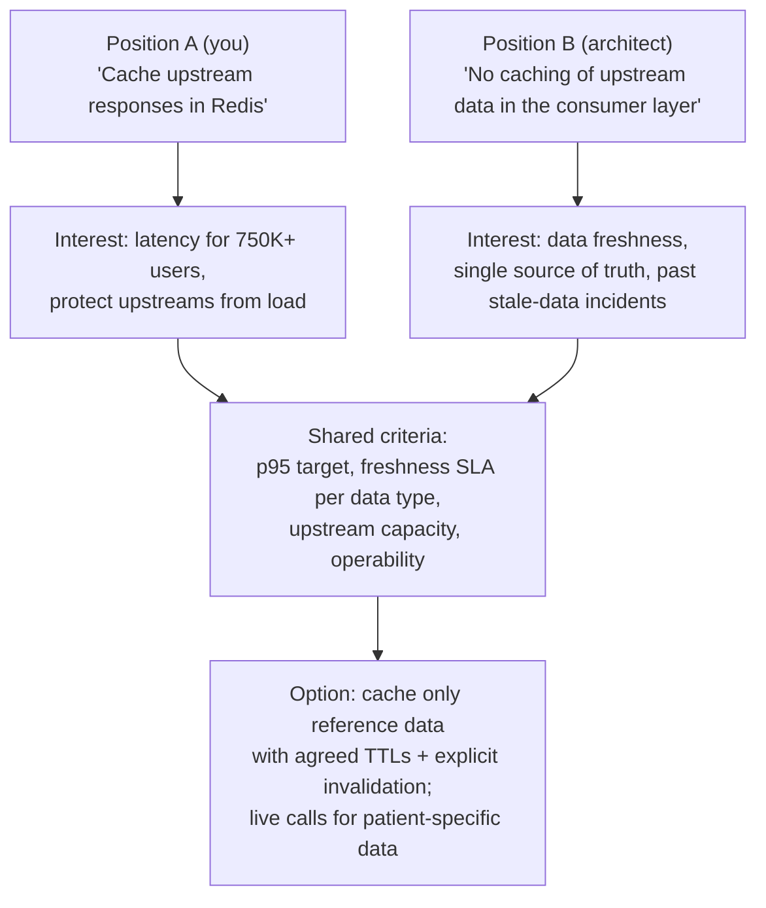

# Handling Conflict & Technical Disagreements (incl. with Architects)

!!! abstract "Key takeaways"
    - **Healthy conflict is about ideas, not people.** Aim for the **best decision for the product**, reached **fairly and quickly**, with **relationships intact**.
    - **Process for technical disagreements:**
        1. **Understand** their position and the **interests** behind it (risk, consistency, past incidents, roadmap).
        2. Agree on **decision criteria** (latency, cost, operability, time to deliver, standards).
        3. Bring **data** (a benchmark, prototype or spike, incident history).
        4. Write the **options and trade-offs** (an ADR).
        5. **Decide**: who the decider is, and by when.
        6. **Disagree and commit** once it's decided.
    - **With architects:** respect their remit (platform consistency, long-term direction). Bring evidence from the ground (implementation cost, production behaviour). Propose **time-boxed experiments** or **reversible** paths. Escalate only with a shared, written problem statement.
    - **Interpersonal conflict on the team:** address it early, privately and separately first, then together. Focus on behaviour and impact (SBI), on shared goals and on working agreements. Involve the manager if it persists.
    - **Show it went well:** the decision quality, the relationship afterwards, and what you learned (including when **you** were wrong).

## Why it matters

"Tell me about a time you disagreed with your manager / architect / colleague" is one of the most common behavioural questions. For Lead roles, interviewers look for **courage + collaboration**: you push back with data, you don't steamroll, and you commit once decided. The resume mentions **collaborating with senior architects** and owning an integration layer between **5 upstream systems**, which are natural sources of technical disagreement.

## Core concepts

### From positions to interests


*Notice how moving from **positions** ("cache" vs "don't cache") to **interests** (latency vs freshness) creates options that satisfy both. This is an illustrative example: confirm whether a disagreement like this actually happened before using it.*

### A disagreement playbook

| Step | What you do | Phrases |
|---|---|---|
| 1. Seek to understand | Restate their view until they agree you've got it | "Let me check I understand your concern…" |
| 2. Find the interests | Ask what risk or goal drives it | "What's the failure you want to avoid?" |
| 3. Agree on criteria | Shared, measurable decision criteria | "Can we agree p95 < X and freshness < Y?" |
| 4. Get data | Spike, benchmark, prototype, incident data | "Let's time-box a 2-day spike for both options." |
| 5. Write it down | ADR: context, options, trade-offs, decision | "I'll draft the ADR with both options." |
| 6. Decide | Clear decider and deadline | "Who makes the call, and by Thursday?" |
| 7. Commit | Disagree and commit, support it fully | "I'd have chosen B, but I'm committed to A." |
| 8. Review | Revisit with production data | "Let's check the metrics after a month." |

### Escalation done well

- Escalate the **problem**, not the person: a shared, written problem statement plus options plus each side's view.
- Agree **together** to escalate ("we can't resolve this, let's ask X"). No surprise escalations.
- Escalate when there's **time pressure**, **cross-team impact** or **values and compliance** issues (security, PHI), not just because you disagree.

### Types of conflict and approaches

| Conflict | Approach |
|---|---|
| Technical design (peer or architect) | Interests → criteria → data → ADR → decide → commit |
| Priorities (product owner vs tech debt) | Make the cost of delay visible (incidents, velocity drag), negotiate capacity (e.g. 20% for debt), tie it to business risk |
| Upstream or other teams | Shared goals, contracts (API, SLAs), escalate jointly with options |
| Interpersonal (two engineers) | Private 1:1s, then a facilitated conversation, working agreements, manager involvement if needed |
| You vs your manager | Private, data-driven, propose alternatives, then commit (or escalate on ethics or compliance) |

### Disagree and commit

After a fair process and a decision, **support it fully**: no passive resistance and no "I told you so". If new data appears, **raise it through the same process**. Showing that you can commit to decisions you argued against is a strong leadership signal.

## In practice: code & configuration

=== "❌ Common mistake"
    ```text
    Q: "Tell me about a disagreement with an architect."
    A: "The architect wanted an approach that was clearly wrong. I knew better because I work
       on the code daily, so I implemented my approach and showed it worked. Eventually they
       agreed."
    - Disrespect, unilateral action, no process, "I was right" with no learning.
    ```

=== "✅ Correct approach"
    ```text
    S: "On OptumRx I owned the GraphQL Consumer Service over 5 upstreams. A senior architect
        and I disagreed on [caching upstream data in our layer / schema design / sync vs
        async integration] [confirm the real topic]."
    T: "We needed a decision before the next release without damaging the relationship."
    A: "I first restated the architect's concern: data freshness and a past stale-data
        problem [confirm]. We agreed criteria: a p95 target, freshness per data type, and
        upstream load. I ran a two-day spike and measured both options, then wrote an ADR
        with the trade-offs. We converged on caching only reference data with agreed TTLs
        and explicit invalidation, and kept live calls for patient-specific data."
    R: "We met the latency goal, upstream calls dropped, there were no freshness incidents
        [confirm], and the ADR became the pattern for other teams."
    L: "Asking 'what failure are you protecting against?' early shortened the debate. Data
        beat opinions."
    ```

ADR skeleton used to resolve technical disagreements:

```markdown
# ADR-012: Caching strategy for upstream data in the GraphQL layer
Status: Accepted (2025-xx-xx)   Deciders: <architect>, <tech lead>   Consulted: <upstream owners>
## Context
p95 of main screen > target; 5 upstreams; freshness requirements differ by data type.
## Options
1. No caching (status quo)  2. Cache all upstream responses  3. Cache reference data only (TTL + invalidation)
## Decision criteria
p95 latency, freshness SLA per data type, upstream load, operability, PHI handling
## Decision
Option 3. Patient-specific data always live; reference data cached 10 min with event-driven eviction.
## Consequences
+ latency, + upstream load; − invalidation complexity; revisit after 4 weeks of metrics.
```

## Real-world usage

- **Amazon's "Have Backbone; Disagree and Commit"** leadership principle is widely referenced. Interviewers in many companies ask for examples of both halves.
- **ADRs / RFCs** (Nygard ADRs, Google design docs, Uber RFCs) are the standard way to turn disagreements into recorded, reviewable decisions.
- **Intel's "constructive confrontation"** and Patrick Lencioni's *Five Dysfunctions of a Team* (fear of conflict leads to artificial harmony) underpin why healthy conflict improves decisions.
- **Failure modes:** HiPPO decisions (the highest-paid person's opinion), endless debates without a decider, passive resistance after decisions, and conflicts that turn personal.

## Trade-offs & production gotchas

| Approach | Pros | Cons |
|---|---|---|
| Avoid conflict | Short-term peace | Bad decisions, resentment |
| Argue to win | Speed (sometimes) | Damaged trust, worse decisions |
| Data + criteria + ADR | Better decisions, recorded reasoning | Takes time. Needs a decider |
| Time-boxed spike | Resolves factual disputes | Can't settle value conflicts |
| Escalation | Unblocks | Overuse erodes trust. Do it jointly |

!!! warning "Gotchas"
    - **Never present a story where the other person is the villain.** Describe their view fairly. Interviewers check empathy.
    - **Include at least one story where you were wrong** or changed your mind. It shows learning.
    - **Compliance and safety aren't up for "disagree and commit"** (PHI, security). Escalate those.
    - **Don't fabricate a conflict.** If your real disagreements were small, tell a small, real one well.

## How this connects to my experience

- **Where I used it:**
    - "Collaborated with senior architects to design scalable service architecture, API strategies, and data integration patterns" (OptumRx).
    - Owned the GraphQL Consumer Service between 5 upstream systems and multiple consumers.
    - "Established engineering standards" (standards often meet pushback).
    - Led a cross-functional team (backend, frontend, QA priorities).
- **Talking points:**
    - **Conflict story 1 (architect):** a real design disagreement (caching, schema/federation, integration style, micro-frontend approach) and how criteria plus a spike plus an ADR resolved it. *[confirm the topic and outcome]*
    - **Conflict story 2 (product or stakeholders):** tech debt or quality vs feature pressure, and how you made the cost visible and negotiated capacity. *[confirm]*
    - **Conflict story 3 (team):** two engineers disagreeing, or pushback on new standards, and how you facilitated. *[confirm]*
    - **When you were wrong:** a decision where the other side's view proved right. *[confirm]*
- **Likely follow-up chain:** "Tell me about a disagreement with an architect." → "What if they hadn't agreed?" → "Have you ever been wrong?" → "How do you handle people who won't commit?" Answer: process + data → escalate jointly or disagree and commit → an honest example → private conversation, then manager involvement.

## Interview questions

### Fundamentals

??? question "Q1. Tell me about a time you disagreed with a senior colleague or architect."
    **Answer structure:** Situation and the disagreement (stated fairly) → your approach (understand interests, agree criteria, gather data, write options) → the decision and how you committed → the outcome and relationship afterwards → the lesson. *[confirm]*

    **Interviewer listens for:** respect, data and commitment.

    **Common wrong answer:** "I proved them wrong".

??? question "Q2. What does 'disagree and commit' mean to you?"
    **Answer:** Voice disagreement clearly with reasoning during the decision process. Once a decision is made by the right decider, commit fully: implement it well, support it publicly, and raise new evidence through the same process instead of resisting.

    **Interviewer listens for:** both halves.

    **Common wrong answer:** "do what the boss says".

??? question "Q3. How do you resolve a technical disagreement in your team?"
    **Answer:** Make the criteria explicit, time-box a spike or benchmark, write an ADR with the options, decide (the DRI or me as lead, or the architect if it's platform-wide), commit, and review with production data.

    **Interviewer listens for:** a repeatable process.

    **Common wrong answer:** "majority vote" (sometimes fine, but not as a default).

??? question "Q4. Tell me about a time you were wrong in a disagreement."
    **Answer structure:** A real case *[confirm]*: your position, what convinced you otherwise (data, incident, explanation), how you acknowledged it openly, and what you learned (for example, to ask about past incidents earlier).

    **Interviewer listens for:** humility.

    **Common wrong answer:** "I'm rarely wrong".

### Intermediate

??? question "Q5. How do you push back on a product owner who wants to skip testing to hit a date?"
    **Answer:** Make the risk concrete (likely defects, incident cost, rework). Offer options: reduce scope, phase the release behind a flag, add capacity, move the date. Agree on the minimum quality bar (no compromise on critical paths, security or PHI). Record the decision and the risk acceptance.

    **Interviewer listens for:** options, not just "no".

    **Common wrong answer:** "we skip tests and fix later".

??? question "Q6. Two engineers on your team are in a recurring personal conflict. What do you do?"
    **Answer:**
    1. Talk to each privately first (listen, find the interests).
    2. Then hold a facilitated conversation focused on behaviours, impact and shared goals.
    3. Agree working agreements (review norms, communication).
    4. Follow up.
    5. If it persists or involves conduct issues, involve their manager or HR.

    **Interviewer listens for:** early, structured intervention.

    **Common wrong answer:** "let them sort it out".

??? question "Q7. When should you escalate a disagreement?"
    **Answer:** When it blocks delivery past a deadline, affects other teams, involves compliance, security or ethics, or a fair process has stalled. Escalate jointly with a written problem statement and options. Don't escalate as a first step or as a surprise.

    **Interviewer listens for:** judgement and joint escalation.

    **Common wrong answer:** "whenever I disagree with someone senior".

??? question "Q8. How do you handle disagreements in code reviews?"
    **Answer:** Separate **must-fix** issues (correctness, security, standards the team agreed) from **preferences**, and label them ("nit:", "suggestion:"). Explain the why, link to the standard or an example, and ask questions before asserting. If a thread goes back and forth more than twice, move to a call; then write the decision back on the PR. Recurring disagreements become a team discussion and possibly a lint rule or ADR, so the same argument doesn't repeat in every PR. *[confirm]*

    **Interviewer listens for:** blocking vs non-blocking labels, reasons and links, switch to a call, recurring issues turned into standards.

    **Common wrong answer:** "I am the lead, so my comment wins." Authority ends the thread but teaches nothing.

### Senior

??? question "Q9. An architect mandates a pattern you believe will hurt your team's delivery. How do you handle it?"
    **Answer:**
    1. Understand their goal (consistency, security, roadmap).
    2. Quantify the impact on your team (effort, latency, operability) with evidence.
    3. Propose alternatives that meet their goal: a phased adoption, an exception with an expiry, or a pilot.
    4. Agree on review criteria.
    5. If they hold, commit and track the impact transparently. Revisit with data.

    **Interviewer listens for:** respect for the remit plus evidence.

    **Common wrong answer:** "ignore the mandate".

??? question "Q10. How do you create a team culture where people disagree openly?"
    **Answer:**
    - Model it: ask for critique of your own designs and thank people for it.
    - Separate ideas from people.
    - Use written proposals so quieter people can comment.
    - Run blameless retros.
    - Have explicit decision owners.
    - Celebrate changed minds.

    **Interviewer listens for:** psychological safety.

    **Common wrong answer:** "we don't really have conflicts".

### Scenario-based

??? question "Q11. An upstream team refuses to add a batch endpoint your GraphQL layer needs for performance. What do you do?"
    **Answer:**
    1. Understand their constraints (capacity, ownership, roadmap).
    2. Quantify the shared benefit (fewer calls, less load on them).
    3. Offer to contribute (a PR, joint design) or a stopgap (caching, request coalescing, DataLoader against the existing endpoint, rate limits).
    4. Agree on a timeline.
    5. Escalate jointly through the architects if it's blocking a release.

    *[confirm if this happened]*

    **Interviewer listens for:** collaboration + stopgaps + joint escalation.

    **Common wrong answer:** "complain to management".

??? question "Q12. During an incident, a senior engineer insists on a risky fix while you prefer rolling back. What do you do?"
    **Answer:** During incidents, the incident commander decides. Mitigation first: prefer the safest, fastest reversible action (roll back, feature flag off). Acknowledge their idea and test it after stabilising. Discuss calmly in the post-incident review.

    **Interviewer listens for:** incident roles and reversibility.

    **Common wrong answer:** "argue it out during the outage".

## Cheat sheet

| Item | Remember |
|---|---|
| Aim | Best decision, fair and fast, relationship intact |
| Playbook | Understand → interests → criteria → data/spike → ADR → decide → commit → review |
| Architects | Respect the remit, bring ground-level evidence, propose pilots or reversible paths |
| Escalate | Jointly, with a written problem + options. For deadlines, cross-team, compliance |
| Interpersonal | Private 1:1s → facilitated talk (SBI) → agreements → manager if needed |
| Commit | Support fully. New data goes through the process |
| Stories needed | Architect disagreement, product pressure, team conflict, a time you were wrong |
| Never | Villainise others, fabricate, compromise on PHI or security |

## Sources
1. Roger Fisher & William Ury, *Getting to Yes*: interests vs positions.
2. Patrick Lencioni, *The Five Dysfunctions of a Team*: fear of conflict and commitment.
3. [Amazon Leadership Principles: Have Backbone; Disagree and Commit](https://www.amazon.jobs/content/en/our-workplace/leadership-principles).
4. [Michael Nygard: Documenting Architecture Decisions](https://cognitect.com/blog/2011/11/15/documenting-architecture-decisions).
5. Kerry Patterson et al., *Crucial Conversations*.
6. Resume: `Vishal_Hulawale_Resume_10012026.pdf` (collaboration with senior architects; GraphQL ownership).
