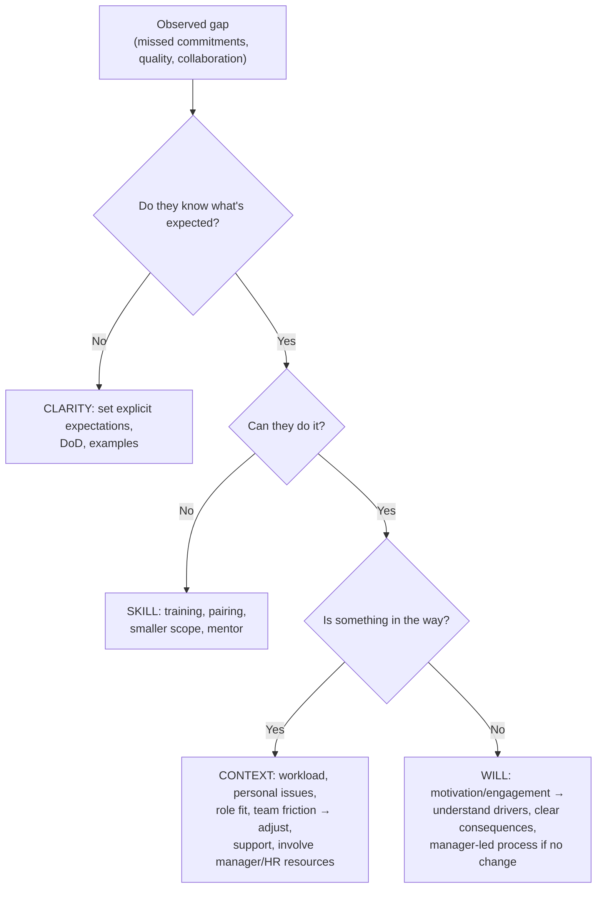

# Managing Underperformance & Difficult Conversations

!!! abstract "Key takeaways"
    - **Diagnose before you act.** Underperformance comes from **skill** (doesn't know how), **will** (motivation, engagement), **clarity** (unclear expectations), or **context** (personal issues, wrong role, team or process problems, unrealistic load). The fix differs for each.
    - **Start early, privately and specifically.** Use **SBI** (Situation, Behaviour, Impact), listen to their side, and agree **concrete expectations** with a timeline and **support** (pairing, training, scope change).
    - **Document facts** (dates, examples, agreements), not opinions. Follow up regularly, and recognise improvement quickly.
    - **Know your role:**
        - A **tech lead** usually gives feedback, support and evidence.
        - The **people manager / HR** owns formal processes (performance improvement plans, ratings, exits).
        - **Involve them early**, never as a surprise.
    - **Difficult conversations:** prepare (facts, impact, your goal), open directly and kindly, listen, separate the person from the behaviour, agree next steps, and follow up in writing. Silence and delay are unkind: they remove the person's chance to improve.

## Why it matters

"Tell me about a time you dealt with an underperforming team member" is standard for Lead roles. It tests empathy, courage, fairness and judgement about your authority. Many candidates either avoid the topic ("my team was great"), describe harsh handling, or overstep (a tech lead "firing" someone). The strong answer shows **early diagnosis, clear expectations, real support, documentation, partnership with the manager** and a fair outcome, whichever way it went.

## Core concepts

### Diagnose: skill, will, clarity, context


*Notice that the most common root causes are **clarity** and **context**, which are leadership problems, not character flaws. Rule them out first. A support plan that addresses the wrong cause won't work.*

### A structured approach

1. **Observe and gather facts:** specific examples, dates, impact (missed sprint goals, review rework, incidents). Look at your own part too (unclear tickets, overload).
2. **Early private conversation (SBI):** "In the last two sprints (S), three stories were marked done without tests (B), which caused two production defects and rework for QA (I). Help me understand what's going on."
3. **Listen:** there's often context you don't know (health, family, confusion about priorities, a conflict).
4. **Agree on expectations and support:** clear goals for the next 2–4 weeks, the support you'll provide (pairing, smaller scope, training), and a check-in cadence.
5. **Inform and partner with the manager**, especially if it's serious or recurring. They own the formal process and the HR resources.
6. **Follow up:** recognise improvement specifically. If there's none, escalate with documentation to the manager, who may start a formal improvement plan (PIP).
7. **Close the loop:** improvement (most common with early action), a role or team change, or exit, handled by the manager and HR with dignity.

### Preparing for a difficult conversation

| Before | During | After |
|---|---|---|
| Facts + examples + impact | Open directly: "I want to talk about X because I want you to succeed here" | Written summary of what was agreed |
| Your goal (behaviour change, clarity) | SBI, then **ask** and listen | Follow-up date on the calendar |
| Their likely perspective | Separate person from behaviour | Recognise progress quickly |
| Private time and place, no rush | Agree concrete next steps and support | Keep the manager informed |
| Check your emotions | Stay calm when they get defensive. Pause if needed | Document facts, not judgements |

### Tech lead vs people manager

- **Tech lead:** sets technical expectations, gives day-to-day feedback, provides support (pairing, scoping), shares observations and evidence with the manager.
- **People manager:** owns performance ratings, formal PIPs, compensation, HR processes and exits.
- In consultancies (client projects), there may also be **client-side expectations**. Protect the person's dignity, and handle staffing changes through your company's processes.

## In practice: code & configuration

=== "❌ Common mistake"
    ```text
    Q: "Tell me about handling an underperformer."
    A: "One developer was slow and his code was bad. I raised it in the standup so everyone
       knew, and I started giving his tasks to others. Eventually I told the manager to
       remove him from the project."
    - Public shaming, no diagnosis, no support, no expectations, overstepping authority.
    ```

=== "✅ Correct approach"
    ```text
    S: "On the OptumRx team, a developer's stories repeatedly came back from QA with defects
        and missed sprint goals for about a month." [confirm the real case]
    T: "As tech lead I needed to understand why and help them get back on track, while
        protecting the release."
    A: "I met them privately and used specific examples: three stories, defects found in QA,
        the rework impact. I asked what was going on. They were unfamiliar with our GraphQL
        resolver patterns and too hesitant to ask [confirm]. We agreed a two-week plan:
        daily 30-minute pairing for the first week, smaller stories, a testing checklist,
        and a check-in every Friday. I told their manager about the plan and the support."
    R: "Within three sprints their defect rate matched the team average, and they later
        owned a resolver module [confirm]."
    L: "I now check new joiners' confidence with our patterns in week two instead of waiting
        for quality issues to show up."
    ```

A follow-up note template (facts, agreements, dates):

```text
Subject: Follow-up from our conversation on <date>
- What we discussed: <specific examples + impact>
- What you shared: <their context, as they described it>
- What we agreed: <expectations for the next N weeks, measurable>
- Support from me: <pairing schedule, scope changes, training>
- Next check-in: <date>
(cc: people manager, if agreed / per company process)
```

## Real-world usage

- **Google's Project Oxygen** and many management frameworks emphasise that **regular coaching and clear expectations** prevent most performance issues. Formal processes are a last resort.
- **Radical Candor** (Kim Scott): "ruinous empathy", meaning avoiding hard feedback to be nice, is a common failure that ends in surprise terminations.
- **PIPs** are typically owned by managers and HR, with clear goals, support and timelines. Done badly, they're seen as a paper trail for exits. Done well, they're a genuine last chance with support.
- **Legal and cultural context varies by country and company.** Follow your organisation's process, and involve HR early for anything formal.

## Trade-offs & production gotchas

| Approach | Pros | Cons |
|---|---|---|
| Wait and hope it improves | Avoids discomfort | Problem grows, team resents it, the person gets no chance |
| Early private feedback + support | Most effective, fair | Uncomfortable, takes time |
| Reassign work quietly | Protects delivery short-term | Hides the problem, demotivates |
| Formal PIP immediately | Clear process | Damages trust if it's the first step |
| Partner with the manager early | Shared view, right authority | Must not feel like going behind their back (be transparent) |

!!! warning "Gotchas"
    - **Never give critical feedback in public** (standups, group chats, PR threads).
    - **Check your own bias:** is the expectation the same as for others? Are they getting the same support and opportunities?
    - **Respect privacy:** personal or health information shared with you stays confidential. Involve HR resources appropriately.
    - **Don't overstate your authority in interviews:** "I worked with their manager", not "I put them on a PIP", unless you actually held that authority.

## How this connects to my experience

- **Where I used it:**
    - "Led Agile teams of 8–10 engineers across backend, frontend, and QA functions."
    - "Mentored 5+ engineers."
    - "Conducted technical interviews and contributed to hiring decisions."
- **Talking points:**
    - **One real underperformance story** with diagnosis, support plan and outcome. *[confirm. If none, use a closest example (e.g. quality issues with a new joiner) and say how you'd handle a more serious case]*
    - **Your boundaries:** as tech lead you handled feedback and support, and partnered with the people manager for formal matters. *[confirm the reporting structure at Publicis Sapient]*
    - **A difficult conversation that wasn't about performance** (for example, telling a stakeholder a date would slip, or giving feedback to a senior peer). *[confirm]*
- **Likely follow-up chain:** "What if they didn't improve?" → "How did you document it?" → "How did the rest of the team feel?" → "Would you do anything differently?" Answer: escalate to the manager with facts → the written follow-ups → protect the team's workload fairly without gossip → raise it earlier.

## Interview questions

### Fundamentals

??? question "Q1. Tell me about a time you dealt with an underperforming team member."
    **Answer structure:** The observed gap with facts → private SBI conversation → diagnosis (skill, will, clarity, context) → agreed plan and support → manager involvement → follow-ups → outcome → lesson. *[confirm]*

    **Interviewer listens for:** empathy + clarity + follow-through.

    **Common wrong answer:** "I escalated to the manager immediately".

??? question "Q2. How do you give difficult feedback?"
    **Answer:** Prepare facts and impact. Have the conversation privately and soon. Use SBI. Ask for their view and listen. Agree concrete next steps and support. Follow up in writing and recognise improvement.

    **Interviewer listens for:** structure and kindness.

    **Common wrong answer:** "I'm very direct, I just tell them".

??? question "Q3. What causes underperformance?"
    **Answer:** Unclear expectations, skill gaps, context (workload, personal issues, wrong role, team friction) and motivation. Diagnose before acting, because each needs a different response.

    **Interviewer listens for:** the diagnosis mindset.

    **Common wrong answer:** "laziness".

### Intermediate

??? question "Q4. What's the difference between your role and the manager's in performance issues?"
    **Answer:** As tech lead: technical expectations, day-to-day feedback, support, observations and evidence. The people manager: ratings, formal improvement plans, HR processes. I involve them early and transparently, and the person knows their manager is aware.

    **Interviewer listens for:** knowing the boundaries.

    **Common wrong answer:** "I handle everything".

??? question "Q5. A strong engineer has become disengaged recently. How do you approach it?"
    **Answer:** A private, curious conversation: "I've noticed X. How are you doing?" Explore the causes (boredom, burnout, career stagnation, personal issues, frustration with decisions). Respond accordingly: new challenges, workload changes, career conversation, support resources. Follow up.

    **Interviewer listens for:** curiosity before judgement.

    **Common wrong answer:** "warn them about performance".

??? question "Q6. How do you document performance issues fairly?"
    **Answer:** Write down facts (dates, deliverables, examples, impact), what was agreed and the support provided, plus their perspective. No labels or opinions. Share summaries with them. Keep it confidential and follow company process.

    **Interviewer listens for:** facts and transparency.

    **Common wrong answer:** "I keep private notes they don't see".

??? question "Q7. Have you ever had to recommend letting someone go? How would you handle it?"
    **Answer:** If you have a real case, tell it with care and without naming anyone. *[confirm]* If not, say so plainly and describe how you would handle it: performance documented over time, clear expectations and support already given, the manager and HR leading the formal process, your role being honest input about impact and evidence. Respect the person's dignity throughout, keep it confidential, and plan the knowledge transfer and team communication.

    **Interviewer listens for:** honesty about experience, a fair process before the decision, manager/HR role, dignity, team impact.

    **Common wrong answer:** Inventing a story, or describing the person with contempt.

### Senior

??? question "Q8. The improvement plan isn't working after the agreed period. What next?"
    **Answer:** Review the facts with the manager. Check that the support was really provided and the expectations were fair. If they were and there's no improvement, the manager leads next steps per process (a formal PIP, a role change, or exit) with HR. I keep supporting the person respectfully and handle the team's workload fairly.

    **Interviewer listens for:** fairness and process.

    **Common wrong answer:** "I asked the client to remove them".

??? question "Q9. How do you protect team morale while handling an underperformer?"
    **Answer:** Keep it confidential (no gossip or public comments), redistribute work fairly and transparently in planning, acknowledge the team's extra effort, and address it promptly, because the team notices when problems are ignored and that hurts morale more.

    **Interviewer listens for:** confidentiality + fairness.

    **Common wrong answer:** "I tell the team what's happening".

??? question "Q10. A team member is technically strong but repeatedly misses commitments. How do you handle it?"
    **Answer:** Treat it as a pattern, not single misses. Bring two or three concrete examples using SBI and ask what is happening: over-committing, unclear scope, hidden blockers, too much context switching, or something personal. Agree changes together: smaller commitments, earlier check-ins, raising blockers by a set point, and visible progress. Follow up on the agreement, recognise improvement, and involve the manager if the pattern continues. *[confirm]*

    **Interviewer listens for:** pattern with examples, diagnosis before judgement, agreed mechanisms, follow-up, escalation path.

    **Common wrong answer:** "They are our best engineer, so I let it go." The team notices, and standards drop for everyone.

### Scenario-based

??? question "Q11. During your feedback conversation, the engineer becomes upset and says they've been dealing with a family illness. What do you do?"
    **Answer:** Pause the performance focus. Show empathy and thank them for telling you. Ask what support would help (temporary workload changes, leave options through the manager and HR, flexibility). Keep it confidential. Agree to revisit expectations later. Inform the manager appropriately so formal support can be arranged.

    **Interviewer listens for:** humanity + process.

    **Common wrong answer:** "continue the feedback as planned".

??? question "Q12. A senior engineer consistently dismisses QA feedback and causes friction. How do you handle it?"
    **Answer:**
    1. Private SBI conversation with examples and the impact (escaped defects, QA morale).
    2. Understand their view (maybe QA processes have real issues).
    3. Agree working norms (a defect triage process, a shared Definition of Done).
    4. Facilitate a joint conversation with QA if needed.
    5. Follow up.
    6. Involve their manager if it continues.

    **Interviewer listens for:** treating behaviour as performance too.

    **Common wrong answer:** "they're senior, so let it go".

## Cheat sheet

| Item | Remember |
|---|---|
| Diagnose | Clarity → skill → context → will |
| Early | Private, specific SBI soon after you notice |
| Plan | Concrete expectations + timeline + support + check-ins |
| Document | Facts, agreements, support, their view. Share summaries |
| Partner | People manager early and transparently. HR for formal steps |
| Conversation | Prepare, open kindly and directly, listen, next steps, follow up in writing |
| Never | Public criticism, surprises, overstating authority, ignoring it |

## Sources
1. Kim Scott, *Radical Candor*: ruinous empathy vs candid care.
2. Kerry Patterson et al., *Crucial Conversations: Tools for Talking When Stakes Are High*.
3. Camille Fournier, *The Manager's Path*: handling underperformance as a tech lead and manager.
4. [Center for Creative Leadership: SBI feedback](https://www.ccl.org/articles/leading-effectively-articles/closing-the-gap-between-intent-vs-impact-sbii/).
5. [Google re:Work: Manager development resources](https://rework.withgoogle.com/en/guides/managers-identify-what-makes-a-great-manager).
6. Resume: `Vishal_Hulawale_Resume_10012026.pdf` (team leadership scope).
