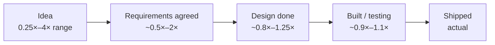
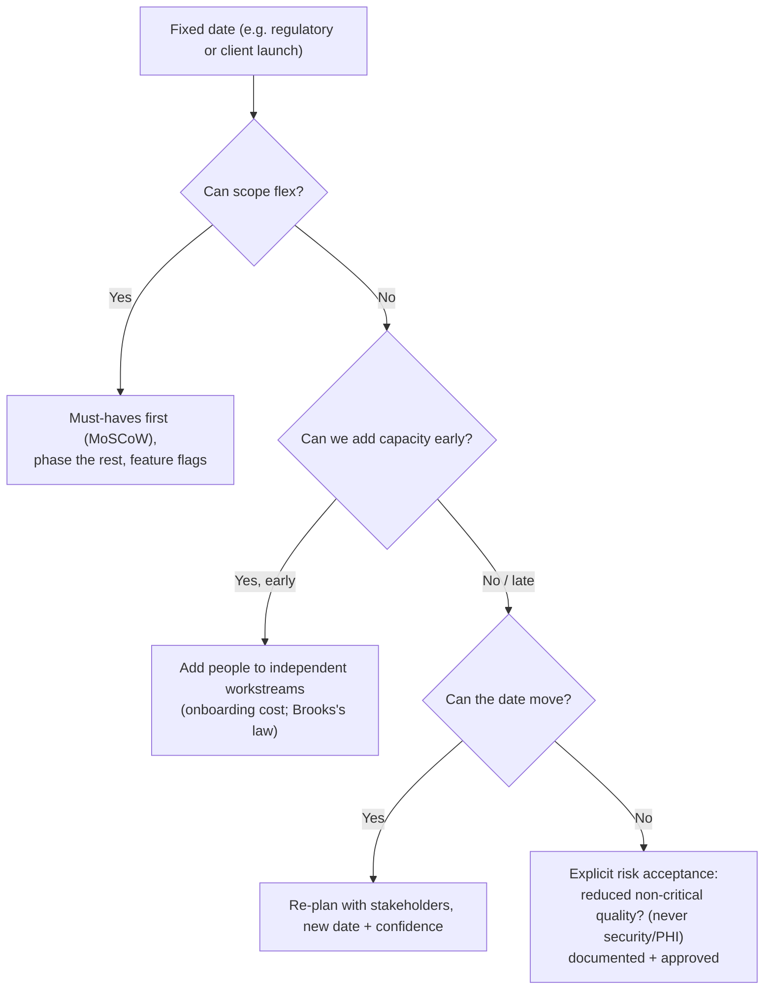
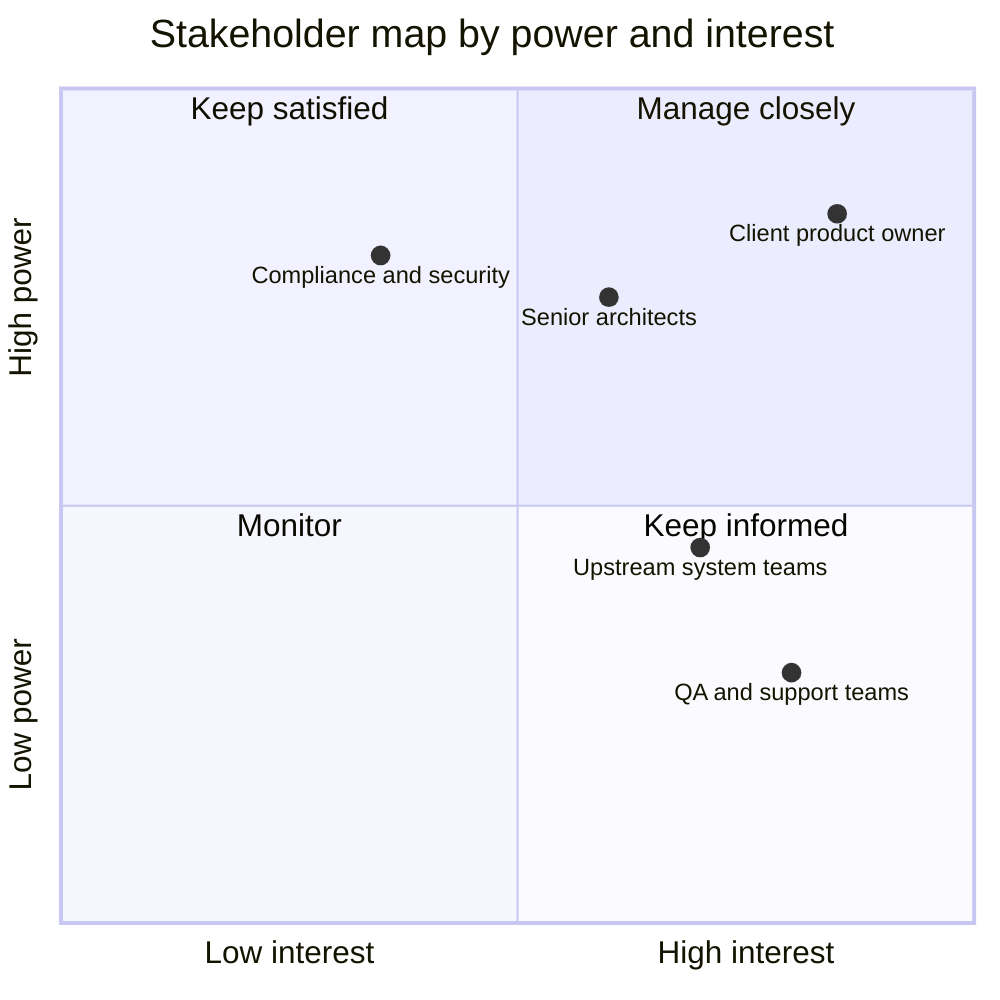

# Estimation, Deadlines & Stakeholder Management

!!! abstract "TL;DR"
    - **Estimates are forecasts with uncertainty, not promises.** Give **ranges with confidence** ("4–6 weeks, 80% confident"). Narrow them as you learn (the **cone of uncertainty**). Separate **estimate** (effort) from **commitment** (a date the team agrees to) from **target** (what the business wants).
    - **Techniques:**
        - **Relative sizing** (story points, t-shirt sizes) plus **velocity** for sprints.
        - **Three-point / PERT** `E = (O + 4M + P) / 6` for bigger items.
        - **Reference class** forecasting ("similar features took 3–5 sprints").
        - **Spikes** for unknowns.
        - **Decomposition** until items are ≤ a few days.
    - **Fixed deadline?** Trade **scope** first (MVP, phased delivery behind feature flags), then **resources** (only early; Brooks's law), then **time**. **Never silently trade quality** (security, PHI, tests on critical paths).
    - **Manage risks and dependencies actively:** RAID log (Risks, Assumptions, Issues, Dependencies), early integration with upstreams, contract tests, buffers on the critical path, and **bad news early** with options.
    - **Stakeholders:** map them (power/interest), tailor the communication (executives get outcomes, risks and decisions needed; product gets scope and trade-offs; engineers get details), keep a steady cadence (status, demos), and **say no with options** ("we can do A by the date, or A + B two weeks later").

## Why it matters

The resume lists "**sprint planning, estimation, stakeholder communication, release management**". Lead interviews ask "how do you estimate?", "tell me about a missed deadline", "how do you handle a stakeholder who wants everything by Friday?". They're looking for **predictability, transparency and negotiation**, not heroics or padding.

## Core concepts

### Cone of uncertainty


*Notice how wide early estimates are. A single number at the idea stage is false precision. Commit to dates once uncertainty has narrowed (after spikes or design), and update forecasts as you learn.*

### Estimation techniques

| Technique | How | Best for |
|---|---|---|
| Story points + velocity | Relative size by team consensus (planning poker). Forecast with historical velocity | Sprint planning, near-term backlog |
| T-shirt sizing | S/M/L/XL for epics | Roadmap-level sizing |
| **Three-point (PERT)** | Optimistic, most likely, pessimistic → E = (O+4M+P)/6, σ ≈ (P−O)/6 | Larger items with uncertainty |
| Reference class | Compare with actuals of similar past work | Avoids the planning fallacy |
| Spike | Time-boxed investigation to reduce unknowns | New tech, unclear upstream behaviour |
| Monte Carlo (throughput) | Simulate completion dates from historical throughput | Release forecasting with ranges |

**Common biases:**

- **Planning fallacy:** optimism. Counter it with reference classes.
- **Anchoring:** the stakeholder's date becomes the estimate. Estimate before you hear the target.
- **Forgetting non-coding work:** reviews, testing, environments, integration, release, production support (often 20–40%).
- **Ignoring dependencies:** upstream teams, security reviews, client approvals.

### Fixed deadline: the trade-off conversation


*Notice that quality is the **last** lever and never applies to security, PHI or critical-path testing. Any reduction must be explicit and approved, never silent.*

### Risks and dependencies

- **RAID log** reviewed weekly: risk, likelihood/impact, owner, mitigation, due date.
- **Dependencies on upstream teams:** agree contracts early (API schema, SLAs), integrate early with stubs and contract tests, and track their milestones.
- **Critical path:** identify it, protect it (best people, fewest interruptions), and buffer it.
- **Early warning:** "red/amber/green" with **trend and options**, not just a colour.

### Stakeholder management


*Notice that each quadrant gets a different cadence. High-power, high-interest stakeholders (the client PO) need frequent, two-way engagement. High-power, low-interest ones (compliance) need concise updates at key decisions.*

**Communication principles:**

- **Tailor to the audience:** executives get outcomes, risks and decisions needed (one page). Product gets scope trade-offs and dates. Engineers get technical detail.
- **No surprises:** share bad news as soon as you know, with **impact + options + recommendation**.
- **Regular cadence:** sprint reviews and demos (show working software), short written status (what's done, next, risks, asks).
- **Say no constructively:** "Yes, if…" or "Not by Friday, but here's what we can deliver by Friday, and the rest by the 20th."

## In practice: code & configuration

=== "❌ Common mistake"
    ```text
    Stakeholder: "Can you deliver the refill-reminder feature by month end?"
    Lead: "Sure, we'll make it happen." (no estimate, no scope discussion)
    ... two weeks later, silence ...
    Lead (day before): "We're not going to make it, there were some upstream issues."
    - Single-point promise, no risk tracking, late bad news, no options.
    ```

=== "✅ Correct approach"
    ```text
    "Let me size it with the team first." → decomposition + three-point estimates → 
    "Core reminders (SMS + email, opt-out) is 3–4 weeks at 80% confidence. Push notifications
     add 1–2 weeks and depend on the mobile team's SDK update.
     Option A: core by month end, push in the following release.
     Option B: everything, mid next month.
     Risk: the pharmacy upstream's API for refill dates. I've asked for a sandbox by the 10th
     and I'll flag it on the 10th if it slips. Recommendation: A."
    Weekly status: done / next / risks (trend) / asks.
    ```

Three-point estimate for a feature (illustrative):

```text
Task                                   O    M    P    E=(O+4M+P)/6
GraphQL schema + resolvers             3    5    9    5.3 days
Upstream integration (refill dates)    2    4   10    4.7 days   ← highest uncertainty → spike first
Notification worker + templates        3    4    7    4.3 days
Tests (unit, contract, e2e)            2    3    5    3.2 days
Release + monitoring                   1    2    3    2.0 days
Total ≈ 19.5 days effort (σ ≈ sqrt(Σσᵢ²) ≈ 1.8 days) + review/integration overhead → quote a range
```

## Real-world usage

- **Agile teams** commonly use story points + velocity for sprints and throughput-based (Monte Carlo) forecasts for releases. Some teams prefer **#NoEstimates** (count stories, use cycle time).
- **Consulting delivery** (fixed-scope/fixed-date client contracts) depends heavily on early scope negotiation, change requests and RAID logs. That's a typical Publicis Sapient and Deloitte environment.
- **Regulated domains** (healthcare, banking) have hard dates (compliance deadlines, open enrolment). Scope phasing and feature flags are the main levers.
- **Failure modes:** hero culture (overtime instead of re-planning), "watermelon" status reports (green outside, red inside), adding people late (Brooks's law), and estimates turned into deadlines without the team's buy-in.

## Trade-offs & production gotchas

| Lever | Pros | Cons |
|---|---|---|
| Cut or phase scope | Keeps date and quality | Stakeholders must accept the MVP |
| Add people | More capacity if early and parallelisable | Onboarding, communication overhead (Brooks's law) |
| Move the date | Keeps scope and quality | Business impact, credibility if repeated |
| Overtime | Short bursts can help | Burnout, more defects, unsustainable |
| Reduce quality | Faster now | Incidents, rework. **Never** for security/PHI |

!!! warning "Gotchas"
    - **Don't pad secretly.** Make uncertainty explicit with ranges and confidence instead.
    - **Re-estimate when facts change.** Old estimates aren't commitments forever.
    - **Watermelon status:** report the real state with its trend. Amber early beats red late.
    - **Include production support and unplanned work** in capacity (often 10–30% for live systems).

## How this connects to my experience

- **Where I used it:**
    - "Led sprint planning, estimation, stakeholder communication, release management, and production support" (Leadership highlights).
    - OptumRx Meteor delivery with 5 upstream systems (dependencies).
    - Consulting delivery contexts at Publicis Sapient and Deloitte.
- **Talking points:**
    - "I estimate with the team (relative sizing for sprints, three-point for bigger items), give ranges with confidence, and spike the riskiest unknown first, usually an upstream integration." *[confirm practices]*
    - **Missed or at-risk deadline story:** how you spotted it, the options you presented, the stakeholder decision and the outcome. *[confirm]*
    - **Saying no story:** a stakeholder request you negotiated into a phased plan. *[confirm]*
    - "Upstream dependencies were the biggest schedule risk. Early contracts, sandbox environments and contract tests reduced surprises." *[confirm]*
- **Likely follow-up chain:** "How do you estimate?" → "Tell me about a time you missed a deadline." → "How did the stakeholder react?" → "What do you do differently now?" Answer: team-based ranges → an honest story with early communication and options → the decision and relationship → earlier spikes and risk flags.

## Interview questions

### Fundamentals

??? question "Q1. How do you estimate work?"
    **Answer:** With the team: decompose, use relative sizing for sprint work, and three-point estimates for larger or uncertain items. Spike unknowns. Include non-coding work (testing, reviews, release, support). Give ranges with confidence, and forecast from historical velocity or throughput. Re-estimate as we learn.

    **Interviewer listens for:** team-based ranges and uncertainty handling.

    **Common wrong answer:** "I estimate based on my experience and add 20%".

??? question "Q2. Estimate vs commitment vs target?"
    **Answer:** An estimate is a forecast of effort or duration with uncertainty. A target is the date or business goal wanted. A commitment is what the team agrees to deliver after reconciling the two (often through scope changes). Confusing them causes broken trust.

    **Interviewer listens for:** the distinction.

    **Common wrong answer:** "they're the same".

??? question "Q3. Tell me about a time you missed a deadline."
    **Answer structure:** The context and cause (honestly, including your part), when and how you communicated (as early as possible, with options), the stakeholder decision, how you delivered, and what you changed afterwards (earlier spikes, better tracking of upstream dependencies). *[confirm]*

    **Interviewer listens for:** early transparency and learning.

    **Common wrong answer:** blaming others.

### Intermediate

??? question "Q4. A stakeholder wants a feature by a date your team says is impossible. What do you do?"
    **Answer:** Understand the reason behind the date (a business event?). Share the estimate with ranges and the reasoning. Offer options: an MVP by the date, phased delivery, more capacity if it's early and parallelisable, or a later date. Recommend one. Get an explicit decision and document it.

    **Interviewer listens for:** options plus a recommendation.

    **Common wrong answer:** "we'll work weekends".

??? question "Q5. How do you communicate project status to executives vs the team?"
    **Answer:** Executives get a short summary: outcome progress, RAG with trend, top risks with mitigations, decisions needed. The team gets detailed tasks, blockers, technical risks. Product gets scope trade-offs and dates. Use a consistent cadence and demos.

    **Interviewer listens for:** tailoring.

    **Common wrong answer:** "the same Jira report for everyone".

??? question "Q6. How do you manage dependencies on other teams?"
    **Answer:** Identify them early, agree contracts and dates, use stubs, mocks and contract tests to decouple, integrate early in a sandbox, track them in a RAID log with owners, escalate early with options if they slip, and keep a fallback plan (feature flags, a phased rollout).

    **Interviewer listens for:** proactive, early integration.

    **Common wrong answer:** "wait for them".

??? question "Q7. How do you handle scope creep in the middle of a sprint or release?"
    **Answer:** Make the trade-off visible instead of absorbing it quietly. Size the new request, show what it would push out, and let the product owner choose: swap something out, move the date, or schedule it next. Keep an agreed buffer for genuinely urgent items, and log changes so retrospectives show the real cost of churn. *[confirm]*

    **Interviewer listens for:** visible trade-offs, product owner decides, a buffer for urgent items, tracking churn.

    **Common wrong answer:** "We just work harder to fit it in." Silent overtime hides the problem and makes estimates look wrong.

### Senior

??? question "Q8. Why not just add more engineers to catch up?"
    **Answer:** Brooks's law: adding people late slows things down at first (onboarding, communication paths grow as n(n−1)/2). It helps only if it's early and the work splits into independent streams with good onboarding. Prefer scope adjustment first.

    **Interviewer listens for:** Brooks's law and its nuance.

    **Common wrong answer:** "more people = faster".

??? question "Q9. How do you build stakeholders' trust in your estimates over time?"
    **Answer:** Consistent ranges with stated confidence, tracking forecast vs actual and sharing it, raising risks early, delivering in small increments with demos, and being honest about misses and what changed. Trust comes from transparency, not from always being right.

    **Interviewer listens for:** a calibration habit.

    **Common wrong answer:** "padding so we're never late".

??? question "Q10. How do you say no to a senior stakeholder?"
    **Answer:** Say "not this way" or "not now" rather than a flat no. Start from their goal, explain the constraint or risk in their terms (date, cost, compliance, reliability), and offer options: a smaller version, a later date, or a different approach. Put the decision and its trade-offs in writing. If it is still contested, escalate together with both options laid out, not around them. *[confirm]*

    **Interviewer listens for:** anchoring on their goal, risk in business terms, alternatives, written trade-offs, joint escalation.

    **Common wrong answer:** "I just do what senior people ask." Or the opposite: refusing without alternatives.

### Scenario-based

??? question "Q11. Two weeks before a release, a critical upstream API changes its contract. What do you do?"
    **Answer:**
    1. Assess the impact quickly (contract tests should catch it).
    2. Talk to the upstream team: can they version or keep backward compatibility, and what's the timeline?
    3. Options: an adapter in our layer, a feature flag to ship without the affected feature, or moving the date.
    4. Inform stakeholders the same day with options and a recommendation.
    5. Afterwards, push for API versioning and consumer-driven contracts.

    **Interviewer listens for:** speed, options and prevention.

    **Common wrong answer:** "work overtime to adapt everything silently".

??? question "Q12. Your sprint is constantly disrupted by production support. How do you plan?"
    **Answer:** Measure unplanned work over several sprints and reserve capacity for it (e.g. 20%). Run a rotating support duty so the rest stay focused. Fix root causes of repeat incidents (bugs, alert noise) as planned work. Make it visible to stakeholders when support load affects roadmap dates.

    **Interviewer listens for:** data-driven capacity and root-cause fixes.

    **Common wrong answer:** "push harder on the rest of the sprint".

## Cheat sheet

| Item | Remember |
|---|---|
| Estimates | Ranges + confidence. Cone of uncertainty. Re-estimate as you learn |
| Techniques | Story points + velocity, t-shirt, three-point (O+4M+P)/6, reference class, spikes, Monte Carlo |
| Biases | Planning fallacy, anchoring, forgetting non-coding work and dependencies |
| Fixed date | Scope → capacity (early) → time → explicit risk acceptance. Never security/PHI |
| Risks | RAID log, critical path, early integration, contract tests |
| Stakeholders | Power/interest map, tailored messages, cadence, demos |
| Bad news | Early + impact + options + recommendation |
| Say no | "Yes, if…" or "not by X, but A by X and B by Y" |

## Sources
1. Steve McConnell, *Software Estimation: Demystifying the Black Art*: cone of uncertainty, ranges.
2. Mike Cohn, *Agile Estimating and Planning*: story points, velocity, planning poker.
3. Frederick Brooks, *The Mythical Man-Month*: Brooks's law.
4. Daniel Kahneman & Amos Tversky: the planning fallacy. Bent Flyvbjerg on reference class forecasting.
5. [PMI: stakeholder power/interest grid and RAID logs](https://www.pmi.org/learning/library/stakeholder-analysis-pivotal-practice-projects-8905).
6. Resume: `Vishal_Hulawale_Resume_10012026.pdf` (sprint planning, estimation, stakeholder communication, release management).
