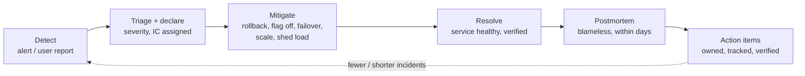
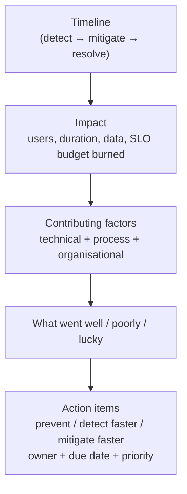

# Production Incidents & Postmortems

!!! abstract "Key takeaways"
    - **During an incident: mitigate first, diagnose later.**
        - Restore service with the safest reversible action: **roll back**, **disable the feature flag**, **fail over**, **shed load**, **scale**.
        - Root cause analysis comes after users are OK.
    - **Run it with clear roles:**
        - **Incident Commander (IC)** coordinates and decides.
        - **Ops/technical lead** investigates and fixes.
        - **Communications lead** updates stakeholders on a fixed cadence.
        - **Scribe** keeps a timeline.
    - **Severity** levels (SEV1–SEV4) drive who's paged and how often you communicate. Declare early. Downgrading later is cheap.
    - **Blameless postmortem** within days:
        - timeline
        - impact (users, duration, data)
        - detection
        - response
        - **contributing factors** (technical + process + organisational)
        - what went well
        - **action items with owners and dates**

        Ask "how did the system allow this?", not "who did it?".
    - **Prevention:** SLOs and alerting on symptoms, runbooks, safe deploys (canary, flags, auto-rollback), game days, and tracking action-item completion. A postmortem whose actions aren't done is a rehearsal for the next incident.

## Why it matters

The resume lists "**production support**" and "**release management**". Every Lead-level loop asks "tell me about a production incident you handled" or "how do you run postmortems?". Interviewers look for **calm prioritisation** (users first), **clear communication**, **ownership without blame**, and **systemic fixes**. The incident story is also a strong source for "failure" and "pressure" questions.

## Core concepts

### Incident lifecycle


*Notice the order: **mitigate before root cause**. Rolling back a bad deploy in 5 minutes beats a perfect diagnosis in 2 hours. The loop only closes when the action items are done.*

### Roles during an incident

| Role | Responsibilities |
|---|---|
| **Incident Commander** | Owns the incident: decides priorities, assigns tasks, keeps focus, declares resolution. Doesn't debug |
| Ops / technical lead | Hands-on investigation and mitigation, proposes actions to the IC |
| **Communications lead** | Status page and stakeholder updates every N minutes (SEV1: 15–30 min), even with "no new information" |
| Scribe | Timeline of events, decisions and commands |
| Subject-matter experts | Pulled in as needed (DB, upstream team, security) |

{ loading=lazy }
*Notice that the commander has no arrow into the systems: coordinating and debugging are separate jobs, and an incident needs both.*

**Severity example:**

- **SEV1:** critical user-facing outage or data/security exposure. All hands, executive comms.
- **SEV2:** major degradation or partial outage.
- **SEV3:** minor impact or a workaround exists.
- **SEV4:** no user impact.

Healthcare: anything that touches **patient safety or PHI** is treated as high severity, and **security/privacy incident processes** apply (breach assessment, notification obligations).

### Mitigation playbook

| Symptom | First moves |
|---|---|
| Errors right after a deploy | **Roll back** or disable the feature flag |
| A dependency is slow or down | Circuit breaker / fallback, serve cached data, degrade the feature |
| Overload | Shed load, rate-limit, scale out, pause batch jobs |
| Data corruption | Stop the writers, isolate, restore from point-in-time, communicate |
| Kafka consumer stuck | Skip the poison message to the DLQ, scale consumers, check lag |
| Certificate or secret expiry | Rotate and redeploy, then automate expiry alerts |

### Blameless postmortems


*Notice the plural **contributing factors**. Complex systems rarely have a single root cause. "Engineer ran the wrong command" is never the conclusion. The question is why the system made that easy and why safeguards didn't catch it.*

- **5 whys:** useful for digging, but it can force a single linear cause. Combine it with a contributing-factors analysis (technical, process, organisational).
- **Action items, by category:**
    - **Prevent** (fix the bug, add validation).
    - **Detect** (an alert on the symptom).
    - **Mitigate** (a runbook, an automated rollback).
    - **Process** (deploy checklist, review).

    Each item needs an owner, a date and tracking.
- **Share learnings** widely: postmortem reviews, incident newsletters.

{ loading=lazy }
*Notice that each action-item type attacks a different segment: prevent removes the incident, detect shortens the 7 minutes, mitigate shortens the 15.*

## In practice: code & configuration

=== "❌ Common mistake"
    ```text
    Q: "Tell me about a production incident."
    A: "A junior pushed a bad config and the app went down. I stayed up all night and found
       the issue in the code and fixed it myself. I told him to be more careful."
    - Blame, hero mode, no mitigation-first thinking, no comms, no systemic fix.
    ```

=== "✅ Correct approach"
    ```text
    S: "On OptumRx, after a release, the GraphQL layer started timing out for a screen used
        by [N] users during peak hours." [confirm the real incident]
    T: "As tech lead on production support I coordinated the response and needed to restore
        service fast, then prevent a repeat."
    A: "I declared it SEV2 and acted as incident commander, with one engineer investigating
        and me sending stakeholder updates every 30 minutes. Traces showed one upstream's
        latency jumped after our change increased per-request calls. We rolled back first,
        and errors cleared in about 15 minutes [confirm]. In the blameless postmortem we found
        three contributing factors: no load test covering that query, no per-upstream timeout,
        and an alert on CPU instead of p95 latency. Action items: DataLoader batching for that
        resolver, per-upstream timeouts and a breaker, a p95 SLO alert, and a load-test stage
        in CI, each with an owner and a date."
    R: "No recurrence; detection time for similar issues dropped from ~X to ~Y min [confirm]."
    L: "Rollback first, then debug. And I now treat missing timeouts as a release blocker."
    ```

Postmortem template:

```markdown
# Postmortem: <title> (SEV2) <date>
## Summary
<2–3 sentences: what happened, impact, how resolved>
## Impact
Users affected: ~N | Duration: HH:MM | Data impact: none/describe | SLO budget used: X%
## Timeline (UTC)
- 10:02 Deploy v1.42 completes
- 10:09 p95 alert fires (or: first user report, a detection gap)
- 10:12 SEV2 declared, IC: <name>
- 10:20 Rollback started → 10:27 errors normal
## Contributing factors
1. Technical: <…>   2. Process: <…>   3. Organisational: <…>
## What went well / what was lucky
## Action items
| Action | Type (prevent/detect/mitigate/process) | Owner | Due | Status |
```

## Real-world usage

- **Google SRE** popularised blameless postmortems, error budgets and the incident commander role (derived from the Incident Command System used by emergency services).
- **PagerDuty's incident response documentation** (open source) defines roles, severity levels and communication practices that many teams adopt.
- **Public postmortems** (Cloudflare, GitHub, AWS, Atlassian) show the format: a detailed timeline, contributing factors and concrete remediation. Good material for interview examples of "what good looks like".
- **Healthcare and banking:** incidents involving PHI or financial data trigger **security incident and breach procedures** (HIPAA breach assessment, regulator notifications). Engineers must escalate to security and compliance immediately.

## Trade-offs & production gotchas

| Choice | Pros | Cons |
|---|---|---|
| Roll back immediately | Fast recovery, reversible | Delays the feature. Needs rollback-safe migrations |
| Fix forward | Keeps the feature | Slower, riskier under pressure |
| Declare early / higher severity | Right people fast | Some false alarms (cheap) |
| Blameless culture | Honest reporting, learning | Must still hold the *system* accountable via actions |
| Many action items | Thorough | Unfinished items. Prioritise the top 3–5 |

!!! warning "Gotchas"
    - **Database migrations must be backward-compatible** (expand/contract) or rollback won't work.
    - **Communication silence** during an incident erodes trust more than the outage. Update on a fixed cadence even when there's no news.
    - **Don't debug in the incident channel with ten people.** The IC keeps focus and assigns workstreams.
    - **Track action items to completion.** Review overdue items in team rituals.

## How this connects to my experience

- **Where I used it:**
    - "Led sprint planning, estimation, stakeholder communication, release management, and **production support**" (Leadership highlights).
    - OptumRx Meteor (750K+ users, 5 upstreams, Kafka retry/DLQ: classic sources of incidents).
    - "Established engineering standards around … deployment practices".
- **Talking points:**
    - **One real incident** you handled: detection, your role (IC or technical lead), mitigation, communication, postmortem, action items, outcome. *[confirm. This is critical: prepare at least one]*
    - **A Kafka/DLQ incident** (poison message, consumer lag, redrive) if one happened. *[confirm]*
    - **Prevention work you drove:** timeouts and breakers, SLO alerts, release checklists, rollback-safe migrations (Liquibase expand/contract at Deloitte). *[confirm]*
- **Likely follow-up chain:** "What was the root cause?" → "Why didn't you catch it before production?" → "What did you change?" → "How did you communicate with the client?" Answer with contributing factors (not blame) → testing and observability gaps → owned action items → cadence and content of updates.

## Interview questions

### Fundamentals

??? question "Q1. Walk me through how you handle a production incident."
    **Answer:** Acknowledge and assess the impact. Declare a severity and assign roles (IC, ops lead, comms). Mitigate first (roll back, flag off, failover, shed load). Communicate on a cadence. Verify recovery. Hold a blameless postmortem with contributing factors and owned action items. Track them to completion.

    **Interviewer listens for:** mitigate-first, roles and comms.

    **Common wrong answer:** "find the bug and fix it".

??? question "Q2. What is a blameless postmortem?"
    **Answer:** A review focused on how the system (technology, process, organisation) allowed the incident, not on individual fault. People share honestly, which surfaces real contributing factors. Accountability lives in owned action items, not in blame.

    **Interviewer listens for:** psychological safety + system accountability.

    **Common wrong answer:** "nobody is responsible".

??? question "Q3. Tell me about a production incident you handled."
    **Answer structure:** Use the STAR skeleton above with your real incident: detection, your role, mitigation, communication, postmortem, systemic fixes, outcome, lesson. *[confirm]*

    **Interviewer listens for:** calm leadership, clear actions, learning.

    **Common wrong answer:** a hero story with blame.

### Intermediate

??? question "Q4. Rollback or fix forward?"
    **Answer:** Default to rollback (or flag off) when a recent change correlates with the issue and rollback is safe (backward-compatible data). Fix forward when rollback is impossible or riskier (irreversible migrations), or the fix is trivial and well understood. Decide quickly. The IC makes the call.

    **Interviewer listens for:** reversibility thinking.

    **Common wrong answer:** "always fix forward to keep the feature".

??? question "Q5. How do you communicate during an incident?"
    **Answer:** A dedicated comms owner. Fixed cadence (SEV1: 15–30 min). What's known, what's being done, the impact and workaround, and the next update time. Plain language for business stakeholders, details for engineers. Status page for users. A final summary when resolved.

    **Interviewer listens for:** cadence and audience.

    **Common wrong answer:** "update when we know the root cause".

??? question "Q6. What makes a good postmortem action item?"
    **Answer:** Specific, owned, dated, prioritised and verifiable. Categorised as prevent, detect, mitigate or process. Limited in number (the top items get done). Tracked in the backlog and reviewed until closed.

    **Interviewer listens for:** completion focus.

    **Common wrong answer:** "be more careful".

??? question "Q7. Which reliability metrics do you track, and why?"
    **Answer:** **MTTD** (time to detect) and **MTTR/MTTM** (time to restore or mitigate) show how good alerting and response are. **Change failure rate** and **deployment frequency** (DORA) show whether releases are safe. **SLO attainment and error-budget burn** show user impact. **Incident count by severity and repeat-incident rate** show whether postmortem actions are working. Track trends per quarter, and never use them to rank individuals. *[confirm]*

    **Interviewer listens for:** detection and recovery times, DORA metrics, SLOs and error budgets, repeat incidents, trends not blame.

    **Common wrong answer:** "Number of incidents." A raw count says nothing about severity or recovery and encourages hiding incidents.

### Senior

??? question "Q8. Why can 5 whys be misleading?"
    **Answer:** It pushes towards a single linear root cause and often ends at a human action. Real incidents have multiple contributing factors (missing tests, alert gaps, deployment process, upstream changes, time pressure). Use a contributing-factors analysis (technical, process, organisational) alongside it.

    **Interviewer listens for:** systems thinking.

    **Common wrong answer:** "5 whys always finds the root cause".

??? question "Q9. How do you reduce the number and impact of incidents over time?"
    **Answer:**
    - SLOs with burn-rate alerts on symptoms.
    - Safe deploys (canary, flags, auto-rollback).
    - Backward-compatible migrations.
    - Timeouts, breakers and bulkheads on dependencies.
    - Runbooks, game days and chaos tests.
    - Tracking repeat incidents and action-item completion.
    - Error budgets that slow feature work when reliability suffers.

    **Interviewer listens for:** a layered, preventive strategy.

    **Common wrong answer:** "more manual testing".

??? question "Q10. How do you make on-call sustainable for your team?"
    **Answer:** Every alert must be **actionable and tied to user impact** (SLO-based alerting); delete or fix noisy ones. Give every alert a runbook. Share the rotation fairly with a secondary, hand over at the end of each shift, and respect time off after a bad night. Review pages weekly: repeat causes become backlog items with priority. Track pages per shift and out-of-hours pages as a team health metric. *[confirm]*

    **Interviewer listens for:** actionable alerts, runbooks, fair rotation, weekly review that removes causes, a health metric for on-call.

    **Common wrong answer:** "Seniors handle on-call because they know the system." It burns them out and keeps knowledge concentrated.

### Scenario-based

??? question "Q11. At 2 a.m. an alert shows PHI may have been exposed through an API bug. What do you do?"
    **Answer:**
    1. Treat it as a high-severity security incident.
    2. Contain: disable the endpoint or feature, block access.
    3. Preserve evidence (logs).
    4. Immediately engage security and compliance (privacy officer) per the incident response plan.
    5. Assess scope (which records, who accessed them).
    6. Don't communicate externally on your own: legal and compliance handle breach notification obligations.
    7. Fix, verify, then hold a postmortem with security actions.

    **Interviewer listens for:** containment + correct escalation.

    **Common wrong answer:** "fix it quietly and move on".

??? question "Q12. The same Kafka consumer lag incident happens every month. What do you do as lead?"
    **Answer:**
    1. Pull the past postmortems and look for patterns (traffic peaks, poison messages, slow downstream).
    2. Check whether action items were completed.
    3. Prioritise systemic fixes: autoscaling on lag with caps, DLQ for poison messages, downstream capacity, alerting on lag growth rate.
    4. Escalate the reliability work into the roadmap with data on the cost of the incidents.

    **Interviewer listens for:** pattern recognition and making the work happen.

    **Common wrong answer:** "restart the consumer each time".

## Cheat sheet

| Item | Remember |
|---|---|
| Order | Detect → declare → **mitigate** → resolve → postmortem → actions |
| Roles | IC (decides), ops lead (fixes), comms (cadence), scribe (timeline) |
| Mitigate | Rollback, flag off, failover, cache/fallback, shed load, scale |
| Comms | Fixed cadence, known/doing/impact/next update, audience-tailored |
| Postmortem | Blameless, timeline, impact, contributing factors, went well, owned actions |
| Actions | Prevent / detect / mitigate / process. Owner + date. Tracked to done |
| PHI | Security incident process, contain, preserve evidence, compliance and legal own notification |
| Prevent | SLOs, safe deploys, expand/contract migrations, timeouts/breakers, game days |

## Sources
1. [Google SRE Book: Managing Incidents](https://sre.google/sre-book/managing-incidents/) and [Postmortem Culture](https://sre.google/sre-book/postmortem-culture/).
2. [PagerDuty Incident Response documentation](https://response.pagerduty.com/): roles, severities, communication.
3. [Atlassian Incident Management Handbook](https://www.atlassian.com/incident-management/handbook).
4. John Allspaw, *Blameless PostMortems and a Just Culture* (Etsy Code as Craft).
5. [HHS: HIPAA Breach Notification Rule](https://www.hhs.gov/hipaa/for-professionals/breach-notification/index.html).
6. Resume: `Vishal_Hulawale_Resume_10012026.pdf` (production support, release management).
