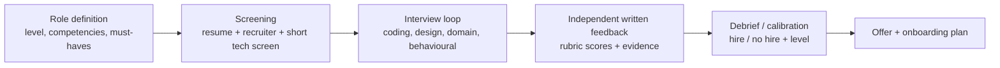

# Hiring & Interviewing Others

!!! abstract "Key takeaways"
    - **Hiring is a leverage decision:** one strong hire improves the team for years, and one bad hire costs months. Senior engineers are expected to **interview well, calibrate the bar, and improve the process**.
    - **Structured interviewing beats gut feel:** define the **competencies** for the role (coding, design, debugging, communication, ownership, collaboration), assign each interviewer a **focus area**, use **the same core questions** and a **scoring rubric** (1–4 with behavioural anchors), and **write feedback before discussing** with other interviewers.
    - **Good questions:**
        - realistic (close to the job)
        - layered (basic → extensions)
        - with signal at several levels
        - with a clear rubric for what "strong / acceptable / weak" looks like

        Behavioural questions ask for **past behaviour** ("tell me about a time…"), not hypotheticals only.
    - **Reduce bias:** diverse panels, consistent questions, evidence-based notes (what they said or did), no "culture fit" as vague likability (use "values alignment" with defined behaviours), and awareness of halo/horn, similarity and anchoring effects.
    - **Candidate experience matters:** prepare, explain the format, give hints in the same way to everyone, leave time for their questions, and give timely outcomes. Candidates judge your company by you.

## Why it matters

The resume says "**Conducted technical interviews and contributed to hiring decisions**". Lead roles involve building teams, so interviewers ask "how do you interview?", "what do you look for?", "tell me about a hire you regretted or one you fought for". Strong answers show a structured, fair, evidence-based approach, not "I can tell in five minutes".

## Core concepts

### The hiring pipeline and where you contribute


*Notice that the most important steps happen **before** the interview (clear competencies and rubrics) and **after** it (independent written feedback, calibrated debrief). Without them, interviews become gut-feel conversations.*

### Structured interview design

| Element | Practice |
|---|---|
| Competencies | 4–6 per role (e.g. problem solving/coding, system design, debugging/production thinking, communication, ownership, collaboration/leadership) |
| Panel plan | Each interviewer owns 1–2 competencies. No duplicate coverage, no gaps |
| Questions | Standard core question per slot, with planned extensions. Calibrated on internal engineers first |
| Rubric | 1–4 scale with behavioural anchors ("4: identifies N+1 and proposes batching unprompted, discusses trade-offs") |
| Notes | Record what the candidate said or did (evidence), not adjectives ("smart") |
| Independence | Submit feedback before the debrief to avoid anchoring |
| Decision | A hiring manager or committee, with clear bar and levelling criteria |

### Designing good technical questions

- **Coding:** a realistic problem (parse and aggregate events, implement an LRU or rate limiter, fix a bug in a small service), with tests, then extensions (concurrency, scale, edge cases). Look at reasoning, code quality, testing and communication, not trick knowledge.
- **System design:** an open problem in your domain (a notification system, a prescription refill workflow), with a framework. Score requirements, trade-offs, depth and failure handling.
- **Debugging / production:** "Latency doubled after a deploy. Walk me through it." This reveals operational maturity.
- **Behavioural:** "Tell me about a time you disagreed with a technical decision." Probe for specifics and their own role.

### Bias awareness

| Bias | Example | Countermeasure |
|---|---|---|
| Similarity / affinity | Favouring people with your background | Rubrics, diverse panels |
| Halo / horn | One great or bad answer colours everything | Score each competency separately |
| Anchoring | First opinion in the debrief sways others | Written feedback before the debrief |
| Confirmation | Looking for proof of a first impression | Same questions, evidence notes |
| "Culture fit" | Likability over capability | Define values as observable behaviours |

### Writing feedback

```text
Competency: System design (score 3/4: hire)
Evidence:
- Clarified requirements (users, freshness, PHI) before designing.
- Proposed queue + idempotent workers; explained at-least-once and dedup keys.
- Missed rate limits per SMS provider until prompted; adapted well.
- Discussed partial-failure handling and DLQ redrive.
Concerns: Limited depth on capacity estimation.
Level signal: Senior (not yet Lead: no cross-team considerations raised).
```

## In practice: code & configuration

=== "❌ Common mistake"
    ```text
    Q: "How do you interview candidates?"
    A: "I ask whatever comes to mind based on their resume, maybe some puzzles. Usually I can
       tell in the first ten minutes if someone is good. If I like them, I say hire."
    - Unstructured, gut feel, puzzles, no rubric, bias-prone.
    ```

=== "✅ Correct approach"
    ```text
    S: "At Publicis Sapient I conducted technical interviews for [backend/full-stack] roles
        and contributed to hiring decisions." [confirm roles, number of interviews]
    T: "Make consistent, fair decisions for the team I lead."
    A: "I used a standard question per round (e.g. a small Spring Boot service with a bug,
        plus design extensions) with a rubric: problem solving, code quality, testing,
        communication, production thinking. I wrote evidence-based notes and submitted
        scores before the debrief. I [proposed / helped refine] the question bank and
        rubric so different interviewers scored consistently." [confirm]
    R: "Better consistency between interviewers; hires who ramped up well [confirm example]."
    L: "Calibrating questions on current team members first exposed unclear wording."
    ```

## Real-world usage

- **Google's re:Work research** found structured interviews with consistent questions and rubrics predict job performance better than unstructured ones. Google also uses independent hiring committees.
- **Amazon's Bar Raiser** program puts a trained interviewer from another team in each loop to protect the hiring bar.
- **Work-sample tests** (realistic tasks) are among the most predictive methods. Many companies use take-home or pair-programming exercises instead of puzzles.
- **Common failures:** brain-teasers, inconsistent questions per candidate, groupthink debriefs, and long delays that lose good candidates.

## Trade-offs & production gotchas

| Approach | Pros | Cons |
|---|---|---|
| Structured + rubric | Fair, predictive, comparable | Preparation effort, can feel rigid |
| Unstructured conversation | Flexible, rapport | Bias, inconsistent, weak prediction |
| Take-home | Realistic, low pressure | Candidate time cost, cheating concerns |
| Live pair programming | Shows collaboration and thinking | Nerves. Needs a skilled interviewer |
| Puzzles/trivia | Easy to run | Poor job relevance |

!!! warning "Gotchas"
    - **Never ask illegal or discriminatory questions** (age, marital status, religion, family plans, health).
    - **Don't change the bar per candidate** because you need to fill a seat. Escalate pipeline problems instead.
    - **Protect confidentiality** of candidate information and feedback.
    - **Interview fatigue:** limit the number of interviews per person per week so quality doesn't drop.

## How this connects to my experience

- **Where I used it:**
    - "Conducted technical interviews and contributed to hiring decisions" (Leadership highlights).
    - Leading 8–10 engineers (onboarding new hires).
    - Mentoring 5+ engineers.
- **Talking points:**
    - **What you assess and how:** your standard questions, your rubric, how you avoid bias. *[confirm what you actually used]*
    - **A hire you advocated for** (a strong signal despite an unconventional background) and how it turned out. *[confirm]*
    - **A no-hire decision** you defended with evidence, or a hire that didn't work out and what you changed in the process. *[confirm]*
    - **Onboarding:** how you set new hires up to succeed (buddy, first issue, 30/60/90). *[confirm]*
- **Likely follow-up chain:** "What do you look for in a senior engineer?" → "How do you assess it?" → "How do you avoid bias?" → "Tell me about a hiring mistake." Answer: the competencies → questions and rubric → structure, independence, evidence → an honest story and the process fix.

## Interview questions

### Fundamentals

??? question "Q1. How do you run a technical interview?"
    **Answer:** Prepare (the role's competencies, my assigned focus, a standard question with extensions, a rubric). Open with the format and put them at ease. Let them think aloud and give consistent hints. Take evidence notes. Leave time for their questions. Submit written feedback with scores before the debrief.

    **Interviewer listens for:** structure and fairness.

    **Common wrong answer:** "I ask about their resume and some puzzles".

??? question "Q2. What do you look for in a senior backend engineer?"
    **Answer:**
    - Problem solving and code quality (including tests).
    - System design with trade-offs.
    - Production thinking (observability, failure handling).
    - Communication.
    - Ownership.
    - Collaboration and mentoring.

    I assess each with specific questions and anchors. The levelling difference is mostly scope and ambiguity handling.

    **Interviewer listens for:** a defined competency model.

    **Common wrong answer:** "strong Java knowledge".

??? question "Q3. How do you reduce bias in interviews?"
    **Answer:** Structured questions and rubrics, evidence-based notes, independent written feedback before the debrief, diverse panels, scoring competencies separately (to avoid halo effects), awareness of affinity and confirmation bias, and defining "values" as observable behaviours instead of "fit".

    **Interviewer listens for:** concrete mechanisms.

    **Common wrong answer:** "I'm objective".

### Intermediate

??? question "Q4. How do you design a good coding question?"
    **Answer:** It's job-relevant, solvable in the time slot with layers (a base solution, then extensions for concurrency, scale, edge cases), has a clear rubric, has been tested on current engineers for timing and clarity, and avoids trick knowledge. It shows signal at several levels.

    **Interviewer listens for:** calibration and layering.

    **Common wrong answer:** "the hardest problem I know".

??? question "Q5. Two interviewers disagree strongly in a debrief. How do you resolve it?"
    **Answer:** Go back to the evidence each one recorded against the competencies. Identify whether they assessed different things or interpreted the same evidence differently. Consider the role's must-haves. If it's still unclear, get an additional focused interview rather than compromise. The hiring manager decides.

    **Interviewer listens for:** evidence over opinion.

    **Common wrong answer:** "the more senior interviewer wins".

??? question "Q6. What makes good interview feedback?"
    **Answer:** A score per competency with specific evidence (what they said or did), strengths and concerns, a level signal, and a clear recommendation. Written promptly and independently. No personal comments.

    **Interviewer listens for:** evidence-based writing.

    **Common wrong answer:** "Good guy, smart, hire".

??? question "Q7. How do you interview a lead or architect candidate differently from a senior engineer?"
    **Answer:** Add signals for **scope and influence**: system design with trade-offs across teams, how they made and documented decisions, how they grew people, how they handled conflict and stakeholders, and how they balanced delivery with quality. Probe for their own actions with follow-up questions ("what did you do?"). Keep a hands-on part too, such as a code or design review, because leads must still judge technical quality. *[confirm]*

    **Interviewer listens for:** broader scope signals, decision-making and people growth, the "what did you do" probe, a hands-on part kept.

    **Common wrong answer:** Running the same coding round and judging only speed.

### Senior

??? question "Q8. How would you improve a team's hiring process?"
    **Answer:**
    - Define competencies and levels.
    - Build a question bank with rubrics, calibrated internally.
    - Train interviewers (shadowing, reverse-shadowing).
    - Independent feedback, plus a structured debrief.
    - Track funnel metrics (pass rates per stage, time to hire, offer acceptance) and new-hire performance.
    - Get candidate feedback.
    - Make time-to-decision an SLA.

    **Interviewer listens for:** a systematic, data-informed approach.

    **Common wrong answer:** "ask harder questions".

??? question "Q9. Tell me about a hire you regretted, or one you're proud of."
    **Answer structure:** An honest example *[confirm]*: what the interview showed, what you missed or saw correctly, the outcome, and how you changed your interviewing (a new question, a rubric anchor, a reference-check focus).

    **Interviewer listens for:** learning applied to the process.

    **Common wrong answer:** "all my hires were great".

??? question "Q10. How do you help a strong candidate choose your team?"
    **Answer:** The interview is also their evaluation of you. Be on time, prepared and respectful; explain the problem space honestly, including the hard parts; leave real time for their questions; and connect them with the people they would work with. Move quickly after the final round. A good candidate experience also helps the people you reject, who talk to others. *[confirm]*

    **Interviewer listens for:** candidate experience, honesty about the role, time for their questions, speed of decision.

    **Common wrong answer:** Selling only the positives, which leads to early attrition when reality shows up.

### Scenario-based

??? question "Q11. The team urgently needs people, and a borderline candidate is available now. Hire?"
    **Answer:** Don't lower the bar under pressure. A mis-hire costs more than the gap. Check whether more evidence is possible (a focused follow-up interview). Consider alternatives (contractors, rescoping, internal moves). Escalate the pipeline problem. If they don't meet the bar, no hire, and document why.

    **Interviewer listens for:** bar discipline.

    **Common wrong answer:** "hire and train them".

??? question "Q12. A candidate is nervous and freezes on a coding question. What do you do?"
    **Answer:** Reassure them, restate the problem, suggest starting with a simple brute-force approach or an example, and give the standard hints (the same ones every candidate gets). Note the recovery. Assess problem solving fairly and don't penalise nerves alone. Leave time for their questions so they leave with a good impression.

    **Interviewer listens for:** humane and consistent behaviour.

    **Common wrong answer:** "move on to the next question".

## Cheat sheet

| Item | Remember |
|---|---|
| Structure | Competencies → panel plan → standard questions → rubric → evidence notes |
| Independence | Written feedback before the debrief. Avoid anchoring |
| Questions | Job-relevant, layered, calibrated internally, no puzzles |
| Bias | Affinity, halo/horn, anchoring, confirmation, vague "fit" |
| Feedback | Score + evidence + concerns + level + recommendation |
| Bar | Don't lower it under pressure. Escalate pipeline issues |
| Candidate | Explain format, consistent hints, time for questions, quick decisions |
| Never | Illegal questions, sharing candidate data, gut-feel decisions |

## Sources
1. [Google re:Work: Use structured interviewing](https://rework.withgoogle.com/en/guides/hiring-use-structured-interviewing).
2. Schmidt & Hunter, *The Validity and Utility of Selection Methods in Personnel Psychology* (1998): work samples and structured interviews.
3. [Amazon: Bar Raiser program](https://www.amazon.jobs/content/en/how-we-hire/interviewing-at-amazon).
4. Laszlo Bock, *Work Rules!*: hiring practices at Google.
5. Resume: `Vishal_Hulawale_Resume_10012026.pdf` (conducted technical interviews, contributed to hiring decisions).
