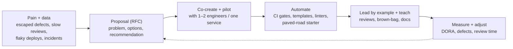
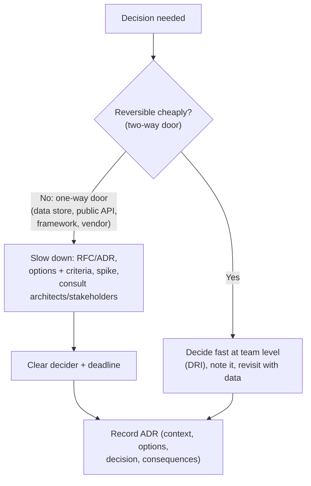

# Driving Engineering Standards & Technical Decisions

!!! abstract "Key takeaways"
    - **Standards exist to make the right thing the easy thing.** Pick the few that reduce real pain (escaped defects, slow reviews, risky deploys), not a long rulebook.
    - **How standards stick:**
        1. **Problem first** (data: incidents, rework, lead time).
        2. **Co-create** with the team (RFC/ADR, a pilot).
        3. **Automate enforcement** (CI quality gates, linters, templates, a "paved road").
        4. **Lead by example.**
        5. **Measure and adjust.**
    - **Typical high-value standards:**
        - a test strategy (unit + contract + a few e2e)
        - a Definition of Done
        - code review norms (SLA, size)
        - CI/CD with quality gates
        - trunk-based or short-lived branches
        - feature flags
        - backward-compatible migrations
        - observability (logs, metrics, traces)
        - security checks (SAST/dependency scanning)
    - **Technical decisions:**
        - Classify them as **one-way doors** (hard to reverse: data stores, public APIs, frameworks) or **two-way doors** (easy to reverse: libraries, internal designs). Be careful and broad-consulting with one-way doors, fast with two-way ones.
        - Record them in **ADRs**.
        - Use clear **decision rights** (who decides, who's consulted).
    - **Tech debt:** make it visible (debt register with business impact), budget capacity continuously (e.g. 15–20%), pay it down where it slows delivery or causes incidents, and avoid big-bang rewrites.

## Why it matters

The resume says "**Established engineering standards around testing, CI/CD, code quality, and deployment practices**". That's a classic Lead-level impact claim, and interviewers will probe: *which standards, why, how did you get buy-in, what pushback did you face, how did you measure the effect?* They also ask how you make and record technical decisions, and how you balance tech debt against features.

## Core concepts

### From problem to adopted standard


*Notice that **automation** turns a standard from a request into the default. A CI gate that blocks untested code works better than a wiki page. And starting from **pain + data** is what makes the team want it.*

{ loading=lazy }
*Notice that nobody had to spot the vulnerable library in review. The gate applies the standard the same way to every commit, including the lead's.*

### Standards that usually pay off

| Area | Standard | Enforcement |
|---|---|---|
| Testing | Test pyramid: unit (fast) + contract (consumer-driven between services/upstreams) + few e2e. Coverage as a signal, not a target | CI fails on failing tests, coverage diff checks, contract tests in the pipeline |
| Code quality | Style and linting, static analysis, small PRs, review SLA (< 1 day), two-eyes rule | Linters/formatters in CI (Checkstyle/Spotless, ESLint/Prettier), Sonar quality gate |
| CI/CD | Build once, deploy many. Trunk-based or short-lived branches. Automated deploy to non-prod | Pipeline templates, branch protection |
| Deployment | Feature flags, canary/blue-green, automated rollback, expand/contract DB migrations | Release checklist in the pipeline, migration linting |
| Observability | Structured logs with trace IDs, golden-signal metrics, SLO alerts | Service template with logging/metrics config |
| Security | Dependency scanning, SAST, secrets scanning, least privilege | CI gates (OWASP Dependency-Check/Snyk, GitLab SAST), pre-commit hooks |
| Docs | ADRs for significant decisions, README/runbook per service | PR template checkbox |

### Making technical decisions


*Notice that the amount of process should match **reversibility and blast radius**. Treating every decision as a one-way door slows teams down. Treating one-way doors casually creates years of pain.*

**Decision rights:** use RACI or a "DACI" (Driver, Approver, Contributors, Informed) model for significant decisions. Platform-wide choices involve architects. Service-internal choices belong to the owning team.

### Managing tech debt

- **Classify it:** deliberate vs accidental, prudent vs reckless (Fowler's quadrant). Focus on debt that **slows delivery** or **causes incidents**.
- **Make it visible:** a debt register with impact (hours lost per sprint, incidents, risk) and an estimated cost to fix.
- **Budget continuously:** a fixed share of capacity (15–20%), plus the "boy scout rule" in code you touch.
- **Big items:** strangler-fig incremental replacement, not a big-bang rewrite. Tie them to business outcomes (faster feature delivery, compliance).

## In practice: code & configuration

=== "❌ Common mistake"
    ```text
    "I wrote a 30-page coding standards document and sent it to the team. I told everyone to
     follow it and rejected PRs that didn't. People complained but eventually followed it."
    - No problem statement, no co-creation, manual enforcement, resentment, no measurement.
    ```

=== "✅ Correct approach"
    ```text
    S: "On OptumRx, with 8–10 engineers across backend, frontend and QA, we had [frequent QA
        rework / production defects / slow inconsistent reviews / manual deployments]
        [confirm the real pain]."
    T: "As lead I wanted consistent quality without becoming the bottleneck reviewer."
    A: "I shared the data (defects per sprint, review turnaround) and proposed a small set of
        standards: a Definition of Done, a test strategy (unit + contract tests for the
        GraphQL resolvers against upstream contracts), PR size and review SLA, and CI quality
        gates. I piloted them on the GraphQL service first, then built pipeline templates so
        other services got them by default. I ran a brown-bag and adjusted rules that slowed
        people down without adding value." [confirm specifics]
    R: "Escaped defects fell from ~X to ~Y per release, review time from ~A to ~B, and
        deployments became [automated / more frequent] [confirm]."
    L: "Automating the standard mattered more than documenting it. And dropping a rule nobody
        valued built credibility for the ones that mattered."
    ```

Example CI quality gates (GitLab CI):

```yaml
stages: [build, test, quality, security, deploy]

unit_tests:
  stage: test
  script: ./mvnw -B verify                      # unit + integration tests; fails the pipeline
  artifacts:
    reports:
      junit: target/surefire-reports/*.xml

contract_tests:
  stage: test
  script: ./mvnw -B -Pcontract verify           # consumer-driven contracts vs upstream stubs

quality_gate:
  stage: quality
  script: ./mvnw -B sonar:sonar -Dsonar.qualitygate.wait=true   # blocks on new-code issues

dependency_scan:
  stage: security
  script: ./mvnw -B org.owasp:dependency-check-maven:check -DfailBuildOnCVSS=7

deploy_staging:
  stage: deploy
  script: ./deploy.sh staging
  rules:
    - if: $CI_COMMIT_BRANCH == "main"
```

## Real-world usage

- **DORA research** (Accelerate) links continuous delivery practices (trunk-based development, test automation, deployment automation) with better delivery performance **and** stability, which is a strong data-backed argument for standards.
- **Paved roads / golden paths** (Netflix, Spotify Backstage templates) make the standard way the easiest way: service templates with logging, metrics, CI and security built in.
- **ADRs and RFCs** (Nygard ADRs, Google design docs, Uber/HashiCorp RFCs) are the industry standard for recording decisions and building consensus.
- **Amazon's one-way vs two-way doors** (Bezos shareholder letter, 2015) is a widely cited framework for decision speed.
- **Failure modes:** standards without automation (ignored), standards without rationale (resented), gold-plating (process for its own sake), and big-bang rewrites justified as "paying debt".

## Trade-offs & production gotchas

| Approach | Pros | Cons |
|---|---|---|
| Top-down mandate | Fast to announce | Low buy-in, quiet non-compliance |
| Co-created + piloted | Ownership, better rules | Slower to roll out |
| Manual enforcement (reviews) | Flexible | Lead becomes the bottleneck, inconsistent |
| Automated gates | Consistent, scalable | Can block on false positives. Needs tuning |
| Strict coverage targets | Easy metric | Gaming, low-value tests |
| Debt budget (15–20%) | Steady improvement | Must defend it against feature pressure |

!!! warning "Gotchas"
    - **Start small:** 3–5 standards that address real pain beat a long rulebook.
    - **Quality gates must be fast and reliable.** Flaky tests in CI destroy trust in the whole system.
    - **Allow documented exceptions** (with an expiry) for edge cases, so people don't route around the system.
    - **Measure outcomes** (defects, lead time, incidents), not compliance alone.

## How this connects to my experience

- **Where I used it:**
    - "Established engineering standards around testing, CI/CD, code quality, and deployment practices" (OptumRx).
    - "Automated infrastructure provisioning and deployment processes using Terraform" (Deloitte).
    - "Automated deployments through GitLab CI/CD pipelines" (Coriolis).
    - "Implemented … Liquibase migration strategies" (Deloitte, which supports backward-compatible migrations).
- **Talking points:**
    - **The standards story** above, with your real pain points, the specific standards, how you rolled them out, the pushback and the measured results. *[confirm all specifics]*
    - **Automation as enforcement:** GitLab CI pipelines, Terraform modules, Liquibase in pipelines. *[confirm specific gates]*
    - **A significant technical decision you drove** (micro-frontend architecture, GraphQL caching strategy, Kafka retry/DLQ design) and how it was recorded and agreed with architects. *[confirm]*
    - **A tech debt trade-off** you negotiated with product. *[confirm]*
- **Likely follow-up chain:** "Which standards and why?" → "Who pushed back, and how did you handle it?" → "How did you measure impact?" → "What would you not standardise?" Answer: pain-driven standards → co-creation, pilots and adjusting rules → DORA, defects and review time → personal style choices and anything without a clear benefit.

## Interview questions

### Fundamentals

??? question "Q1. What engineering standards did you introduce and why?"
    **Answer structure:** The pain (data), the 3–5 standards chosen (DoD, test strategy, review norms, CI gates, deployment practices), how they map to the pain, and the results. *[confirm specifics]*

    **Interviewer listens for:** problem-driven choices.

    **Common wrong answer:** a list of best practices without a reason.

??? question "Q2. How do you get a team to adopt a new standard?"
    **Answer:** Show the problem with data. Co-create the proposal (an RFC). Pilot it on one service. Automate enforcement (CI, templates). Teach it (docs, a brown-bag, reviews). Lead by example. Measure it and adjust, including dropping rules that don't help.

    **Interviewer listens for:** buy-in plus automation.

    **Common wrong answer:** "mandate it and enforce it in reviews".

??? question "Q3. What is an ADR and why use it?"
    **Answer:** An Architecture Decision Record: a short document with context, options, decision and consequences, stored with the code. It preserves the *why* for future engineers, makes decisions reviewable, and reduces repeated debates.

    **Interviewer listens for:** purpose and contents.

    **Common wrong answer:** "a big architecture document".

### Intermediate

??? question "Q4. How do you decide how much process a technical decision needs?"
    **Answer:** By reversibility and blast radius. Two-way doors (libraries, internal design) get decided quickly by the owning DRI, noted and revisited. One-way doors (data stores, public APIs, frameworks, vendors) get an RFC/ADR, options and criteria, spikes, consultation with architects and stakeholders, and a clear decider.

    **Interviewer listens for:** a calibrated process.

    **Common wrong answer:** "every decision needs architect approval".

??? question "Q5. How do you balance tech debt with feature work?"
    **Answer:** Make debt visible with business impact (velocity drag, incidents, risk). Reserve a steady capacity share (15–20%). Prioritise debt that blocks upcoming features or causes incidents. Fold refactoring into feature work where possible. Avoid big-bang rewrites (use strangler fig).

    **Interviewer listens for:** business framing.

    **Common wrong answer:** "a tech debt sprint once a year".

??? question "Q6. How do you measure whether standards worked?"
    **Answer:** Outcome metrics before and after: escaped defects, change-failure rate, lead time, deployment frequency, time to restore, review turnaround, onboarding time. Plus a qualitative check with the team (retros). Be wary of vanity metrics (coverage percentage alone).

    **Interviewer listens for:** outcomes over compliance.

    **Common wrong answer:** "100% of PRs follow the checklist".

??? question "Q7. How do you make a build-vs-buy decision?"
    **Answer:** Compare against the **real need**: is this capability a differentiator for us or a commodity? Look at total cost over a few years (licences vs engineering, hosting, on-call, upgrades), time to value, compliance needs (HIPAA, BAA, data residency), lock-in and exit cost, and the team's ability to run it. Do a time-boxed spike or proof of concept, and record the decision and its review date in an ADR. *[confirm]*

    **Interviewer listens for:** differentiator vs commodity, total cost of ownership, compliance, lock-in, a time-boxed proof, an ADR.

    **Common wrong answer:** "We build because we can do it better." Engineers underestimate ongoing maintenance cost.

### Senior

??? question "Q8. A senior engineer refuses to follow the new testing standard. What do you do?"
    **Answer:** Have a private conversation to understand the objection (maybe valid: slow tests, low-value rules). Show the data and purpose. Invite them to improve the standard (give them ownership of the test strategy). Agree on expectations. If they still refuse after a fair process, it's a performance and behaviour issue: involve their manager.

    **Interviewer listens for:** openness, then firmness.

    **Common wrong answer:** "block all their PRs".

??? question "Q9. How do you drive a standard across multiple teams you don't lead?"
    **Answer:**
    - Build a coalition (other leads, architects).
    - Start with one team's success story and data.
    - Offer a paved road (templates, shared pipeline components) that makes adoption cheap.
    - Use a guild or RFC process for cross-team agreement.
    - Get leadership sponsorship for org-wide gates.
    - Measure adoption and outcomes.

    **Interviewer listens for:** influence without authority.

    **Common wrong answer:** "escalate to management to mandate it".

??? question "Q10. How do you stop standards turning into bureaucracy?"
    **Answer:** Keep each standard tied to a **problem it solves**, written down in one place, and **automated** where possible (lint rules, templates, CI checks) instead of enforced by reviewers. Make exceptions possible with a short documented reason. Review standards every year or two and remove ones that no longer pay off. Measure friction: lead time and how often teams ask for exceptions. *[confirm]*

    **Interviewer listens for:** each rule linked to a problem, automation over policing, an exception path, regular pruning, friction measured.

    **Common wrong answer:** "More process makes quality higher." Past a point it only slows delivery and pushes people to work around it.

### Scenario-based

??? question "Q11. Production defects are rising and releases are manual and risky. You have one quarter. What's your plan?"
    **Answer:**
    1. **Weeks 1–2:** measure (defect sources, deploy steps, incident causes).
    2. **Quick wins:** a DoD, CI quality gates (tests, static analysis), and a release checklist automated into the pipeline.
    3. **Mid-quarter:** automated deploys to staging/prod with rollback, feature flags, contract tests for the riskiest integrations.
    4. **End:** canary or blue-green, SLO alerts.
    5. Report DORA metrics monthly, and adjust based on retros.

    **Interviewer listens for:** a phased, measured plan.

    **Common wrong answer:** "rewrite the system".

??? question "Q12. Product wants to skip the contract-testing work you planned to stabilise upstream integrations. How do you argue for it?"
    **Answer:** Quantify the cost of the status quo (integration incidents, hours spent debugging upstream changes, delayed releases). Show what contract tests prevent, and the effort involved. Propose a minimal version for the riskiest upstreams first. Connect it to upcoming features that depend on those integrations. Agree a decision, and document any risk acceptance.

    **Interviewer listens for:** business framing plus a pragmatic scope.

    **Common wrong answer:** "it's best practice".

## Cheat sheet

| Item | Remember |
|---|---|
| Purpose | Make the right thing the easy thing. Few standards that address real pain |
| Adoption | Pain + data → RFC → pilot → automate → teach → measure → adjust |
| High-value | DoD, test pyramid + contract tests, review SLA, CI gates, flags, expand/contract migrations, observability, security scans |
| Decisions | One-way doors: slow, consult, ADR. Two-way doors: fast, DRI |
| Records | ADRs in the repo. RACI/DACI for decision rights |
| Debt | Visible register + business impact, 15–20% budget, strangler fig, no big bang |
| Measure | DORA, escaped defects, review time, onboarding time |
| Pushback | Listen, involve, improve the rule, then expect compliance |

## Sources
1. Nicole Forsgren, Jez Humble, Gene Kim, *Accelerate*: DORA metrics and capabilities.
2. [Michael Nygard: Documenting Architecture Decisions](https://cognitect.com/blog/2011/11/15/documenting-architecture-decisions).
3. [Jeff Bezos 2015 shareholder letter: one-way vs two-way doors](https://www.sec.gov/Archives/edgar/data/1018724/000119312516530910/d168744dex991.htm).
4. [Martin Fowler: Technical Debt Quadrant](https://martinfowler.com/bliki/TechnicalDebtQuadrant.html) and [Strangler Fig Application](https://martinfowler.com/bliki/StranglerFigApplication.html).
5. [Spotify Backstage: software templates (golden paths)](https://backstage.io/docs/features/software-templates/).
6. Resume: `Vishal_Hulawale_Resume_10012026.pdf` (engineering standards, Terraform, GitLab CI/CD, Liquibase).
