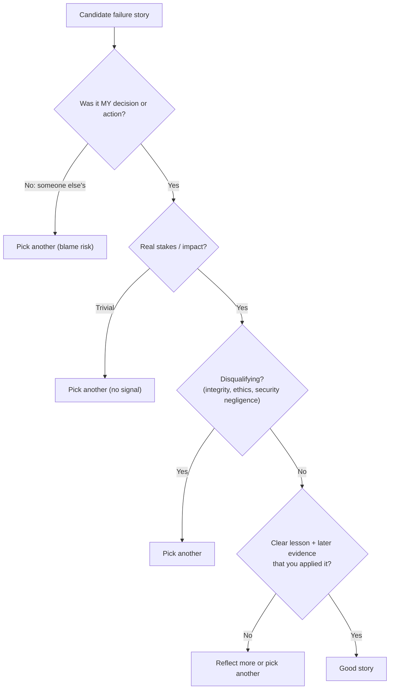
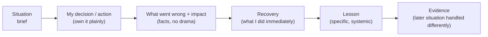

# Failures, Mistakes & Lessons Learned

!!! abstract "Key takeaways"
    - **Interviewers ask about failure to test self-awareness, ownership and learning**, not to catch you out. "I've never really failed" is the worst answer.
    - **Pick a real failure with stakes**, where **you** made a meaningful mistake (not a teammate, and not a trivial typo), that is **not catastrophic or disqualifying** for the role (no ethics or integrity breaches), and that has a **clear lesson you've since applied**.
    - **Structure (STAR-L, with emphasis on L):**
        1. Context.
        2. What **you** did or decided.
        3. What went wrong and its impact, **owned plainly**.
        4. How you **recovered** (communication, mitigation).
        5. **What you learned** and **the evidence you changed** (a later situation where you did it differently).
    - **Weakness questions:** give a **real, current development area** with a concrete improvement plan and progress (e.g. "delegating ambiguous work earlier", "saying no to stakeholders sooner"). Avoid humble-brags ("I work too hard").
    - **Tone:** factual, accountable, no excessive self-criticism, no blame-shifting. End on growth.

## Why it matters

Every behavioural loop includes a failure or mistake question, and Lead roles add "a decision you got wrong" and "a project that didn't go as planned". It's also where candidates most often damage themselves, either by **dodging** (no real failure, or blaming others) or by **oversharing** (a disqualifying failure with no learning). A prepared, honest story turns this into a strength.

## Core concepts

### Choosing the right failure


*Notice that the strongest stories end with **evidence of change**: a later situation where you behaved differently because of the lesson. That's what separates learning from a confession.*

{ loading=lazy }
*Notice where the page's examples land. Only the missed-date story is in the green zone, and it still needs the lesson and the evidence of change.*

### Categories that make good failure stories (examples to adapt honestly)

| Category | Example shape (only use if true) |
|---|---|
| Underestimating complexity | Committed a date before spiking an upstream integration. It slipped. Now you spike risky dependencies first *[confirm]* |
| Holding on to work too long | As a new lead, kept the hardest tasks, became a bottleneck, the team waited. Now you delegate shaped problems earlier *[confirm]* |
| Missing operational readiness | Released without a timeout or alert on a dependency, causing an incident. Now timeouts and SLO alerts are release blockers *[confirm]* |
| Communication | Raised a risk too late to stakeholders. Now you flag amber early with options *[confirm]* |
| Technical decision | Chose a design that didn't scale or was over-engineered, and reversed it with an ADR *[confirm]* |
| People | Gave feedback too late, or not clearly enough. Now early SBI conversations *[confirm]* |

### The answer structure


*Notice the time split: about half on recovery, lesson and evidence. Interviewers want to see what you do **after** a mistake.*

### Weakness answers

- **A real development area** relevant to the role, but not a core requirement (for a Lead role, don't say "I'm bad at communication").
- **Show awareness + a plan + progress:** "I tend to keep ambiguous design problems to myself too long. I now share early drafts within two days and pair someone on them. In the last quarter two engineers drove designs I'd previously have owned." *[confirm a real one]*
- **Avoid:** "perfectionism / working too hard", or weaknesses that are character flaws without a plan.

## In practice: code & configuration

=== "❌ Common mistake"
    ```text
    Q: "Tell me about a failure."
    A1: "I can't think of a real failure; my projects have generally gone well."
    A2: "The project failed because the client kept changing requirements and the QA team
         was slow." (blame)
    A3: "I accidentally deleted the production database and we lost a week of data." (no
         recovery or learning, potentially disqualifying without strong context)
    ```

=== "✅ Correct approach (shape only: fill with a real story)"
    ```text
    S: "Early in my lead role on OptumRx, we planned a feature that depended on an upstream
        system's new endpoint." [confirm]
    M: "I gave the stakeholders a date based on our team's estimate without spiking the
        upstream integration. I assumed their API would match the spec."
    I: "Their response format differed and pagination behaved differently; we slipped by
        about [two weeks] and the client had to move a planned announcement." [confirm]
    R: "As soon as I knew, I told the product owner with two options (ship without that
        data behind a flag, or move the date), paired with the upstream team on the contract,
        and we shipped the phased version."
    L: "Unknown dependencies get a time-boxed spike and a contract test before I commit to
        a date, and I give ranges until then."
    E: "On the next upstream-dependent feature I spiked first and found a mismatch in
        week one; we delivered on the date." [confirm]
    ```

Preparation worksheet:

```yaml
failure_story_1:
  situation: "<brief>"
  my_decision: "<what I chose/did>"
  impact: "<facts: delay, defects, users, cost>"
  recovery: "<immediate actions, communication>"
  lesson: "<specific, systemic>"
  evidence_of_change: "<later situation handled differently>"
failure_story_2: "<a different category (people / technical / communication)>"
weakness:
  area: "<real development area>"
  why_it_matters: "<impact>"
  plan: "<concrete practices>"
  progress: "<evidence>"
```

## Real-world usage

- **Amazon's "Earn Trust"** principle includes being "vocally self-critical". Interviewers expect candid failure stories with ownership.
- **Blameless postmortem culture** (Google SRE, Etsy) values learning from failure. Candidates who describe failures in that language (contributing factors, systemic fixes) signal maturity.
- **Hiring-manager feedback** commonly flags "couldn't name a real failure" and "blamed others" as red flags, and "owned it, fixed it, changed their process" as a strong positive.

## Trade-offs & production gotchas

| Choice | Effect |
|---|---|
| Trivial failure | Safe, but no signal. Interviewers probe for another |
| Major failure with strong learning | Strong signal if recovery and change are clear |
| Disqualifying failure (ethics, integrity) | Avoid |
| Team failure described as "we" | Weak. Find your own contribution |
| Excessive self-criticism | Signals low confidence. Stay factual |

!!! warning "Gotchas"
    - **Never fabricate a failure** to fit the question. Interviewers drill into details.
    - **Don't blame clients, managers or teammates,** even if they contributed. Describe their part neutrally and focus on yours.
    - **Protect confidentiality** (no client names in sensitive failures, no security details).
    - **Have at least two failure stories** of different types. Interviewers often ask for "another one".

## How this connects to my experience

- **Where I used it:** the resume doesn't (and shouldn't) list failures. These stories must come from your memory. Good places to look:
    - Early tech-lead days at Publicis Sapient (delegation, estimates).
    - Upstream integrations on OptumRx (dependencies, contracts).
    - Kafka retry/DLQ workflows (an operational gap you later fixed).
    - Production support incidents (missing timeouts or alerts).
    - The monolith migration at Johnson Controls (scope underestimation).
    - CCKM key rotation (edge cases across cloud providers).

    All *[confirm]*.
- **Talking points:**
    - **Failure story 1 (delivery/estimation)** and **failure story 2 (technical or people)**, each with real evidence of change. *[confirm]*
    - **A real weakness** with a plan and progress. *[confirm]*
    - **A decision you'd make differently today** (architecture or process) for "what would you change?" follow-ups. *[confirm]*
- **Likely follow-up chain:** "Tell me about a failure." → "What would you do differently?" → "How do you know you've changed?" → "Tell me about another one." Answer: own it → specific lesson → evidence → a second story of a different type.

## Interview questions

### Fundamentals

??? question "Q1. Tell me about a time you failed."
    **Answer:** Use the structure (situation → my decision → impact → recovery → lesson → evidence of change) with a real, meaningful failure that isn't disqualifying. *[confirm]*

    **Interviewer listens for:** ownership, recovery, learning applied.

    **Common wrong answer:** "I haven't really failed".

??? question "Q2. What's your biggest weakness?"
    **Answer:** A real development area relevant but not central to the role, with a concrete plan and progress. For example, delegating ambiguous work earlier or raising risks sooner. *[confirm]*

    **Interviewer listens for:** self-awareness + action.

    **Common wrong answer:** "I'm a perfectionist".

??? question "Q3. Tell me about a mistake you made that affected others."
    **Answer:** A case where your decision or action impacted the team or users (a deploy, a missed dependency, unclear communication). How you took responsibility openly, fixed the impact, and changed process or behaviour. *[confirm]*

    **Interviewer listens for:** accountability to others.

    **Common wrong answer:** a mistake that only affected you.

### Intermediate

??? question "Q4. Describe a technical decision you'd make differently today."
    **Answer:** A real architectural or tooling choice *[confirm]*: the original reasoning (valid at the time), what changed or what you learned (scale, operability, team skills), what you'd choose now and why. If it happened, how you corrected course.

    **Interviewer listens for:** judgement evolution, without hindsight bias.

    **Common wrong answer:** "nothing, all my decisions were right".

??? question "Q5. Tell me about a project that didn't go as planned."
    **Answer:** The plan vs reality, the early signals and how quickly you reacted, what you renegotiated (scope, timeline), how you supported the team, the outcome, and what you do differently in planning now.

    **Interviewer listens for:** adaptability and communication.

    **Common wrong answer:** "the client changed everything".

??? question "Q6. How do you react when you realise you made a mistake?"
    **Answer:** Acknowledge it quickly to the people affected, mitigate the impact first, communicate clearly, then analyse contributing factors blamelessly (including my own) and fix the system so it's less likely to happen again. Share the learning with the team.

    **Interviewer listens for:** speed of ownership plus a systemic fix.

    **Common wrong answer:** "fix it quietly so nobody notices".

??? question "Q7. Tell me about a time you received critical feedback."
    **Answer:** Structure: the feedback and who gave it → your first reaction (be honest) → what you did to understand it (asked for examples) → the concrete change you made → evidence the change worked → how you seek feedback now. Pick feedback that was genuinely uncomfortable and relevant to a lead role, such as delegation, communication or review style. *[confirm]*

    **Interviewer listens for:** openness, asking for specifics, a concrete behaviour change, evidence it stuck.

    **Common wrong answer:** "I got feedback that I work too hard." A disguised strength reads as evasive.

### Senior

??? question "Q8. Tell me about a time you failed as a leader."
    **Answer:** A leadership-specific failure *[confirm]*: delayed feedback, poor delegation, burning out the team before a deadline, missing a conflict. What happened to the team, how you repaired it (apology, changes), and how your leadership changed.

    **Interviewer listens for:** a leadership mindset and humility.

    **Common wrong answer:** a purely technical failure.

??? question "Q9. What have you learned from your failures about how you lead?"
    **Answer:** Two or three specific principles drawn from real failures *[confirm]*: for example "spike before committing", "delegate shaped problems early", "bad news early with options", "timeouts and alerts are release blockers". Each tied to a story.

    **Interviewer listens for:** synthesis across experiences.

    **Common wrong answer:** generic platitudes.

??? question "Q10. Tell me about something you missed in a review or design that reached production."
    **Answer:** Own it without self-punishment: what you approved, what the defect did, how it was found and fixed, and the **systemic fix**, such as a test, a contract check, a review checklist item or an alert. Explain what you changed in how you review, for example focusing on failure paths and data boundaries rather than style. Keep the focus on the system, not on the engineer who wrote the code. *[confirm]*

    **Interviewer listens for:** personal ownership, user impact stated, systemic prevention, a change in review practice, no blame.

    **Common wrong answer:** Blaming the author of the code ("they should have tested it") while presenting yourself as only the reviewer.

### Scenario-based

??? question "Q11. The interviewer pushes: 'What was YOUR part in that failure?'"
    **Answer:** Name your specific contribution clearly ("I committed the date without a spike", "I didn't escalate early enough"), without minimising it or over-dramatising it, then return to what you changed.

    **Interviewer listens for:** owning it without defensiveness.

    **Common wrong answer:** shifting to others' roles again.

??? question "Q12. 'Tell me about another failure, a different kind.'"
    **Answer:** Have a second story ready from a different category (people vs technical vs communication), using the same structure. *[confirm]*

    **Interviewer listens for:** depth of self-reflection.

    **Common wrong answer:** repeating the first story.

## Cheat sheet

| Item | Remember |
|---|---|
| Purpose | Self-awareness, ownership, learning applied |
| Pick | Your decision, real stakes, not disqualifying, clear lesson + evidence |
| Structure | Situation → my decision → impact → recovery → lesson → evidence of change |
| Weakness | Real, relevant-not-core, plan + progress. No humble-brags |
| Tone | Factual, accountable, no blame, no self-flagellation |
| Prepare | 2 failure stories (different types) + 1 weakness + 1 decision you'd redo |
| Never | "No failures", blame, fabrication, disqualifying stories |

## Sources
1. [Amazon Leadership Principles: Earn Trust ("vocally self-critical")](https://www.amazon.jobs/content/en/our-workplace/leadership-principles).
2. [Google SRE Book: Postmortem Culture: Learning from Failure](https://sre.google/sre-book/postmortem-culture/).
3. Amy Edmondson, *The Fearless Organization*: psychological safety and learning from failure.
4. Carol Dweck, *Mindset*: the growth mindset framing of setbacks.
5. Resume: `Vishal_Hulawale_Resume_10012026.pdf` (context for where to find stories; failures themselves must come from you).
