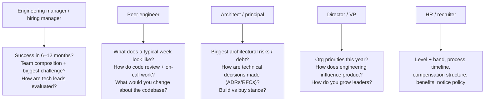
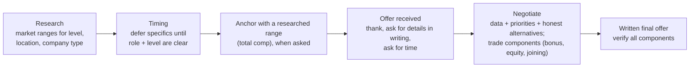

# Questions to Ask the Interviewer; Salary/Role Conversations

!!! abstract "TL;DR"
    - **"Do you have any questions?" is part of the evaluation**, and it's your chance to evaluate them. Ask **specific, role-relevant** questions that show you think like a lead: team, architecture, delivery, ownership, success criteria. Prepare 2–3 per interviewer type.
    - **Listen for red flags:**
        - vague ownership
        - constant firefighting
        - "we don't really do on-call / testing"
        - high attrition
        - a lead role with no influence on hiring or decisions
        - mismatched expectations between interviewers
    - **Level and title:** clarify the **scope** (team size, decision rights, people management or not, on-call, hands-on percentage) and the **level expectations** (the career framework). Titles vary across companies, so **scope and level matter more than the title**.
    - **Salary:**
        - Research ranges (levels.fyi-style sources, peers, recruiters).
        - Think in **total compensation**: fixed, variable/bonus, equity/RSUs + vesting, joining bonus, benefits, leave, insurance, notice buyout, relocation.
        - Give a **researched range** when asked, or defer politely until the role and level are clear.
        - **Negotiate respectfully**, using data and competing offers honestly.
        - **Get everything in writing.**
    - **Be truthful:** don't inflate current compensation or invent offers. Many companies verify, and trust matters more than a small gain.

## Why it matters

The final minutes of each interview and the offer stage shape both the decision and your next few years. Good questions signal seniority and help you avoid a bad fit. A well-handled compensation conversation can make a large difference to total compensation without harming the relationship. Lead candidates are also judged on how they **negotiate professionally**, because that's what they'll do with stakeholders.

## Core concepts

### Questions by interviewer


*Notice that questions are tailored to what each person actually knows. Asking the HR partner about architecture, or the engineer about salary bands, wastes the slot.*

**High-signal questions (pick 2–3 per round):**

- **Role and success:** "What would make someone in this role clearly successful after 6 months? After a year?"
- **Team:** "How is the team structured, and what are the strengths and gaps you're hiring for?"
- **Ownership:** "Which systems would I own end to end, and what decisions are mine vs the architects'?"
- **Delivery:** "How do you plan and estimate? How often do you deploy? What does on-call look like?"
- **Quality:** "How do you handle tech debt vs features? What's your testing and release process?"
- **Architecture:** "What's the biggest technical challenge in the next year?"
- **Culture:** "Tell me about a recent disagreement and how it was resolved." "How are incidents reviewed?"
- **Growth:** "How do engineers progress from senior to lead/staff here? What does the career framework look like?"
- **Domain** (healthcare/fintech): "How do compliance requirements (HIPAA, PCI) affect engineering workflows?"

### Red flags to listen for

| Signal | What it may mean |
|---|---|
| Vague answers on success criteria | Unclear role, shifting expectations |
| "We're always firefighting" | Reliability debt, burnout risk |
| No testing, CI or code review norms | Quality culture issues |
| A lead role with no hiring or decision input | A title without scope |
| Different interviewers describe different jobs | Misalignment. Clarify before accepting |
| High recent attrition, "we need someone urgently" everywhere | Team health issues |
| Pressure to accept immediately | A negotiation tactic. Ask for time |

### Level and title conversations

- **Ask for the career framework** or level expectations, and map your experience to it with evidence: team of 8–10, end-to-end service ownership, standards, hiring, mentoring.
- **Clarify the shape of the role:** IC lead (tech lead, staff) vs people manager (EM). The hands-on percentage. On-call. The number of direct reports, if any.
- **If down-levelled:** ask what evidence would support the higher level, whether there's a re-level review after N months, and whether compensation can reflect the top of the band.
- **Titles vary** ("Lead", "Senior", "Staff" differ by company). Compare **scope + level + compensation**, not titles.

### Salary negotiation principles


*Notice that negotiation is collaborative problem solving over **several components**. When the base is capped by bands, joining bonuses, equity, level or the review timeline can often move.*

**Practical points:**

- **Total compensation:** fixed salary, variable/bonus (target and history), equity (type, vesting schedule, cliff, refreshers), joining bonus (clawback terms), benefits (health insurance coverage including family, retirement contributions), leave, remote/hybrid policy, notice-period buyout, relocation, learning budget.
- **Questions about current salary:** in some jurisdictions they're restricted. Where they're asked, be truthful, or redirect to expectations ("based on my research for this level, I'm looking at a total compensation range of …").
- **Competing offers:** mention them honestly and without ultimatums unless you mean it. Never invent them.
- **Notice period:** be clear about your current notice period and any buyout options. Don't promise dates you can't meet.
- **Be gracious:** thank them, express genuine interest, and keep the tone collaborative. You'll work with these people.

## In practice: code & configuration

=== "❌ Common mistake"
    ```text
    Interviewer: "Any questions for us?"
    Candidate: "No, I think you covered everything." / "What's the salary?" (to the tech panel)

    Recruiter: "What are your salary expectations?"
    Candidate: "Whatever you think is fair." / names a number with no research, base only,
               then accepts the first offer on the call.
    ```

=== "✅ Correct approach"
    ```text
    To the hiring manager:
      "What would success look like for this role in the first six months, and what's the
       biggest challenge the team is facing right now?"
      "Which systems would I own end to end, and how are architecture decisions made?"

    To the recruiter (early):
      "I'd like to understand the role scope and level first. Could you share the band for
       this level? Based on my research for lead roles with similar scope, I'm targeting a
       total compensation in the range of [researched range], but I'm flexible on the mix."

    On receiving an offer:
      "Thank you, I'm excited about the role. Could you send the full breakdown in writing
       (fixed, variable, equity and vesting, joining bonus, benefits)? I'd like a couple of
       days to review it."

    Negotiating:
      "Given the scope (leading 8–10 engineers and owning critical integrations) and my
       research, I was hoping for [X]. If the base is fixed within the band, could we look at
       a joining bonus or the equity component?"
    ```

Offer comparison sheet:

```yaml
offer:
  company: "<name>"
  level_title: "<level / title>"
  scope: {team_size: "<n>", reports: "<0 / n>", hands_on_pct: "<%>", on_call: "<yes/no>"}
  fixed_annual: "<amount>"
  variable_target: "<% / amount>, payout history: <…>"
  equity: {type: "<RSU/ESOP>", grant: "<…>", vesting: "<4y, 1y cliff?>", refreshers: "<…>"}
  joining_bonus: "<amount>, clawback: <…>"
  benefits: {health: "<coverage>", retirement: "<…>", leave: "<days>", wfh: "<policy>"}
  notice_buyout: "<yes/no>"
  growth: "<career framework, re-level review>"
  red_flags: ["<…>"]
```

## Real-world usage

- **levels.fyi, Glassdoor and similar** sources, peer networks and recruiters are commonly used to research bands. Data quality varies, so use several sources.
- **Many large companies negotiate within level bands.** The biggest gains often come from **getting the level right** (scope evidence) rather than pushing base pay within a band.
- **Equity terms differ widely** (RSUs at public companies vs ESOPs at startups, vesting cliffs, liquidity). Understand them before comparing offers.
- **Pay-transparency laws** in some regions require salary ranges in job postings or restrict salary-history questions. Rules vary by country and state.

## Trade-offs & production gotchas

| Approach | Pros | Cons |
|---|---|---|
| Name a researched range early | Filters mismatched roles, saves time | May anchor below the band if research is weak |
| Defer until level is clear | Better-informed anchor | Some recruiters insist. Have a range ready anyway |
| Negotiate multiple components | More room when bands are rigid | Complexity. Compare in total |
| Use competing offers | Strong leverage | Only if real. Ultimatums can backfire |
| Accept on the spot | Speed | Missed value, unverified terms |

!!! warning "Gotchas"
    - **Never lie** about current compensation or competing offers. Verification happens, and trust is lost.
    - **Get the final offer in writing** (all components, joining date, notice buyout) before resigning.
    - **Don't negotiate with the technical panel.** Keep compensation talks to the recruiter or hiring manager.
    - **Respect deadlines, but ask for reasonable time** (a few days) to decide.

## How this connects to my experience

- **Where I used it:**
    - Lead Software Engineer / Technical Lead positioning.
    - Leading 8–10 engineers, owning the GraphQL Consumer Service end to end, establishing standards, conducting interviews (evidence for the level).
    - AWS Certified Solutions Architect – Associate.
    - Healthcare, banking and cloud-security domain experience.
- **Talking points:**
    - **Level evidence pack:** team leadership (8–10), end-to-end ownership of a critical integration layer (5 upstreams, 750K+ users), standards adoption, hiring participation, mentoring 5+ engineers, multi-cloud security background. *[confirm metrics]*
    - **Your target role shape:** tech lead (IC-heavy) vs engineering manager, the hands-on percentage you want, the domains you prefer. *[confirm preferences]*
    - **Your researched compensation range and priorities** (base vs equity vs learning, remote policy). *[confirm. Keep this page free of personal numbers]*
    - **2–3 tailored questions per company**, based on their domain and stage.
- **Likely follow-up chain:** "Why this company?" → "What are your expectations?" → "What's your notice period?" → "Do you have other offers?" Answer: a specific motivation → a researched total-comp range and flexibility → the truthful notice period and buyout options → honest status, without pressure tactics.

## Interview questions

### Fundamentals

??? question "Q1. Do you have any questions for us?"
    **Answer:** Always yes. Ask 2–3 tailored questions (success criteria, team challenges, ownership and decision rights, delivery practices, growth path), adapted to the interviewer's role. Listen and follow up.

    **Interviewer listens for:** curiosity and seniority.

    **Common wrong answer:** "No, all clear".

??? question "Q2. What are your salary expectations?"
    **Answer:** "I'd like to understand the role and level first. Based on my research for similar lead roles, I'm targeting a total compensation range of [researched range], and I'm open on the mix." If they press, give the researched range for total compensation.

    **Interviewer listens for:** professionalism and realism.

    **Common wrong answer:** "anything is fine" or an unresearched number.

??? question "Q3. Why are you leaving your current role?"
    **Answer:** Forward-looking: the scope, scale or domain you want next, plus what you've achieved. No criticism of the current employer.

    **Interviewer listens for:** a positive motivation aligned with the role.

    **Common wrong answer:** complaints or "only for money".

### Intermediate

??? question "Q4. What would make you choose us over another offer?"
    **Answer:** Name genuine criteria (scope and ownership, technical challenges, team quality, growth path, domain, compensation) and how this role compares. Be honest without pressure tactics.

    **Interviewer listens for:** clear priorities.

    **Common wrong answer:** "whoever pays more".

??? question "Q5. We see you at a senior level rather than lead. How do you respond?"
    **Answer:** Ask for the specific gaps against their framework. Share evidence of lead-level scope (team of 8–10, end-to-end ownership, standards, hiring, mentoring) with examples. Ask about a re-level review after 6 months or compensation at the top of the band. Decide based on scope, not title alone.

    **Interviewer listens for:** evidence-based, calm advocacy.

    **Common wrong answer:** an emotional reaction, or rejecting outright.

??? question "Q6. What's your notice period, and can you join earlier?"
    **Answer:** State the actual notice period and any options (buyout, early release negotiated with your employer), and give a realistic date. Don't over-promise.

    **Interviewer listens for:** honesty and planning.

    **Common wrong answer:** promising immediate joining without checking.

### Senior

??? question "Q7. How do you evaluate whether a lead role is real or just a title?"
    **Answer:** Ask about decision rights (architecture, hiring), team size and composition, who the role reports to, the success metrics, on-call and production ownership, hands-on expectations, and how leads are assessed. Check consistency across interviewers.

    **Interviewer listens for:** due diligence.

    **Common wrong answer:** "the title says lead, so it's fine".

??? question "Q8. How do you negotiate when the base salary band is fixed?"
    **Answer:** Negotiate other components: the level, joining bonus, equity grant or refreshers, variable target, review timing, a notice buyout, relocation, learning budget, remote flexibility. Present your case with scope and market data, and be clear about what matters most to you.

    **Interviewer listens for:** multi-dimensional thinking.

    **Common wrong answer:** "then nothing can be done".

### Scenario-based

??? question "Q9. The recruiter asks for your current salary and you'd rather not share it. What do you say?"
    **Answer:** Where it's legal and appropriate, politely redirect: "I'd prefer to focus on the value of this role. Based on research for this level, my expectation is [range]." If company policy requires it, be truthful. Never inflate it.

    **Interviewer listens for:** a polite boundary plus honesty.

    **Common wrong answer:** inventing a number.

??? question "Q10. You get an exploding offer: accept within 24 hours. What do you do?"
    **Answer:** Thank them, express interest, and ask for a reasonable extension (2–3 business days) to review the written details and discuss with family. Explain that you want to make a committed decision. If they refuse, weigh it against your criteria. Pressure is often a red flag.

    **Interviewer listens for:** a calm, principled response.

    **Common wrong answer:** accepting without reading the terms.

## Cheat sheet

| Item | Remember |
|---|---|
| Questions | 2–3 per interviewer, tailored (EM: success. Peer: daily reality. Architect: risks. Director: strategy. HR: process and bands) |
| Red flags | Vague success criteria, constant firefighting, no quality practices, title without scope, inconsistent stories |
| Level | Scope + decision rights + career framework > title. Ask for gaps and a re-level path |
| Comp | Total: fixed + variable + equity (vesting) + joining + benefits + notice buyout |
| Negotiate | Research → range → written offer → several components → honest alternatives |
| Never | Lie about salary or offers, negotiate with the tech panel, resign before a written offer |

## Sources
1. Deepak Malhotra, *Negotiating the Impossible* and HBR articles on job-offer negotiation (e.g. ["15 Rules for Negotiating a Job Offer"](https://hbr.org/2014/04/15-rules-for-negotiating-a-job-offer)).
2. [levels.fyi](https://www.levels.fyi/): level and compensation benchmarks (verify with several sources).
3. Patrick McKenzie, *Salary Negotiation: Make More Money, Be More Valued* (kalzumeus.com).
4. Will Larson, *Staff Engineer*: evaluating senior and lead roles, and titles vs scope.
5. Resume: `Vishal_Hulawale_Resume_10012026.pdf` (evidence for level discussions).
