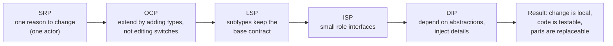
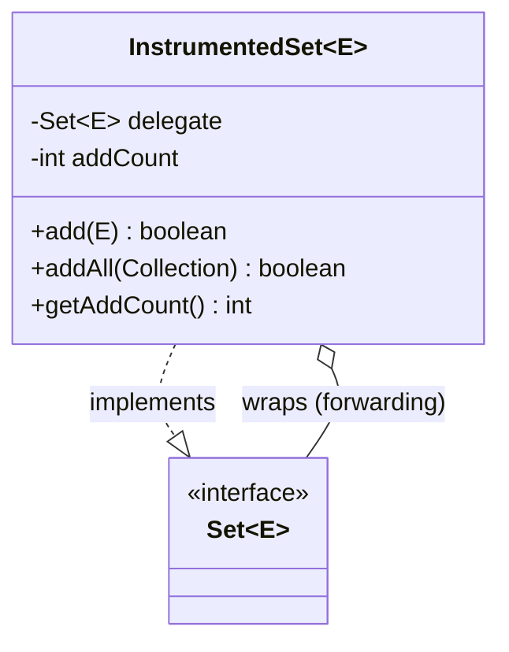

# SOLID, DRY, KISS, YAGNI, Composition over Inheritance

!!! abstract "Key takeaways"
    - **S**ingle Responsibility: a class should have **one reason to change**, meaning one actor or stakeholder it serves (not "does one thing").
    - **O**pen/Closed: **open for extension, closed for modification**. Add behaviour by adding new types (polymorphism, strategies), not by editing a growing `if/switch`.
    - **L**iskov Substitution: subtypes must honour the **contract** of their base type (pre-conditions no stronger, post-conditions no weaker, invariants kept). Square-extends-Rectangle and `UnsupportedOperationException` overrides are the classic violations.
    - **I**nterface Segregation: clients shouldn't depend on methods they don't use. Prefer **small, role-based interfaces**.
    - **D**ependency Inversion: high-level policy depends on **abstractions**, and details implement them. Inject dependencies (constructor injection, Spring).
    - **DRY** = one source of truth for each piece of *knowledge*, not "never repeat similar-looking code". **KISS** and **YAGNI** stop you over-applying SOLID: don't add abstractions for imagined change. **Composition over inheritance:** inheritance couples you to the parent's implementation (fragile base class). Compose behaviour from collaborators, and use inheritance for true is-a relationships with designed-for-extension bases.

## Why it matters

LLD rounds and code reviews judge **design judgement**: can you structure code so it's easy to change, test and understand? Interviewers ask "which SOLID principle does this violate?", "refactor this", or "why not inheritance here?". Senior candidates also explain **when not** to apply a principle. Over-abstracted code is as costly as tangled code.

## Core concepts

### SOLID at a glance


*Notice that the principles support each other: SRP and ISP produce small units, DIP lets you swap them (and mock them in tests), OCP lets you add behaviour with new units, and LSP makes sure the swaps are safe.*

### S: Single Responsibility

"One reason to change" means **one actor** whose requirements drive changes. A `PrescriptionReport` that calculates totals (finance rules), formats a PDF (UX rules) and emails it (infrastructure) changes for three different reasons.

### O: Open/Closed

Adding a new payment method shouldn't mean editing a 300-line `switch` in five places. Put the varying behaviour behind an interface, and new behaviour becomes a new class (Strategy). **Nuance in Java 21:** with **sealed interfaces + pattern-matching `switch`**, the compiler forces you to handle every case. That's great for a **closed set of data variants** (adding an *operation* is easy, adding a *variant* touches every switch, which is the expression problem). Choose polymorphism when variants grow often, and sealed + switch when operations grow often.

### L: Liskov Substitution

A subtype must work anywhere the base type is expected, without surprises:

- **Pre-conditions** can't be strengthened (it can't demand more of callers).
- **Post-conditions** can't be weakened (it can't promise less).
- **Invariants** must be preserved. No new exceptions the base contract doesn't allow.

**Classic violations:**

- `Square extends Rectangle`: `setWidth` changes the height too.
- `ReadOnlyAccount extends Account` with `withdraw()` throwing.
- Overriding `equals` in a subclass and breaking symmetry.

Java's own `List.of(...)` throwing on `add` is a known compromise: the `List` contract marks mutators as *optional*.

### I: Interface Segregation

A fat `PharmacyService` interface with `dispense`, `reportInventory`, `processRefund`, `exportAudit` forces every implementer and every client to depend on everything. Split it into role interfaces (`Dispenser`, `InventoryReporter`, ...). In Spring, smaller interfaces also mean narrower mocks and clearer dependencies.

### D: Dependency Inversion

High-level modules (business policy) shouldn't import low-level modules (SMTP client, JDBC). Both depend on an **abstraction owned by the high-level side** (`NotificationSender`), and infrastructure implements it. **Dependency injection** (constructor injection in Spring) is the mechanism; DIP is the principle. This is the core of hexagonal/clean architecture (ports and adapters).

### DRY, KISS, YAGNI

- **DRY:** "Every piece of knowledge must have a single, unambiguous, authoritative representation" (*The Pragmatic Programmer*). Two similar-looking code blocks that change for **different reasons** are **not** duplication. Merging them creates coupling. The **rule of three** says abstract on the third occurrence, once you understand the variation.
- **KISS:** prefer the simplest design that meets current requirements. A clear `if` beats a strategy hierarchy with one implementation.
- **YAGNI:** don't build for speculative requirements. Keep code **easy to change** instead (tests, small units). That's cheaper than guessing the future.

### Composition over inheritance


*Notice that the wrapper **has-a** `Set` and forwards calls to it. It doesn't depend on how `HashSet.addAll` is implemented internally, which is exactly what broke the inheritance version (Effective Java, Item 18).*

**Why inheritance is risky:**

- A subclass depends on the parent's **implementation details** (self-use of overridable methods), so a parent change can break it (the fragile base class problem).
- It's static: you can't change behaviour at runtime.
- Single inheritance in Java.
- Deep hierarchies hide behaviour.

**When inheritance is fine:** a genuine is-a relationship, a base class **designed and documented for extension** (template method, or `abstract` with `protected` hooks), the same package or team, and sealed hierarchies for closed sets of variants.

## In practice: code & configuration

=== "❌ Common mistake"
    ```java
    // SRP + OCP + DIP violations in one class.
    public class PrescriptionNotifier {
        public void notify(Prescription rx, String channel) {
            String msg = "Dear " + rx.patientName() + ", your " + rx.drug() + " is ready";   // formatting + PHI
            switch (channel) {                                   // every new channel = edit this class
                case "SMS"   -> new TwilioClient("hardcoded-key").send(rx.phone(), msg);   // concrete dependency
                case "EMAIL" -> new SmtpClient("smtp.internal").send(rx.email(), msg);
                default      -> throw new IllegalArgumentException(channel);
            }
            new JdbcTemplate(DataSourceHolder.get())             // persistence mixed in
                .update("INSERT INTO notif_log VALUES (?, ?)", rx.id(), channel);
        }
    }

    // Inheritance misuse: counts are wrong because HashSet.addAll calls add() internally.
    class InstrumentedHashSet<E> extends HashSet<E> {
        int addCount;
        @Override public boolean add(E e) { addCount++; return super.add(e); }
        @Override public boolean addAll(Collection<? extends E> c) { addCount += c.size(); return super.addAll(c); }
    }   // addAll(List.of(a, b, c)) → addCount = 6, not 3
    ```

=== "✅ Correct approach"
    ```java
    // DIP: the policy owns the abstraction; adapters implement it.
    public interface NotificationChannel {                       // ISP: one small role
        ChannelType type();
        void send(Recipient to, Message message);
    }

    @Component
    class SmsChannel implements NotificationChannel {            // OCP: new channel = new class
        private final SmsProviderClient client;                  // injected, mockable
        SmsChannel(SmsProviderClient client) { this.client = client; }
        public ChannelType type() { return ChannelType.SMS; }
        public void send(Recipient to, Message m) { client.send(to.phone(), m.text()); }
    }

    @Service
    class PrescriptionNotifier {                                 // SRP: orchestrates only
        private final Map<ChannelType, NotificationChannel> channels;
        private final MessageTemplates templates;                // formatting is someone else's job
        private final NotificationLog log;                       // persistence is someone else's job

        PrescriptionNotifier(List<NotificationChannel> all, MessageTemplates templates, NotificationLog log) {
            this.channels = all.stream().collect(Collectors.toMap(NotificationChannel::type, c -> c));
            this.templates = templates;
            this.log = log;
        }

        void rxReady(Prescription rx, ChannelType type) {
            Message m = templates.rxReady(rx);                   // PHI-minimal template
            channels.get(type).send(rx.recipient(), m);
            log.record(rx.id(), type);
        }
    }

    // Composition: forwarding wrapper, independent of HashSet internals.
    final class InstrumentedSet<E> extends ForwardingSet<E> {    // ForwardingSet delegates every Set method
        private int addCount;
        InstrumentedSet(Set<E> delegate) { super(delegate); }
        @Override public boolean add(E e) { addCount++; return super.add(e); }
        @Override public boolean addAll(Collection<? extends E> c) { addCount += c.size(); return super.addAll(c); }
        int addCount() { return addCount; }
    }   // addAll(List.of(a, b, c)) → addCount = 3
    ```

Java 21: a sealed hierarchy where the **set of variants is closed** and you add operations:

```java
sealed interface Discount permits Percentage, FixedAmount, BuyXGetY {}
record Percentage(BigDecimal pct) implements Discount {}
record FixedAmount(BigDecimal amount) implements Discount {}
record BuyXGetY(int x, int y) implements Discount {}

static BigDecimal apply(Discount d, Cart cart) {
    return switch (d) {                                          // exhaustive: compiler checks all cases
        case Percentage p  -> cart.total().multiply(BigDecimal.ONE.subtract(p.pct()));
        case FixedAmount f -> cart.total().subtract(f.amount()).max(BigDecimal.ZERO);
        case BuyXGetY b    -> cart.applyBuyXGetY(b.x(), b.y());
    };
}
// Adding a new operation (describe(), validate()) is easy. Adding a variant breaks the
// compile in every switch, which is deliberate here.
```

## Real-world usage

- **Spring** is built on DIP and OCP: you depend on interfaces (`JdbcOperations`, `PlatformTransactionManager`), extend through beans (`HandlerInterceptor`, `BeanPostProcessor`), and swap implementations through configuration.
- **Hexagonal / clean architecture** applies DIP at the module level: the domain defines ports, and adapters (REST, Kafka, JPA) implement them.
- **JDK lessons:** `Stack extends Vector` and `Properties extends Hashtable` are famous inheritance mistakes (they expose methods that break the abstraction). `Collections.unmodifiableList` shows LSP trade-offs.
- **Over-engineering failures** are equally common: interfaces with one implementation "for flexibility", factories for objects that never vary, layers that only forward calls. Many teams' "clean code" refactors made change harder.

## Trade-offs & production gotchas

| Principle | Over-applied looks like | Right-sized |
|---|---|---|
| SRP | 30 tiny classes for one feature | Split when parts change for different reasons |
| OCP | Plugin framework for 2 cases | Strategy when variants actually grow |
| ISP | An interface per method | Role-based interfaces for different clients |
| DIP | Interfaces for every class, including value objects | Abstractions at boundaries (I/O, external systems) |
| DRY | Shared "utils" coupling unrelated modules | Single source for real domain knowledge (rules, schemas) |
| Composition | Wrapping everything | Use inheritance for true is-a + designed-for-extension bases |

!!! warning "Gotchas"
    - **Mocking concrete classes everywhere** usually signals missing DIP at real boundaries (or over-mocking of internals).
    - **Shared DTO or "common" libraries** across microservices violate DRY's intent by coupling deployments. Duplicate small DTOs per service instead.
    - **Protected fields** in base classes leak implementation. Prefer private state with protected hook methods.

!!! question "Interview angle"
    When asked to "apply SOLID", **name the change you're protecting against**: "New payment methods arrive every quarter, so I'll use a strategy here. Report formats never change, so a simple method is fine." That's the senior signal.

## How this connects to my experience

- **Where I used it:**
    - Spring Boot microservices across all projects. "Established engineering standards around testing, CI/CD, code quality" (OptumRx).
    - "Mentored 5+ engineers through code reviews, design reviews."
    - Johnson Controls monolith-to-microservices migration (SRP at service level).
- **Talking points:**
    - "In code reviews I push for constructor injection and interfaces at I/O boundaries (upstream clients, Kafka producers), so services are testable and adapters swappable. But not interfaces for every class." *[confirm: review standards you set]*
    - "In the GraphQL layer, each upstream got its own client behind a port interface: SRP + DIP, plus a natural place for timeouts and breakers." *[confirm]*
    - "I've refactored switch-heavy code into strategies when variants kept growing, for example notification channels or pricing rules." *[confirm: real example]*
- **Likely follow-up chain:** "Give a real SRP violation you fixed." → "How do you avoid over-engineering?" → "Composition vs inheritance in your code?" → "How do you teach this to juniors?" Use review examples and the rule of three.

## Interview questions

### Fundamentals

??? question "Q1. State SOLID in one line each."
    **Answer:**
    - **SRP:** one reason to change (one actor).
    - **OCP:** extend behaviour without modifying existing code.
    - **LSP:** subtypes are substitutable without breaking the contract.
    - **ISP:** clients depend only on the methods they use.
    - **DIP:** depend on abstractions, and inject concrete details.

    **Interviewer listens for:** "reason to change", not "does one thing".

    **Common wrong answer:** "SRP means one method per class".

??? question "Q2. Give an LSP violation."
    **Answer:** `Square extends Rectangle`: setting the width also changes the height, which breaks callers that expect independent dimensions. Or a subclass that throws `UnsupportedOperationException` for a base method, or adds stricter pre-conditions. The fix is a different abstraction (`Shape` with `area()`), or no inheritance.

    **Interviewer listens for:** contract (pre/post-conditions).

    **Common wrong answer:** "LSP means you can cast".

??? question "Q3. DIP vs dependency injection?"
    **Answer:** DIP is the **principle**: high-level policy and low-level details both depend on abstractions owned by the policy side. DI is a **technique** for supplying dependencies from outside (constructor injection, containers like Spring). You can use DI without DIP (injecting concrete classes), which gets you less benefit.

    **Interviewer listens for:** the principle vs mechanism distinction.

    **Common wrong answer:** "they're the same".

??? question "Q4. What does DRY actually mean?"
    **Answer:** A single authoritative representation of each piece of **knowledge** (a business rule, a schema). Code that looks similar but changes for different reasons isn't duplication. Merging it couples unrelated changes. Abstract once you understand the variation (rule of three).

    **Interviewer listens for:** knowledge vs text.

    **Common wrong answer:** "never copy-paste anything".

### Intermediate

??? question "Q5. Why prefer composition over inheritance?"
    **Answer:** Inheritance couples a subclass to the parent's implementation (fragile base class: the `InstrumentedHashSet` double counting), is fixed at compile time, and can expose inappropriate methods (`Stack extends Vector`). Composition depends only on interfaces, can change at runtime, and keeps encapsulation. Use inheritance for real is-a relationships with bases designed for extension.

    **Interviewer listens for:** the fragile base class example.

    **Common wrong answer:** "inheritance is bad".

??? question "Q6. How do sealed interfaces relate to OCP?"
    **Answer:** Sealed + exhaustive `switch` deliberately **closes** the set of variants. Adding an operation is easy and checked by the compiler, but adding a variant changes every switch. Polymorphism (interface + implementations) is the opposite. That's the expression problem: choose based on which axis changes more often.

    **Interviewer listens for:** the nuanced trade-off.

    **Common wrong answer:** "sealed classes violate OCP, so avoid them".

??? question "Q7. Refactor a fat interface. How and why?"
    **Answer:** Identify the client roles that use different subsets, and split into role interfaces (`Dispenser`, `InventoryReporter`). The implementation can implement several. Clients depend on the narrow one. This gives fewer recompiles and mocks, clearer contracts, and easier alternative implementations.

    **Interviewer listens for:** client-driven splitting.

    **Common wrong answer:** "one interface per method".

??? question "Q8. What are cohesion and coupling, and how do the principles relate to them?"
    **Answer:** **Cohesion** is how closely the parts of one module belong together. **Coupling** is how much one module depends on the details of another. The goal is **high cohesion, low coupling**. SRP and ISP raise cohesion (one reason to change, small focused interfaces). DIP and OCP lower coupling (depend on abstractions, extend without editing). Composition lowers coupling compared with inheritance, which exposes the parent's internals to the child. When an interviewer asks "why is this design better?", answer in these two words first, then name the principle.

    **Interviewer listens for:** definitions, the high-cohesion/low-coupling goal, which principle affects which property.

    **Common wrong answer:** "Low coupling means no dependencies." Modules must depend on each other; the aim is to depend on stable abstractions, not details.

### Senior

??? question "Q9. When would you deliberately NOT apply SOLID?"
    **Answer:**
    - Simple, stable code (scripts, glue).
    - Prototypes.
    - Single-implementation internals where an interface adds only indirection.
    - Hot paths where indirection costs measurable performance.

    KISS and YAGNI win until change pressure shows up. Then refactor, with tests as the safety net.

    **Interviewer listens for:** judgement and refactoring confidence.

    **Common wrong answer:** "always apply all principles".

??? question "Q10. How does DIP shape a service's architecture?"
    **Answer:** In hexagonal/clean architecture, the domain defines **ports** (interfaces: `PrescriptionRepository`, `PaymentGateway`), and **adapters** implement them (JPA, REST client, Kafka). Dependencies point inward, so the domain has no framework imports and is testable with fakes, and adapters are replaceable (swap PSP, DB, broker).

    **Interviewer listens for:** dependency direction at the architecture level.

    **Common wrong answer:** "controllers → services → repositories layering is DIP".

### Scenario-based

??? question "Q11. A `PaymentService` has a 400-line switch over 9 payment methods, edited every sprint. Refactor it."
    **Answer:**
    1. Characterisation tests first.
    2. Extract a `PaymentMethodHandler` interface (`supports`, `authorise`, `refund`).
    3. One class per method, registered through Spring (a map by type).
    4. Move shared steps into a template or helper (not inheritance unless designed for it).
    5. The service becomes a dispatcher.
    6. Add new methods as new classes and feature-flag the rollout.
    7. Migrate case by case behind the tests.

    **Interviewer listens for:** a safe, incremental refactor.

    **Common wrong answer:** "rewrite it all".

??? question "Q12. A junior created interfaces for every class 'for SOLID'. How do you give feedback?"
    **Answer:** Acknowledge the intent, then explain that the value of abstractions is at **boundaries and points of variation**. Single-implementation internal interfaces add indirection without benefit. Agree on a team guideline: interfaces for I/O ports and real variants, concrete classes otherwise, and mock only at boundaries. Pair on a refactor. Give the feedback in the review, privately and kindly.

    **Interviewer listens for:** mentoring plus a standards mindset.

    **Common wrong answer:** "reject the PR".

## Cheat sheet

| Principle | Remember | Smell |
|---|---|---|
| SRP | One actor / reason to change | God class, "and" in the class description |
| OCP | Add types, don't edit switches | Same switch in many places |
| LSP | Keep the contract (pre ≤, post ≥, invariants) | Overrides that throw or no-op |
| ISP | Small role interfaces | Clients implementing unused methods |
| DIP | Policy owns abstractions, details implement them | `new` of infrastructure inside the domain |
| DRY | One source per piece of knowledge | Same rule coded in 3 services |
| KISS / YAGNI | Simplest design for today, easy to change | Abstractions with 1 implementation, speculative configs |
| Composition | Has-a + forwarding | Deep hierarchies, fragile base classes |
| Java 21 | Sealed + records + switch for closed variant sets | n/a |

## Sources
1. Robert C. Martin, *Clean Architecture* (ch. 7–11, SOLID; "actor"-based SRP) and *Agile Software Development: Principles, Patterns, and Practices*.
2. Joshua Bloch, *Effective Java* (3rd ed.), Item 18 "Favor composition over inheritance", Item 19 "Design and document for inheritance or else prohibit it".
3. Barbara Liskov & Jeannette Wing, *A Behavioral Notion of Subtyping* (1994): the formal LSP.
4. Andrew Hunt & David Thomas, *The Pragmatic Programmer* (20th anniv. ed.): DRY as knowledge.
5. [Martin Fowler: Yagni](https://martinfowler.com/bliki/Yagni.html) and [Rule of three in *Refactoring*](https://martinfowler.com/books/refactoring.html).
6. [JEP 409: Sealed Classes](https://openjdk.org/jeps/409) and [JEP 441: Pattern Matching for switch](https://openjdk.org/jeps/441).
7. [Alistair Cockburn: Hexagonal architecture](https://alistair.cockburn.us/hexagonal-architecture/).
