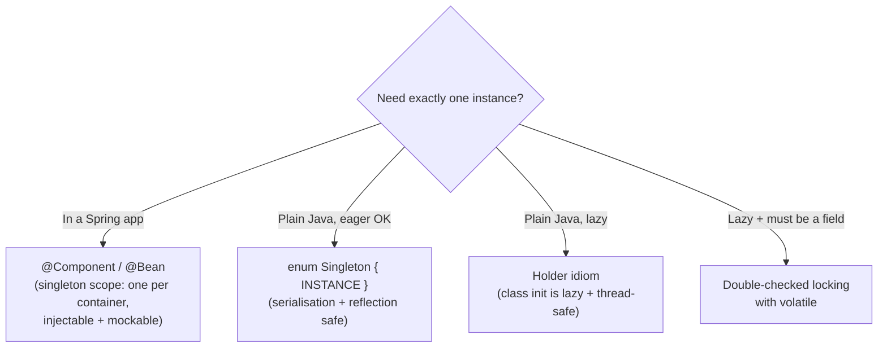
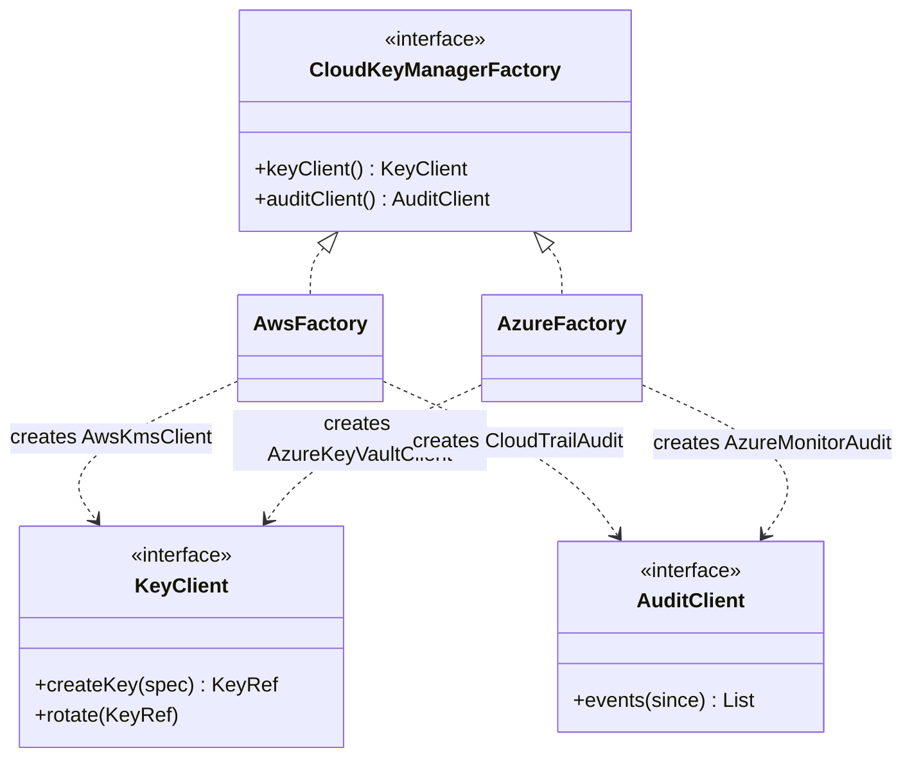

# Creational Patterns (Singleton, Factory, Builder, Prototype)

!!! abstract "TL;DR"
    - Creational patterns **decouple object creation from use**, so callers don't hard-code `new ConcreteThing(...)` with complex wiring.
    - **Singleton:** one instance per JVM/classloader.
        - Safest forms are the **`enum` singleton** and the **holder idiom**. Double-checked locking needs a **`volatile`** field.
        - In Spring apps, prefer **singleton-scoped beans** (one per container, injectable, mockable) over GoF singletons, which are global state and hard to test.
    - **Factories:**
        - **Static factory methods** (`of`, `from`, `valueOf`) give names, caching and subtype returns.
        - **Factory Method:** a subclass or strategy decides which product to create.
        - **Abstract Factory:** creates **families** of related products that must match (UI kits, cloud providers).
    - **Builder:** step-by-step construction of complex objects with many optional parameters. It avoids telescoping constructors and **validates in `build()`**, producing **immutable** objects. Use Lombok `@Builder` or a hand-written builder. For simple data, records with compact constructors.
    - **Prototype:** create new objects by **copying** an existing one. In Java, avoid `Cloneable`/`clone()` (broken contract) and use copy constructors, copy factories, or immutable records with `withX` methods.

## Why it matters

LLD interviews often start with "how would you create X?", and every Java codebase uses these patterns, usually implicitly through Spring, Lombok and the JDK (`List.of`, `HttpClient.newBuilder()`). Interviewers probe thread-safe Singleton, Factory vs Abstract Factory, and why Builder instead of constructors. Senior answers also cover the **anti-pattern side**: singletons as hidden global state, and factories that add indirection without variation.

## Core concepts

### Singleton


*Notice that the default in modern Java services is the **container**-managed singleton. The GoF Singleton (a static `getInstance()`) creates global state that's hard to replace in tests and couples callers to a concrete class.*

Thread-safe options:

| Form | Lazy? | Thread-safe? | Notes |
|---|---|---|---|
| `enum` singleton | No (on first enum use) | Yes | Effective Java's recommendation. Safe against reflection and serialisation attacks |
| Eager static final | No | Yes | Simplest |
| **Holder idiom** | Yes | Yes (JVM class init) | Inner static class initialised on first `get()` |
| Double-checked locking | Yes | Only with **`volatile`** | Without `volatile`, another thread can see a partially constructed object |
| `synchronized getInstance()` | Yes | Yes | Contention on every call |

**Pitfalls:**

- One instance per **classloader** (app servers, tests).
- Serialisation creates new instances unless you use `readResolve` (or an enum).
- Reflection can call private constructors (an enum prevents this).
- Mutable singletons are shared state, so they need thread safety.

### Factories

| Variant | What it is | Example |
|---|---|---|
| **Static factory method** | A named static method instead of a constructor | `List.of`, `Optional.ofNullable`, `Duration.ofSeconds`, `EnumSet.noneOf` (returns different subtypes) |
| Simple factory | One class with a `create(type)` switch | OK for small, stable sets |
| **Factory Method (GoF)** | A creator declares `createProduct()`, and subclasses or injected strategies decide | `Collection.iterator()`, Spring `FactoryBean` |
| **Abstract Factory (GoF)** | An interface for creating **families** of related products | `DocumentBuilderFactory`, a cloud SDK per provider: `KmsClient` + `StorageClient` that must match |


*Notice the **family** constraint: an AWS key client must be paired with the AWS audit client. Abstract Factory guarantees matching products, which is exactly the multi-cloud key-management (CCKM) situation.*

**Static factory advantages** (Effective Java, Item 1):

- They have names (`fromJson`, `ofCents`).
- They can return cached instances (`Boolean.valueOf`) or subtypes.
- They can hide implementation classes.

The downside: classes with only private constructors can't be subclassed (often fine).

### Builder

The problem: a constructor with 9 parameters, 6 of them optional (telescoping constructors), or a JavaBean with setters (mutable, and can be half-initialised).

The Builder pattern:

- Required parameters go in the builder's constructor or as mandatory steps.
- Optional parameters are fluent setters.
- **`build()` validates invariants** and creates an **immutable** object.

Variants:

- **Lombok `@Builder`** (plus `toBuilder = true` for copies).
- **Staged/step builders** use types to force required steps.
- JDK examples: `HttpClient.newBuilder()`, `HttpRequest.newBuilder()`, `StringBuilder` (a different meaning).
- **Records:** for small data, a record with a compact constructor (validation) is simpler than a builder. Add a builder only when there are many optional fields.

### Prototype

Create objects by copying a configured instance. It's useful when construction is expensive or the configuration is complex (templates, default request configs).

- **Avoid `Cloneable`:** `clone()` is protected and shallow by default, bypasses constructors, and conflicts with `final` fields (Effective Java, Item 13).
- **Prefer:** copy constructors (`new Order(Order other)`), copy factories, Lombok `toBuilder()`, or **immutable records + `withX`** methods (copy-on-write).
- Watch **deep vs shallow** copies of mutable fields (lists, dates).

## In practice: code & configuration

=== "❌ Common mistake"
    ```java
    // Broken double-checked locking: no volatile, so another thread may see a half-built instance.
    public class ConfigRegistry {
        private static ConfigRegistry instance;
        private final Map<String, String> values = new HashMap<>();   // also mutable shared state
        private ConfigRegistry() { load(); }
        public static ConfigRegistry getInstance() {
            if (instance == null) {
                synchronized (ConfigRegistry.class) {
                    if (instance == null) instance = new ConfigRegistry();   // reordering hazard
                }
            }
            return instance;
        }
    }

    // Telescoping constructor: which boolean is which?
    new Prescription("RX1", "P42", "NDC123", 30, 2, true, false, null, "Dr Rao");
    ```

=== "✅ Correct approach"
    ```java
    // Plain-Java lazy singleton: holder idiom (JVM guarantees lazy, thread-safe class init).
    public final class ConfigRegistry {
        private final Map<String, String> values;                  // immutable after construction
        private ConfigRegistry() { this.values = Map.copyOf(load()); }
        private static final class Holder { static final ConfigRegistry INSTANCE = new ConfigRegistry(); }
        public static ConfigRegistry get() { return Holder.INSTANCE; }
        public Optional<String> value(String key) { return Optional.ofNullable(values.get(key)); }
    }
    // Or: enum ConfigRegistry { INSTANCE; ... }. In Spring: just @Component and inject it.

    // Builder with validation → immutable object.
    public final class Prescription {
        private final String rxId, patientId, ndc, prescriber;
        private final int quantity, refills;
        private final boolean controlled;

        private Prescription(Builder b) {
            this.rxId = b.rxId; this.patientId = b.patientId; this.ndc = b.ndc;
            this.prescriber = b.prescriber; this.quantity = b.quantity;
            this.refills = b.refills; this.controlled = b.controlled;
        }
        public static Builder builder(String rxId, String patientId, String ndc) {   // required up front
            return new Builder(rxId, patientId, ndc);
        }
        public static final class Builder {
            private final String rxId, patientId, ndc;
            private String prescriber;
            private int quantity = 30, refills = 0;
            private boolean controlled;
            private Builder(String rxId, String patientId, String ndc) {
                this.rxId = Objects.requireNonNull(rxId);
                this.patientId = Objects.requireNonNull(patientId);
                this.ndc = Objects.requireNonNull(ndc);
            }
            public Builder prescriber(String v) { this.prescriber = v; return this; }
            public Builder quantity(int v)      { this.quantity = v; return this; }
            public Builder refills(int v)       { this.refills = v; return this; }
            public Builder controlled(boolean v){ this.controlled = v; return this; }
            public Prescription build() {
                if (quantity <= 0) throw new IllegalArgumentException("quantity must be > 0");
                if (controlled && refills > 5) throw new IllegalArgumentException("controlled: max 5 refills");
                if (prescriber == null) throw new IllegalStateException("prescriber required");
                return new Prescription(this);
            }
        }
    }
    Prescription rx = Prescription.builder("RX1", "P42", "NDC123")
            .prescriber("Dr Rao").quantity(30).refills(2).controlled(false).build();
    ```

Factory selection with Spring (strategy registry instead of a `switch`):

```java
public interface KeyManager { CloudProvider provider(); KeyRef createKey(KeySpec spec); }

@Component
public class KeyManagerFactory {
    private final Map<CloudProvider, KeyManager> byProvider;
    public KeyManagerFactory(List<KeyManager> managers) {          // Spring injects every implementation
        this.byProvider = managers.stream()
                .collect(Collectors.toUnmodifiableMap(KeyManager::provider, m -> m));
    }
    public KeyManager forProvider(CloudProvider p) {
        return Optional.ofNullable(byProvider.get(p))
                .orElseThrow(() -> new IllegalArgumentException("Unsupported provider " + p));
    }
}
// Prototype in modern Java: an immutable record with a "wither".
public record RetryPolicy(int maxAttempts, Duration initialDelay, double multiplier) {
    public RetryPolicy withMaxAttempts(int n) { return new RetryPolicy(n, initialDelay, multiplier); }
}
```

## Real-world usage

- **JDK:** `List.of`/`Map.of` (static factories returning hidden implementations), `HttpClient.newBuilder()`, `Calendar.getInstance()` (factory), `Runtime.getRuntime()` (Singleton), `DocumentBuilderFactory` (Abstract Factory), `Executors` (factory methods).
- **Spring:** the container is a giant factory. Singleton scope is the default, and `prototype` scope creates a new instance per lookup. `FactoryBean`, `@Bean` methods and `ObjectProvider` defer creation.
- **SDKs:** the AWS SDK v2 uses builders everywhere (`S3Client.builder().region(...).build()`). Multi-cloud tools use abstract factories per provider.
- **Failure modes:**
    - Singletons holding mutable state (race conditions, leaks across tests).
    - Static `getInstance()` calls that make code untestable.
    - Builders without validation (invalid objects).
    - Shallow copies sharing mutable lists.

## Trade-offs & production gotchas

| Pattern | Use when | Avoid when |
|---|---|---|
| Singleton (container-managed) | Stateless services, shared clients (HTTP, SDK) | Holding per-request or user state |
| GoF Singleton | No DI container, truly global resources | Testable application code |
| Static factory | Named construction, caching, hiding subtypes | Subclassing is required |
| Factory Method / registry | Variants selected at runtime | Only one implementation exists |
| Abstract Factory | Families of products must match | Products vary independently |
| Builder | Many optional parameters, invariants, immutability | 2–3 fields (use a record/constructor) |
| Prototype / copy | Expensive or complex configured templates | Mutable deep graphs without clear copy semantics |

!!! warning "Gotchas"
    - **Double-checked locking without `volatile`** is broken under the Java Memory Model.
    - **Spring singleton beans must be thread-safe.** No mutable instance fields for request data.
    - **Prototype-scoped beans injected into a singleton** are created only once. Use `ObjectProvider<T>` or lookup methods to get a new one each time.
    - **Lombok `@Builder` on a class with `@Data`** gives mutable setters plus a builder, which defeats immutability. Combine `@Value` + `@Builder`.

## How this connects to my experience

- **Where I used it:**
    - Spring Boot services throughout (container-managed singletons, factories through DI).
    - **CCKM:** "enterprise key management capabilities supporting AWS, Azure, and GCP", a natural Abstract Factory / strategy-per-provider design.
    - AWS SDK builders at Deloitte.
- **Talking points:**
    - "For multi-cloud key management, each provider had its own implementation of the same key-management interface, selected by provider type, so adding a cloud meant adding an implementation rather than editing shared code." *[confirm: actual CCKM design (strategy/factory per provider?)]*
    - "In Spring code I avoid GoF singletons: shared clients are beans, configured once, injected and mocked in tests."
    - "Complex request or config objects use builders with validation in `build()`. Simple DTOs are records."
- **Likely follow-up chain:** "Write a thread-safe singleton." → "Why `volatile`?" → "Why not just use Spring?" → "How would you add a new cloud provider?" Holder idiom or enum → JMM visibility/reordering → container scope is testable → new implementation of the provider interface + factory registration (OCP).

## Interview questions

### Fundamentals

??? question "Q1. Write a thread-safe lazy Singleton."
    **Answer:** The holder idiom: a private constructor, plus `private static final class Holder { static final X INSTANCE = new X(); }` and `get()` returning `Holder.INSTANCE`. The JVM initialises the holder class lazily and thread-safely. Alternatively, an `enum` with one constant (also serialisation- and reflection-safe).

    **Interviewer listens for:** a correct idiom, and knowing why it's safe.

    **Common wrong answer:** a non-synchronised `if (instance == null)`.

??? question "Q2. Why does double-checked locking need `volatile`?"
    **Answer:** Without it, the write of the reference can be reordered before the constructor finishes, so another thread can see a non-null but partially constructed object. `volatile` gives a happens-before relationship (safe publication).

    **Interviewer listens for:** reordering and safe publication.

    **Common wrong answer:** "for performance".

??? question "Q3. Factory Method vs Abstract Factory?"
    **Answer:** Factory Method uses one method (overridden or injected) to create **one product type**, with subclasses deciding the concrete class. Abstract Factory is an interface with **several creation methods** for a **family** of related products that must be used together (all AWS or all Azure clients).

    **Interviewer listens for:** the family constraint.

    **Common wrong answer:** "Abstract Factory is an abstract class with a factory method".

??? question "Q4. When use a Builder instead of a constructor?"
    **Answer:** Many parameters, especially optional ones (telescoping constructors are unreadable and error-prone), a need for **immutability** plus validation before creation, or readable step-by-step construction. For 2–3 required fields, use a constructor or record.

    **Interviewer listens for:** validation plus immutability.

    **Common wrong answer:** "always use builders".

### Intermediate

??? question "Q5. What's wrong with `Cloneable`?"
    **Answer:** `clone()` is protected on `Object`, and `Cloneable` has no method (a marker that changes `Object.clone` behaviour). The copy is shallow by default, it bypasses constructors and invariants, it conflicts with `final` fields, and it needs checked-exception handling. Use copy constructors, copy factories or immutable objects with withers instead.

    **Interviewer listens for:** a broken contract, and the alternatives.

    **Common wrong answer:** "clone is the standard way to copy".

??? question "Q6. Spring singleton scope vs the GoF Singleton?"
    **Answer:** Spring's singleton means one instance **per container**, managed and injected, so it can be replaced with mocks and has lifecycle hooks. The GoF Singleton is one per classloader, accessed statically, which creates global state and tight coupling. Spring beans must still be thread-safe.

    **Interviewer listens for:** testability and thread safety.

    **Common wrong answer:** "the same thing".

??? question "Q7. Benefits of static factory methods?"
    **Answer:**
    - Descriptive names (`ofCents`, `fromJson`).
    - They don't have to create a new object (caching, interning, `Boolean.valueOf`).
    - They can return any subtype (`EnumSet`), and hide implementation classes (`List.of`).
    - They reduce verbosity with type inference.

    The downside: classes without public constructors can't be subclassed, and factories are less discoverable.

    **Interviewer listens for:** Effective Java Item 1 points.

    **Common wrong answer:** "they're faster".

??? question "Q8. Why is Singleton often called an anti-pattern, and what do you use instead?"
    **Answer:** A hand-written Singleton is **global mutable state with a hidden dependency**. Callers reach it through `getInstance()`, so the dependency does not appear in constructors. Tests cannot swap it and share state between runs. It also fixes the lifecycle (one per class loader), which breaks with multiple tenants or configurations. Instead, let the **DI container** manage one instance (Spring singleton scope) and inject it through the constructor. You keep the "one instance" benefit while the dependency stays explicit and replaceable in tests. Keep the pattern itself for true process-wide resources with no state, or use an `enum` when you really need it.

    **Interviewer listens for:** hidden dependency, global state, testability, DI-managed scope as the replacement, enum when needed.

    **Common wrong answer:** "Singletons are bad because they are slow." The problem is coupling and testability, not speed.

### Senior

??? question "Q9. How do you inject a new prototype-scoped object into a singleton for each use?"
    **Answer:** Injecting it directly happens only once at singleton creation, so you'd always get the same instance. Use `ObjectProvider<T>.getObject()`, a `@Lookup` method, a `Provider<T>` (JSR-330), or a factory bean. Or reconsider: often a stateless design or method parameters are better.

    **Interviewer listens for:** knowing this Spring trap.

    **Common wrong answer:** "`@Scope("prototype")` on the field".

??? question "Q10. Design object creation for a multi-cloud key-management service."
    **Answer:**
    - A `KeyManager` port with operations (create, import, rotate, disable, audit).
    - Provider implementations (AWS KMS, Azure Key Vault, GCP KMS) built from per-provider configuration with SDK **builders**.
    - A **factory/registry** keyed by provider. An **Abstract Factory** if each provider needs matching collaborators (key client + audit client + HSM connector).
    - Credentials from a secrets store. Clients are singleton-scoped and thread-safe.

    **Interviewer listens for:** a clean extension point.

    **Common wrong answer:** a switch over providers in every method.

### Scenario-based

??? question "Q11. Tests are flaky because they share state through a singleton cache. Fix it."
    **Answer:**
    - Make the cache a **Spring bean** injected where needed. Reset it or use fresh contexts per test (or `@DirtiesContext` sparingly).
    - Or inject a `Clock` and the cache interface, and use test doubles.
    - Remove static `getInstance()` calls (or wrap them behind an interface during migration).
    - Make it immutable or thread-safe if it's truly global.

    **Interviewer listens for:** DI as the fix for global state.

    **Common wrong answer:** "run tests sequentially".

??? question "Q12. A domain object has 15 fields and is built in 20 places with different subsets. What would you do?"
    **Answer:**
    - Introduce a builder with sensible defaults and validation in `build()`.
    - Possibly split the object (15 fields suggests several concepts), so value objects group related fields.
    - Add named static factories for common configurations (`Prescription.standardRefill(...)`).
    - Migrate call sites incrementally.

    **Interviewer listens for:** questioning the model, not just adding a builder.

    **Common wrong answer:** "add more constructors".

## Cheat sheet

| Pattern | Remember |
|---|---|
| Singleton | enum or holder idiom. DCL needs `volatile`. Prefer DI singletons. Thread-safe state |
| Static factory | `of`/`from`/`valueOf`: names, caching, subtypes, hidden implementations |
| Factory Method | One product, a subclass/strategy decides. Registry of implementations via DI |
| Abstract Factory | Families of matching products (per cloud, per theme) |
| Builder | Many optional parameters, validate in `build()`, immutable result. Records for small data |
| Prototype | Copy constructors / withers / `toBuilder`. Avoid `Cloneable` |
| Spring traps | Prototype-in-singleton (use `ObjectProvider`), mutable singleton fields |

## Sources
1. Gamma, Helm, Johnson, Vlissides, *Design Patterns: Elements of Reusable Object-Oriented Software* (GoF): creational patterns.
2. Joshua Bloch, *Effective Java* (3rd ed.), Items 1–3 (static factories, builders, singleton/enum) and Item 13 (clone).
3. [JLS §12.4: Initialization of classes and interfaces](https://docs.oracle.com/javase/specs/jls/se21/html/jls-12.html#jls-12.4): lazy, thread-safe class init (holder idiom).
4. [The "Double-Checked Locking is Broken" Declaration](https://www.cs.umd.edu/~pugh/java/memoryModel/DoubleCheckedLocking.html) (Pugh et al.).
5. [Spring Framework: bean scopes](https://docs.spring.io/spring-framework/reference/core/beans/factory-scopes.html) and [ObjectProvider](https://docs.spring.io/spring-framework/docs/current/javadoc-api/org/springframework/beans/factory/ObjectProvider.html).
6. [Refactoring.Guru: Creational patterns](https://refactoring.guru/design-patterns/creational-patterns): diagrams and intent.
