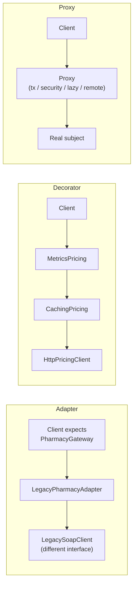
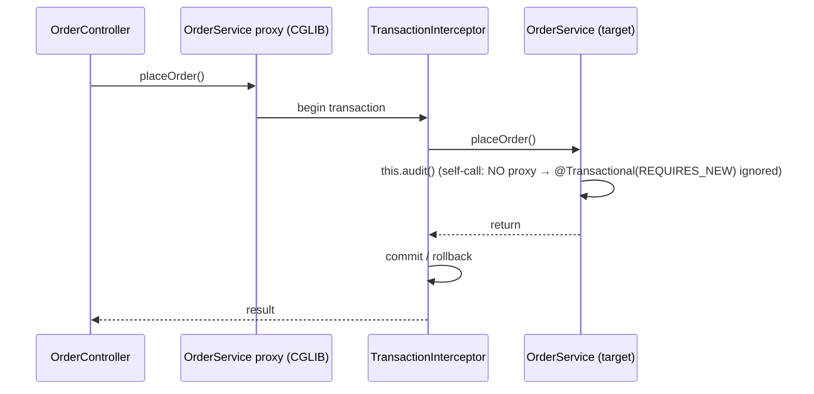
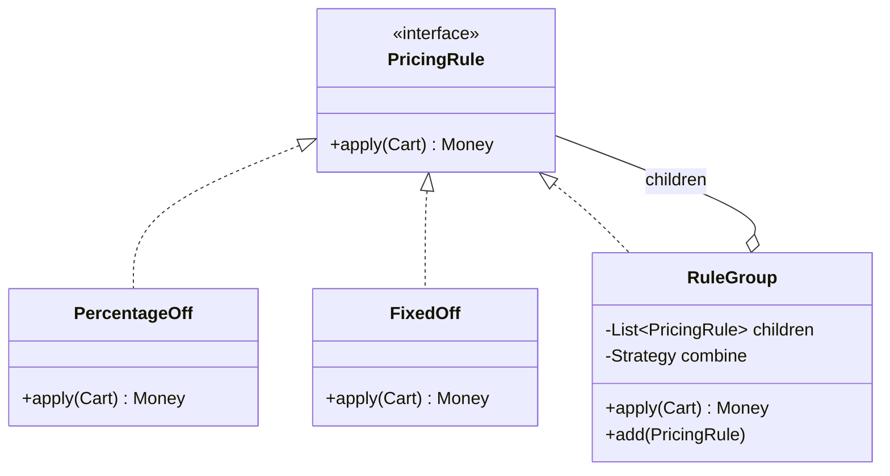

# Structural Patterns (Adapter, Decorator, Proxy, Facade, Composite)

!!! abstract "Key takeaways"
    - **Adapter:** converts one interface into the one clients expect. Wrap a **legacy or third-party** API behind **your** port (an anti-corruption layer at class level).
    - **Decorator:** wraps an object implementing the **same interface** to **add behaviour** (caching, retries, metrics, logging). Decorators stack, and the order matters. `java.io` streams are the classic example.
    - **Proxy:** same interface, but the purpose is **controlling access**: lazy loading (Hibernate), remote calls, security, transactions.
        - **Spring AOP** uses proxies (JDK dynamic or CGLIB) for `@Transactional`, `@Cacheable`, `@Async` and `@PreAuthorize`.
        - **Self-invocation bypasses the proxy**, so the annotation is silently ignored.
    - **Facade:** a simple, high-level interface over a complex subsystem (checkout over inventory + pricing + payment). It reduces coupling but must not become a god class.
    - **Composite:** treat individual objects and **trees** of objects uniformly (pricing rule groups, org charts, UI components, file systems). Also in brief:
        - **Bridge** separates an abstraction from its implementation so both can vary.
        - **Flyweight** shares immutable intrinsic state (`Integer.valueOf` cache, string interning).

## Why it matters

Structural patterns show up constantly in enterprise Java: every integration with an external system needs an **adapter**, every cross-cutting concern (retry, cache, metrics) is a **decorator** or **proxy**, and Spring itself is proxy-driven. Interviewers love "Decorator vs Proxy vs Adapter?" and "why didn't my `@Transactional` work?".

## Core concepts

### The three wrappers compared


*Notice the intent: an **adapter** changes the interface, a **decorator** keeps the interface and adds behaviour (and can stack), and a **proxy** keeps the interface and controls access to the real object (often created by a framework).*

| | Adapter | Decorator | Proxy | Facade |
|---|---|---|---|---|
| Interface | **Different** → expected | Same | Same | **New, simpler** |
| Purpose | Make incompatible things work together | Add responsibilities dynamically | Control access (lazy, remote, security, tx) | Simplify a subsystem |
| Wraps | One adaptee | One component (stackable) | One subject | Many objects |
| Example | `InputStreamReader` (bytes → chars), SDK wrappers | `BufferedInputStream`, caching/retry wrappers | Hibernate lazy proxies, Spring AOP, RMI stubs | SLF4J, service-layer "use case" classes |

### Adapter

- **Object adapter** (composition, preferred) vs **class adapter** (inheritance, not possible with multiple classes in Java).
- **Use for:** legacy SOAP and partner APIs, vendor SDKs, translating error models and units. Keep vendor types **out of your domain**.
- At system scale it's the **anti-corruption layer** (DDD): adapters translate an external model into your bounded context.

### Decorator

- Each decorator holds a reference to the next one and implements the same interface. You can compose them in any order at runtime.
- **Order matters:** `Metrics(Retry(Cache(Http)))` measures total latency including retries. `Cache(Retry(Http))` retries only on cache misses.
- Java I/O: `new BufferedReader(new InputStreamReader(new FileInputStream(f), UTF_8))`.
- Modern alternatives: Resilience4j `Decorators.ofSupplier(...)`, Spring AOP, or functional composition (`Function.andThen`).

### Proxy, and how Spring uses it


*Notice that only calls that come **through the proxy** get the advice. `this.audit()` inside the target goes straight to the method, so `@Transactional`, `@Async`, `@Cacheable` and `@PreAuthorize` on `audit()` do nothing.*

Kinds of proxy:

- **Virtual / lazy:** Hibernate `getReference()` and lazy associations. `LazyInitializationException` happens when you access one outside the session.
- **Remote:** gRPC and RMI stubs, Feign clients.
- **Protection:** security checks.
- **Smart reference:** caching, counting, logging.

Spring AOP specifics:

- JDK dynamic proxies (interface-based) or **CGLIB** (subclass-based, the default in Spring Boot).
- `final` classes and methods can't be proxied by CGLIB.
- Only `public` methods are intercepted by default.
- **Self-invocation fixes:** move the method to another bean (best), inject a self-reference through `ObjectProvider`, use `TransactionTemplate` programmatically, or use AspectJ weaving.

### Facade

- A single entry point for a use case: `CheckoutFacade.placeOrder()` coordinates inventory, pricing, payment and notification. Controllers stay thin and clients don't learn subsystem details.
- **Not** a god class: keep facades per use case or bounded context, and leave domain logic inside the subsystems.
- At system scale, a **BFF** or API gateway aggregation is a remote facade.

### Composite


*Notice that a group **is** a rule, so clients call `apply()` on a single rule or a whole tree the same way. That's the core of Composite: uniform treatment of leaves and branches.*

- **Use for:** hierarchies such as rules, menus, org units, UI components (React's component tree), file systems, GraphQL selection sets.
- **Design question:** where do child-management methods (`add`/`remove`) live? On the composite only (type-safe) or on the interface (uniform but leaves must reject them). Prefer composite-only.

### Bridge and Flyweight (brief)

- **Bridge:** split an abstraction hierarchy from an implementation hierarchy so they vary independently. For example `Notification` (Alert, Reminder) × `Channel` (SMS, Email): the notification *has a* channel instead of having classes like `SmsAlert` and `EmailReminder`. JDBC (API vs drivers) is a bridge.
- **Flyweight:** share immutable intrinsic state to save memory (`Integer.valueOf(-128..127)` cache, `String.intern`, glyphs in text editors). Extrinsic state is passed in.

## In practice: code & configuration

=== "❌ Common mistake"
    ```java
    // Vendor types leak into the domain; caching/retry/metrics tangled into one client.
    @Service
    public class PriceService {
        private final LegacyPbmSoapPort soap;                     // vendor-generated SOAP type everywhere
        private final Map<String, BigDecimal> cache = new HashMap<>();   // not thread-safe, no TTL
        public BigDecimal price(String ndc) {
            if (cache.containsKey(ndc)) return cache.get(ndc);
            for (int i = 0; i < 3; i++) {                         // retry logic inline
                long t = System.nanoTime();
                try {
                    PbmPriceResponse r = soap.getPrice(new PbmPriceRequest(ndc, "V2"));
                    metrics.record(System.nanoTime() - t);        // metrics inline
                    cache.put(ndc, r.getAmt().divide(BigDecimal.valueOf(100)));
                    return cache.get(ndc);
                } catch (SOAPFaultException e) { /* swallow */ }
            }
            return null;
        }
    }
    ```

=== "✅ Correct approach"
    ```java
    // Port owned by the domain.
    public interface PricingPort { Money priceOf(Ndc ndc); }

    // ADAPTER: translates the vendor model and errors into the domain model.
    final class PbmSoapPricingAdapter implements PricingPort {
        private final LegacyPbmSoapPort soap;
        PbmSoapPricingAdapter(LegacyPbmSoapPort soap) { this.soap = soap; }
        @Override public Money priceOf(Ndc ndc) {
            try {
                PbmPriceResponse r = soap.getPrice(new PbmPriceRequest(ndc.value(), "V2"));
                return Money.ofMinor(r.getAmt(), "USD");               // cents → Money
            } catch (SOAPFaultException e) {
                throw new PricingUnavailableException(ndc, e);         // domain exception
            }
        }
    }

    // DECORATORS: same interface, one concern each, composed explicitly.
    final class CachingPricing implements PricingPort {
        private final PricingPort next;
        private final Cache<Ndc, Money> cache = Caffeine.newBuilder()
                .maximumSize(10_000).expireAfterWrite(Duration.ofMinutes(10)).build();
        CachingPricing(PricingPort next) { this.next = next; }
        @Override public Money priceOf(Ndc ndc) { return cache.get(ndc, next::priceOf); }
    }

    final class TimedPricing implements PricingPort {
        private final PricingPort next; private final Timer timer;
        TimedPricing(PricingPort next, MeterRegistry reg) {
            this.next = next; this.timer = reg.timer("pricing.latency");
        }
        @Override public Money priceOf(Ndc ndc) { return timer.record(() -> next.priceOf(ndc)); }
    }

    @Configuration
    class PricingConfig {
        @Bean PricingPort pricingPort(LegacyPbmSoapPort soap, MeterRegistry reg) {
            // Timed(Caching(Adapter)): measures what callers experience, including cache hits.
            return new TimedPricing(new CachingPricing(new PbmSoapPricingAdapter(soap)), reg);
        }
    }
    ```

The Spring proxy self-invocation trap and its fix:

```java
@Service
class OrderService {
    private final AuditService audit;                       // separate bean → call goes through ITS proxy
    OrderService(AuditService audit) { this.audit = audit; }

    @Transactional
    public void placeOrder(Order o) {
        // this.writeAudit(o)  ← would bypass the proxy: REQUIRES_NEW silently ignored
        audit.write(o);                                     // proxied → REQUIRES_NEW applies
    }
}
@Service
class AuditService {
    @Transactional(propagation = Propagation.REQUIRES_NEW)  // committed even if the order rolls back
    public void write(Order o) { /* ... */ }
}
```

## Real-world usage

- **Adapters** are everywhere in integration-heavy domains: pharmacy and PBM systems (NCPDP, SOAP), EHRs (HL7 v2 → FHIR), payment providers. Each adapter isolates vendor change.
- **Decorators:** the Java I/O streams, `Collections.unmodifiableList`/`synchronizedList`, Resilience4j decorators, servlet filters (similar in spirit to a chain).
- **Proxies:** Spring AOP (`@Transactional`, `@Cacheable`, `@Async`, `@Retryable`, method security), Hibernate lazy loading, Feign and gRPC clients, Mockito mocks (runtime proxies).
- **Facades:** SLF4J over logging back-ends, service-layer use-case classes, BFFs.
- **Composite:** React and DOM trees, AWS IAM policy evaluation over statements, GraphQL ASTs, rule engines.
- **Common bugs:**
    - `@Transactional` on private methods or self-calls.
    - `LazyInitializationException` from lazy proxies used after the session closes.
    - Decorator order causing caching of failures, or retries inside a cache stampede.

## Trade-offs & production gotchas

| Pattern | Benefit | Cost / risk |
|---|---|---|
| Adapter | Isolates vendor change, clean domain | Extra mapping code |
| Decorator | Single-concern wrappers, runtime composition | Many small classes, order-sensitive, harder stack traces |
| Proxy (framework) | Declarative cross-cutting concerns | Invisible behaviour, self-invocation and `final` traps |
| Facade | Simpler clients, lower coupling | Can grow into a god class |
| Composite | Uniform tree handling | Overly general interfaces, deep-recursion cost |

!!! warning "Gotchas"
    - **CGLIB can't proxy `final` classes or methods.** Kotlin classes are final by default (use the `kotlin-spring` all-open plugin).
    - **Proxies change identity:** `getClass()` returns the proxy class, and `equals` or `instanceof` checks on concrete classes can surprise you.
    - **Caching decorators must not cache exceptions** or nulls unintentionally, and must be thread-safe.

## How this connects to my experience

- **Where I used it:**
    - OptumRx GraphQL Consumer Service: "integration layer between **5 upstream systems**" (an adapter per upstream, a facade/aggregation for consumers), Redis caching (a decorator), Spring `@Transactional` and security (proxies).
    - CCKM: HSM integrations (Thales Luna, SafeNet), the classic adapter case.
- **Talking points:**
    - "Each upstream had its own client adapter translating its model and errors into our domain types, so a vendor change touched one class." *[confirm]*
    - "Caching, timeouts and metrics were layered as decorators or annotations around those clients, not mixed into business code." *[confirm: decorator classes vs Resilience4j/Spring annotations]*
    - "HSM vendors (Luna vs SafeNet) sat behind a common key-operations interface: adapters per vendor." *[confirm: CCKM HSM abstraction]*
    - "I've debugged the `@Transactional` self-invocation trap in reviews. Moving the method to another bean is the clean fix." *[confirm]*
- **Likely follow-up chain:** "How did you integrate the 5 upstreams?" → "Where did caching live?" → "Decorator vs proxy?" → "Why didn't a `@Transactional` work?" Adapters per upstream → caching decorator/annotation → intent difference → proxy self-invocation.

## Interview questions

### Fundamentals

??? question "Q1. Adapter vs Decorator vs Proxy?"
    **Answer:** An adapter **changes** an interface to the expected one. A decorator keeps the interface and **adds behaviour**, and can be stacked. A proxy keeps the interface and **controls access** (lazy, remote, security, transactions). The structure looks similar, but the intent differs.

    **Interviewer listens for:** intent-based distinction.

    **Common wrong answer:** "they're all wrappers, so the same".

??? question "Q2. Give a JDK example of Decorator."
    **Answer:** `java.io` streams. `new BufferedInputStream(new FileInputStream(f))` adds buffering. `DataInputStream` adds typed reads. `Collections.unmodifiableList(list)` adds read-only behaviour.

    **Interviewer listens for:** recognising the same interface with stacking.

    **Common wrong answer:** "`ArrayList` decorates arrays".

??? question "Q3. What is a Facade and its risk?"
    **Answer:** A simplified, high-level interface over a subsystem (for example `CheckoutFacade` over inventory, pricing, payment). Clients are decoupled from the internals. The risk is a god class that accumulates domain logic. Keep facades thin and use-case specific.

    **Interviewer listens for:** thinness.

    **Common wrong answer:** "the same as an adapter".

??? question "Q4. When would you use Composite?"
    **Answer:** When you have part-whole hierarchies and want clients to treat leaves and groups uniformly: rule groups, menus, org units, UI component trees, file systems. Groups implement the same interface and delegate to their children.

    **Interviewer listens for:** "uniform treatment".

    **Common wrong answer:** "any list of objects".

??? question "Q5. What is Flyweight, and where does Java already use it?"
    **Answer:** Flyweight shares immutable **intrinsic** state between many objects to save memory. Per-use **extrinsic** state (position, context) is passed in from outside. Java examples: `Integer.valueOf` caches -128..127, the `String` pool, `Boolean.TRUE`/`FALSE`, and enum constants. In your own code it helps when you create millions of similar objects, such as glyphs in an editor or drug reference data shared by many claim lines. The shared object must be immutable, or one user's change leaks to everyone.

    **Interviewer listens for:** intrinsic vs extrinsic state, immutability, JDK caches, a memory-driven use case.

    **Common wrong answer:** "Flyweight is a cache." A cache saves recomputation; Flyweight saves memory by sharing immutable instances.

### Intermediate

??? question "Q6. How does Spring implement `@Transactional`?"
    **Answer:** It creates a proxy (CGLIB subclass by default in Boot, or a JDK dynamic proxy for interfaces) around the bean. The proxy's interceptor starts or joins a transaction, calls the target, then commits or rolls back (on runtime exceptions by default). Only external calls through the proxy are intercepted.

    **Interviewer listens for:** the proxy mechanism.

    **Common wrong answer:** "the compiler adds transaction code".

??? question "Q7. Why does `@Transactional` on a method called from the same class not work?"
    **Answer:** The self-invocation goes through `this`, not the proxy, so the advice is skipped. Fixes:
    - Move the method to another bean (cleanest).
    - Inject a self-reference (`ObjectProvider<Self>`).
    - Use `TransactionTemplate`.
    - Use AspectJ compile/load-time weaving.

    It also doesn't apply to non-public methods with proxy-based AOP.

    **Interviewer listens for:** a precise cause plus fixes.

    **Common wrong answer:** "because the method is in the same package".

??? question "Q8. Does decorator order matter?"
    **Answer:** Yes:
    - `Metrics(Cache(Http))` records the latency callers see, including cache hits.
    - `Cache(Metrics(Http))` only measures misses.
    - `Retry(Cache(...))` vs `Cache(Retry(...))` changes whether you retry on cache misses only.
    - Circuit breaker inside or outside retry changes failure counting.

    Make the order explicit in configuration.

    **Interviewer listens for:** concrete consequences.

    **Common wrong answer:** "no, they're independent".

### Senior

??? question "Q9. How do you isolate a domain from a messy vendor API?"
    **Answer:**
    - Define a port in your domain language.
    - Implement an **adapter** that maps request and response models, units, codes and errors (anti-corruption layer).
    - Keep vendor-generated classes inside the adapter package (enforce it with ArchUnit).
    - Add contract tests against the vendor sandbox.
    - Wrap with decorators for resilience and caching.
    - Version the adapter when the vendor changes.

    **Interviewer listens for:** an ACL plus enforcement.

    **Common wrong answer:** "use the vendor SDK directly everywhere".

??? question "Q10. Bridge vs Strategy?"
    **Answer:** Both use composition. **Strategy** swaps an algorithm used by one context. **Bridge** structurally separates two **hierarchies** that vary independently (abstraction × implementation), avoiding a class explosion like `SmsAlert`, `EmailAlert`, `SmsReminder`... Bridge is a structural, long-lived design. Strategy is often per-call behaviour.

    **Interviewer listens for:** the two-hierarchies idea.

    **Common wrong answer:** "they're identical".

### Scenario-based

??? question "Q11. Add caching, retries and metrics to an upstream client without touching business code."
    **Answer:** Put the client behind a port interface. Compose decorators (or Resilience4j and Micrometer annotations) in configuration: Timed → CircuitBreaker → Retry → Cache → Adapter, in a deliberate order. Don't cache errors. Test each decorator in isolation. Feature-flag the cache.

    **Interviewer listens for:** composition in configuration, and order awareness.

    **Common wrong answer:** "add code in every service method".

??? question "Q12. A `LazyInitializationException` appears after a refactor. Explain it and fix it."
    **Answer:** A Hibernate lazy proxy (virtual proxy) was accessed after the persistence context closed, often in a controller or serialiser. Fixes:
    - Fetch what you need in the transactional service (`JOIN FETCH`, entity graphs).
    - Map to DTOs inside the transaction.
    - Avoid open-session-in-view as a crutch.
    - Check that the refactor didn't move work outside `@Transactional` (for example through self-invocation).

    **Interviewer listens for:** naming it as a proxy, and fetch-planning fixes.

    **Common wrong answer:** "set everything to EAGER".

## Cheat sheet

| Pattern | Intent | Java/Spring example |
|---|---|---|
| Adapter | Convert an interface | `InputStreamReader`, vendor SDK wrappers, ACL |
| Decorator | Add behaviour, same interface, stackable | `BufferedInputStream`, caching/timing wrappers |
| Proxy | Control access | Spring AOP (`@Transactional`), Hibernate lazy, Feign |
| Facade | Simplify a subsystem | Use-case service, SLF4J, BFF |
| Composite | Tree, uniform treatment | Rule groups, UI trees |
| Bridge | Two independent hierarchies | JDBC API vs drivers, Notification × Channel |
| Flyweight | Share immutable state | `Integer.valueOf` cache, `String.intern` |
| Spring traps | Self-invocation, `final`, non-public methods | Move to another bean / `TransactionTemplate` |

## Sources
1. Gamma et al., *Design Patterns* (GoF): structural patterns.
2. [Spring Framework: Understanding AOP proxies](https://docs.spring.io/spring-framework/reference/core/aop/proxying.html): JDK vs CGLIB, self-invocation.
3. [Spring Framework: Declarative transaction management](https://docs.spring.io/spring-framework/reference/data-access/transaction/declarative/annotations.html): proxy mode limitations.
4. Eric Evans, *Domain-Driven Design*: anti-corruption layer.
5. [Hibernate ORM user guide: fetching and proxies](https://docs.jboss.org/hibernate/orm/6.6/userguide/html_single/Hibernate_User_Guide.html#fetching).
6. [Resilience4j Decorators](https://resilience4j.readme.io/docs/getting-started-3): composing resilience decorators.
7. [Refactoring.Guru: Structural patterns](https://refactoring.guru/design-patterns/structural-patterns).
