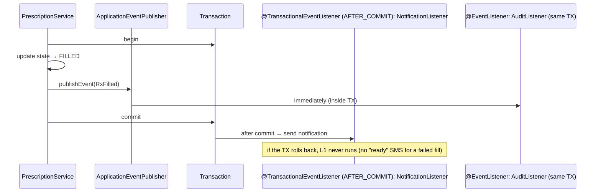
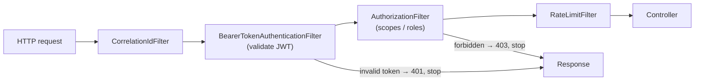
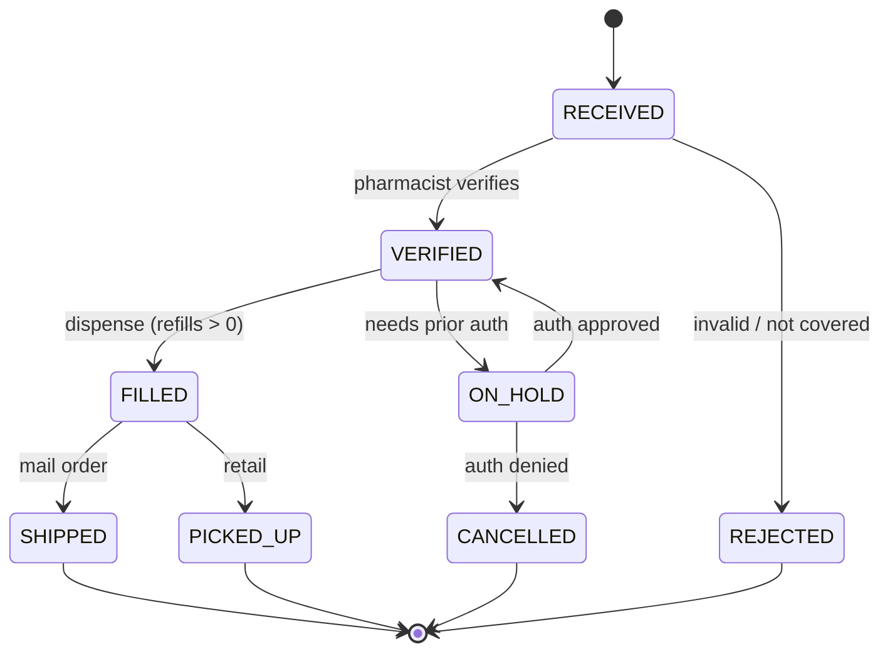

# Behavioural Patterns (Strategy, Observer, Template Method, Chain of Responsibility, Command, State)

!!! abstract "TL;DR"
    - **Strategy:** encapsulate interchangeable algorithms behind an interface and choose one at runtime (pricing, shipping, retry policies). In Java 8+ a strategy is often just a **lambda** (`Comparator`, `Function`).
    - **Observer:** subjects notify subscribers of events without knowing them.
        - In-process, use **Spring `ApplicationEventPublisher`** + `@EventListener` / **`@TransactionalEventListener(AFTER_COMMIT)`**.
        - Across services, use a **message broker** (Kafka) as a distributed observer.
    - **Template Method:** a base class fixes the algorithm skeleton and subclasses fill in steps. Modern Java prefers **callbacks/composition** (`JdbcTemplate` + `RowMapper`, `TransactionTemplate`) over inheritance.
    - **Chain of Responsibility:** pass a request along handlers, each of which handles it, passes it on, or stops it. Servlet filters, the **Spring Security `SecurityFilterChain`**, validation pipelines, interceptors.
    - **Command:** turn a request into an object (an action + its parameters). This enables **queuing, retries, logging/auditing, undo/redo and scheduling** (`Runnable`, job messages).
    - **State:** an object's behaviour depends on its state, and transitions are explicit. Model lifecycles (prescription, order, payment) as **state machines** with allowed transitions, using `enum` + transition table, State classes, or Spring Statemachine. Persist the state and guard transitions atomically.

## Why it matters

Behavioural patterns are about **responsibilities and communication**, which is where most business code gets complicated: growing `if/else` for algorithms, tangled side effects after a save, and invalid state changes (a prescription "shipped" before it was "verified"). Interviewers test whether you can recognise the pattern behind Spring features you use daily, and model a lifecycle cleanly.

## Core concepts

### Strategy

- **Context** holds a `Strategy` reference and delegates the variable part.
- Select by configuration, request attributes or a registry (`Map<Type, Strategy>` built by Spring).
- **Strategy vs State:** strategies are usually chosen **by the client** and are independent of each other. States choose **the next state themselves** as the object's lifecycle changes.
- Java examples: `Comparator`, `RejectedExecutionHandler`, Spring `PasswordEncoder`, `Resource` loaders.

### Observer and Spring events


*Notice the timing difference: a plain `@EventListener` runs **synchronously inside** the publisher's transaction, while a `@TransactionalEventListener` waits for the commit. Side effects like emails or Kafka publishes belong **after commit**, and reliable cross-service delivery belongs in an **outbox**.*

- **Pros:** loose coupling, new reactions without touching the subject.
- **Cons:** hidden control flow, ordering (`@Order`), error handling, and memory leaks from forgotten subscriptions (UI or in-memory observers).
- **Async:** `@Async` listeners or a broker. Across services, use Kafka/SNS: a durable, decoupled observer.

### Template Method vs callbacks

- **Classic:** an `abstract class ReportGenerator { final generate() { fetch(); transform(); render(); } protected abstract ...}`. It's inheritance-based, so subclasses are coupled to the skeleton.
- **Modern Java/Spring** passes the variable steps as **functions** (composition): `jdbcTemplate.query(sql, rowMapper)`, `transactionTemplate.execute(status -> ...)`, `restClient.get().retrieve()`. You get the same invariant skeleton (resource handling, exceptions) with less coupling.
- Use classic Template Method when there are several hooks and a designed-for-extension base (Spring's `AbstractRoutingDataSource`, `OncePerRequestFilter`).

### Chain of Responsibility


*Notice that each handler can **short-circuit** the chain. That's what makes it Chain of Responsibility rather than a plain pipeline. The order is part of the design (authentication before authorisation).*

- **Variants:** "first handler that can handle it wins" (classic GoF) vs "every handler processes in turn" (filters/middleware/pipelines).
- **Examples:** servlet `FilterChain`, Spring Security `SecurityFilterChain`, Spring MVC `HandlerInterceptor`, Netty pipelines, Express/Koa middleware, validation rule chains, approval workflows (amount thresholds).

### Command

- A command object holds **what to do + its data**: `RefillCommand(rxId, pharmacyId, requestedBy)`.
- **Enables:**
    - **queuing** (send to SQS/Kafka)
    - **retries** (re-execute)
    - **auditing** (log commands)
    - **undo/redo** (store the inverse)
    - **macro commands**
    - **scheduling**
- **Command vs event:** a command is an **intent** directed at one handler ("RefillPrescription"), and can be rejected. An event is a **fact** that already happened ("PrescriptionRefilled") for any number of listeners.
- In CQRS, commands go to the write model, and queries go to read models.

### State


*Notice that the diagram **is** the specification: any transition not drawn is illegal. Encode it once (transition table or State classes) instead of scattering `if (status == ...)` checks across services.*

**Implementation options:**

1. An **`enum` with allowed transitions** (simple, persisted as a string), plus guards in the service.
2. **State objects** (GoF): each state class implements the behaviour allowed in that state. Good when behaviour differs a lot by state.
3. **Spring Statemachine** or a workflow engine (Temporal, Step Functions) for complex, long-running workflows with timers.

**Persistence:** make the transition atomic with the state check (`UPDATE … SET state='FILLED', version=version+1 WHERE id=? AND state='VERIFIED' AND version=?`), and emit an event per transition (audit + outbox).

## In practice: code & configuration

=== "❌ Common mistake"
    ```java
    // Status checks scattered everywhere, side effects before commit, algorithm switch inline.
    @Transactional
    public void fill(String rxId) {
        Prescription rx = repo.findById(rxId).orElseThrow();
        if (rx.getStatus().equals("VERIFIED") || rx.getStatus().equals("ON_HOLD")) {  // ON_HOLD is wrong!
            rx.setStatus("FILLED");
            smsClient.send(rx.getPhone(), "Your Rx is ready");   // sent even if the TX later rolls back
            switch (rx.getPlanType()) {                          // pricing algorithm inline
                case "COMMERCIAL" -> rx.setCopay(...);
                case "MEDICARE"   -> rx.setCopay(...);
                // new plan type = edit here and in 4 other places
            }
        }
    }
    ```

=== "✅ Correct approach"
    ```java
    // STATE: transitions defined once.
    public enum RxState {
        RECEIVED, VERIFIED, ON_HOLD, FILLED, SHIPPED, PICKED_UP, REJECTED, CANCELLED;

        private static final Map<RxState, Set<RxState>> ALLOWED = Map.of(
            RECEIVED,  EnumSet.of(VERIFIED, REJECTED),
            VERIFIED,  EnumSet.of(FILLED, ON_HOLD),
            ON_HOLD,   EnumSet.of(VERIFIED, CANCELLED),
            FILLED,    EnumSet.of(SHIPPED, PICKED_UP));

        public boolean canMoveTo(RxState next) {
            return ALLOWED.getOrDefault(this, Set.of()).contains(next);
        }
    }

    // STRATEGY: copay calculation per plan type, registered by Spring.
    public interface CopayStrategy { PlanType planType(); Money copay(Prescription rx); }

    @Service
    class FillService {
        private final RxRepository repo;
        private final Map<PlanType, CopayStrategy> copay;
        private final ApplicationEventPublisher events;

        FillService(RxRepository repo, List<CopayStrategy> strategies, ApplicationEventPublisher events) {
            this.repo = repo; this.events = events;
            this.copay = strategies.stream().collect(Collectors.toMap(CopayStrategy::planType, s -> s));
        }

        @Transactional
        public void fill(FillCommand cmd) {                                 // COMMAND: intent as an object
            Prescription rx = repo.findById(cmd.rxId()).orElseThrow();
            if (!rx.state().canMoveTo(RxState.FILLED))
                throw new IllegalTransitionException(rx.state(), RxState.FILLED);
            Money due = copay.get(rx.planType()).copay(rx);
            int updated = repo.transition(rx.id(), RxState.VERIFIED, RxState.FILLED, rx.version(), due);
            if (updated == 0) throw new ConcurrentModificationException("already changed");   // atomic guard
            events.publishEvent(new RxFilled(rx.id(), cmd.pharmacistId()));  // OBSERVER
        }
    }

    @Component
    class RxNotifications {
        @TransactionalEventListener(phase = TransactionPhase.AFTER_COMMIT)   // only if the fill committed
        void on(RxFilled e) { notifier.rxReady(e.rxId()); }
    }
    ```

Chain of Responsibility in Spring Security (filter chain configuration):

```java
@Bean
SecurityFilterChain api(HttpSecurity http) throws Exception {
    return http
        .securityMatcher("/api/**")
        .addFilterBefore(new CorrelationIdFilter(), BearerTokenAuthenticationFilter.class)
        .oauth2ResourceServer(o -> o.jwt(Customizer.withDefaults()))   // auth handler in the chain
        .authorizeHttpRequests(a -> a
            .requestMatchers(HttpMethod.POST, "/api/rx/*/fill").hasAuthority("SCOPE_rx.fill")
            .anyRequest().authenticated())
        .build();
}
```

## Real-world usage

- **Strategy:** payment-method handlers, pricing and tax engines, Spring `PasswordEncoder` (`DelegatingPasswordEncoder` picks one by prefix), Resilience4j policies.
- **Observer:** Spring application events, JavaBeans `PropertyChangeListener`, React state subscriptions, and Kafka, SNS and EventBridge across services.
- **Template / callback:** `JdbcTemplate`, `RestTemplate`/`RestClient`, `TransactionTemplate`, `KafkaTemplate`, `AbstractRoutingDataSource`.
- **Chain:** servlet filters, Spring Security (~15+ filters), API gateway filter chains (Spring Cloud Gateway, Envoy).
- **Command:** job queues, CQRS command handlers, `Runnable`/`Callable` submitted to executors, audit logs of user actions.
- **State:** order, payment and prescription lifecycles. Workflow engines (Temporal, Camunda, Step Functions) are distributed state machines with timers and retries.

## Trade-offs & production gotchas

| Pattern | Benefit | Cost |
|---|---|---|
| Strategy | Add algorithms without editing the context | More classes, selection logic |
| Observer (in-process) | Decoupled reactions | Hidden flow, error propagation, ordering |
| Observer (broker) | Durable, cross-service | Eventual consistency, idempotency needed |
| Template Method | Enforces the skeleton | Inheritance coupling (prefer callbacks) |
| Chain | Composable, ordered processing | Order bugs, hard to see the whole flow |
| Command | Queue, audit, undo, retry | Boilerplate for simple calls |
| State | Illegal transitions impossible | Upfront modelling. State explosion if overused |

!!! warning "Gotchas"
    - **`@EventListener` exceptions propagate to the publisher** (synchronous) and can roll back its transaction. `@TransactionalEventListener(AFTER_COMMIT)` exceptions don't roll back the (already committed) transaction, so handle them and retry.
    - **AFTER_COMMIT listeners run outside the original transaction.** If they need to write to the DB, use `REQUIRES_NEW`.
    - **In-process events aren't durable:** a crash after commit but before the listener runs loses the side effect. Use an **outbox** for anything that must happen.
    - **State checks must be atomic** with the update (conditional update / optimistic lock), or two concurrent requests can both pass the check.

## How this connects to my experience

- **Where I used it:**
    - Spring Boot microservices and Spring Security (filter chains, OAuth2/PingFederate) at OptumRx.
    - JWT and Spring Security authorisation at Johnson Controls ("owned JWT-based authentication and SSO implementation end-to-end", "Spring Security authorization controls").
    - Kafka event-driven workflows (Observer across services).
    - CCKM key rotation workflows (state machines for key lifecycle).
- **Talking points:**
    - "I configured Spring Security's filter chain for JWT validation and authorisation, which is Chain of Responsibility. Order matters: authenticate, then authorise." *[confirm: custom filters you wrote]*
    - "Key lifecycle in CCKM (pre-active → active → deactivated → destroyed, or similar) is a state machine. Rotation workflows had to enforce valid transitions." *[confirm: actual key states and how they were modelled]*
    - "Side effects like notifications or Kafka publishes go after commit, or through an outbox, never inside the transaction."
- **Likely follow-up chain:** "How did you model workflow status?" → "How do you prevent invalid or concurrent transitions?" → "How are other services notified?" → "What if the notification fails?" State enum/transition table → conditional update + version → events (outbox → Kafka) → idempotent consumers, retries, DLQ.

## Interview questions

### Fundamentals

??? question "Q1. Strategy vs State?"
    **Answer:** Both delegate to an interchangeable object. **Strategy:** the client (or config) picks an algorithm, and strategies don't know about each other. **State:** the object's behaviour changes with its internal state, and **states (or the context) trigger transitions to other states**. Strategy is about *how*, State is about *what's allowed now*.

    **Interviewer listens for:** who chooses, and transitions.

    **Common wrong answer:** "same pattern".

??? question "Q2. Observer: pros and cons?"
    **Answer:** Pros: loose coupling, and adding reactions without changing the subject. Cons: hidden control flow, ordering and error-handling issues, possible memory leaks (dangling subscriptions), and synchronous observers slowing the subject. Across services, use a broker for durability.

    **Interviewer listens for:** both sides.

    **Common wrong answer:** "only benefits".

??? question "Q3. Give Chain of Responsibility examples in Spring."
    **Answer:** Servlet filters, the Spring Security `SecurityFilterChain` (authentication, CSRF, authorisation filters), `HandlerInterceptor`s, and Spring Cloud Gateway filters. Each handler can process, pass on, or short-circuit (401/403).

    **Interviewer listens for:** short-circuiting and order.

    **Common wrong answer:** "the `@Service` layer".

??? question "Q4. Command vs event?"
    **Answer:** A command is a request or intent to one handler ("RefillPrescription"). It can fail or be rejected, and is named in the imperative. An event is a fact that already happened ("PrescriptionRefilled"), named in the past tense, broadcast to any number of listeners, and can't be rejected.

    **Interviewer listens for:** intent vs fact.

    **Common wrong answer:** "synonyms".

### Intermediate

??? question "Q5. `@EventListener` vs `@TransactionalEventListener`?"
    **Answer:** `@EventListener` runs synchronously when published, inside the publisher's transaction, and its exceptions affect the publisher. `@TransactionalEventListener` runs at a transaction phase (default AFTER_COMMIT), so side effects happen only if the data committed. It's still not durable: use an outbox for guaranteed delivery.

    **Interviewer listens for:** timing plus durability.

    **Common wrong answer:** "the second one is async".

??? question "Q6. Template Method vs callbacks?"
    **Answer:** Template Method uses inheritance: the base class defines the skeleton and subclasses override steps. Callbacks pass the varying steps as functions or objects to a template object (`JdbcTemplate.query(sql, rowMapper)`). Callbacks avoid inheritance coupling and compose better. Modern Spring prefers them.

    **Interviewer listens for:** composition preference.

    **Common wrong answer:** "`JdbcTemplate` uses Template Method by subclassing".

??? question "Q7. How would you implement undo/redo?"
    **Answer:** The Command pattern, with `execute()` and `undo()` (or storing the previous state as a memento). Keep two stacks: executing pushes onto undo and clears redo, undo pops into redo. For distributed systems, "undo" becomes a **compensating command** (sagas).

    **Interviewer listens for:** commands + stacks, and compensation in distributed systems.

    **Common wrong answer:** "save the whole database".

### Senior

??? question "Q8. Model an order lifecycle so invalid transitions are impossible, even under concurrency."
    **Answer:**
    - An explicit state machine: an enum + transition table (or State classes / Spring Statemachine).
    - A domain method `transitionTo(next)` validates against the table.
    - Persist with a conditional update (`WHERE state = ? AND version = ?`), retrying or failing on conflict.
    - Emit one event per transition (outbox).
    - An audit trail of who, when and why.
    - Timers for timeouts (workflow engine or scheduler).

    **Interviewer listens for:** atomic guards, plus events and audit.

    **Common wrong answer:** "check the status in the controller".

??? question "Q9. When is Observer the wrong choice?"
    **Answer:**
    - When the reaction is part of the **same business transaction** and must succeed or fail together: call it directly, and make the dependency explicit.
    - When ordering and error handling are critical.
    - When the side effect must be durable: use an outbox + broker, not in-memory events.
    - When there's exactly one listener forever: a direct call is clearer.

    **Interviewer listens for:** explicit vs implicit coupling.

    **Common wrong answer:** "never wrong".

### Scenario-based

??? question "Q10. Add a new insurance plan type every quarter without touching existing code."
    **Answer:** A `CopayStrategy` interface with an implementation per plan type, discovered by Spring into a `Map<PlanType, CopayStrategy>`. Add a class and a configuration/feature flag. Contract tests per strategy, plus a fallback for unknown types. If rules change often or are data-driven, consider a rules engine or table-driven strategy instead of code.

    **Interviewer listens for:** OCP through Strategy, plus a data-driven alternative.

    **Common wrong answer:** "add another case to the switch".

??? question "Q11. Patients got "ready for pickup" SMS for fills that later failed. Why, and what's the fix?"
    **Answer:** The SMS was sent inside the transaction (or by a synchronous `@EventListener`) before the commit, and the transaction then rolled back. Fix: publish events and handle them `AFTER_COMMIT`. Better, write an outbox row in the transaction and have a relay publish it to the notification service, with idempotent sends keyed by `(rxId, state)`.

    **Interviewer listens for:** commit timing, outbox and idempotency.

    **Common wrong answer:** "add a delay".

## Cheat sheet

| Pattern | Remember | Spring/Java |
|---|---|---|
| Strategy | Swappable algorithm, client chooses | `Map<Type, Strategy>` from DI, lambdas, `Comparator` |
| Observer | Publish/subscribe, loose coupling | `ApplicationEventPublisher`, `@TransactionalEventListener`, Kafka |
| Template Method | Fixed skeleton + hooks | Prefer callbacks: `JdbcTemplate`, `TransactionTemplate` |
| Chain of Resp. | Handlers pass or stop, order matters | Servlet filters, `SecurityFilterChain`, interceptors |
| Command | Request as an object: queue, retry, audit, undo | `Runnable`, job messages, CQRS commands |
| State | Behaviour by state, explicit transitions | enum + transition table, conditional update, Spring Statemachine |
| Command vs event | Intent (one handler) vs fact (many listeners) | Imperative vs past-tense naming |

## Sources
1. Gamma et al., *Design Patterns* (GoF): behavioural patterns.
2. [Spring Framework: Application events and `@TransactionalEventListener`](https://docs.spring.io/spring-framework/reference/data-access/transaction/event.html).
3. [Spring Security architecture: SecurityFilterChain](https://docs.spring.io/spring-security/reference/servlet/architecture.html).
4. [Spring Framework: JdbcTemplate callbacks](https://docs.spring.io/spring-framework/reference/data-access/jdbc/core.html).
5. [Spring Statemachine reference](https://docs.spring.io/spring-statemachine/docs/current/reference/).
6. [Martin Fowler: CQRS](https://martinfowler.com/bliki/CQRS.html) and [Event-driven: what do you mean?](https://martinfowler.com/articles/201701-event-driven.html) (commands vs events).
7. [Refactoring.Guru: Behavioral patterns](https://refactoring.guru/design-patterns/behavioral-patterns).
