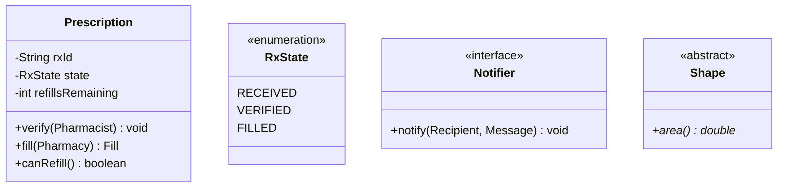
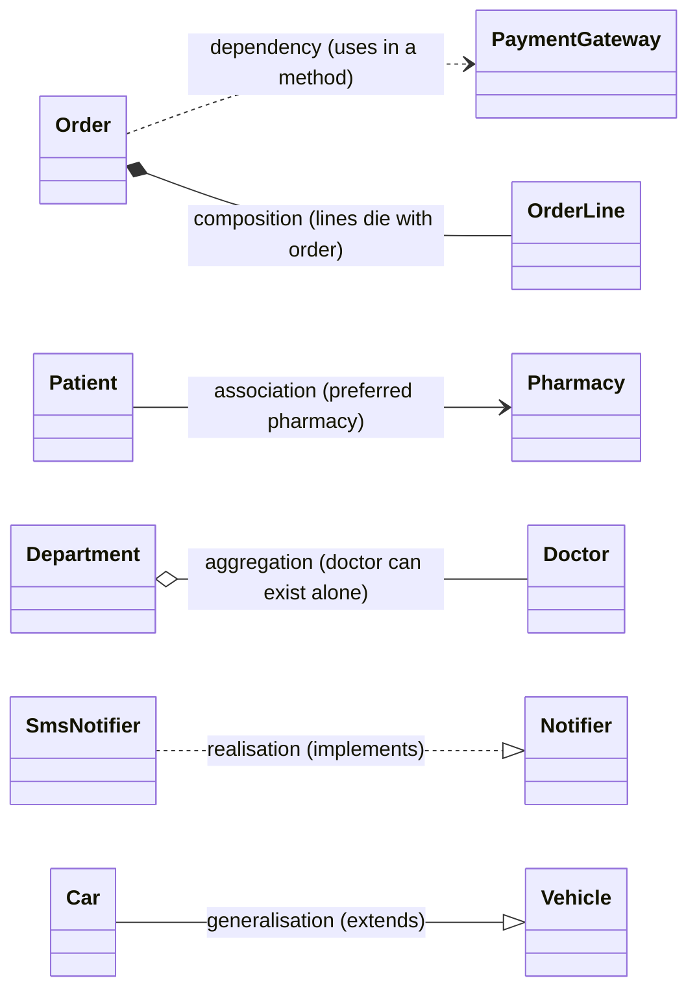
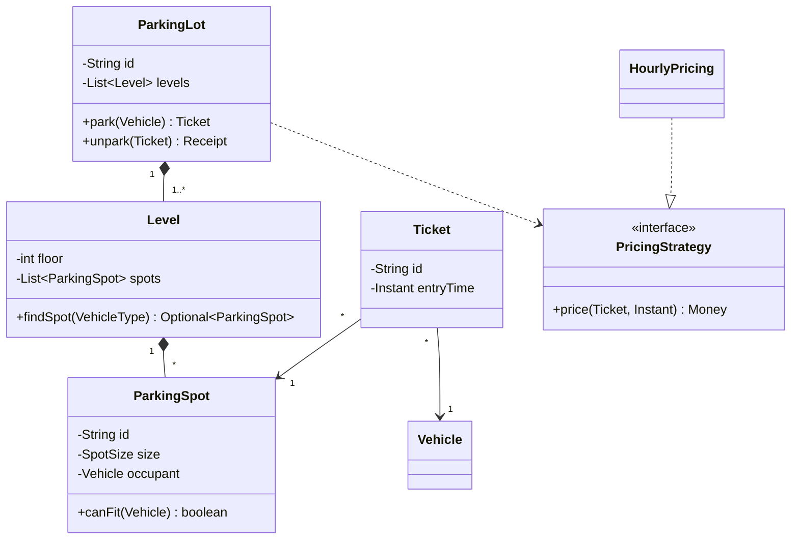

# UML & Class Diagram Basics for Interviews

!!! abstract "TL;DR"
    - In interviews UML is a **communication tool**, not a spec. Draw **classes, key attributes and methods, relationships and multiplicities**. Skip getters and setters.
    - **Class box:** name / attributes / operations. **Visibility:** `+` public, `-` private, `#` protected, `~` package. `<<interface>>`, `<<abstract>>` and `<<enum>>` stereotypes. Static members are underlined (or noted).
    - **Six relationships**, weakest to strongest:
        - **dependency** (dashed arrow, "uses temporarily")
        - **association** (solid line, "has a reference")
        - **aggregation** (hollow diamond, "has, parts can live alone")
        - **composition** (filled diamond, "owns, parts die with the whole")
        - **realisation** (dashed line + hollow triangle, "implements")
        - **generalisation** (solid line + hollow triangle, "extends")
    - **Multiplicity** at each end: `1`, `0..1`, `*`, `1..*`. Use it to show cardinality, for example `ParkingLot 1 *-- 1..* Level`.
    - Add a quick **sequence diagram** for the main flow and a **state diagram** for lifecycles. Interviewers value **clear responsibilities and relationships** far more than notation perfection.

## Why it matters

LLD rounds ("design a parking lot", "design Splitwise") expect a class diagram within the first 10–15 minutes. A clean diagram shows you can identify entities, assign responsibilities and choose relationships (composition vs association drives lifecycle and ownership in code). A messy diagram, or one with getters and setters everywhere, wastes time and hides the design.

## Core concepts

### Class notation


*Notice what's shown: **private state** (`-`), **public behaviour** (`+`), stereotypes for enums, interfaces and abstract classes, and **only the attributes and methods that matter** to the design discussion.*

### The six relationships


*Notice the visual weight increasing with coupling: dashed (temporary use) → solid line (holds a reference) → diamonds (whole-part) → triangles (type hierarchy).*

| Relationship | UML | Meaning | Java shape | Lifecycle |
|---|---|---|---|---|
| Dependency | `A ..> B` (dashed arrow) | A uses B briefly | B is a parameter, local variable or return type | Independent |
| Association | `A --> B` (solid line/arrow) | A holds a reference to B | Field `private B b;` | Independent |
| Aggregation | `A o-- B` (hollow diamond at A) | Whole-part, the part **can exist alone** | Field or collection, parts created elsewhere and passed in | Independent |
| Composition | `A *-- B` (filled diamond at A) | Whole-part, the part **owned**, dies with the whole | Whole creates and owns parts, not shared | Dependent |
| Realisation | `A ..\|> B` (dashed + hollow triangle) | A implements interface B | `class A implements B` | n/a |
| Generalisation | `A --\|> B` (solid + hollow triangle) | A is a subtype of B | `class A extends B` | n/a |

**Aggregation vs composition in code:**

- **Composition:** `Order` creates its `OrderLine`s and exposes no setter to share them. Deleting the order deletes the lines. In JPA: `@OneToMany(mappedBy="order", cascade=ALL, orphanRemoval=true)`.
- **Aggregation:** a `Department` references `Doctor`s that exist independently (a doctor can move departments). No cascade delete.

Many interviewers accept a plain association instead of aggregation. **Composition is the one worth getting right**, because it implies ownership, cascade and encapsulation.

### Multiplicity and navigability

- Ends are labelled `1`, `0..1`, `*` (`0..*`), `1..*`, or `n..m`.
- **An arrowhead shows navigability:** `Order --> Customer` means Order knows its Customer, but not the reverse. Bidirectional associations double the maintenance, so prefer one direction.
- Example: `ParkingLot "1" *-- "1..*" Level`, `Level "1" *-- "*" ParkingSpot`, `Ticket "*" --> "1" Vehicle`.

### Other diagrams worth knowing

- **Sequence diagram:** participants (lifelines), synchronous and asynchronous messages, returns, `alt`/`opt`/`loop` fragments. Show the **main use case flow** (for example "park vehicle").
- **State diagram:** states, transitions with events and guards. Use it for any lifecycle (ticket, order, prescription).
- **Use case diagram:** actors and use cases. Rarely needed. A bullet list of use cases is faster.
- **Component and deployment diagrams:** more HLD. Usually boxes and arrows are enough.

### Sketching fast in an interview

1. List the **nouns** in the requirements → candidate classes. List the **verbs** → methods.
2. Draw the **core 5–8 classes** first, with only key fields.
3. Add **relationships with multiplicity**. Mark composition where ownership matters.
4. Mark **interfaces and abstract classes** where variation is expected (strategy points).
5. Add **one sequence diagram** for the main flow if time allows.
6. Keep enums, value objects and DTOs light. Mention them without drawing everything.

## In practice: code & configuration

The same model expressed as Mermaid (handy when an interview uses a shared doc) and as Java:


*Notice that composition (filled diamonds) marks ownership: levels and spots belong to one lot. Tickets merely **associate** with a spot and vehicle, and pricing is a **dependency** on an interface (strategy point).*

=== "❌ Common mistake"
    ```text
    - 25 classes, every getter/setter listed, no multiplicities
    - Inheritance for everything: Car extends Vehicle extends ParkingThing...
    - Bidirectional arrows everywhere
    - Composition used between independent aggregates (Patient *-- Pharmacy)
    ```

=== "✅ Correct approach"
    ```java
    // Composition: the lot creates and owns its levels; no setter leaks them.
    public final class ParkingLot {
        private final String id;
        private final List<Level> levels;                       // owned
        private final PricingStrategy pricing;                  // dependency on an abstraction

        public ParkingLot(String id, int floors, SpotLayout layout, PricingStrategy pricing) {
            this.id = id;
            this.pricing = pricing;
            this.levels = IntStream.range(0, floors)
                    .mapToObj(f -> new Level(f, layout))         // created by the whole
                    .toList();                                  // unmodifiable
        }
    }

    // Association: Ticket references (does not own) the spot and vehicle.
    public record Ticket(String id, ParkingSpot spot, Vehicle vehicle, Instant entryTime) {}
    ```

## Real-world usage

- **Design docs and RFCs** use lightweight UML (class or entity diagrams, sequence diagrams for flows) in Mermaid or PlantUML stored with the code, so diagrams are reviewed like code.
- **C4 model** (context → containers → components → code) is a popular way to keep architecture diagrams at the right level. Class diagrams are the lowest level, drawn only where they add value.
- **Domain modelling** (DDD): aggregates map to composition boundaries. Only the aggregate root is referenced from outside.

## Trade-offs & production gotchas

| Choice | When | Watch out |
|---|---|---|
| Composition | Part has no meaning outside the whole (OrderLine) | Don't use it across aggregates or shared entities |
| Aggregation / association | Independent lifecycles (Doctor–Department) | Avoid bidirectional unless needed |
| Inheritance | True is-a with shared behaviour | Prefer interfaces + composition |
| Interface (realisation) | Variation points (strategies, ports) | Don't add one for every class |
| Detail level | Key fields and behaviour | Getters, setters and private helpers are noise |

!!! warning "Gotchas"
    - **Diamond direction:** the diamond sits on the **whole** (the owner), not the part.
    - **Realisation vs generalisation:** dashed line for interfaces, solid for classes.
    - **JPA cascade follows composition:** cascading removes across aggregation or association relationships delete data you didn't mean to.

## How this connects to my experience

- **Where I used it:**
    - "Design reviews" and mentoring (OptumRx).
    - "Collaborated with senior architects on platform architecture and enterprise system design".
    - Domain modelling for microservices (Spring Boot, JPA/Hibernate, MongoDB).
- **Talking points:**
    - "In design reviews I prefer a small class or entity diagram plus one sequence diagram per main flow, as Mermaid in the repo, so they evolve with the code." *[confirm: tooling used (Mermaid/PlantUML/Lucidchart/draw.io)]*
    - "Ownership decisions (composition vs reference) drive our JPA cascades and MongoDB embedding vs referencing, for example embedding order lines and referencing patients." *[confirm]*
- **Likely follow-up chain:** "Composition vs aggregation in your model?" → "How does that map to JPA/MongoDB?" → "Why not inheritance here?" Answer: ownership/lifecycle → cascade + orphanRemoval / embedded documents → composition over inheritance and interfaces for variation.

## Interview questions

### Fundamentals

??? question "Q1. Aggregation vs composition?"
    **Answer:** Both are whole-part. **Composition:** the whole owns the part exclusively, the part's lifecycle depends on the whole (Order–OrderLine), drawn with a filled diamond. **Aggregation:** the part can exist independently or be shared (Department–Doctor), drawn with a hollow diamond. In code, composition means the whole creates and encapsulates its parts and cascades deletes.

    **Interviewer listens for:** the lifecycle and ownership distinction.

    **Common wrong answer:** "aggregation is a collection, composition is a single field".

??? question "Q2. Association vs dependency?"
    **Answer:** An association is a structural relationship: A holds a reference to B (a field). A dependency is a temporary usage: B appears as a parameter, local variable or return type, so A only needs B during a call.

    **Interviewer listens for:** field vs parameter.

    **Common wrong answer:** "the same".

??? question "Q3. What do `+ - # ~` mean?"
    **Answer:** Public, private, protected, package-private visibility.

    **Interviewer listens for:** a quick, correct answer.

    **Common wrong answer:** mixing up `#` and `~`.

??? question "Q4. How do you show an interface and its implementation?"
    **Answer:** A class box with the `<<interface>>` stereotype, and implementations connected with a **dashed line and a hollow triangle** pointing at the interface (realisation). Inheritance uses a solid line with a hollow triangle.

    **Interviewer listens for:** dashed vs solid.

    **Common wrong answer:** "an arrow labelled implements".

### Intermediate

??? question "Q5. What is multiplicity and why does it matter?"
    **Answer:** The number of instances at each association end (`1`, `0..1`, `*`, `1..*`). It drives code (single field vs collection, nullability), DB schema (FK direction, join tables) and validation rules (an order must have at least one line, so `1..*`).

    **Interviewer listens for:** the link to code and schema.

    **Common wrong answer:** "decoration".

??? question "Q6. How much detail should a class diagram have in an interview?"
    **Answer:** The core classes (5–10), key attributes that drive behaviour, important methods (verbs from the use cases), relationships with multiplicity, interfaces at variation points, and enums for states. Skip getters and setters, trivial DTOs and private helpers. Add a sequence diagram for the main flow.

    **Interviewer listens for:** prioritisation.

    **Common wrong answer:** "everything, to be thorough".

??? question "Q7. When add a sequence diagram vs a state diagram?"
    **Answer:** A **sequence** diagram shows **interactions over time** between objects for a use case ("park a vehicle": Lot → Level → Spot → Ticket). A **state** diagram shows **one object's lifecycle** (Ticket: ACTIVE → PAID → CLOSED; Prescription states). Use both when a flow drives state changes.

    **Interviewer listens for:** the different purposes.

    **Common wrong answer:** "they're interchangeable".

??? question "Q8. How do you show abstract classes, static members, enums and generics in a class diagram?"
    **Answer:** Abstract class or method: *italic* name or the `{abstract}` / `<<abstract>>` marker. Static member: **underlined**. Interface and enum: stereotypes `<<interface>>` and `<<enumeration>>`, with enum constants listed in the attribute box. Generics: a small dashed box with the type parameter on the class corner (`List<T>`), or simply write `Repository<T>` in an interview. Mermaid supports `<<interface>>`, `$` for static and `*` for abstract.

    **Interviewer listens for:** the notation for each and a willingness to keep it simple on a whiteboard.

    **Common wrong answer:** Spending interview minutes on perfect UML notation. Interviewers care that the relationships are right.

### Senior

??? question "Q9. How do composition boundaries map to persistence?"
    **Answer:**
    - **Composition ≈ aggregate boundary.**
    - In JPA: `cascade = ALL` + `orphanRemoval = true` on the owned collection, with no repository for the parts.
    - In MongoDB: **embed** the parts in the owner's document.
    - Across aggregates: reference by **ID**, with no cascade, and transactions per aggregate.

    Getting this wrong causes accidental mass deletes or huge object graphs loaded eagerly.

    **Interviewer listens for:** DDD aggregate awareness.

    **Common wrong answer:** "always cascade".

??? question "Q10. Why avoid bidirectional associations by default?"
    **Answer:** Both sides must be kept consistent (helper methods), they risk infinite recursion in serialisation (`toString`/JSON), JPA has owner vs inverse-side subtleties, and they increase coupling. Make them unidirectional unless navigation in both directions is a real use case, and use queries for the reverse direction.

    **Interviewer listens for:** practical pain points.

    **Common wrong answer:** "bidirectional is more complete".

??? question "Q11. What design decisions does a class diagram not capture, and how do you cover them?"
    **Answer:** A class diagram shows structure. It does not show **mutability** (which fields are final), **nullability**, **ownership and lifecycle** (who creates and deletes), **thread safety**, **transaction boundaries**, **equality** (entity id vs value) or **error handling**. Cover them with short notes next to the diagram, a sequence diagram for the main flow, a state diagram for lifecycles, and by stating them aloud: "`Reservation` is immutable once confirmed; seat holds are guarded by a conditional update."

    **Interviewer listens for:** lists the missing dimensions, uses other diagrams or notes, states concurrency and lifecycle explicitly.

    **Common wrong answer:** "The class diagram is the full design." Most production bugs live in what it leaves out.

### Scenario-based

??? question "Q12. Draw the class diagram for a library system in 5 minutes. What do you include?"
    **Answer:**
    - `Library *-- BookCopy` (copies are owned, physical items).
    - `Book` (title/ISBN) `1 -- * BookCopy`.
    - `Member` with `Loan` associations (`Loan --> BookCopy`, `Loan --> Member`, dates, state).
    - `Reservation`.
    - A `FinePolicy` interface (strategy).
    - `LoanState` enum.

    Then a sequence diagram for "borrow" (check availability → create loan → update copy status), and a note on concurrency (two members borrowing the last copy).

    **Interviewer listens for:** the Book vs BookCopy distinction and a strategy point.

    **Common wrong answer:** a single `Book` class with an `isBorrowed` flag.

## Cheat sheet

| Notation | Meaning |
|---|---|
| `+ - # ~` | public, private, protected, package |
| `<<interface>>`, `<<abstract>>`, `<<enumeration>>` | Stereotypes |
| `A ..> B` | Dependency (uses) |
| `A --> B` | Association (holds a reference) |
| `A o-- B` | Aggregation (hollow diamond at the whole) |
| `A *-- B` | Composition (filled diamond at the whole, owns lifecycle) |
| `A ..\|> B` | Realisation (implements) |
| `A --\|> B` | Generalisation (extends) |
| `1, 0..1, *, 1..*` | Multiplicity |
| Interview order | Nouns → classes, verbs → methods, relationships + multiplicity, interfaces at variation points, sequence for the main flow |

## Sources
1. [OMG Unified Modeling Language specification (UML 2.5.1)](https://www.omg.org/spec/UML/2.5.1/About-UML/).
2. Martin Fowler, *UML Distilled* (3rd ed.): practical, sketch-level UML.
3. [Mermaid: class diagram syntax](https://mermaid.js.org/syntax/classDiagram.html) and [state diagrams](https://mermaid.js.org/syntax/stateDiagram.html).
4. [The C4 model for visualising software architecture](https://c4model.com/).
5. Eric Evans, *Domain-Driven Design*: aggregates and ownership boundaries.
6. [Hibernate ORM: associations and cascading](https://docs.jboss.org/hibernate/orm/6.6/userguide/html_single/Hibernate_User_Guide.html#associations).
