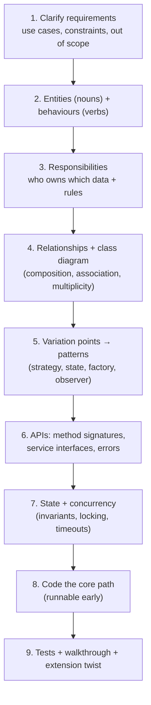
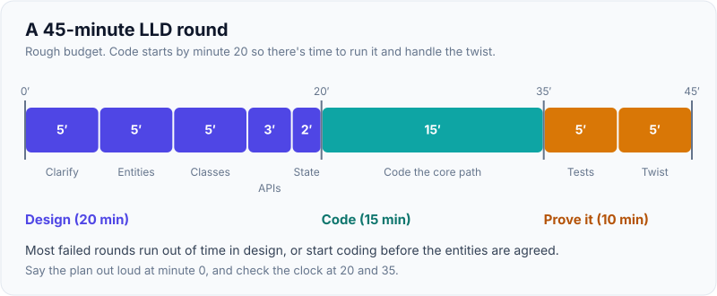
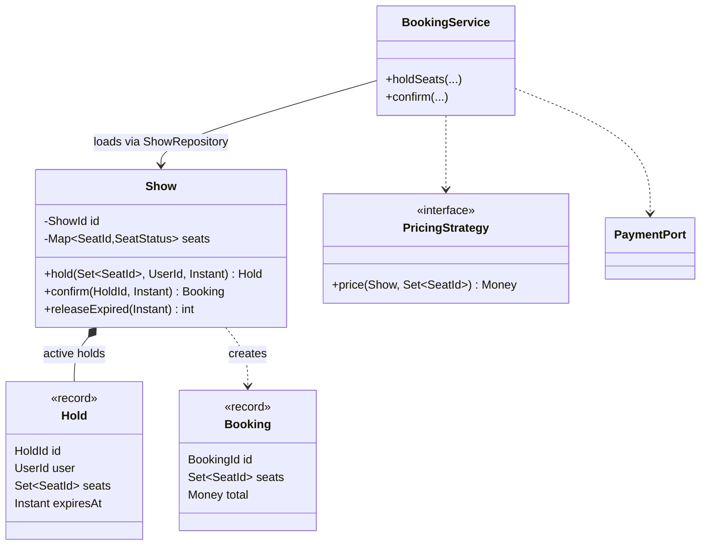

# LLD Approach: Requirements → Entities → Relationships → APIs

!!! abstract "Key takeaways"
    - LLD rounds test **object modelling + clean code + extensibility + concurrency**, usually in 45–90 minutes (whiteboard or machine coding). Use a fixed sequence:
        1. **Clarify** (use cases, constraints, scale within one service, concurrency, persistence in scope?)
        2. **Entities** (nouns) and **behaviours** (verbs)
        3. **Responsibilities** (who owns which data and rules)
        4. **Relationships** + class diagram
        5. **Patterns at variation points** (strategy, state, factory, observer)
        6. **APIs** (method signatures, service interfaces, maybe REST)
        7. **State and concurrency**
        8. **Code the core path**
        9. **Test and walk through edge cases**
    - **Rich domain objects** (behaviour next to data: `seat.hold(user)`) beat anaemic models plus god services for LLD rounds.
    - **Design for the likely change** the interviewer hints at (new pricing, new vehicle type, new payment method). That's where interfaces and patterns go, and nowhere else.
    - **Concurrency is often the hidden requirement:** double booking, last item in stock, parallel elevator requests. Show **atomic operations** (`ConcurrentHashMap.compute`, locks with clear scope, DB conditional updates) and **hold timeouts**.
    - **Machine-coding tips:** a runnable `main` or tests early, an in-memory repository behind an interface, small classes, meaningful names, enums for states, no premature frameworks.

## Why it matters

LLD rounds sink candidates who either jump straight into code (no model, so a messy refactor at minute 40) or spend the whole time drawing UML (nothing runs). A repeatable approach gets you to a **working, extensible core** with time left for the interviewer's "now add X" twist. That twist is what's really being tested.

## Core concepts

### The process


*Notice that steps 1–7 should take roughly a third of the time. They make step 8 fast and the twist in step 9 a small change instead of a rewrite.*

{ loading=lazy }
*Notice the hard edge at minute 20: if coding hasn't started by then, there's no time left to run it or absorb the twist.*

### Step 1: Clarify

Questions to ask:

- **Actors and use cases:** who uses it, and what are the 3–5 core flows?
- **Rules:** pricing, limits, priorities, cancellations, expiry.
- **Scale and concurrency:** single process? Multiple concurrent users? (Usually yes, so say so.)
- **Persistence and UI:** usually in-memory with a repository interface, and no UI.
- **Extensibility hints:** "might we add new X later?"
- **Out of scope:** payments, auth, notifications. Name them as interfaces only.

### Steps 2–3: Entities and responsibilities

- Underline **nouns** (candidates for classes or value objects) and **verbs** (candidate methods).
- **Entity** (has identity, lifecycle: Booking, Show) vs **value object** (immutable, defined by its values: Money, SeatId, TimeSlot). Use records for value objects.
- **Assign behaviour where the data lives** (Information Expert, from GRASP). `Show` knows its seats, so `show.holdSeats(...)` belongs there, not in a 900-line `BookingService`.
- **Services** coordinate across aggregates and talk to ports (payment, notifications). Keep them thin.

### Steps 4–5: Relationships and patterns

- Use composition for owned parts, associations (by ID) across aggregates, and interfaces at variation points.

| Variation hint | Pattern |
|---|---|
| "Different pricing/fees/strategies" | Strategy |
| "Object goes through stages" | State (enum + transitions) |
| "Notify users / other components" | Observer / events |
| "Create different types of X" | Factory / registry |
| "Undo, queue, audit actions" | Command |
| "Wrap external system" | Adapter |
| "Add cross-cutting behaviour" | Decorator |

### Step 6: APIs

- **Class-level APIs:** method names in domain language, inputs and outputs as value objects, and **explicit failures** (checked domain exceptions or result types: `HoldResult.Success | SeatsUnavailable`).
- **Service and REST APIs** if asked: `POST /shows/{id}/holds`, `POST /holds/{id}/confirm`, idempotency keys for confirmation.
- **Immutability:** return unmodifiable views and copies, never internal mutable collections.

### Step 7: State and concurrency

- **Name the invariants:** a seat is booked by at most one booking, a hold expires after N minutes, refunds ≤ paid.
- **Choose the concurrency mechanism by scope:**
    - **Single JVM:** `ConcurrentHashMap.compute`/`putIfAbsent`, `ReentrantLock` per aggregate, atomic classes. Lock ordering (sort the seat IDs) to avoid deadlock.
    - **Multiple instances:** DB constraints and conditional updates (unique index on `(show_id, seat_id)`), optimistic locking (`@Version`), or a short distributed lock with fencing.
- **Timeouts:** holds expire, either via a scheduled sweeper or lazily when checked.

{ loading=lazy }
*Watch the amber arrow back to AVAILABLE: a hold is a lease. Without an expiry, abandoned carts would lock seats forever.*

### What interviewers score

| Area | Strong signal |
|---|---|
| Requirements | Asked the questions, stated assumptions and scope |
| Modelling | Right entities and value objects, behaviour in the right place |
| Extensibility | Patterns exactly where variation was hinted |
| Code quality | Small cohesive classes, naming, immutability, no god class |
| Correctness | Invariants enforced, edge cases, concurrency |
| Testability | Interfaces at boundaries, injected clock, runnable tests |
| Communication | Walkthroughs, trade-offs, handling the twist |

## In practice: code & configuration

**Worked example: movie-ticket booking (core).** Use cases: list shows, hold seats for 10 minutes, confirm booking with payment, release expired holds. Twist: different pricing per seat type and time.


*Notice that `Show` owns seat state and enforces the invariants. `BookingService` only orchestrates (load show, price, pay, save) through ports that can be faked in tests.*

=== "❌ Common mistake"
    ```java
    // God service + anaemic model + check-then-act race (two users can hold the same seat).
    public class BookingService {
        Map<String, String> seatStatus = new HashMap<>();          // not thread-safe
        public boolean book(String show, List<String> seats, String user) {
            for (String s : seats)
                if (!"FREE".equals(seatStatus.get(show + s))) return false;   // check...
            for (String s : seats) seatStatus.put(show + s, user);           // ...then act: race
            // pricing, payment, email, persistence all inline below...
            return true;
        }
    }
    ```

=== "✅ Correct approach"
    ```java
    // Domain object enforces invariants atomically for this show (single-JVM version).
    public final class Show {
        private final String id;
        private final Map<String, SeatStatus> seats;          // seatId → status
        private final Map<String, Hold> holds = new HashMap<>();
        private final Duration holdTtl;
        private final ReentrantLock lock = new ReentrantLock(); // one lock per show aggregate

        public Show(String id, Set<String> seatIds, Duration holdTtl) {
            this.id = id;
            this.holdTtl = holdTtl;
            this.seats = new HashMap<>();
            seatIds.forEach(s -> seats.put(s, SeatStatus.AVAILABLE));
        }

        public Hold hold(Set<String> seatIds, String userId, Instant now) {
            lock.lock();
            try {
                releaseExpiredLocked(now);                         // lazy expiry
                for (String s : seatIds) {
                    if (seats.get(s) != SeatStatus.AVAILABLE)
                        throw new SeatsUnavailableException(s);    // all-or-nothing
                }
                seatIds.forEach(s -> seats.put(s, SeatStatus.HELD));
                Hold h = new Hold(UUID.randomUUID().toString(), userId, Set.copyOf(seatIds), now.plus(holdTtl));
                holds.put(h.id(), h);
                return h;
            } finally {
                lock.unlock();
            }
        }

        public Set<String> confirm(String holdId, Instant now) {
            lock.lock();
            try {
                Hold h = holds.remove(holdId);
                if (h == null || h.expiresAt().isBefore(now)) throw new HoldExpiredException(holdId);
                h.seats().forEach(s -> seats.put(s, SeatStatus.BOOKED));
                return h.seats();
            } finally {
                lock.unlock();
            }
        }

        private void releaseExpiredLocked(Instant now) {
            holds.values().removeIf(h -> {
                boolean expired = h.expiresAt().isBefore(now);
                if (expired) h.seats().forEach(s -> seats.put(s, SeatStatus.AVAILABLE));
                return expired;
            });
        }
    }

    public enum SeatStatus { AVAILABLE, HELD, BOOKED }
    public record Hold(String id, String userId, Set<String> seats, Instant expiresAt) {}
    ```

    ```java
    // Orchestration through ports; Clock injected for testability.
    public final class BookingService {
        private final ShowRepository shows; private final PricingStrategy pricing;
        private final PaymentPort payments; private final Clock clock;
        // constructor omitted
        public Booking confirm(String showId, String holdId, PaymentDetails pay) {
            Show show = shows.get(showId);
            Set<String> seats = show.confirm(holdId, clock.instant());
            Money total = pricing.price(show, seats);
            payments.charge(pay, total, holdId);                   // holdId doubles as idempotency key
            return new Booking(UUID.randomUUID().toString(), showId, seats, total);
        }
    }
    ```

!!! tip "Multi-instance version"
    Across several app instances, the in-JVM lock no longer protects you. Enforce the invariant in the database: a `seat_hold` table with a unique `(show_id, seat_id)` and an `expires_at`, inserted in one transaction for all seats (all-or-nothing), or conditional updates on `seat.status`. Expiry is handled by a sweeper job or a check at confirm time.

## Real-world usage

- **Booking systems** (BookMyShow, Ticketmaster, airline seats) all use **hold-with-timeout + confirm** to avoid double booking while users pay, with DB-level constraints or Redis holds with TTL.
- **Machine-coding rounds** (common at Indian product companies, Uber, Flipkart, Swiggy) grade a runnable, extensible, well-named solution in 90 minutes. **Interfaces + in-memory repositories + a driver/tests** is the expected shape.
- **Real codebases** suffer from the same failures interviews probe: anaemic models with 2,000-line services, races on check-then-act, and patterns applied where nothing varies.

## Trade-offs & production gotchas

| Choice | Pros | Cons |
|---|---|---|
| Rich domain model | Invariants in one place, readable | Needs care with persistence mapping |
| Anaemic model + services | Simple CRUD | Rules scattered, god services |
| Coarse lock per aggregate (show) | Simple, correct | Contention on hot shows |
| Fine-grained locks per seat | More concurrency | Lock ordering, deadlock risk |
| DB constraints | Correct across instances | Round trips, retries on conflicts |
| Result types vs exceptions | Explicit outcomes | More verbose in Java (use sealed results) |

!!! warning "Gotchas"
    - **Inject `Clock`** (don't call `Instant.now()` inside the domain) so expiry is testable.
    - **All-or-nothing:** validate every seat before mutating any, or roll back.
    - **Don't expose internal collections.** Return copies or unmodifiable views.
    - **Time-box the UML.** Get to runnable code by the midpoint.

## How this connects to my experience

- **Where I used it:**
    - Designing microservices with Spring Boot at OptumRx (domain services for healthcare workflows).
    - "Conducted technical interviews and contributed to hiring decisions."
    - "Design reviews" and mentoring.
- **Talking points:**
    - "I start design reviews the same way: use cases, invariants, then entities and where each rule lives, before discussing frameworks." *[confirm]*
    - "Concurrency bugs I've seen in reviews are mostly check-then-act. The fix is an atomic operation at the right scope: a DB constraint across instances, an aggregate lock within one JVM." *[confirm: a concrete example]*
    - "As an interviewer, I look for a runnable core, sensible boundaries, and how candidates handle the extension twist." *[confirm: did you run LLD/machine-coding rounds?]*
- **Likely follow-up chain:** "Walk me through how you'd design X." → "Where do the rules live?" → "What about concurrency across instances?" → "How do you test time-based logic?" Use the process, then DB constraints and an injected clock.

## Interview questions

### Fundamentals

??? question "Q1. What are your first 5 minutes in an LLD round?"
    **Answer:** Clarify actors and use cases, rules (pricing, limits, expiry), concurrency expectations, what's in or out of scope (persistence, payments, UI), and likely extensions. Then state assumptions and the plan: entities → class diagram → APIs → core code → tests.

    **Interviewer listens for:** structured questions, scope control.

    **Common wrong answer:** starting to code immediately.

??? question "Q2. Entity vs value object?"
    **Answer:** An entity has identity and a lifecycle, and equality is by ID (Booking, Show). A value object is defined by its attributes, is immutable and is replaceable (Money, SeatId, TimeRange). Use records for value objects. They make code safer and clearer.

    **Interviewer listens for:** immutability and equality semantics.

    **Common wrong answer:** "value objects are DTOs".

??? question "Q3. Where should business rules live?"
    **Answer:** With the data they protect (rich domain objects / aggregates), following Information Expert. For example `Show.hold()` enforces seat availability. Services orchestrate across aggregates and external ports. Controllers only translate HTTP.

    **Interviewer listens for:** avoiding anaemic models and god services.

    **Common wrong answer:** "in the service layer".

### Intermediate

??? question "Q4. How do you decide where to use design patterns?"
    **Answer:** Only at variation points: what the requirements or interviewer say will change (pricing, vehicle types, notification channels), or where lifecycles exist (State). Everywhere else, use simple classes. Name the change you're protecting against.

    **Interviewer listens for:** justified patterns.

    **Common wrong answer:** "use as many patterns as possible".

??? question "Q5. How do you make time-dependent logic testable?"
    **Answer:** Inject a `java.time.Clock` (or a time supplier) into services and pass `Instant now` into domain methods. In tests, use `Clock.fixed` or a mutable test clock to simulate expiry. Never call `Instant.now()` deep in the domain.

    **Interviewer listens for:** an injected clock.

    **Common wrong answer:** "`Thread.sleep` in tests".

??? question "Q6. How do you prevent double booking within one service instance?"
    **Answer:** Make check-and-mark atomic per aggregate: a lock per show, or `ConcurrentHashMap.compute` per seat (with ordered acquisition for multi-seat holds). Validate everything before mutating anything. Release on failure. Add hold expiry.

    **Interviewer listens for:** atomicity and all-or-nothing.

    **Common wrong answer:** "`synchronized` on the whole service" (correct, but kills concurrency, so mention the trade-off).

??? question "Q7. How do you design the public API (method signatures) of your classes in an LLD round?"
    **Answer:** Start from the **use cases**, not the fields. Write the calls the client makes: `ParkingLot.park(Vehicle): Ticket`, `ParkingLot.unpark(TicketId): Receipt`. Use domain types instead of primitives (`TicketId`, `Money`). Return results or throw **specific** exceptions (`NoSpotAvailableException`). Keep methods small and intention-revealing, and make mutation explicit. Hide internals: callers should not reach `lot.getFloors().get(2).getSpots()`.

    **Interviewer listens for:** use-case first, domain types, explicit failures, encapsulation (Law of Demeter).

    **Common wrong answer:** Generating getters and setters for every field and calling that the API.

### Senior

??? question "Q8. And across multiple instances?"
    **Answer:**
    - Move the invariant to shared storage: a unique constraint on `(show_id, seat_id)` in a holds or bookings table, inserted for all seats in one transaction.
    - Or a conditional `UPDATE seat SET status='HELD' WHERE status='AVAILABLE'` checking the affected row count.
    - Or optimistic locking on the show aggregate.
    - Or Redis `SET NX PX` per seat with all-or-nothing handling (Lua).

    Expiry is handled by TTL or a sweeper. Confirmation uses an idempotency key.

    **Interviewer listens for:** DB constraints as the source of truth.

    **Common wrong answer:** "`synchronized` works across servers".

??? question "Q9. How do you structure a machine-coding solution?"
    **Answer:**
    - Packages: `model` (entities, value objects, enums), `service` (orchestration), `repository` (interfaces + in-memory implementations), `strategy` (pricing etc.), `exception`.
    - A driver or JUnit tests.
    - Constructor injection without frameworks.
    - Immutable value objects.
    - Get the core path running early, then extend.
    - Keep `main` as a demo of the use cases.

    **Interviewer listens for:** a runnable, layered, testable structure.

    **Common wrong answer:** one file with static methods.

??? question "Q10. How do you make a design extensible without over-engineering it?"
    **Answer:** Ask which **variation points** are likely (pricing rules, vehicle types, notification channels). Put an interface only at those points (Strategy, Factory) and keep everything else concrete. Say the trade-off aloud: "I am making pricing pluggable because you mentioned weekend rates; I am not abstracting storage because we only have in-memory." YAGNI applies to guessed requirements, not to requirements the interviewer already hinted at.

    **Interviewer listens for:** identifies likely variation points, targeted abstraction, explains what is deliberately left concrete.

    **Common wrong answer:** Interfaces and factories for every class "in case it changes", which makes the code hard to follow in 45 minutes.

### Scenario-based

??? question "Q11. Twist: 'Now add dynamic pricing: weekends +20%, premium seats ×1.5, coupons.' How do you change the design?"
    **Answer:** A `PricingStrategy` interface already exists. Add composable rules: a base price per seat type plus a chain of `PriceModifier`s (weekend, coupon) applied in order (Decorator or Chain). Each rule is a class, configured per show. Tests per rule. No changes to `Show` or the booking flow.

    **Interviewer listens for:** an extension with minimal change.

    **Common wrong answer:** "add `if` statements to `BookingService`".

??? question "Q12. Your design is half done and the interviewer says it's too complex. What do you do?"
    **Answer:** Ask which part feels complex, then simplify: collapse unnecessary interfaces, merge tiny classes with no variation, keep patterns only where variation is real. Explain the trade-off you'd revisit if requirements grow. Showing you can simplify is a strong senior signal.

    **Interviewer listens for:** responsiveness and judgement.

    **Common wrong answer:** defending every abstraction.

## Cheat sheet

| Step | Remember |
|---|---|
| Clarify | Actors, use cases, rules, concurrency, out of scope, likely changes |
| Model | Nouns → entities/value objects. Verbs → methods. Records for values |
| Responsibility | Behaviour with its data (Information Expert). Thin services |
| Relationships | Composition for owned parts, IDs across aggregates, interfaces at variation points |
| Patterns | Only where change is hinted: Strategy, State, Factory, Observer, Command, Adapter |
| APIs | Domain names, value-object params, explicit failures, immutable returns |
| Concurrency | Invariants named. Atomic per aggregate (JVM) or DB constraints (cluster). Holds with TTL |
| Testability | Injected `Clock`, in-memory repositories behind interfaces, runnable driver |
| Timebox | Model ≤ 1/3 of the time, runnable core by the midpoint, leave room for the twist |

## Sources
1. Craig Larman, *Applying UML and Patterns* (GRASP: Information Expert, Creator, Controller, Low Coupling, High Cohesion).
2. Eric Evans, *Domain-Driven Design*: entities, value objects, aggregates.
3. Vaughn Vernon, *Implementing Domain-Driven Design*: aggregate design rules and consistency boundaries.
4. [Martin Fowler: Anemic Domain Model](https://martinfowler.com/bliki/AnemicDomainModel.html).
5. [Java `Clock` API](https://docs.oracle.com/en/java/javase/21/docs/api/java.base/java/time/Clock.html): testable time.
6. Brian Goetz et al., *Java Concurrency in Practice*: atomicity, lock scope, check-then-act races.
