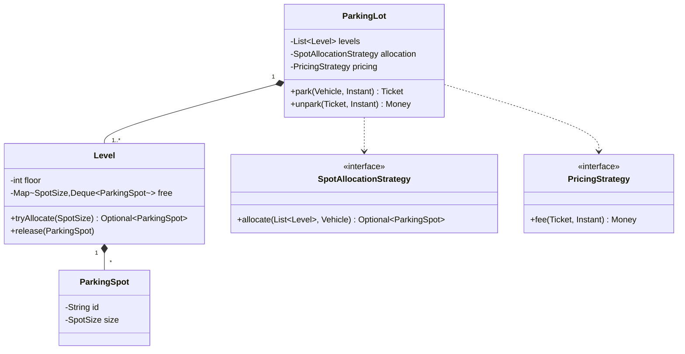
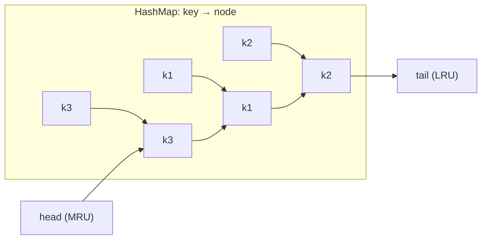
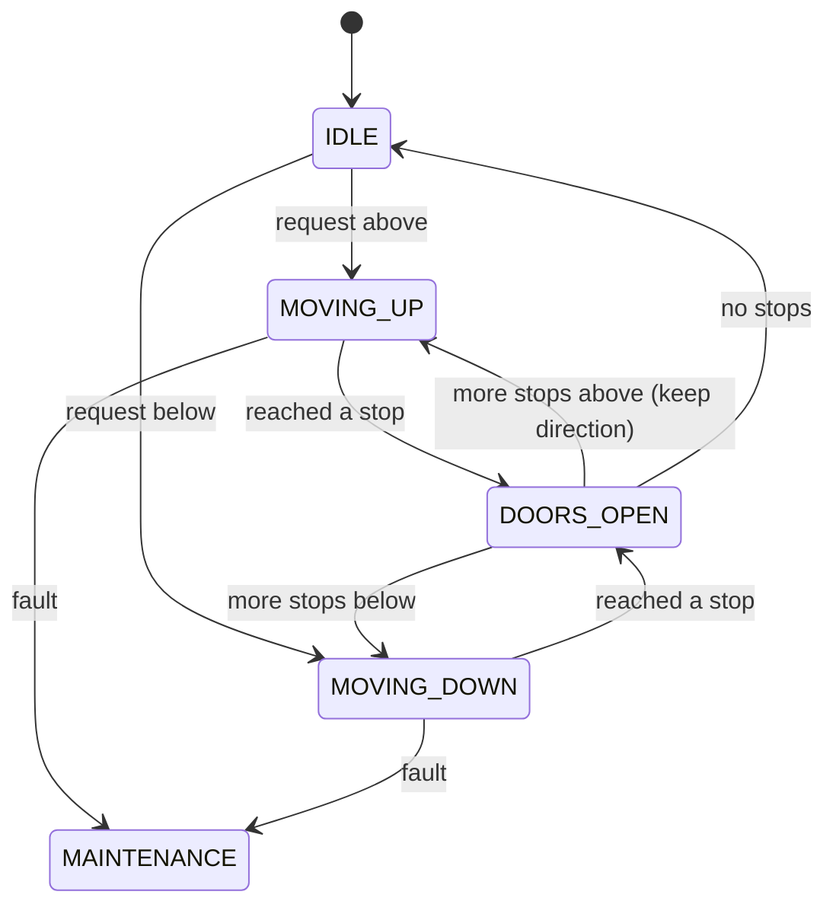

# Case Studies: Parking Lot, LRU Cache, Rate Limiter, Elevator, Splitwise, Library System

!!! abstract "Key takeaways"
    | Problem | Core of the answer | Pattern / data structure | Twist to expect |
    |---|---|---|---|
    | **Parking lot** | Levels → spots by size, tickets, fees | Strategy (allocation, pricing), Factory (vehicle types), State (ticket) | EV charging spots, multiple entry gates (concurrency), reservations |
    | **LRU cache** | **HashMap + doubly linked list**, O(1) get/put | (or `LinkedHashMap(accessOrder=true)` + `removeEldestEntry`) | Thread safety, TTL, LFU variant |
    | **Rate limiter** | Token bucket per key, lazy refill | Strategy (algorithm), `ConcurrentHashMap` | Sliding window, distributed (Redis) |
    | **Elevator** | Requests (hall + car), per-elevator direction, **LOOK/SCAN** scheduling, dispatcher | State (moving/idle/doors), Strategy (dispatch) | Multiple elevators, peak modes, priority/emergency |
    | **Splitwise** | Expenses with split types → balances → **simplify debts** (greedy max-creditor/max-debtor) | Strategy (equal/exact/percent split), Factory | Groups, currencies, settle-up, audit |
    | **Library** | Book vs BookCopy, members, loans, reservations, fines | State (copy/loan), Strategy (fine policy), Observer (reservation available) | Concurrency on the last copy, renewals, limits per member type |

## Why it matters

These six problems make up most LLD and machine-coding rounds. Each has a **known core** the interviewer expects (O(1) LRU with a linked list, LOOK scheduling for elevators, debt simplification for Splitwise) plus a **twist** that tests extensibility. Having compiling code for each core in your head frees your interview time for design discussion and edge cases.

## Core concepts

### 1. Parking lot

**Requirements:**

- Multiple levels, spot sizes (motorbike / compact / large / EV).
- Vehicles of each type, entry and exit gates.
- Tickets, fees by duration and vehicle type.
- Display free counts.
- Concurrent gates.


*Notice the two variation points the interviewer usually probes: **how a spot is chosen** (nearest, lowest level, smallest fitting) and **how the fee is computed** (hourly, flat, weekend). Both are strategies.*

**Key decisions:**

- **Spot fit:** a vehicle can use its size or larger (`motorbike ≤ compact ≤ large`).
- **Free spots per level per size** go in concurrent deques, so allocation is O(1) and thread-safe (`pollFirst`).
- The ticket holds spot, vehicle and entry time. A ticket state of ACTIVE → PAID → EXITED (State).
- **Concurrency:** multiple gates allocate at the same time, so use atomic `poll` from a concurrent structure, or a lock per level.

### 2. LRU cache

**Requirements:** `get(key)` and `put(key, value)` in **O(1)**, capacity N, evict the least recently used entry.


*Notice the division of labour: the **map** gives O(1) lookup of a node, and the **doubly linked list** gives O(1) move-to-front and remove-from-tail. Neither alone is enough.*

- `get`: look up the node and move it to the head.
- `put`: update and move to the head, or insert at the head. If over capacity, remove the tail node and its map entry.
- **Java shortcut:** `new LinkedHashMap<>(cap, 0.75f, true)` with `removeEldestEntry` returning `size() > cap`. Mention it, but implement the manual version if asked.
- **Thread safety:** wrap with a lock (simple), or use **Caffeine** in production (concurrent, W-TinyLFU, TTL).

### 3. Rate limiter (LLD version)

- An interface `RateLimiter.tryAcquire(key)` with token bucket, sliding window and other implementations (Strategy).
- **Token bucket per key** in a `ConcurrentHashMap`, with lazy refill from elapsed nanos, `synchronized` per bucket, an injected time source.
- Evict idle buckets (`expireAfterAccess` with Caffeine).
- The distributed version uses Redis + Lua (see the system design rate-limiting page).

### 4. Elevator system

**Requirements:**

- N elevators, M floors.
- Hall calls (floor + direction) and car calls (destination).
- Minimise wait, keep direction while there are requests ahead.
- Doors, capacity, emergency stop.


*Notice the **LOOK** behaviour: an elevator keeps moving in its direction while there are stops ahead, then reverses. It's the elevator version of the disk-scheduling SCAN/LOOK algorithms, which avoid starvation and zig-zagging.*

**Design points:**

- **Per elevator:** a `TreeSet<Integer>` of up-stops and down-stops. The next stop is `upStops.ceiling(current)` while going up, and `downStops.floor(current)` while going down.
- **Dispatcher** (Strategy) assigns hall calls to the elevator with the lowest cost: distance, plus a penalty if it's moving away or the same-direction pass is already behind it, plus load.
- **Concurrency:** requests arrive from many threads. Each elevator has its own lock or command queue (an actor-style single thread per elevator).

### 5. Splitwise (expense sharing)

**Requirements:**

- Users and groups.
- Add expenses paid by one person and split **equally / exactly / by percentage** among participants.
- Show balances.
- **Simplify debts** (minimise the number of transactions).
- Settle up.

**Model:**

- `Expense(paidBy, amount, splits)`.
- A `SplitStrategy` per type validates and computes shares (exact amounts must sum to the total, percentages to 100).
- A `BalanceSheet` with net balance per user (positive = owed to them).
- Use integer **minor units** (paise or cents) and distribute rounding remainders deterministically.

**Simplification:** compute the net balance per user, then repeatedly match the largest creditor with the largest debtor and settle `min(credit, debt)`. This gives at most N−1 transactions. Finding the true minimum is NP-hard (subset-sum-like), so the greedy heuristic is the accepted answer.

### 6. Library management

**Requirements:**

- Catalogue (Book: ISBN, title, authors) vs **copies** (BookCopy with barcode and status).
- Members with limits by type.
- Borrow, return, renew.
- Reservations (holds) queue.
- Fines for late returns.
- Search.

**Design points:**

- **Book ≠ BookCopy.** Copy status: AVAILABLE, ON_LOAN, RESERVED, LOST (State).
- **Loan:** copy, member, due date, return date. A `FinePolicy` strategy (per day, capped, grace period).
- **Reservation queue** per Book (FIFO). When a copy is returned, notify the next member (**Observer**) and hold the copy for N days.
- **Concurrency:** two members borrowing the last copy. Use an atomic status transition (conditional update or a lock per copy).
- Member limits (Student 3 books, Faculty 10) via member type or policy.

## In practice: code & configuration

All the code below compiles on Java 21 (verified). It shows the cores interviewers expect.

=== "❌ Common mistake"
    ```java
    // "LRU" with a list scan: O(n) get/put; and a rate limiter with a non-atomic check.
    class SlowLru<K, V> {
        private final Map<K, V> map = new HashMap<>();
        private final List<K> order = new ArrayList<>();
        V get(K k) { order.remove(k); order.add(k); return map.get(k); }   // O(n) remove
    }
    ```

=== "✅ Correct approach: O(1) LRU"
    ```java
    public final class LruCache<K, V> {
        private final class Node {                     // doubly linked list node
            final K key; V value; Node prev, next;
            Node(K key, V value) { this.key = key; this.value = value; }
        }
        private final int capacity;
        private final Map<K, Node> index = new HashMap<>();
        private final Node head = new Node(null, null), tail = new Node(null, null);   // sentinels

        public LruCache(int capacity) {
            if (capacity <= 0) throw new IllegalArgumentException("capacity > 0");
            this.capacity = capacity;
            head.next = tail; tail.prev = head;
        }

        public synchronized Optional<V> get(K key) {
            Node n = index.get(key);
            if (n == null) return Optional.empty();
            moveToFront(n);
            return Optional.ofNullable(n.value);
        }

        public synchronized void put(K key, V value) {
            Node n = index.get(key);
            if (n != null) { n.value = value; moveToFront(n); return; }
            n = new Node(key, value);
            index.put(key, n);
            addAfterHead(n);
            if (index.size() > capacity) {
                Node lru = tail.prev;                  // least recently used
                unlink(lru);
                index.remove(lru.key);
            }
        }

        private void moveToFront(Node n) { unlink(n); addAfterHead(n); }
        private void addAfterHead(Node n) { n.prev = head; n.next = head.next; head.next.prev = n; head.next = n; }
        private void unlink(Node n) { n.prev.next = n.next; n.next.prev = n.prev; }
    }
    ```

Thread-safe token bucket limiter (per key, injected time source):

```java
public final class TokenBucketLimiter {
    private final long capacity;
    private final double refillPerNano;
    private final LongSupplier nanoTime;                         // System::nanoTime in prod, fake in tests
    private final ConcurrentHashMap<String, Bucket> buckets = new ConcurrentHashMap<>();

    public TokenBucketLimiter(long capacity, double refillPerSecond, LongSupplier nanoTime) {
        this.capacity = capacity;
        this.refillPerNano = refillPerSecond / 1_000_000_000.0;
        this.nanoTime = nanoTime;
    }

    public boolean tryAcquire(String key) {
        return buckets.computeIfAbsent(key, k -> new Bucket(capacity, nanoTime.getAsLong())).tryTake();
    }

    private final class Bucket {
        private double tokens; private long last;
        Bucket(long tokens, long now) { this.tokens = tokens; this.last = now; }
        synchronized boolean tryTake() {                         // per-bucket lock: keys don't contend
            long now = nanoTime.getAsLong();
            tokens = Math.min(capacity, tokens + (now - last) * refillPerNano);   // lazy refill
            last = now;
            if (tokens >= 1) { tokens -= 1; return true; }
            return false;
        }
    }
}
```

Elevator next-stop selection (LOOK):

```java
public final class Elevator {
    public enum Direction { UP, DOWN, IDLE }
    private int floor;
    private Direction direction = Direction.IDLE;
    private final TreeSet<Integer> stops = new TreeSet<>();

    public Elevator(int startFloor) { this.floor = startFloor; }

    public synchronized void addStop(int f) { if (f != floor) stops.add(f); }

    /** Moves to the next stop using LOOK; returns the floor reached, or empty if idle. */
    public synchronized OptionalInt step() {
        if (stops.isEmpty()) { direction = Direction.IDLE; return OptionalInt.empty(); }
        Integer next = switch (direction) {
            case UP   -> Optional.ofNullable(stops.ceiling(floor)).orElse(stops.floor(floor));
            case DOWN -> Optional.ofNullable(stops.floor(floor)).orElse(stops.ceiling(floor));
            case IDLE -> nearest();
        };
        direction = next > floor ? Direction.UP : Direction.DOWN;   // keep or reverse direction
        floor = next;
        stops.remove(next);
        return OptionalInt.of(floor);
    }

    private Integer nearest() {
        Integer up = stops.ceiling(floor), down = stops.floor(floor);
        if (up == null) return down;
        if (down == null) return up;
        return (up - floor) <= (floor - down) ? up : down;
    }
}
```

Splitwise debt simplification (greedy):

```java
public record Transfer(String from, String to, long amountMinor) {}

public static List<Transfer> simplify(Map<String, Long> netBalances) {   // + = is owed, − = owes
    PriorityQueue<Map.Entry<String, Long>> creditors =
            new PriorityQueue<>((a, b) -> Long.compare(b.getValue(), a.getValue()));
    PriorityQueue<Map.Entry<String, Long>> debtors =
            new PriorityQueue<>((a, b) -> Long.compare(a.getValue(), b.getValue()));
    netBalances.forEach((user, bal) -> {
        if (bal > 0) creditors.add(new AbstractMap.SimpleEntry<>(user, bal));
        else if (bal < 0) debtors.add(new AbstractMap.SimpleEntry<>(user, bal));
    });
    List<Transfer> result = new ArrayList<>();
    while (!creditors.isEmpty() && !debtors.isEmpty()) {
        var c = creditors.poll(); var d = debtors.poll();
        long amount = Math.min(c.getValue(), -d.getValue());
        result.add(new Transfer(d.getKey(), c.getKey(), amount));
        if (c.getValue() - amount > 0) creditors.add(new AbstractMap.SimpleEntry<>(c.getKey(), c.getValue() - amount));
        if (d.getValue() + amount < 0) debtors.add(new AbstractMap.SimpleEntry<>(d.getKey(), d.getValue() + amount));
    }
    return result;                                                        // ≤ N−1 transfers
}
// simplify({A:+50, B:-30, C:-20}) → [B→A 30, C→A 20]
```

## Real-world usage

- **LRU and related caches:** Caffeine (W-TinyLFU), Guava, Redis eviction (approximated LRU/LFU), CPU caches, database buffer pools (LRU variants like clock-sweep in Postgres).
- **Rate limiters:** Guava `RateLimiter` (smooth bursty token bucket), Resilience4j `RateLimiter`, Bucket4j (token bucket with JCache/Redis back-ends).
- **Elevator dispatch:** real systems use destination dispatch (passengers enter their floor in the lobby) and optimise group assignment. LOOK/SCAN is the classic baseline.
- **Splitwise:** publicly known to use "simplify debts" as a user-visible feature. The greedy approach is the standard interview answer.
- **Parking and library systems:** classic modelling exercises that map closely to real inventory, reservation and fine workflows.

## Trade-offs & production gotchas

| Problem | Trade-off | Typical choice |
|---|---|---|
| LRU thread safety | Global lock (simple) vs segmented/concurrent | Lock in interview, Caffeine in production |
| Rate limiter state | Per-key buckets grow unbounded | Evict idle keys (TTL cache) |
| Elevator dispatch | Optimal vs simple heuristic | Cost function + LOOK per car |
| Splitwise simplification | Exact minimum (NP-hard) vs greedy | Greedy ≤ N−1 transfers |
| Parking allocation | Nearest spot vs fastest allocation | Strategy, with free-lists per size |
| Library concurrency | Locks vs conditional updates | Atomic status transition per copy |

!!! warning "Gotchas"
    - **Money:** use integer minor units and deterministic remainder distribution (Splitwise, parking fees). Never use `double`.
    - **`LinkedHashMap` access order** changes on `get`, so iterating it while calling `get` throws `ConcurrentModificationException`.
    - **Time:** inject clocks or time sources for fees, fines and token refill.
    - **Elevator starvation:** pure "nearest request" scheduling starves far floors. LOOK fixes it.

## How this connects to my experience

- **Where I used it:**
    - Java and Spring across all roles, Redis caching (eviction policies, TTLs) at OptumRx, rate limiting at API layers.
    - "Conducted technical interviews" (familiar with these problem formats from the interviewer side).
- **Talking points:**
    - "For caches I'd reach for Caffeine or Redis rather than hand-rolling one, but I know the LRU internals, which helps when tuning eviction and TTLs, like we did for Redis reference data." *[confirm: Redis maxmemory-policy used]*
    - "Rate limiting showed up both at the API edge and for protecting upstream systems from our GraphQL layer." *[confirm]*
    - If you've interviewed with these problems: "I look for a runnable core, tests and how the candidate handles the twist." *[confirm]*
- **Likely follow-up chain:** "Make the LRU thread-safe." → "Now add TTL." → "How would Caffeine do it better?" → "How would you test it?" Lock → an expiry timestamp per node, checked lazily, plus a cleanup → concurrent buffers + W-TinyLFU admission + amortised maintenance → unit tests with a fake clock and capacity edge cases.

## Interview questions

### Fundamentals

??? question "Q1. Implement an LRU cache with O(1) operations."
    **Answer:** A HashMap from key to node plus a doubly linked list ordered by recency (head = most recent). `get` looks up the node and moves it to the head. `put` inserts or updates at the head, and evicts the tail (and its map entry) when over capacity. Sentinel head and tail nodes simplify the edge cases. The Java shortcut is `LinkedHashMap` with `accessOrder=true` + `removeEldestEntry`.

    **Interviewer listens for:** map + doubly linked list, and why both are needed.

    **Common wrong answer:** a list scan (O(n)).

??? question "Q2. Parking lot: what are the variation points?"
    **Answer:** Spot allocation (nearest, lowest level, best fit), pricing (hourly, flat, weekend, vehicle type), vehicle and spot types (factory or enums), payment methods. Make each a strategy or enum. Ticket lifecycle as State. Concurrent gates need atomic allocation.

    **Interviewer listens for:** strategies where change is likely.

    **Common wrong answer:** a subclass per vehicle with the pricing inside it.

??? question "Q3. Library: why separate Book and BookCopy?"
    **Answer:** `Book` is catalogue information (ISBN, title, authors), shared by all copies. `BookCopy` is a physical item with its own barcode, status, location and loan history. Loans and reservations work differently: loans are on copies, and reservations are usually on books (any copy).

    **Interviewer listens for:** the catalogue vs inventory distinction.

    **Common wrong answer:** one `Book` with a count.

### Intermediate

??? question "Q4. Elevator: how do you pick the next floor?"
    **Answer:** LOOK: keep moving in the current direction while there are stops ahead (`ceiling` going up, `floor` going down in a `TreeSet`), then reverse. When idle, pick the nearest. The dispatcher assigns hall calls to elevators by a cost function (distance, direction compatibility, load).

    **Interviewer listens for:** direction persistence and avoiding starvation.

    **Common wrong answer:** "always go to the nearest request".

??? question "Q5. Splitwise: how do you simplify debts?"
    **Answer:** Compute net balances (sum of paid minus share per user). Then repeatedly match the largest creditor with the largest debtor (heaps) and transfer `min(credit, |debt|)`. This yields at most N−1 transfers. The exact minimum is NP-hard, so greedy is the standard. Work in integer minor units.

    **Interviewer listens for:** net balances + greedy heaps + a complexity note.

    **Common wrong answer:** keeping every pairwise IOU.

??? question "Q6. Make the token bucket thread-safe and memory-bounded."
    **Answer:** `ConcurrentHashMap.computeIfAbsent` per key, a synchronized `tryTake` per bucket (keys don't contend), lazy refill from a monotonic time source (`nanoTime`), and evicting idle buckets (Caffeine `expireAfterAccess`). Inject the time source for tests.

    **Interviewer listens for:** per-key locking, eviction, testability.

    **Common wrong answer:** a global `synchronized` method.

??? question "Q7. Splitwise: how do you split 100.00 among 3 people without losing a cent?"
    **Answer:** Never use `double`. Work in **minor units** (`long` cents) or `BigDecimal` with an explicit scale and rounding mode. 10000 cents ÷ 3 = 3333 remainder 1. Give 3333 to everyone and add the 1-cent remainder to the first payee (or rotate it fairly). Then the shares always sum exactly to the total. The same rule applies to percentage splits: compute, round down, then distribute the remainder cents.

    **Interviewer listens for:** minor units or BigDecimal, explicit rounding, remainder distribution, shares sum to the total.

    **Common wrong answer:** Using `100.0 / 3` as a double, which gives 33.333… and balances that never settle to zero.

### Senior

??? question "Q8. Add TTL to your LRU cache."
    **Answer:**
    - Store `expiresAt` per node.
    - On `get`, if it's expired, remove it and return empty (lazy expiry).
    - Add a periodic sweep (or amortised cleanup on writes) to bound memory from never-read expired entries.
    - Inject a clock.
    - In production, use Caffeine's `expireAfterWrite`/`expireAfterAccess` with its timer wheel.

    **Interviewer listens for:** lazy plus active expiry, and a clock.

    **Common wrong answer:** a thread per entry.

??? question "Q9. Library: two members try to borrow the last copy at once. What happens?"
    **Answer:** The status transition must be atomic: `UPDATE copy SET status='ON_LOAN' WHERE id=? AND status='AVAILABLE'` (rows affected = 1 wins), or a per-copy lock in memory. The loser gets "unavailable" and can be offered a reservation. Reservations are a FIFO queue, and the next member is notified on return (Observer) with a hold expiry.

    **Interviewer listens for:** atomic transition, plus the reservation flow.

    **Common wrong answer:** "check availability first, then create the loan".

??? question "Q10. Elevator: how do you extend the single-elevator design to a bank of elevators?"
    **Answer:** Add a **dispatcher** (Mediator) that receives hall calls and assigns each to one elevator. Each elevator keeps its own LOOK/SCAN queue for cabin calls. A simple dispatch strategy is **nearest suitable car**: prefer an elevator already moving towards the floor in the requested direction, then an idle one, then the one with the fewest stops. Make the strategy pluggable (peak-time zoning, energy-saving). Update elevator state from one thread (event loop or actor per elevator) to avoid races between assignment and movement.

    **Interviewer listens for:** dispatcher/mediator, per-car scheduling, pluggable assignment strategy, concurrency model.

    **Common wrong answer:** Sharing one global request queue that every elevator polls, which causes several cars to answer the same call.

### Scenario-based

??? question "Q11. Parking twist: add EV charging spots with per-kWh billing."
    **Answer:**
    - A new spot type `EV` (or a capability flag) and an allocation rule (EVs prefer EV spots, others avoid them unless the lot is full).
    - Pricing becomes a composite: parking fee strategy + a charging session (start/stop kWh from the charger adapter) priced per kWh.
    - The ticket aggregates the line items.
    - No changes to the existing strategies beyond registering new ones.

    **Interviewer listens for:** an extension through new strategies and adapters.

    **Common wrong answer:** "add an `if (ev)` everywhere".

??? question "Q12. Splitwise twist: multiple currencies."
    **Answer:**
    - Keep balances **per currency** (don't silently convert).
    - Simplify within each currency.
    - Optional settle-up conversion at a recorded FX rate (store the rate and timestamp for audit).
    - Money stays a value object (amount in minor units + currency).
    - Rounding rules per currency (JPY has 0 decimals).

    **Interviewer listens for:** Money as a value object, auditability.

    **Common wrong answer:** "convert everything to USD with doubles".

## Cheat sheet

| Problem | Must-say |
|---|---|
| Parking lot | Levels → spots by size, free-lists per size, allocation + pricing strategies, ticket state, atomic allocation |
| LRU | HashMap + doubly linked list, sentinels, O(1). `LinkedHashMap(accessOrder)` shortcut. Caffeine in production |
| Rate limiter | Token bucket per key, lazy refill, per-bucket lock, idle eviction, injected time |
| Elevator | Up/down stop sets (`TreeSet`), LOOK, dispatcher cost function, per-elevator thread/lock |
| Splitwise | Split strategies, net balances, greedy heaps ≤ N−1 transfers, minor units |
| Library | Book vs BookCopy, loan/copy states, FinePolicy strategy, reservation queue + Observer, atomic borrow |

## Sources
1. [Java `LinkedHashMap`](https://docs.oracle.com/en/java/javase/21/docs/api/java.base/java/util/LinkedHashMap.html): access order and `removeEldestEntry`.
2. [Caffeine wiki](https://github.com/ben-manes/caffeine/wiki): eviction (W-TinyLFU), expiration, concurrency.
3. [Guava RateLimiter](https://guava.dev/releases/snapshot-jre/api/docs/com/google/common/util/concurrent/RateLimiter.html) and [Bucket4j](https://bucket4j.com/): token-bucket implementations.
4. Silberschatz, Galvin, Gagne, *Operating System Concepts*: SCAN/LOOK disk scheduling (the elevator algorithms).
5. [LeetCode 146: LRU Cache](https://leetcode.com/problems/lru-cache/) and [Optimal Account Balancing (465)](https://leetcode.com/problems/optimal-account-balancing/): problem references.
6. Craig Larman, *Applying UML and Patterns*: case-study style object modelling.
