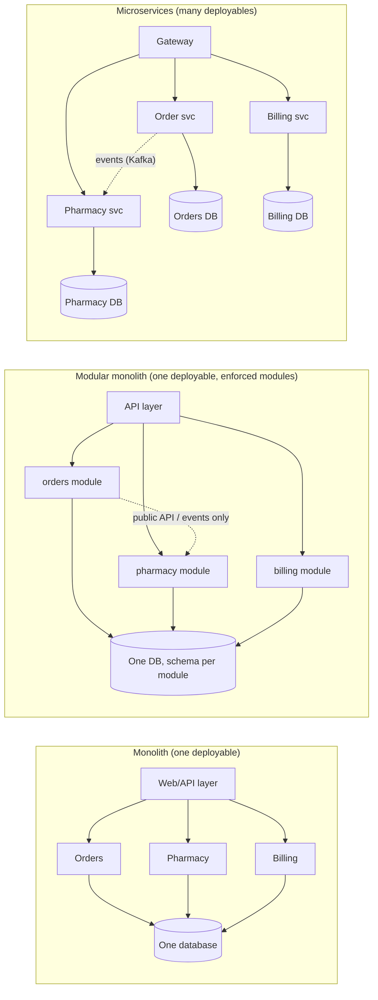
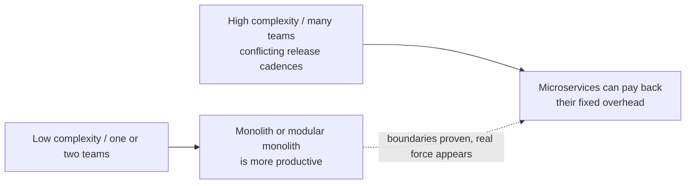
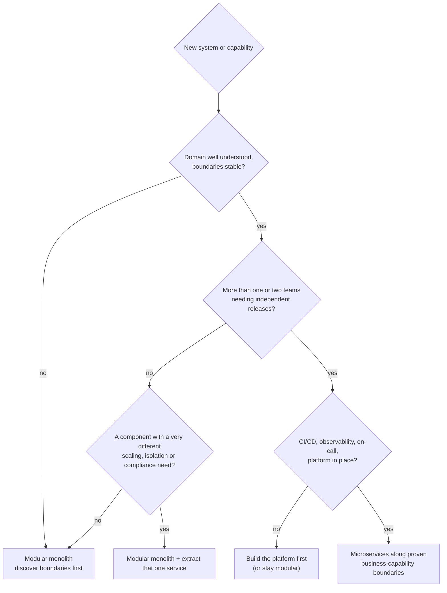

# Monolith vs Microservices; When Not to Use Microservices

!!! abstract "TL;DR"
    - **Microservices** are "a suite of small services, each running in its own process and communicating with lightweight mechanisms", built around business capabilities and **independently deployable** (Lewis & Fowler, 2014). Independent deployability is the defining property, not size.
    - A **monolith** is one deployable unit. That is a deployment choice, not a quality problem. The problem is a **big ball of mud**: no internal boundaries.
    - Microservices buy **team autonomy, independent deployment and scaling, fault isolation and technology freedom**. They cost **network calls, eventual consistency, distributed debugging, operational overhead and harder refactoring across boundaries**. Fowler calls this the **microservice premium**.
    - The middle path is the **modular monolith**: one deployable, strictly enforced module boundaries (Shopify, Spring Modulith). It is the default recommendation for most new systems; extract services when a boundary is proven and a real force (team scale, scaling profile, isolation, compliance) justifies it.
    - **When not to use microservices:** small team, unclear domain, no automation/observability, need for strong consistency across the whole model, or when the services would all deploy together anyway (a **distributed monolith**: all the costs, none of the benefits).

## Why it matters

"Should this be microservices?" is the architecture question behind nearly every system design round, and a Lead is expected to answer it with trade-offs instead of fashion. The industry swung hard towards microservices after 2014, and then visibly partly back:

- **Segment (2018)** collapsed about 140 destination microservices into one service (Centrifuge plus a single destinations service) after the operational load of many near-identical services outgrew a small team.
- **Amazon Prime Video (2023)** moved an audio/video quality monitoring tool from a distributed serverless design (Step Functions + Lambda + S3 for intermediate frames) into a single process and reported a cost reduction of over 90%.
- **Shopify** chose a **modular monolith** instead of microservices for its core Rails application, enforcing component boundaries inside one codebase.

None of these say "microservices are bad". They say the architecture must match the forces acting on the system: team size, domain stability, scaling profile, data consistency, and operational maturity.


*Notice what changes from left to right: the boundaries are the same idea throughout. What changes is how strongly they are enforced (convention → build-time checks → network and separate databases) and what you pay for that enforcement.*

## Core concepts

### What a microservice actually is

Lewis and Fowler's 2014 article lists nine common characteristics:

| Characteristic | What it means in practice |
|---|---|
| Componentization via services | Components are out-of-process and **independently replaceable and deployable** |
| Organized around business capabilities | "Pharmacy", "Claims", not "UI layer", "DB layer" |
| Products not projects | The team that builds it runs it ("you build it, you run it") |
| Smart endpoints, dumb pipes | Logic in services; transport (HTTP, Kafka) stays simple, no ESB orchestration |
| Decentralized governance | Teams choose tools within guardrails |
| Decentralized data management | **Each service owns its data**; no shared database |
| Infrastructure automation | CI/CD, automated provisioning are mandatory, not optional |
| Design for failure | Every remote call can fail or be slow |
| Evolutionary design | Services can be replaced or retired independently |

The test interviewers care about: **can this service be changed and deployed without coordinating a release with other teams?** If not, it is not really a microservice, whatever its size.

### What a monolith is, and is not

A monolith is a **single deployable unit**: one build, one process type, usually one database. That gives you:

- In-process calls (nanoseconds, no partial failure, no serialization).
- **ACID transactions** across the whole model.
- One codebase to search, refactor (IDE-wide rename), test and debug with one stack trace.
- One pipeline and one thing to monitor.

The failure mode is not "monolith", it is the **big ball of mud**: no module boundaries, everything calls everything, one shared schema that every feature writes to. That makes changes risky and slow, and it is the same problem a badly cut microservice system has, only with network calls added.

### The microservice premium

Fowler's "Microservice Premium" (2015) argues there is a fixed cost to running microservices: deployment automation, monitoring, tracing, service discovery, resilience, contract management and eventual consistency. For a simple system that cost dominates and productivity is lower than with a monolith. Only past some level of complexity (domain size, number of teams) does the monolith's productivity fall below the microservices line.


*Notice the arrow only goes one way, and only when a force appears. Microservices are a response to a scaling problem in the organisation or the system, not a starting point.*

### The costs, concretely

| Cost | What actually hurts |
|---|---|
| Network | Latency per hop, timeouts, retries, partial failure, serialization CPU |
| Data | No cross-service ACID transaction: sagas, outbox, idempotency, eventual consistency |
| Queries | Joins across services become API composition or CQRS read models |
| Operations | N pipelines, N dashboards, N on-call surfaces, version skew, secrets per service |
| Debugging | Distributed tracing and correlation IDs are mandatory |
| Refactoring | Moving logic across a service boundary is a cross-team API change, not an IDE refactor |
| Testing | Contract tests, environment management, consumer-driven contracts |
| Security | More network surface: service-to-service auth, mTLS, token propagation |

Fowler's "Microservice Prerequisites" (2014) names the minimum before you start: **rapid provisioning**, **basic monitoring** and **rapid application deployment**, plus a DevOps culture. Without them the premium is paid with outages.

### The distributed monolith

The worst outcome: services that are split on the network but still coupled.

Symptoms:

- Releases must be coordinated ("deploy orders, then pharmacy, then billing, in that order").
- Services share a database or read each other's tables.
- A synchronous call chain A → B → C → D on the request path, so availability is the product of all four.
- A shared "common" library containing domain models that every service must upgrade together.
- One change touches five repositories.

It has every cost of microservices and none of the benefits. The usual cause is splitting by **technical layer** or by **entity** ("CustomerService", "AddressService") instead of by business capability, or splitting before the domain was understood.

### The modular monolith

One deployable with **strictly enforced internal module boundaries**:

- Each module has a public API (interfaces, events); internals are package-private or checked by tooling.
- No module reaches into another's tables; ideally schema-per-module in one database.
- Modules talk through in-process calls or in-process events, so later extraction to Kafka is mechanical.
- Boundaries are checked in the build: **Spring Modulith** (`ApplicationModules.of(App.class).verify()` rejects cycles and access to other modules' internal packages), **ArchUnit**, Java modules (JPMS), or Shopify's **Packwerk** for Ruby.

It keeps the monolith's simplicity (one deploy, one transaction, easy refactoring) while building the boundaries microservices need. If a module later needs independent scaling or a separate team, it is already shaped for extraction (see the next subtopic, decomposition strategies and the strangler fig).

### Conway's law and team topology

"Organizations which design systems are constrained to produce designs which are copies of the communication structures of these organizations" (Mel Conway, 1968). Practical consequences:

- Microservices work when each service is owned by **one team** that can deploy it alone. Three services shared by three teams recreate the coordination problem.
- The **inverse Conway manoeuvre**: shape teams around the architecture you want.
- A useful rule of thumb: the number of independently deployable units should be in proportion to the number of teams, not the number of entities.

### Forces that justify extraction

Extract a service when at least one of these is real and measurable, not hypothetical:

1. **Team autonomy:** several teams blocked on one release train.
2. **Different scaling profile:** one capability needs 50 instances, the rest need 3 (e.g. a search or pricing engine).
3. **Fault isolation:** a risky or resource-hungry component must not take down the core (PDF rendering, ML inference).
4. **Different technology needs:** a Python ML model, a Go edge proxy.
5. **Compliance / security boundary:** PHI or card data (PCI DSS scope reduction) isolated in a smaller, audited service.
6. **Different change cadence:** a stable core vs a fast-moving experimentation area.

And **do not** extract because "it's modern", "the codebase is big" (fix the modules), or to "scale" a system whose bottleneck is the database.

### Decision guide


*Notice how many paths end at the modular monolith. Microservices are the answer only when the domain is understood, multiple teams need independence, and the platform exists.*

## In practice: code & configuration

### Enforcing module boundaries in one Spring Boot app (Spring Modulith)

Packages directly under the main application package are modules; sub-packages are internal by default.

```
com.rx
 ├─ RxApplication.java
 ├─ orders/            ← module "orders" (public API: types in this package)
 │   ├─ OrderService.java
 │   ├─ OrderPlaced.java          (event, public)
 │   └─ internal/OrderRepository.java   (hidden from other modules)
 └─ pharmacy/          ← module "pharmacy"
     ├─ PharmacyService.java
     └─ internal/...
```

=== "❌ Common mistake"
    ```java
    // pharmacy reaches into orders' internals and shares its transaction.
    // Works today, makes extraction impossible tomorrow.
    @Service
    class PharmacyService {
      private final com.rx.orders.internal.OrderRepository orders; // internal type!

      @Transactional
      void onRefill(String orderId) {
        var order = orders.findById(orderId).orElseThrow();
        order.setStatus("SENT_TO_PHARMACY");   // writes another module's data
      }
    }
    ```

=== "✅ Correct approach"
    ```java
    // orders publishes an event as part of its public API
    @Service
    public class OrderService {
      private final ApplicationEventPublisher events;
      @Transactional
      public void placeRefill(String orderId) {
        // ... save order in orders' own tables
        events.publishEvent(new OrderPlaced(orderId)); // public event type
      }
    }

    // pharmacy reacts asynchronously, after commit, in its own transaction.
    // Spring Modulith's event publication registry stores the event,
    // so it is retried if the listener fails. Later this can become a Kafka topic.
    @Service
    class PharmacyService {
      @ApplicationModuleListener
      void on(OrderPlaced event) {
        // update pharmacy's own data only
      }
    }

    // Test that fails the build on cycles or access to another module's internals
    class ModularityTests {
      @Test
      void verifiesModuleStructure() {
        ApplicationModules.of(RxApplication.class).verify();
      }
    }
    ```

### The same boundary as microservices: what you add

Moving `pharmacy` into its own service means adding, at minimum:

```yaml
# pharmacy-service application.yml (sketch of the new obligations)
spring:
  kafka:
    consumer:
      group-id: pharmacy-service
      enable-auto-commit: false          # idempotent processing, manual ack
  security:
    oauth2:
      resourceserver:
        jwt:
          issuer-uri: https://sso.example.com
          audiences: pharmacy-service    # service-to-service auth
management:
  endpoints.web.exposure.include: health,prometheus
  tracing.sampling.probability: 0.1      # distributed tracing
resilience4j:
  circuitbreaker.instances.orders-api:
    failure-rate-threshold: 50           # remote calls can fail
```

Plus: its own database and migrations, its own pipeline, dashboards, alerts and on-call, contract tests with `orders`, an outbox or equivalent for reliable events, idempotent consumers, and a versioning policy for its API. If none of the forces above applies, that list is pure cost.

## Real-world usage

- **Amazon and Netflix** are the canonical microservices successes, but both had thousands of engineers and built heavy internal platforms (deployment, discovery, resilience, observability) to make it work. Netflix's move was driven by availability and scale after a 2008 database corruption incident and the move to AWS.
- **Segment (2018):** started with one service per integration destination. With ~140 nearly identical services, shared-library upgrades meant touching every service, queues per destination behaved badly under one destination's outage, and the small team drowned in operations. They merged destinations into one service (and built Centrifuge for delivery), cutting test time and operational load dramatically.
- **Prime Video (2023):** a monitoring tool built as distributed serverless components hit cost and scale limits from orchestration transitions and passing video frames through S3. Running the components in one process (scaled by cloning the service with different detector subsets) cut infrastructure cost by over 90%. Note this was one tool, not Prime Video as a whole.
- **Shopify:** kept one Rails codebase and invested in componentization with enforced boundaries (Packwerk), getting modularity without distributed-systems cost.
- **Healthcare and banking:** compliance boundaries (PHI under HIPAA, card data under PCI DSS) are a legitimate reason to isolate a capability. Give it its own service, data store, access controls and audit trail. That also shrinks the scope auditors must examine. Strong consistency needs (ledgers, payments) push towards keeping the core transactional model together and integrating via events at the edges.

## Trade-offs & production gotchas

| Option | Pros | Cons | Use when |
|---|---|---|---|
| Monolith (unstructured) | Fastest start, simple ops, ACID everywhere | Degrades into big ball of mud, one release train, scale as a whole | Prototypes, very small teams, short-lived systems |
| Modular monolith | One deploy and transaction, easy refactoring, boundaries enforced, extraction-ready | Single scaling unit, one tech stack, shared failure domain, needs discipline and tooling | Default for most new products and for 1–3 teams |
| Microservices | Team autonomy, independent deploy and scale, fault isolation, tech freedom | Network and consistency complexity, heavy platform and ops cost, harder cross-boundary refactoring | Many teams, stable domain boundaries, strong platform, distinct scaling/compliance needs |
| Distributed monolith | None | All costs of both | Never: detect and fix by merging or re-cutting boundaries |

!!! warning "Gotcha: shared database"
    Two services writing the same tables are one service with two deployables. You can't change the schema without coordinating both, and you get no fault isolation. Each service owns its data; others go through its API or its events.

!!! warning "Gotcha: synchronous call chains"
    If a request needs A → B → C → D synchronously, and each is 99.9% available, the chain is about 99.6% available and latency adds up. Prefer asynchronous events, data replication into the consumer (read models), or merging services that always change together.

!!! warning "Gotcha: nano-services"
    Splitting by entity or function ("one service per table") multiplies network hops and coordination. Size services by business capability and team ownership, not lines of code.

!!! tip "Gotcha in reverse: the monolith is not the bottleneck"
    Many "we need microservices to scale" problems are a database or a hot query. Scaling a stateless monolith horizontally behind a load balancer is easy. Measure first.

!!! question "Interview angle"
    The strongest answer is conditional: "It depends on these forces; for this case I'd start with a modular monolith and extract X because of Y." Name the force, name the cost, name the evidence you'd look for.

## How this connects to my experience

Not a ★ subtopic, but the resume touches it directly in two places. Position it as hands-on experience on both sides of the trade-off.

- **Where I used it:**
    - **Johnson Controls, Metasys:** "Contributed to the migration of a legacy monolithic application to microservices" and "Built user management microservices". This is first-hand experience of why a monolith was split and what the split cost (auth across services, data ownership). *[confirm: what drove the migration (team scale, deployment speed, a specific scaling or reliability problem), and what you personally owned beyond user management]*
    - **Publicis Sapient, OptumRx Meteor:** "Designed and developed microservices using Java, Spring Boot, Kafka, MongoDB, Redis, and GraphQL", the GraphQL Consumer Service integrating 5 upstream systems, and "established a micro-frontend architecture". Micro-frontends are the same trade-off on the frontend: independent deployment per team versus shared-shell complexity. *[confirm: how many teams owned the services and micro-frontends, and whether each could deploy independently]*
    - **Deloitte, ConvergeHealth:** microservices on Lambda, ECS and EKS. Lambda is the "very small service" end of the spectrum, which is exactly where the Prime Video lesson applies. *[confirm: rough number of services and whether any were consolidated]*
- **Talking points:**
    - "On Metasys I saw the monolith-to-microservices move from the inside. The hard parts weren't the code; they were authentication across services, which I owned with JWT and SSO, and deciding which service owns which data." *[confirm]*
    - "At OptumRx the GraphQL Consumer Service is an integration layer over 5 upstream systems. That's a place where independent deployment pays off, because the upstreams change on their own schedules, but it also showed me the cost: every upstream needs its own timeouts, auth and error mapping." *[confirm]*
    - "If I started a new product today with one or two teams, I'd build a modular monolith with Spring Modulith and enforced boundaries, and extract a service only when a force like team independence or a compliance boundary for PHI justifies it."
    - As a lead: "I ask for the evidence before a split: which team is blocked, which component scales differently, which data needs isolating. 'The codebase is big' is a modularity problem, not a deployment problem."
- **Likely follow-up chain:** "Monolith or microservices for this system?" → answer with the forces and a modular-monolith default → "Your Metasys migration: why did you split, and what went wrong?" *[confirm]* → "How do you know when to extract a service?" (forces list, metrics: deployment frequency blocked, scaling profile, incident blast radius) → "How do you avoid a distributed monolith?" (business-capability boundaries, data ownership, async events, contract tests, independent deploy as the acceptance test) → bridge to decomposition and the strangler fig (next subtopic).

## Interview questions

### Fundamentals

??? question "Q1. What is a microservice architecture?"
    **Answer:** An application built as a set of small services. Each one runs in its own process, owns its data and is organised around one business capability. Services talk over lightweight mechanisms (HTTP, messaging), and the owning team can deploy each one independently.

    **Interviewer listens for:** independent deployability, business capability, data ownership.

    **Common wrong answer:** "Small services, each under N lines of code." Size isn't the point.

??? question "Q2. What are the advantages of a monolith?"
    **Answer:** In-process calls (fast, no partial failure), ACID transactions across the model, simple local development, one pipeline and deployment, easy refactoring and debugging with one stack trace, lower operational cost.

    **Interviewer listens for:** that a monolith is a legitimate choice, not a legacy smell.

    **Common wrong answer:** "Monoliths don't scale." A stateless monolith scales horizontally behind a load balancer.

??? question "Q3. What are the main costs of microservices?"
    **Answer:** Network latency and partial failure, no cross-service transactions (eventual consistency, sagas), distributed queries, operational overhead (pipelines, monitoring, on-call per service), distributed debugging (tracing), contract and version management, larger security surface.

    **Interviewer listens for:** data consistency and operational overhead named explicitly.

    **Common wrong answer:** listing only benefits.

??? question "Q4. What is a modular monolith?"
    **Answer:** A single deployable application with strictly enforced internal module boundaries: each module has a public API, private internals and its own data, checked at build time (Spring Modulith, ArchUnit, JPMS, Packwerk). It keeps monolith simplicity while preparing clean extraction points.

    **Interviewer listens for:** "enforced", not just "packages".

    **Common wrong answer:** "A monolith with folders."

### Intermediate

??? question "Q5. What is a distributed monolith and how do you detect it?"
    **Answer:** Services that are deployed separately but still tightly coupled. Signs: coordinated releases, shared database, synchronous call chains on the request path, shared domain libraries that force lockstep upgrades, one feature touching many repos. Detect it with deployment data (how often do services release together?) and by checking data ownership.

    **Interviewer listens for:** independent deployability as the test; shared DB as a red flag.

    **Common wrong answer:** "When services are too big."

??? question "Q6. Why does each microservice need its own database?"
    **Answer:** A shared schema couples services at the data level: one team's migration can break another, you can't deploy independently, and you lose fault isolation. Own your data; expose it through APIs or events. "Own database" can mean a separate schema or tables with enforced access, not necessarily a separate server.

    **Interviewer listens for:** schema coupling and independent deployment.

    **Common wrong answer:** "For performance."

??? question "Q7. What is Conway's law and why does it matter here?"
    **Answer:** Systems mirror the communication structure of the organisation that builds them. Microservices only deliver autonomy if service boundaries align with team boundaries; otherwise teams coordinate releases anyway. Teams can be shaped deliberately to get the architecture you want (inverse Conway manoeuvre).

    **Interviewer listens for:** team ownership per service.

    **Common wrong answer:** "Conway's law is about code style." It links system structure to how teams communicate.

??? question "Q8. What prerequisites should be in place before adopting microservices?"
    **Answer:** Fowler's list: rapid provisioning, basic monitoring, rapid automated deployment, and a DevOps culture. In practice also: centralised logging, distributed tracing, service-to-service auth, a contract-testing approach, and on-call ownership per team.

    **Interviewer listens for:** platform and operational maturity before the split.

    **Common wrong answer:** "Kubernetes is the only prerequisite." Without CI/CD, observability and team ownership it fails.

??? question "Q9. How should services be sized?"
    **Answer:** By business capability or bounded context, owned by one team, changeable and deployable independently, with high cohesion inside and low coupling outside. Things that always change together belong together.

    **Interviewer listens for:** cohesion and team ownership, not lines of code.

    **Common wrong answer:** "One service per entity/table."

### Senior

??? question "Q10. When would you not use microservices?"
    **Answer:** Small team (one or two), new or unclear domain, early product looking for fit, no CI/CD or observability, strongly consistent core model (ledger), latency-critical paths with many hops, or when all parts would release together anyway. Start with a modular monolith and extract when a force appears.

    **Interviewer listens for:** concrete forces and the modular-monolith default.

    **Common wrong answer:** "Microservices are always the modern choice."

??? question "Q11. Segment and Prime Video moved back towards monoliths. What's the lesson?"
    **Answer:** Architecture must fit the forces. Segment had many near-identical services and a small team, so the operational cost outweighed the isolation benefit. Prime Video's tool moved large data (video frames) between distributed components through S3 and an orchestrator, so network and orchestration cost dominated; one process removed it. Neither is "microservices failed"; they're "wrong granularity for this workload".

    **Interviewer listens for:** nuance, and that Prime Video was one component.

    **Common wrong answer:** "Even Amazon abandoned microservices."

??? question "Q12. How do you decide to extract a service from a modular monolith?"
    **Answer:** Evidence of a force: a team blocked by the shared release train, a component with a very different scaling or resource profile, a need for fault isolation, a compliance boundary, a different technology. Check the module is already decoupled (public API, own data, events), then extract with the strangler pattern behind the same interface.

    **Interviewer listens for:** evidence-based extraction and a migration path.

    **Common wrong answer:** "Extract services by layer (UI, business, data)." That creates chatty, coupled services.

??? question "Q13. How does data consistency change when you split a monolith?"
    **Answer:** You lose ACID across the split. Cross-service workflows become sagas with compensating actions; reliable event publishing needs an outbox; consumers must be idempotent; reads across services need API composition or replicated read models (CQRS). Business stakeholders must accept eventual consistency where it applies.

    **Interviewer listens for:** saga, outbox, idempotency, and talking to the business about consistency.

    **Common wrong answer:** "Use distributed transactions (2PC) across services."

??? question "Q14. What are micro-frontends and when are they worth it?"
    **Answer:** The same idea on the frontend: independently built and deployed UI parts owned by different teams, composed in a shell (module federation, iframes, web components, server composition). Worth it with several teams working on one large UI needing independent releases; costs include duplicated dependencies, consistent UX and shared state across parts.

    **Interviewer listens for:** team-driven justification and the costs.

    **Common wrong answer:** "Use micro-frontends for any app with several pages."

### Scenario-based

??? question "Q15. A startup with 6 engineers wants microservices 'to scale later'. What do you advise?"
    **Answer:** A modular monolith with enforced boundaries (Spring Modulith), one database with schema-per-module, async in-process events between modules, good CI/CD and observability. It scales horizontally for a long time. Revisit when teams grow or a component needs separate scaling; the boundaries make extraction cheap.

    **Interviewer listens for:** a pragmatic recommendation plus a path to change.

    **Common wrong answer:** "Start with microservices so you do not have to migrate later."

??? question "Q16. Your 12 services must always be deployed together in a specific order. What's wrong and how do you fix it?"
    **Answer:** It's a distributed monolith. Find the coupling: shared DB, shared domain library, breaking API changes without versioning, synchronous chains. Fix by backward-compatible API changes (expand/contract), consumer-driven contract tests, owning data per service, replacing sync chains with events, and merging services that always change together.

    **Interviewer listens for:** diagnosis before remedy, and willingness to merge services.

    **Common wrong answer:** "Write a deployment script that enforces the order." That automates the coupling instead of removing it.

??? question "Q17. In a healthcare platform, which part would you split out first and why?"
    **Answer:** A capability with a real force behind it. Examples: the component handling PHI-heavy records, which needs strict access control and audit (a compliance boundary); an integration layer whose upstreams change on their own schedules; or a high-traffic read path with a different scaling profile. Justify with the force, and keep strongly consistent workflows together.

    **Interviewer listens for:** force-based reasoning tied to the domain.

    **Common wrong answer:** "Split the biggest module first." Size alone is not a reason.

??? question "Q18. The team says the monolith is slow and wants microservices. How do you respond?"
    **Answer:** Measure first. Most slowness is a database query, missing index, N+1, or a hot lock, which a split doesn't fix and can worsen with network hops. If it's a release-speed problem, improve modularity, tests and pipeline. Only if a specific component's scaling or team independence is the issue, extract that one.

    **Interviewer listens for:** data before decisions.

    **Common wrong answer:** "Yes, microservices will make it faster." Network hops usually make latency worse.

## Cheat sheet

| Concept | Remember |
|---|---|
| Definition | Small services, own process, lightweight comms, business capability, **independently deployable** (Lewis & Fowler, 2014) |
| Defining test | Can a team change and deploy it alone? |
| Monolith | One deployable; legitimate choice. The enemy is the big ball of mud |
| Modular monolith | One deployable + enforced boundaries (Spring Modulith, ArchUnit, Packwerk). Default starting point |
| Microservice premium | Fixed cost of distribution; pays off only past a complexity threshold (Fowler, 2015) |
| Prerequisites | Rapid provisioning, monitoring, rapid deployment, DevOps culture (Fowler, 2014) |
| Monolith first | Discover boundaries in a monolith, then extract (Fowler, 2015) |
| Distributed monolith | Coordinated releases, shared DB, sync chains, shared domain libs |
| Data | Own your data. No shared DB. Sagas + outbox + idempotency across services |
| Sizing | Business capability / bounded context, one team, things that change together stay together |
| Conway's law | Architecture mirrors team communication. Align services with teams |
| Extract when | Team autonomy, scaling profile, fault isolation, tech need, compliance boundary, change cadence |
| Don't extract for | Fashion, "big codebase", a DB bottleneck |
| Case studies | Segment 2018 (~140 → 1), Prime Video 2023 monitoring tool (>90% cost cut), Shopify modular monolith |

## Sources

1. [Microservices: a definition of this new architectural term (Lewis & Fowler, 2014)](https://martinfowler.com/articles/microservices.html): definition and the nine characteristics.
2. [MonolithFirst (Fowler, 2015)](https://martinfowler.com/bliki/MonolithFirst.html): start with a monolith, discover boundaries first.
3. [Microservice Premium (Fowler, 2015)](https://martinfowler.com/bliki/MicroservicePremium.html): fixed cost of microservices and the complexity threshold.
4. [Microservice Prerequisites (Fowler, 2014)](https://martinfowler.com/bliki/MicroservicePrerequisites.html): rapid provisioning, monitoring, deployment, DevOps culture.
5. [Pattern: Microservice Architecture (Chris Richardson, microservices.io)](https://microservices.io/patterns/microservices.html): benefits, drawbacks, when to use.
6. [Goodbye Microservices (Segment / Twilio engineering, 2018)](https://www.twilio.com/en-us/blog/developers/best-practices/goodbye-microservices): consolidating ~140 services into one.
7. [Scaling up the Prime Video audio/video monitoring service and reducing costs by 90% (Prime Video Tech, 2023; archived copy)](https://www.wudsn.com/productions/www/site/news/2023/2023-05-08-microservices-01.pdf): moving a distributed monitoring tool into one process.
8. [Deconstructing the Monolith (Shopify Engineering)](https://shopify.engineering/deconstructing-monolith-designing-software-maximizes-developer-productivity): modular monolith and componentization.
9. [Completing the Netflix Cloud Migration (Netflix, 2016)](https://about.netflix.com/en/news/completing-the-netflix-cloud-migration): the 2008 database corruption that triggered the move to AWS and microservices.
10. [Spring Modulith reference: Verifying application module structure](https://docs.spring.io/spring-modulith/reference/verification.html): `ApplicationModules.verify()` rules.
11. [Conway's Law (Mel Conway)](https://www.melconway.com/Home/Conways_Law.html): the original statement.
12. Sam Newman, *Building Microservices*, 2nd ed. (O'Reilly, 2021) and *Monolith to Microservices* (O'Reilly, 2019): independent deployability, sizing, migration patterns.
