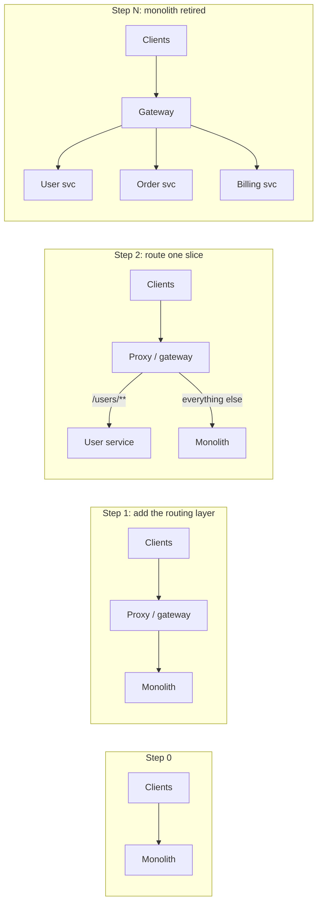
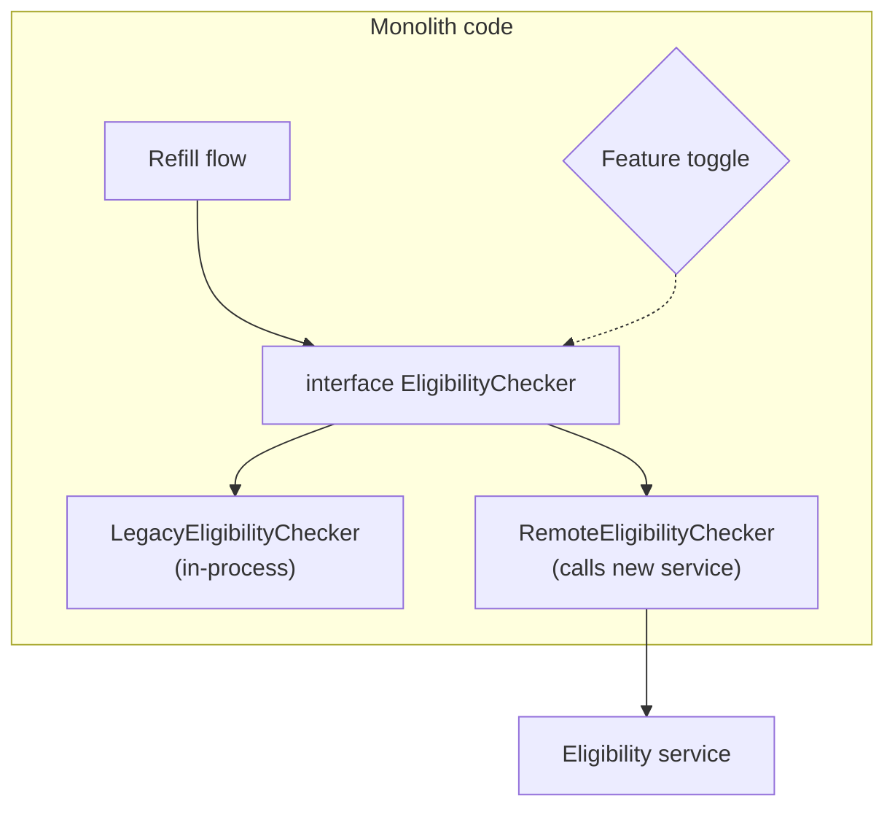

# Decomposition Strategies & Monolith Migration (Strangler Fig)

!!! abstract "TL;DR"
    - Cut services along **business capabilities** or **DDD bounded contexts**, never along technical layers or single entities. Test a boundary by asking: can one team change it and deploy it alone, and does it own its data?
    - Migrate a monolith **incrementally** with the **strangler fig** pattern: put a routing layer (proxy or gateway) in front, build new functionality beside the old, move traffic slice by slice, then retire the old code. Never a big-bang rewrite.
    - Inside the code, use **branch by abstraction** (an interface with old and new implementations behind a toggle) and **parallel run** (call both, compare, serve the old result) to reduce risk.
    - **Data is the hard part.** Each extracted service needs to own its data: split the schema first or together with the code, keep the two in sync temporarily (change data capture, events), and accept a period of **transitional architecture**.
    - Start with a seam that has **high value and low coupling** (often a leaf capability, or something that changes often). Measure progress by traffic moved and code deleted, not services created.

## Why it matters

Most microservice systems are not built from scratch. They are carved out of a monolith that still runs the business. The two classic ways to fail are:

1. **The big-bang rewrite:** freeze features for a year, rebuild everything, switch over on one day. It ships late, misses behaviour nobody documented, and the business keeps changing the target while you build.
2. **The arbitrary split:** create "UserService", "OrderService", "AddressService" from database tables, keep the shared database, and end up with a **distributed monolith** (see [Monolith vs microservices](01-monolith-vs-microservices-when-not-to-use-microservices.md)).

Decomposition is about finding boundaries that minimise coupling, and migration is about changing a running system safely, one small, reversible step at a time. Martin Fowler named the incremental approach after the strangler fig, a vine that grows around a host tree until the tree is no longer needed.


*Notice that at every step the system is running and releasable, and each step can be reversed by changing a route. The proxy is the "transitional architecture" that makes the migration safe.*

## Core concepts

### Finding boundaries

| Strategy | Idea | Good for | Watch out |
|---|---|---|---|
| **Business capability** | What the business does: "Prescription fulfilment", "Claims", "Member enrolment" | Stable boundaries, align with teams | Capabilities can be too large; split further by subdomain |
| **Subdomain / bounded context (DDD)** | Areas where a model and its language are consistent ("Order" means different things in Sales vs Fulfilment) | Clean data ownership, low coupling | Needs domain knowledge and event storming with experts |
| **Volatility** | Separate what changes often from what is stable | Faster delivery where change happens | Can produce small services that still share data |
| **Scaling / isolation needs** | Isolate a component with distinct load, risk or compliance | Search, PDF generation, PHI stores | Only one or two services usually justify this |
| **Team ownership (Conway)** | One team, one service area | Real autonomy | Reorganisations move boundaries |
| ❌ **Technical layer** | "UI service", "DB service" | Nothing | Every feature crosses every service |
| ❌ **Entity per service** | "Customer service", "Address service" | Nothing | Chatty calls, distributed transactions everywhere |

A useful set of checks for a candidate boundary:

- **Cohesion:** things that change together are inside.
- **Data ownership:** it can own its tables/collections; nobody else writes them.
- **Low chattiness:** most requests are handled without synchronous calls to other services.
- **Independent deploy:** a typical change ships without coordinating with another team.
- **Language:** the domain terms are consistent inside (a bounded context).

**Event storming** (Alberto Brandolini) is the common workshop technique: map domain events on a timeline with domain experts, then look for clusters of events and commands that share a model. Those clusters suggest bounded contexts.

### Migration patterns (Sam Newman, *Monolith to Microservices*)

| Pattern | What it does | When to use |
|---|---|---|
| **Strangler fig** | Intercept calls at the edge (proxy/gateway) and route a slice to the new service | Functionality reachable through an external API or UI path |
| **Branch by abstraction** | Inside the monolith, put an interface in front of a component, add a new implementation (which calls the new service), switch with a toggle, delete the old | Functionality called from deep inside the monolith, not from the edge |
| **Parallel run** | Call old and new, compare results, serve the old one until the new one is trusted | High-risk logic: pricing, eligibility, claims calculations |
| **Decorating collaborator** | Proxy calls the monolith, then triggers new behaviour in a new service from the response | Add new features without touching the monolith |
| **Change data capture (CDC)** | Stream the monolith's database changes (Debezium) to new services | When you can't change the monolith's code to emit events |
| **UI composition / micro-frontends** | Replace pages or widgets one at a time | Front-end-led migrations |


*Branch by abstraction: the caller never changes. A toggle decides which implementation runs, so you can switch per environment, per percentage, and back again instantly.*

### Migrating the data

Code is easy to move; data is not. Options, roughly in order of risk:

1. **Monolith keeps the data, service calls the monolith's API**: quick first step, but the service is not independent yet.
2. **Split the schema inside the same database first** (separate schema, no cross-schema joins or FKs). Fix the code to stop joining across the boundary. Then move the schema to its own database.
3. **New service owns the data; the monolith reads through the service API** (or a replicated read model).
4. **Synchronise during transition**: CDC (Debezium) from the old tables, or events from the new service back to the monolith. Avoid dual writes from application code (two writes, no transaction, they drift).

Rules of thumb:

- Pick **one source of truth per data item at any time**, and make the switch explicit.
- Foreign keys across the boundary become IDs plus API calls or replicated data.
- Reports that joined everything need a reporting store fed by events/CDC.

### Choosing the first service

Good first candidates: **valuable** (a pain point or a frequently changed area), **loosely coupled** (few inbound calls, little shared data), and **small enough** to finish in weeks. A leaf capability (notifications, document generation) is low risk but low value; a core capability is high value but high risk. Many teams pick something in between and treat the first extraction as building the platform (pipeline, observability, auth between services).

### Anti-patterns

- **Big-bang rewrite.** Late, incomplete, risky cut-over.
- **Shared database "for now"** that becomes permanent.
- **Extracting the code but not the data.**
- **Creating services faster than the platform can support them.**
- **No deletion.** If the old code path isn't deleted, you now maintain both.

## In practice: code & configuration

### Strangler routing with Spring Cloud Gateway

```yaml
# Gateway in front of the monolith. New service takes one path; everything else falls through.
spring:
  cloud:
    gateway:
      server:
        webflux:
          routes:
            - id: member-profile-new
              uri: lb://member-profile-service      # new service (via discovery)
              predicates:
                - Path=/api/members/{id}/profile
                - Weight=profile, 10                 # start with 10% of traffic
            - id: member-profile-legacy
              uri: http://legacy-monolith:8080
              predicates:
                - Path=/api/members/{id}/profile
                - Weight=profile, 90
            - id: everything-else
              uri: http://legacy-monolith:8080
              predicates:
                - Path=/**
```

!!! note
    Property prefixes changed across Spring Cloud Gateway versions (`spring.cloud.gateway.routes` in older releases, `spring.cloud.gateway.server.webflux.routes` from the 2025 release train). Check the version you're on.

### Branch by abstraction and parallel run

=== "❌ Common mistake"
    ```java
    // Big switch inside business code, no way to compare or roll back quickly.
    public Eligibility check(Member m, Drug d) {
      if (useNewService) {
        return eligibilityClient.check(m.id(), d.ndc());   // trust it blindly from day one
      }
      // ... 400 lines of legacy logic
    }
    ```

=== "✅ Correct approach"
    ```java
    public interface EligibilityChecker {
      Eligibility check(Member m, Drug d);
    }

    @Component
    class ParallelRunEligibilityChecker implements EligibilityChecker {
      private final LegacyEligibilityChecker legacy;
      private final RemoteEligibilityChecker remote;
      private final MeterRegistry metrics;
      private final Executor shadowExecutor;           // bounded, so the shadow call can't hurt latency

      @Override
      public Eligibility check(Member m, Drug d) {
        Eligibility result = legacy.check(m, d);       // still the source of truth
        shadowExecutor.execute(() -> {
          try {
            Eligibility candidate = remote.check(m, d);
            boolean same = result.equals(candidate);
            metrics.counter("eligibility.parallel_run", "match", String.valueOf(same)).increment();
            if (!same) log.warn("eligibility mismatch rx={} reason={}", d.ndc(), diff(result, candidate)); // no PHI
          } catch (Exception e) {
            metrics.counter("eligibility.parallel_run", "match", "error").increment();
          }
        });
        return result;
      }
    }
    // When the mismatch rate is ~0 for long enough, switch the bean to RemoteEligibilityChecker,
    // then delete the legacy code.
    ```

### Change data capture to feed the new service

```json
{
  "name": "monolith-members-cdc",
  "config": {
    "connector.class": "io.debezium.connector.postgresql.PostgresConnector",
    "database.hostname": "legacy-db",
    "database.dbname": "legacy",
    "table.include.list": "public.member,public.member_address",
    "topic.prefix": "legacy",
    "plugin.name": "pgoutput"
  }
}
```

The new service consumes `legacy.public.member` events to build its own copy while the monolith is still the writer. When the service becomes the writer, reverse the direction or retire the old table.

## Real-world usage

- **Strangler migrations** are the norm at large companies replacing legacy platforms (retail, banks, airlines); the pattern is popularised by Fowler and ThoughtWorks' "Patterns of Legacy Displacement".
- **Parallel run** is how teams replace high-risk calculation engines (pricing, risk, eligibility). GitHub's open-source *Scientist* library formalised "run both, compare, publish mismatches".
- **CDC with Debezium** is widely used to extract data from monolith databases without changing monolith code, and to implement the outbox pattern (see [Distributed transactions](07-distributed-transactions-saga-outbox-pattern.md)).
- **Healthcare:** prescriptions, eligibility and claims logic is regulated and full of edge cases. Parallel runs and per-percentage cut-over with fast rollback are how you prove a new service is correct before members depend on it.

## Trade-offs & production gotchas

| Approach | Pros | Cons | Use when |
|---|---|---|---|
| Big-bang rewrite | Clean slate | Long freeze, high risk, behaviour lost | Almost never; tiny systems only |
| Strangler fig (edge routing) | Incremental, reversible, delivers value early | Needs a routing layer and transitional code | Functionality reachable via API/UI paths |
| Branch by abstraction | Works deep inside code, toggle-able | Requires a seam in the monolith code | Internal components |
| Parallel run | Proves correctness with real traffic | Double cost, comparison logic, side-effect care | High-risk calculations |
| CDC | No monolith code change | Couples to the legacy schema, eventual | Monolith code hard to change |

!!! warning "Gotcha: side effects in parallel runs"
    Only shadow **read-only** or side-effect-free calls. If the new path sends emails, charges cards or writes data, you double them. Stub side effects in the shadow path.

!!! warning "Gotcha: transitional architecture never removed"
    Plan the deletion step. Track "lines/paths of legacy code removed" as a migration metric, or you end up running both forever.

!!! warning "Gotcha: dual writes"
    Writing to the old DB and the new DB from application code without a transaction drifts on any failure. Use one writer plus CDC or events.

!!! question "Interview angle"
    Interviewers want an incremental plan: routing layer, first slice, how traffic moves, how data moves, how you prove correctness, how you roll back, and when old code is deleted.

## How this connects to my experience

★ **Resume claim:** Johnson Controls, Metasys: "Contributed to the migration of a legacy monolithic application to microservices" and "Built user management microservices and owned JWT-based authentication and SSO implementation end-to-end".

- **Where I used it:**
    - **Metasys:** user management is a classic first extraction: a clear capability with its own data (users, roles), needed by every other part. Owning JWT and SSO meant solving the cross-cutting problem every extraction creates: how the monolith and new services trust the same identity. *[confirm: whether the extraction used a proxy/gateway in front of the monolith, how user data moved (copied, synced, or monolith reads through the new API), and how long old and new ran side by side]*
    - **OptumRx Meteor:** "Built the ReactJS application from the ground up and established a micro-frontend architecture." Micro-frontends are the UI version of strangling: pages or features can be replaced one at a time. *[confirm whether Meteor replaced an older UI incrementally or was greenfield]*
    - **Deloitte ConvergeHealth:** "Implemented ... Liquibase migration strategies." Versioned, incremental schema change is the tool you need for splitting a schema safely. *[confirm whether any schema was split between services]*
- **Talking points:**
    - "User management was a good first service: clear boundary, its own data, and every other module needed it, so getting identity right (JWT, SSO) unblocked later extractions." *[confirm]*
    - "The hard part wasn't the code, it was the data and the trust model: which system owns the user record at each step, and how the monolith accepts tokens issued by the new service." *[confirm]*
    - "If I ran that migration again, I would put a gateway in front from day one, move traffic by percentage, and use a parallel run for anything with business rules."
- **Likely follow-up chain:** "How did you migrate the monolith?" → "How did you choose the first service?" (value, coupling, a clear capability: user management) → "How did the monolith and the new service share user data during the transition?" *[confirm]* → "How did you make sure nothing broke?" (tests, gradual traffic, monitoring, rollback) → "What would you do differently?" (gateway first, CDC instead of dual writes, delete legacy code as you go).

## Interview questions

### Fundamentals

??? question "Q1. How do you decide service boundaries?"
    **Answer:** Along business capabilities or DDD bounded contexts, validated by cohesion (things that change together stay together), data ownership, low chattiness, and one-team ownership. Event storming with domain experts helps find them.

    **Interviewer listens for:** business capability / bounded context, data ownership.

    **Common wrong answer:** "One service per table" or "one per layer".

??? question "Q2. What is the strangler fig pattern?"
    **Answer:** Incrementally replace a legacy system by putting a routing layer in front, implementing functionality slice by slice in new services, redirecting traffic for each slice, and retiring the old code once nothing calls it. Each step is small and reversible.

    **Interviewer listens for:** routing layer, incremental, reversible, retire old code.

??? question "Q3. Why avoid a big-bang rewrite?"
    **Answer:** Long feature freeze, a moving target, undocumented behaviour lost, one high-risk cut-over, and no value until the end. Incremental migration delivers value early and limits the blast radius of mistakes.

??? question "Q4. What is a bounded context?"
    **Answer:** A boundary within which a domain model and its terms have one consistent meaning. "Order" in sales and in fulfilment may be different models; each context owns its own. Bounded contexts are natural service candidates.

### Intermediate

??? question "Q5. Explain branch by abstraction."
    **Answer:** Introduce an abstraction (interface) around the component to replace, make all callers use it, add a new implementation (e.g. calling the new service), switch between implementations with a toggle, then delete the old implementation. It allows migration from deep inside the code without long-lived branches.

??? question "Q6. What is a parallel run and when do you use it?"
    **Answer:** Execute both old and new implementations for the same input, return the old result, and record mismatches. Use it for high-risk logic (pricing, eligibility, claims) to prove the new implementation with real traffic before switching. Avoid side effects in the shadow path.

??? question "Q7. How do you migrate data out of a shared monolith database?"
    **Answer:** Stop cross-boundary joins and FKs first, split into a separate schema, then a separate database. Choose one writer at a time. Keep copies in sync with CDC or events, not dual writes. Replace joins with API calls or replicated read models; move reporting to an event-fed store.

??? question "Q8. How do you choose the first service to extract?"
    **Answer:** Balance value and risk: a capability that changes often or hurts, with few inbound dependencies and little shared data, that can be done in weeks. Use it to build the platform (pipeline, observability, service auth).

### Senior

??? question "Q9. What is transitional architecture and why accept it?"
    **Answer:** Temporary components that let old and new coexist (proxies, CDC pipelines, anti-corruption layers, toggles). It costs effort and is thrown away, but it makes each step reversible and delivers value earlier. Plan its removal.

??? question "Q10. What is an anti-corruption layer?"
    **Answer:** A translation layer between the new service's model and the legacy model, so legacy concepts and quirks don't leak into the new design. Often a small adapter service or module that maps between the two.

??? question "Q11. How do you know the migration is going well?"
    **Answer:** Traffic share on new services, legacy code paths deleted, deployment frequency and lead time for the extracted areas, incident rate, and parallel-run mismatch rates. Not "number of services created".

??? question "Q12. How do you handle authentication during a migration?"
    **Answer:** Both monolith and new services must trust the same identity. Usually a central IdP issuing tokens both validate, or the gateway validating and forwarding identity. Session-based monoliths often need a bridge (gateway exchanges session for token) during transition.

### Scenario-based

??? question "Q13. You must migrate prescription eligibility rules out of a monolith used by 750K members. Plan it."
    **Answer:** Wrap the rules behind an interface (branch by abstraction). Build the new service reading replicated data via CDC. Parallel run against production traffic and track mismatches by rule. Fix differences, then switch a small percentage, monitor, ramp up, keep a fast toggle back. Delete the legacy rules after a stable period.

??? question "Q14. Two services you extracted keep needing to change together and call each other synchronously. What now?"
    **Answer:** The boundary is wrong. Merge them, or re-cut the boundary along the capability that changes together. Splitting further rarely helps; services that always change together belong together.

??? question "Q15. The new service needs data that only the monolith writes. How do you get it?"
    **Answer:** Short term: call the monolith's API (accept the coupling) or consume CDC events from its tables into a local read model. Long term: move ownership of that data into the service that writes it most, and make the monolith read through the service.

## Cheat sheet

| Concept | Remember |
|---|---|
| Boundaries | Business capability / bounded context; cohesion, data ownership, one team |
| Never | Split by layer or by entity; shared DB "for now" |
| Strangler fig | Routing layer → move slice → retire old. Reversible each step |
| Branch by abstraction | Interface + two impls + toggle, inside the code |
| Parallel run | Run both, serve old, compare; no side effects in shadow |
| Decorating collaborator | Proxy triggers new behaviour after the monolith responds |
| Data | Split schema first; one writer at a time; CDC not dual writes |
| CDC | Debezium streams DB changes to Kafka |
| ACL | Anti-corruption layer translates legacy model |
| First service | Valuable, loosely coupled, weeks not months |
| Progress | Traffic moved, legacy deleted, lead time, incidents |
| Event storming | Workshop to find bounded contexts from domain events |

## Sources

1. [Strangler Fig Application (Martin Fowler)](https://martinfowler.com/bliki/StranglerFigApplication.html): the pattern, transitional architecture, seams.
2. [Branch By Abstraction (Martin Fowler)](https://martinfowler.com/bliki/BranchByAbstraction.html): migrating internal components with an abstraction and toggle.
3. [Patterns of Legacy Displacement (Ian Cartwright, Rob Horn, James Lewis)](https://martinfowler.com/articles/patterns-legacy-displacement/): transitional architecture, event interception, legacy mimic.
4. [Decompose by business capability (microservices.io)](https://microservices.io/patterns/decomposition/decompose-by-business-capability.html) and [by subdomain](https://microservices.io/patterns/decomposition/decompose-by-subdomain.html): boundary strategies.
5. [Strangler application pattern (microservices.io)](https://microservices.io/patterns/refactoring/strangler-application.html): pattern summary.
6. [Debezium documentation](https://debezium.io/documentation/reference/stable/): change data capture connectors.
7. [GitHub Scientist](https://github.com/github/scientist): parallel-run ("experiment") library.
8. [Spring Cloud Gateway reference](https://docs.spring.io/spring-cloud-gateway/reference/index.html): routing, weight predicate.
9. Sam Newman, *Monolith to Microservices* (O'Reilly, 2019): strangler fig, branch by abstraction, parallel run, decorating collaborator, CDC, data migration patterns.
10. Eric Evans, *Domain-Driven Design* (Addison-Wesley, 2003): bounded contexts, anti-corruption layer.
