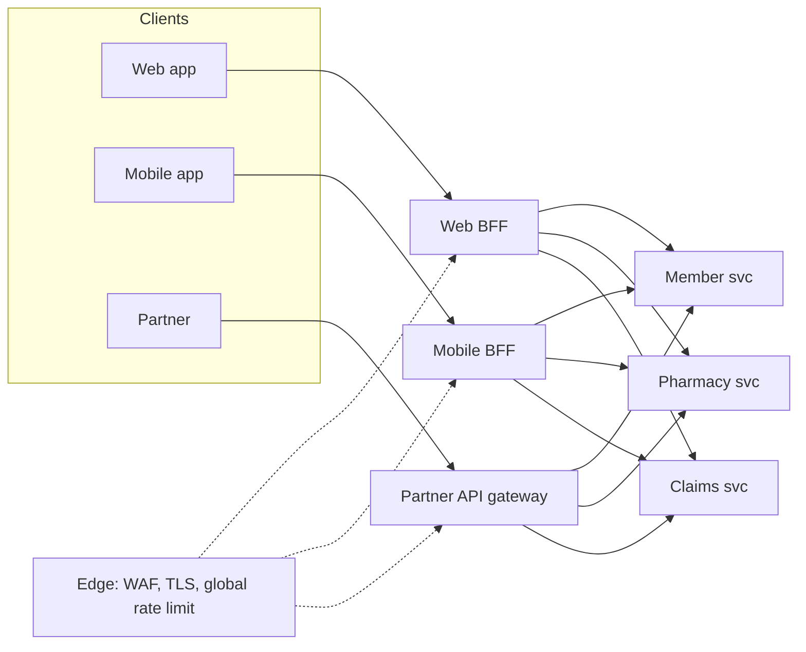
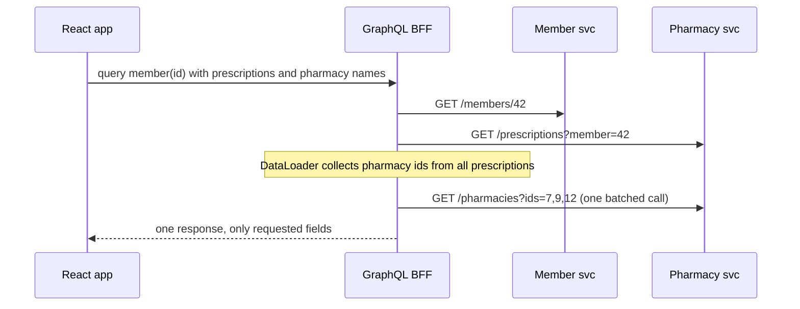

# API Gateway & BFF Pattern

!!! abstract "Key takeaways"
    - An **API gateway** is the single entry point for external clients: **routing, authentication, rate limiting, TLS termination, request/response transformation, observability**. It hides the internal service layout.
    - A **Backend-for-Frontend (BFF)** is a gateway/aggregation layer **per client experience** (web, mobile, partner), owned by the team that builds that frontend. It shapes data for one UI and keeps UI-specific logic out of core services.
    - Keep the gateway **thin**: cross-cutting concerns only. Business logic in the gateway creates a new monolith that every team must change.
    - **GraphQL** is often used as a BFF/aggregation layer: one schema, clients ask for exactly what they need, resolvers fan out to services, DataLoader batches calls.
    - The gateway is a **critical, shared dependency**: run it highly available, with timeouts and circuit breakers to backends, and never let it become the only place security is enforced (services still validate tokens).

## Why it matters

With microservices, a single screen may need data from five services. Without a gateway, clients must know every service address, make many round trips over slow mobile networks, implement auth and retries for each, and break whenever services are split or moved. The gateway pattern puts one stable façade in front.

But one gateway for all clients becomes a bottleneck: the mobile team wants small payloads, the web team wants rich ones, partners want a stable versioned API. Each change waits for the gateway team. The **BFF** pattern (described by Sam Newman, from experience at SoundCloud) gives each frontend its own backend layer, owned by that frontend team.


*Notice there are two layers of concern: the edge (WAF, TLS, coarse rate limits) is shared; the BFFs are per experience and owned by the frontend teams. Core services stay client-agnostic.*

## Core concepts

### What a gateway does

| Concern | Detail |
|---|---|
| Routing | Path/host/header-based routing to services; hides topology; enables strangler migration |
| Authentication | Validate tokens at the edge (OIDC/JWT), reject early; optionally exchange or relay tokens |
| Authorization (coarse) | Scopes per route; fine-grained rules stay in services |
| Rate limiting & quotas | Per client/API key/user; protects backends (token bucket, often Redis-backed) |
| TLS termination | Certificates at the edge; mTLS to backends if required |
| Transformation | Header injection/stripping, protocol translation (REST ↔ gRPC), response shaping |
| Aggregation | Combine several backend calls into one response (more common in BFFs) |
| Resilience | Timeouts, retries (idempotent only), circuit breakers per route |
| Observability | Access logs, metrics per route, trace context creation/propagation |
| Caching | Response caching for public/reference data |

### Gateway vs load balancer vs service mesh

| | Load balancer (L4/L7) | API gateway | Service mesh |
|---|---|---|---|
| Traffic | North-south (and internal) | **North-south** (client → services) | **East-west** (service ↔ service) |
| Focus | Distribute connections | API management: auth, quotas, routing, transformation | mTLS, retries, traffic shifting, telemetry between services |
| Knows APIs? | Minimal | Yes (routes, consumers, keys) | Mostly not |
| Examples | AWS ALB/NLB, NGINX | Spring Cloud Gateway, Kong, AWS API Gateway, Apigee | Istio, Linkerd |

They are complementary: an ALB in front of a gateway, a mesh between services.

### The BFF pattern

- **One BFF per user experience**, not per client technology for its own sake (iOS and Android usually share a mobile BFF).
- **Owned by the frontend team**, so they can change the API their UI needs without waiting for another team.
- Does **aggregation, shaping and UI-specific logic** (pagination for a screen, merging three calls, formatting).
- In browser apps, the BFF is also the recommended **OAuth security pattern**: the BFF holds tokens server-side; the browser gets an HttpOnly session cookie (see [Sessions vs tokens](../spring-security-oauth2/03-sessions-vs-tokens-csrf-and-cors-in-spring.md)).
- Risk: **duplicated logic** across BFFs. Push shared business rules down into services; keep BFFs about presentation.

### GraphQL as a BFF or aggregation layer

A GraphQL server is a natural BFF: one endpoint, a schema designed for the UI, clients select fields, resolvers call services, **DataLoader** batches and de-duplicates calls (solving N+1 across services). Federation (Apollo Federation, or schema stitching) lets each domain team own part of one supergraph.


*Notice the client makes one round trip and the BFF makes three, with the pharmacy lookups batched into one call instead of one per prescription.*

### Keep the gateway thin

Business logic in a central gateway (eligibility checks, price calculation) turns it into a **shared monolith**: every team's change must go through it, it can't be deployed independently, and it accumulates coupling. Put such logic in services; keep the gateway to cross-cutting concerns. BFFs can hold presentation logic because each is owned by one team.

### Implementations

- **Spring Cloud Gateway**: Spring-native, reactive (WebFlux) or servlet (Web MVC) variants, route predicates and filters, `RequestRateLimiter` with Redis, integrates with Spring Security and discovery.
- **Managed**: AWS API Gateway (REST/HTTP APIs, usage plans, Lambda integration), Azure API Management, Google Apigee.
- **Proxy-based**: Kong (NGINX/OpenResty), Envoy-based gateways, NGINX.
- **Netflix Zuul** was the original Spring Cloud gateway; Zuul 1 support was removed from Spring Cloud in favour of Spring Cloud Gateway.

## In practice: code & configuration

### Spring Cloud Gateway routes with auth, rate limit and circuit breaker

```yaml
spring:
  security:
    oauth2:
      resourceserver:
        jwt:
          issuer-uri: https://sso.example.com
          audiences: rx-api
  cloud:
    gateway:
      server:
        webflux:                                 # older versions: spring.cloud.gateway.routes
          default-filters:
            - TokenRelay=                        # forward the access token downstream (with oauth2 client)
            - RemoveRequestHeader=X-User-Id      # never trust client-supplied identity headers
          routes:
            - id: pharmacy
              uri: lb://pharmacy-service
              predicates:
                - Path=/api/pharmacy/**
              filters:
                - StripPrefix=1
                - name: RequestRateLimiter
                  args:
                    redis-rate-limiter.replenishRate: 50     # tokens per second
                    redis-rate-limiter.burstCapacity: 100
                    key-resolver: "#{@userKeyResolver}"
                - name: CircuitBreaker
                  args:
                    name: pharmacy
                    fallbackUri: forward:/fallback/pharmacy
```

```java
@Bean
KeyResolver userKeyResolver() {
  // rate-limit per authenticated user (sub claim), not per IP behind a corporate NAT
  return exchange -> exchange.getPrincipal().map(Principal::getName);
}
```

### Thin gateway vs logic in the gateway

=== "❌ Common mistake"
    ```java
    // Business rule in the shared gateway: every pricing change needs a gateway release
    @Bean
    RouteLocator routes(RouteLocatorBuilder b) {
      return b.routes().route("price", r -> r.path("/api/price/**")
          .filters(f -> f.modifyResponseBody(Price.class, Price.class,
              (ex, p) -> Mono.just(p.withDiscount(p.memberTier() == GOLD ? 0.1 : 0.0))))
          .uri("lb://pricing-service")).build();
    }
    ```

=== "✅ Correct approach"
    ```java
    // Gateway: routing + cross-cutting only. Discount logic lives in pricing-service.
    @Bean
    RouteLocator routes(RouteLocatorBuilder b) {
      return b.routes().route("price", r -> r.path("/api/price/**")
          .filters(f -> f.stripPrefix(1)
                         .circuitBreaker(c -> c.setName("pricing").setFallbackUri("forward:/fallback/pricing")))
          .uri("lb://pricing-service")).build();
    }
    ```

## Real-world usage

- **Netflix** built Zuul as its edge gateway, and later moved to per-device API layers (an early form of BFF) because one generic API couldn't serve hundreds of device types well.
- **SoundCloud** is the origin of the BFF pattern: one generic API slowed every UI team down; BFFs owned by UI teams fixed it.
- **AWS API Gateway** is a common front door for Lambda and container backends, with usage plans and API keys for partners.
- **Healthcare:** the gateway is where you enforce TLS, token validation, rate limits per partner, and audit logging of who called what. PHI must not be logged in access logs (mask query strings and bodies).

## Trade-offs & production gotchas

| Option | Pros | Cons | Use when |
|---|---|---|---|
| No gateway | Fewer hops | Clients coupled to topology, duplicated auth | Internal tools, very small systems |
| Single gateway | One front door, consistent policies | Bottleneck team, risk of logic creep | One or two client types |
| BFF per experience | UI teams autonomous, tailored payloads | Duplication, more deployables | Distinct web/mobile/partner needs |
| GraphQL BFF/federation | Flexible queries, one round trip, typed schema | Query cost control, caching harder, N+1 risk | Many UIs over many services |

!!! warning "Gotcha: single point of failure"
    Every request goes through the gateway. Run multiple instances across zones, keep it stateless (rate-limit state in Redis), and set timeouts and circuit breakers per route so one slow backend can't exhaust it.

!!! warning "Gotcha: trusting the gateway alone"
    If services trust "anything coming from inside the network", one bypass or SSRF exposes everything. Services still validate tokens (zero trust); the gateway strips client-supplied identity headers.

!!! warning "Gotcha: retries at every layer"
    Gateway retries × service retries × client retries multiply load during an outage (retry storm). Retry at one layer, only idempotent requests, with backoff and budgets.

!!! question "Interview angle"
    Expect "gateway vs load balancer vs service mesh", "what goes in the gateway and what doesn't", and "why a BFF". Answer with responsibilities and ownership.

## How this connects to my experience

- **Where I used it:**
    - **OptumRx Meteor:** "Owned the GraphQL Consumer Service end-to-end, acting as the integration layer between 5 upstream systems and multiple downstream consumers" and "Built the ReactJS application from the ground up and established a micro-frontend architecture". The GraphQL Consumer Service is effectively an aggregation layer / BFF in front of the upstreams. *[confirm: whether it served only the React UI (BFF) or several consumers (shared aggregation layer); whether there was also an API gateway in front of it, and which product]*
    - **Same project:** "Built secure enterprise APIs using OAuth2, PingFederate, and Active Directory integration." Token validation at the edge and again in services is the gateway security model. *[confirm where tokens were validated]*
    - **Deloitte ConvergeHealth:** "Built cloud-native microservices on AWS using Lambda, EC2, ECS, EKS, API Gateway…" AWS API Gateway as a managed front door. *[confirm REST vs HTTP API, authorizers used (Cognito/Lambda/JWT), usage plans]*
- **Talking points:**
    - "Our GraphQL service was the aggregation layer: the React app made one request; resolvers fanned out to five upstreams with DataLoader batching, so the UI never knew the upstream topology." *[confirm DataLoader use]*
    - "I kept business rules out of the aggregation layer: it mapped and combined data; rules stayed in the upstream systems that owned them." *[confirm]*
    - "At Deloitte, AWS API Gateway handled auth and throttling in front of Lambda and ECS services." *[confirm]*
- **Likely follow-up chain:** "Was your GraphQL service a gateway or a BFF?" → "What logic lived in it and what didn't?" → "How did you stop one slow upstream from slowing everything?" (per-upstream timeouts, circuit breakers, partial results with GraphQL errors) → "How did auth flow through it?" (validate inbound token; relay or client-credentials outbound) → "How would you scale to more consumers?" (federation or separate BFFs).

## Interview questions

### Fundamentals

??? question "Q1. What is an API gateway and why use one?"
    **Answer:** A single entry point for clients that routes requests to services and handles cross-cutting concerns: authentication, rate limiting, TLS, transformation, logging and metrics. It decouples clients from the internal topology and centralises edge policies.

    **Interviewer listens for:** decoupling from topology plus cross-cutting concerns.

    **Common wrong answer:** "The gateway is where we put shared business logic." Business rules in the gateway turn it into a shared monolith.

??? question "Q2. API gateway vs load balancer?"
    **Answer:** A load balancer distributes connections across instances (L4/L7). A gateway understands APIs: routes by path, authenticates, applies quotas per client, transforms requests. Often both: ALB in front of the gateway instances.

    **Interviewer listens for:** L4/L7 distribution vs API awareness (routes, auth, quotas, transformation), and that both often coexist.

    **Common wrong answer:** "They are the same thing." A load balancer has no idea of API keys, quotas or tokens.

??? question "Q3. What is the BFF pattern?"
    **Answer:** A backend per frontend experience (web, mobile, partner), owned by the frontend team, that aggregates and shapes data for that UI. It avoids a one-size-fits-all API and gives UI teams autonomy.

    **Common wrong answer:** "A BFF is a gateway for each microservice."

    **Interviewer listens for:** one backend per UI experience, owned by the frontend team, shapes and aggregates data for that screen.

### Intermediate

??? question "Q4. What should not go into the gateway?"
    **Answer:** Business logic and domain rules. They make the gateway a shared monolith needing coordinated releases. Keep it to routing and cross-cutting concerns; BFFs may hold presentation logic for their own UI.

    **Interviewer listens for:** routing and cross-cutting concerns only, coordinated-release risk, presentation logic belongs in BFFs.

    **Common wrong answer:** "Validation and orchestration are fine there because every request passes through it."

??? question "Q5. Gateway vs service mesh?"
    **Answer:** The gateway handles north-south traffic and API management for external clients. A mesh handles east-west traffic between services (mTLS, retries, traffic shifting, telemetry) via sidecars or ambient proxies. They complement each other.

    **Interviewer listens for:** north-south vs east-west, mesh features (mTLS, retries, traffic shifting), complementary not competing.

    **Common wrong answer:** "A mesh replaces the gateway." The mesh does not do API keys, quotas or developer onboarding for external clients.

??? question "Q6. How do you rate-limit at the gateway?"
    **Answer:** Token bucket (or sliding window) per key (user, API key, client id), with shared state in Redis so all gateway instances agree. Return 429 with `Retry-After`. Use per-user keys rather than IP when clients sit behind NAT.

    **Interviewer listens for:** algorithm choice, per-client key, shared counter store, 429 with Retry-After, NAT problem with IP keys.

    **Common wrong answer:** Keeping counters in each gateway instance's memory, so N instances allow N times the limit.

??? question "Q7. How does authentication work through a gateway?"
    **Answer:** The gateway validates the token (signature, issuer, audience, expiry) and rejects early. It strips client-supplied identity headers, then relays the token, exchanges it for a downstream-audience token, or forwards verified claims. Services validate again.

    **Interviewer listens for:** validate signature/iss/aud/exp, strip spoofable headers, token relay or exchange, services still validate.

    **Common wrong answer:** "The gateway validates the token, so services can trust any X-User-Id header." Anyone who reaches the service directly can forge it.

??? question "Q8. How does GraphQL act as a BFF?"
    **Answer:** One endpoint and schema designed around the UI; clients select fields; resolvers call services; DataLoader batches calls per request to avoid N+1; partial failures return `data` plus `errors`. Federation lets domain teams own subgraphs.

    **Interviewer listens for:** UI-shaped schema, field selection, DataLoader batching, partial results with errors, federation for ownership.

    **Common wrong answer:** "GraphQL removes the need for backend services." It is an aggregation layer over them.

### Senior

??? question "Q9. How do you prevent the gateway from becoming a single point of failure or bottleneck?"
    **Answer:** Multiple stateless instances across zones behind a load balancer, autoscaling, external state (Redis) for rate limits, per-route timeouts and circuit breakers, bulkheads so one backend can't consume all connections, and a fast config rollback path.

    **Interviewer listens for:** stateless horizontal instances across AZs, external state, timeouts/breakers/bulkheads per route, config rollback.

    **Common wrong answer:** "Run one big instance with lots of CPU." That is still a single point of failure.

??? question "Q10. One gateway or many?"
    **Answer:** Separate by audience and ownership: an edge layer for shared policies (WAF, TLS), a partner gateway with versioned contracts and quotas, and BFFs per first-party UI owned by those teams. Avoid one gateway team becoming everyone's bottleneck.

    **Interviewer listens for:** split by audience and ownership, shared edge policies, partner gateway, team-owned BFFs.

    **Common wrong answer:** "One gateway for everything, owned by the platform team." Every change then queues behind one team.

??? question "Q11. Where do you do retries: client, gateway or service?"
    **Answer:** At one layer, as close to the failing call as possible, only for idempotent operations, with exponential backoff, jitter and a retry budget. Retries at several layers multiply load during outages.

    **Interviewer listens for:** a single retry layer, idempotent only, backoff + jitter, retry budget, retry amplification across layers.

    **Common wrong answer:** "Retry at every layer to be safe." Three layers of 3 retries means up to 27 calls per request during an outage.

### Scenario-based

??? question "Q12. The mobile team complains the API returns too much data and takes 6 calls per screen. What do you propose?"
    **Answer:** A mobile BFF owned by the mobile team (or a GraphQL layer) that aggregates the six calls server-side and returns a screen-shaped payload, with caching for reference data. Core services stay unchanged.

    **Interviewer listens for:** BFF or GraphQL aggregation, screen-shaped payload, team ownership, core services unchanged.

    **Common wrong answer:** "Add more fields to the existing REST endpoints." That makes the payload worse for every other client.

??? question "Q13. A partner integration is overwhelming your services. What do you do at the gateway?"
    **Answer:** Per-partner API keys/clients with quotas and rate limits (429 + Retry-After), circuit breakers to protect backends, caching where possible, and usage dashboards. Agree on limits contractually.

    **Interviewer listens for:** per-partner identity and quotas, 429 + Retry-After, breakers protecting backends, usage visibility, contract.

    **Common wrong answer:** "Block the partner's IP." It is crude, breaks the business relationship and is easily bypassed.

??? question "Q14. Should the GraphQL service validate tokens if the gateway already does?"
    **Answer:** Yes. Defence in depth: the service must check the audience and claims it relies on, and the network path could be bypassed. The gateway's check is a fast early rejection, not the only one.

    **Interviewer listens for:** defence in depth, service checks audience and claims it relies on, gateway bypass risk.

    **Common wrong answer:** "No, double validation is wasted CPU." JWT validation with cached keys costs microseconds.

## Cheat sheet

| Concept | Remember |
|---|---|
| Gateway | Single entry; routing, auth, rate limit, TLS, transformation, observability |
| Thin | Cross-cutting only; no business logic |
| LB vs gateway vs mesh | Connections / API management north-south / east-west service traffic |
| BFF | One per experience, owned by the frontend team, aggregation + shaping |
| BFF + OAuth | Tokens server-side, HttpOnly cookie in browser |
| GraphQL | Schema for UI, field selection, DataLoader batching, federation |
| Rate limit | Token bucket, Redis-backed, per user/key, 429 + Retry-After |
| Security | Validate at edge and in services; strip client identity headers |
| Resilience | Timeouts + circuit breakers per route; retry at one layer only |
| Spring | Spring Cloud Gateway (WebFlux or Web MVC); Zuul 1 retired |
| Managed | AWS API Gateway, Azure APIM, Apigee, Kong |

## Sources

1. [API Gateway / Backends for Frontends pattern (microservices.io)](https://microservices.io/patterns/apigateway.html): gateway responsibilities and BFF variation.
2. [Backends For Frontends (Sam Newman)](https://samnewman.io/patterns/architectural/bff/): origin of the BFF pattern at SoundCloud, ownership by UI teams.
3. [Spring Cloud Gateway reference](https://docs.spring.io/spring-cloud-gateway/reference/index.html): WebFlux and Web MVC servers, route predicates and filters, RequestRateLimiter, CircuitBreaker, TokenRelay.
4. [Amazon API Gateway developer guide](https://docs.aws.amazon.com/apigateway/latest/developerguide/welcome.html): managed gateway features, throttling, usage plans.
5. [GraphQL DataLoader](https://github.com/graphql/dataloader): batching and caching per request.
6. [OAuth 2.0 for Browser-Based Applications (IETF draft)](https://datatracker.ietf.org/doc/draft-ietf-oauth-browser-based-apps/): BFF as the recommended pattern for browser apps.
7. Chris Richardson, *Microservices Patterns* (Manning, 2018): API gateway and API composition.
