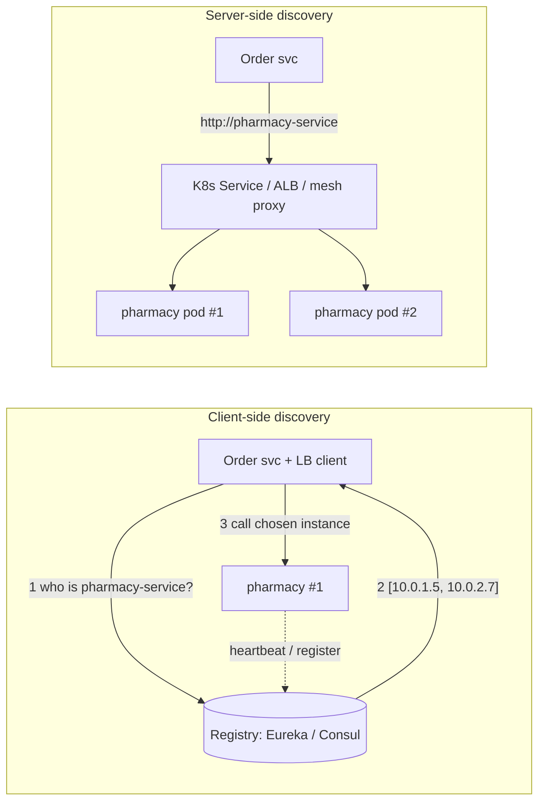
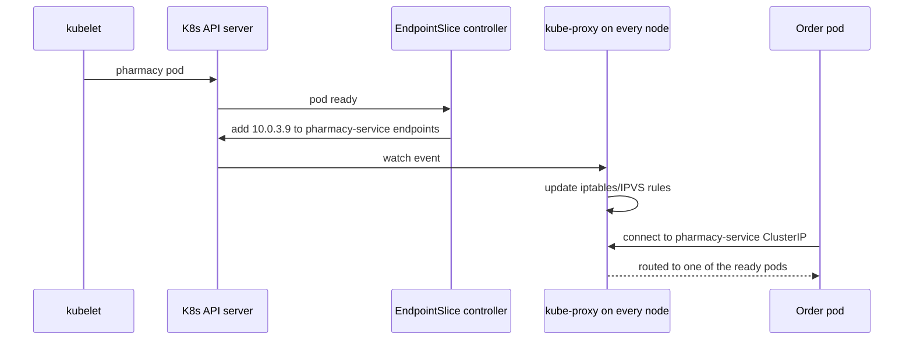

# Service Discovery & Client-Side Load Balancing

!!! abstract "Key takeaways"
    - In a dynamic environment, instance IPs change all the time (autoscaling, deploys, failures). **Service discovery** maps a logical name (`pharmacy-service`) to the current healthy instances.
    - **Client-side discovery:** the client asks a registry (Eureka, Consul) for instances and load-balances itself (Spring Cloud LoadBalancer, round-robin by default). **Server-side discovery:** the client calls a stable address and a load balancer/proxy picks the instance (Kubernetes Service, AWS ALB, service mesh).
    - **On Kubernetes, use the platform:** a `Service` gives a stable DNS name and virtual IP; kube-proxy (or the mesh) spreads traffic over ready pods. You usually don't need Eureka there.
    - Registration is either **self-registration** (the app registers and heartbeats) or **third-party registration** (the platform registers it). Health checks and readiness decide who receives traffic.
    - Discovery is eventually consistent: clients can hold **stale instance lists** (caches, DNS TTLs). Combine with timeouts, retries on another instance and circuit breakers.

## Why it matters

A hard-coded URL works for a monolith with one server. With microservices, each service runs N instances that scale up and down, move between hosts, and get replaced on every deploy. Clients need a way to find a live instance right now, and to spread load across all of them. Getting this wrong shows up as calls to dead instances during deploys, uneven load, or cascading failures when one zone dies.


*Notice where the load-balancing decision is made: inside the calling process (left) or in infrastructure (right). Server-side keeps clients simple and language-agnostic; client-side gives richer per-client policies without an extra hop.*

## Core concepts

### Client-side vs server-side discovery

| | Client-side | Server-side |
|---|---|---|
| Who picks the instance | The calling service (library) | A load balancer / proxy |
| Examples | Eureka + Spring Cloud LoadBalancer, Consul + client | Kubernetes Service + kube-proxy, AWS ALB/NLB, Istio/Envoy |
| Pros | No extra hop, smart policies (zone affinity, hints, sticky) | Language-agnostic, simpler clients, centralised |
| Cons | Library per language, client must handle cache/staleness | Extra hop (unless sidecar), LB must be HA |

### The registry

- Holds name → instances (host, port, metadata such as zone, version).
- **Self-registration:** the service registers on startup, sends heartbeats, deregisters on shutdown (Eureka client). If heartbeats stop, the registry evicts the instance after a timeout.
- **Third-party registration:** the platform registers instances (Kubernetes Endpoints/EndpointSlices from pod readiness; Consul agents; ECS service discovery with Cloud Map).
- **Health:** only healthy/ready instances should be returned. Readiness probes on Kubernetes decide membership in a Service's endpoints.
- **Consistency trade-off:** Eureka is AP: during network partitions it prefers serving possibly stale data over refusing (self-preservation mode stops evictions when many heartbeats fail at once). Consul uses Raft for its catalog (CP for writes) with eventually consistent reads options.

{ loading=lazy }
*Watch the gap between the registry and the client: the registry already knows #2 is gone, but the client only finds out when its cache refreshes. Retries on another instance cover that window.*

### Kubernetes service discovery

- A **Service** selects pods by label and gets a stable **ClusterIP** and DNS name: `pharmacy-service.rx.svc.cluster.local` (or just `pharmacy-service` inside the namespace).
- **EndpointSlices** list the ready pod IPs; **kube-proxy** programs iptables/IPVS rules (or eBPF with Cilium) so traffic to the ClusterIP is spread over them.
- **Headless Services** (`clusterIP: None`) return pod IPs directly via DNS, for client-side balancing or stateful sets.
- Readiness probe failing → pod removed from endpoints → no new traffic. This is why readiness matters (see [Actuator](../spring-boot/08-actuator-health-checks-metrics.md)).
- Caveat: kube-proxy balances **connections**, not requests. With long-lived HTTP/2 or gRPC connections, load can be uneven; use client-side balancing over a headless Service, or a mesh that balances per request.


*Notice that discovery on Kubernetes is driven by readiness: the platform registers and deregisters instances for you, so the application needs no registry client.*

{ loading=lazy }
*Notice the pods and the traffic are the same on both sides. The difference is whether the choice is made once per connection or once per request.*

### Load-balancing algorithms

| Algorithm | Idea | Note |
|---|---|---|
| Round robin | Next instance in turn | Default in Spring Cloud LoadBalancer; fine for uniform instances |
| Random | Pick at random | Simple, similar results at scale |
| Least connections / least requests | Pick the least busy | Better with uneven request costs (Envoy supports it) |
| Weighted | Share by weight | Canary traffic, mixed instance sizes |
| Zone preference | Same availability zone first | Lower latency and cross-AZ cost |
| Sticky / consistent hashing | Same key → same instance | Caches, session affinity; uneven on hot keys |
| Power of two choices | Pick two at random, use the less loaded | Good balance with little coordination |

### Spring Cloud specifics

- **Spring Cloud Netflix Eureka** server and client for registry-based discovery.
- **Spring Cloud LoadBalancer** is the client-side balancer (it replaced Netflix Ribbon, which was removed from Spring Cloud). Default `RoundRobinLoadBalancer`; alternatives include random, weighted, zone preference, health-check-based, same-instance preference, hint-based; instance lists are cached (default TTL 35 s).
- `@LoadBalanced` on a `RestClient.Builder`/`WebClient.Builder`/`RestTemplate` makes `http://pharmacy-service/...` resolve through discovery.
- **Spring Cloud Kubernetes** can use the Kubernetes API as the discovery source; on Kubernetes most teams just use Service DNS names instead.

## In practice: code & configuration

### On Kubernetes: just use the Service name

```yaml
apiVersion: v1
kind: Service
metadata:
  name: pharmacy-service
  namespace: rx
spec:
  selector:
    app: pharmacy
  ports:
    - port: 80
      targetPort: 8080
---
# Deployment readiness probe decides membership in the Service endpoints
readinessProbe:
  httpGet:
    path: /actuator/health/readiness
    port: 8081
  periodSeconds: 5
```

```yaml
# Calling service config: no registry, no client-side balancer
upstream:
  pharmacy:
    base-url: http://pharmacy-service.rx.svc.cluster.local
```

### Outside Kubernetes: Eureka + Spring Cloud LoadBalancer

=== "❌ Common mistake"
    ```java
    // Hard-coded instance, no balancing, breaks on every redeploy or scale event
    RestClient client = RestClient.create("http://10.0.1.5:8080");

    // Or: discovery lookup on every call with no caching and no timeout
    List<ServiceInstance> list = discoveryClient.getInstances("pharmacy-service");
    String url = list.get(0).getUri().toString();   // always the first instance
    ```

=== "✅ Correct approach"
    ```java
    @Configuration
    class Clients {
      @Bean
      @LoadBalanced                                  // resolves logical names via discovery
      RestClient.Builder lbRestClientBuilder() {
        return RestClient.builder();
      }

      @Bean
      RestClient pharmacyClient(@LoadBalanced RestClient.Builder b) {
        return b.baseUrl("http://pharmacy-service").build();   // logical name
      }
    }
    ```

    ```yaml
    eureka:
      client:
        service-url:
          defaultZone: http://eureka-1:8761/eureka,http://eureka-2:8761/eureka  # HA registry
      instance:
        prefer-ip-address: true
    spring:
      cloud:
        loadbalancer:
          cache:
            ttl: 15s                     # shorter staleness window than the default 35s
          retry:
            enabled: true                # retry on another instance (idempotent calls only)
    ```

## Real-world usage

- **Netflix** built Eureka (with Ribbon for client-side balancing) for AWS in the early 2010s, when instances were ephemeral and there was no Kubernetes. Eureka's AP design deliberately prefers stale data to no data during network trouble.
- **HashiCorp Consul** is common in VM and hybrid environments: catalog, health checks, DNS interface, and service mesh features.
- **Kubernetes** made platform discovery the default: most Spring Boot services on EKS/AKS/GKE call each other by Service DNS name and leave balancing to kube-proxy or a mesh (Istio/Linkerd for per-request L7 balancing and mTLS).
- **AWS ECS** uses Cloud Map for discovery, or an internal ALB per service.

## Trade-offs & production gotchas

| Option | Pros | Cons | Use when |
|---|---|---|---|
| Hard-coded / config URLs | Simple | Breaks with dynamic instances | Static external endpoints |
| DNS + LB (K8s Service, ALB) | Platform-managed, language-agnostic | Connection-level balancing, DNS caching | Default on Kubernetes / cloud |
| Registry + client LB (Eureka, Consul) | Rich policies, no extra hop | Library per language, registry to operate | VMs, hybrid, non-K8s |
| Service mesh | Per-request L7 balancing, mTLS, retries, shifting | Operational complexity, resource cost | Many services, strong security/traffic needs |

!!! warning "Gotcha: stale instances during deploys"
    Clients cache instance lists (LoadBalancer cache, DNS TTL, JVM DNS cache). During rolling deploys they may call terminating pods. Use a `preStop` delay, graceful shutdown, readiness going false before shutdown, and retries on another instance for idempotent calls.

!!! warning "Gotcha: JVM DNS caching"
    The JVM caches DNS lookups (`networkaddress.cache.ttl`); with a security manager it used to cache forever. Keep it low (e.g. 30–60 s) when relying on DNS-based discovery outside Kubernetes ClusterIPs.

!!! warning "Gotcha: gRPC and HTTP/2 on Kubernetes"
    One long-lived connection pins all requests to one pod. Use a headless Service with client-side round-robin, or a mesh that balances per request.

!!! question "Interview angle"
    The key comparison is client-side vs server-side, and "do you need Eureka on Kubernetes?" (usually no). Mention readiness, staleness and retries on another instance.

## How this connects to my experience

Not ★. Position it through the platforms on the resume.

- **Where I used it:**
    - **Deloitte ConvergeHealth:** "Built cloud-native microservices on AWS using Lambda, EC2, ECS, EKS, API Gateway…" Discovery there came from the platform: Kubernetes Services on EKS, ALBs or Cloud Map for ECS. *[confirm which mechanism the ECS services used]*
    - **OptumRx Meteor:** services on Kubernetes *[confirm]*, so service-to-service calls (e.g. GraphQL Consumer Service to internal services) used Service DNS names; external upstream systems were reached via configured base URLs per environment. *[confirm]*
    - **Skills:** Spring Cloud is listed; if Eureka/Spring Cloud LoadBalancer was used on any project, say where. *[confirm]*
- **Talking points:**
    - "On Kubernetes I rely on Services and readiness probes rather than Eureka: the platform already does registration and health-based routing."
    - "During rolling deploys we avoided errors with graceful shutdown, a preStop delay and readiness flipping before termination." *[confirm what was configured]*
- **Likely follow-up chain:** "How did your services find each other?" → "What happens to in-flight requests when a pod is terminated?" (readiness false, preStop, graceful shutdown, retries) → "Would you use Eureka on Kubernetes?" (no, unless hybrid) → "How does load balancing work for gRPC?" (connection pinning, headless + client LB, mesh).

## Interview questions

### Fundamentals

??? question "Q1. What is service discovery and why is it needed?"
    **Answer:** A mechanism mapping a logical service name to its current healthy instances. Needed because instances are dynamic (autoscaling, deploys, failures), so fixed addresses don't work.

    **Interviewer listens for:** logical name to healthy instances, dynamic addresses (autoscaling, deploys, failures).

    **Common wrong answer:** "It is just DNS." Plain DNS with long TTLs does not track health or fast changes.

??? question "Q2. Client-side vs server-side discovery?"
    **Answer:** Client-side: the caller queries a registry and picks an instance itself (Eureka + Spring Cloud LoadBalancer). Server-side: the caller uses a stable address and a load balancer/proxy picks the instance (Kubernetes Service, ALB, mesh).

    **Interviewer listens for:** where the decision is made and the trade-offs.

    **Common wrong answer:** "Client-side discovery is always better because there is no extra hop." It couples every client to a registry library and language.

??? question "Q3. How does service discovery work in Kubernetes?"
    **Answer:** A Service selects pods by labels, gets a ClusterIP and DNS name. EndpointSlices list ready pod IPs; kube-proxy (or eBPF/mesh) routes ClusterIP traffic to them. Readiness probes control membership.

    **Interviewer listens for:** Service selector, ClusterIP + DNS, EndpointSlices, kube-proxy/eBPF, readiness gates membership.

    **Common wrong answer:** "Kubernetes DNS returns pod IPs and the client picks one." For a normal ClusterIP Service DNS returns one virtual IP.

### Intermediate

??? question "Q4. Self-registration vs third-party registration?"
    **Answer:** Self-registration: the service registers and heartbeats itself (Eureka client), coupling it to the registry. Third-party: the platform registers instances based on what it runs and their health (Kubernetes, ECS Cloud Map, Consul agents).

    **Interviewer listens for:** who registers the instance, coupling of the service to the registry, platform-driven health.

    **Common wrong answer:** Thinking self-registration is required for health checks. The platform can check health itself.

??? question "Q5. Do you need Eureka on Kubernetes?"
    **Answer:** Usually not. Kubernetes already provides registration, health-based endpoints and DNS. Eureka makes sense for VMs, hybrid estates, or if you need client-side policies not available otherwise.

    **Interviewer listens for:** Kubernetes already provides registry, health and DNS; Eureka only for VMs, hybrid or special client policies.

    **Common wrong answer:** "Yes, Spring Cloud apps always need Eureka." It duplicates what the platform already does.

??? question "Q6. What replaced Netflix Ribbon in Spring Cloud?"
    **Answer:** Spring Cloud LoadBalancer: pluggable client-side balancer, round-robin by default, with random, weighted, zone-preference, health-check and hint-based suppliers and an instance cache.

    **Interviewer listens for:** Ribbon is in maintenance; Spring Cloud LoadBalancer is the replacement with pluggable suppliers.

    **Common wrong answer:** "Ribbon is still the default." It was removed from Spring Cloud in 2020.

??? question "Q7. What load-balancing algorithms do you know and when do they matter?"
    **Answer:** Round robin, random, least connections/requests, weighted, zone-aware, consistent hashing, power of two choices. Least-request helps with uneven request costs; weighted for canaries; zone-aware to cut latency and cross-AZ cost; hashing for cache affinity.

    **Interviewer listens for:** several algorithms, and when each matters (uneven costs, canaries, zone cost, cache affinity).

    **Common wrong answer:** Naming only round robin and not knowing when it performs badly (uneven request costs).

### Senior

??? question "Q8. Eureka is AP. What does that mean in practice?"
    **Answer:** During partitions it keeps serving the last known registry (possibly stale) rather than refusing, and self-preservation stops evicting instances when many heartbeats fail at once. Clients must tolerate dead instances with timeouts, retries on another instance and circuit breakers.

    **Interviewer listens for:** stale registry during partitions, self-preservation, so clients must tolerate dead instances.

    **Common wrong answer:** "AP means the registry is always correct." AP means it stays available and may be wrong.

??? question "Q9. Why can gRPC load balancing be uneven on Kubernetes?"
    **Answer:** kube-proxy balances connections. gRPC multiplexes all requests over one long-lived HTTP/2 connection, so a client sticks to one pod. Use client-side balancing with a headless Service (DNS returns all pod IPs) or a mesh doing per-request L7 balancing.

    **Interviewer listens for:** connection-level vs request-level balancing, HTTP/2 multiplexing, headless Service or mesh.

    **Common wrong answer:** "Increase the replica count." More pods do not help if every client stays pinned to one connection.

??? question "Q10. How do you avoid errors during rolling deployments?"
    **Answer:** New pods only receive traffic when ready; terminating pods first fail readiness and get a preStop sleep so endpoints and caches update, then graceful shutdown finishes in-flight requests. Callers retry idempotent requests on another instance.

    **Interviewer listens for:** readiness before traffic, preStop delay, graceful shutdown, retries on another instance.

    **Common wrong answer:** "Kubernetes rolling updates are zero-downtime by default." Without preStop and graceful shutdown some requests fail.

### Scenario-based

??? question "Q11. After a deploy, 1–2% of calls fail with connection refused for a minute. Why?"
    **Answer:** Callers still route to terminated pods: endpoint propagation lag, client-side caches or DNS caching, and pods exiting before draining. Add a preStop delay, graceful shutdown, readiness off on SIGTERM, shorter client caches, and retries on another instance.

    **Interviewer listens for:** endpoint propagation lag, client and DNS caching, missing drain; preStop + graceful shutdown fix.

    **Common wrong answer:** "It is a network blip." It is reproducible on every deploy, so it is a shutdown-ordering bug.

??? question "Q12. One pod gets most of the traffic. What do you check?"
    **Answer:** Long-lived connections (HTTP/2, gRPC, keep-alive) pinning to one pod, sticky sessions, consistent hashing on a hot key, or a client that cached a single instance. Fix with per-request balancing (mesh or client-side), connection max-age, or better keys.

    **Interviewer listens for:** long-lived connection pinning, stickiness, hot hash keys, cached single instance; per-request balancing.

    **Common wrong answer:** "The load balancer is broken." Usually the client or the protocol is pinning connections.

## Cheat sheet

| Concept | Remember |
|---|---|
| Discovery | Logical name → current healthy instances |
| Client-side | Registry + client LB (Eureka + Spring Cloud LoadBalancer) |
| Server-side | Stable address + LB/proxy (K8s Service, ALB, mesh) |
| K8s | Service → ClusterIP + DNS; EndpointSlices of **ready** pods; kube-proxy |
| Headless | `clusterIP: None` → DNS returns pod IPs |
| Registration | Self (heartbeats) vs third-party (platform) |
| Eureka | AP, self-preservation, stale but available |
| Spring | `@LoadBalanced` builder, `lb://` in gateway, LoadBalancer cache TTL 35 s default |
| Ribbon | Removed; replaced by Spring Cloud LoadBalancer |
| Algorithms | Round robin (default), random, least-request, weighted, zone, hashing, P2C |
| gRPC on K8s | Connection pinning → headless + client LB or mesh |
| Deploys | Readiness, preStop, graceful shutdown, retry on another instance |

## Sources

1. [Client-side discovery](https://microservices.io/patterns/client-side-discovery.html) and [Server-side discovery](https://microservices.io/patterns/server-side-discovery.html) (microservices.io): patterns and trade-offs.
2. [Kubernetes: Service](https://kubernetes.io/docs/concepts/services-networking/service/): ClusterIP, headless Services, EndpointSlices.
3. [Kubernetes: DNS for Services and Pods](https://kubernetes.io/docs/concepts/services-networking/dns-pod-service/): service DNS names.
4. [Spring Cloud Commons: Spring Cloud LoadBalancer](https://docs.spring.io/spring-cloud-commons/reference/spring-cloud-commons/loadbalancer.html): algorithms, caching (35 s default TTL), `@LoadBalanced`.
5. [Spring Cloud Netflix (Eureka) reference](https://docs.spring.io/spring-cloud-netflix/reference/): Eureka server/client, self-preservation.
6. [Consul: service discovery](https://developer.hashicorp.com/consul/docs/concepts/service-discovery): catalog, health checks, DNS.
7. [gRPC load balancing (grpc.io blog)](https://grpc.io/blog/grpc-load-balancing/): connection-level vs request-level balancing.
