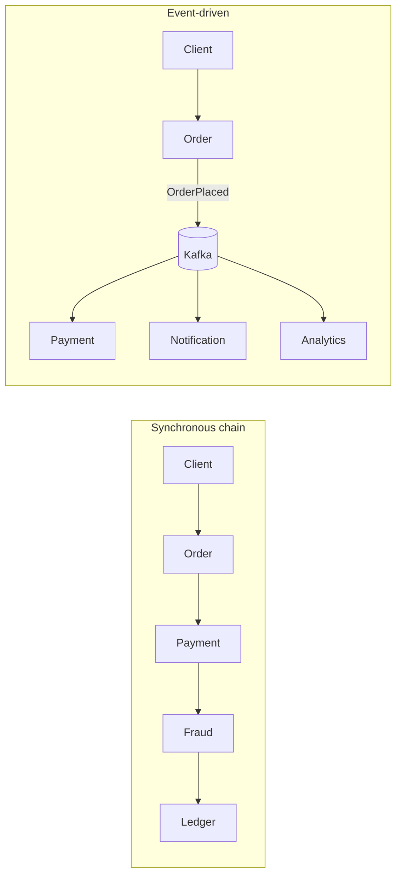
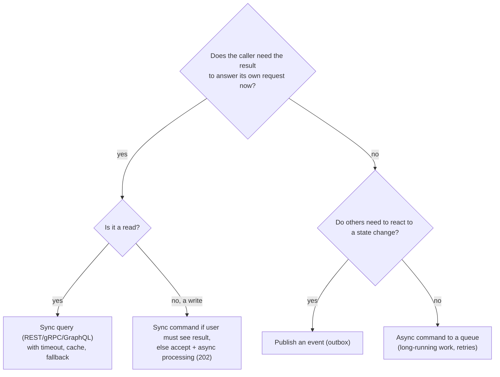

# Inter-Service Communication: Sync vs Async

!!! abstract "TL;DR"
    - **Synchronous** (request/response: REST, gRPC, GraphQL): the caller waits. Simple and immediate, but creates **temporal coupling**: if the callee is down or slow, so is the caller. Chains multiply latency and reduce availability.
    - **Asynchronous** (messages/events: Kafka, RabbitMQ, SQS/SNS): the sender doesn't wait. Decouples availability and load, absorbs spikes, lets many consumers react, but brings **eventual consistency, duplicates, ordering and harder debugging**.
    - Choose **per interaction**, not per system: queries that need an answer now → sync; state changes others react to, long-running work, fan-out → async.
    - Styles: **request/response**, **commands** (do this, one handler), **events** (this happened, any number of listeners), and **request/async-reply** (correlation id + reply channel).
    - For sync calls always set **timeouts, retries only for idempotent calls, circuit breakers**; for async, design **idempotent consumers, DLQs, and schema evolution**.

## Why it matters

How services talk decides the system's failure modes. A request path of five synchronous hops, each 99.9% available with a 100 ms p99, gives about 99.5% availability and a p99 dominated by the slowest hop. Moving the right interactions to asynchronous messaging removes those dependencies from the request path. Moving the wrong ones (a user waiting for a balance check) makes the UX confusing and the code complicated.


*On the left the client waits for four services and fails if any one fails. On the right, Order commits and responds; other services react in their own time, and a slow Analytics service affects nobody.*

## Core concepts

### Coupling types

| Coupling | Meaning | Sync | Async |
|---|---|---|---|
| Temporal | Both must be up at the same time | Yes | No (broker buffers) |
| Location | Caller knows where callee is | Yes (via discovery) | No (knows a topic/queue) |
| Knowledge | Caller knows who needs the data | Yes | Events: no; commands: yes |
| Format | Shared contract | Yes | Yes (schemas) |

Async removes temporal and location coupling, not contract coupling: you still need versioned schemas.

### Synchronous options

| | REST/HTTP+JSON | gRPC | GraphQL |
|---|---|---|---|
| Contract | OpenAPI (optional) | Protobuf (required, generated stubs) | Schema (required) |
| Transport | HTTP/1.1 or 2 | HTTP/2, binary, streaming | HTTP, usually POST |
| Strengths | Universal, cacheable GETs, human-readable | Fast, strongly typed, streaming, deadlines | Client chooses fields, aggregation |
| Weaknesses | Over/under-fetching, loose typing | Browser support needs a proxy, harder debugging | Caching, query cost, N+1 if careless |
| Typical use | Public and internal APIs | Internal high-volume service calls | Client-facing aggregation/BFF |

### Asynchronous options

| Style | Semantics | Example |
|---|---|---|
| **Event** (pub/sub) | Fact: "PrescriptionFilled". Zero or many consumers; producer doesn't know them | Kafka topic, SNS |
| **Command** (point-to-point) | Request: "SendRefillReminder". One handler; can be rejected | SQS/RabbitMQ queue, Kafka topic owned by the handler |
| **Request/async reply** | Request with `correlationId` and `replyTo`; reply comes later | Long-running quotes, batch jobs |

Message brokers differ: **Kafka** is a durable, partitioned, replayable log (consumers track offsets; good for events and streams); **RabbitMQ/SQS** are queues (messages removed once acknowledged; good for work distribution and commands). See the [Kafka topic](../kafka/01-event-driven-architecture-fundamentals.md).

### Event types

- **Event notification:** thin event (`{memberId, type}`); consumers call back for details. Small but couples consumers to the producer's API at read time.
- **Event-carried state transfer:** the event carries the data consumers need (`{memberId, address...}`); consumers keep local copies. Fewer calls, more data duplication, and you must consider PHI in events.
- **Domain events vs integration events:** internal model events vs published, versioned contracts for other services.

### Latency and availability maths

- Serial sync calls add latency; parallel calls cost the slowest one.
- Availability of a serial chain ≈ product of each: 0.999⁵ ≈ 0.995 (about 3.6 hours down per month instead of 43 minutes).
- Tail latency amplifies with fan-out: if one call in 100 is slow and a request fans out to 100 calls, most requests see at least one slow call.

### Choosing per interaction


*Notice the default for state changes others care about is an event, and for long work it's accept-then-process: the user gets a 202 and a status to poll or a notification.*

### Making sync calls safe

- **Timeouts** on connect, read and pool acquisition; an overall deadline budget propagated downstream (gRPC deadlines do this natively).
- **Retries** only on idempotent operations, with backoff + jitter and a budget, at one layer.
- **Circuit breakers and bulkheads** per dependency ([Resilience](06-resilience-circuit-breaker-retry-bulkhead-timeout-rate-limit.md)).
- **Caching and fallbacks** for reference data.
- **Parallelise** independent calls.

### Making async messaging safe

- **At-least-once delivery** is the norm → **idempotent consumers** (dedupe on event id or natural key).
- **Reliable publishing** from a DB change → **transactional outbox** ([Distributed transactions](07-distributed-transactions-saga-outbox-pattern.md)).
- **Ordering** only within a partition/key; choose keys deliberately.
- **Poison messages** → retry topics and **DLQ** with alerting.
- **Schema evolution** → Avro/Protobuf/JSON Schema with a registry and compatibility rules.
- **Observability** → trace context in message headers, consumer lag metrics.

## In practice: code & configuration

### Sync with a deadline vs fire-and-forget event

=== "❌ Common mistake"
    ```java
    // Order placement waits on 3 downstream services synchronously, no timeouts.
    @Transactional
    public OrderId place(PlaceOrder cmd) {
      Order o = repo.save(Order.from(cmd));
      paymentClient.charge(o);          // if payment is slow, the DB transaction is held open
      notificationClient.sendEmail(o);  // email outage now fails order placement
      analyticsClient.track(o);         // nobody's request should depend on analytics
      return o.id();
    }
    ```

=== "✅ Correct approach"
    ```java
    // Only what the user needs now is synchronous; everything else reacts to an event.
    public OrderId place(PlaceOrder cmd) {
      PaymentAuth auth = paymentClient.authorize(cmd.payment());   // sync: user needs the answer;
                                                                    // client has timeout + circuit breaker
      return tx.execute(s -> {
        Order o = repo.save(Order.from(cmd, auth));
        outbox.save(OutboxEvent.of("orders", o.id(), new OrderPlaced(o.id(), o.memberId())));
        return o.id();                                              // event published by relay after commit
      });
    }

    // Notification and analytics consume OrderPlaced independently, idempotently.
    @KafkaListener(topics = "orders", groupId = "notification-service")
    void on(OrderPlaced e) {
      if (processed.markIfFirst(e.eventId())) notifier.send(e.memberId());
    }
    ```

### gRPC with a deadline

```java
// Deadline propagates: downstream servers see how much time is left and can give up early.
PlanResponse plan = planStub
    .withDeadlineAfter(300, TimeUnit.MILLISECONDS)
    .getPlan(PlanRequest.newBuilder().setMemberId(id).build());
```

### Request/async reply with correlation id

```java
// Requester
String correlationId = UUID.randomUUID().toString();
kafka.send(MessageBuilder.withPayload(new QuoteRequest(rxId))
    .setHeader(KafkaHeaders.TOPIC, "quote-requests")
    .setHeader(KafkaHeaders.REPLY_TOPIC, "quote-replies")
    .setHeader(KafkaHeaders.CORRELATION_ID, correlationId.getBytes())
    .build());
// Spring Kafka's ReplyingKafkaTemplate implements this pattern with a future per correlation id.
```

## Real-world usage

- **Uber, Netflix, LinkedIn** use events (Kafka) heavily for propagation of state changes, analytics and decoupling, and gRPC or REST for queries on the request path.
- **gRPC** is common for internal high-throughput calls (Google, Square, Netflix); browsers reach it through gRPC-Web or a REST/GraphQL edge.
- **Healthcare:** prescription status changes, eligibility updates and notifications are natural events; a member checking a claim's status is a sync query. Event payloads with PHI need encryption in transit/at rest, access controls on topics, and minimisation (send ids instead of full records when possible).

## Trade-offs & production gotchas

| Option | Pros | Cons | Use when |
|---|---|---|---|
| Sync REST | Simple, universal, immediate | Temporal coupling, chains | Queries, user-facing commands needing an answer |
| Sync gRPC | Fast, typed, streaming, deadlines | Tooling, browser support | Internal high-volume calls |
| Async events | Decoupled, extensible, absorbs spikes, replay (Kafka) | Eventual consistency, duplicates, debugging | State changes others react to |
| Async commands (queues) | Load levelling, retries, work distribution | Still knowledge-coupled, eventual | Background/long-running work |

!!! warning "Gotcha: async in name only"
    Publishing a message and then blocking until a reply arrives on the request path keeps temporal coupling and adds a broker hop. If the user needs the answer now, call synchronously.

!!! warning "Gotcha: dual write"
    `repo.save()` then `kafka.send()` can lose the event (crash between) or publish an event for a rolled-back write. Use the outbox pattern or CDC.

!!! warning "Gotcha: chatty services"
    Many small sync calls per request usually means a wrong boundary. Consider merging, event-carried state transfer, or a local read model.

!!! question "Interview angle"
    Say "it depends on the interaction", then show the decision: does the caller need the answer now? Who else cares? Mention temporal coupling, availability maths, idempotency and outbox.

## How this connects to my experience

Not ★, but central to the OptumRx work.

- **Where I used it:**
    - **OptumRx Meteor:** "Owned the GraphQL Consumer Service … integration layer between 5 upstream systems" (sync queries on the request path) and "Designed Kafka-based event-driven workflows with retry and DLQ handling" (async state changes). That is exactly the "choose per interaction" story.
    - **Deloitte ConvergeHealth:** "Developed event-driven healthcare analytics workflows" with SQS and SNS: queues for work distribution and fan-out via SNS topics. *[confirm which flows used SQS vs SNS fan-out]*
- **Talking points:**
    - "Member-facing reads went through the GraphQL service synchronously with timeouts and partial results; workflow state changes went through Kafka so slow downstream systems didn't block members." *[confirm which flows were Kafka-based]*
    - "Consumers were idempotent and failures went to retry topics and a DLQ, because at-least-once delivery means duplicates will happen." *[confirm idempotency mechanism]*
    - "With PHI in the domain, event payloads carried ids and minimal fields where possible." *[confirm]*
- **Likely follow-up chain:** "Why Kafka for those workflows and not REST?" (temporal decoupling, fan-out, replay) → "How did you guarantee the event was published after the DB write?" (outbox/CDC or after-commit + retry *[confirm]*) → "What about duplicates and ordering?" (idempotent consumers, keys per member/prescription) → "When would you not use events?" (user needs an answer now).

## Interview questions

### Fundamentals

??? question "Q1. Sync vs async communication: trade-offs?"
    **Answer:** Sync is simple and immediate but couples availability and latency (temporal coupling). Async decouples availability, absorbs spikes and supports many consumers, but brings eventual consistency, duplicates, ordering concerns and harder debugging.

??? question "Q2. Event vs command?"
    **Answer:** An event states a fact that happened (past tense), has any number of consumers, and the producer doesn't know them. A command asks a specific handler to do something and can be rejected.

??? question "Q3. REST vs gRPC?"
    **Answer:** REST: HTTP+JSON, universal, readable, cache-friendly. gRPC: HTTP/2, Protobuf, generated typed stubs, streaming, deadlines, lower latency; less browser-friendly. Use gRPC for internal high-volume calls, REST for public APIs.

### Intermediate

??? question "Q4. What is temporal coupling?"
    **Answer:** Both sides must be available at the same time for the interaction to succeed. Sync calls have it; messaging via a durable broker removes it.

??? question "Q5. Event notification vs event-carried state transfer?"
    **Answer:** Notification: thin event, consumers call back for data (simpler events, more calls, runtime coupling). State transfer: event carries the data, consumers keep a local copy (no callbacks, duplicated data, larger events, sensitive-data concerns).

??? question "Q6. How do you make a synchronous call resilient?"
    **Answer:** Timeouts (connect, read, pool), retries only for idempotent operations with backoff and jitter, circuit breaker, bulkhead, fallback or cached data, and propagate a deadline budget.

??? question "Q7. Kafka vs RabbitMQ/SQS?"
    **Answer:** Kafka is a partitioned, durable log: consumers keep offsets, multiple groups read independently, replay is possible, ordering per partition. RabbitMQ/SQS are queues: messages are removed on ack, good for task distribution and routing; replay isn't native.

### Senior

??? question "Q8. How do you calculate the availability of a sync chain?"
    **Answer:** Roughly the product of each dependency's availability for serial calls. Five services at 99.9% give about 99.5%. That's why critical paths should minimise sync dependencies.

??? question "Q9. How do you implement request/reply over messaging?"
    **Answer:** Send a request with a correlation id and reply-to destination; the responder sends the result to the reply destination with the same correlation id; the requester matches it (Spring Kafka `ReplyingKafkaTemplate`). Use for long-running work, not to fake sync calls on the request path.

??? question "Q10. What can go wrong with event-driven designs?"
    **Answer:** Lost events (dual writes), duplicates, out-of-order processing, poison messages blocking partitions, schema breaks, invisible flows (hard to trace), and consumers building on internal events that then can't change.

### Scenario-based

??? question "Q11. Placing an order calls payment, inventory, email and analytics synchronously and is slow and flaky. Redesign it."
    **Answer:** Keep payment authorisation sync (user needs it), make inventory reservation part of a saga if needed, publish `OrderPlaced` via outbox, and let email and analytics consume it asynchronously and idempotently. Return as soon as the order is committed.

??? question "Q12. A consumer needs member addresses on every event it processes and calls the member service each time. Problem?"
    **Answer:** Runtime coupling and load on the member service. Either include the needed fields in the events (event-carried state) or have the consumer maintain a local read model from member-changed events.

??? question "Q13. Product wants the UI to show 'refill submitted' instantly even though processing takes minutes. How?"
    **Answer:** Accept the request synchronously (validate, persist, return 202 with a status id), process asynchronously, and update the status via polling, websocket/SSE push or notification. Make the state machine explicit (submitted, in progress, completed, failed).

## Cheat sheet

| Concept | Remember |
|---|---|
| Sync | Simple, immediate; temporal coupling; chains multiply latency and failure |
| Async | Decoupled in time/location; eventual consistency; duplicates; ordering per key |
| Event vs command | Fact, many listeners vs request, one handler, can reject |
| REST / gRPC / GraphQL | Universal / fast typed internal / client-shaped aggregation |
| Chain availability | Product of each: 0.999⁵ ≈ 0.995 |
| Sync safety | Timeouts, idempotent retries, circuit breaker, bulkhead, deadlines |
| Async safety | Outbox, idempotent consumers, DLQ, schema registry, trace headers |
| Event styles | Notification (thin) vs state transfer (fat) |
| Request/reply async | Correlation id + reply topic (`ReplyingKafkaTemplate`) |
| Long work | 202 Accepted + status, then async |
| Choose | Per interaction: need the answer now? who else reacts? |

## Sources

1. [What do you mean by "Event-Driven"? (Martin Fowler)](https://martinfowler.com/articles/201701-event-driven.html): event notification, event-carried state transfer, event sourcing, CQRS.
2. [Messaging pattern (microservices.io)](https://microservices.io/patterns/communication-style/messaging.html) and [Remote procedure invocation](https://microservices.io/patterns/communication-style/rpi.html): communication styles.
3. [gRPC introduction](https://grpc.io/docs/what-is-grpc/introduction/) and [deadlines](https://grpc.io/docs/guides/deadlines/): Protobuf, HTTP/2, deadline propagation.
4. [Enterprise Integration Patterns (Hohpe & Woolf)](https://www.enterpriseintegrationpatterns.com/patterns/messaging/): request-reply, correlation identifier, command/event messages.
5. [Spring for Apache Kafka: ReplyingKafkaTemplate](https://docs.spring.io/spring-kafka/reference/kafka/sending-messages.html): request/reply over Kafka.
6. Jeffrey Dean & Luiz André Barroso, ["The Tail at Scale" (CACM, 2013)](https://research.google/pubs/the-tail-at-scale/): tail latency amplification with fan-out.
