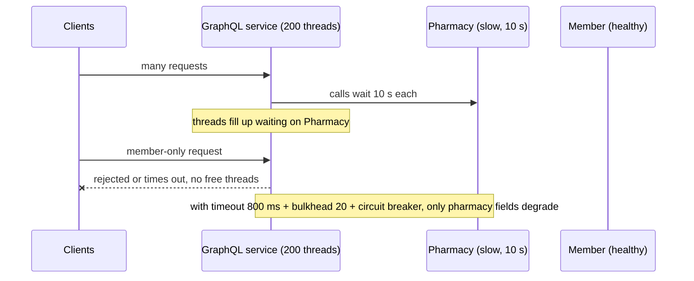
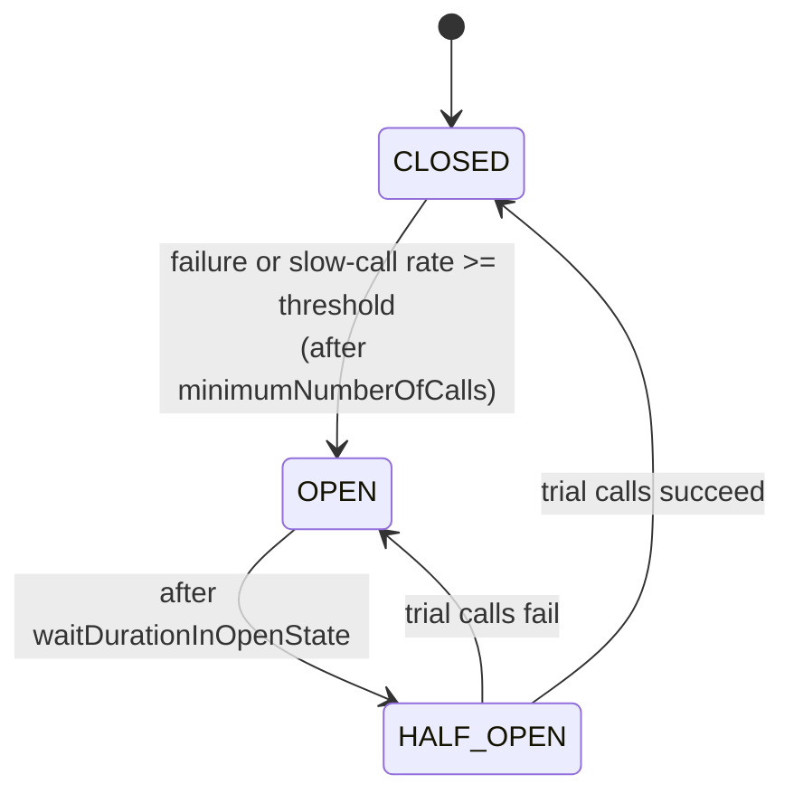

# Resilience: Circuit Breaker, Retry, Bulkhead, Timeout, Rate Limiter (Resilience4j)

!!! abstract "TL;DR"
    - In a distributed system, dependencies **will** be slow or down. Most outages spread through **resource exhaustion**: threads and connections pile up waiting on a slow dependency.
    - **Timeout** bounds waiting. **Retry** handles transient failures (idempotent calls only, with backoff + jitter). **Circuit breaker** stops calling a failing dependency and fails fast. **Bulkhead** caps concurrent calls per dependency so one can't consume everything. **Rate limiter** caps call rate (protect yourself or a downstream). **Fallback** returns a degraded answer.
    - **Resilience4j** (the successor to Netflix Hystrix, which is in maintenance) provides all of these. Spring Boot annotation order by default: `Retry ( CircuitBreaker ( RateLimiter ( TimeLimiter ( Bulkhead ( call ) ) ) ) )`, so retry is outermost.
    - Circuit breaker defaults: failure-rate threshold **50%**, sliding window **100 calls** (count-based), minimum **100 calls**, wait in open **60 s**, **10** calls in half-open, slow-call threshold **60 s**. Defaults are rarely right: tune per dependency.
    - Resilience is also about design: async where possible, caching, graceful degradation (partial results), and **load shedding** rather than queueing forever.

## Why it matters

A classic cascading failure: one upstream starts responding in 10 s instead of 100 ms. Every request thread calling it waits. Tomcat's 200 threads fill up within seconds, so requests that don't even need that upstream also queue and time out. Health checks fail, the orchestrator restarts pods, load concentrates on the survivors, and the whole service is down because of one dependency. Clients retry, making it worse.

Resilience patterns contain the failure: bound the wait, stop calling what's broken, isolate resources per dependency, and degrade instead of failing.


*Notice the member-only request fails even though Member is healthy. Without isolation, the slowest dependency decides the availability of everything.*

## Core concepts

### Timeouts

- Every remote call needs **connect**, **read/response** and **pool-acquire** timeouts. Many client defaults are infinite or very long.
- Set them from the dependency's latency profile (e.g. slightly above its p99) and from your own **deadline budget**: if your SLA is 1 s, a 5 s downstream timeout is meaningless.
- Resilience4j **TimeLimiter** bounds `CompletableFuture`/reactive calls; for blocking calls prefer the HTTP client's own timeouts (a TimeLimiter can't interrupt a blocked socket read).

### Retry

- Only for **transient** errors (connection reset, 503, timeouts where no side effect occurred) and **idempotent** operations (GET, PUT, or POST with an idempotency key).
- **Exponential backoff with jitter** to avoid synchronised retry waves.
- **Retry budget:** limit retries as a share of traffic; retry at **one layer**; never retry 4xx validation errors.
- Resilience4j defaults: `maxAttempts` 3 (including the first call), `waitDuration` 500 ms, retry on all exceptions unless configured.

### Circuit breaker


*Notice the breaker only judges after enough calls (minimum number of calls), and recovery is probed with a limited number of trial calls rather than releasing full traffic at once.*

- **CLOSED:** calls pass; outcomes recorded in a **sliding window** (count-based: last N calls; time-based: last N seconds).
- **OPEN:** calls fail immediately with `CallNotPermittedException` → fallback. Protects the caller's resources and gives the dependency room to recover.
- **HALF_OPEN:** a few trial calls decide whether to close or re-open.
- Also trips on **slow calls** (`slowCallRateThreshold`, `slowCallDurationThreshold`), which is often the more important signal.
- Record only failures that indicate dependency health (5xx, timeouts), **ignore** business errors (404 not found, 400 validation).

| Property | Default | Typical tuning thought |
|---|---|---|
| failureRateThreshold | 50 (%) | Lower for critical deps you want to protect early |
| slowCallRateThreshold | 100 (%) | Lower (e.g. 50–80%) so slowness trips it |
| slowCallDurationThreshold | 60 000 ms | Set near the dependency's acceptable p99 |
| slidingWindowType / Size | COUNT_BASED / 100 | Time-based for low/variable traffic |
| minimumNumberOfCalls | 100 | Lower for low-traffic deps, or it never trips |
| waitDurationInOpenState | 60 000 ms | Shorter (5–30 s) for quick recovery probes |
| permittedNumberOfCallsInHalfOpenState | 10 | Small number of trial calls |

### Bulkhead

Named after ship compartments: a leak floods one compartment, not the ship.

- **Semaphore bulkhead:** limits concurrent calls (default `maxConcurrentCalls` 25, `maxWaitDuration` 0). Works with any threading model, including virtual threads.
- **Thread-pool bulkhead:** runs calls on a dedicated bounded pool and queue (defaults: max pool = CPUs, core = CPUs − 1, queue 100).
- With **virtual threads**, the request pool no longer protects downstreams, so semaphore bulkheads per dependency become essential.

### Rate limiter

- Limits calls per period: Resilience4j defaults `limitForPeriod` 50 per `limitRefreshPeriod` 500 ns, wait `timeoutDuration` 5 s for a permit.
- Use to protect a downstream with a known quota (partner API: 100 req/s) or to protect yourself from a client. For distributed limits across instances, use the gateway or Redis.

### Fallbacks and graceful degradation

- Return cached/stale data, a default, an empty section with an error flag, or queue the request for later.
- In GraphQL: return `null` for the failed field plus an entry in `errors`, so the rest of the page renders.
- Never fall back silently on things that must be correct (charging, clinical decisions): fail clearly instead.

### Combining them

Default Spring Boot aspect order: **Retry ( CircuitBreaker ( RateLimiter ( TimeLimiter ( Bulkhead ( call ) ) ) ) )**.

- Retry outermost: each attempt passes through the breaker, so an open breaker stops retries quickly.
- Bulkhead innermost: limits concurrent actual calls.
- Change order with `resilience4j.<module>.<module>AspectOrder` properties (higher = runs first), or use functional decoration for explicit control.

### Load shedding and back-pressure

When overloaded, rejecting quickly (429/503) is better than queueing work that will time out anyway. Bounded queues, admission control at the gateway, and prioritising critical traffic keep the system alive.

## In practice: code & configuration

### Resilience4j with Spring Boot

```yaml
resilience4j:
  circuitbreaker:
    instances:
      pharmacy:
        sliding-window-type: TIME_BASED
        sliding-window-size: 30                 # last 30 seconds
        minimum-number-of-calls: 20
        failure-rate-threshold: 50
        slow-call-duration-threshold: 800ms     # near the dependency's p99
        slow-call-rate-threshold: 60
        wait-duration-in-open-state: 15s
        permitted-number-of-calls-in-half-open-state: 5
        record-exceptions:
          - java.io.IOException
          - org.springframework.web.client.HttpServerErrorException
        ignore-exceptions:
          - com.rx.NotFoundException            # business error, not a health signal
  retry:
    instances:
      pharmacy:
        max-attempts: 3
        wait-duration: 200ms
        enable-exponential-backoff: true
        exponential-backoff-multiplier: 2
        # jitter: IntervalFunction.ofExponentialRandomBackoff(...) in a RetryConfigCustomizer bean
        # (check your version's support for combining randomized wait with exponential backoff)
        retry-exceptions:
          - java.io.IOException
  bulkhead:
    instances:
      pharmacy:
        max-concurrent-calls: 20
        max-wait-duration: 0
```

=== "❌ Common mistake"
    ```java
    // No timeout, retries a non-idempotent call, swallows every error into a fake success.
    @Retry(name = "pharmacy")
    public Confirmation submitRefill(RefillRequest r) {
      return restTemplate.postForObject(url, r, Confirmation.class);  // POST without idempotency key
    }
    ```

=== "✅ Correct approach"
    ```java
    @Service
    class PharmacyGateway {
      private final RestClient pharmacy;   // built with connect 300 ms / read 800 ms timeouts

      @Retry(name = "pharmacy")
      @CircuitBreaker(name = "pharmacy", fallbackMethod = "cachedPharmacies")
      @Bulkhead(name = "pharmacy")
      public List<Pharmacy> nearby(String zip) {                 // idempotent read: safe to retry
        return pharmacy.get().uri("/pharmacies?zip={z}", zip).retrieve()
            .body(new ParameterizedTypeReference<>() {});
      }

      List<Pharmacy> cachedPharmacies(String zip, Throwable t) {  // degrade, don't hide everything
        log.warn("pharmacy degraded: {}", t.toString());
        return referenceCache.pharmaciesNear(zip);                // may be stale; UI shows a notice
      }

      @CircuitBreaker(name = "pharmacy")                          // no retry: not idempotent
      public Confirmation submitRefill(RefillRequest r, String idempotencyKey) {
        return pharmacy.post().uri("/refills").header("Idempotency-Key", idempotencyKey)
            .body(r).retrieve().body(Confirmation.class);
      }
    }
    ```

### Exposing state for operations

```yaml
management:
  endpoints.web.exposure.include: health,prometheus,circuitbreakers
  health.circuitbreakers.enabled: true     # careful: don't put this in liveness
```

Alert on `resilience4j_circuitbreaker_state` transitions, `not_permitted_calls`, bulkhead saturation and retry counts.

## Real-world usage

- **Netflix Hystrix** popularised circuit breakers and bulkheads for microservices (2012). It moved to maintenance mode in 2018; Netflix pointed users to Resilience4j and adaptive concurrency limits.
- **AWS Builders' Library** articles describe timeouts, retries with backoff and jitter, and retry budgets as standard practice, and warn about retry storms amplifying outages.
- **Service meshes** (Istio, Linkerd) offer timeouts, retries and outlier detection at the proxy layer; application-level patterns are still needed for fallbacks and business-aware decisions.
- **Healthcare:** degrade non-critical features (pharmacy locator, recommendations) but never fake critical results (eligibility, dosage, claims). A clear "temporarily unavailable" is safer than a wrong answer.

## Trade-offs & production gotchas

| Pattern | Protects against | Cost / risk | Use when |
|---|---|---|---|
| Timeout | Infinite waits | Too short → false failures | Always |
| Retry | Transient faults | Amplifies load; duplicates on non-idempotent ops | Idempotent calls, transient errors |
| Circuit breaker | Hammering a failing dep, resource waste | Tuning; can trip on low traffic | Remote deps with real failure modes |
| Bulkhead | One dep exhausting threads/connections | Rejections when saturated | Multiple deps per service |
| Rate limiter | Exceeding quotas, overload | Rejections, needs distribution for cluster-wide limits | Known downstream quotas |
| Fallback | Total failure of a feature | Stale/incorrect data if misused | Non-critical, degradable features |

!!! warning "Gotcha: retry storms"
    Client retries × gateway retries × service retries can multiply traffic 27× (3 × 3 × 3) during an outage. Retry at one layer, with budgets and jitter, and let the circuit breaker stop retries.

!!! warning "Gotcha: circuit breaker that never trips"
    With default `minimumNumberOfCalls` 100 and low traffic, the breaker never has enough calls to judge. Lower it or use a time-based window.

!!! warning "Gotcha: circuit breaker health in liveness"
    An open breaker on a dependency means that dependency is unhealthy, not your pod. Putting it in liveness causes restart loops.

!!! warning "Gotcha: TimeLimiter on blocking calls"
    TimeLimiter cancels the future, but a thread blocked in a socket read keeps running. Set real timeouts on the HTTP client.

!!! question "Interview angle"
    Expect "explain the circuit breaker states", "how do you combine retry and circuit breaker", "what are good timeout values", and a cascading-failure scenario. Talk about tuning from data, not defaults.

## How this connects to my experience

Not ★, but directly relevant to "Owned the GraphQL Consumer Service end-to-end, acting as the integration layer between 5 upstream systems" (OptumRx Meteor) and "Designed Kafka-based event-driven workflows with retry and DLQ handling".

- **Where I used it:**
    - **GraphQL Consumer Service:** five upstreams means five failure domains. Per-upstream timeouts, circuit breakers and partial GraphQL responses keep one slow system from failing the whole query. *[confirm which of these were actually implemented, the library (Resilience4j or other), and real timeout values]*
    - **Kafka retry and DLQ:** the async equivalent of retry with backoff plus a "breaker" in the form of moving poison messages aside so the partition keeps flowing.
    - **Redis caching of reference data:** a natural fallback source when an upstream is down. *[confirm whether cache was used as a fallback]*
- **Talking points:**
    - "In an aggregation layer, the slowest upstream decides your availability unless you isolate it: timeouts near its p99, a bulkhead per upstream and a breaker that trips on slow calls, not just errors." *[confirm]*
    - "We only retried idempotent reads; writes carried idempotency keys or weren't retried." *[confirm]*
    - "Critical data failed clearly; optional fields degraded with GraphQL errors so the page still rendered." *[confirm]*
- **Likely follow-up chain:** "One upstream got slow; what happened?" → "How did you pick timeout values?" (latency percentiles, deadline budget) → "Circuit breaker settings?" (window, thresholds, slow calls) → "Retry and breaker together?" (retry outside breaker, idempotent only, jitter) → "How did you know it tripped?" (metrics, alerts).

## Interview questions

### Fundamentals

??? question "Q1. What is a circuit breaker and what are its states?"
    **Answer:** A wrapper that tracks failures/slow calls to a dependency. CLOSED: calls pass and are measured. OPEN: calls fail fast for a wait period. HALF_OPEN: a few trial calls decide whether to close or reopen. It prevents wasting resources on a failing dependency and gives it time to recover.

    **Interviewer listens for:** three states, failure and slow-call rates, fail fast, half-open trial calls, recovery time for the dependency.

    **Common wrong answer:** "A circuit breaker retries failed calls." It does the opposite: it stops calling for a while.

??? question "Q2. Why are timeouts the first resilience pattern?"
    **Answer:** Without them, a slow dependency holds threads and connections indefinitely, exhausting the caller. Every other pattern relies on bounded waiting.

    **Interviewer listens for:** unbounded waits exhaust threads/connections, every other pattern depends on bounded waits.

    **Common wrong answer:** "Defaults are fine." Many HTTP clients default to infinite or very long read timeouts.

??? question "Q3. When is it safe to retry?"
    **Answer:** For transient failures on idempotent operations (or with idempotency keys), with exponential backoff and jitter, a small attempt limit, at one layer only.

    **Interviewer listens for:** transient failures, idempotency (or keys), backoff + jitter, small limit, one layer.

    **Common wrong answer:** "Retry any 5xx three times." Non-idempotent POSTs can then create duplicate payments or orders.

### Intermediate

??? question "Q4. What is a bulkhead?"
    **Answer:** Isolation of resources per dependency (concurrent-call limit or dedicated pool), so one failing dependency can't consume all threads/connections and starve others.

    **Interviewer listens for:** per-dependency isolation, concurrency limit or own pool, ship analogy.

    **Common wrong answer:** Confusing it with a rate limiter. A bulkhead caps concurrent calls, not calls per second.

??? question "Q5. How do retry and circuit breaker interact?"
    **Answer:** Retry wraps the breaker (Resilience4j default order): each attempt is recorded by the breaker; once it opens, attempts fail fast with `CallNotPermittedException`, which shouldn't be retried. Without that, retries keep hammering a broken dependency.

    **Interviewer listens for:** aspect order (Retry outside CircuitBreaker), CallNotPermittedException not retried.

    **Common wrong answer:** "The breaker sits outside the retry." Then a whole retry sequence counts as one call and the breaker reacts late.

??? question "Q6. What is jitter and why add it?"
    **Answer:** Randomising backoff delays so clients don't retry in synchronised waves that hit the recovering dependency at the same moment (thundering herd).

    **Interviewer listens for:** synchronised retry waves, thundering herd, full jitter spreads load.

    **Common wrong answer:** "Exponential backoff alone is enough." Clients that fail together still retry together without jitter.

??? question "Q7. Count-based vs time-based sliding windows?"
    **Answer:** Count-based judges the last N calls; time-based judges calls in the last N seconds. Time-based behaves more predictably with variable or low traffic.

    **Interviewer listens for:** last N calls vs last N seconds, low-traffic behaviour, minimum number of calls.

    **Common wrong answer:** Not knowing about `minimumNumberOfCalls`, so one failure out of one call opens the breaker.

??? question "Q8. Why should a circuit breaker trip on slow calls?"
    **Answer:** Slowness exhausts resources just like errors, often earlier and more dangerously. Configure slow-call duration near the acceptable latency and a slow-call rate threshold.

    **Interviewer listens for:** slowness exhausts resources, slow-call duration and rate thresholds.

    **Common wrong answer:** "Only exceptions should count." A dependency at 10 s latency can take you down without a single error.

### Senior

??? question "Q9. How do you choose timeout values?"
    **Answer:** From measured latency (e.g. a bit above the dependency's p99), the caller's own deadline budget (sum of serial calls must fit the SLA), and the cost of a false timeout. Propagate remaining budget downstream; review with real metrics.

    **Interviewer listens for:** p99-based, deadline budget across serial calls, propagate remaining budget, revisit with metrics.

    **Common wrong answer:** Picking round numbers like 30 s everywhere, longer than the caller's own SLA.

??? question "Q10. What is a retry storm and how do you prevent it?"
    **Answer:** Multiplicative retries across layers during an outage that overload the struggling dependency. Prevent with retries at a single layer, budgets, backoff with jitter, circuit breakers, and server-side load shedding.

    **Interviewer listens for:** multiplicative retries, single retry layer, budgets, jitter, breakers, server-side shedding.

    **Common wrong answer:** "Make the dependency autoscale." Autoscaling is too slow to absorb a retry storm.

??? question "Q11. Semaphore vs thread-pool bulkhead?"
    **Answer:** Semaphore limits concurrency on the caller's thread (cheap, works with virtual threads and reactive code). Thread-pool runs calls on a dedicated pool with a queue (isolation of threads, adds hand-off cost). Prefer semaphore with proper client timeouts in most modern setups.

    **Interviewer listens for:** caller thread vs dedicated pool, virtual threads/reactive fit, hand-off cost.

    **Common wrong answer:** "Thread-pool is always safer." With virtual threads it adds cost and little extra isolation.

??? question "Q12. What makes a good fallback?"
    **Answer:** Correct for the use case: cached/stale reference data, defaults, partial responses with explicit error signals, or deferred processing. Bad fallbacks hide failures in critical paths (payments, clinical data). Make degraded state visible to users and metrics.

    **Interviewer listens for:** use-case correct fallback, stale data vs defaults vs deferral, never silently wrong for critical data, visible degradation.

    **Common wrong answer:** Returning an empty list or a default value for clinical or payment data, which hides the failure and misleads users.

### Scenario-based

??? question "Q13. One of five upstreams becomes slow and your whole GraphQL service times out. Walk through the fix."
    **Answer:** Immediate: lower that upstream's timeout, enable/tune its circuit breaker with slow-call detection, add a semaphore bulkhead so it can only use N concurrent calls, and return partial results for its fields. Then alert on breaker state and per-upstream latency, and agree on SLOs with the upstream team.

    **Interviewer listens for:** timeout, slow-call breaker, semaphore bulkhead, partial results for that field, alerting, SLO with the owning team.

    **Common wrong answer:** "Raise the GraphQL service's overall timeout." That makes every request slower and still fails.

??? question "Q14. A circuit breaker opens and closes repeatedly (flapping). What do you change?"
    **Answer:** Increase the window/minimum calls to reduce noise, lengthen wait in open state, require more successful half-open calls, and check whether the breaker records business errors (404s) it should ignore.

    **Interviewer listens for:** larger window/min calls, longer open wait, more half-open calls, ignore business exceptions.

    **Common wrong answer:** Disabling the breaker because it is "too sensitive".

??? question "Q15. A partner API allows 100 requests per second across all your pods. How do you enforce it?"
    **Answer:** A local rate limiter per pod only works if you divide the quota by pod count (fragile with autoscaling). Better: a distributed limiter (Redis token bucket) or route partner calls through one gateway component enforcing the quota, with queuing and backoff on 429.

    **Interviewer listens for:** global quota needs shared state or one choke point, per-pod division is fragile, 429 handling.

    **Common wrong answer:** Configuring a local 100 rps limiter in each pod, which allows 100 × pod count.

## Cheat sheet

| Concept | Remember |
|---|---|
| Root cause of cascades | Resource exhaustion waiting on slow deps |
| Timeout | Connect + read + pool; near p99; within deadline budget |
| Retry | Transient + idempotent; 3 attempts default; 500 ms; backoff + jitter; one layer |
| CB states | CLOSED → OPEN → HALF_OPEN (+ DISABLED, FORCED_OPEN, METRICS_ONLY) |
| CB defaults | 50% failures, window 100 calls, min 100 calls, open 60 s, half-open 10, slow 60 s |
| Slow calls | Trip on slowness, not only errors |
| Bulkhead | Semaphore: 25 concurrent default; thread-pool: CPUs, queue 100 |
| Rate limiter | 50 per 500 ns default; 5 s permit wait; distributed limits need Redis/gateway |
| Order | Retry ( CircuitBreaker ( RateLimiter ( TimeLimiter ( Bulkhead ( call ) ) ) ) ) |
| Fallback | Cached/partial/default; never fake critical results |
| Hystrix | Maintenance mode since 2018 → Resilience4j |
| Liveness | Never include dependency breakers |

## Sources

1. [Resilience4j CircuitBreaker](https://resilience4j.readme.io/docs/circuitbreaker): states, sliding windows, default configuration.
2. [Resilience4j Retry](https://resilience4j.readme.io/docs/retry), [Bulkhead](https://resilience4j.readme.io/docs/bulkhead), [RateLimiter](https://resilience4j.readme.io/docs/ratelimiter): defaults.
3. [Resilience4j Spring Boot getting started](https://resilience4j.readme.io/docs/getting-started-3): annotation aspect order and how to change it.
4. [CircuitBreaker (Martin Fowler)](https://martinfowler.com/bliki/CircuitBreaker.html): pattern description.
5. [Timeouts, retries, and backoff with jitter (Amazon Builders' Library)](https://aws.amazon.com/builders-library/timeouts-retries-and-backoff-with-jitter/): timeouts, retries, jitter, retry storms.
6. [Hystrix README: status](https://github.com/Netflix/Hystrix): maintenance mode and recommendation of Resilience4j.
7. Michael T. Nygard, *Release It!* 2nd ed. (Pragmatic Bookshelf, 2018): stability patterns (timeouts, circuit breaker, bulkheads, load shedding).
