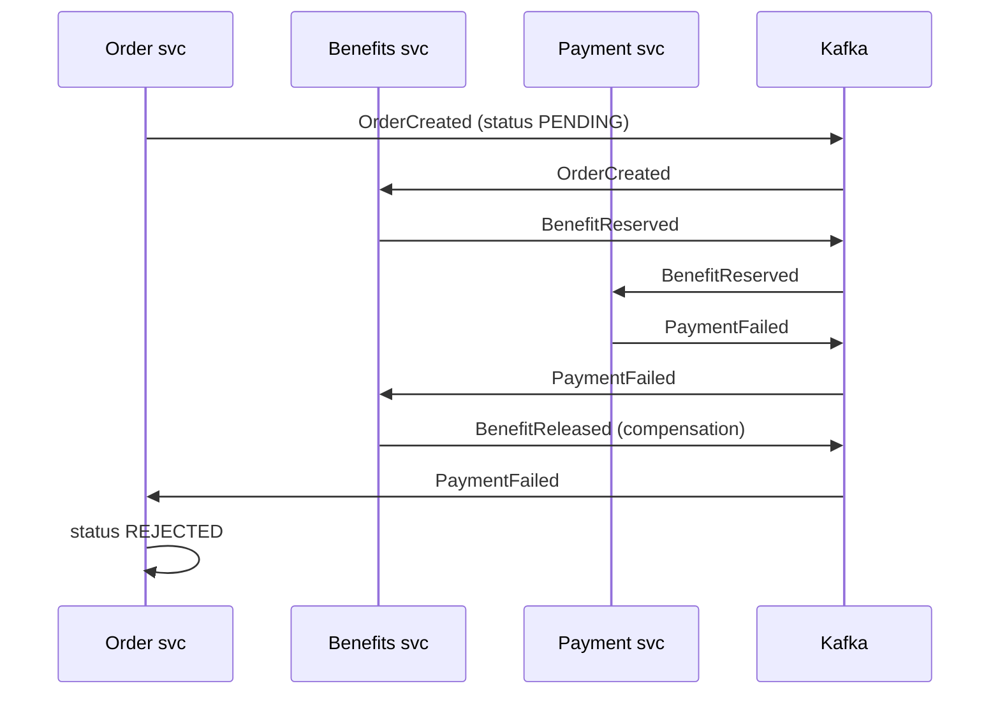
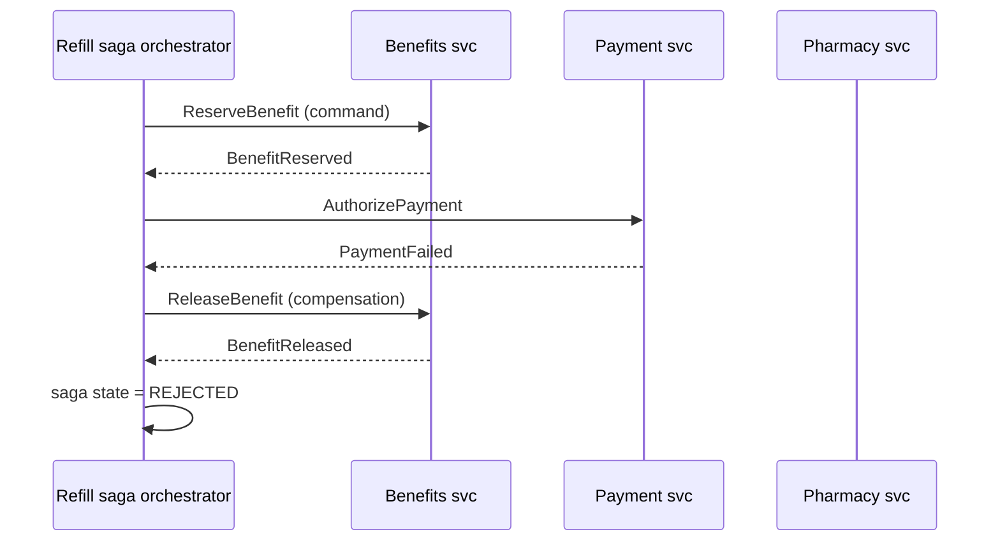
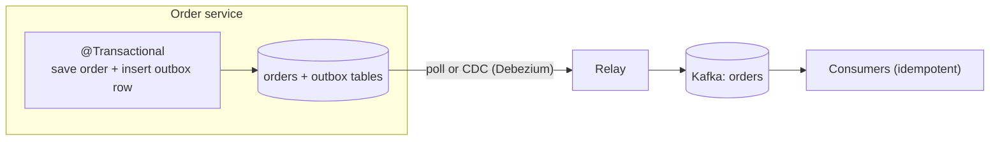

# Distributed Transactions: Saga (Choreography vs Orchestration), Outbox Pattern

!!! abstract "TL;DR"
    - With a database per service there is **no ACID transaction across services**. Two-phase commit (2PC/XA) exists but couples availability, holds locks across the network and isn't supported by most brokers and NoSQL stores. Avoid it.
    - A **saga** is a sequence of **local transactions**; each publishes an event or triggers the next step. If a step fails, earlier steps are undone by **compensating transactions** (semantic undo: refund, release, cancel).
    - **Choreography:** services react to each other's events, no coordinator. Simple for 2–4 steps, hard to follow beyond that. **Orchestration:** a coordinator tells each participant what to do and tracks state. Clearer, testable, a single place for the flow (Temporal, Camunda, or a state machine).
    - Sagas lack isolation (the I in ACID): other requests can see intermediate states. Countermeasures: **semantic locks** (status PENDING), commutative updates, re-reading values, ordering steps so risky ones come last (**pivot transaction**).
    - The **transactional outbox** solves the dual-write problem: write the business change and the event to an **outbox table in the same local transaction**; a relay (poller or CDC like Debezium) publishes it. Consumers must be **idempotent** because delivery is at-least-once.

## Why it matters

"Place a refill order" may need: create order (Order service), check eligibility and reserve benefit (Benefits service), authorise payment (Payment service), send to pharmacy (Pharmacy service). In a monolith this is one database transaction. Split across services with their own databases, any step can fail after earlier ones committed. Without a design, you get orders with no payment, charged members with no order, and inconsistent data that someone fixes by hand.

The second, quieter problem is the **dual write**: saving to your database and publishing to Kafka are two systems with no shared transaction. A crash between them loses the event or publishes an event for a change that rolled back.

## Core concepts

### Why not 2PC?

Two-phase commit has a coordinator ask all participants to prepare (lock and vote), then commit. Problems in microservices:

- **Availability coupling:** all participants and the coordinator must be up; a coordinator failure can leave participants blocked holding locks.
- **Latency and locks** held across network round trips.
- **Limited support:** Kafka transactions are Kafka-only; most NoSQL stores and HTTP APIs don't participate in XA.
- It works inside one infrastructure boundary (e.g. two XA-capable databases) but not as a general microservices pattern.

### Sagas

Defined by Garcia-Molina and Salem (1987) for long-lived transactions. Each step is a local ACID transaction; failures trigger compensations in reverse order.

Step types (Chris Richardson's terms):

- **Compensatable** steps: can be undone (reserve benefit → release benefit).
- **Pivot** transaction: the go/no-go point; after it, the saga must complete (e.g. payment captured).
- **Retriable** steps after the pivot: must eventually succeed (retry until done), e.g. notify pharmacy.

Design rule: put steps that are likely to fail **before** the pivot, and steps that can't be undone (send email, call external partner) **after** it.

### Choreography


*Notice there is no central place that knows the whole flow: each service knows which events it reacts to. That's loose coupling, but to understand the saga you must read every service.*

- Pros: no coordinator, services loosely coupled, natural fit for event-driven systems.
- Cons: flow is implicit and spread out, cyclic dependencies between services, hard to test end to end, hard to answer "what state is order 123 in?".

### Orchestration


*Notice the orchestrator holds the saga's state and the full sequence in one place, which makes it easy to monitor, test and change, at the cost of one more component that must be highly available.*

- Pros: explicit flow and state, easier to reason about, timeouts and retries in one place, no cyclic dependencies.
- Cons: risk of a "god service" holding business logic that belongs in participants; orchestrator must be durable and HA.
- Tools: **Temporal** (durable workflow code), **Camunda/Zeebe** (BPMN), **AWS Step Functions**, **Axon** sagas, or a persistent state machine in your own service.

### Isolation anomalies and countermeasures

Sagas are ACD, not ACID. Other transactions can see partial results:

- **Lost updates, dirty reads, fuzzy reads** across steps.
- **Countermeasures:** semantic lock (mark the record PENDING so others know it's in flight), commutative updates (increments instead of overwrites), pessimistic view (reorder steps to reduce risk), reread value before updating, version checks.

### The dual-write problem and the outbox


*Notice the event becomes durable in the same commit as the business change. If the commit fails there's no event; if it succeeds the relay will publish it eventually, possibly more than once.*

- **Outbox table** columns (Debezium convention): `id`, `aggregatetype` (routes to topic), `aggregateid` (message key → ordering per aggregate), `type`, `payload`.
- **Relay options:** polling publisher (simple, adds DB load and latency), or **CDC** from the transaction log (Debezium Outbox Event Router; low latency, no polling).
- Delete or archive published rows.
- **Inbox / idempotent consumer:** consumers record processed event ids (or use upserts keyed by natural ids) so redelivery has no extra effect.
- Alternatives: **listen to yourself** (publish first, update DB from your own consumer), or `@TransactionalEventListener(AFTER_COMMIT)` + retry (simpler but can still lose the event if the process dies after commit).

### Idempotency everywhere

Retries and at-least-once delivery mean every saga participant must handle duplicate commands/events: use a saga id + step as an idempotency key, check-and-record in the same local transaction.

## In practice: code & configuration

### Outbox in Spring Boot

=== "❌ Common mistake"
    ```java
    @Transactional
    public void placeOrder(PlaceOrder cmd) {
      Order o = orders.save(Order.pending(cmd));
      kafka.send("orders", o.id(), new OrderCreated(o.id()));  // dual write:
      // if commit fails after send -> event for a non-existent order
      // if process dies after commit, before send completes -> order with no event
    }
    ```

=== "✅ Correct approach"
    ```java
    @Entity @Table(name = "outbox")
    class OutboxEvent {
      @Id UUID id;
      String aggregatetype;   // "order" -> topic outbox.event.order (Debezium default) or custom routing
      String aggregateid;     // message key: keeps one order's events ordered
      String type;            // "OrderCreated"
      @Column(columnDefinition = "jsonb") String payload;
      Instant createdAt;
    }

    @Transactional
    public void placeOrder(PlaceOrder cmd) {
      Order o = orders.save(Order.pending(cmd));
      outbox.save(OutboxEvent.of("order", o.id(), "OrderCreated", json(new OrderCreated(o.id()))));
      // one local transaction: both or neither
    }
    ```

```json
{
  "name": "orders-outbox",
  "config": {
    "connector.class": "io.debezium.connector.postgresql.PostgresConnector",
    "table.include.list": "public.outbox",
    "transforms": "outbox",
    "transforms.outbox.type": "io.debezium.transforms.outbox.EventRouter",
    "topic.prefix": "rx"
  }
}
```

### Idempotent participant

```java
@KafkaListener(topics = "benefit-commands", groupId = "benefits-service")
@Transactional
public void on(ReserveBenefit cmd) {
  // processed_messages has a unique key on message_id: a duplicate insert fails -> skip
  if (!processed.tryInsert(cmd.messageId())) return;
  benefits.reserve(cmd.memberId(), cmd.orderId(), cmd.amount());   // semantic lock: status RESERVED
  outbox.save(OutboxEvent.of("benefit", cmd.orderId(), "BenefitReserved", json(cmd)));
}
```

### Orchestrator as a persisted state machine (sketch)

```java
enum RefillSagaState { STARTED, BENEFIT_RESERVED, PAYMENT_AUTHORIZED, SENT_TO_PHARMACY, COMPENSATING, REJECTED, COMPLETED }

@Transactional
public void on(PaymentFailed e) {
  RefillSaga saga = sagas.findById(e.sagaId()).orElseThrow();
  saga.transitionTo(COMPENSATING);
  outbox.save(command("benefit-commands", new ReleaseBenefit(saga.id(), saga.orderId())));
}
```

## Real-world usage

- **Uber** built Cadence (later Temporal) for durable workflow orchestration of long-running business processes; Temporal is now widely used for sagas.
- **Debezium's outbox router** is a common way to implement reliable event publishing from Postgres/MySQL/Oracle into Kafka.
- **E-commerce and travel booking** are the textbook saga domains (reserve hotel, flight, car; compensate on failure).
- **Healthcare and banking:** refunds, benefit reservations and claims adjustments are compensations, and they must be auditable. Some steps can't be undone (a dispensed prescription, a sent notification), which is why the pivot step and ordering matter. Ledgers are usually designed as append-only entries so compensation is a new reversing entry, never a delete.

## Trade-offs & production gotchas

| Option | Pros | Cons | Use when |
|---|---|---|---|
| 2PC / XA | Atomic across resources | Blocking, availability coupling, limited support | Rare: XA-capable resources inside one boundary |
| Choreographed saga | Loose coupling, no coordinator | Implicit flow, hard to monitor, cycles | 2–4 steps, simple flows |
| Orchestrated saga | Explicit flow and state, testable | Extra component, risk of logic centralisation | Complex/long flows, many steps, timeouts |
| Outbox + CDC | Reliable, low latency, no dual write | CDC infra (Debezium/Kafka Connect) | Reliable events from DB changes |
| Outbox + poller | Simple | DB polling load, latency | Low volume |
| AFTER_COMMIT listener + retry | Very simple | Event lost if process dies after commit | Non-critical events |

!!! warning "Gotcha: compensation is not rollback"
    You can't un-send an email or un-dispense medication. Compensations are business actions (send a correction, refund) and can themselves fail: make them retriable and idempotent, and alert when they exhaust retries.

!!! warning "Gotcha: no timeouts in sagas"
    A participant that never answers leaves the saga hanging. Orchestrators need per-step timeouts and a defined action (retry, compensate, escalate).

!!! warning "Gotcha: ordering of outbox events"
    Use the aggregate id as the Kafka key so one aggregate's events stay ordered. A poller that reads outbox rows in parallel can reorder them.

!!! question "Interview angle"
    Classic: "How do you handle a transaction across Order, Payment and Inventory?" Answer: saga (choose orchestration vs choreography with reasons), compensations, pivot ordering, isolation countermeasures, outbox for reliable events, idempotent participants, monitoring.

## How this connects to my experience

- **Where I used it:**
    - **OptumRx Meteor:** "Designed Kafka-based event-driven workflows with retry and DLQ handling" with MongoDB. Multi-step workflows over Kafka are choreographed sagas; retries and DLQs handle transient and permanent failures. *[confirm: whether any workflow needed compensating actions, and how events were published reliably after MongoDB writes (outbox, change streams, or publish-after-save with retry)]*
    - **Coriolis CCKM:** "Implemented automated key rotation workflows and HSM integrations." Rotation across a local store, a cloud KMS and an HSM is a saga: create new key version, distribute, switch, retire old, with compensation if a step fails mid-way. *[confirm how partial failures were handled]*
    - **Deloitte ConvergeHealth:** event-driven workflows on AWS (SQS/SNS, Lambda); Step Functions is AWS's orchestrator. *[confirm whether Step Functions was used]*
- **Talking points:**
    - "In MongoDB we kept a business change inside one document where possible, so the local step is atomic, then published an event for the next step." *[confirm]*
    - "Key rotation taught me that compensation must be designed up front: if the HSM step fails after the cloud KMS step, you need a defined way back, and every step must be safe to retry." *[confirm]*
    - "For new work I'd use the outbox with Debezium or MongoDB change streams for reliable events, and an orchestrator for flows longer than three steps."
- **Likely follow-up chain:** "How did your Kafka workflows keep data consistent?" → "What happens if the second step fails?" (compensation or retry to completion) → "How do you know the event was published?" (outbox/CDC) → "What about duplicates?" (idempotent consumers) → "Choreography or orchestration, why?"

## Interview questions

### Fundamentals

??? question "Q1. Why can't you use a normal transaction across microservices?"
    **Answer:** Each service owns its database; there's no shared transaction manager. Distributed 2PC is possible in theory but blocks on failures, couples availability and isn't supported by most brokers and NoSQL stores.

??? question "Q2. What is a saga?"
    **Answer:** A sequence of local transactions across services, where each step triggers the next; if one fails, previously completed steps are undone with compensating transactions.

??? question "Q3. Choreography vs orchestration?"
    **Answer:** Choreography: services react to events, no coordinator; loosely coupled but the flow is implicit. Orchestration: a coordinator sends commands and tracks state; explicit and testable but adds a component and risks centralising logic.

### Intermediate

??? question "Q4. What is a compensating transaction?"
    **Answer:** A business action that semantically undoes a completed step (refund, release reservation, cancel), recorded as a new action, not a database rollback. It must be idempotent and retriable.

??? question "Q5. What is the dual-write problem?"
    **Answer:** Writing to two systems (DB and broker) without a shared transaction: a failure between them loses the event or publishes one for a rolled-back change.

??? question "Q6. How does the transactional outbox work?"
    **Answer:** Write the event to an outbox table in the same local transaction as the business change; a relay (poller or CDC) publishes outbox rows to the broker and marks or deletes them. Delivery is at-least-once, so consumers are idempotent.

??? question "Q7. Polling publisher vs CDC for the outbox?"
    **Answer:** Polling is simple but adds DB load and latency and can reorder if parallel. CDC (Debezium) reads the transaction log: low latency, ordered per table, no polling, but needs Kafka Connect/Debezium infrastructure.

### Senior

??? question "Q8. What isolation problems do sagas have and how do you mitigate them?"
    **Answer:** Other transactions can see intermediate states (dirty reads, lost updates). Mitigate with semantic locks (PENDING status), commutative updates, rereading values, versioning, and ordering steps so failure-prone steps run before the pivot.

??? question "Q9. What is the pivot transaction?"
    **Answer:** The step after which the saga is committed to completing; steps after it must be retriable until they succeed. Steps before it are compensatable. Put risky steps before and irreversible ones after.

??? question "Q10. How do you make saga participants idempotent?"
    **Answer:** Use a message/saga-step id stored in a processed-messages table with a unique constraint, checked in the same local transaction as the change; or natural idempotency (upsert by key, state machine transitions that ignore repeats).

??? question "Q11. When would you choose Temporal or Step Functions over hand-written choreography?"
    **Answer:** Long-running flows with many steps, timeouts, human tasks or retries that need durable state and visibility; when "what state is this order in?" must be answerable and the flow changes often.

### Scenario-based

??? question "Q12. Design the refill flow across Order, Benefits, Payment and Pharmacy."
    **Answer:** Orchestrated saga: create order PENDING (semantic lock), reserve benefit (compensatable), authorise payment (pivot), send to pharmacy (retriable). On payment failure release the benefit and reject the order. Outbox for all events/commands, idempotent participants, per-step timeouts, saga state visible in a dashboard.

??? question "Q13. Customers occasionally have an order but no notification. What's likely wrong?"
    **Answer:** A dual write: order committed, event publish failed or happened before a rollback. Fix with outbox/CDC; add reconciliation (find orders without events) for existing data.

??? question "Q14. A compensation keeps failing (refund API down). What do you do?"
    **Answer:** Retry with backoff (compensations are retriable), keep the saga in COMPENSATING with alerts, park to a DLQ after limits for manual handling, and make the user-facing state honest ("refund pending").

## Cheat sheet

| Concept | Remember |
|---|---|
| No 2PC | Blocking, availability coupling, limited support |
| Saga | Local transactions + compensations (1987, Garcia-Molina & Salem) |
| Choreography | Events, no coordinator; fine for 2–4 steps |
| Orchestration | Coordinator + state; Temporal, Camunda, Step Functions |
| Step types | Compensatable → pivot → retriable |
| Isolation | Semantic lock, commutative updates, reread, ordering |
| Dual write | DB + broker without shared tx = lost or phantom events |
| Outbox | Event row in same local tx; relay publishes |
| Debezium columns | `id`, `aggregatetype`, `aggregateid`, `type`, `payload` |
| Default topic | `outbox.event.<aggregatetype>` |
| Consumers | At-least-once → idempotent (processed ids, upserts) |
| Compensation | Business undo, idempotent, retriable, auditable |

## Sources

1. [Saga pattern (microservices.io)](https://microservices.io/patterns/data/saga.html): choreography vs orchestration, compensations.
2. [Transactional outbox (microservices.io)](https://microservices.io/patterns/data/transactional-outbox.html): pattern, polling publisher, transaction log tailing.
3. [Debezium Outbox Event Router](https://debezium.io/documentation/reference/stable/transformations/outbox-event-router.html): table columns, routing to `outbox.event.<aggregatetype>`, key by aggregate id.
4. Hector Garcia-Molina & Kenneth Salem, ["Sagas" (SIGMOD 1987)](https://dl.acm.org/doi/10.1145/38713.38742): original definition.
5. Chris Richardson, *Microservices Patterns* (Manning, 2018), ch. 4: saga step types, isolation countermeasures.
6. [Temporal documentation](https://docs.temporal.io/): durable workflow orchestration.
7. [Spring Framework: transaction-bound events](https://docs.spring.io/spring-framework/reference/data-access/transaction/event.html): `@TransactionalEventListener` phases.
