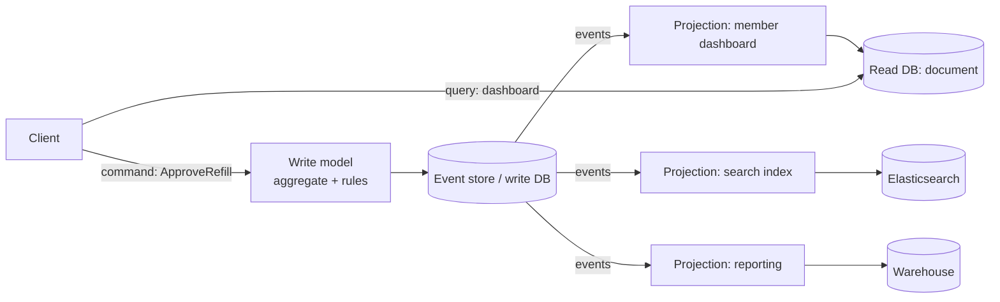
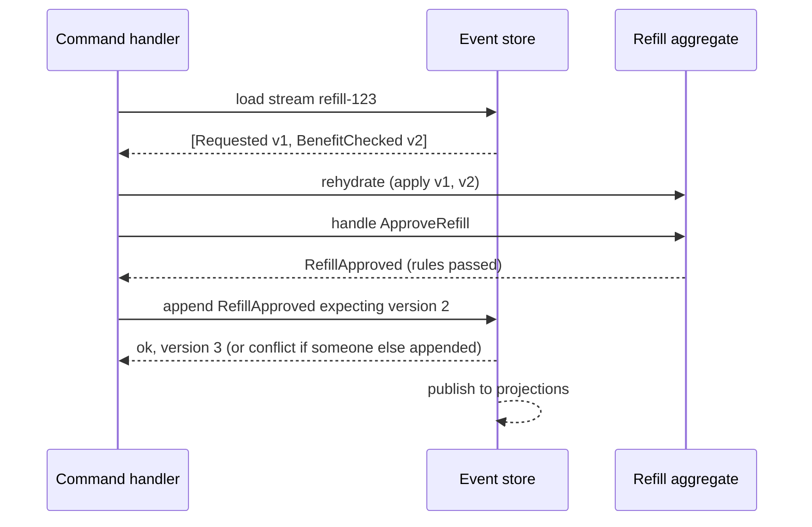

# CQRS & Event Sourcing

!!! abstract "TL;DR"
    - **CQRS (Command Query Responsibility Segregation):** use **different models for writes and reads**. Commands go to a write model that enforces rules; queries go to read models shaped for each screen or API, often in a different store, updated from events.
    - **Event sourcing:** instead of storing current state, store the **append-only sequence of events** that led to it (`RefillRequested`, `RefillApproved`). Current state = replay (fold) of events. You get a full audit trail and time travel.
    - They're **independent**: CQRS without event sourcing is common (read replicas, denormalised views, Elasticsearch fed by CDC). Event sourcing almost always needs CQRS, because querying an event log directly is impractical.
    - Costs: **eventual consistency** between write and read models, **event schema versioning forever**, replay/rebuild operations, snapshots for long streams, and a steeper learning curve.
    - Use them for **parts** of a system with real need (complex domain with audit requirements, very different read/write loads, many read shapes), not as a default architecture.

## Why it matters

In microservices, a screen often needs data owned by several services ("member with prescriptions, pharmacy names and claim status"). API composition at query time works until it's too slow or too chatty. CQRS lets you build a **read model** that already joins the data, fed by events from the owning services.

Separately, regulated domains need to answer "what was the state on 3 March and who changed it?". A state-only table answers "what is it now"; an event-sourced aggregate answers every point in time by design.


*Notice commands and queries take different paths. The write side is optimised for correctness, each read side for one way of looking at the data, and they're connected by events, so reads lag writes slightly.*

## Core concepts

### CQS → CQRS

- **CQS** (Bertrand Meyer): a method either changes state (command) or returns data (query), not both.
- **CQRS** (Greg Young, ~2010) applies this at the architecture level: separate models, possibly separate stores and services, for the two sides.

### CQRS levels

| Level | Description | Example |
|---|---|---|
| Separate code paths | Command handlers vs query services, same DB | Simple projections via SQL views |
| Separate read store | Read DB updated from write DB (replica, CDC, events) | Postgres → Elasticsearch via Debezium |
| Separate services | Query service owns read models built from many services' events | "Member 360" view over member, pharmacy, claims events |

### Event sourcing mechanics

- **Aggregate** (DDD): consistency boundary (one prescription, one account). Commands are validated against its current state.
- **Event store:** append-only, per-aggregate **stream**, events ordered by version. Append uses **optimistic concurrency**: "append if the stream is still at version N".
- **Rehydration:** load events for the stream and apply them in order to rebuild state (`state = events.fold(initial, apply)`).
- **Snapshots:** periodically store state at version N to avoid replaying thousands of events; load snapshot + later events.
- **Projections:** subscribers turn events into read models; can be rebuilt from scratch by replaying.
- Events are **immutable facts in past tense**; corrections are new events (`RefillApprovalReversed`), never edits.


*Notice the expected-version check: two concurrent commands on the same aggregate can't both succeed. That's optimistic concurrency without locks.*

### Event versioning

Events live forever, so schemas evolve:

- **Additive changes** (new optional fields) with tolerant readers.
- **Upcasting:** transform old event versions to the new shape when reading.
- **New event types** instead of changing the meaning of old ones.
- Avoid putting PHI/PII directly in immutable events where deletion may be required (GDPR right to erasure): use references, or **crypto-shredding** (encrypt per subject, delete the key).

### Consistency between sides

Read models lag writes (milliseconds to seconds). Handle it in UX: return the new state from the command response, read-your-own-writes by querying the write side for the user who just acted, version numbers in responses, or "processing" states.

### When to use and when not to

Use when:

- The domain is complex and behaviour-rich with strong audit/temporal needs (ledgers, claims adjudication, order lifecycles).
- Reads vastly outnumber writes and need different shapes/stores.
- Many consumers need the same changes (events are already the integration mechanism).

Avoid when:

- Simple CRUD with little logic.
- The team is new to it and the domain doesn't need it (the learning and ops cost is real).
- Strong read-after-write consistency is required everywhere.
- Applying it to the whole system instead of the one bounded context that benefits.

## In practice: code & configuration

### A tiny event-sourced aggregate (plain Java 21)

```java
sealed interface RefillEvent permits Requested, Approved, Rejected {}
record Requested(String refillId, String memberId, String ndc) implements RefillEvent {}
record Approved(String refillId, Instant at) implements RefillEvent {}
record Rejected(String refillId, String reason) implements RefillEvent {}

final class Refill {
  enum Status { NONE, REQUESTED, APPROVED, REJECTED }
  private Status status = Status.NONE;
  private long version = 0;

  static Refill rehydrate(List<RefillEvent> history) {
    Refill r = new Refill();
    history.forEach(r::apply);
    return r;
  }

  List<RefillEvent> approve(Instant now) {                // command -> new events, no mutation yet
    if (status != Status.REQUESTED) throw new IllegalStateException("cannot approve in " + status);
    return List.of(new Approved(id(), now));
  }

  void apply(RefillEvent e) {                               // state changes only through events
    status = switch (e) {
      case Requested r -> Status.REQUESTED;
      case Approved a -> Status.APPROVED;
      case Rejected x -> Status.REJECTED;
    };
    version++;
  }
  long version() { return version; }
  // ...
}
```

```java
@Transactional
public void approve(String refillId) {
  List<RefillEvent> history = store.load(refillId);
  Refill refill = Refill.rehydrate(history);
  List<RefillEvent> newEvents = refill.approve(clock.instant());
  store.append(refillId, refill.version(), newEvents);   // throws ConcurrencyException if version moved
}
```

### CQRS read model from events

=== "❌ Common mistake"
    ```java
    // Query endpoint composes 3 services synchronously for every dashboard load.
    public Dashboard dashboard(String memberId) {
      Member m = memberClient.get(memberId);
      List<Rx> rxs = pharmacyClient.prescriptions(memberId);
      List<Claim> cs = claimsClient.claims(memberId);   // slow, and fails if any is down
      return Dashboard.of(m, rxs, cs);
    }
    ```

=== "✅ Correct approach"
    ```java
    // Projection keeps a denormalised document up to date from events.
    @KafkaListener(topics = {"member-events", "rx-events", "claim-events"}, groupId = "dashboard-projection")
    public void on(DomainEvent e) {
      if (!processed.markIfFirst(e.eventId())) return;          // idempotent
      dashboards.upsert(e.memberId(), doc -> doc.apply(e));     // e.g. MongoDB document per member
    }

    // Query is a single key lookup on the read store.
    public DashboardView dashboard(String memberId) {
      return dashboards.findById(memberId).orElseThrow();
    }
    ```

## Real-world usage

- **Financial ledgers and accounting** are event-sourced by nature: entries are appended, never edited; balances are projections.
- **EventStoreDB** (by Greg Young), **Axon Framework/Server** (Java), and **Marten** (.NET on Postgres) are dedicated event-sourcing tools. Kafka is often used to distribute events but is not a great primary event store per aggregate (no per-stream optimistic concurrency, retention policies).
- **CQRS without event sourcing** is very common: write to Postgres, stream changes with Debezium into Elasticsearch or a document DB for search and dashboards.
- **Healthcare:** claims adjudication, prior authorisation and prescription lifecycles benefit from an immutable history ("who approved this, under which rules, when"). Audit regulations favour append-only histories, but erasure requirements mean sensitive data should be referenced or crypto-shredded rather than embedded in events.

## Trade-offs & production gotchas

| Option | Pros | Cons | Use when |
|---|---|---|---|
| CRUD, one model | Simple, consistent | Read/write conflicts, complex queries | Most services |
| CQRS (separate read store) | Fast tailored reads, scale independently | Eventual consistency, sync pipeline | Read-heavy, many views, cross-service views |
| Event sourcing + CQRS | Full history, audit, temporal queries, rebuildable projections | Versioning forever, complexity, snapshots, learning curve | Complex domains with audit/temporal needs |
| API composition (instead) | No duplication | Latency, availability coupling | Few services, low traffic |

!!! warning "Gotcha: projections that can't be rebuilt"
    Keep projections idempotent and rebuildable from offset 0 (or from the event store). Test a full rebuild before you need it in an incident.

!!! warning "Gotcha: Kafka as the event store"
    Kafka lacks per-aggregate streams with expected-version appends, and retention or compaction can delete history. Use a real event store or a DB table for the source of truth; publish to Kafka for integration.

!!! warning "Gotcha: leaking internal events"
    Domain events used for event sourcing are internal. Publish separate, stable integration events to other services, or every internal refactoring becomes a breaking change.

!!! question "Interview angle"
    Show that you know CQRS and event sourcing are separate, can explain projections, snapshots and versioning, and can say when not to use them.

## How this connects to my experience

Not ★. Position it through the read-model and audit needs in the projects.

- **Where I used it:**
    - **OptumRx Meteor:** the GraphQL Consumer Service composes data from 5 upstreams; Redis caching "for frequently accessed queries and UI reference data" is a lightweight read model. Kafka workflows produce events that could feed projections. *[confirm whether any service maintained a denormalised read model from Kafka events]*
    - **Deloitte ConvergeHealth:** "Implemented Elasticsearch-powered search capabilities" alongside RDS/DynamoDB: a classic CQRS read store fed from the system of record. *[confirm how the index was fed: batch, events or CDC]*
    - **Coriolis CCKM:** key lifecycle events (created, rotated, disabled, destroyed) are naturally an audit log; cloud KMS services expose them as audit trails. *[confirm whether key state was modelled as events or as a state table plus audit log]*
- **Talking points:**
    - "The Elasticsearch search at Deloitte was a CQRS read model: the database stayed the source of truth and search was a projection optimised for queries." *[confirm]*
    - "For an aggregation layer like the GraphQL service, a read model fed by events is the alternative to calling five upstreams per request; I'd use it for hot, cross-service screens." *[confirm or present as design reasoning]*
    - "I'd only use event sourcing where history is a business requirement, like claims or key lifecycle audit, not across the whole system."
- **Likely follow-up chain:** "Have you used CQRS?" (Elasticsearch read model *[confirm]*) → "How was it kept in sync?" → "What about consistency for users?" → "Would you event-source it? Why not?" → "How do you version events?"

## Interview questions

### Fundamentals

??? question "Q1. What is CQRS?"
    **Answer:** Separating the model that handles commands (writes, enforcing rules) from the models that serve queries (reads, shaped for consumers), often with separate stores synchronised via events.

??? question "Q2. What is event sourcing?"
    **Answer:** Persisting state as an append-only sequence of domain events; current state is derived by replaying them. Provides full history and audit.

??? question "Q3. Are CQRS and event sourcing the same thing?"
    **Answer:** No. CQRS can use a normal database on the write side. Event sourcing usually needs CQRS because querying event streams directly is impractical.

    **Common wrong answer:** treating them as one pattern.

### Intermediate

??? question "Q4. What is a projection?"
    **Answer:** A component that consumes events and builds a read model (table, document, index). It should be idempotent and rebuildable by replaying events.

??? question "Q5. Why do you need snapshots?"
    **Answer:** Aggregates with long histories become slow to rehydrate. A snapshot stores state at a version; loading = snapshot + events after it. Snapshots are an optimisation, not the source of truth.

??? question "Q6. How do you handle concurrency in an event store?"
    **Answer:** Optimistic concurrency: append with an expected stream version; if another writer appended first, the append fails and the command is retried or rejected.

??? question "Q7. How do you deal with eventual consistency in the UI?"
    **Answer:** Return the result/new version from the command, read-your-own-writes from the write side for the acting user, show pending states, or poll/push until the read model catches up.

### Senior

??? question "Q8. How do you version events?"
    **Answer:** Prefer additive, backward-compatible changes with tolerant readers; upcast old versions when reading; introduce new event types for changed meaning; never change the meaning of stored events; validate with schemas.

??? question "Q9. How do you handle GDPR/HIPAA deletion with immutable events?"
    **Answer:** Keep personal data out of events (store references), or encrypt per-subject data with a key you delete on request (crypto-shredding). Projections can be rebuilt without the data.

??? question "Q10. When should you not use event sourcing?"
    **Answer:** Simple CRUD domains, teams without experience and no strong need for history, requirements for immediate consistency on all reads, or as a system-wide default.

??? question "Q11. Why is Kafka a poor primary event store?"
    **Answer:** No per-aggregate streams with expected-version append, partitioning is not per aggregate, and retention/compaction can drop history. It's excellent for distributing events from a proper store.

### Scenario-based

??? question "Q12. A member dashboard calls 4 services and is slow. How would CQRS help?"
    **Answer:** Build a dashboard read model per member, updated by consuming events from the four services (or CDC), stored as one document. The query becomes one key lookup; staleness is seconds; rebuild from events when the model changes.

??? question "Q13. Auditors want to know the state of each claim on any date and who changed it. Design?"
    **Answer:** Event-source the claim aggregate: each change is an event with actor, timestamp and reason; state on a date = replay up to that date; projections for current status and reports; immutable storage with retention policy.

## Cheat sheet

| Concept | Remember |
|---|---|
| CQS | Method changes state or returns data, not both (Meyer) |
| CQRS | Separate write model and read models (Greg Young) |
| Event sourcing | State = fold of append-only events |
| Independent? | Yes; ES ⇒ usually CQRS, not vice versa |
| Concurrency | Append with expected version |
| Snapshots | Optimisation for long streams |
| Projections | Idempotent, rebuildable read models |
| Versioning | Additive, upcasting, new types; never edit stored events |
| Consistency | Read side lags; design UX for it |
| Privacy | References or crypto-shredding |
| Tools | EventStoreDB, Axon, Marten; Kafka for distribution |
| Avoid | Simple CRUD, system-wide default |

## Sources

1. [CQRS (Martin Fowler)](https://martinfowler.com/bliki/CQRS.html): definition, when it fits, warnings.
2. [Event Sourcing (Martin Fowler)](https://martinfowler.com/eaaDev/EventSourcing.html): mechanics, replay, snapshots.
3. [CQRS pattern](https://microservices.io/patterns/data/cqrs.html) and [Event sourcing pattern](https://microservices.io/patterns/data/event-sourcing.html) (microservices.io).
4. [CQRS Documents (Greg Young)](https://cqrs.files.wordpress.com/2010/11/cqrs_documents.pdf): original CQRS and event sourcing write-up.
5. [Axon Framework reference](https://docs.axoniq.io/): event-sourced aggregates, projections in Java.
6. [EventStoreDB documentation](https://developers.eventstore.com/): streams, expected version, projections.
7. [Azure Architecture Center: Event Sourcing pattern](https://learn.microsoft.com/en-us/azure/architecture/patterns/event-sourcing): issues and considerations, when not to use.
