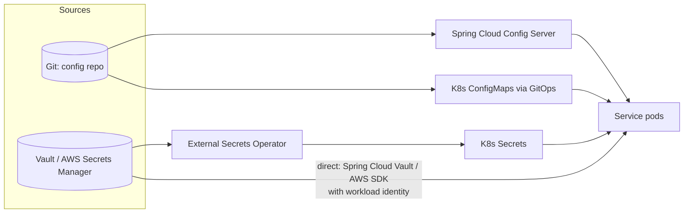
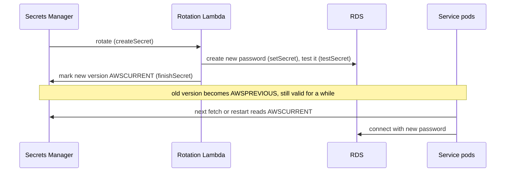

# Configuration & Secrets Management (Spring Cloud Config, Vault)

!!! abstract "Key takeaways"
    - **Externalise configuration** (12-factor): one immutable artifact promoted across environments; only config differs. Config lives in version control and is reviewed like code.
    - **Config ≠ secrets.** Config (timeouts, feature flags, URLs) can live in git/ConfigMaps. Secrets (DB passwords, API keys, private keys) belong in a **secret manager** (Vault, AWS Secrets Manager, Azure Key Vault, GCP Secret Manager) with access control, audit and rotation.
    - Options for delivery: **Spring Cloud Config Server** (git-backed, `spring.config.import=configserver:`), **Kubernetes ConfigMaps/Secrets** (env vars or mounted files), **direct secret-store integration** (Spring Cloud Vault, Spring Cloud AWS `aws-secretsmanager:`), or an operator syncing secrets into Kubernetes (**External Secrets Operator**, CSI driver).
    - **Kubernetes Secrets are only base64-encoded** by default; enable encryption at rest (KMS provider) and restrict RBAC, or keep the source of truth in a real secret manager.
    - Prefer **short-lived, dynamic credentials** (Vault database secrets, IAM roles / workload identity) over long-lived static ones. Plan **rotation** and how apps pick up new values (reload or rolling restart).

## Why it matters

Fifty services × four environments = two hundred configurations. Without discipline you get passwords in git, prod values in test, drift between pods, and "it works on QA" bugs. Secrets in particular are a top breach cause: leaked keys in repositories, images or logs. A Lead is expected to know where config and secrets live, who can read them, how they rotate, and how changes reach running services safely.


*Notice the two kinds of source (git for config, a secret manager for secrets) and the several delivery paths. Pick one consistent path per kind across the organisation.*

## Core concepts

### What belongs where

| Kind | Examples | Store | Change process |
|---|---|---|---|
| Build-time constants | Library versions | Code | Release |
| Environment config | URLs, timeouts, pool sizes, log levels | Git config repo / ConfigMaps / values files | PR + review, promoted per environment |
| Feature flags | Toggle new checkout | Flag service (LaunchDarkly, Unleash, Flagsmith) | Runtime, audited |
| Secrets | DB passwords, API keys, client secrets, TLS keys | Vault / cloud secret manager / HSM for keys | Access-controlled, audited, rotated |

### Spring Cloud Config

- A **Config Server** serves properties from a backend (git most commonly; also Vault, JDBC, S3, native filesystem) at `/{application}/{profile}/{label}`.
- Clients import it: `spring.config.import=optional:configserver:http://config:8888`.
- **Encryption:** `{cipher}...` values decrypted by the server with a symmetric key or keystore, so encrypted values can live in git (still prefer a secret manager for real secrets).
- **Refresh:** `@RefreshScope` beans and `@ConfigurationProperties` are re-bound on `/actuator/refresh`; **Spring Cloud Bus** (Kafka/RabbitMQ) broadcasts refresh to all instances; git webhooks trigger it.
- Make the config server **highly available**, and decide what happens if it's down at startup (fail fast vs `optional:` + local defaults).

### Kubernetes ConfigMaps and Secrets

- ConfigMaps for non-sensitive config; Secrets for sensitive values, both as **env vars** or **mounted files**.
- Mounted files update in place (eventually) when the object changes; env vars only change on pod restart. Spring Boot reads mounted files with `spring.config.import=configtree:/etc/secrets/`.
- Secrets are **base64, not encrypted**: enable etcd encryption at rest with a KMS provider, restrict RBAC (`get`/`list` on secrets is powerful), avoid printing env in logs.
- GitOps: config in git, Argo CD/Flux apply it; never commit plain Secrets: use Sealed Secrets, SOPS, or External Secrets Operator.

### HashiCorp Vault

- Central secret manager with **auth methods** (Kubernetes service account, AWS IAM, AppRole), **policies** per path, **audit log**.
- **KV engine** for static secrets (versioned).
- **Dynamic secrets:** the database engine creates a **unique, short-lived DB user per app instance** with a **lease**; Vault revokes it when the lease expires. A leaked credential is useless soon after and traceable to one instance.
- **Transit engine:** encryption as a service (app sends plaintext, gets ciphertext; keys never leave Vault).
- **PKI engine:** issue short-lived TLS certificates.
- **Spring Cloud Vault** authenticates (e.g. Kubernetes auth), reads secrets as property sources and can renew leases and rotate database credentials.

### Cloud secret managers

- **AWS Secrets Manager:** versioned secrets, **managed rotation** via a Lambda (built-in templates for RDS), KMS encryption, IAM policies, CloudTrail audit. **SSM Parameter Store** for cheaper config/simple secrets.
- **Azure Key Vault**, **GCP Secret Manager**: equivalent, integrated with managed identities.
- Best access pattern: **workload identity** (IAM roles for service accounts on EKS, Azure workload identity), so pods get short-lived cloud credentials without any static key.

### Rotation and refresh


*Notice there's an overlap period where both old and new credentials work. Rotation is safe only if apps pick up the new value before the old one is disabled.*

Ways apps pick up new secrets: periodic re-fetch with cache TTL, mounted-file watch, Vault lease renewal, or a rolling restart triggered by the change (Reloader-style controllers). Connection pools must re-authenticate (HikariCP picks up new credentials for new connections; long-lived connections keep working until recycled).

### Hygiene

- No secrets in git, images, build logs, environment dumps, or error messages; secret scanning in CI (gitleaks, GitHub secret scanning).
- Least privilege per service; separate secrets per environment; audit access.
- Mask secrets in Actuator (`/env` masks by default in Boot 3), never expose `/env` or `/configprops` publicly.

## In practice: code & configuration

=== "❌ Common mistake"
    ```yaml
    # application-prod.yml committed to git
    spring:
      datasource:
        url: jdbc:postgresql://prod-db:5432/rx
        username: rx_app
        password: Sup3rS3cret!          # in git history forever, shared by every pod, never rotated
    ```

=== "✅ Correct approach (Vault dynamic DB credentials)"
    ```yaml
    spring:
      config:
        import: vault://
      cloud:
        vault:
          uri: https://vault.internal:8200
          authentication: KUBERNETES          # pod's service account token, no static secret
          kubernetes:
            role: rx-service
          database:
            enabled: true
            role: rx-readwrite                 # Vault creates a short-lived DB user per instance
            backend: database
      datasource:
        url: jdbc:postgresql://prod-db:5432/rx
        # username/password injected by Spring Cloud Vault, lease renewed automatically
    ```

=== "✅ Alternative (AWS Secrets Manager + IRSA)"
    ```yaml
    spring:
      config:
        import: aws-secretsmanager:/rx/prod/db     # Spring Cloud AWS; pod uses an IAM role (IRSA)
    ```

### Config server client with refresh

```yaml
spring:
  application:
    name: graphql-consumer
  config:
    import: "optional:configserver:http://config-server:8888"
  cloud:
    config:
      fail-fast: true            # fail startup if required and unavailable (drop optional: then)
```

```java
@ConfigurationProperties("upstream.pharmacy")   // re-bound on refresh in Spring Cloud
record PharmacyProps(URI baseUrl, Duration readTimeout) {}
```

### External Secrets Operator syncing from AWS Secrets Manager

```yaml
apiVersion: external-secrets.io/v1      # older operator releases use v1beta1
kind: ExternalSecret
metadata:
  name: rx-db
spec:
  refreshInterval: 1h
  secretStoreRef:
    name: aws-secrets-manager
    kind: ClusterSecretStore
  target:
    name: rx-db                  # K8s Secret created/updated by the operator
  data:
    - secretKey: password
      remoteRef:
        key: /rx/prod/db
        property: password
```

## Real-world usage

- **Leaked credentials in public repos** are among the most common breach causes; GitHub runs push protection and secret scanning partly because of this.
- **Vault dynamic secrets** are widely used in banks and regulated companies so that every database credential is unique, short-lived and auditable.
- **EKS + IRSA / Azure workload identity** removed static cloud keys from pods in many organisations.
- **Healthcare (HIPAA)** and **PCI DSS** require access control, audit and key management for credentials and encryption keys; a secret manager with audit logs and rotation evidence makes compliance audits straightforward.

## Trade-offs & production gotchas

| Option | Pros | Cons | Use when |
|---|---|---|---|
| Spring Cloud Config (git) | Central, versioned, refresh + Bus | Another HA service, Spring-centric | Many Spring services, non-K8s or mixed |
| K8s ConfigMaps (GitOps) | Native, simple, auditable via git | Restart/watch to pick up changes | Kubernetes platforms |
| K8s Secrets alone | Native | Base64 only, RBAC risk, no rotation | Only with encryption at rest + external source |
| Vault | Dynamic secrets, PKI, transit, audit | Operate Vault (HA, unseal), learning curve | Multi-cloud, strict security |
| Cloud secret manager | Managed, rotation, IAM integration | Cloud-specific, per-call cost | Single-cloud workloads |

!!! warning "Gotcha: refresh that half-applies"
    `@RefreshScope` refreshes some beans but not connection pools or clients built at startup. For anything structural (pool sizes, URLs of clients), prefer a rolling restart; refresh is best for flags and simple values.

!!! warning "Gotcha: secret in env, printed by a crash or `/actuator/env`"
    Environment variables leak through process dumps, debug endpoints and logging frameworks. Mounted files or direct secret-store reads are safer; keep Actuator locked down.

!!! warning "Gotcha: config server as a single point of failure"
    If every pod fetches config at startup and the server is down, deploys and autoscaling fail. Run it HA, cache, or bake safe defaults.

!!! question "Interview angle"
    Expect: "how do you manage config across environments", "where do secrets live", "how are they rotated without downtime", and "are Kubernetes Secrets secure?".

## How this connects to my experience

- **Where I used it:**
    - **Deloitte ConvergeHealth:** "Integrated AWS Personalize recommendation services and implemented security controls using IAM, KMS, and Secrets Manager" and "Automated infrastructure provisioning … using Terraform." Direct, hands-on match. *[confirm: how services read secrets (SDK, Spring Cloud AWS, ECS secrets injection, or EKS with IRSA), and whether rotation was enabled]*
    - **Coriolis CCKM:** key management across AWS, Azure and GCP with HSMs: deep familiarity with keys, rotation and KMS concepts that underpin secret managers.
    - **OptumRx Meteor:** per-environment config for Kafka, MongoDB, Redis, PingFederate and 5 upstreams; OAuth2 client secrets for upstream calls. *[confirm: config mechanism (ConfigMaps, Spring Cloud Config, vault) and secret store]*
- **Talking points:**
    - "At Deloitte, credentials lived in Secrets Manager encrypted with KMS, and IAM policies decided which service could read which secret, so nothing sensitive was in the image or repo." *[confirm]*
    - "From CCKM I learned that rotation has to be automated and rehearsed; manual rotation is the one that breaks production." *[confirm]*
    - "I'd use dynamic, short-lived credentials (Vault DB engine or IAM auth for RDS) for anything new."
- **Likely follow-up chain:** "Where did your secrets live?" → "How did the app get them?" → "How were they rotated without downtime?" (dual-version window, pool recycle, restart) → "Are K8s Secrets secure?" (base64, encryption at rest, RBAC, external source) → "How do you stop secrets reaching git?" (scanning, pre-commit, push protection).

## Interview questions

### Fundamentals

??? question "Q1. Why externalise configuration?"
    **Answer:** So one immutable artifact runs in every environment, config changes don't need rebuilds, and environment differences are explicit and reviewable (12-factor).

    **Interviewer listens for:** one artifact across environments, no rebuild for config, explicit and reviewable differences.

    **Common wrong answer:** "So we can change anything in production without a deploy." Unreviewed runtime changes are a common cause of incidents.

??? question "Q2. Config vs secrets: why treat them differently?"
    **Answer:** Secrets grant access; they need encryption, least-privilege access, audit and rotation. Config can live in git and be reviewed openly.

    **Interviewer listens for:** access-granting nature, encryption, least privilege, audit, rotation.

    **Common wrong answer:** Storing secrets in the same git-backed config repo as ordinary properties.

??? question "Q3. Are Kubernetes Secrets encrypted?"
    **Answer:** Not by default: values are base64-encoded in etcd. Enable encryption at rest with a KMS provider, restrict RBAC, and preferably sync from an external secret manager.

    **Interviewer listens for:** base64 is encoding not encryption, etcd encryption with KMS, RBAC, external manager sync.

    **Common wrong answer:** "Yes, Kubernetes Secrets are encrypted." By default they are only base64-encoded.

### Intermediate

??? question "Q4. How does Spring Cloud Config work?"
    **Answer:** A config server serves properties from a backend (usually git) per application/profile/label; clients import it at startup (`configserver:`); `@RefreshScope` and Spring Cloud Bus allow runtime refresh; `{cipher}` values can be encrypted.

    **Interviewer listens for:** git backend, app/profile/label, configserver import, refresh scope and Bus, cipher values.

    **Common wrong answer:** Still using `bootstrap.yml` in Boot 3. Boot 2.4+ uses `spring.config.import`.

??? question "Q5. What are Vault dynamic secrets?"
    **Answer:** Credentials Vault generates on demand (e.g. a new DB user) with a lease and TTL, unique per client, revoked automatically at expiry. Limits blast radius and gives per-instance audit.

    **Interviewer listens for:** generated on demand, lease + TTL, per-client uniqueness, auto revoke, smaller blast radius.

    **Common wrong answer:** "Vault just stores passwords encrypted." Static storage is only part of it; dynamic secrets are the main value.

??? question "Q6. Env vars or mounted files for secrets?"
    **Answer:** Mounted files are generally safer (not inherited by child processes or dumped with the environment, can update without restart). Env vars are simpler but leak more easily and need a restart to change.

    **Interviewer listens for:** leakage paths for env vars, file updates without restart, trade-off with simplicity.

    **Common wrong answer:** "Environment variables are secure because they are not on disk." They leak via child processes, crash dumps and `/proc`.

??? question "Q7. What is workload identity?"
    **Answer:** Pods authenticate to the cloud with short-lived credentials tied to their service account (IRSA on EKS, Azure workload identity, GKE workload identity), so no static access keys exist.

    **Interviewer listens for:** short-lived federated credentials tied to a service account, no static keys.

    **Common wrong answer:** Putting AWS access keys in a Kubernetes Secret and calling it workload identity.

### Senior

??? question "Q8. How do you rotate a database password without downtime?"
    **Answer:** Create the new credential while the old remains valid (dual-version window), switch the secret's current version, let apps pick it up (refresh or rolling restart, pool recycles connections), verify, then revoke the old. Managed rotation (AWS) follows create/set/test/finish steps. Better: dynamic credentials with leases.

    **Interviewer listens for:** dual-valid window, switch current version, apps pick up, verify, revoke old, dynamic credentials.

    **Common wrong answer:** "Change the password in the database, then update the secret." Every running pod fails between the two steps.

??? question "Q9. When is runtime refresh a bad idea?"
    **Answer:** For values baked into objects at startup (connection pools, HTTP clients, thread pools) and for changes that must be consistent across pods. Rolling restarts are safer and easier to audit; refresh suits flags and simple values.

    **Interviewer listens for:** objects built at startup, cross-pod consistency, rolling restarts are auditable.

    **Common wrong answer:** "`@RefreshScope` everything." Refreshing a connection pool bean mid-traffic can drop in-flight work.

??? question "Q10. How do you prevent secrets from reaching git or logs?"
    **Answer:** Pre-commit and CI secret scanning, repository push protection, no secrets in config files, masking in logs and Actuator, code review checklist, and rotate immediately on any leak (assume compromised).

    **Interviewer listens for:** scanning in pre-commit and CI, push protection, masking, rotate on leak.

    **Common wrong answer:** "Delete the file and force-push." The secret is already in clones, forks and scraper caches.

### Scenario-based

??? question "Q11. A developer accidentally committed an API key to a public repo. What do you do?"
    **Answer:** Revoke/rotate the key immediately (removing the commit isn't enough; it's already scraped), check access logs for misuse, purge history if needed, add scanning/push protection, and move the secret to a manager.

    **Interviewer listens for:** rotate first, check misuse, purge history second, add prevention.

    **Common wrong answer:** Rewriting git history first and rotating later, which leaves a live key exposed.

??? question "Q12. Design secret management for 40 Spring Boot services on EKS in a HIPAA environment."
    **Answer:** AWS Secrets Manager (or Vault) as source of truth with KMS encryption; IRSA per service with least-privilege policies; External Secrets Operator or Spring Cloud AWS for delivery; automated rotation with tested pickup; CloudTrail audit; etcd encryption; secret scanning in CI; config in git via GitOps.

    **Interviewer listens for:** central manager + KMS, per-service IRSA, delivery mechanism, rotation, audit, etcd encryption, CI scanning, GitOps config.

    **Common wrong answer:** One shared IAM role or one shared secret for all 40 services, which breaks least privilege and audit.

## Cheat sheet

| Concept | Remember |
|---|---|
| 12-factor | One artifact, config in environment |
| Config vs secrets | Git/ConfigMaps vs secret manager |
| Spring Cloud Config | Git-backed server, `configserver:` import, `{cipher}`, refresh + Bus |
| K8s Secrets | Base64 only; encrypt at rest (KMS), RBAC, external source |
| Files vs env | Files safer, update without restart; env needs restart |
| Boot | `configtree:` for mounted files; `/env` masked by default in Boot 3 |
| Vault | Auth methods, policies, KV, **dynamic secrets with leases**, transit, PKI |
| AWS | Secrets Manager + rotation Lambda (create/set/test/finish), SSM Parameter Store |
| Identity | IRSA / workload identity: no static keys |
| Rotation | Dual-version window, pickup, revoke old |
| Delivery | External Secrets Operator, CSI driver, Spring Cloud Vault/AWS |
| Hygiene | Scanning, least privilege, audit, never in images/logs |

## Sources

1. [The Twelve-Factor App: Config](https://12factor.net/config): config in the environment.
2. [Spring Cloud Config reference](https://docs.spring.io/spring-cloud-config/reference/): server backends, client import, encryption, refresh.
3. [Kubernetes: Secrets](https://kubernetes.io/docs/concepts/configuration/secret/) and [Encrypting confidential data at rest](https://kubernetes.io/docs/tasks/administer-cluster/encrypt-data/): base64, encryption at rest.
4. [Vault: Database secrets engine](https://developer.hashicorp.com/vault/docs/secrets/databases): dynamic credentials and leases.
5. [Spring Cloud Vault reference](https://docs.spring.io/spring-cloud-vault/reference/): Kubernetes auth, database credentials, lease renewal.
6. [AWS Secrets Manager: rotation](https://docs.aws.amazon.com/secretsmanager/latest/userguide/rotating-secrets.html): rotation steps and versions.
7. [External Secrets Operator](https://external-secrets.io/latest/): syncing external secret stores to Kubernetes.
8. [Spring Cloud AWS: Secrets Manager integration](https://docs.awspring.io/spring-cloud-aws/docs/3.0.0/reference/html/index.html#secrets-manager-integration): `aws-secretsmanager:` config import.
