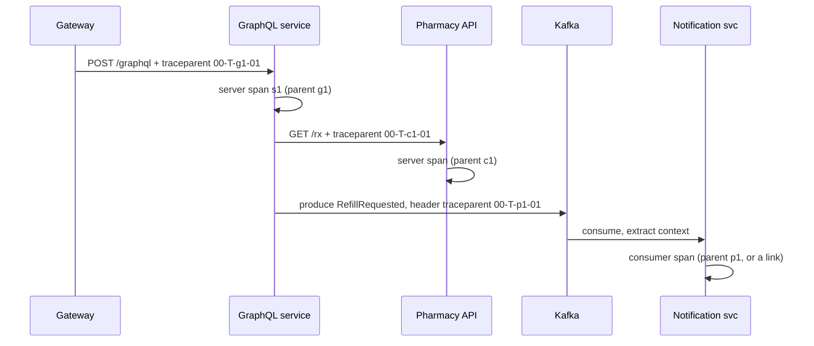
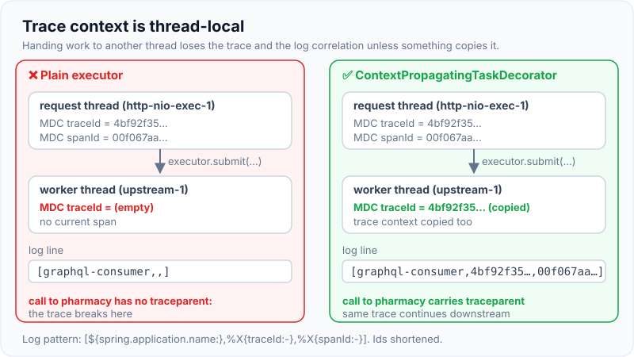

# Distributed Tracing & Correlation IDs

!!! abstract "Key takeaways"
    - A **trace** is the whole journey of one request; it is made of **spans** (one unit of work each: an HTTP call, a DB query, a Kafka publish), linked by parent/child ids. Traces show **where time goes and where errors happen** across services.
    - **Context propagation** carries the trace id between services. The standard is **W3C Trace Context**: `traceparent: 00-<32-hex trace-id>-<16-hex parent-id>-<flags>` plus optional `tracestate`. For Kafka the same values travel in **record headers**.
    - **OpenTelemetry (OTel)** is the vendor-neutral standard for traces, metrics and logs (APIs, SDKs, OTLP protocol, Collector). Spring Boot 3 uses **Micrometer Tracing** with an OTel or Brave bridge; the old Spring Cloud Sleuth is replaced.
    - **Correlation ids in logs:** put `traceId`/`spanId` in the logging MDC so every log line links to the trace. Boot 3 does this automatically when tracing is on.
    - **Sampling** keeps cost down: head-based (decide at the start, Boot default probability **0.1**) or tail-based in the Collector (keep all errors and slow traces). Never put PHI or high-cardinality data in span attributes or baggage you don't control.

## Why it matters

A member reports "the prescriptions page was slow". The request went gateway → GraphQL service → 5 upstreams in parallel → Redis → MongoDB, and one Kafka event triggered more work. Logs exist in seven places with no shared key; metrics show p99 rose but not why. Without tracing, an incident becomes guesswork and finger-pointing between teams.

```mermaid
gantt
    title One trace (trace id 4bf92f35...)
    dateFormat  X
    axisFormat %L ms
    section Gateway
    gateway /graphql           :0, 820
    section GraphQL service
    resolve query              :20, 790
    section Upstreams
    member-api GET             :40, 120
    pharmacy-api GET           :40, 760
    claims-api GET             :40, 210
    section Data
    redis GET refdata          :30, 35
```


*Notice how the waterfall answers the question instantly: the request took 820 ms because pharmacy-api took 720 ms; the other calls ran in parallel and finished early.*

## Core concepts

### Vocabulary

| Term | Meaning |
|---|---|
| Trace | All spans for one request, sharing a **trace id** (16 bytes) |
| Span | One operation: name, start/end time, **span id** (8 bytes), parent span id, attributes, events, status |
| Root span | First span in the trace (usually at the edge) |
| Span kind | SERVER, CLIENT, PRODUCER, CONSUMER, INTERNAL |
| Context | Trace id + span id + flags carried in-process and across boundaries |
| Propagator | Injects/extracts context to/from carriers (HTTP headers, message headers) |
| Baggage | User-defined key-values propagated with the context (e.g. tenant). Travels to every downstream service: keep it small and non-sensitive |
| Exporter | Sends spans to a backend (OTLP to Collector, Zipkin, Jaeger, vendor) |

### W3C Trace Context

```
traceparent: 00-4bf92f3577b34da6a3ce929d0e0e4736-00f067aa0ba902b7-01
             ^^ ^^^^^^^^^^^^^^^^^^^^^^^^^^^^^^^^ ^^^^^^^^^^^^^^^^ ^^
          version        trace-id (32 hex)       parent-id (16)  flags (01 = sampled)
tracestate: vendor1=opaque,vendor2=opaque
```

- W3C Recommendation since November 2021; the default in OpenTelemetry and Spring Boot 3.
- Older format: **B3** (Zipkin), `X-B3-TraceId` etc. Gateways and meshes may need to translate during migrations.

### Propagation


*Notice the trace id T stays the same everywhere; each hop gets a new span id and records its parent. Messaging needs the same treatment through record headers, or the trace breaks at the broker.*

- **HTTP:** instrumented clients/servers inject and extract headers automatically (use the Boot-provided `RestClient.Builder`/`WebClient.Builder`, not `new RestTemplate()`).
- **Messaging:** Spring Kafka observation (`spring.kafka.template.observation-enabled`, `spring.kafka.listener.observation-enabled`) adds/reads headers. For batch consumers or fan-in, use **span links** rather than one parent.
- **Thread hops:** context is thread-local; `@Async`, executors and reactive code need context propagation (`ContextPropagatingTaskDecorator`, Reactor `Hooks.enableAutomaticContextPropagation()`).
- **Gateway/mesh:** should preserve incoming headers and start a root span if none exists. Don't trust client-provided sampling decisions blindly at public edges.

{ loading=lazy }
*Notice the request itself is identical on both sides. Only the executor decides whether the worker thread's logs and outgoing calls stay in the trace.*

### OpenTelemetry architecture

- **API** (stable interfaces), **SDK** (sampling, processing, exporting), **instrumentation** (Java agent auto-instruments 100+ libraries, or library instrumentation), **OTLP** (wire protocol), **Collector** (receive, process, sample, export to any backend).
- Backends: Jaeger, Grafana Tempo, Zipkin, Elastic, Datadog, New Relic, Dynatrace, AWS X-Ray (via ADOT), Azure Monitor.
- Same context also correlates **logs** (trace id in log records) and **metrics** (exemplars link a latency bucket to an example trace).

### Spring Boot 3

- `micrometer-tracing-bridge-otel` (or `-brave`) + an exporter (`opentelemetry-exporter-otlp` or `zipkin-reporter-brave`).
- **Observation API**: one instrumentation produces a timer metric and a span; `@Observed` for your own methods.
- Defaults: W3C propagation, `management.tracing.sampling.probability=0.1`, trace/span ids added to log MDC (shown in log pattern via `logging.pattern.correlation`).
- Alternative: run the **OpenTelemetry Java agent** with zero code changes; or the OpenTelemetry Spring Boot starter.

### Sampling

| Type | How | Pros | Cons |
|---|---|---|---|
| Head-based probability | Decide at root (e.g. 10%), propagate decision | Cheap, consistent | Misses rare errors |
| Parent-based | Follow the parent's decision | Whole traces kept or dropped together | Depends on upstream |
| Rate-limited | N traces/second | Predictable cost | Uneven coverage |
| Tail-based (Collector) | Decide after trace completes: keep errors, slow, specific routes | Keeps the interesting traces | Collector must buffer all spans; more infra |

{ loading=lazy }
*Notice that head sampling has to decide before it knows how the trace ends, so the traces you most want are the ones it usually drops.*

### Correlation ids without full tracing

Even without a tracing backend, generate or accept a request id at the edge, put it in MDC, return it in responses (`X-Request-Id`), pass it downstream and in message headers. With tracing, the **trace id is the correlation id**; avoid inventing a second one unless an external contract requires it.

## In practice: code & configuration

```xml
<dependency>
  <groupId>io.micrometer</groupId>
  <artifactId>micrometer-tracing-bridge-otel</artifactId>
</dependency>
<dependency>
  <groupId>io.opentelemetry</groupId>
  <artifactId>opentelemetry-exporter-otlp</artifactId>
</dependency>
```

```yaml
management:
  tracing:
    sampling:
      probability: 0.1                 # head sampling; tail sampling in the Collector for errors
  otlp:
    tracing:
      endpoint: http://otel-collector:4318/v1/traces
spring:
  kafka:
    template.observation-enabled: true
    listener.observation-enabled: true
logging:
  pattern:
    correlation: "[${spring.application.name:},%X{traceId:-},%X{spanId:-}] "
```

=== "❌ Common mistake"
    ```java
    // Client built by hand: no instrumentation, trace stops here.
    RestTemplate rt = new RestTemplate();

    // Work handed to a plain executor: MDC and trace context lost on the new thread.
    executor.submit(() -> pharmacy.fetch(id));

    // Member id as a span attribute or baggage: PHI in the tracing backend, unbounded cardinality.
    span.tag("memberId", memberId);
    ```

=== "✅ Correct approach"
    ```java
    @Bean
    RestClient pharmacy(RestClient.Builder builder) {          // Boot-provided builder is observed
      return builder.baseUrl("http://pharmacy-service").build();
    }

    @Bean
    ThreadPoolTaskExecutor upstreamExecutor() {
      var ex = new ThreadPoolTaskExecutor();
      ex.setTaskDecorator(new ContextPropagatingTaskDecorator()); // carries trace + MDC to worker threads
      return ex;
    }

    @Observed(name = "refill.eligibility", contextualName = "check-eligibility",
              lowCardinalityKeyValues = {"plan.type", "commercial"})  // low-cardinality only
    public Eligibility check(String rxId) { ... }
    ```

### OpenTelemetry Collector with tail sampling (sketch)

```yaml
processors:
  tail_sampling:
    decision_wait: 10s
    policies:
      - name: errors
        type: status_code
        status_code: { status_codes: [ERROR] }
      - name: slow
        type: latency
        latency: { threshold_ms: 1000 }
      - name: baseline
        type: probabilistic
        probabilistic: { sampling_percentage: 5 }
```

## Real-world usage

- **Google's Dapper** paper (2010) introduced the trace/span model used by Zipkin (Twitter), Jaeger (Uber) and OpenTelemetry.
- **OpenTelemetry** (merger of OpenTracing and OpenCensus, CNCF) is the de facto standard; tracing is stable across major languages.
- Teams typically combine **RED metrics** for alerting, **traces** for "where", and **logs** for "why", linked by trace id.
- **Healthcare/banking:** tracing backends are often third-party SaaS; keep PHI/PII out of span names, attributes, baggage and URLs (template paths like `/members/{id}` instead of raw URLs), and set retention and access controls.

## Trade-offs & production gotchas

| Option | Pros | Cons | Use when |
|---|---|---|---|
| Correlation id in logs only | Cheap, simple | No timing breakdown, manual searching | Small systems, first step |
| Micrometer Tracing (Boot 3) | Native, Observation API, metrics + traces | Spring-specific config | Spring Boot services |
| OTel Java agent | Zero code, broad library coverage | Agent overhead, version alignment | Mixed stacks, quick adoption |
| Head sampling | Cheap | Loses rare failures | High volume |
| Tail sampling | Keeps errors and slow traces | Collector memory and complexity | Production debugging matters |

!!! warning "Gotcha: broken traces at async boundaries"
    Thread pools, `CompletableFuture`, reactive operators and Kafka are where traces break. Use instrumented executors, Reactor context propagation, and Kafka observation.

!!! warning "Gotcha: high-cardinality span names"
    `GET /members/12345` as a span name creates millions of names. Use route templates (`GET /members/{id}`); put ids (if allowed) in attributes, never in names.

!!! warning "Gotcha: sampling inconsistency"
    If services sample independently, you get fragments. Use parent-based sampling so the root's decision is followed downstream.

!!! question "Interview angle"
    Explain trace vs span, how context propagates (headers, W3C format, Kafka headers, thread hops), sampling trade-offs, and how traces link to logs and metrics. Bonus: PHI hygiene in telemetry.

## How this connects to my experience

- **Where I used it:**
    - **OptumRx Meteor:** the GraphQL Consumer Service fans out to 5 upstreams and Kafka workflows with retry/DLQ; following a request through those hops needs trace context in HTTP and Kafka headers. *[confirm: tracing tool (Micrometer Tracing/OTel, Sleuth, Dynatrace, Datadog, Splunk APM…), whether trace ids were in logs, and whether Kafka headers carried context]*
    - **Production support** ("Led … release management, and production support") is where tracing pays off. *[confirm an incident where tracing or correlation ids helped]*
    - **Deloitte ConvergeHealth:** Lambda/ECS on AWS, where X-Ray or ADOT is the typical tracing path. *[confirm]*
- **Talking points:**
    - "In an aggregation layer, the first question in any latency incident is 'which upstream?'. Traces answer that in one view." *[confirm usage]*
    - "We propagated the correlation id into Kafka headers so a message could be followed through retry topics to the DLQ." *[confirm]*
    - "Telemetry in healthcare must be PHI-free: route templates, no member ids in tags, controlled retention."
- **Likely follow-up chain:** "How did you debug a slow request across services?" → "How does the trace id get to the next service?" → "And through Kafka?" → "What about async threads?" → "How much do you sample, and how do you keep errors?"

## Interview questions

### Fundamentals

??? question "Q1. What is distributed tracing?"
    **Answer:** Recording the path and timing of a request across services as a trace made of spans, linked by a shared trace id and parent span ids, to see where time is spent and where errors occur.

    **Interviewer listens for:** trace and spans, trace id + parent ids, where time and errors are.

    **Common wrong answer:** "It is centralised logging." Logs do not show causality and timing across hops by themselves.

??? question "Q2. Trace vs span?"
    **Answer:** A trace is the whole request journey; a span is one operation within it with its own id, parent id, timing, attributes and status.

    **Interviewer listens for:** whole journey vs one operation, span ids, parent, timing, attributes, status.

    **Common wrong answer:** "A span is one service." One service usually creates several spans (server, DB, client calls).

??? question "Q3. How is context passed between services?"
    **Answer:** In headers: W3C `traceparent` (version, trace id, parent span id, flags) and optional `tracestate`, injected by the client and extracted by the server; in message headers for Kafka.

    **Interviewer listens for:** W3C traceparent fields, inject/extract, message headers for async.

    **Common wrong answer:** "The trace id is passed in the request body." It belongs in headers so any protocol and proxy can carry it.

### Intermediate

??? question "Q4. What is OpenTelemetry?"
    **Answer:** A CNCF standard and toolkit (API, SDKs, auto-instrumentation, OTLP protocol, Collector) for traces, metrics and logs, vendor-neutral, replacing OpenTracing and OpenCensus.

    **Interviewer listens for:** vendor neutral API/SDK/OTLP/Collector, three signals, replaced OpenTracing and OpenCensus.

    **Common wrong answer:** "OpenTelemetry is a tracing backend like Jaeger." It produces and ships telemetry; it does not store or show it.

??? question "Q5. How does tracing work in Spring Boot 3?"
    **Answer:** Micrometer Tracing with an OTel or Brave bridge plus an exporter; Observation API instruments HTTP server/client, Kafka, etc.; W3C propagation; sampling property; trace ids in MDC. Sleuth is not used with Boot 3.

    **Interviewer listens for:** Micrometer Tracing + bridge, Observation API, exporter, sampling property, MDC, no Sleuth.

    **Common wrong answer:** "Add Spring Cloud Sleuth." Sleuth does not support Boot 3.

??? question "Q6. Why do traces break, and where?"
    **Answer:** At uninstrumented clients, thread hops (executors, `@Async`, reactive), message brokers without header propagation, and proxies that drop headers.

    **Interviewer listens for:** uninstrumented clients, thread hops, broker headers, header-dropping proxies.

    **Common wrong answer:** "The tracing backend is losing spans." Usually context was never propagated across that hop.

??? question "Q7. What is baggage and what's the risk?"
    **Answer:** Key-values propagated with the context to all downstream services. Useful for tenant/region; risky because it travels everywhere (size, privacy). Never PHI or secrets.

    **Interviewer listens for:** propagated everywhere, size and privacy cost, never PHI or secrets.

    **Common wrong answer:** Treating baggage as span attributes. Baggage travels to every downstream service and third party.

### Senior

??? question "Q8. Head-based vs tail-based sampling?"
    **Answer:** Head decides at the start (cheap, consistent, but misses rare errors). Tail decides after the trace completes in the Collector (keeps errors and slow traces) at the cost of buffering and infrastructure.

    **Interviewer listens for:** decision time, cost, missed rare errors vs buffering in the Collector.

    **Common wrong answer:** "Sample 1% and you will still see errors." At 1% head sampling you keep only 1% of the rare failures too.

??? question "Q9. How do you trace through Kafka with batches?"
    **Answer:** Producer injects context into record headers; consumer extracts it. For batch or fan-in processing, a single parent doesn't fit, so use span links to each message's context.

    **Interviewer listens for:** header injection/extraction, span links for batches and fan-in.

    **Common wrong answer:** Making the first message of a batch the parent of everything, which hides the other traces.

??? question "Q10. How do traces, metrics and logs work together?"
    **Answer:** Metrics alert (RED, saturation), traces locate (which service/hop), logs explain (details). Linked by trace id in logs and exemplars on metrics.

    **Interviewer listens for:** metrics alert, traces locate, logs explain, linked by trace id and exemplars.

    **Common wrong answer:** "With good tracing we do not need metrics." Sampled traces are bad at counting and alerting.

### Scenario-based

??? question "Q11. p99 latency of the GraphQL endpoint doubled. How do you find the cause?"
    **Answer:** Check per-upstream latency metrics; open exemplar or slow traces for the endpoint; the waterfall shows which span grew (an upstream, Redis, a lock); drill into that service's logs via trace id; compare with deploys and traffic.

    **Interviewer listens for:** per-upstream metrics, exemplars, waterfall, trace-id log drill-down, correlate with deploys.

    **Common wrong answer:** Reading through logs of every service by timestamp without using the trace waterfall.

??? question "Q12. Your tracing backend is a SaaS vendor and you handle PHI. What rules do you set?"
    **Answer:** No PHI in span names, attributes, baggage, logs sent to the vendor; route templates not raw URLs; attribute allow-lists in the Collector (redaction processors); BAA with the vendor if needed; retention limits and access control.

    **Interviewer listens for:** no PHI in names, attributes, baggage; route templates; Collector redaction; BAA; retention and access.

    **Common wrong answer:** "The vendor is SOC 2 compliant, so PHI is fine." HIPAA needs a BAA and data minimisation.

## Cheat sheet

| Concept | Remember |
|---|---|
| Trace / span | Journey / one operation; trace id 16 bytes, span id 8 bytes |
| traceparent | `00-<32hex>-<16hex>-<2hex flags>`; W3C Rec. Nov 2021 |
| B3 | Older Zipkin headers |
| Span kinds | SERVER, CLIENT, PRODUCER, CONSUMER, INTERNAL |
| OTel | API, SDK, agent, OTLP, Collector; vendor-neutral |
| Boot 3 | Micrometer Tracing + OTel/Brave bridge; Sleuth replaced; sampling 0.1 |
| Kafka | Context in record headers; observation-enabled; links for batches |
| Threads | ContextPropagatingTaskDecorator; Reactor automatic context propagation |
| Logs | traceId/spanId in MDC |
| Sampling | Head (cheap) vs tail (keeps errors/slow) |
| Names | Route templates, low cardinality |
| Privacy | No PHI in names, attributes, baggage |

## Sources

1. [W3C Trace Context](https://www.w3.org/TR/trace-context/): `traceparent`/`tracestate` format; Recommendation (Nov 2021).
2. [OpenTelemetry: Traces](https://opentelemetry.io/docs/concepts/signals/traces/) and [Context propagation](https://opentelemetry.io/docs/concepts/context-propagation/): spans, kinds, propagation, baggage.
3. [OpenTelemetry: Sampling](https://opentelemetry.io/docs/concepts/sampling/): head and tail sampling.
4. [Spring Boot reference: Tracing](https://docs.spring.io/spring-boot/reference/actuator/tracing.html): Micrometer Tracing, bridges, sampling, log correlation.
5. [Micrometer Observation](https://docs.micrometer.io/micrometer/reference/observation.html): Observation API, low/high cardinality key values.
6. [Spring for Apache Kafka: Observation](https://docs.spring.io/spring-kafka/reference/kafka/micrometer.html): observation-enabled template and listeners.
7. Benjamin H. Sigelman et al., ["Dapper, a Large-Scale Distributed Systems Tracing Infrastructure" (Google, 2010)](https://research.google/pubs/dapper-a-large-scale-distributed-systems-tracing-infrastructure/): origin of the span model.
