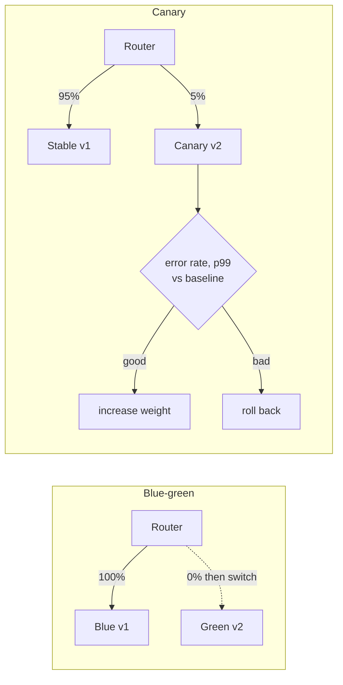
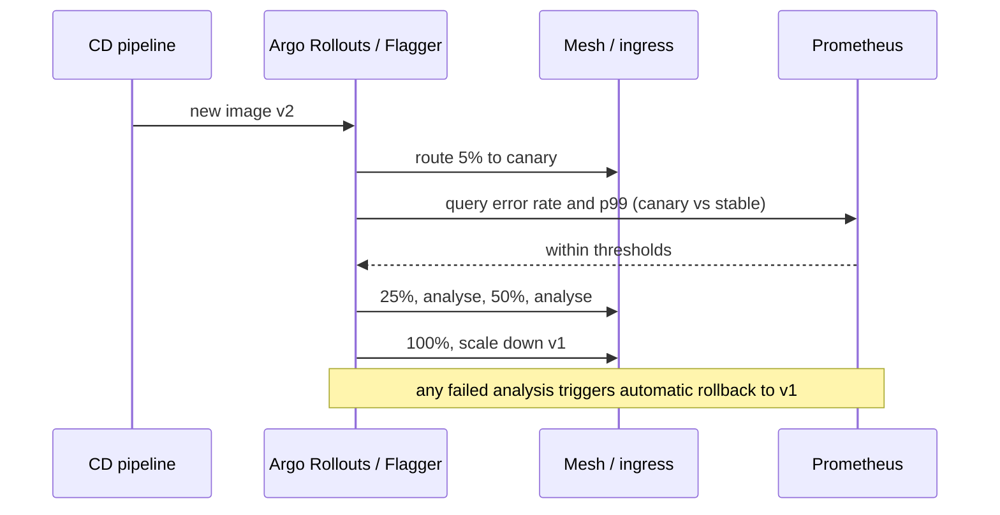

# Deployment Strategies: Blue-Green, Canary, Feature Flags

!!! abstract "TL;DR"
    - **Rolling** (Kubernetes default: `maxSurge` 25%, `maxUnavailable` 25%): replace pods gradually. Simple, no extra capacity, but old and new versions run together and rollback is another rollout.
    - **Blue-green:** run the new version (green) beside the old (blue), switch all traffic at once, keep blue for **instant rollback**. Costs double capacity during the switch and needs care with databases.
    - **Canary:** send a small share of traffic (1% → 5% → 25% → 100%) to the new version, compare its metrics with the baseline, **promote or roll back automatically** (Argo Rollouts, Flagger, mesh traffic splitting).
    - **Feature flags** separate **deploy** (code in production, off) from **release** (turned on for some users). They enable dark launches, gradual rollout by user segment, kill switches and A/B tests. Remove stale flags.
    - All strategies that run two versions at once need **backward-compatible changes**: APIs, events and **database schemas** via **expand/contract** (add new, migrate, switch, remove old in later releases).

## Why it matters

Most incidents are caused by changes. How you ship decides how many users a bad change hits and how fast you recover. "Deploy at 2 am with a maintenance window" doesn't fit a healthcare platform with 750K users or teams deploying many times a day. Lead engineers own release practices: strategy per service, rollback criteria, and the database migration discipline that makes zero-downtime possible.


*Notice the difference in blast radius: blue-green exposes everyone at once but rolls back instantly; canary exposes a few users first and lets metrics decide.*

## Core concepts

### Strategies compared

| Strategy | How | Downtime | Rollback | Extra capacity | Both versions live? |
|---|---|---|---|---|---|
| Recreate | Stop all old, start new | Yes | Redeploy old | None | No |
| Rolling | Replace instances in batches | No | Roll back (another rollout) | Small (surge) | Yes, during rollout |
| Blue-green | Full new env, switch router | No | **Instant switch back** | 2× during switch | Briefly / no (all switch) |
| Canary | Gradual traffic shift with analysis | No | Shift weight to stable | Small | Yes, by design |
| Shadow / dark launch | Copy traffic to new version, discard responses | No | N/A (not serving) | Yes | Yes (new unseen) |
| A/B test | Route by user segment to measure business impact | No | Turn off | Small | Yes |

### Rolling updates on Kubernetes

- `maxSurge` (extra pods during rollout) and `maxUnavailable` (pods that may be down), both default **25%**.
- Readiness probes gate traffic to new pods; `minReadySeconds` waits before counting a pod available; `progressDeadlineSeconds` (default 600) marks a stuck rollout as failed; `kubectl rollout undo` goes back (history `revisionHistoryLimit` default 10).
- Graceful termination matters: preStop hook, `terminationGracePeriodSeconds`, Spring Boot graceful shutdown.

### Blue-green

- Two complete environments; a router (load balancer target group, Kubernetes Service selector, DNS, gateway) points to one.
- Smoke-test green with internal traffic before switching.
- **Database**: both versions usually share one database, so the schema must work for both (expand/contract). Switching back after green wrote data in a new shape can be impossible without that discipline.
- Watch for long-lived connections (websockets) and caches that keep clients on blue; and in-flight async work (Kafka consumers in both colours consuming the same topics can double-process unless consumer groups are managed).

### Canary with automated analysis


*Notice the promotion decision is automated and based on metrics, not on someone watching dashboards. That's what makes canaries safe to run many times a day.*

- Traffic splitting needs request-level routing: a service mesh (Istio, Linkerd), ingress controllers (NGINX canary annotations), gateways, or AWS ALB weighted target groups. Replica-count ratios only approximate it.
- Choose **analysis metrics**: error rate, latency percentiles, saturation, and business KPIs (orders/min). Compare against the **baseline**, not absolute thresholds only.
- **Sticky canaries:** route a user consistently to one version to avoid flip-flopping UIs.

### Feature flags

- Decouple deploy from release: merge code behind a flag, deploy any time, release by configuration.
- Types (Pete Hodgson): **release toggles** (short-lived), **experiment toggles** (A/B), **ops toggles / kill switches** (long-lived, disable expensive features under load), **permission toggles** (premium/beta users).
- Targeting: percentage rollouts, user/tenant segments, region, internal users first.
- Tools: LaunchDarkly, Unleash, Flagsmith, AWS AppConfig, OpenFeature (vendor-neutral API).
- **Costs:** combinatorial complexity, untested combinations, flag debt. Every release flag needs an owner and a removal date; test both paths.

### Databases: expand and contract

Because old and new code run together (rolling, canary, blue-green), schema changes must be backward compatible:

1. **Expand:** add new column/table (nullable or with default), deploy code that writes both old and new, backfill.
2. **Migrate:** switch reads to the new structure; verify.
3. **Contract:** stop writing the old structure; in a later release drop it.

Never rename or drop a column in the same release that stops using it. Tools: Liquibase, Flyway. Same idea applies to **APIs** (add fields, version breaking changes) and **events** (schema compatibility).

### Rollback vs roll forward

- Rollback is fastest for code-only changes. After a data migration, rolling back may be impossible: design migrations so the previous version still works, or plan to **roll forward** with a fix.
- Define rollback criteria before deploying (error rate, p99, KPI drop) and automate them where possible.

## In practice: code & configuration

### Argo Rollouts canary

```yaml
apiVersion: argoproj.io/v1alpha1
kind: Rollout
metadata:
  name: graphql-consumer
spec:
  replicas: 10
  strategy:
    canary:
      canaryService: graphql-consumer-canary
      stableService: graphql-consumer-stable
      trafficRouting:
        istio:
          virtualService: { name: graphql-consumer }
      steps:
        - setWeight: 5
        - analysis: { templates: [{ templateName: error-rate-and-latency }] }
        - setWeight: 25
        - pause: { duration: 10m }
        - analysis: { templates: [{ templateName: error-rate-and-latency }] }
        - setWeight: 50
        - pause: { duration: 10m }
  # selector / template omitted for brevity
```

```yaml
apiVersion: argoproj.io/v1alpha1
kind: AnalysisTemplate
metadata:
  name: error-rate-and-latency
spec:
  metrics:
    - name: error-rate
      interval: 1m
      failureLimit: 1
      successCondition: result[0] < 0.01
      provider:
        prometheus:
          address: http://prometheus:9090
          query: |
            sum(rate(http_server_requests_seconds_count{app="graphql-consumer",version="canary",status=~"5.."}[2m]))
            / sum(rate(http_server_requests_seconds_count{app="graphql-consumer",version="canary"}[2m]))
```

### Feature flag in code

=== "❌ Common mistake"
    ```java
    // Long-lived git branch for the new pricing engine, merged on release day (big-bang merge),
    // or a hard-coded boolean that needs a redeploy to change.
    private static final boolean NEW_PRICING = false;
    ```

=== "✅ Correct approach"
    ```java
    // OpenFeature API (vendor-neutral); provider configured to LaunchDarkly/Unleash/flagd etc.
    @Service
    class PricingService {
      private final Client flags = OpenFeatureAPI.getInstance().getClient();

      Price price(Member m, Drug d) {
        var ctx = new ImmutableContext(m.id(), Map.of("plan", new Value(m.planType())));
        boolean useNew = flags.getBooleanValue("new-pricing-engine", false, ctx);  // default = safe path
        return useNew ? newEngine.price(m, d) : legacyEngine.price(m, d);
      }
    }
    // Flag has an owner and a removal ticket; both paths covered by tests until removal.
    ```

### Expand/contract with Liquibase

```yaml
# Release N (expand): add column, nullable; app writes both old and new
databaseChangeLog:
  - changeSet:
      id: 42-add-pharmacy-npi
      author: rx-team
      changes:
        - addColumn:
            tableName: pharmacy
            columns:
              - column: { name: npi, type: varchar(10) }
# Release N+1: backfill, read from npi
# Release N+2 (contract): drop the old column in its own changeSet
```

## Real-world usage

- **Netflix** popularised automated canary analysis (Kayenta, with Spinnaker); deployments are promoted based on statistical comparison with a baseline.
- **Facebook and Google** release behind flags and ramp gradually by user populations; "dark launches" exercise new backends with real traffic before users see them.
- **AWS** deploys in waves across regions and availability zones with automatic rollback on alarms (described in the Amazon Builders' Library).
- **Healthcare:** canary by internal users or a small member segment first; feature flags as kill switches for non-critical features during incidents; strict expand/contract on schemas because prescription and claims data can't be lost or misread; audit of who enabled which flag when.

## Trade-offs & production gotchas

| Option | Pros | Cons | Use when |
|---|---|---|---|
| Rolling | Simple, default, no extra infra | Mixed versions, slower rollback | Most stateless services |
| Blue-green | Instant switch/rollback, test before switch | 2× capacity, DB compatibility, all users at once | Big releases, strict rollback needs |
| Canary | Small blast radius, metric-driven | Needs traffic splitting, good metrics, low traffic is hard to judge | Frequent deploys, critical services |
| Feature flags | Release without deploy, targeting, kill switch | Flag debt, test matrix | Risky features, experiments |
| Shadow | Real traffic, zero user impact | Side effects, double load | Rewrites, performance validation |

!!! warning "Gotcha: canaries on low traffic"
    5% of 10 requests per minute is nothing to judge. Use longer analysis windows, synthetic traffic, or route by segment (internal users).

!!! warning "Gotcha: blue-green and Kafka consumers"
    If blue and green both consume the same topic with the same group id, partitions are split between versions; with different group ids, both process everything. Decide explicitly (pause blue consumers, or route consumption only to the live colour).

!!! warning "Gotcha: flags that never die"
    Hundreds of stale flags make code unreadable and untestable. Track flag age, owners and removal dates; fail builds on expired release flags if your tool supports it.

!!! question "Interview angle"
    Expect "compare blue-green and canary", "how do you roll back a release with a DB migration", and "how do feature flags help". Mention expand/contract and automated analysis.

## How this connects to my experience

- **Where I used it:**
    - **OptumRx Meteor:** "Led sprint planning, estimation, stakeholder communication, release management, and production support" and "Established engineering standards around testing, CI/CD, code quality, and deployment practices." This is the release-ownership story. *[confirm: deployment strategy used (rolling, blue-green, canary), tooling (Argo CD/Rollouts, Jenkins, GitLab, Harness, Spinnaker), whether feature flags were used and which tool]*
    - **Micro-frontends:** independent deployment of UI parts, often with flags to switch features on per environment or user group. *[confirm]*
    - **Deloitte ConvergeHealth:** "Implemented … Liquibase migration strategies" → expand/contract schema changes for zero-downtime releases. *[confirm]*
    - **Coriolis CCKM:** "automated deployments through GitLab CI/CD pipelines." *[confirm strategy]*
- **Talking points:**
    - "As release lead I wanted every release to be reversible: backward-compatible schema changes, flags for risky features, and clear rollback criteria agreed before the deploy." *[confirm]*
    - "Liquibase migrations followed expand/contract so old and new pods could run together during rolling updates." *[confirm]*
    - "For a service like the GraphQL Consumer Service, I'd canary with automated analysis on error rate and p99 per upstream, because problems often show only on real traffic."
- **Likely follow-up chain:** "How did you release to production?" → "What was your rollback plan?" → "How did you handle DB migrations?" (expand/contract) → "Did you use feature flags? How did you manage flag debt?" → "How would you improve it?" (automated canary analysis).

## Interview questions

### Fundamentals

??? question "Q1. Blue-green vs canary?"
    **Answer:** Blue-green: full parallel environment, switch all traffic at once, instant rollback by switching back; needs 2× capacity. Canary: shift a small percentage to the new version, analyse metrics, increase gradually; smaller blast radius, needs traffic splitting and good metrics.

    **Interviewer listens for:** capacity cost, switch granularity, rollback speed, need for traffic splitting and metrics.

    **Common wrong answer:** "Canary means testing on a few internal users." It means a small share of real production traffic.

??? question "Q2. How does a rolling update work in Kubernetes?"
    **Answer:** The Deployment creates new ReplicaSet pods and scales down old ones within `maxSurge`/`maxUnavailable` (25% each by default), gated by readiness probes; `kubectl rollout undo` reverts.

    **Interviewer listens for:** new ReplicaSet, maxSurge/maxUnavailable, readiness gating, rollout undo.

    **Common wrong answer:** "Kubernetes stops all old pods, then starts new ones." That is the `Recreate` strategy, not rolling.

??? question "Q3. What is a feature flag?"
    **Answer:** A runtime switch that enables code paths for some or all users without redeploying. Separates deploy from release; supports gradual rollout, experiments and kill switches.

    **Interviewer listens for:** deploy vs release, gradual rollout, kill switch, experiments.

    **Common wrong answer:** "A flag is a config property read at startup." Flags are evaluated at runtime, per user or request.

### Intermediate

??? question "Q4. What is expand/contract?"
    **Answer:** A sequence for backward-compatible schema changes: add the new structure, write to both and backfill, switch reads, then remove the old structure in a later release. Lets old and new code run together.

    **Interviewer listens for:** expand, dual write + backfill, switch reads, contract later; old and new code coexist.

    **Common wrong answer:** "Rename the column in one migration and deploy the app at the same time." Old pods still running will fail.

??? question "Q5. Why can't you just roll back after a database migration?"
    **Answer:** The old code may not understand the new schema or data written in the new shape. Unless the migration was backward compatible, rollback breaks; you roll forward instead.

    **Interviewer listens for:** old code vs new schema, data written in the new shape, roll forward.

    **Common wrong answer:** "Flyway can undo it." An undo script cannot bring back data or fix rows written in the new shape.

??? question "Q6. What is a dark launch / shadow traffic?"
    **Answer:** Mirroring real requests to a new version whose responses are discarded, to test behaviour and performance under real load without user impact. Side effects must be disabled.

    **Interviewer listens for:** mirrored traffic, discarded responses, disabled side effects.

    **Common wrong answer:** Shadowing a payment or email service without stubbing side effects.

??? question "Q7. What metrics drive canary analysis?"
    **Answer:** Error rate, latency percentiles, saturation and key business metrics, compared to the stable baseline over the same window, with thresholds and minimum sample sizes.

    **Interviewer listens for:** RED + saturation + business metrics, baseline comparison, thresholds, minimum sample size.

    **Common wrong answer:** "If there are no 500 errors, the canary is good." Latency and business metrics catch most bad releases.

### Senior

??? question "Q8. How do you manage feature flag debt?"
    **Answer:** Classify flags (release, ops, experiment, permission), assign owners and expiry dates, remove release flags soon after full rollout, test both paths while they exist, and monitor flag counts and age.

    **Interviewer listens for:** flag types, owner and expiry, removal after rollout, test both paths, monitor age.

    **Common wrong answer:** "Flags are free; leave them in." Old flags create untested code paths and dangerous combinations.

??? question "Q9. How do blue-green and Kafka consumers interact?"
    **Answer:** Both colours may consume the same topics. With the same group id, partitions split across versions; with different group ids, messages are processed twice. Run consumers only in the live colour or pause the idle one.

    **Interviewer listens for:** same group id splits partitions, different ids double-process, consume only in live colour.

    **Common wrong answer:** Assuming blue-green only affects HTTP traffic and forgetting the idle colour is still consuming messages.

??? question "Q10. When would you choose blue-green over canary?"
    **Answer:** When you need an all-at-once switch with instant rollback (e.g. coordinated client and server changes, low traffic where canary stats are weak) and can afford double capacity; canary when traffic is high enough to judge and you want minimal blast radius.

    **Interviewer listens for:** instant all-or-nothing switch, coordinated changes, low-traffic stats, capacity budget.

    **Common wrong answer:** "Blue-green is always safer." It exposes 100% of users at once.

### Scenario-based

??? question "Q11. A release increased error rates 10 minutes after full rollout. What should have caught it, and what do you do now?"
    **Answer:** Now: roll back (or kill-switch the feature) and verify recovery. Prevention: canary with automated analysis and longer bake time, flags for risky changes, and better pre-production tests. Post-incident: blameless review and add the missing signal.

    **Interviewer listens for:** roll back first, then prevention: canary analysis, bake time, flags, blameless review.

    **Common wrong answer:** Debugging the root cause in production while the error rate is still elevated.

??? question "Q12. You need to rename a column used by three services. Plan it."
    **Answer:** Expand: add the new column, update writers to write both, backfill. Update readers to use the new column (each service on its own schedule). Contract: stop writing the old, then drop it in a later release once no reader uses it. Coordinate via contract tests.

    **Interviewer listens for:** expand/contract steps, per-service schedule, later drop, contract tests.

    **Common wrong answer:** One migration that renames the column, coordinated with a release of all three services at the same minute.

## Cheat sheet

| Concept | Remember |
|---|---|
| Rolling | K8s default; maxSurge/maxUnavailable 25%; readiness gated; `rollout undo` |
| Rollout defaults | progressDeadlineSeconds 600; revisionHistoryLimit 10 |
| Blue-green | Two envs, router switch, instant rollback, 2× capacity |
| Canary | Small % → analyse vs baseline → ramp or roll back |
| Tools | Argo Rollouts, Flagger, Spinnaker/Kayenta, mesh/ingress weights, ALB weights |
| Shadow | Mirror traffic, discard responses, no side effects |
| Flags | Deploy ≠ release; release/ops/experiment/permission toggles; OpenFeature |
| Flag debt | Owner, expiry, remove, test both paths |
| DB | Expand → migrate → contract; never drop in the same release |
| Rollback | Code: rollback; data changed: roll forward |
| Kafka + blue-green | Decide which colour consumes |

## Sources

1. [Kubernetes: Deployments](https://kubernetes.io/docs/concepts/workloads/controllers/deployment/): rolling update parameters, rollback, progress deadline.
2. [BlueGreenDeployment (Martin Fowler)](https://martinfowler.com/bliki/BlueGreenDeployment.html) and [CanaryRelease (Danilo Sato)](https://martinfowler.com/bliki/CanaryRelease.html).
3. [Feature Toggles (aka Feature Flags) (Pete Hodgson)](https://martinfowler.com/articles/feature-toggles.html): toggle categories, management.
4. [Argo Rollouts documentation](https://argoproj.github.io/argo-rollouts/): canary steps, analysis templates, traffic routing.
5. [OpenFeature](https://openfeature.dev/docs/reference/intro): vendor-neutral feature flag API.
6. [ParallelChange (expand/contract) (Danilo Sato)](https://martinfowler.com/bliki/ParallelChange.html): backward-compatible changes.
7. [Automating safe, hands-off deployments (Amazon Builders' Library)](https://aws.amazon.com/builders-library/automating-safe-hands-off-deployments/): waves, bake time, automatic rollback.
8. [Kayenta: automated canary analysis (Netflix/Google)](https://netflixtechblog.com/automated-canary-analysis-at-netflix-with-kayenta-3260bc7acc69): statistical canary judgement.
