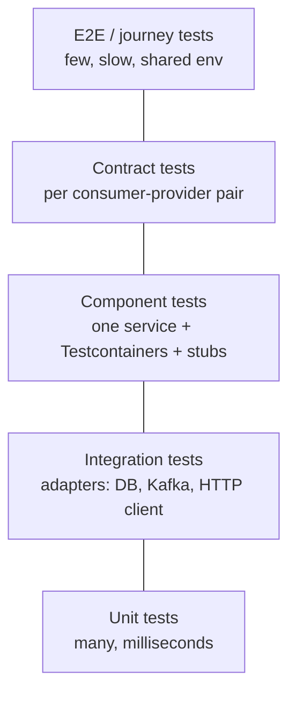
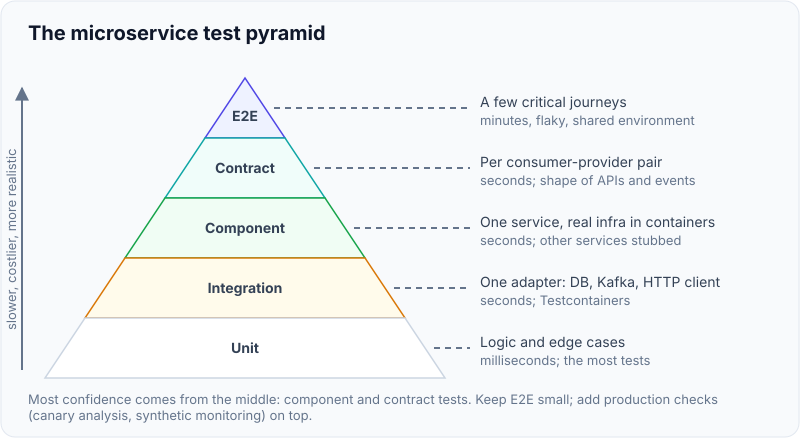
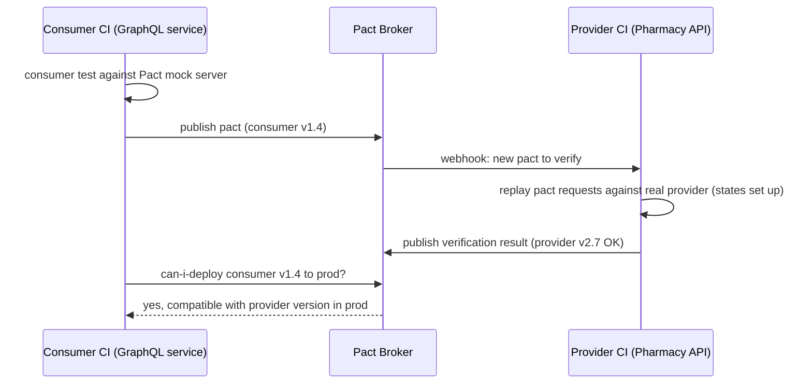

# Microservice Testing Strategy & Contract Testing

!!! abstract "Key takeaways"
    - Keep the **test pyramid**: many fast **unit** tests, fewer **integration/component** tests with real dependencies in containers, very few **end-to-end** tests. Microservices add a layer: **contract tests** between services.
    - **Component tests** run one service in isolation with real infrastructure (Postgres, Kafka, Redis via **Testcontainers**) and fake its collaborators (WireMock, stubs). They catch most bugs at a fraction of E2E cost.
    - **Consumer-driven contract testing:** the consumer states what it needs from a provider (requests and the response fields it actually uses); the provider verifies it can satisfy every consumer's contract in its own pipeline. Tools: **Pact** (with a Pact Broker and `can-i-deploy`) and **Spring Cloud Contract** (provider-defined contracts, generated stubs).
    - Contract tests let teams **deploy independently** without a shared staging environment that everyone must coordinate. They check the **shape** of interactions, not business correctness.
    - Large E2E suites in shared environments are slow, flaky and blocking. Replace most of them with contracts + component tests, keep a few critical **journey tests**, and test in production safely (canaries, synthetic monitoring).

## Why it matters

In a monolith, a compile error tells you that a caller broke. In microservices, one team changes a field name, all its tests pass, it deploys, and three consumers break in production. The usual reaction, "run everything together in a shared staging environment before release", couples every team's release again and produces slow, flaky suites that nobody trusts. Contract testing is the microservice answer: fast, per-service checks that guarantee compatibility between pairs of services.


*Notice the shape: confidence comes mainly from the middle layers (component and contract tests), not from a large end-to-end suite at the top.*

{ loading=lazy }
*Notice how the width of each layer matches how many tests you should have there, and the cost grows towards the tip.*

## Core concepts

### Test types for a microservice

| Type | Scope | Real dependencies? | Speed | Purpose |
|---|---|---|---|---|
| Unit | Class/function | No | ms | Logic, edge cases |
| Integration (narrow) | One adapter (repository, Kafka listener, HTTP client) | Yes (Testcontainers / WireMock) | seconds | Mapping, queries, serialization |
| Component | Whole service via its API | Infra real, other services stubbed | seconds | Service behaviour end to end in isolation |
| Contract | Interaction between two services | No (verified separately on each side) | seconds | API/event compatibility |
| End-to-end | Many services deployed together | Yes | minutes, flaky | A few critical user journeys |
| Production checks | Live system | Yes | continuous | Synthetic monitoring, canary analysis |

Spring Boot slices help: `@WebMvcTest`, `@DataJpaTest`/`@DataMongoTest`, `@JsonTest`, `@GraphQlTest`; `@SpringBootTest` for component tests; `@ServiceConnection` (Boot 3.1+) wires Testcontainers automatically.

### Consumer-driven contracts


*Notice neither side needs the other running. The broker records which versions are verified against which, so each team can ask "is it safe to deploy?" independently.*

- The consumer only specifies **what it uses** (fields, status codes), so the provider is free to change everything else. This is **Postel's law / tolerant reader** in test form.
- **Provider states** ("member 42 exists with 2 prescriptions") set up data for verification.
- Contracts work for **messages** too: Pact message pacts, Spring Cloud Contract messaging (Kafka/RabbitMQ).
- **Pact** (polyglot): consumer-first, broker, `can-i-deploy`, pending/WIP pacts for new contracts.
- **Spring Cloud Contract** (JVM-centric): contracts written (often by the provider) in Groovy/YAML/Kotlin; the plugin generates provider tests and **stub jars** that consumers use with Stub Runner. Good inside a Spring estate.
- **Schema-based** checks (OpenAPI diff, Avro/Protobuf compatibility in a schema registry) complement contracts: they catch breaking schema changes but not "this consumer needs this field".

{ loading=lazy }
*Watch which change gets blocked: removing an unused field ships, renaming a used one doesn't. The contract only protects what consumers actually read.*

### Component tests with Testcontainers

- Real Postgres/Mongo/Kafka/Redis in Docker per test run, so queries, migrations and serialization are tested for real (H2 behaves differently from Postgres).
- Stub other services' HTTP APIs with **WireMock** (or the provider's Spring Cloud Contract stubs) to keep tests independent and deterministic.
- Use the same migrations (Liquibase/Flyway) as production.

### Why to limit E2E tests

- Slow (minutes to hours), **flaky** (network, data, timing), hard to debug, require all services deployed at compatible versions, and block independent releases.
- Keep a **handful** of journey tests for critical paths (sign in, request refill, view claim) and run them in pipelines or as synthetic monitors in production.

### Other techniques

- **Test data management:** isolated data per test, factories/builders, no shared mutable test environments.
- **Consumer-side resilience tests:** timeouts and error mapping tested with WireMock faults (delays, 500s, malformed responses).
- **Chaos testing** in pre-prod or carefully in prod (kill pods, inject latency) to validate resilience patterns.
- **Mutation testing** (PIT) to check test quality on core logic.
- **Testing in production:** canaries with automated analysis, feature-flagged releases, synthetic transactions.

## In practice: code & configuration

### Component test with Testcontainers and WireMock

=== "❌ Common mistake"
    ```java
    // H2 in-memory "Postgres" + mocked repository + shared staging upstream:
    // passes locally, fails in prod on SQL dialect, JSON mapping and flaky upstream data.
    @SpringBootTest(properties = "spring.datasource.url=jdbc:h2:mem:test")
    class RefillTest {
      @MockitoBean RefillRepository repo;
      // calls https://pharmacy-staging.internal for real ...
    }
    ```

=== "✅ Correct approach"
    ```java
    @SpringBootTest(webEnvironment = RANDOM_PORT)
    @Testcontainers
    class RefillComponentTest {

      @Container @ServiceConnection                       // Boot 3.1+: auto-configures the datasource
      static PostgreSQLContainer<?> db = new PostgreSQLContainer<>("postgres:16");

      @Container @ServiceConnection
      static KafkaContainer kafka = new KafkaContainer("apache/kafka:3.8.0"); // org.testcontainers.kafka.KafkaContainer

      @RegisterExtension
      static WireMockExtension pharmacy = WireMockExtension.newInstance()
          .options(wireMockConfig().dynamicPort()).build();

      @DynamicPropertySource
      static void props(DynamicPropertyRegistry r) {
        r.add("upstream.pharmacy.base-url", pharmacy::baseUrl);
      }

      @Autowired TestRestTemplate http;

      @Test
      void refillIsAcceptedAndEventPublished() {
        pharmacy.stubFor(get(urlPathEqualTo("/pharmacies/7"))
            .willReturn(okJson("{\"id\":\"7\",\"name\":\"Main St\"}")));

        var resp = http.postForEntity("/refills", new RefillRequest("rx-1", "7"), RefillResponse.class);

        assertThat(resp.getStatusCode()).isEqualTo(HttpStatus.ACCEPTED);
        // assert outbox row / consume from Kafka with a test consumer ...
      }

      @Test
      void pharmacyTimeoutDegradesGracefully() {
        pharmacy.stubFor(get(anyUrl()).willReturn(ok().withFixedDelay(5_000)));   // resilience path
        // assert fallback / error mapping ...
      }
    }
    ```

### Pact consumer test (JUnit 5)

```java
@ExtendWith(PactConsumerTestExt.class)
@PactTestFor(providerName = "pharmacy-api")
class PharmacyClientPactTest {

  @Pact(consumer = "graphql-consumer")
  V4Pact pharmacyById(PactDslWithProvider builder) {
    return builder
      .given("pharmacy 7 exists")
      .uponReceiving("get pharmacy by id")
        .path("/pharmacies/7").method("GET")
      .willRespondWith()
        .status(200)
        .body(new PactDslJsonBody()
          .stringType("id", "7")
          .stringType("name", "Main St"))      // only the fields this consumer uses
      .toPact(V4Pact.class);
  }

  @Test
  void fetchesPharmacy(MockServer mock) {
    var client = new PharmacyClient(RestClient.create(mock.getUrl()));
    assertThat(client.byId("7").name()).isEqualTo("Main St");
  }
}
```

Provider side: `@Provider("pharmacy-api")` + `@PactBroker` + `@State("pharmacy 7 exists")` methods, verified in the provider's pipeline; consumers gate deploys with `pact-broker can-i-deploy`.

### Spring Cloud Contract (provider-defined) sketch

```groovy
// src/test/resources/contracts/pharmacy/get_by_id.groovy (provider repo)
Contract.make {
  request { method 'GET'; url '/pharmacies/7' }
  response {
    status 200
    headers { contentType applicationJson() }
    body(id: "7", name: "Main St")
  }
}
// Build generates provider tests + a stubs jar; consumers run it with @AutoConfigureStubRunner.
```

## Real-world usage

- **Consumer-driven contracts** were described by Ian Robinson (ThoughtWorks, 2006) and became mainstream with Pact (originated at realestate.com.au) and Spring Cloud Contract.
- **Testcontainers** is now the standard way to run real dependencies in JVM integration tests; Spring Boot 3.1 added first-class support (`@ServiceConnection`).
- Large organisations (e.g. the "practical test pyramid" guidance from ThoughtWorks) report replacing slow shared-environment suites with contracts and component tests to regain independent deployability.
- **Healthcare:** test data must never be real PHI. Use synthetic data generators; contract and component tests make that easy because they don't need copies of production databases.

## Trade-offs & production gotchas

| Approach | Pros | Cons | Use when |
|---|---|---|---|
| Large E2E suite | Realistic | Slow, flaky, couples releases | Only a few critical journeys |
| Component tests (Testcontainers) | Realistic infra, isolated, fast enough | Docker in CI, stub maintenance | Every service |
| Pact (consumer-driven) | Polyglot, only tests what's used, can-i-deploy | Broker to run, discipline both sides | Many teams/languages |
| Spring Cloud Contract | JVM-native, generated stubs and tests | Provider-centric, JVM-focused | Spring-heavy estates |
| Schema compatibility checks | Cheap, automatic | Doesn't know consumer needs | APIs and events with schemas |

!!! warning "Gotcha: contract tests used as functional tests"
    Contracts verify the shape of interactions (fields, types, status codes), not business rules. Asserting exact business values in contracts makes them brittle; put behaviour tests in the provider's own suite.

!!! warning "Gotcha: mocks of other teams' services written by guesswork"
    A WireMock stub you wrote yourself can drift from reality. Generate stubs from contracts (Spring Cloud Contract stubs, Pact) so they're verified against the real provider.

!!! warning "Gotcha: H2 instead of the real database"
    Dialect differences, JSON types, locking and migrations behave differently. Use Testcontainers with the production engine and version.

!!! question "Interview angle"
    Expect "how do you test microservices without a giant E2E suite?", "what is consumer-driven contract testing?", and "Pact vs Spring Cloud Contract". Tie it to independent deployability.

## How this connects to my experience

- **Where I used it:**
    - **OptumRx Meteor:** "Established engineering standards around testing, CI/CD, code quality, and deployment practices." This is the testing-strategy story as a lead. The GraphQL Consumer Service depends on 5 upstreams, which is exactly where contract tests and stubbed upstreams matter. *[confirm: test layers used (unit, slice, Testcontainers, WireMock), whether contract testing (Pact or Spring Cloud Contract) was used with the upstream teams, and coverage/quality gates]*
    - **ReactJS app and micro-frontends:** frontend-to-GraphQL contract via the schema; component tests with mocked GraphQL (MSW/Apollo MockedProvider). *[confirm tools: Jest, React Testing Library, Storybook (listed in skills)]*
    - **Mentoring 5+ engineers through code reviews:** reviewing test quality is part of the standards. *[confirm]*
- **Talking points:**
    - "I pushed tests down the pyramid: most behaviour in unit and component tests with real Mongo/Kafka in containers, and WireMock for the five upstreams, including timeout and error cases." *[confirm]*
    - "Upstreams were owned by other teams, so the risk was them changing a response. Consumer-driven contracts (or at least schema checks) catch that before deploy." *[confirm whether they were in place; if not, say it's what you'd add]*
    - "We kept E2E tests to a few critical journeys, because shared-environment suites were slow and flaky." *[confirm]*
- **Likely follow-up chain:** "What testing standards did you set?" → "How did you test integration with the 5 upstreams?" (stubs, contracts) → "How did you avoid flaky E2E tests?" → "Pact or Spring Cloud Contract, why?" → "How do you test Kafka consumers?" (Testcontainers Kafka, idempotency, DLQ path).

## Interview questions

### Fundamentals

??? question "Q1. What does the test pyramid look like for microservices?"
    **Answer:** Many unit tests; integration tests for adapters; component tests per service with real infrastructure and stubbed collaborators; contract tests between services; very few end-to-end tests.

    **Interviewer listens for:** layer by layer, component and contract tests carry most of the confidence, few E2E.

    **Common wrong answer:** "Lots of E2E tests in a shared environment give the most confidence." They are slow, flaky and couple releases.

??? question "Q2. What is a component test?"
    **Answer:** A test of one service through its public interface, with real infrastructure (DB, broker in containers) and external services stubbed, so it's realistic but isolated and deterministic.

    **Interviewer listens for:** one service via its public API, real infrastructure, stubbed collaborators, deterministic.

    **Common wrong answer:** Calling it a unit test with mocks, or an E2E test with real neighbour services.

??? question "Q3. What is contract testing?"
    **Answer:** Verifying that a consumer and provider agree on their interaction (requests, responses, messages), each side tested independently against a shared contract, instead of deploying both together.

    **Interviewer listens for:** agreement on the interaction, each side tested independently, no joint deployment.

    **Common wrong answer:** "Contract testing is validating against an OpenAPI schema." Schemas say what is allowed, not what consumers actually use.

### Intermediate

??? question "Q4. What does 'consumer-driven' mean?"
    **Answer:** Consumers define the contracts based on what they actually use; providers must satisfy all their consumers' contracts. Providers can change anything no consumer depends on.

    **Interviewer listens for:** consumers specify actual usage, provider verifies all consumers, free to change unused parts.

    **Common wrong answer:** "The provider publishes the contract and consumers follow it." That is provider-driven.

??? question "Q5. Pact vs Spring Cloud Contract?"
    **Answer:** Pact: consumer-first, polyglot, Pact Broker with versioning and `can-i-deploy`. Spring Cloud Contract: contracts usually authored with the provider, generates provider tests and consumer stub jars, JVM/Spring oriented. Both support HTTP and messaging.

    **Interviewer listens for:** consumer-first and polyglot with Broker vs provider-authored JVM-oriented with stubs, both support messaging.

    **Common wrong answer:** "Pact only does HTTP." It supports message contracts as well.

??? question "Q6. Why use Testcontainers instead of H2 or embedded Kafka?"
    **Answer:** Same engine and version as production: SQL dialect, JSON types, indexes, migrations, broker behaviour. In-memory substitutes hide real bugs.

    **Interviewer listens for:** same engine and version, dialect, migrations, broker behaviour.

    **Common wrong answer:** "H2 in PostgreSQL mode is close enough." JSONB, locking, indexes and many functions differ.

??? question "Q7. How do you test a Kafka consumer?"
    **Answer:** Component test with Testcontainers Kafka: produce a message, assert the side effect (DB row, outgoing event); test duplicates (idempotency), poison messages (DLQ path) and retries. Contract-test the message schema with the producer.

    **Interviewer listens for:** real broker, assert side effects, duplicates, poison messages, retries, schema contract.

    **Common wrong answer:** Mocking `KafkaTemplate` and the listener, which tests none of the serialisation, retry or DLQ behaviour.

### Senior

??? question "Q8. Why are large E2E suites a problem in microservices?"
    **Answer:** They require all services deployed together (coupling releases), are slow and flaky, are hard to debug, and block teams. Most of their value is gained more cheaply with component and contract tests.

    **Interviewer listens for:** release coupling, slowness, flakiness, debugging cost, cheaper alternatives.

    **Common wrong answer:** "We need E2E because unit tests miss integration bugs." Component and contract tests catch those faster.

??? question "Q9. What does `can-i-deploy` do?"
    **Answer:** Queries the Pact Broker to check whether a given version of a service has successful contract verifications against the versions of its consumers/providers deployed in the target environment, gating the deployment.

    **Interviewer listens for:** verification matrix, deployed versions per environment, deployment gate.

    **Common wrong answer:** "It runs the contract tests." It only checks recorded verification results in the Broker.

??? question "Q10. What can contract tests not catch?"
    **Answer:** Business logic errors, performance, cross-service workflows, environment/config issues, and changes in semantics with the same shape. Those need provider behaviour tests, component tests, journey tests and production monitoring.

    **Interviewer listens for:** business logic, performance, workflows, config, semantic changes with the same shape.

    **Common wrong answer:** "Contracts guarantee the integration works." They guarantee shape agreement, not correct behaviour.

### Scenario-based

??? question "Q11. An upstream team renamed a field and your service broke in production. How do you prevent a repeat?"
    **Answer:** Add consumer-driven contracts for the fields we use, verified in the upstream's pipeline with `can-i-deploy` gating, plus tolerant reading on our side and alerts on deserialization errors. Agree on a versioning/deprecation policy.

    **Interviewer listens for:** consumer-driven contracts in the provider pipeline, can-i-deploy, tolerant reader, deserialisation alerts, deprecation policy.

    **Common wrong answer:** "Ask the upstream team to be more careful." Process without an automated gate repeats the incident.

??? question "Q12. Your staging E2E suite takes 2 hours and fails 30% of the time. What do you do?"
    **Answer:** Quarantine flaky tests, map each E2E test to the risk it covers, move coverage down to component and contract tests, keep a few journey tests (maybe as production synthetic monitors), and fix test data isolation. Measure suite time and flakiness.

    **Interviewer listens for:** quarantine, risk mapping, push coverage down, few journeys as synthetics, data isolation, measure.

    **Common wrong answer:** Adding automatic retries to flaky tests until the suite goes green.

## Cheat sheet

| Concept | Remember |
|---|---|
| Pyramid | Many unit → integration → component → contract → few E2E |
| Component test | One service, real infra (Testcontainers), stubbed collaborators (WireMock) |
| Boot support | Test slices; `@ServiceConnection` (3.1+) for Testcontainers |
| Contract test | Interaction shape, verified separately on both sides |
| Consumer-driven | Consumer specifies what it uses; provider verifies all consumers |
| Pact | Consumer-first, polyglot, Broker, provider states, `can-i-deploy` |
| Spring Cloud Contract | Groovy/YAML contracts, generated provider tests + stub jars, Stub Runner |
| Messages | Contracts for events too (Pact message, SCC messaging) |
| Not covered by contracts | Business rules, performance, workflows |
| E2E | Few critical journeys; synthetic monitoring |
| Data | Synthetic only, never real PHI |

## Sources

1. [Testing Strategies in a Microservice Architecture (Toby Clemson, martinfowler.com)](https://martinfowler.com/articles/microservice-testing/): unit, integration, component, contract, E2E.
2. [The Practical Test Pyramid (Ham Vocke)](https://martinfowler.com/articles/practical-test-pyramid.html): pyramid in practice, contract tests.
3. [Consumer-Driven Contracts: A Service Evolution Pattern (Ian Robinson)](https://martinfowler.com/articles/consumerDrivenContracts.html): origin of CDC.
4. [Pact documentation](https://docs.pact.io/): consumer tests, broker, provider verification, can-i-deploy.
5. [Spring Cloud Contract reference](https://docs.spring.io/spring-cloud-contract/reference/): contracts, generated tests, Stub Runner, messaging.
6. [Testcontainers](https://testcontainers.com/) and [Spring Boot: Testcontainers support](https://docs.spring.io/spring-boot/reference/testing/testcontainers.html): `@ServiceConnection`.
7. [WireMock documentation](https://wiremock.org/docs/): HTTP stubbing, fault injection.
