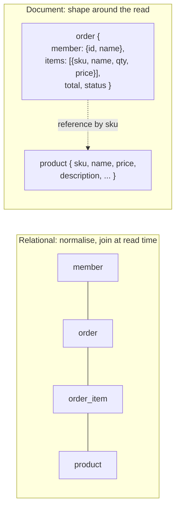
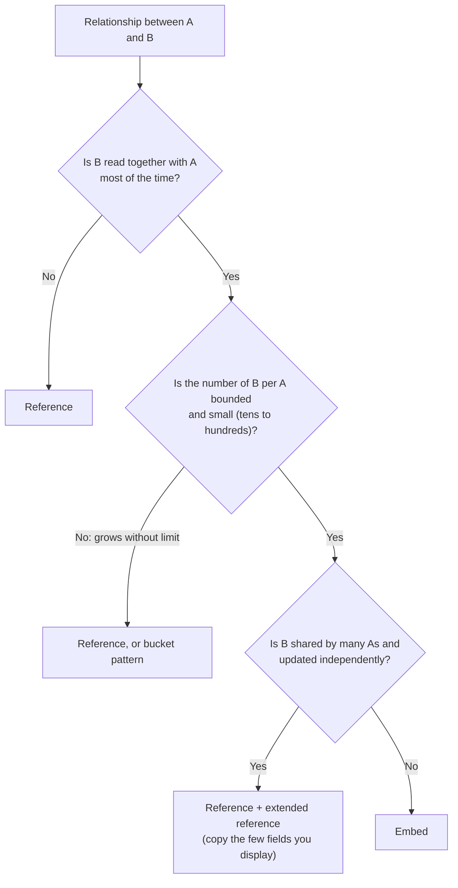

# Document Model & Schema Design

!!! abstract "Key takeaways"
    - MongoDB stores **documents** (BSON, up to **16 MB**) in collections. The design rule is **"data that is accessed together should be stored together."** Model for your queries, not for normal forms.
    - **Embed** when the child belongs to the parent, is read with it and is bounded in size (order lines, addresses). **Reference** when the data is shared, large, unbounded or accessed independently (products, members, audit events). Measured: reading an order with 5 items took **473 µs** embedded, **678 µs** with `$lookup` and **989 µs** with two queries.
    - **Unbounded arrays are the classic mistake.** Pushing 20,000 events into one document grew it to **1.5 MB**, and each `$push` slowed from **2 ms to 14 ms**. Use a separate collection or the **bucket pattern**.
    - Schemas are flexible but not optional: use **`$jsonSchema` validation** (it rejected a bad `memberId` pattern and a string date with detailed reasons) and version documents (`schemaVersion`) to evolve them.
    - Know the patterns: extended reference, subset, **bucket** (200,000 readings → 2,000 bucket documents, index 7.5 MB → 0.1 MB), computed, outlier, polymorphic and schema versioning, plus native **time-series collections** (same data stored in 2.7 MB).

## Why it matters

Schema design decides MongoDB performance far more than hardware or indexes. A relational schema copied table-for-table into collections gives you all the joins of SQL with none of the planner's help. Unbounded or badly embedded documents cause slow writes, hit the 16 MB limit or blow up memory. Interviewers ask "embed or reference?" for a concrete domain and expect the answer to start with the access pattern. Healthcare and pharmacy data (members, claims, prescriptions) is a common example.

Measurements on this page come from a local 3-node MongoDB 8.0.4 replica set driven by PyMongo while writing this page.

## Core concepts

### Documents, collections and BSON

- A **document** is an ordered set of fields, stored as BSON (binary JSON with extra types: `ObjectId`, `Date`, `Decimal128`, `Int64`, `Binary`, `UUID`). Max size **16 MB** (measured: inserting a 17 MB document failed client-side with `DocumentTooLarge`). GridFS splits larger files into chunks.
- Every document has a unique **`_id`**, an `ObjectId` by default (a 4-byte timestamp, a 5-byte random value and a 3-byte counter, roughly time-ordered).
- A **collection** groups documents. Documents in one collection can differ in shape (polymorphism), but a collection should still hold one *kind* of thing.
- Single-document writes are **atomic**, including nested arrays and subdocuments. That's the main reason to embed data that must change together. [Multi-document transactions](06-transactions-and-consistency.md) exist, but they cost more.

### Relational vs document thinking


*Notice that the order document carries everything the order screen needs, including copies of the product name and price at purchase time, while the full product stays in its own collection.*

| | Relational | Document (MongoDB) |
|---|---|---|
| Design starts from | Entities and normal forms | Queries and access patterns |
| Relationships | Foreign keys + joins | Embedding, or references + `$lookup`/application joins |
| Duplication | Avoided | Accepted where it saves reads (and copies are often historically correct) |
| Atomicity | Multi-row transactions | Single document by default |
| Schema | Enforced by DDL | Flexible; enforce with validation |

The trade-offs mirror [normalisation vs denormalisation](../postgresql-sql/05-normalisation-vs-denormalisation.md). MongoDB just makes denormalisation the default.

### Embed or reference?


*Notice that cardinality alone ("one-to-many") isn't enough. "One-to-few" embeds, "one-to-many" may embed or reference, and "one-to-squillions" must reference.*

| Relationship | Example | Typical choice |
|---|---|---|
| One-to-one | Member ↔ preferences | Embed |
| One-to-few | Member → addresses, phone numbers | Embed array |
| One-to-many (bounded) | Order → line items | Embed array |
| One-to-many (large) | Product → reviews | Reference from child (`productId` in review), or subset pattern |
| One-to-squillions | Device → log events | Reference from child, bucket or time-series collection |
| Many-to-many | Doctors ↔ patients | Arrays of ids on one or both sides, or a link collection |

**Measured read cost** (20,000 orders, 5 items each, random reads by id):

| Model | Median-ish latency per read |
|---|---|
| Items embedded in the order | **473 µs** (one document) |
| Separate `order_items` collection, `$lookup` in one aggregation | 678 µs |
| Separate collection, two queries from the app | 989 µs (two round trips) |

### The unbounded-array problem

A user's activity feed stored as an array inside the user document, measured by `$push`-ing events one at a time:

| Array length | Document size | Latency of one `$push` |
|---|---|---|
| 100 | 7 KB | 2.0 ms |
| 1,000 | 74 KB | 2.7 ms |
| 5,000 | 374 KB | 7.9 ms |
| 10,000 | 749 KB | 11.0 ms |
| 20,000 | **1.5 MB** | **14.3 ms** |

Every update rewrites a bigger document in the storage engine, reads load the whole array into the cache, multikey indexes on the array get one entry per element, and the 16 MB ceiling eventually breaks writes. (Replication is smarter: since MongoDB 5.0 the oplog records deltas, and the oplog entry for that `$push` was only 394 bytes.) Fix: events in their own collection keyed by `userId`, a bucket per user per day, or keep only the latest N embedded (`$push` with `$slice: -50`) as a **subset**.

### Design patterns

| Pattern | Problem | Solution | Example |
|---|---|---|---|
| **Extended reference** | Joins for a few display fields | Copy those fields with the reference | Order stores `{memberId, name}`; full member elsewhere |
| **Subset** | Huge related list, only some used | Embed the top N, store the rest separately | Product with 10 latest reviews embedded |
| **Bucket** | Many tiny documents (time series, events) | Group into one document per entity per time window | Sensor readings per hour |
| **Computed** | Expensive aggregation on every read | Precompute on write or on a schedule | `reviewCount`, `avgRating` on product |
| **Outlier** | A few documents far bigger than the rest | Normal design + an overflow flag/collection | Celebrity with millions of followers |
| **Polymorphic** | Similar entities with different fields | One collection, `type` field, shared indexes | Claims: pharmacy, medical, dental |
| **Attribute** | Many optional, sparsely queried fields | Array of `{k, v}` pairs with one index | Product specs |
| **Schema versioning** | Evolving document shapes | `schemaVersion` field; migrate lazily or in batches | v1 address string → v2 structured |
| **Archive** | Old data slows the working set | Move to another collection, cluster or Online Archive | Claims older than 7 years |

**Bucket pattern, measured** with 200,000 sensor readings (100 sensors, one reading every 36 s):

| Model | Documents | Data size | Index size |
|---|---|---|---|
| One document per reading + index `{sensor, ts}` | 200,000 | 11.4 MB | **7.5 MB** |
| One bucket per sensor per hour (`readings` array) + index `{sensor, hour}` | 2,000 | 6.5 MB | **0.1 MB** |
| Native time-series collection (`metaField: sensor`) | 200,000 visible / 2,000 internal buckets | **2.7 MB** | (clustered) |

Native time-series collections (MongoDB 5.0+) apply the bucket pattern automatically, with columnar compression, while still letting you query individual measurements. Prefer them for metrics and IoT data.

## In practice: code & configuration

### Modelling a pharmacy order

=== "❌ Common mistake"

    ```javascript
    // Relational schema copied into collections: every screen needs 4 lookups
    db.orders.insertOne({ _id: 1, memberId: 42, status: "PAID" })
    db.order_items.insertMany([{ orderId: 1, productId: 7, qty: 2 }, ...])
    db.products.insertOne({ _id: 7, name: "Atorvastatin 20mg", price: 12.5 })

    // ...or the opposite: everything about a member in one ever-growing document
    db.members.updateOne({ _id: 42 }, { $push: { orders: {...}, claims: {...}, auditLog: {...} } })
    ```

=== "✅ Better"

    ```javascript
    // Order: what the order screen reads, in one document
    db.orders.insertOne({
      _id: ObjectId(),
      orderNo: "RX-2026-000123",
      member: { id: "M000042", name: "A. Patel" },          // extended reference
      items: [                                              // bounded, owned, read together
        { sku: "ATV20", name: "Atorvastatin 20mg", qty: 2, unitPrice: NumberDecimal("12.50") }
      ],
      total: NumberDecimal("25.00"),                        // computed at write time
      status: "PAID",
      createdAt: ISODate("2026-05-01T10:15:00Z"),
      schemaVersion: 2
    })

    // Product: shared, updated independently → its own collection
    db.products.insertOne({ _id: "ATV20", name: "Atorvastatin 20mg", price: NumberDecimal("12.50"), ... })

    // Audit events: unbounded → separate collection (or time-series), referenced by order id
    db.order_events.insertOne({ orderId: ..., type: "STATUS_CHANGED", at: ISODate(), by: "system" })
    ```

The item's `name` and `unitPrice` are copies, and **that's correct**: the order must show what was sold at that price, even if the product changes later. Copies of mutable display data (the member's name) need an update strategy, such as a background job or event handler when the member renames, or accepting staleness.

### Schema validation

```javascript
db.createCollection("member", {
  validator: { $jsonSchema: {
    bsonType: "object",
    required: ["memberId", "name", "dob"],
    properties: {
      memberId: { bsonType: "string", pattern: "^M[0-9]{6}$" },
      dob:      { bsonType: "date" },
      plan:     { enum: ["GOLD", "SILVER", "BRONZE"] }
    }
  }},
  validationLevel: "strict",     // or "moderate": only validate already-valid docs on update
  validationAction: "error"      // or "warn": log only, useful while migrating
})
```

Measured: inserting `{memberId: "123", dob: "1990-01-01"}` failed with code **121 "Document failed validation"**, and the error details listed both failures ("regular expression did not match" for `memberId`, "type did not match … string" for `dob`). Validation runs on the server, so it protects against every client, not just one service's DTOs.

### Evolving the schema

```java
// Spring Data: read both versions, write the new one (lazy migration)
@Document("members")
public record Member(@Id String id, String memberId, String name,
                     Address address, Integer schemaVersion) {}

@ReadingConverter
class MemberV1Converter implements Converter<Document, Member> {
    public Member convert(Document d) {
        int v = d.getInteger("schemaVersion", 1);
        Address addr = v >= 2
            ? Address.from(d.get("address", Document.class))
            : Address.parseLegacy(d.getString("address"));       // v1 stored a single string
        return new Member(d.getObjectId("_id").toHexString(), d.getString("memberId"),
                          d.getString("name"), addr, 2);
    }
}
// Saving writes v2. A batch job migrates the rest, then the converter's v1 branch can go.
```

## Real-world usage

- **Product catalogues** (eBay, retail): polymorphic products with attribute patterns, and subset patterns for reviews.
- **Healthcare and insurance:** member profiles with embedded contacts and plans, claims as their own documents with an extended reference to the member, and polymorphic claim types. Strict validation and schema versioning matter because records live for years.
- **IoT and observability:** time-series collections or bucket patterns for device readings, often with TTL indexes for retention.
- **Content management and user profiles:** one document per page or profile, read in one go.
- **MongoDB's own guidance** (the "Building with Patterns" series, the data-modelling course) is the source of the pattern names interviewers use.

## Trade-offs & production gotchas

!!! warning "Schema mistakes that hurt later"
    - **Unbounded arrays:** comments, events or followers inside the parent. Slow writes and 16 MB failures (measured 2 → 14 ms per push at 20k elements).
    - **Relational schema in MongoDB:** everything referenced, with `$lookup` everywhere. Slower than embedding and missing SQL's optimiser.
    - **Massive documents read for one field:** a 1 MB document fetched to show a name. Use projections, or split hot and cold fields.
    - **Copies without an update path:** duplicated mutable fields drift. Decide which copies are historical (keep) and which must be synced (event-driven updates).
    - **No validation:** typos (`memberID` vs `memberId`) and wrong types accumulate silently.
    - **Too many collections or indexes:** each collection and index costs files and memory in WiredTiger. Thousands of per-tenant collections hurt.
    - **Money as doubles:** use `Decimal128`.

- **Flexibility ≠ no design.** Changing a schema later means migrating documents, often in batches across terabytes. Spend the time on access patterns up front.
- **Write vs read optimisation:** embedding and duplication make reads cheap and writes more complex (multiple copies, bigger documents). Choose per workload.
- **Atomicity boundary:** if two pieces of data must change atomically and constantly, putting them in one document avoids transactions.

## How this connects to my experience

- **Resume bullet (OptumRx):** "Designed and developed microservices using Java, Spring Boot, Kafka, MongoDB, Redis, and GraphQL." MongoDB is also listed under databases alongside PostgreSQL, MySQL and DynamoDB.
- **How to talk about it:** in a pharmacy-benefits context, design around the screens and APIs: a member document with embedded contact details and preferences, orders or prescriptions as their own documents with an extended reference to the member, and high-volume events (status changes, audit) in a separate collection. GraphQL resolvers then map naturally to document shapes, with DataLoader batching references. *[confirm: which entities lived in MongoDB, whether you used schema validation, how documents were versioned, approximate data volumes]*
- **Talking points:**
    - "I start from access patterns: what each API reads and writes, how often, and how big things get. Then embed what's read together and bounded, and reference what's shared or unbounded."
    - "I never let arrays grow without limit. Events go to their own collection or a time-series collection."
    - "Duplicated fields are a deliberate choice. Order lines keep the price at purchase time, but a member's name needs an update path."
- **Likely follow-up chain:** "How did you model X in MongoDB?" → "Why embed vs reference?" → "What about the 16 MB limit?" → "How did you keep duplicated data consistent?" → "How did the schema evolve?" (versioning, validation) → "How did you index it?" ([indexing](03-indexing-and-explain-plans.md)) → "Did you need transactions?" ([transactions](06-transactions-and-consistency.md)).

## Interview questions

### Fundamentals

??? question "Q1. When do you embed and when do you reference in MongoDB?"
    **Answer:** Embed when the related data is read together with the parent, belongs to it (no independent life), is bounded in size, and ideally changes together with it, because single-document writes are atomic. Examples: order lines, addresses. Reference when the data is shared by many parents and updated independently (products), is large or unbounded (events, reviews), or is accessed on its own. Often you combine them: reference plus an extended reference copying the few fields you display. Measured: an embedded order read took 473 µs vs 678 µs with `$lookup` and 989 µs with two queries.

    **Interviewer listens for:** access patterns first, boundedness, atomicity, sharing, and hybrid options.

    **Common wrong answer:** "One-to-many always means a separate collection, like a foreign key."

??? question "Q2. What is the maximum document size, and how do you deal with it?"
    **Answer:** 16 MB of BSON (measured: a 17 MB insert failed with `DocumentTooLarge`). It's a guardrail against unbounded documents, not a target. Most documents should be KB-sized. If you approach it, the model is usually wrong: move unbounded arrays into a child collection, use the bucket or subset pattern, or store large binaries in GridFS or object storage (S3) with a reference.

    **Interviewer listens for:** the number, that it signals a modelling issue, and the remedies.

    **Common wrong answer:** "Ask MongoDB to raise the limit."

??? question "Q3. Is MongoDB schemaless?"
    **Answer:** It's schema-flexible: the server doesn't require a fixed schema, and documents in a collection can differ. But the application always has an implicit schema, and production systems should enforce it with `$jsonSchema` validation (required fields, types, patterns, enums), with `validationLevel` and `validationAction` to roll it out gradually. Measured: an invalid insert was rejected with code 121 and per-field reasons. Evolution is handled with a `schemaVersion` field and lazy or batch migrations.

    **Interviewer listens for:** flexible vs absent, server-side validation, and versioning.

    **Common wrong answer:** "Yes, you can put anything anywhere, which is the point."

??? question "Q4. Why are single-document operations important in MongoDB design?"
    **Answer:** A write to one document is atomic, including all embedded arrays and subdocuments, even across several fields. So if data must change together (an order's items and total, a cart and its line count), putting it in one document gives atomicity without multi-document transactions, which have extra overhead and limits. It's one of the strongest arguments for embedding.

    **Interviewer listens for:** atomicity scope and its influence on modelling.

    **Common wrong answer:** "MongoDB has no atomicity."

### Intermediate

??? question "Q5. What is the bucket pattern, and when do you use it?"
    **Answer:** Instead of one document per measurement or event, group many into one document per entity per time window (for example per sensor per hour), with an array of readings plus summary fields (count, min, max, sum). It reduces document and index count drastically: measured 200,000 docs → 2,000 buckets, with the index shrinking from 7.5 MB to 0.1 MB and data from 11.4 MB to 6.5 MB. Bucket summaries also speed up aggregations. Keep buckets bounded (cap count or window). For new time-series workloads, native time-series collections do this automatically (2.7 MB for the same data here).

    **Interviewer listens for:** grouping by entity and time, bounded buckets, index savings, and time-series collections.

    **Common wrong answer:** "Put all readings for a sensor in one array." That's unbounded.

??? question "Q6. Explain the extended reference pattern and its trade-off."
    **Answer:** When you reference another document but always display a few of its fields, copy those fields alongside the reference (order stores `member: {id, name}`), so most reads avoid a join. The trade-off is duplication: if the source changes, copies go stale. Decide per field whether staleness is acceptable or even correct (price at purchase time), or whether to propagate changes via events or a background job. Copy only stable or small fields.

    **Interviewer listens for:** fewer joins, duplication management, and historical correctness.

    **Common wrong answer:** "Copy the whole referenced document."

??? question "Q7. Why are unbounded arrays a problem even below 16 MB?"
    **Answer:** Every update rewrites a larger document in WiredTiger, so latency grows with size (measured: `$push` went from 2 ms at 100 elements to 14 ms at 20,000, with the document at 1.5 MB). Reads load the whole document into the cache even when only a few elements are needed, which hurts the working set. Multikey indexes on the array add one entry per element, and queries such as `$elemMatch` scan bigger arrays. Oplog entries are deltas since 5.0, so replication is less affected, but the cost on the primary remains. Use a child collection, buckets, or a capped subset (`$push` with `$each` and `$slice`).

    **Interviewer listens for:** write amplification, cache pressure, multikey cost, and alternatives.

    **Common wrong answer:** "It's fine until 16 MB."

??? question "Q8. How do you model many-to-many relationships?"
    **Answer:** Depends on access and size. Small on both sides: arrays of ids on one side (`doctor.patientIds`) or both, with indexes on the arrays (multikey). If one side grows large, keep the array only on the bounded side, or use a link collection (`{doctorId, patientId, since, role}`) with indexes on both fields, which is also where relationship attributes live. Add extended-reference fields for display. Avoid arrays that grow without bound on either side.

    **Interviewer listens for:** options keyed to cardinality, link documents for attributes, and indexing.

    **Common wrong answer:** "MongoDB can't do many-to-many."

??? question "Q9. How do you evolve a schema in production without downtime?"
    **Answer:** Add a `schemaVersion` field. Make readers handle old and new versions (converters in the data layer), and make writers produce the new version. Migrate remaining documents in throttled batches by `_id` ranges, or lazily on access. Relax validation during the transition (`validationLevel: moderate` or `validationAction: warn`), then tighten it. Remove the old read path once the count of old versions is zero. Coordinate with every service that reads the collection.

    **Interviewer listens for:** versioning, dual reads, batched migration, and staged validation.

    **Common wrong answer:** "Since there's no schema, nothing needs migrating."

### Senior

??? question "Q10. Design the MongoDB schema for a pharmacy benefits system: members, prescriptions, claims and claim status history."
    **Answer:** **members**: one document per member with embedded contacts, addresses (bounded) and current plan, plus validation on `memberId` and dates. **prescriptions**: their own collection referencing the member, with an extended reference (name, DOB for display), the drug as a reference plus a copy of drug name and strength at prescribing time, and refills as an embedded bounded array or their own collection if numerous. **claims**: one document per claim, polymorphic by type (pharmacy, medical) with a `type` discriminator, an extended reference to member and prescription, embedded line items, and the computed totals. **claim status history**: its own collection or a capped embedded subset of recent statuses with the full history separate, because it grows. Indexes follow the queries (member + date, claim number, status + date). Retention via archiving or TTL on events. Transactions only where an invariant spans documents.

    **Interviewer listens for:** access-pattern reasoning per entity, bounded embedding, extended references, polymorphism, unbounded history handled separately, and indexing and retention.

    **Common wrong answer:** one document per member containing all prescriptions, claims and history.

??? question "Q11. When would you choose a relational database over MongoDB for a new service?"
    **Answer:** When data is highly relational with many ad-hoc joins and reporting queries, when you need complex multi-entity invariants and constraints (foreign keys, unique constraints across relationships, `CHECK`), when transactions span many entities routinely, or when the team and tooling are SQL-centric (BI, analysts). MongoDB fits aggregate-shaped data read and written as units, evolving schemas, high write throughput with horizontal scale (sharding), and hierarchical or polymorphic data. Many systems use both: PostgreSQL for the transactional core, MongoDB for catalogues, profiles or events.

    **Interviewer listens for:** a balanced, criteria-based answer rather than tribal preference.

    **Common wrong answer:** "MongoDB is faster, so always MongoDB", or "MongoDB isn't a real database."

??? question "Q12. How do you handle a few documents that are much larger than the rest (for example a celebrity with millions of followers)?"
    **Answer:** The outlier pattern: design for the typical case (embed the follower ids or the first N), and when a document crosses a threshold, set a flag (`hasOverflow: true`) and store the extra in overflow documents or a separate collection (`followers_overflow` with `{userId, page, ids[]}`). The application checks the flag and loads overflow only when needed. This keeps 99.9% of reads fast without redesigning everything for the outliers. Combine it with caching for hot outliers.

    **Interviewer listens for:** designing for the common case, an explicit overflow mechanism, and app awareness.

    **Common wrong answer:** "Make everyone use a separate collection because of one celebrity" (sometimes valid, but not always necessary).

### Scenario-based

??? question "Q13. A user-profile service slows down over months, and the profile documents have grown to several MB. What happened, and how do you fix it?"
    **Answer:** Something unbounded was embedded: login history, notifications, activity or audit arrays appended to the profile. Every read loads MB-sized documents into cache and over the network, and every update rewrites them. Confirm with `$bsonSize` aggregation and the size distribution, and check the slow-query log. Fix: move the growing arrays into their own collection (or a time-series collection) keyed by `userId` with an index on `{userId, ts}`, keep at most the last N embedded with `$push` + `$slice`, migrate existing documents in batches, use projections so reads fetch only needed fields, and add validation (`maxItems`) to prevent recurrence.

    **Interviewer listens for:** diagnosis via document size, the subset pattern, a migration plan, and prevention.

    **Common wrong answer:** "Add more RAM to MongoDB."

??? question "Q14. A team migrated from PostgreSQL by creating one collection per table, and now every API call does several $lookup stages and is slower than before. What do you advise?"
    **Answer:** They kept the relational model without the relational engine's optimiser and join strategies. Go back to access patterns: list each API's reads and writes and their frequency. For aggregates that are read together (order + items, member + contacts), embed them. For display fields from shared entities, use extended references. Keep references for shared, large or independently updated data. Migrate collection by collection behind the repository layer, measuring before and after (here embedded reads were about 30% faster than `$lookup` and about 2× faster than two queries). If the domain truly is highly relational with ad-hoc reporting, staying on PostgreSQL may be the right answer.

    **Interviewer listens for:** recognising lift-and-shift, an access-pattern-driven redesign, incremental migration, and honesty about fit.

    **Common wrong answer:** "Add indexes on the lookup fields" (helps a little, but misses the design problem).

## Cheat sheet

| Topic | Remember |
|---|---|
| Principle | Data accessed together is stored together |
| Document | BSON, ≤ 16 MB, `_id` required, single-doc writes atomic |
| Embed when | Read together, owned, bounded, changes together |
| Reference when | Shared, independent, large or unbounded |
| Measured read | Embedded 473 µs < `$lookup` 678 µs < two queries 989 µs |
| Unbounded arrays | 20k elements → 1.5 MB, `$push` 2 → 14 ms; use child collection / bucket / subset |
| Patterns | Extended reference, subset, bucket, computed, outlier, polymorphic, attribute, versioning, archive |
| Bucket | 200k docs → 2k; index 7.5 MB → 0.1 MB; time-series collections 2.7 MB |
| Validation | `$jsonSchema`, `validationLevel` strict/moderate, action error/warn (code 121) |
| Evolution | `schemaVersion`, dual read, batch migrate |
| Money | `Decimal128` |

## Sources
1. [MongoDB Manual: Data modeling](https://www.mongodb.com/docs/manual/data-modeling/) and [Embedded vs references](https://www.mongodb.com/docs/manual/data-modeling/concepts/embedding-vs-references/).
2. [MongoDB: Building with Patterns](https://www.mongodb.com/blog/post/building-with-patterns-a-summary) (extended reference, subset, bucket, computed, outlier, polymorphic, attribute, schema versioning).
3. [MongoDB Manual: Schema validation](https://www.mongodb.com/docs/manual/core/schema-validation/).
4. [MongoDB Manual: Time series collections](https://www.mongodb.com/docs/manual/core/timeseries-collections/).
5. [MongoDB Manual: BSON types and document limits](https://www.mongodb.com/docs/manual/reference/limits/).
6. [MongoDB blog: 6 Rules of Thumb for MongoDB Schema Design](https://www.mongodb.com/blog/post/6-rules-of-thumb-for-mongodb-schema-design).
7. Demonstrations on this page: MongoDB 8.0.4 three-node replica set with PyMongo, run while writing this page (embedded vs `$lookup` vs two queries, 16 MB limit, array growth, oplog delta size, `$jsonSchema`, bucket vs per-document vs time-series storage).
