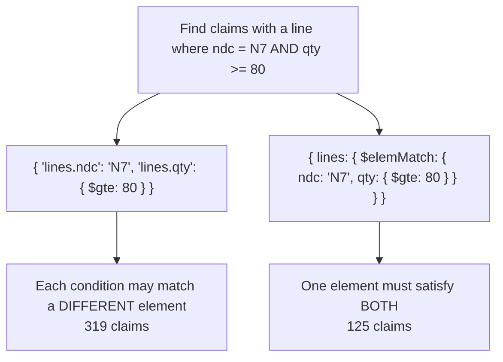
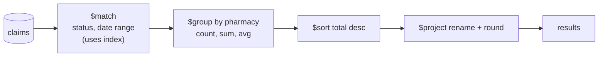

# CRUD, Query Operators & Aggregation Pipeline

!!! abstract "TL;DR"
    - Queries are documents: `{status: "PAID", amount: {$gte: 100}}`. Arrays have special semantics: dot notation conditions can match **different** elements, while `$elemMatch` requires **one** element to satisfy all of them (measured: 319 vs 125 matches for the same conditions).
    - `{x: null}` matches documents where `x` is null **or missing**. Use `$exists` or `$type: "null"` to tell them apart. `{tags: ["rx","mail"]}` is exact array equality, so use `$all` for "contains both".
    - Update with **operators**, not read-modify-write: `$set`, `$inc`, `$push` (with `$each`/`$slice`), `$addToSet`, positional `$` (first match) and `$[id]` with `arrayFilters` (all matches). `findOneAndUpdate` + `upsert` is the atomic counter or claim pattern. Batch with `bulkWrite`: 2,000 updates took **4.7 s** one by one and **0.31 s** in bulk.
    - The **aggregation pipeline** is a sequence of stages: filter early with `$match` (on indexed fields), then `$group`, `$sort`, `$project`, `$lookup`, `$unwind`, `$facet`, `$setWindowFields`. The optimiser moves `$match` forward when it can.
    - Limits: each stage has a 100 MB memory limit (spills to disk; `allowDiskUse` defaults to true since 6.0), and output documents are still capped at **16 MB**: a `$group` that `$push`ed every document failed at 59 MB.

## Why it matters

Most MongoDB bugs in application code are query-semantics bugs: an array condition matching the wrong documents, a null check that also matches missing fields, a lost update from read-modify-write, or an aggregation that scans the whole collection and runs out of memory. Interviewers test these semantics directly ("what does this query return?") and ask you to write aggregations for reporting questions. For backend roles, knowing atomic update operators is as important as knowing SQL `UPDATE … SET x = x + 1`.

All results come from MongoDB 8.0.4 (3-node replica set) with a 200,000-document `claims` collection, queried from PyMongo while writing this page.

## Core concepts

### The sample document

```javascript
{
  _id: 2, claimNo: "C0000002", memberId: "M004211", status: "PAID", pharmacy: "CVS",
  serviceDate: ISODate("2026-03-14"), amount: 212.40,
  lines: [ { ndc: "N18", qty: 18, paid: 102.52 }, { ndc: "N7", qty: 66, paid: 135.22 } ],
  tags: ["rx", "generic"]
}
```

### Query operators

| Category | Operators | Example |
|---|---|---|
| Comparison | `$eq $ne $gt $gte $lt $lte $in $nin` | `{amount: {$gte: 100, $lt: 500}}` |
| Logical | `$and $or $nor $not` | `{$or: [{status: "DENIED"}, {amount: {$gt: 400}}]}` |
| Element | `$exists $type` | `{deletedAt: {$exists: false}}` |
| Array | `$all $elemMatch $size` | `{lines: {$elemMatch: {ndc: "N7", qty: {$gte: 80}}}}` |
| Evaluation | `$regex $expr $jsonSchema $mod $text` | `{$expr: {$gt: ["$paid", "$amount"]}}` |
| Geo | `$near $geoWithin` | `{loc: {$near: {...}}}` |

Projection limits the fields returned (`{claimNo: 1, amount: 1, _id: 0}`), which cuts network transfer and enables covered queries ([indexing](03-indexing-and-explain-plans.md)). `sort`, `skip` and `limit` complete the cursor API. Deep `skip` has the same cost problem as SQL `OFFSET`, so page with range queries on an indexed key.

### Array and null semantics: the classic traps


*Notice that the dot-notation version matches a claim with one line for N7 (qty 5) and another line with qty 90. That's usually not what the question meant.*

Measured semantics on tiny collections:

| Query | Matches |
|---|---|
| `{x: null}` on `{x: null}`, `{}`, `{x: 5}` | the null **and** the missing document |
| `{x: {$exists: false}}` | only the missing one |
| `{x: {$type: "null"}}` | only the explicit null |
| `{tags: "rx"}` on `["rx","mail"]`, `["mail","rx"]`, `["rx"]` | all three (contains) |
| `{tags: ["rx","mail"]}` | only the first (exact array, order matters) |
| `{tags: {$all: ["rx","mail"]}}` | first and second (contains both, any order) |

### Update operators and atomicity

Every update to a single document is atomic. Use operators so the server computes the new value:

| Operator | Purpose |
|---|---|
| `$set`, `$unset` | Set or remove fields |
| `$inc`, `$mul`, `$min`, `$max` | Arithmetic, conditional set |
| `$push` (`$each`, `$slice`, `$sort`, `$position`) | Append, optionally capping the array |
| `$addToSet` | Append if not present (set semantics) |
| `$pull`, `$pop` | Remove by condition or from the ends |
| `$currentDate` | Server timestamp |
| `$` / `$[]` / `$[id]` + `arrayFilters` | First matching element / all elements / elements matching a filter |
| `$rename`, `$setOnInsert` | Rename; set only when an upsert inserts |

Measured behaviours:

- Updating a field to the value it already has: `matchedCount 1, modifiedCount 0`. The server detects the no-op, so don't use `modifiedCount` as "found".
- `{$set: {"lines.$[l].paid": 0}}` with `arrayFilters: [{"l.qty": {$gt: 50}}]` changed only the line with qty 66.
- The positional `$` (`{"lines.qty": {$gt: 50}}` in the filter, `{$set: {"lines.$.flag": true}}`) changes **only the first** matching element.
- `findOneAndUpdate({_id: "claimNo"}, {$inc: {seq: 1}}, {upsert: true, returnDocument: "after"})` created the counter and returned `seq: 1` atomically.

### The aggregation pipeline


*Notice that documents flow through stages like a Unix pipe. Every stage sees only what the previous one emitted, so filtering first shrinks all later work.*

| Stage | Does | SQL analogue |
|---|---|---|
| `$match` | Filter | `WHERE` / `HAVING` (after `$group`) |
| `$project` / `$addFields` / `$set` / `$unset` | Reshape, compute | `SELECT` expressions |
| `$group` | Aggregate by key (`$sum`, `$avg`, `$max`, `$push`, `$addToSet`, `$first`, `$top`) | `GROUP BY` |
| `$sort`, `$limit`, `$skip` | Order, page | `ORDER BY`, `LIMIT` |
| `$unwind` | One output document per array element | Joining to a child table |
| `$lookup` | Left outer join to another collection (with optional sub-pipeline) | `LEFT JOIN` |
| `$facet` | Several sub-pipelines over the same input | Several queries in one |
| `$bucket` / `$bucketAuto` | Histogram groups | `CASE` ranges + `GROUP BY` |
| `$setWindowFields` (5.0+) | Window functions: running totals, ranks, moving averages | `OVER (PARTITION BY … ORDER BY …)` |
| `$merge` / `$out` | Write results to a collection | `INSERT … SELECT`, materialized view |
| `$unionWith` | Combine collections | `UNION ALL` |

Measured on 200,000 claims (no secondary indexes yet):

| Pipeline | Time |
|---|---|
| March PAID claims grouped by pharmacy (count, total, average) | 124 ms |
| `$unwind` lines → top 3 NDCs by quantity over all PAID claims | 524 ms |
| `$match` DENIED + Optum, `$limit` 100, `$lookup` member | 10 ms |
| `$facet`: counts by status + amount histogram + total for CVS (49,862 claims) | one round trip |

**Optimiser:** in a pipeline written as `$project` → `$match {status: "DENIED"}` → `$group`, `explain` showed the `$match` pushed into the initial query (the `parsedQuery` contained `status: {$eq: "DENIED"}`), so it can use an index. The optimiser also coalesces `$sort` + `$limit` into a top-N sort and moves `$match` ahead of `$lookup` when the filter doesn't depend on the joined field. It can't move a `$match` on a computed field ahead of the stage that computes it, so write pipelines in the right order anyway.

**Limits:** each blocking stage (`$group`, `$sort`, `$bucket`, `$setWindowFields`) may use 100 MB of RAM before spilling to disk. `allowDiskUse` is true by default since MongoDB 6.0, and spilling is slow. Every document produced, including a `$group` result, must still fit in **16 MB**. Measured: `{$group: {_id: null, all: {$push: "$$ROOT"}}}` failed with "BSON size limit hit … Size: 59287442 … maxSize: 16793600".

## In practice: code & configuration

### Atomic updates instead of read-modify-write

=== "❌ Common mistake"

    ```java
    // Lost update: two concurrent requests read version 3, both write 4
    Claim c = claims.findById(id).orElseThrow();
    c.getAudit().add(new AuditEntry("PAID", Instant.now()));
    c.setStatus("PAID");
    c.setRetries(c.getRetries() + 1);
    claims.save(c);                                // overwrites the whole document
    ```

=== "✅ Better"

    ```java
    // One atomic server-side update, guarded by the expected state
    UpdateResult r = mongo.updateFirst(
        Query.query(Criteria.where("_id").is(id).and("status").is("PENDING")),   // state check
        new Update()
            .set("status", "PAID")
            .inc("retries", 1)
            .push("audit").slice(-20).each(new AuditEntry("PAID", Instant.now()))  // capped array
            .currentDate("updatedAt"),
        Claim.class);
    if (r.getMatchedCount() == 0) throw new ConflictException("claim no longer pending");
    ```

The filter acts as a compare-and-set: the update happens only if the claim is still `PENDING`. That's optimistic concurrency without a version field. Spring Data's `@Version` does the same with a counter.

### Bulk writes

```java
BulkOperations ops = mongo.bulkOps(BulkOperations.BulkMode.UNORDERED, Claim.class);
for (Adjudication a : batch) {
    ops.updateOne(Query.query(Criteria.where("_id").is(a.claimId())),
                  new Update().set("status", a.status()).set("paidAmount", a.paid()));
}
BulkWriteResult res = ops.execute();       // one round trip per ~100k ops (server-side batching)
```

Measured: 2,000 single-document updates took **4.72 s** one at a time (round trips plus a replica-set write each) and **0.31 s** as one unordered `bulkWrite`. `ordered: false` lets the server continue after an error and run operations in parallel. Use `ordered: true` when later operations depend on earlier ones.

### Writing aggregations in Spring Data

```java
Aggregation agg = Aggregation.newAggregation(
    match(Criteria.where("status").is("PAID")
          .and("serviceDate").gte(start).lt(end)),
    group("pharmacy").count().as("claims").sum("amount").as("total").avg("amount").as("avg"),
    sort(Sort.Direction.DESC, "total"),
    project("claims", "total", "avg").and("_id").as("pharmacy").andExclude("_id"));

List<PharmacyTotals> rows = mongo.aggregate(agg, "claims", PharmacyTotals.class).getMappedResults();
```

```javascript
// Running total and rank per member (window functions, 5.0+)
db.claims.aggregate([
  { $match: { memberId: "M000042" } },
  { $setWindowFields: {
      partitionBy: "$memberId", sortBy: { serviceDate: 1 },
      output: {
        running: { $sum: "$amount", window: { documents: ["unbounded", "current"] } },
        rank:    { $rank: {} } } } }
])
// → 10.59 (rank 1), 485.60 (rank 2), 590.33 (rank 3), ...
```

## Real-world usage

- **Operational APIs** use `find` with projections and indexed filters, and atomic updates such as status transitions, counters and capped audit arrays.
- **Reporting and dashboards** use aggregation pipelines, often materialised with `$merge` into summary collections on a schedule (an on-demand materialized view) rather than running heavy pipelines per request.
- **Search pages** use `$facet` to return results plus facet counts in one call, or Atlas Search's `$search` stage.
- **Job claiming:** `findOneAndUpdate({status: "READY"}, {$set: {status: "RUNNING", owner: me}}, {sort: {priority: -1}})` atomically claims the next job, a simple queue pattern.
- **Analytics on operational data** is usually pushed to a warehouse or Atlas Data Federation to keep heavy pipelines off the primary, or run on secondaries with `readPreference: secondary`.

## Trade-offs & production gotchas

!!! warning "Query and update traps"
    - **Dot notation on arrays of subdocuments** when one element must satisfy all conditions: use `$elemMatch` (319 vs 125 here).
    - **`{field: null}`** also matches missing fields.
    - **`save()` of a whole document** after reading it: lost updates and rewrites of large documents. Use update operators.
    - **`modifiedCount == 0` doesn't mean "not found"**: check `matchedCount`.
    - **Regex without an anchor** (`/abc/`) can't use an index efficiently. A case-insensitive regex can't use a normal index at all. Use a prefix regex (`/^abc/`), a collation-aware index, or text search.
    - **`$lookup` in hot paths:** fine with an index on `foreignField` and a small input, painful on large inputs. Reconsider the [schema](01-document-model-and-schema-design.md).
    - **`$unwind` explosions:** unwinding large arrays multiplies documents. `$match` and `$project` first, and consider `preserveNullAndEmptyArrays`.
    - **Pipelines that start with `$group` or `$project` on unindexed data** scan the whole collection. Start with an indexed `$match`.

- **Server-side vs client-side processing:** pipelines move computation to the data, which is less network and faster, but heavy pipelines compete with operational traffic on the primary.
- **Expressiveness:** `$expr` and aggregation operators allow almost anything, but filters inside `$expr` often can't use indexes. Keep simple equality and range predicates as plain query operators.

## How this connects to my experience

- **Where I used it:** not ★. MongoDB in Spring Boot microservices at OptumRx ("Java, Spring Boot, Kafka, MongoDB, Redis, and GraphQL"), typically through Spring Data repositories, `MongoTemplate` updates and aggregations behind GraphQL resolvers. *[confirm which aggregation reports or atomic-update patterns you wrote]*
- **Talking points:**
    - "I use update operators with a state check in the filter rather than read-modify-write, so concurrent requests can't lose updates."
    - "I start pipelines with an indexed `$match` and project early. For dashboards I materialise results with `$merge` instead of running heavy pipelines per request."
    - "I know the array semantics: `$elemMatch` for 'same element', `$all` for 'contains all'."
- **Likely follow-up chain:** "How do you update a nested array element?" (positional, arrayFilters) → "How do you avoid lost updates?" → "Write an aggregation for X" → "How do you make it fast?" (indexes, `$match` first) → "What are the aggregation limits?"

## Interview questions

### Fundamentals

??? question "Q1. What's the difference between `{'lines.ndc': 'N7', 'lines.qty': {$gte: 80}}` and the $elemMatch version?"
    **Answer:** With dot notation, each condition is evaluated independently against the array, so the document matches if *some* element has `ndc: "N7"` and *some* (possibly different) element has `qty ≥ 80`. With `{lines: {$elemMatch: {ndc: "N7", qty: {$gte: 80}}}}`, a single element must satisfy both. Measured: 319 vs 125 matching claims. Use `$elemMatch` whenever conditions refer to the same array element.

    **Interviewer listens for:** per-element vs any-element semantics, and a concrete consequence.

    **Common wrong answer:** "They're equivalent."

??? question "Q2. What does `{x: null}` match?"
    **Answer:** Documents where `x` is explicitly null **and** documents where `x` doesn't exist (measured: both matched). To find only missing fields use `{x: {$exists: false}}`, and only explicit nulls `{x: {$type: "null"}}`. Indexes treat missing and null the same way unless the index is sparse or partial, which affects both semantics and index usage.

    **Interviewer listens for:** null-or-missing, and the distinguishing operators.

    **Common wrong answer:** "Only documents where x is null."

??? question "Q3. How do you increment a counter safely under concurrency?"
    **Answer:** With an atomic update operator: `updateOne({_id: id}, {$inc: {count: 1}})`. The server applies it atomically to the single document, so concurrent increments never get lost. Never read, add one in the application and save, because two readers would both write the same value. For a sequence generator, use `findOneAndUpdate` with `$inc`, `upsert: true` and `returnDocument: "after"` (measured: created and returned `seq: 1` in one call).

    **Interviewer listens for:** `$inc`, single-document atomicity, and findOneAndUpdate for returning the value.

    **Common wrong answer:** "Wrap it in a transaction." It works, but it's unnecessary.

??? question "Q4. Name the most common aggregation stages and what they do."
    **Answer:** `$match` (filter), `$project`/`$addFields` (reshape, compute), `$group` (aggregate by key with accumulators such as `$sum`, `$avg`, `$push`), `$sort`, `$limit`/`$skip`, `$unwind` (flatten arrays), `$lookup` (left outer join), `$facet` (several sub-pipelines in one pass), `$bucket` (histograms), `$setWindowFields` (window functions), and `$merge`/`$out` (write results). Put `$match` first so it can use indexes.

    **Interviewer listens for:** a correct list with SQL analogues and stage ordering.

    **Common wrong answer:** describing only `find` with options.

### Intermediate

??? question "Q5. How do you update only the array elements that meet a condition?"
    **Answer:** Use the filtered positional operator with `arrayFilters`: `updateOne({_id: 2}, {$set: {"lines.$[l].paid": 0}}, {arrayFilters: [{"l.qty": {$gt: 50}}]})`. That updates every element matching the filter (measured: only the qty-66 line changed). The plain positional `$` updates only the **first** element matched by the query filter, and `$[]` updates all elements. Since 3.6 you rarely need to read, modify and write arrays in the application.

    **Interviewer listens for:** `$[id]` + arrayFilters vs `$` vs `$[]`.

    **Common wrong answer:** "Load the document, loop over the array in Java and save it."

??? question "Q6. What's the difference between matchedCount and modifiedCount?"
    **Answer:** `matchedCount` is how many documents the filter matched. `modifiedCount` is how many were actually changed. If the update sets values that are already there, MongoDB doesn't rewrite the document, so `modifiedCount` is 0 while `matchedCount` is 1 (measured). For "did the entity exist" or "did my state-guarded update apply", check `matchedCount`. With upserts, also check `upsertedId`.

    **Interviewer listens for:** the no-op detection and which counter to use.

    **Common wrong answer:** "They're always equal."

??? question "Q7. How do you implement optimistic concurrency in MongoDB?"
    **Answer:** Put the expected state in the update filter, so the update succeeds only if nothing changed: either a version field (`{_id, version: 3}` → `$set` + `$inc: {version: 1}`) or a business state (`{_id, status: "PENDING"}`). If `matchedCount == 0`, someone else changed it, so reload and retry or return a conflict. Spring Data's `@Version` automates the version-field approach and throws `OptimisticLockingFailureException`.

    **Interviewer listens for:** compare-and-set via the filter, the matchedCount check, and @Version.

    **Common wrong answer:** "MongoDB locks documents while you edit them."

??? question "Q8. Why use bulkWrite, and what does ordered vs unordered mean?"
    **Answer:** `bulkWrite` sends many inserts, updates and deletes in a few round trips instead of one per operation. Measured: 2,000 updates went from 4.72 s to 0.31 s. Ordered (the default) executes sequentially and stops at the first error. Unordered can execute in any order (and in parallel on sharded clusters) and continues past errors, reporting them all at the end. Use unordered for independent operations and ordered when operations depend on each other. A bulk write isn't a transaction: each operation is atomic on its own.

    **Interviewer listens for:** round trips, error semantics, and that bulk isn't atomic.

    **Common wrong answer:** "bulkWrite is a transaction."

??? question "Q9. How does the aggregation optimiser help, and where can't it?"
    **Answer:** It reorders and merges stages when that's safe: it moves `$match` ahead of `$project`/`$addFields` when the match doesn't use computed fields (measured: a late `$match` showed up in the query's `parsedQuery`), pushes `$match` before `$lookup` when it doesn't reference the joined field, coalesces `$sort` + `$limit` into a top-K sort, and merges adjacent `$match` or `$limit` stages. It can't move a `$match` on a field computed by `$group` or `$addFields` ahead of that stage, and it can't index-accelerate stages after a blocking stage. So write pipelines with an indexed `$match` first and check `explain`.

    **Interviewer listens for:** specific optimisations, their limits, and verification with explain.

    **Common wrong answer:** "Stage order doesn't matter because the optimiser fixes everything."

### Senior

??? question "Q10. What are the memory and size limits of aggregation, and how do you work within them?"
    **Answer:** Blocking stages (`$group`, `$sort`, `$bucket`, `$setWindowFields`) can use 100 MB of RAM each, then spill to disk if `allowDiskUse` is enabled (the default since 6.0), which is much slower. Output documents, including group results and `$lookup` arrays, must be ≤ 16 MB (measured: a `$push` of all documents failed at 59 MB). Work within them by filtering and projecting early, grouping to small results, avoiding `$push` of whole documents (use `$topN`/`$firstN`), using `$lookup` sub-pipelines with `$limit`, using indexes so `$sort` doesn't have to block, and materialising large intermediate results with `$merge`.

    **Interviewer listens for:** both limits, spill behaviour, and practical mitigations.

    **Common wrong answer:** "Aggregation has no limits; it streams everything."

??? question "Q11. How would you build a dashboard that shows totals per pharmacy per day over a year of claims?"
    **Answer:** Don't run a full-collection pipeline per page view. Schedule an incremental aggregation: `$match` new or changed claims since the last run (indexed `updatedAt`), `$group` by `{pharmacy, day}`, and `$merge` into a `daily_pharmacy_totals` collection (`whenMatched: "merge"` or a pipeline that adds). The dashboard queries the small summary collection with an index on `{pharmacy, day}`. Late or corrected claims re-trigger their day. Optionally run the job on a secondary or on an analytics node. This is a materialized view built with `$merge`.

    **Interviewer listens for:** precomputation, incremental `$merge`, indexes, and late data.

    **Common wrong answer:** "Run the aggregation on every request with allowDiskUse."

??? question "Q12. When is $lookup acceptable, and when does it indicate a schema problem?"
    **Answer:** Acceptable for occasional or bounded joins: a small filtered input (after `$match`/`$limit`) joining on an indexed `foreignField` (measured: 100 claims joined to members in 10 ms), admin reports, or lookups to small reference collections. It signals a schema problem when hot API paths join large inputs or several collections every time, essentially using MongoDB as a relational database. Then embed or use extended references for the displayed fields. In sharded clusters, `$lookup` into a sharded collection is supported since 5.1, but it's still costly.

    **Interviewer listens for:** index on foreignField, input size, frequency, and schema remedies.

    **Common wrong answer:** "Never use $lookup", or "Use it like SQL joins everywhere."

### Scenario-based

??? question "Q13. A report shows claims 'with a denied line over £100', but finance says the count is too high. What's likely wrong?"
    **Answer:** The query probably used dot notation on the array (`{"lines.status": "DENIED", "lines.amount": {$gt: 100}}`), which matches claims where one line is denied and a *different* line is over £100. Rewrite with `$elemMatch` so both conditions apply to the same line. In an aggregation, `$unwind` then `$match`, or `$filter` the array. Verify with a few sample documents and compare counts (on this page's data the difference was 319 vs 125). Also check null handling if a field can be missing.

    **Interviewer listens for:** identifying array semantics as the root cause and verifying the fix.

    **Common wrong answer:** "The data must be duplicated."

??? question "Q14. Concurrent requests that add items to a cart sometimes lose items. The code reads the cart, adds the item in Java and calls save(). Fix it."
    **Answer:** That's a lost update: two requests read the same version, each adds an item, and the second `save()` overwrites the first's array. Use an atomic server-side update: `updateOne({_id: cartId}, {$push: {items: item}, $inc: {itemCount: 1}, $currentDate: {updatedAt: true}})`, or `$addToSet` for unique items, or `arrayFilters`/`$inc` to bump the quantity of an existing line. If several fields must stay consistent with business rules, add a version field with optimistic concurrency (`@Version`) and retry on conflict. Add a concurrency test that fires parallel adds and asserts the count.

    **Interviewer listens for:** naming the lost update, operator-based fixes, optimistic locking, and a test.

    **Common wrong answer:** "Use synchronized in the service." That doesn't work across instances.

## Cheat sheet

| Topic | Remember |
|---|---|
| Same-element match | `$elemMatch` (125) vs dot notation (319) |
| Null | `{x: null}` = null or missing; `$exists`, `$type: "null"` |
| Arrays | `{tags: "rx"}` contains; `[..]` exact; `$all` contains all |
| Atomic updates | `$set $inc $push($each,$slice) $addToSet $pull $currentDate` |
| Array element updates | `$` first match; `$[]` all; `$[id]` + `arrayFilters` |
| Counters / claims | `findOneAndUpdate` + `$inc` + `upsert` |
| Optimistic concurrency | Expected state/version in filter; check `matchedCount` |
| No-op | modified 0, matched 1 |
| Bulk | `bulkWrite` unordered: 4.72 s → 0.31 s; not a transaction |
| Pipeline order | Indexed `$match` → `$project` → `$group` → `$sort` → … |
| Limits | 100 MB per blocking stage (spills, allowDiskUse default true 6.0+), 16 MB per output doc |
| Window functions | `$setWindowFields` (5.0+) |
| Materialise | `$merge` into summary collections |

## Sources
1. [MongoDB Manual: Query and projection operators](https://www.mongodb.com/docs/manual/reference/operator/query/) and [Query on arrays / $elemMatch](https://www.mongodb.com/docs/manual/tutorial/query-arrays/).
2. [MongoDB Manual: Query for null or missing fields](https://www.mongodb.com/docs/manual/tutorial/query-for-null-fields/).
3. [MongoDB Manual: Update operators](https://www.mongodb.com/docs/manual/reference/operator/update/), [filtered positional $[identifier]](https://www.mongodb.com/docs/manual/reference/operator/update/positional-filtered/) and [bulkWrite](https://www.mongodb.com/docs/manual/core/bulk-write-operations/).
4. [MongoDB Manual: Aggregation pipeline](https://www.mongodb.com/docs/manual/core/aggregation-pipeline/), [optimization](https://www.mongodb.com/docs/manual/core/aggregation-pipeline-optimization/) and [limits](https://www.mongodb.com/docs/manual/core/aggregation-pipeline-limits/).
5. [MongoDB Manual: $setWindowFields](https://www.mongodb.com/docs/manual/reference/operator/aggregation/setWindowFields/) and [$merge (on-demand materialized views)](https://www.mongodb.com/docs/manual/core/materialized-views/).
6. [Spring Data MongoDB reference: Aggregation framework support and bulk operations](https://docs.spring.io/spring-data/mongodb/reference/mongodb/aggregation-framework.html).
7. Demonstrations on this page: MongoDB 8.0.4 replica set with 200,000 claims via PyMongo, run while writing this page.
