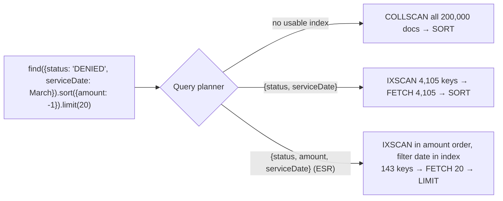
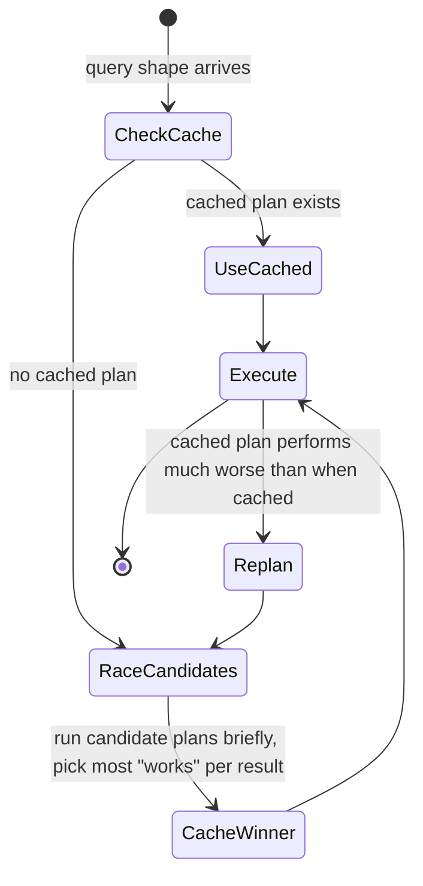

# Indexing & Explain Plans

!!! abstract "TL;DR"
    - Without an index MongoDB does a **COLLSCAN**. Finding one member's 10 claims examined **200,000 documents in 123 ms**. With an index on `memberId` it examined **10 keys and 10 documents in 2 ms**.
    - **Compound index order follows ESR: Equality, Sort, Range.** For "DENIED claims in March, top 20 by amount", `{status, serviceDate}` examined 4,105 documents plus an in-memory SORT (24 ms), while `{status: 1, amount: -1, serviceDate: 1}` examined **143 keys, 20 documents, no SORT stage (2 ms)**.
    - **Covered queries** read only the index (`totalDocsExamined: 0`, `PROJECTION_COVERED`). Remember to exclude `_id` unless it's in the index.
    - Special indexes: **multikey** (arrays, one key per element), **partial** (only matching documents: 0.16 MB vs about 2 MB), **TTL** (expiry, removed by a background task about every 60 s; 1,000 docs gone after 16 s here), **unique** (E11000), **hidden** (test a drop safely), text, geo, hashed, wildcard.
    - Read `explain("executionStats")`: compare **nReturned vs totalKeysExamined vs totalDocsExamined**, and look for `COLLSCAN`, `SORT` and `FETCH`. A healthy query has all three close together. Every index costs writes: 5 extra indexes doubled insert time (0.73 s → 1.46 s for 50k docs).

## Why it matters

Indexes are the biggest performance lever in MongoDB and the most common source of production incidents: a missing index that turns into a collection scan under load, a compound index in the wrong order that still sorts in memory, or dozens of unused indexes slowing every write and filling RAM. Interviewers ask about the ESR rule, covered queries, multikey behaviour and how to read `explain`, and resume claims like "optimised MongoDB queries" get probed with exactly these.

Everything on this page was measured on a MongoDB 8.0.4 replica set against a 200,000-document `claims` collection (the same data as the [CRUD page](02-crud-query-operators-and-aggregation-pipeline.md)), using `explain("executionStats")`.

## Core concepts

### What an index is

A MongoDB index is a B-tree (WiredTiger) of key values → record ids, ordered by the key pattern. A query planner can use it to **find** matching documents (equality and range scans), to **return them in order** (avoiding an in-memory sort), and sometimes to **answer the query entirely** (covered). Every collection has a unique index on `_id`.


*Notice that the ESR index doesn't examine fewer March documents. It walks DENIED claims in amount order and stops after 20 matches, which avoids both the big fetch and the sort.*

### Index types

| Type | Example | Notes |
|---|---|---|
| Single field | `{memberId: 1}` | Direction doesn't matter for a single field |
| Compound | `{status: 1, amount: -1, serviceDate: 1}` | Order matters (ESR). Supports queries on any **prefix** |
| Multikey | `{"lines.ndc": 1}` | Automatic when the field is an array: one key per element. A compound index can contain at most one array field per document |
| Text | `{description: "text"}` | Stemmed word search; one per collection; Atlas Search is far more capable |
| Geospatial | `{loc: "2dsphere"}` | `$near`, `$geoWithin` |
| Hashed | `{memberId: "hashed"}` | Equality only; used for hashed shard keys |
| Wildcard | `{"attrs.$**": 1}` | Arbitrary or unknown field names (attribute pattern) |
| Clustered (5.3+) | Collection ordered by `_id` | Time-series and range-by-`_id` workloads |

Properties: `unique`, `partialFilterExpression`, `sparse`, `expireAfterSeconds` (TTL), `hidden`, `collation` (case-insensitive matching).

### Measured: before and after

| Query | Plan | Keys examined | Docs examined | Returned | Time |
|---|---|---|---|---|---|
| `{memberId: "M000042"}`, no index | COLLSCAN | 0 | **200,000** | 10 | 123 ms |
| Same, index `{memberId: 1}` | IXSCAN → FETCH | 10 | 10 | 10 | 2 ms |
| DENIED + March, sort amount desc, limit 20, no index | COLLSCAN → SORT | 0 | 200,000 | 20 | 111 ms |
| Same, index `{serviceDate, status}` | IXSCAN → FETCH → **SORT** | 4,137 | 4,105 | 20 | 17 ms |
| Same, index `{status, serviceDate}` | IXSCAN → FETCH → **SORT** | 4,105 | 4,105 | 20 | 24 ms |
| Same, index `{status: 1, amount: -1, serviceDate: 1}` | IXSCAN → FETCH → LIMIT | **143** | **20** | 20 | **2 ms** |
| Member's claims, projection `{_id: 0, serviceDate: 1, amount: 1}`, index `{memberId, serviceDate, amount}` | IXSCAN → **PROJECTION_COVERED** | 10 | **0** | 10 | 3 ms |
| Same projection but `_id` included | IXSCAN → FETCH → PROJECTION | 10 | 10 | 10 | <1 ms |

### The ESR rule

For a compound index serving a query with equality filters, a sort and range filters, order the fields:

1. **Equality** fields first (`status = "DENIED"`). They narrow to one contiguous range of the index.
2. **Sort** fields next (`amount: -1`). Within that equality range the index is already in sort order, so no blocking SORT stage.
3. **Range** fields last (`serviceDate` between …). They're checked inside the index scan without breaking the sort order.

Putting the range before the sort (`{status, serviceDate, amount}`) would require an in-memory sort, because amounts are only ordered *within* each date. Putting the range first (`{serviceDate, status}`) scans the whole date range for all statuses. ESR is a strong default, not a law: a highly selective range can justify breaking it, so measure with `explain`.

Other compound-index facts:

- **Prefixes:** `{a, b, c}` serves queries on `a`, `a+b` and `a+b+c`, but not `b` alone or `c` alone. So `{status, serviceDate}` makes a separate `{status}` index redundant.
- **Sort direction:** `{a: 1, b: -1}` supports `sort({a: 1, b: -1})` and the exact reverse `sort({a: -1, b: 1})`, but not `sort({a: 1, b: 1})`.
- **Selectivity:** low-cardinality fields (status with 3 values) are poor alone but fine as the equality prefix of a compound index.

### Covered queries

A query is covered when every filtered, sorted and projected field is in the index, so MongoDB never fetches documents. Measured: `totalDocsExamined: 0` and the stage `PROJECTION_COVERED`. Common reasons a query isn't covered: `_id` returned by default (exclude it, or include it in the index), projecting a field missing from the index, a multikey index (arrays can't cover), or querying on embedded documents as a whole.

### Multikey indexes

Indexing an array field creates one index entry per element. Measured: `{"lines.ndc": 1}` on 200,000 claims with 1–4 lines each produced a 3.9 MB index, `isMultiKey: true`. The query for one NDC examined 1,008 keys and returned 1,008 claims. Caveats: index size grows with array length, a compound index can't index two array fields of the same document ("parallel arrays"), multikey indexes can't cover queries, and `$elemMatch` is needed to bound several conditions to one element.

### Partial, sparse, TTL, unique, hidden

| Feature | Measured or observed |
|---|---|
| **Partial** `{serviceDate: 1}` where `status = "PENDING"` | **0.16 MB** vs ~2 MB for a full index on the same field. Used for `{status: "PENDING", serviceDate ≥ June}` when hinted (2,578 keys) |
| Partial index forced (`hint`) on a query **outside** its filter | Returned **468** documents instead of the correct 5,559, a silently incomplete result. Never hint a partial index for queries it doesn't cover |
| **TTL** `expireAfterSeconds: 1` | 1,000 documents removed after **16 s**. The TTL monitor runs about every 60 s, so expiry isn't exact |
| **Unique** on `email` | Second insert failed with `E11000 duplicate key error` |
| **Hidden** `memberId_1` | The planner switched to `member_date_amount` (another index with `memberId` as prefix), so the index could be dropped safely. Unhiding restored it instantly |

Sparse indexes skip documents missing the field. Partial indexes are the more general, preferred tool.

### How the planner picks a plan


*Notice that plans are chosen empirically by racing candidates on the real data, then cached per query shape. A plan that was good for one parameter value can be cached and reused for a much worse one, until replanning kicks in.*

The plan cache is cleared when indexes change, when the collection is significantly modified, or on restart. Inspect it with `db.claims.getPlanCache().list()`. Force a plan with `hint()` (carefully, see the partial-index trap above), or pin one with **query settings** (`setQuerySettings`, 8.0+; index filters in older versions).

### Reading explain output

```javascript
db.claims.find({ status: "DENIED", serviceDate: { $gte: ISODate("2026-03-01"), $lt: ISODate("2026-04-01") } })
         .sort({ amount: -1 }).limit(20)
         .explain("executionStats")
```

| Field | Meaning | Healthy |
|---|---|---|
| `winningPlan.stage` tree | e.g. `LIMIT → FETCH → IXSCAN` | No `COLLSCAN` on large collections; no `SORT` for sorted queries |
| `indexName`, `indexBounds` | Which index, which key ranges | Tight bounds on equality fields |
| `nReturned` | Documents returned | |
| `totalKeysExamined` | Index entries read | Close to nReturned |
| `totalDocsExamined` | Documents fetched | Close to nReturned (0 if covered) |
| `executionTimeMillis` | Server execution time | |
| `rejectedPlans` | Candidates that lost | Useful to see alternatives |
| `isMultiKey`, `PROJECTION_COVERED`, `SORT` + `usedDisk` | Index and sort details | |

Rule of thumb: **docsExamined / nReturned** much larger than 1 means the index isn't selective enough or is missing a field. A `SORT` stage on a big result means the sort isn't index-backed.

## In practice: code & configuration

=== "❌ Common mistake"

    ```javascript
    // One index per field, hoping MongoDB combines them
    db.claims.createIndex({ status: 1 })
    db.claims.createIndex({ serviceDate: 1 })
    db.claims.createIndex({ amount: 1 })
    // Query: DENIED in March, sorted by amount → picks one index, FETCHes thousands, sorts in memory.
    // (Index intersection exists but is rarely chosen and is no substitute for a compound index.)

    // Case-insensitive search with a regex: scans every key
    db.claims.find({ claimNo: /^c00001/i })    // measured: 200,000 keys examined, 140 ms
    ```

=== "✅ Better"

    ```javascript
    // One compound index designed for the query (ESR)
    db.claims.createIndex({ status: 1, amount: -1, serviceDate: 1 })   // 143 keys, 2 ms

    // Prefix regex, case-sensitive: uses index bounds
    db.claims.find({ claimNo: /^C00001/ })     // measured: 101 keys, 2 ms

    // Case-insensitive: index with a collation and query with the same collation
    db.members.createIndex({ email: 1 }, { collation: { locale: "en", strength: 2 } })
    db.members.find({ email: "A.Patel@Example.com" }).collation({ locale: "en", strength: 2 })
    ```

Measured regex results on `{claimNo: 1}`: anchored prefix `^C00001` examined **101 keys** (2 ms). Unanchored `00001` and case-insensitive `^c00001` both examined **all 200,000 keys** (about 140 ms). They still use the index, but scan the whole thing.

### Declaring indexes in Spring Data MongoDB

```java
@Document("claims")
@CompoundIndexes({
    @CompoundIndex(name = "status_amount_date", def = "{'status': 1, 'amount': -1, 'serviceDate': 1}"),
    @CompoundIndex(name = "member_date",        def = "{'memberId': 1, 'serviceDate': -1}")
})
public class Claim {
    @Id private String id;
    @Indexed(unique = true) private String claimNo;
    private String memberId;
    private String status;
    private BigDecimal amount;
    private Instant serviceDate;
}
```

```yaml
spring:
  data:
    mongodb:
      auto-index-creation: false   # default false since Boot 2.x/Spring Data 3: don't build indexes at startup in prod
```

In production, create indexes through migrations (Mongock, Liquibase-MongoDB) or infrastructure scripts, reviewed like schema changes. Index builds on large collections take time and I/O. Since 4.2 they hold an exclusive lock only briefly at the start and end, and on replica sets they build on all members simultaneously (4.4+). For very large collections, schedule them in quiet periods or use rolling builds.

### Finding missing and unused indexes

```javascript
// Slow operations (profiler level 1, > 100 ms)
db.setProfilingLevel(1, { slowms: 100 })
db.system.profile.find({ planSummary: "COLLSCAN" }).sort({ ts: -1 }).limit(5)

// Index usage since last restart: zero-use indexes are drop candidates
db.claims.aggregate([{ $indexStats: {} }, { $project: { name: 1, "accesses.ops": 1 } }])

// Safe removal: hide, watch metrics for a while, then drop
db.claims.hideIndex("status_date")
```

## Real-world usage

- **Atlas Performance Advisor** and the **Query Profiler** suggest indexes from slow-query logs. Teams review them against ESR and existing prefixes rather than accepting all of them.
- **Multi-tenant SaaS:** `tenantId` is the first field of almost every compound index (equality), which also keeps each tenant's data contiguous.
- **Time-ordered feeds:** `{userId: 1, createdAt: -1}` serves "latest N for a user" with no sort, plus range pagination on `createdAt`.
- **TTL indexes** expire sessions, OTP codes and temporary documents, and enforce retention on event collections.
- **Partial unique indexes** enforce "one active subscription per member": `unique` + `partialFilterExpression: {status: "ACTIVE"}`.

## Trade-offs & production gotchas

!!! warning "Indexing pitfalls"
    - **Too many indexes:** each one slows every insert, update and delete that touches its fields (5 extra indexes doubled insert time here) and takes RAM. Keep the working set of indexes in memory.
    - **Wrong compound order:** an index exists, but the plan still has a blocking `SORT` or examines thousands of documents. Apply ESR and verify.
    - **Redundant prefixes:** `{a}` alongside `{a, b}` is usually redundant.
    - **Hinting a partial index** outside its filter returns incomplete results (468 instead of 5,559 here).
    - **Unanchored or case-insensitive regex** scans the whole index. Use collation indexes or a search engine.
    - **Plan cache surprises:** a plan cached for a selective value is reused for a value that matches half the collection. Watch for replanning in the logs, and consider query settings.
    - **Large multikey indexes:** indexing long arrays multiplies index size.
    - **TTL isn't precise:** deletion runs about every 60 s and can lag under load. Don't rely on it for exact expiry or security cut-offs (also filter by time in queries).

- **Index builds and replication:** a big build adds I/O on every member. Plan capacity and timing.
- **Sharded clusters:** queries without the shard key go to every shard (scatter-gather) even if each shard has a good index. See [sharding](05-sharding-and-shard-key-selection.md).

## How this connects to my experience

- **Resume bullets (OptumRx):** "Designed and developed microservices using Java, Spring Boot, Kafka, MongoDB, Redis, and GraphQL" and "Implemented Redis-based caching for frequently accessed queries and UI reference data." Indexing decides whether those frequent queries were fast enough before caching.
- **How to talk about it:** describe a query you optimised: the access pattern (for example, a member's claims by date, or search by status and date), the `explain` output before (COLLSCAN or a SORT stage, the docsExamined/nReturned ratio), the compound index you designed using ESR, and the after numbers. *[confirm: a specific query or collection you indexed, real before/after numbers if you have them, and whether you used Atlas Performance Advisor or the profiler — don't quote numbers you didn't measure]*
- **Talking points:**
    - "I design compound indexes from the query: equality fields, then the sort, then ranges. Then I verify with explain that there's no blocking SORT and docsExamined is close to nReturned."
    - "I treat every index as a write cost and remove unused ones using `$indexStats`, hiding them first."
    - "Caching was for repeated reads. Indexes made the uncached path fast."
- **Likely follow-up chain:** "How did you find slow queries?" (profiler, logs, Atlas) → "Walk me through an explain plan" → "Why that field order?" (ESR) → "What's a covered query?" → "What does indexing an array do?" → "How many indexes is too many?" → "How do you add an index to a 500 GB collection in production?"

## Interview questions

### Fundamentals

??? question "Q1. What happens when a query has no suitable index?"
    **Answer:** MongoDB performs a COLLSCAN, reading every document in the collection and filtering them. Measured: finding one member's 10 claims examined all 200,000 documents in 123 ms. With an index on `memberId` it examined 10 keys and 10 documents in 2 ms. Collection scans also evict useful data from the WiredTiger cache, so under load they hurt other queries too. Find them with `explain`, the profiler (`planSummary: COLLSCAN`) or Atlas Performance Advisor.

    **Interviewer listens for:** COLLSCAN, the cost, cache impact, and detection.

    **Common wrong answer:** "MongoDB is fast enough without indexes because it's in memory."

??? question "Q2. Explain the ESR rule."
    **Answer:** For compound indexes, order fields as Equality, then Sort, then Range. Equality fields narrow the scan to a contiguous section of the index. Sort fields next mean results within that section are already ordered, so there's no blocking in-memory SORT. Range fields last are filtered while scanning without breaking the order. Measured: for DENIED claims in March sorted by amount (top 20), `{status, serviceDate}` examined 4,105 documents and sorted in memory, while `{status: 1, amount: -1, serviceDate: 1}` examined 143 keys and fetched only 20 documents, with no SORT.

    **Interviewer listens for:** the order, why each position matters, and the sort-avoidance benefit.

    **Common wrong answer:** "Put the most selective field first, always."

??? question "Q3. What is a covered query?"
    **Answer:** A query whose filter, sort and projection fields are all in one index, so MongoDB answers it from the index without fetching documents. Explain shows `PROJECTION_COVERED` and `totalDocsExamined: 0` (measured). The usual mistake is returning `_id`, which isn't in the index unless included, so exclude it. Multikey indexes can't cover queries.

    **Interviewer listens for:** no document fetch, the `_id` gotcha, and verification via explain.

    **Common wrong answer:** "Any query that uses an index is covered."

??? question "Q4. What's a multikey index?"
    **Answer:** An index on a field that holds arrays. MongoDB creates one index entry per array element, so queries on any element can use it. It's created automatically when an indexed field contains an array (`isMultiKey: true`). Costs: the index grows with array length, a compound index can't include two array fields in the same document, multikey indexes can't produce covered queries, and conditions on several element fields need `$elemMatch` to be bounded correctly.

    **Interviewer listens for:** one key per element, the restrictions, and the size impact.

    **Common wrong answer:** "Arrays can't be indexed."

### Intermediate

??? question "Q5. How do you read explain('executionStats')?"
    **Answer:** Look at the winning plan's stage tree (COLLSCAN vs IXSCAN, FETCH, SORT, PROJECTION_COVERED, LIMIT), the index name and bounds, and compare `nReturned`, `totalKeysExamined` and `totalDocsExamined`. Ideally all three are close (docs 0 for covered). Large keys or docs per returned document mean poor selectivity or a missing field in the index. A SORT stage means the sort isn't index-supported (check `usedDisk`). Also check `executionTimeMillis` and `rejectedPlans` for alternatives. Use `allPlansExecution` to see how candidates performed during the race.

    **Interviewer listens for:** the key metrics and their ratios, the stages to worry about, and verbosity levels.

    **Common wrong answer:** "If it says IXSCAN, it's optimised."

??? question "Q6. Does the order of fields in a compound index matter? What about sort direction?"
    **Answer:** Order matters a lot: an index supports queries on its prefixes (`{a, b, c}` serves `a`, `a+b`, `a+b+c`, but not `b` alone), and order determines whether a sort can come from the index (ESR). Direction matters only for multi-field sorts: `{a: 1, b: -1}` supports `sort({a: 1, b: -1})` and its exact reverse `sort({a: -1, b: 1})`, but not `sort({a: 1, b: 1})`. For single-field indexes direction doesn't matter, because the index can be walked both ways.

    **Interviewer listens for:** prefixes, ESR, and direction rules for compound sorts.

    **Common wrong answer:** "MongoDB reorders the fields automatically."

??? question "Q7. What are partial indexes, and what's the trap with hint()?"
    **Answer:** A partial index includes only documents matching a `partialFilterExpression` (for example `status: "PENDING"`), so it's much smaller (0.16 MB vs about 2 MB here) and cheaper to maintain. The planner uses it only for queries whose filter implies the partial filter. The trap: if you force it with `hint()` on a query that doesn't include the filter, MongoDB uses it anyway and returns only the documents in the index. Measured: 468 results instead of 5,559, with no error. Partial unique indexes are useful for "unique among active records".

    **Interviewer listens for:** smaller indexes, the eligibility rule, the hint trap, and partial unique.

    **Common wrong answer:** "Partial and sparse indexes are the same thing."

??? question "Q8. How does a TTL index work, and how precise is it?"
    **Answer:** A single-field index on a date field with `expireAfterSeconds`. A background TTL monitor runs about every 60 seconds and deletes documents whose date + TTL is in the past (on the primary, and the deletes replicate). So expiry can lag by a minute or more under load (measured: documents with a 1 s TTL disappeared after 16 s). Use it for sessions, tokens, temporary data and retention, but filter by expiry time in queries if exactness matters. TTL deletes also create write load, so spread expiry times for large volumes.

    **Interviewer listens for:** a date field, the background monitor's period, lag, and the query-time filter for exactness.

    **Common wrong answer:** "Documents disappear at exactly the expiry time."

??? question "Q9. Why doesn't a case-insensitive regex use the index efficiently, and what's the alternative?"
    **Answer:** Index keys are ordered by binary (or collation) value. An anchored, case-sensitive prefix regex (`/^C00001/`) translates into tight index bounds (101 keys here). A case-insensitive or unanchored regex can't, so it scans every key (200,000 here, about 140 ms). Alternatives: store a normalised lowercase copy and query it with a prefix, create the index with a case-insensitive collation (`strength: 2`) and run queries with the same collation, or use Atlas Search or Elasticsearch for real text search.

    **Interviewer listens for:** why bounds fail, the collation index, and normalised fields.

    **Common wrong answer:** "Add a text index." That's different semantics (whole words, stemming).

### Senior

??? question "Q10. How does MongoDB choose among multiple candidate indexes, and what can go wrong?"
    **Answer:** For a new query shape, the planner generates candidate plans and runs them in a trial period, scoring by work done per result, and caches the winner for that shape (filter, sort and projection structure, not values). Later queries with the same shape reuse the cached plan. If its performance degrades well below the cached expectation, MongoDB replans. Problems: with skewed data, a plan chosen for a selective value is reused for a non-selective one; new indexes or data changes alter choices; a plan flip can suddenly slow an endpoint. Mitigations: indexes that are good for all values (ESR), `hint` for specific queries, query settings (8.0) or index filters, and monitoring the plan cache and slow logs.

    **Interviewer listens for:** the empirical race, per-shape caching, replanning, skew problems, and controls.

    **Common wrong answer:** "It uses statistics like a cost-based SQL optimiser." MongoDB's classic planner is empirical.

??? question "Q11. How do you add an index to a very large production collection safely?"
    **Answer:** Since 4.2, index builds use an optimised process that takes an exclusive lock only briefly at the start and end, and since 4.4 replica-set members build simultaneously, committing when a quorum is ready. Still: estimate the build time and disk I/O on a staging copy, ensure disk space for the index, run it at low traffic, watch replication lag and cache pressure, and use a rolling build (one member at a time, out of the replica set) if the impact is too high. Create it through a reviewed migration, not `auto-index-creation` at application startup. For uniqueness, check for duplicates first or the build fails late.

    **Interviewer listens for:** build mechanics, operational care, rolling builds, migrations, and the unique pre-check.

    **Common wrong answer:** "Just run createIndex. It's online."

??? question "Q12. How do you decide which indexes to drop?"
    **Answer:** Use `$indexStats` to find indexes with zero or negligible accesses since the last restart (across all members, because secondaries may serve reads), and look for redundant prefixes (`{a}` when `{a, b}` exists) and duplicates differing only in direction. Hide the candidate (`hideIndex`) instead of dropping it: the planner stops using it but it's still maintained, so you can unhide instantly if latency rises. Measured: hiding `memberId_1` made the planner switch to another index with `memberId` as its prefix. After a monitoring period, drop it. Each removed index speeds writes (5 indexes doubled insert time here) and frees RAM.

    **Interviewer listens for:** `$indexStats` on all members, redundancy analysis, hide-before-drop, and the benefit.

    **Common wrong answer:** "Drop whatever looks unused."

### Scenario-based

??? question "Q13. An endpoint listing 'my recent orders' is fast for most users but times out for a few power users. What do you check?"
    **Answer:** Run `explain` with a power user's id. Likely an index on `{memberId}` only, so MongoDB fetches all of the user's orders (tens of thousands) and sorts them in memory by date for the limit (a SORT stage, docsExamined = all their orders), or a cached plan chosen for typical users is a bad fit. Fix with an index `{memberId: 1, createdAt: -1}` so the query walks the newest N entries and stops (no SORT, docsExamined ≈ limit). Use range-based pagination on `createdAt` instead of `skip`, and project only listed fields, or make it covered.

    **Interviewer listens for:** data skew, the sort-backed compound index, pagination, and verification with explain.

    **Common wrong answer:** "Add more RAM" or "Cache it."

??? question "Q14. After a release, write latency on the claims collection doubled, while reads were unchanged. What could be the cause?"
    **Answer:** Probably new indexes: a migration or `@Indexed` annotations with auto-index-creation added indexes, and every insert or update now maintains them (5 extra indexes doubled insert time here). Large multikey indexes on arrays are especially costly. Check `getIndexes()`, `$indexStats` and the release diff, and look for an index build still running (`currentOp`). Also check for new unique indexes (extra lookups), write concern changes (for example `w: "majority"` with a lagging member), document growth (bigger rewrites), or TTL deletes kicking in. Remove or merge unnecessary indexes and make index changes reviewed migrations.

    **Interviewer listens for:** index write cost, multikey impact, other write-path factors, and process fixes.

    **Common wrong answer:** "MongoDB writes are slow, so add shards."

## Cheat sheet

| Topic | Remember |
|---|---|
| No index | COLLSCAN: 200k docs, 123 ms → index: 10 keys, 2 ms |
| ESR | Equality → Sort → Range (4,105 docs + SORT → 143 keys, 20 docs, no SORT) |
| Prefixes | `{a,b,c}` serves a / a,b / a,b,c |
| Direction | Matters only for multi-field sorts (exact reverse OK) |
| Covered | All fields in index, exclude `_id` → `PROJECTION_COVERED`, docs 0 |
| Multikey | One key per element; no parallel arrays; can't cover |
| Partial | Smaller (0.16 vs ~2 MB); never `hint` it outside its filter (468 vs 5,559) |
| TTL | Monitor ~60 s; lag (16 s here) |
| Unique | E11000; partial unique for "one active" |
| Hidden | Test drops safely |
| Regex | `^prefix` uses bounds (101 keys); `/i` or unanchored scans all (200k) |
| Explain | nReturned ≈ keysExamined ≈ docsExamined; no COLLSCAN or SORT on big sets |
| Write cost | +5 indexes: 0.73 s → 1.46 s per 50k inserts |
| Tools | Profiler, `$indexStats`, Atlas Performance Advisor, plan cache, query settings (8.0) |

## Sources
1. [MongoDB Manual: Indexes](https://www.mongodb.com/docs/manual/indexes/) and [Compound indexes](https://www.mongodb.com/docs/manual/core/indexes/index-types/index-compound/).
2. [MongoDB Manual: The ESR (Equality, Sort, Range) guideline](https://www.mongodb.com/docs/manual/tutorial/equality-sort-range-guideline/).
3. [MongoDB Manual: Explain results](https://www.mongodb.com/docs/manual/reference/explain-results/) and [Query plans and plan cache](https://www.mongodb.com/docs/manual/core/query-plans/).
4. [MongoDB Manual: Partial](https://www.mongodb.com/docs/manual/core/index-partial/), [TTL](https://www.mongodb.com/docs/manual/core/index-ttl/), [unique](https://www.mongodb.com/docs/manual/core/index-unique/), [hidden](https://www.mongodb.com/docs/manual/core/index-hidden/) and [multikey](https://www.mongodb.com/docs/manual/core/indexes/index-types/index-multikey/) indexes.
5. [MongoDB Manual: Index builds on populated collections](https://www.mongodb.com/docs/manual/core/index-creation/) and [$indexStats](https://www.mongodb.com/docs/manual/reference/operator/aggregation/indexStats/).
6. [MongoDB Manual: Query settings (8.0)](https://www.mongodb.com/docs/manual/reference/command/setQuerySettings/) and [collation](https://www.mongodb.com/docs/manual/reference/collation/).
7. Demonstrations on this page: MongoDB 8.0.4 replica set with 200,000 claims, `explain("executionStats")` for every plan shown, run while writing this page.
