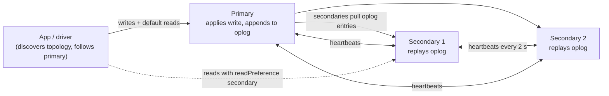
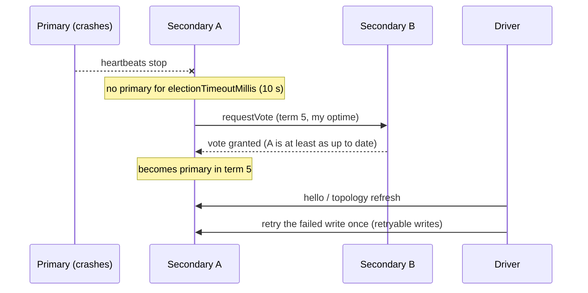
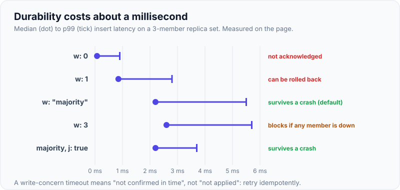
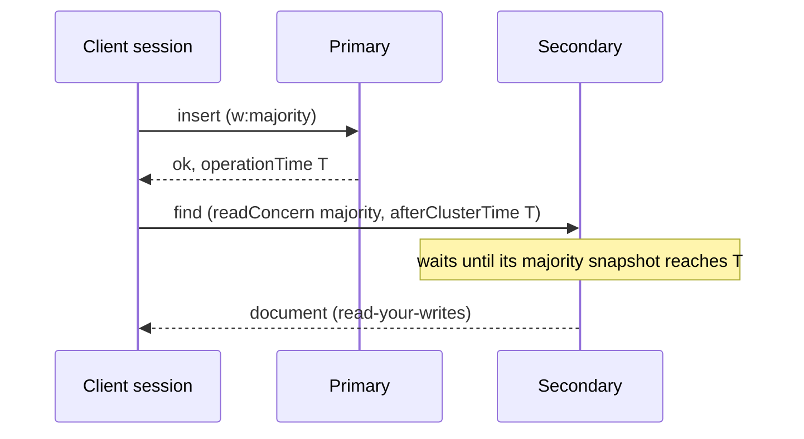

# Replica Sets, Read & Write Concerns

!!! abstract "Key takeaways"
    - A **replica set** is one primary plus secondaries that copy its **oplog** asynchronously. If the primary is lost, the members **elect** a new one. Measured with defaults (`electionTimeoutMillis` 10,000): a new primary about **10–11 s** after the primary was killed, and the driver's retryable write succeeded right after.
    - **Write concern** says how many members must have a write before it's acknowledged. The default since 5.0 is **`w: "majority"`**. Measured medians: `w:0` 75 µs, `w:1` 0.85 ms, `w:"majority"` 2.2 ms, `w:3` 2.6 ms.
    - `w:1` writes **can be lost**. In my test, a primary acknowledged a `w:1` write while its secondaries were down and then crashed. The new primary didn't have it, and it was gone after the old primary rejoined. `w:"majority"` writes survive any failover.
    - **`wtimeout` doesn't undo a write**: a `w:"majority"` insert that timed out (code 64) was still present after failover. Treat a timeout as "unknown", not "failed".
    - **Read concern** sets what data a read may see (`local` default, `majority`, `linearizable`, `snapshot`), and **read preference** sets which member serves it. Reading a secondary right after a `w:1` write missed **294 of 300** documents. A **causally consistent session** with majority read and write concerns missed **0 of 300**.

## Why it matters

Every production MongoDB deployment is a replica set (Atlas gives you three members minimum), so the consistency and availability questions are unavoidable: "Can I lose acknowledged writes?", "Why did my read not see my write?", "What happens during failover?", "Should I read from secondaries?" Interviewers use these questions to tell apart people who've used MongoDB from people who understand its guarantees. The same concepts appear in Kafka (`acks`, ISR) and PostgreSQL replication.

All numbers come from a local 3-node MongoDB 8.0.4 replica set driven by PyMongo while writing this page. A real network adds latency to every number that involves a round trip to a secondary.

## Core concepts

### Replica set architecture


*Notice that replication is pull-based and asynchronous. The primary doesn't wait for secondaries unless the write concern asks it to.*

- **Oplog:** a capped collection (`local.oplog.rs`) of idempotent operations. Secondaries tail it and apply entries in batches. Its size defines the **replication window**: how long a secondary can be offline and still catch up without a full initial sync.
- **Members:** an odd number of voting members (3 or 5) so a majority can be formed. Up to 50 members, 7 voters. Special members: **arbiter** (votes, no data; discouraged), **hidden** and **delayed** secondaries (for analytics or human-error recovery), priority 0 (can never become primary).
- **Heartbeats** every 2 s (`heartbeatIntervalMillis`). If the primary isn't seen for `electionTimeoutMillis` (10 s default), an eligible secondary calls an election (Raft-like protocol version 1, using terms).

### Elections and failover


*Notice that a candidate needs votes from a majority and must be at least as up to date as each voter. That's why a write acknowledged by a majority is never lost in an election.*

Measured: after `kill -9` on the primary, a new primary was elected **10.9 s** later (10.1 s in a second run), and the next driver write succeeded immediately. During those seconds, writes and primary reads block or fail. Drivers with **retryable writes** (on by default) retry once after a "not primary" or network error, so a single failover is usually invisible apart from latency. Lowering `electionTimeoutMillis` speeds failover but risks unnecessary elections on network blips. Atlas uses defaults close to these.

### Write concern

```javascript
{ w: <0 | 1 | n | "majority" | tag>, j: <bool>, wtimeout: <ms> }
```

| Write concern | Acknowledged when | Survives primary crash? | Measured median / p99 |
|---|---|---|---|
| `w: 0` | Not acknowledged at all | Unknown | 75 µs / 0.9 ms |
| `w: 1` | Primary applied it (in memory, journal within ~100 ms) | **No**: can be rolled back or lost | 0.85 ms / 2.8 ms |
| `w: "majority"` (default since 5.0) | A majority applied it (and journaled it, by default) | **Yes** | 2.2 ms / 5.5 ms |
| `w: 3` (all members here) | All three | Yes, but blocks if any member is down | 2.6 ms / 5.7 ms |
| `w: "majority", j: true` | Majority journaled | Yes | 2.2 ms / 3.7 ms |

`j: true` waits for the journal (on-disk write-ahead log). With `writeConcernMajorityJournalDefault: true` (the default), majority writes already wait for journaling on the members.

{ loading=lazy }
*Notice the price of not losing writes: roughly 1.4 ms at the median. `w: 3` costs about the same but stops working the moment any member is down.*

**Lost w:1 write, measured:** the primary acknowledged `{_id: "acked-w1-only"}` with `w:1` while both secondaries were down, then crashed. The secondaries restarted and elected a new primary, which contained only the earlier majority-committed document. When the old primary rejoined as a secondary, the `w:1` document was gone. In a network partition the same thing happens through **rollback**: the old primary undoes writes that the majority never received and saves them to `<dbpath>/rollback/` files for manual recovery.

{ loading=lazy }
*Watch step 4: the client saw a success for b, yet the cluster's history no longer contains it. Only a majority acknowledgment survives an election.*

**`wtimeout` semantics, measured:** with both secondaries frozen, a `w:"majority", wtimeout: 2000` insert failed with `WTimeoutError` (code 64). After the secondaries resumed and a failover happened, **that document existed**. A write-concern timeout means "not confirmed in time", not "not applied". Retry idempotently (upsert or unique key) or check before retrying.

### Read concern

| Read concern | Returns | Use |
|---|---|---|
| `local` (default) | The member's latest data, possibly not yet majority-committed (can be rolled back) | Default reads |
| `available` | Like local, but faster on sharded clusters (may return orphan documents) | Rarely |
| `majority` | Only data acknowledged by a majority: never rolled back, possibly slightly stale | Reads that must not see data that might vanish |
| `linearizable` | Majority data reflecting all writes acknowledged before the read started (primary only, slow) | Single-document "read the latest committed value" |
| `snapshot` | A consistent point-in-time snapshot (transactions, or reads at `atClusterTime`) | Multi-document consistent reads |

### Read preference

| Mode | Reads from | Notes |
|---|---|---|
| `primary` (default) | Primary | Strongest freshness |
| `primaryPreferred` | Primary, or a secondary if no primary | Keeps reads working during elections (stale) |
| `secondary` | Secondaries only | Offload; eventually consistent |
| `secondaryPreferred` | Secondaries, or the primary if none | Analytics, reporting |
| `nearest` | Lowest latency member (within 15 ms window) | Geo-distributed reads |

Add `maxStalenessSeconds` (≥ 90) to avoid very lagged secondaries, and **tag sets** to pin reads to a region or to analytics nodes.

**Staleness, measured:** 300 iterations of "insert with `w:1`, then immediately read that document from a secondary" → **294 misses**. Secondaries apply the oplog a few milliseconds later, and that's long enough.

### Causal consistency

A **causally consistent session** guarantees read-your-writes, monotonic reads, monotonic writes and writes-follow-reads within the session, even when reads go to secondaries. The driver passes `afterClusterTime` with each operation, so a secondary waits until it has caught up to that point. It requires `w:"majority"` writes and `readConcern: "majority"` reads to hold across failures. Measured: 300 inserts with `w:"majority"` followed by secondary reads with `readConcern: "majority"` in a causal session → **0 misses**.


*Notice that the session carries the time of its last operation and the secondary waits for it. Without the session, the secondary answers immediately from whatever it has.*

## In practice: code & configuration

```yaml
spring:
  data:
    mongodb:
      uri: mongodb://app:${MONGO_PWD}@m1:27017,m2:27017,m3:27017/claims?replicaSet=rs0&w=majority&retryWrites=true&readPreference=primary&maxPoolSize=50&serverSelectionTimeoutMS=5000
```

=== "❌ Common mistake"

    ```java
    // "Speed up" writes and reads globally
    mongoTemplate.setWriteConcern(WriteConcern.W1);                       // acked writes can vanish on failover
    mongoTemplate.setReadPreference(ReadPreference.secondaryPreferred()); // users don't see their own updates

    public Claim submit(Claim c) {
        mongoTemplate.insert(c);
        return mongoTemplate.findById(c.getId(), Claim.class);   // may hit a secondary that lacks it → null
    }
    ```

=== "✅ Better"

    ```java
    // Defaults: w:majority, primary reads. Relax per operation only where it's safe.
    public Claim submit(Claim c) {
        return mongoTemplate.insert(c);                          // majority-acknowledged, return what we wrote
    }

    // Lag-tolerant analytics: explicitly read from secondaries with bounded staleness
    public List<DailyTotal> dashboard(LocalDate day) {
        return mongoTemplate
            .withReadPreference(ReadPreference.secondaryPreferred(90, TimeUnit.SECONDS)) // maxStaleness
            .find(Query.query(Criteria.where("day").is(day)), DailyTotal.class);
    }

    // Read-your-writes on secondaries: causally consistent session
    try (ClientSession s = mongoClient.startSession(
            ClientSessionOptions.builder().causallyConsistent(true).build())) {
        MongoCollection<Document> col = db.getCollection("claims")
            .withWriteConcern(WriteConcern.MAJORITY)
            .withReadConcern(ReadConcern.MAJORITY)
            .withReadPreference(ReadPreference.secondary());
        col.insertOne(s, doc);
        Document again = col.find(s, eq("_id", doc.get("_id"))).first();   // guaranteed visible
    }
    ```

(`MongoTemplate.withReadPreference` is illustrative. In Spring Data you set read preference on a `Query` with `query.withReadPreference(...)` or on a separate template bean.)

### Handling write-concern errors

```java
try {
    claims.insertOne(doc);                                  // w:majority, wtimeout 5s
} catch (MongoWriteConcernException e) {
    // The write may have been applied on the primary. Don't blindly retry a non-idempotent insert.
    // Use a natural/unique key so a retry becomes a duplicate-key error, or upsert by business key.
    log.warn("write not confirmed by majority in time: {}", e.getWriteConcernError());
    throw new RetryableUnknownOutcomeException(doc.get("claimNo"));
}
```

## Real-world usage

- **Atlas** deploys three-member replica sets across availability zones by default, with `w:"majority"` and retryable writes. Planned maintenance does rolling restarts with `rs.stepDown()`, so applications see short election pauses.
- **Analytics nodes** (Atlas) are tagged secondaries that serve `secondaryPreferred` reporting queries with a tag set, isolating heavy reads from the operational members.
- **Delayed hidden secondaries** (for example one hour behind) protect against accidental `deleteMany({})` or bad migrations.
- **Multi-region:** members in several regions with priorities that keep the primary in the main region and `nearest` reads for local latency, accepting cross-region write latency for majority writes.
- **Change streams** (built on the oplog) power CDC, cache invalidation and event-driven integrations, resumable with a resume token as long as the oplog still holds the position.

## Trade-offs & production gotchas

!!! warning "Replica set mistakes"
    - **`w:1` for important data:** acknowledged writes can be lost on failover (measured).
    - **Reading your own writes from secondaries** without a causal session: 294/300 misses here.
    - **Treating `wtimeout` as failure:** the write may be applied. Retry idempotently.
    - **Arbiters with `w:"majority"`** (a PSA topology): if the secondary is down, majority writes block and the majority commit point stalls, which grows WiredTiger cache pressure. Prefer three data-bearing members.
    - **Even number of voters or two-member sets:** no majority after one failure.
    - **Small oplog:** a secondary that falls behind the replication window needs a full initial sync. Size the oplog for hours or days of writes, and alert on replication lag and oplog window.
    - **Long-running secondaries for analytics** with heavy queries can lag and then serve very stale data. Use `maxStalenessSeconds` or dedicated analytics nodes.

- **Latency vs durability:** `w:"majority"` costs a round trip to the nearest secondary (2.2 ms vs 0.85 ms locally, much more across regions). That's usually worth it, and the default since 5.0 agrees.
- **Availability vs freshness:** `primaryPreferred` keeps reads working during elections at the cost of possibly stale data.
- **Failover time vs false elections:** a lower `electionTimeoutMillis` gives faster failover but more spurious elections on flaky networks.

## How this connects to my experience

- **Where I used it:** not ★, but every MongoDB deployment I worked with is a replica set: MongoDB in the OptumRx microservices, with Kafka for asynchronous processing and Redis for caching. *[confirm: Atlas vs self-managed, write concern used, whether any service read from secondaries, and any failover incidents]*
- **Talking points:**
    - "I keep the default `w:"majority"` and primary reads for business data. I read from secondaries only for lag-tolerant views, with `maxStalenessSeconds`."
    - "Retryable writes and idempotent operations make elections nearly invisible. A write-concern timeout is an unknown outcome, so retries must be idempotent."
    - "It's the same reasoning as Kafka `acks=all` with `min.insync.replicas`, or a PostgreSQL synchronous standby."
- **Likely follow-up chain:** "What happens if the primary dies?" → "Can you lose writes?" (`w:1` vs majority, rollback) → "Why didn't the user see their update?" (secondary reads, causal sessions) → "How long does failover take, and what does the app see?" → "How would you do multi-region?" Compare with [PostgreSQL replication](../postgresql-sql/07-partitioning-replication-and-connection-pooling.md).

## Interview questions

### Fundamentals

??? question "Q1. What is a replica set, and how does replication work?"
    **Answer:** A group of mongod processes holding the same data: one primary that accepts writes and secondaries that replicate from it. The primary records every change in the oplog, a capped collection of idempotent operations. Secondaries pull and replay oplog entries asynchronously. Members exchange heartbeats every 2 s, and if the primary is unreachable for `electionTimeoutMillis` (10 s), an eligible secondary calls an election and a majority of voters must agree. Use an odd number of voting members (3 or 5) so a majority exists after a failure.

    **Interviewer listens for:** primary/secondary roles, the oplog, async pull, elections, and majority.

    **Common wrong answer:** "All members accept writes and sync with each other." That's multi-master, which MongoDB doesn't do.

??? question "Q2. What does write concern w:'majority' guarantee compared with w:1?"
    **Answer:** `w:1` acknowledges once the primary has applied the write, so if the primary fails before any secondary receives it, the write is lost or rolled back. Measured: a `w:1`-acknowledged document was gone after failover. `w:"majority"` acknowledges once a majority of voting members have applied (and journaled) it. Election rules guarantee a new primary has every majority-committed write, so it survives failover. It costs more latency (2.2 ms vs 0.85 ms median locally) and is the default since MongoDB 5.0.

    **Interviewer listens for:** the loss scenario, the election guarantee, the latency cost, and the default.

    **Common wrong answer:** "Both are durable because of the journal." The journal protects against a crash of that node, not against failover.

??? question "Q3. What are read preferences?"
    **Answer:** They decide which member serves a read: `primary` (the default, freshest), `primaryPreferred`, `secondary`, `secondaryPreferred` and `nearest` (lowest latency). Secondaries may be behind, so reads can be stale (measured: 294/300 misses when reading a secondary right after a `w:1` write). Add `maxStalenessSeconds` to exclude lagging members and tag sets to target regions or analytics nodes. Use secondary reads for lag-tolerant workloads, not to scale the main operational path.

    **Interviewer listens for:** the modes, staleness, and suitable uses.

    **Common wrong answer:** "Reading from secondaries is just a free way to scale reads."

??? question "Q4. How long does failover take, and what does the application experience?"
    **Answer:** Detection takes about `electionTimeoutMillis` (10 s default) plus the election itself. Measured: 10–11 s from killing the primary to a new primary. During that window, writes and primary reads fail or wait for server selection. Drivers detect the new primary via topology monitoring, and retryable writes (on by default) retry a failed write once, so the next write succeeded immediately here. Applications should use reasonable `serverSelectionTimeoutMS`, idempotent operations, and possibly `primaryPreferred` for reads that tolerate staleness. Planned step-downs are much faster.

    **Interviewer listens for:** the timing components, driver behaviour, retryable writes, and app design.

    **Common wrong answer:** "It's instant and invisible."

### Intermediate

??? question "Q5. What is a rollback in MongoDB, and when does it happen?"
    **Answer:** When a former primary rejoins the set after a failover, it may have writes that were never replicated to the majority, so the new primary doesn't have them. To rejoin, it undoes those writes back to the common point and writes the removed documents to `rollback/` files in its dbpath for manual inspection. It only affects writes acknowledged with less than majority write concern (or not acknowledged at all). Majority-committed writes can never be rolled back. Avoid it with `w:"majority"`.

    **Interviewer listens for:** cause, scope (non-majority writes), rollback files, and prevention.

    **Common wrong answer:** "Rollback means transaction rollback."

??? question "Q6. Explain the read concern levels."
    **Answer:** `local` (default): the member's latest data, which may include writes that could be rolled back. `available`: like local, with no extra sharding checks, so possibly orphan documents. `majority`: only majority-committed data, never rolled back, possibly a bit behind. `linearizable`: majority data that reflects all writes acknowledged before the read began, primary only, with extra latency, for single-document reads. `snapshot`: a consistent point-in-time view across documents, used in transactions or with `atClusterTime`. Pick `majority` when acting on data that must not disappear, and `linearizable` when you must see the latest committed value of one document.

    **Interviewer listens for:** each level's guarantee and use.

    **Common wrong answer:** "Read concern decides which member to read from." That's read preference.

??? question "Q7. A write with w:'majority' and wtimeout 2000 fails with a timeout. Was it written?"
    **Answer:** Maybe. The write was applied on the primary, but MongoDB couldn't confirm majority replication within 2 s. It isn't undone and may replicate later. Measured: the timed-out document existed after the secondaries recovered and a failover happened. Treat it as an unknown outcome: retry idempotently (an upsert by business key, or a unique index so a duplicate fails safely), or read back with majority read concern to check. Also investigate why the majority couldn't acknowledge (lag, members down).

    **Interviewer listens for:** "not undone", the unknown outcome, idempotent retry, and investigation.

    **Common wrong answer:** "It failed, so retry the insert."

??? question "Q8. What is a causally consistent session, and when do you need one?"
    **Answer:** A client session where the driver tracks the cluster time of the last operation and sends `afterClusterTime` with subsequent reads, so a member waits until it has caught up. You get read-your-writes, monotonic reads and writes, and writes-follow-reads, even when reads go to secondaries. For guarantees that hold across failovers, use `w:"majority"` and `readConcern: "majority"`. Measured: 0/300 misses reading from secondaries right after majority writes in a causal session, vs 294/300 for plain secondary reads after `w:1` writes. Use it when a user flow writes and then reads from a secondary.

    **Interviewer listens for:** afterClusterTime, the guarantees, majority concerns, and the use case.

    **Common wrong answer:** "Sessions are only for transactions."

??? question "Q9. Why are arbiters discouraged?"
    **Answer:** An arbiter votes but holds no data. In a primary-secondary-arbiter (PSA) set, if the secondary goes down, the primary still has a voting majority (itself plus the arbiter) and stays primary. But `w:"majority"` writes can't be acknowledged, because only one data-bearing member exists, so they block or time out. The majority commit point stops advancing, which grows WiredTiger cache pressure and history, and you have no redundancy left. Use three data-bearing members. If you must use PSA, understand the implications (MongoDB adjusts the implicit default write concern to `w:1` for some PSA configurations).

    **Interviewer listens for:** no data, the majority write problem, cache pressure, and the recommendation.

    **Common wrong answer:** "Arbiters are a cheap way to get HA."

### Senior

??? question "Q10. Design the MongoDB deployment for a claims system that must survive an AZ outage without losing acknowledged claims."
    **Answer:** A five-member (or at least three-member) replica set spread across three AZs, so losing any one AZ leaves a voting majority. All data-bearing, no arbiters. `w:"majority"` (default) with `retryWrites=true`, idempotent submission (a unique `claimNo` index, upserts), and primary reads for claim processing. Analytics run on a tagged analytics secondary or a separate pipeline. Size the oplog for at least 24–72 hours. Monitor replication lag, oplog window, elections and majority commit point lag. Test failover (step-downs, AZ simulations). Accept slightly higher write latency for cross-AZ majority acknowledgement.

    **Interviewer listens for:** AZ placement and majority math, write concern, idempotency, read strategy, oplog sizing, monitoring, and testing.

    **Common wrong answer:** "Two members in different AZs."

??? question "Q11. Compare MongoDB's replication guarantees with Kafka's acks and min.insync.replicas."
    **Answer:** Both are leader-based with asynchronous followers and a configurable acknowledgement level. `w:1` ≈ `acks=1`: fast, can lose acknowledged data on leader failure. `w:"majority"` ≈ `acks=all` with `min.insync.replicas` set to a majority: survives leader failover because only up-to-date replicas can lead. Kafka's unclean leader election (when allowed) ≈ MongoDB rollback: both discard un-replicated data to keep a consistent leader history. Differences: MongoDB elections are Raft-like among the members themselves, while Kafka uses the controller with KRaft. Kafka's ISR is dynamic, while MongoDB's majority is fixed by the configuration.

    **Interviewer listens for:** a correct mapping and the notable differences.

    **Common wrong answer:** "They're completely different, so no comparison applies."

??? question "Q12. When would you use readConcern 'linearizable', and what does it cost?"
    **Answer:** When a read must return the latest majority-committed value of a single document, with no possibility that a deposed primary (in a partition) serves stale data. For example, checking a lock or lease document, or reading a balance before a decision. It runs only on the primary and, before returning, confirms the primary is still primary by doing a no-op majority write, so it costs a replication round trip and can block if the majority is unreachable. Always use it with `maxTimeMS`. It only applies to reads that target a single document. For most cases, `majority` plus a causal session is enough.

    **Interviewer listens for:** the stale-primary scenario, the mechanism, cost, maxTimeMS, and scope.

    **Common wrong answer:** "It's the same as majority."

### Scenario-based

??? question "Q13. Users report that after editing their profile, the page sometimes shows the old data for a second. What's happening, and how do you fix it?"
    **Answer:** The read after the update probably goes to a secondary (`secondaryPreferred` set globally, or a `nearest` read preference) that hasn't applied the oplog entry yet. Measured: reading a secondary right after a write missed 294/300 times. Fix: read from the primary for user-facing read-after-write flows, return the updated document from the write itself (`findOneAndUpdate` with `returnDocument: after`), or use a causally consistent session with majority concerns if secondary reads are required. Also check caches in front (Redis, CDN) for the same symptom.

    **Interviewer listens for:** replication lag on secondaries, several fixes, and checking caches.

    **Common wrong answer:** "MongoDB is eventually consistent, so nothing can be done."

??? question "Q14. After a failover, an operator finds files in the old primary's rollback directory. What do you do?"
    **Answer:** Those documents were written to the old primary but never reached a majority, so the cluster no longer has them. Determine why non-majority writes happened: a service using `w:1` or `w:0`, or writes that got a write-concern timeout and were treated as successful. Inspect the BSON files with `bsondump`, decide with the business whether to reapply them (carefully, as they may conflict with later writes), and reapply idempotently. Then fix the root cause: enforce `w:"majority"` (the cluster-wide default via `setDefaultRWConcern`), make writes idempotent, and alert on rollbacks.

    **Interviewer listens for:** understanding rollback, investigating write concerns, careful recovery, and prevention.

    **Common wrong answer:** "Delete the rollback files. They're just logs."

## Cheat sheet

| Topic | Remember |
|---|---|
| Topology | Primary + secondaries, odd voters (3/5), oplog pulled async |
| Election | `electionTimeoutMillis` 10 s → measured ~10–11 s; majority votes, most up-to-date wins |
| Retryable writes | On by default; one retry after failover |
| Write concern | `w:0` 75 µs, `w:1` 0.85 ms, `w:majority` 2.2 ms (default 5.0+), `w:3` 2.6 ms |
| `w:1` | Acknowledged writes can be lost or rolled back (measured) |
| `wtimeout` | Doesn't undo: outcome unknown → idempotent retry |
| Rollback | Old primary undoes non-majority writes → `rollback/` files |
| Read concern | local (default), available, majority, linearizable, snapshot |
| Read preference | primary (default), primaryPreferred, secondary, secondaryPreferred, nearest; `maxStalenessSeconds` ≥ 90 |
| Staleness | Secondary read after `w:1`: 294/300 misses |
| Causal session | Majority write + majority read: 0/300 misses |
| Avoid | Arbiters (PSA), even voters, small oplog, global secondary reads |

## Sources
1. [MongoDB Manual: Replication](https://www.mongodb.com/docs/manual/replication/), [Replica set elections](https://www.mongodb.com/docs/manual/core/replica-set-elections/) and [Rollbacks](https://www.mongodb.com/docs/manual/core/replica-set-rollbacks/).
2. [MongoDB Manual: Write concern](https://www.mongodb.com/docs/manual/reference/write-concern/) and [default MongoDB read/write concerns](https://www.mongodb.com/docs/manual/reference/mongodb-defaults/).
3. [MongoDB Manual: Read concern](https://www.mongodb.com/docs/manual/reference/read-concern/) and [Read preference](https://www.mongodb.com/docs/manual/core/read-preference/).
4. [MongoDB Manual: Causal consistency and read and write concerns](https://www.mongodb.com/docs/manual/core/causal-consistency-read-write-concerns/).
5. [MongoDB Manual: Retryable writes](https://www.mongodb.com/docs/manual/core/retryable-writes/) and [Replica set oplog](https://www.mongodb.com/docs/manual/core/replica-set-oplog/).
6. [MongoDB Manual: Replica set architectures (arbiters, PSA)](https://www.mongodb.com/docs/manual/core/replica-set-architectures/).
7. Demonstrations on this page: MongoDB 8.0.4 three-node replica set via PyMongo, run while writing this page (write concern latencies, secondary staleness, causal session, election timing, wtimeout outcome, lost `w:1` write).
