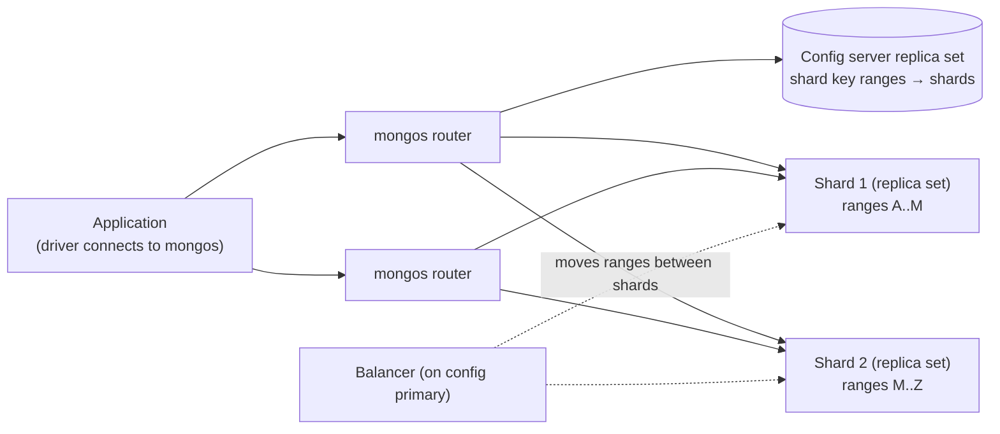
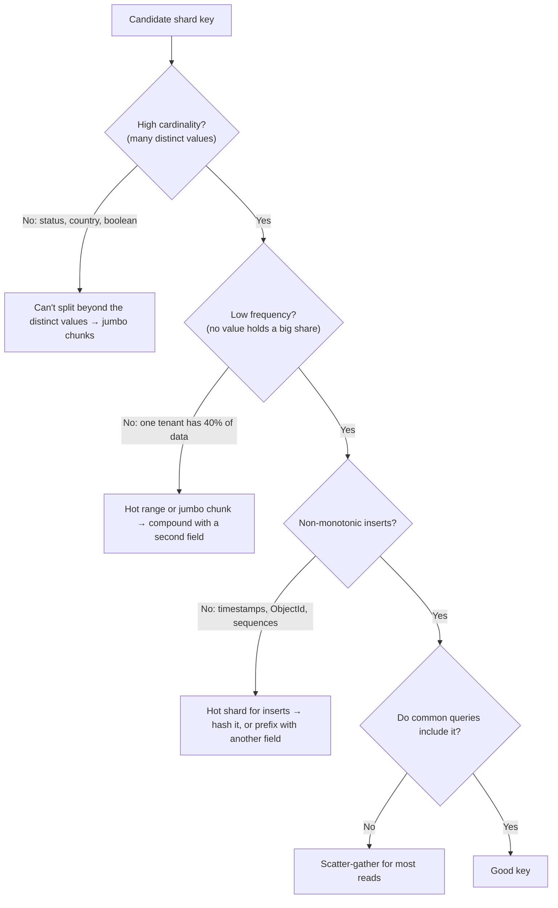

# Sharding & Shard Key Selection

!!! abstract "Key takeaways"
    - **Sharding** splits a collection across **shards** (each a replica set) by a **shard key**. **mongos** routers send queries to the right shards using metadata held by the **config servers**. The **balancer** moves ranges (chunks, 128 MB by default since 6.0) to even out data.
    - The shard key decides everything. Measured: a **monotonically increasing** ranged key (`createdAt`) sent **50,001 of 50,002** new documents to one shard (a hot shard). A **hashed** key split them **24,979 / 25,021**.
    - Queries that include the shard key are **targeted** (`SINGLE_SHARD`: 5 docs examined, 7 ms). Queries without it are **scatter-gather** (`SHARD_MERGE` across all shards: 100,000 docs examined, 44 ms). Pick a key that matches your most frequent queries.
    - A good key has **high cardinality**, **low frequency** (no hot values), **non-monotonic** inserts and **query isolation**. A compound key such as `{memberId, serviceDate}` often gives all four. Low-cardinality keys (`status`) can never split beyond the number of distinct values.
    - Constraints: unique indexes must have the shard key as a prefix (measured: `cannot create index with 'unique' … ove[r]` …). Shard keys can be **refined** (4.4+) or the collection **resharded** online (5.0+; the minimum duration was 5 minutes by default, and 50k docs took 332 s). Shard only when one replica set really isn't enough.

## Why it matters

Sharding is how MongoDB scales writes and storage beyond one machine, and the shard key is the one decision that's expensive to undo. A bad key creates a hot shard that takes all writes, jumbo chunks the balancer can't move, or a cluster where every query hits every shard. Interviewers ask "how would you shard X?" for a concrete domain (orders, events, claims, chat messages) and expect a reasoned key choice with trade-offs. Senior candidates are also expected to say when *not* to shard.

The measurements on this page come from a local MongoDB 8.0.4 sharded cluster (one config-server replica set, two single-member shard replica sets, one mongos) built while writing this page. Production shards have three members each.

## Core concepts

### Sharded cluster architecture


*Notice that applications talk only to mongos. The routers cache the routing table from the config servers and refresh it when a shard tells them it's stale.*

- **Shard:** a replica set holding a subset of the data. Unsharded collections live on a database's primary shard (or, since 8.0, can be moved with `moveCollection`).
- **mongos:** a stateless router. Run several, often one per application host or behind a load balancer.
- **Config servers:** a replica set storing cluster metadata: which ranges of each sharded collection live on which shard.
- **Chunks/ranges:** contiguous ranges of shard key values. Since 6.0 the default range size is **128 MB**, and the balancer evens out **data size** per shard rather than chunk counts.
- **Balancer:** a background process on the config primary that migrates ranges. Migrations copy documents, catch up changes, then update metadata in a short critical section.

### Ranged vs hashed vs compound keys

| Key type | How documents are placed | Strengths | Weaknesses |
|---|---|---|---|
| **Ranged** `{customerId: 1}` | Contiguous value ranges | Range queries on the key are targeted; locality | Monotonic values create a hot shard |
| **Hashed** `{createdAt: "hashed"}` | Ranges of the hash of the value | Even write distribution even for monotonic values | Range queries on the key become scatter-gather; no locality |
| **Compound** `{memberId: 1, serviceDate: 1}` | Ranges over the combined value | High cardinality + query isolation by the prefix; ranges within one member stay together | Queries must include the prefix to be targeted |
| **Zones** (tag ranges) | Pin key ranges to specific shards | Data residency (EU data on EU shards), hardware tiers | Must design the key's prefix around the zone attribute |

**Measured: monotonic insert pattern** (50,000 events with increasing `createdAt`):

| Shard key | Shard 1 | Shard 2 |
|---|---|---|
| `{createdAt: 1}` (ranged, split in the past) | **50,001** | 1 |
| `{createdAt: "hashed"}` | 24,979 | 25,021 |

With a ranged monotonic key, every new value is greater than the current maximum, so every insert lands in the top range on one shard. The balancer can move ranges later, but writes always chase the newest range, so that shard becomes the write bottleneck.

### What makes a good shard key


*Notice that every check is about how your data and queries are distributed, not about the field type. The same field can be a great key in one system and a terrible one in another.*

### Targeted vs scatter-gather queries

100,000 claims sharded on `{memberId: 1, serviceDate: 1}` and split across two shards:

| Query | Plan | Shards | Docs examined | Time |
|---|---|---|---|---|
| `{memberId: "M000042"}` | **SINGLE_SHARD** | s1 | 5 | 7 ms |
| `{memberId: "M000042", serviceDate: {$gte: March}}` | SINGLE_SHARD | s1 | 4 | 3 ms |
| `{status: "DENIED", amount: {$gt: 499}}` | **SHARD_MERGE** | s1, s2 | 100,000 | 44 ms |
| `{serviceDate: March 1}` (suffix of the key only) | SHARD_MERGE | s1, s2 | 100,000 | 39 ms |

(The scatter-gather queries also lacked a secondary index here. With an index each shard does less work, but every shard still participates.) Scatter-gather queries scale poorly: adding shards adds work to every such query, and tail latency becomes the slowest shard's latency. Queries on a key *prefix* are targeted, while queries on only a suffix aren't.

### Rules and limits

- **Unique indexes** must include the shard key as a prefix, because each shard can only enforce uniqueness locally. Measured: a unique index on `amount` failed ("cannot create index with 'unique' … option over …" the shard key), while `{memberId, serviceDate, amount}` succeeded. For a globally unique field that isn't the shard key (email, claim number), use the field as the shard key, a separate lookup collection sharded on that field, or application-level checks.
- **Single-document writes without the shard key:** since 7.0, `updateOne`, `deleteOne` and `findAndModify` without the shard key work (measured: matched 1), but they're broadcast internally, so include the key when you can.
- **Shard key values** are mutable since 4.2 (unless the field is `_id`), but a change can move the document to another shard, inside a transaction.
- **Jumbo chunks:** a range that can't be split because all documents share one key value (low cardinality or a huge single value). The balancer can't move it. Measured: a collection sharded on `status` (3 values) can never have more than 3 meaningful ranges.

### Changing the shard key

| Option | Since | What it does |
|---|---|---|
| `refineCollectionShardKey` | 4.4 | Adds suffix fields to the existing key (`{customerId}` → `{customerId, orderId}`) to fix jumbo chunks or low cardinality. Fast, metadata only |
| `reshardCollection` | 5.0 | Rewrites the collection under a new key while it stays online, then cuts over with a brief write block. Needs disk and time, plus a minimum duration (5 minutes by default) |
| `moveCollection` / `unshardCollection` | 8.0 | Move an unsharded collection between shards, or unshard |

Measured: resharding 50,000 small documents from `{createdAt: 1}` to `{_id: "hashed"}` took **332 s**, dominated by the default minimum operation duration (`reshardingMinimumOperationDurationMillis` = 5 minutes), and ended with 23,113 / 26,888 documents per shard.

## In practice: code & configuration

```javascript
// Enable and shard (mongosh against mongos)
sh.enableSharding("claims")                      // optional since 6.0
db.claims.createIndex({ memberId: 1, serviceDate: 1 })
sh.shardCollection("claims.claims", { memberId: 1, serviceDate: 1 })

// Hashed key for an append-only event log
sh.shardCollection("claims.events", { _id: "hashed" })

// Zones for data residency
sh.addShardToZone("shard-eu-1", "EU")
sh.updateZoneKeyRange("claims.members", { region: "EU", memberId: MinKey }, { region: "EU", memberId: MaxKey }, "EU")

// Inspect distribution and balancer
db.claims.getShardDistribution()
sh.status()
sh.balancerCollectionStatus("claims.claims")
```

=== "❌ Common mistake"

    ```javascript
    // ObjectId _id as a ranged key: monotonic → every insert on one shard
    sh.shardCollection("app.orders", { _id: 1 })

    // Low-cardinality key: at most 4 ranges, ever → jumbo chunks
    sh.shardCollection("app.orders", { status: 1 })

    // Key that doesn't match queries: most reads ask by customer, key is orderNo hashed
    sh.shardCollection("app.orders", { orderNo: "hashed" })   // "orders for customer X" hits every shard
    ```

=== "✅ Better"

    ```javascript
    // Most queries: "orders for customer X, newest first"; inserts spread across customers
    sh.shardCollection("app.orders", { customerId: 1, createdAt: 1 })
    // + if a few customers are huge, refine later: { customerId: 1, createdAt: 1, _id: 1 }
    ```

### Application side (Spring Data)

```java
@Document("claims")
@Sharded(shardKey = { "memberId", "serviceDate" })     // Spring Data includes the full key in save() filters
public class Claim {
    @Id private String id;
    private String memberId;
    private Instant serviceDate;
    ...
}

// Always pass the shard key in hot-path queries so mongos can target one shard
List<Claim> recent = mongo.find(
    Query.query(Criteria.where("memberId").is(memberId)
                        .and("serviceDate").gte(since))
         .with(Sort.by(Sort.Direction.DESC, "serviceDate")).limit(50),
    Claim.class);
```

Without `@Sharded`, `save()` of an existing document issues a replace filtered by `_id` only, which mongos must broadcast (or, before 7.0, which fails when `_id` isn't part of the shard key).

## Real-world usage

- **Multi-tenant SaaS:** `{tenantId, …}` compound keys keep each tenant's data together and isolate queries. Big tenants are refined or put in zones.
- **IoT and event logs:** hashed keys on `deviceId`, or `{deviceId, ts}` for per-device range queries. Time-series collections can be sharded on `metaField` (+ time).
- **E-commerce orders:** `{customerId, createdAt}` to serve customer order history from one shard. Global order-number lookups go through a small lookup collection or cache.
- **Global apps:** zone sharding by region for data residency (GDPR) and latency, with mongos in each region.
- **Atlas** offers sharded clusters with auto-balancing and, from 8.0, faster resharding and moving collections between shards.

## Trade-offs & production gotchas

!!! warning "Sharding pitfalls"
    - **Sharding too early:** more moving parts (mongos, config servers, balancing), scatter-gather risk and constraints on unique indexes and transactions. A well-indexed replica set with enough RAM handles a lot. Shard when data or write throughput truly outgrows one set (often multiple TB or very high write rates).
    - **Monotonic ranged keys:** a hot shard for inserts (50,001 vs 1 measured).
    - **Low-cardinality or skewed keys:** jumbo chunks that can't move. Refine with an extra field.
    - **Keys not in queries:** scatter-gather for every read (100,000 docs examined vs 5 here).
    - **Unique constraints:** only enforceable with the shard key as prefix.
    - **Balancer windows and migrations:** migrations consume I/O. Schedule the balancer window for quiet hours on busy clusters.
    - **Orphaned documents** after failed migrations (cleaned up automatically by the range deleter). Reads with `readConcern: "available"` may see them.
    - **Cross-shard transactions** work (4.2+) but are slower. Design so most transactions stay within one shard key value.

- **Hashed vs ranged** is a trade between even writes and efficient range queries. A compound key with a high-cardinality, non-monotonic prefix often gets both.
- **More shards ≠ faster scatter-gather queries:** they get slower as fan-out grows. Targeted queries scale linearly.

## How this connects to my experience

- **Where I used it:** not ★. MongoDB in OptumRx microservices (with Kafka, Redis and GraphQL). *[confirm whether any collection was sharded, Atlas tier, and data volumes; if not, present this as transferable knowledge and say you'd start with indexing and replica-set scaling first]*
- **Talking points:**
    - "I'd shard only when a replica set can't keep up. Before that: indexes, working set in RAM, archiving and caching."
    - "I choose the key from the dominant query and the insert pattern: high cardinality, no hot values, non-monotonic, and present in most queries. For member-centric healthcare data, `{memberId, serviceDate}` fits."
    - "Global uniqueness on a non-key field needs a separate lookup or a different key."
- **Likely follow-up chain:** "How would you shard claims or orders?" → "Why not `_id`?" (monotonic) → "Why not hashed?" (range queries by member) → "What about a huge member or tenant?" (refine, zones) → "How do you enforce unique claim numbers?" → "What if you picked the wrong key?" (refine or reshard).

## Interview questions

### Fundamentals

??? question "Q1. What are the components of a sharded MongoDB cluster?"
    **Answer:** Shards (each a replica set holding part of the data), config servers (a replica set holding metadata: which shard key ranges live where), and mongos routers (stateless processes that applications connect to, which route operations using cached metadata). The balancer runs on the config server primary and migrates ranges between shards to even out data. Applications never connect to shards directly.

    **Interviewer listens for:** the three components, the balancer, and shards being replica sets.

    **Common wrong answer:** "Shards are just separate databases that the app chooses between."

??? question "Q2. What makes a good shard key?"
    **Answer:** High cardinality (many distinct values, so the data can be split finely), low frequency (no single value holding a large share, which would create a jumbo chunk or hot range), non-monotonic insert values (otherwise all inserts land on one shard), and query isolation (the most frequent queries include the key, or its prefix, so they're targeted). Compound keys often combine these, for example `{memberId, serviceDate}`. The key also determines which unique indexes are possible.

    **Interviewer listens for:** all four properties with reasons.

    **Common wrong answer:** "Any indexed field" or "always _id."

??? question "Q3. Ranged vs hashed shard keys: when do you use each?"
    **Answer:** Ranged keys keep adjacent values together, so range queries on the key are targeted and data has locality, but monotonic values (timestamps, ObjectIds) send all inserts to one shard (measured: 50,001 vs 1). Hashed keys distribute even monotonic values evenly (24,979 vs 25,021 measured), but range queries on the key become scatter-gather. Use hashed for write-heavy, equality-accessed data like event logs by id. Use ranged or compound when range queries matter and the prefix isn't monotonic.

    **Interviewer listens for:** distribution vs range-query trade-off, with the monotonic example.

    **Common wrong answer:** "Hashed is always better because it's even."

??? question "Q4. What's the difference between a targeted query and a scatter-gather query?"
    **Answer:** If a query's filter includes the shard key (or a prefix of a compound key), mongos knows which shard or shards own those values and sends the query only there (SINGLE_SHARD: 5 documents examined in my test). Otherwise it broadcasts the query to every shard and merges the results (SHARD_MERGE: every shard did work, 100,000 documents examined without an index). Scatter-gather gets slower as shards are added and depends on the slowest shard, so the shard key should match the dominant queries.

    **Interviewer listens for:** routing by key, the cost of broadcast, and the scaling implication.

    **Common wrong answer:** "mongos always queries all shards and merges."

### Intermediate

??? question "Q5. Why is ObjectId or a timestamp a bad ranged shard key?"
    **Answer:** Both increase monotonically, so each new document's key is greater than every existing key and falls into the top range, which lives on one shard. That shard takes all inserts (a hot shard) while others idle, and the balancer keeps moving older ranges away, which doesn't help writes. Measured: 50,001 of 50,002 inserts landed on one shard. Fix: hash the field, or use a compound key with a non-monotonic, high-cardinality prefix (`{customerId, createdAt}`).

    **Interviewer listens for:** monotonic → top range → hot shard, and the fixes.

    **Common wrong answer:** "The balancer will spread it out."

??? question "Q6. What is a jumbo chunk, and how do you fix it?"
    **Answer:** A range that exceeds the maximum range size but can't be split, because all its documents share the same shard key value, or the split points don't divide it (low cardinality or a very frequent value). The balancer can't migrate it, so data and load become uneven. Measured: a key on `status` (3 values) can never have more than 3 meaningful ranges. Fix: refine the shard key with a suffix field (`refineCollectionShardKey`, 4.4+) to add cardinality, or reshard (5.0+) to a better key. Prevent it by choosing high-cardinality, low-frequency keys.

    **Interviewer listens for:** the cause, balancer impact, refine and reshard, and prevention.

    **Common wrong answer:** "Increase the chunk size."

??? question "Q7. How do you enforce a unique claim number in a collection sharded on memberId?"
    **Answer:** You can't with a plain unique index: unique indexes must have the shard key as a prefix because each shard only checks its own data (measured: a unique index on a non-key field failed). Options: shard on `claimNo` instead, if queries are mostly by claim number; keep a separate `claim_numbers` collection sharded (or unsharded) on `claimNo` with a unique index and insert there first, in a transaction or with compensation; generate claim numbers that are unique by construction (a prefix plus a sequence per shard key, or UUIDs); or check in the application with a race-safe mechanism.

    **Interviewer listens for:** the prefix rule, why it exists, and workable designs.

    **Common wrong answer:** "Just create a unique index on claimNo."

??? question "Q8. What does the balancer do, and how can it affect production?"
    **Answer:** It monitors data distribution and migrates ranges from shards with more data to shards with less (since 6.0 it balances by data size, with 128 MB default ranges). A migration copies documents to the recipient, applies changes that happened during the copy, then commits a metadata update in a brief critical section, and the donor deletes the moved range later. Migrations consume disk and network I/O and can raise latency, so busy clusters set a balancing window, monitor migrations, and avoid adding shards at peak.

    **Interviewer listens for:** the migration steps, I/O impact, and the balancing window.

    **Common wrong answer:** "The balancer splits documents across shards in real time."

??? question "Q9. Can you change a shard key after sharding?"
    **Answer:** Yes, increasingly. Since 4.4 `refineCollectionShardKey` adds suffix fields to the existing key (metadata-only, useful for jumbo chunks). Since 5.0 `reshardCollection` rewrites the collection under a completely new key online: it clones data to the new distribution, applies ongoing changes, then blocks writes briefly to cut over. It needs spare disk (about 2× the collection) and time, with a default minimum duration of 5 minutes (measured: 332 s even for 50k docs). Since 4.2 individual documents' shard key values can be updated. Plan the key carefully anyway, because resharding large collections is a significant operation.

    **Interviewer listens for:** refine vs reshard, versions, costs, and planning.

    **Common wrong answer:** "No. You have to dump and reload the data."

### Senior

??? question "Q10. Design the sharding strategy for a multi-tenant SaaS where a few tenants are 100× bigger than the rest."
    **Answer:** A compound key starting with `tenantId` gives query isolation (almost every query is tenant-scoped) and keeps a tenant's data local. Add a high-cardinality, non-monotonic suffix (`{tenantId, entityId}` or `{tenantId, userId, createdAt}`) so big tenants can be split into many ranges across shards, avoiding jumbo chunks. Small tenants share shards naturally. Use zones to place regulated tenants in specific regions or to give premium tenants dedicated shards. Monitor per-tenant hot spots, consider per-tenant rate limits, and keep the option to refine the key. Avoid hashed `tenantId`, which wouldn't split big tenants.

    **Interviewer listens for:** tenant prefix for isolation, suffix for splitting big tenants, zones, and monitoring.

    **Common wrong answer:** "Shard on tenantId alone" (big tenants become jumbo chunks) or "hashed _id" (every tenant query scatter-gathers).

??? question "Q11. When should you not shard?"
    **Answer:** When a replica set can still handle the load: data and indexes fit comfortably (vertical scaling and storage are cheap up to a few TB), the write rate is within one primary's capacity, and slow queries are caused by missing indexes, bad schema or the working set not fitting in RAM rather than raw capacity. Sharding adds operational complexity, scatter-gather risk, unique-index constraints, more expensive cross-shard transactions, and a key decision that's costly to undo. Alternatives first: indexes, schema fixes, archiving cold data, read scaling with secondaries for lag-tolerant reads, caching and bigger instances.

    **Interviewer listens for:** a cost-benefit view and alternatives.

    **Common wrong answer:** "Shard from day one for future scale."

??? question "Q12. How do transactions and aggregations behave in a sharded cluster?"
    **Answer:** Multi-document transactions work across shards (4.2+) using two-phase commit coordinated by one shard. They're slower and hold resources on every participant, so design for single-shard transactions (all documents sharing one shard key value). Aggregations run in two parts: stages that can run per shard (`$match`, `$project`, partial `$group`) execute on each shard, and the merge happens on a shard or mongos. A `$match` on the shard key targets shards. `$lookup` into sharded collections is supported since 5.1 but costs fan-out. `$group` by the shard key can complete per shard. Explain shows the `splitPipeline` and `mergerPart`.

    **Interviewer listens for:** 2PC cost, single-shard design, the split pipeline, and targeting.

    **Common wrong answer:** "Transactions aren't supported with sharding."

### Scenario-based

??? question "Q13. After launch, one shard is at 90% CPU while the others idle. Diagnose."
    **Answer:** Check `getShardDistribution()` and which shard receives writes. A monotonic ranged key (createdAt, ObjectId) sends all inserts to the shard owning the top range. A hot key value (one tenant or celebrity) concentrates traffic on one range. A jumbo chunk the balancer can't move keeps data skewed. Unsharded collections all live on the database's primary shard. Fixes: reshard to a hashed or compound key with a better prefix, refine the key for hot values, move unsharded collections (`moveCollection` in 8.0) or shard them, and use zones deliberately. Confirm with mongos and shard logs and `$currentOp` by namespace.

    **Interviewer listens for:** distribution analysis, several causes, and matching fixes.

    **Common wrong answer:** "Add more shards." That doesn't help a monotonic key.

??? question "Q14. A dashboard query became slow after you added two more shards. Why?"
    **Answer:** It's probably a scatter-gather query: it doesn't include the shard key, so mongos sends it to every shard and merges the results. With more shards, there's more fan-out, more merge work, and latency bound by the slowest shard. Check explain for `SHARD_MERGE` and the shard list. Fixes: include the shard key or prefix in the filter if the use case allows, add supporting indexes on each shard, precompute dashboard aggregates into a summary collection (`$merge`), serve them from analytics nodes, or reconsider the key if this query pattern dominates.

    **Interviewer listens for:** recognising scatter-gather scaling and appropriate remedies.

    **Common wrong answer:** "The balancer is still running. Wait."

## Cheat sheet

| Topic | Remember |
|---|---|
| Components | mongos (router), config server RS (metadata), shards (RS), balancer |
| Ranges | 128 MB default (6.0+), balanced by data size |
| Good key | High cardinality, low frequency, non-monotonic, in queries |
| Monotonic ranged | Hot shard (50,001 vs 1) → hash or compound prefix |
| Hashed | Even (24,979 / 25,021); range queries scatter |
| Targeted vs scatter | SINGLE_SHARD 5 docs / 7 ms vs SHARD_MERGE 100k docs / 44 ms |
| Prefix rule | Compound key prefixes target; suffix-only scatters |
| Unique | Must have shard key as prefix |
| Jumbo | Low cardinality/frequency → refine (4.4) / reshard (5.0) |
| Reshard | Online; ≥ 5 min default (332 s measured) |
| 8.0 | `moveCollection`, `unshardCollection` |
| Don't shard | Until a replica set can't cope |

## Sources
1. [MongoDB Manual: Sharding](https://www.mongodb.com/docs/manual/sharding/) and [Sharded cluster components](https://www.mongodb.com/docs/manual/core/sharded-cluster-components/).
2. [MongoDB Manual: Choose a shard key](https://www.mongodb.com/docs/manual/core/sharding-choose-a-shard-key/) and [Hashed sharding](https://www.mongodb.com/docs/manual/core/hashed-sharding/).
3. [MongoDB Manual: Balancer and range migration](https://www.mongodb.com/docs/manual/core/sharding-balancer-administration/) and [Data partitioning with chunks](https://www.mongodb.com/docs/manual/core/sharding-data-partitioning/).
4. [MongoDB Manual: Refine a shard key](https://www.mongodb.com/docs/manual/core/sharding-refine-a-shard-key/) and [Reshard a collection](https://www.mongodb.com/docs/manual/core/sharding-reshard-a-collection/).
5. [MongoDB Manual: Unique indexes in sharded collections](https://www.mongodb.com/docs/manual/core/sharding-shard-key/#unique-indexes) and [Zones](https://www.mongodb.com/docs/manual/core/zone-sharding/).
6. [Spring Data MongoDB: Sharding support (@Sharded)](https://docs.spring.io/spring-data/mongodb/reference/mongodb/sharding.html).
7. Demonstrations on this page: a local MongoDB 8.0.4 sharded cluster (config RS, two shards, mongos) via PyMongo, run while writing this page (ranged vs hashed distribution, targeted vs scatter explain, unique index rule, low-cardinality key, resharding).
