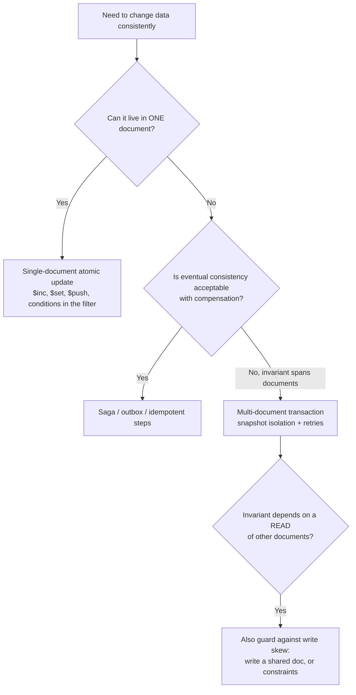
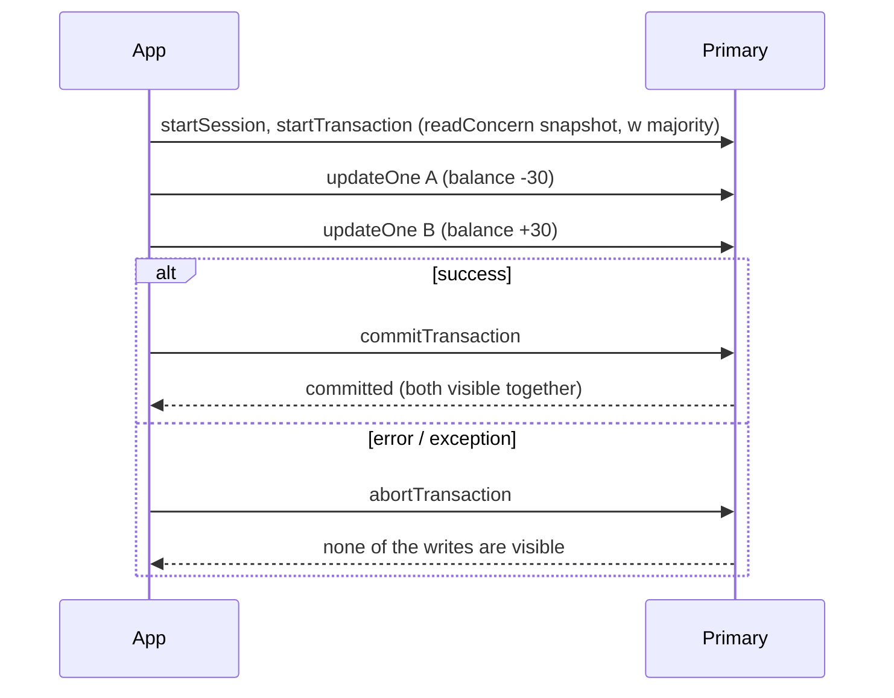
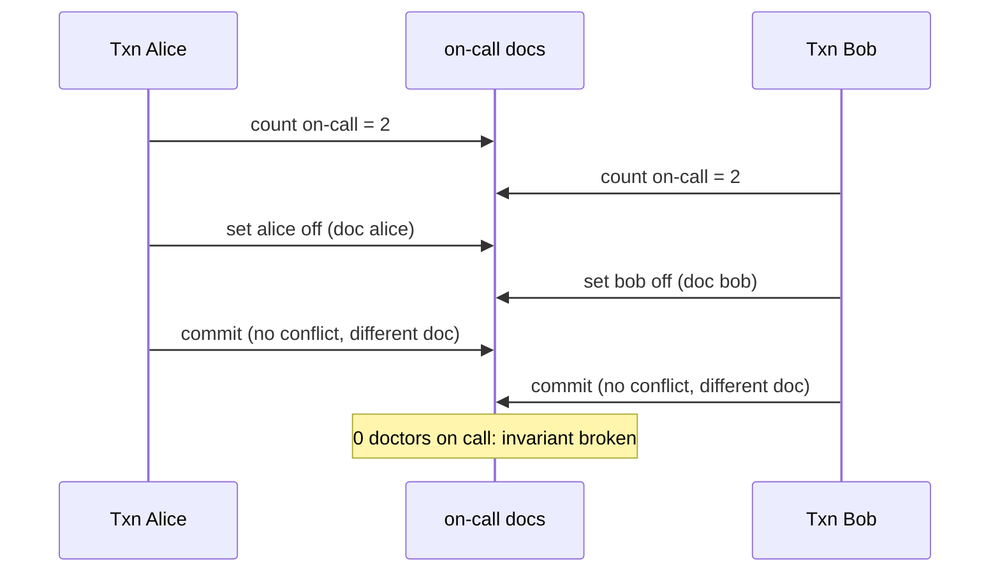

# Transactions & Consistency

!!! abstract "Key takeaways"
    - **Single-document writes are always atomic**, including nested arrays. Modelling data that changes together into one document is the cheapest consistency tool. A one-document "transfer" took **2.4 ms** with `w:"majority"`.
    - **Multi-document ACID transactions** (replica sets 4.0+, sharded clusters 4.2+) run in a session with **snapshot isolation**. Measured: a failed transfer left both balances unchanged, and a committed one moved 30 atomically.
    - Concurrency is **optimistic**: a second transaction writing the same document fails fast with **WriteConflict (112)** labelled **TransientTransactionError**. Use `withTransaction` (the callback API) to retry automatically: 400 contended transfers stayed exactly consistent with **935 automatic retries**.
    - Snapshot isolation is **not serializable**: two "go off call" transactions both committed and left **0** doctors on call (write skew). Writing a shared document turned it into a write conflict, and **1** stayed on call.
    - Transactions have limits and costs: **60 s** default lifetime, locks that make non-transactional writers wait (measured 1.0 s), and extra overhead (two updates: 3.1 ms in a transaction vs 4.3 ms as separate majority writes vs 2.4 ms as one document). Use them where an invariant spans documents, not by default.

## Why it matters

"Does MongoDB support transactions?" is still a common interview question, and the full answer has layers: yes since 4.0, but single-document atomicity is the primary design tool, transactions have isolation semantics that differ from serializable SQL, they need retry logic, and they cost performance. For financial, inventory and healthcare workflows you need to know exactly which anomalies are possible and how to prevent them. This page builds on [replica sets and read/write concerns](04-replica-sets-read-write-concerns.md).

All results come from a MongoDB 8.0.4 three-node replica set driven by PyMongo while writing this page.

## Core concepts

### Levels of consistency in MongoDB


*Notice the order: single-document atomicity first, transactions only when an invariant truly spans documents, and extra care when the decision depends on data you only read.*

### Single-document atomicity

Every write to one document, including many fields, nested documents and array operations, is atomic and isolated: other readers see all of it or none of it. A **conditional update** gives check-and-set without a transaction:

```javascript
// Debit only if funds suffice: atomic check + update on one document
db.wallets.updateOne({ _id: "W", balance: { $gte: 30 } }, { $inc: { balance: -30, pending: 30 } })
```

If the data that changes together lives in one document (a wallet with sub-balances, an order with its lines and total, a cart), you rarely need multi-document transactions.

### Multi-document transactions


*Notice that the writes are invisible to others until commit, and all of them commit or none do. The transaction reads from one snapshot taken at its first operation.*

Measured:

| Scenario | Result |
|---|---|
| Debit A, exception before crediting B, inside `withTransaction` | A 100, B 0: **nothing applied** |
| Same transfer committed | A 70, B 30 |
| Second transaction writes a document already written by an open transaction | Fails immediately: **code 112 WriteConflict**, label `TransientTransactionError` |
| Non-transactional update to a document locked by an open transaction | **Waited 1.0 s**, until the transaction committed |
| Transaction reads B, someone else commits B += 1000, transaction reads B again | 131 both times (snapshot), 1131 outside after commit |

Key properties:

- **Isolation: snapshot.** A transaction reads a consistent snapshot as of its start. With `readConcern: "snapshot"` and `w:"majority"`, that snapshot is majority-committed, and the commit is durable across failover.
- **Write-write conflicts are detected at write time** (first writer wins, and others get WriteConflict). MongoDB doesn't make transactions wait for each other's locks. Non-transactional writes do wait for the transaction's lock (measured 1.0 s).
- **Limits:** `transactionLifetimeLimitSeconds` = **60** by default. Long transactions are aborted, and they also pin old snapshots in the WiredTiger cache. Avoid huge transactions (the documented guidance is to keep modifications to about 1,000 documents per transaction).
- **DDL:** creating collections and indexes inside transactions is allowed since 4.4 with restrictions. Other DDL isn't.

### Error labels and retries

| Label | Meaning | What to do |
|---|---|---|
| `TransientTransactionError` | The whole transaction failed in a retriable way (write conflict, primary stepped down, network) | **Retry the entire transaction** from the start |
| `UnknownTransactionCommitResult` | Commit outcome unknown (network error or timeout during commit) | **Retry the commit** (`commitTransaction` is retryable and idempotent) |

The **callback API** (`session.withTransaction(fn)` in drivers, `TransactionTemplate`/`@Transactional` + retry in Spring) implements both loops until a 120-second timeout. Measured: 20 threads × 20 transfers between the same two documents → **935 automatic retries**, and the final balances summed exactly to the original total (A + B = 100,000, B = 400). Your callback must be **idempotent with respect to side effects outside the database** (don't send emails or Kafka messages inside it, or they repeat on each retry).

### Snapshot isolation and write skew

Snapshot isolation prevents dirty reads, non-repeatable reads, lost updates on the same document and phantoms inside the transaction's view. It doesn't prevent **write skew**: two transactions each read an overlapping set of documents, make a decision, and write *different* documents.


*Notice that neither transaction wrote a document the other wrote, so there's no write conflict to detect. Each made a decision based on a snapshot that became false.*

Measured: both transactions committed and **0** remained on call. Fix by **materialising the conflict**: have each transaction also update a shared document (`shift-1`). Then the second one gets a WriteConflict, and on retry it sees the new state. With that change: Alice committed, Bob got **WriteConflict**, and **1** stayed on call. Other fixes: put the invariant in one document (a `shift` document holding the on-call list, updated with a conditional `$pull`), or use a unique or partial index to enforce the constraint.

### What transactions cost

| Two related updates (A −1, B +1), `w:"majority"` | Median latency |
|---|---|
| Two separate updates, no transaction (each waits for majority) | 4.25 ms (and **not atomic**) |
| Both in a transaction (one majority wait at commit) | 3.14 ms |
| Single update of one document holding both values | 2.37 ms |
| Single-document update for comparison | 2.12 ms |

Locally the transaction was cheaper than two separate majority writes, because the commit waits for replication once. The real costs are elsewhere: contention and retries under load (935 retries for 400 transfers), locks that block non-transactional writers, snapshot history kept in cache, and two-phase commit across shards.

### Transactions in sharded clusters

Since 4.2, transactions can span shards. The first shard touched becomes the coordinator and runs **two-phase commit**. They're slower and more failure-prone than single-shard transactions, so design shard keys so that a transaction's documents share one key value (for example all of a member's documents under `memberId`). `readConcern: "snapshot"` across shards gives a cluster-wide consistent snapshot.

## In practice: code & configuration

### Spring Data MongoDB

```java
@Configuration
class MongoTxConfig {
    @Bean
    MongoTransactionManager transactionManager(MongoDatabaseFactory f) {
        return new MongoTransactionManager(f);        // enables @Transactional for MongoDB
    }
}

@Service
class TransferService {
    private final MongoTemplate mongo;
    TransferService(MongoTemplate mongo) { this.mongo = mongo; }

    @Retryable(retryFor = { MongoTransactionException.class, UncategorizedMongoDbException.class },
               maxAttempts = 5, backoff = @Backoff(delay = 20, multiplier = 2, random = true))
    @Transactional
    public void transfer(String from, String to, long amount) {
        UpdateResult debit = mongo.updateFirst(
            Query.query(Criteria.where("_id").is(from).and("balance").gte(amount)),
            new Update().inc("balance", -amount), Account.class);
        if (debit.getModifiedCount() == 0) throw new InsufficientFundsException(from);
        mongo.updateFirst(Query.query(Criteria.where("_id").is(to)),
            new Update().inc("balance", amount), Account.class);
        // Publish events via an outbox document written in the same transaction,
        // not by calling Kafka here (it would repeat on retry).
        mongo.insert(new OutboxEvent("TransferCompleted", from, to, amount));
    }
}
```

`@Transactional` alone doesn't retry `TransientTransactionError`. Add retries around the transactional method (the retry must be **outside** the transaction proxy, so put `@Retryable` on a calling bean or make sure the retry interceptor wraps the transaction interceptor), or use the driver's `ClientSession.withTransaction`, which retries for you.

=== "❌ Common mistake"

    ```java
    @Transactional
    public void placeOrder(Order o) {
        orders.save(o);
        inventory.decrement(o.sku(), o.qty());       // separate collection
        kafkaTemplate.send("orders", o);             // side effect inside the transaction:
                                                     // sent even if the commit later fails, repeated on retry
        emailService.sendConfirmation(o);            // same problem
    }
    // Also: no retry on TransientTransactionError → users see random 500s under contention
    ```

=== "✅ Better"

    ```java
    // Option 1: keep the invariant in one document where possible (no transaction needed)
    UpdateResult r = mongo.updateFirst(
        Query.query(Criteria.where("_id").is(sku).and("available").gte(qty)),
        new Update().inc("available", -qty).push("reservations", new Reservation(orderId, qty)),
        Inventory.class);

    // Option 2: a transaction for the cross-document invariant + transactional outbox
    @Transactional
    public void placeOrder(Order o) {
        orders.insert(o);
        reserveInventoryOrThrow(o);                  // conditional update, throws if insufficient
        outbox.insert(OutboxEvent.of("OrderPlaced", o));  // relayed to Kafka after commit (change stream / poller)
    }
    ```

### Driver callback API

```java
try (ClientSession session = client.startSession()) {
    TransactionOptions opts = TransactionOptions.builder()
        .readConcern(ReadConcern.SNAPSHOT)
        .writeConcern(WriteConcern.MAJORITY)
        .maxCommitTime(5L, TimeUnit.SECONDS)
        .build();
    session.withTransaction(() -> {                  // retries TransientTransactionError and
        accounts.updateOne(session, eq("_id", "A"), inc("balance", -30));   // UnknownTransactionCommitResult
        accounts.updateOne(session, eq("_id", "B"), inc("balance", 30));
        return null;
    }, opts);
}
```

## Real-world usage

- **Payments and ledgers:** many teams use single-document conditional updates for balances, plus an append-only ledger collection written in the same transaction, with idempotency keys.
- **Inventory reservation:** conditional `$inc` on the product's available count (single document), with a transaction only when an order and several stock documents must change together.
- **Transactional outbox with change streams:** write business data and an outbox document in one transaction, and a relay process tails the outbox (or a change stream) and publishes to Kafka. That avoids dual writes.
- **Healthcare workflows:** creating a claim plus updating a member's accumulators (deductible met) is a natural multi-document transaction, ideally on the same shard key (`memberId`).
- **Sagas across services:** transactions stop at the service and database boundary, so cross-service consistency uses sagas with compensation.

## Trade-offs & production gotchas

!!! warning "Transaction pitfalls"
    - **No retry logic:** under contention, WriteConflicts surface as errors (935 retries were needed for 400 transfers here). Use `withTransaction` or explicit retries.
    - **Side effects inside the callback:** emails, HTTP calls or Kafka sends repeat on retry and happen even if the commit fails. Use an outbox.
    - **Long or large transactions:** the 60 s limit, cache pressure from pinned snapshots, and blocked non-transactional writers (1.0 s wait measured). Keep them short and small.
    - **Assuming serializability:** write skew is possible (0 on call measured). Materialise conflicts or keep invariants in one document.
    - **Write concern inside transactions:** set it on the transaction, not on individual operations. Majority is needed for durability across failover.
    - **Cross-shard transactions by accident:** a shard key that splits a transaction's documents forces two-phase commit.
    - **Using transactions to paper over schema problems:** if most writes need transactions, reconsider the [document model](01-document-model-and-schema-design.md).

- **MongoDB vs relational defaults:** PostgreSQL's default is Read Committed (and offers Serializable). MongoDB transactions give snapshot isolation (similar to PostgreSQL's Repeatable Read), with no serializable option, so design invariants accordingly.
- **Consistency outside transactions:** reads default to `local` read concern, so combine majority reads, causal sessions and read preferences consciously.

## How this connects to my experience

- **Where I used it:** not ★. MongoDB microservices at OptumRx, alongside Kafka-based async processing with retries and DLQ. The same consistency concerns (atomic state changes, idempotent retries, publishing events reliably) apply. *[confirm whether you used multi-document transactions, an outbox, or relied on single-document atomicity and idempotent Kafka consumers]*
- **Talking points:**
    - "I model data so the invariant fits in one document where possible. Conditional updates give check-and-set without transactions."
    - "When an invariant spans documents, I use a transaction with the callback API for retries, keep it short, and never put side effects inside. Events go through an outbox."
    - "Snapshot isolation allows write skew, so for rules like 'at least one on call' I materialise the conflict or keep the rule in one document."
- **Likely follow-up chain:** "Does MongoDB support ACID?" → "What isolation level?" → "What happens with concurrent transactions?" (WriteConflict, retries) → "Is it serializable?" (write skew) → "How do you publish an event when the transaction commits?" (outbox) → "Transactions across services?" (sagas).

## Interview questions

### Fundamentals

??? question "Q1. Does MongoDB support ACID transactions?"
    **Answer:** Yes. Single-document operations have always been atomic, including nested arrays and subdocuments. Multi-document ACID transactions arrived for replica sets in 4.0 and sharded clusters in 4.2. They run inside a client session, read from a snapshot, become visible all at once on commit, and are durable with `w:"majority"`. Measured: a transfer that threw after the debit left both accounts unchanged. MongoDB still recommends modelling data so most operations are single-document, using transactions where an invariant spans documents.

    **Interviewer listens for:** the versions, single-document atomicity, sessions and snapshots, and the modelling guidance.

    **Common wrong answer:** "No, MongoDB is NoSQL so it has no transactions."

??? question "Q2. What isolation level do MongoDB transactions provide?"
    **Answer:** Snapshot isolation. Each transaction reads a consistent snapshot as of its start (with `readConcern: "snapshot"`), so it never sees uncommitted data or other transactions' later commits (measured: B read 131 twice inside the transaction while it became 1131 outside). Write-write conflicts on the same document abort the later writer with WriteConflict. It's not serializable: write skew between transactions writing different documents is possible.

    **Interviewer listens for:** snapshot semantics, first-writer-wins conflicts, and "not serializable".

    **Common wrong answer:** "Serializable, like a SQL database."

??? question "Q3. Why is single-document atomicity important in MongoDB design?"
    **Answer:** Any update to one document is atomic and isolated, however many fields or array elements it changes. A conditional filter (`{_id, balance: {$gte: 30}}`) turns it into a check-and-set. So if data that must change together lives in one document (order + lines + total, wallet sub-balances), you get consistency without multi-document transactions, their overhead and their retry handling. Measured: a one-document transfer took 2.4 ms vs 3.1 ms for a two-document transaction, and with no contention retries.

    **Interviewer listens for:** atomic scope, conditional updates, and modelling to avoid transactions.

    **Common wrong answer:** "Single-document atomicity is irrelevant now that transactions exist."

??? question "Q4. What happens if two transactions update the same document at the same time?"
    **Answer:** The first transaction to write the document takes a lock on it. The second transaction's write fails immediately with WriteConflict (code 112), labelled `TransientTransactionError`, rather than waiting (measured). The second transaction must be retried from the beginning, and it'll then see the first one's committed result. Non-transactional writes to that document wait until the transaction ends (measured 1.0 s). The callback API retries transient errors automatically.

    **Interviewer listens for:** first writer wins, an immediate conflict error, the label, retries, and non-transactional waiting.

    **Common wrong answer:** "The second transaction waits for the first, then overwrites it."

### Intermediate

??? question "Q5. What are TransientTransactionError and UnknownTransactionCommitResult, and how do you handle them?"
    **Answer:** `TransientTransactionError` means the whole transaction failed for a retriable reason (write conflict, primary step-down, network error before commit), so retry the entire transaction from the start. `UnknownTransactionCommitResult` means the commit's outcome is unknown (a network error or timeout during commit), so retry the commit command, which is idempotent. The driver's `withTransaction` callback API implements both loops up to 120 seconds. Measured: 400 contended transfers needed 935 retries and stayed exactly consistent. Your callback must avoid external side effects, because it can run several times.

    **Interviewer listens for:** distinct handling, the callback API, and idempotency of side effects.

    **Common wrong answer:** "Catch the exception and return an error to the user."

??? question "Q6. What is write skew? Show how it happens in MongoDB and how to prevent it."
    **Answer:** Two transactions read overlapping data, each decides based on what it read, and each writes a different document, so neither sees a write conflict and both commit, breaking an invariant that depended on the read. Measured: "at least one doctor on call" with Alice and Bob each checking that 2 were on call, then each going off call → both committed and 0 remained. Prevention: materialise the conflict by having both transactions write a common document (then one gets WriteConflict and retries: measured 1 remained on call), keep the invariant in a single document updated conditionally, or enforce it with a unique or partial index.

    **Interviewer listens for:** the mechanism, a concrete example, and specific fixes.

    **Common wrong answer:** "Transactions prevent all anomalies."

??? question "Q7. What limits apply to MongoDB transactions?"
    **Answer:** A default maximum lifetime of 60 seconds (`transactionLifetimeLimitSeconds`), after which the transaction is aborted. Guidance to keep modifications to about 1,000 documents per transaction (larger ones work but pressure the cache and oplog). Operations must target existing collections, with creating collections and indexes allowed since 4.4 with restrictions, and other DDL not allowed. `readConcern` and `writeConcern` are set at the transaction level. They require a replica set or sharded cluster, not a standalone. Long transactions pin snapshots in the WiredTiger cache and block non-transactional writers on the documents they hold.

    **Interviewer listens for:** time and size limits, DDL rules, topology requirement, and the cache impact.

    **Common wrong answer:** "No limits; it's like a long SQL transaction."

??? question "Q8. How do you publish a Kafka event reliably when a MongoDB transaction commits?"
    **Answer:** Don't send to Kafka inside the transaction: the send can happen even if the commit fails, and it repeats on retry. Use a transactional outbox: insert an outbox document in the same transaction as the business change, then a separate relay publishes outbox entries to Kafka, either by polling or by tailing a change stream on the outbox collection, and marks them sent. Consumers deduplicate by event id, because the relay delivers at least once. Debezium's MongoDB connector can do the relay from the oplog.

    **Interviewer listens for:** the dual-write problem, the outbox, change streams, and idempotent consumers.

    **Common wrong answer:** "Send to Kafka after commit in the same method." That's still a dual write if the process crashes in between.

??? question "Q9. Are transactions slower than individual writes?"
    **Answer:** It depends. A transaction adds session and commit work and holds locks until commit, but with `w:"majority"` it waits for replication once at commit, whereas separate writes each wait. Measured locally: two separate majority updates took 4.25 ms (and weren't atomic), the same two in a transaction 3.14 ms, and a single-document update holding both values 2.37 ms. The bigger costs appear under contention (WriteConflict retries), with long transactions (cache pressure, blocked writers), and across shards (two-phase commit). So use transactions where needed, keep them short, and avoid hot documents.

    **Interviewer listens for:** a nuanced answer with the real cost drivers.

    **Common wrong answer:** "Transactions are 10× slower, so never use them."

### Senior

??? question "Q10. How do transactions work in a sharded cluster, and how should the schema reflect that?"
    **Answer:** When a transaction touches several shards, the first participant becomes the coordinator and runs two-phase commit: prepare on all participants, then commit. If any participant fails, all abort. It's slower, holds resources on every shard and has more failure modes, and `readConcern: "snapshot"` gives a cluster-wide point-in-time read. Design the shard key so most transactions touch a single shard: all of a member's claims and accumulators under `memberId`, or an order and its reservations under `customerId`. Keep cross-shard transactions rare, short and well tested.

    **Interviewer listens for:** 2PC, the coordinator role, the costs, and shard-key alignment.

    **Common wrong answer:** "Transactions don't work with sharding."

??? question "Q11. How would you implement a money transfer between wallets in MongoDB?"
    **Answer:** If both balances can live in one document (sub-accounts of one wallet), use one conditional update: `{_id, available: {$gte: amt}}` with `$inc` on both fields. That's atomic, fast (2.4 ms) and needs no retries. For separate wallets: a transaction with a conditional debit (abort if the filter matches nothing), a credit, and an insert into an append-only ledger with an idempotency key (a unique index on `transferId`), using `w:"majority"` and the callback API for retries. Publish events via an outbox. Reconcile wallets against the ledger periodically. For very high contention on popular wallets, consider sharded sub-balances or queueing.

    **Interviewer listens for:** single-document first, conditional debit, ledger, idempotency, retries, outbox, and reconciliation.

    **Common wrong answer:** "Read both balances, compute in Java, save both."

??? question "Q12. Compare MongoDB's consistency model with PostgreSQL's."
    **Answer:** PostgreSQL: multi-row ACID by default, isolation levels Read Committed (the default), Repeatable Read (snapshot isolation) and Serializable (SSI, which prevents write skew), plus constraints (FK, unique, CHECK) enforcing invariants. MongoDB: single-document atomicity by default, with multi-document transactions at snapshot isolation (roughly PostgreSQL's Repeatable Read) and no serializable level, unique indexes but no foreign keys or check constraints across documents, and tunable read and write concerns plus read preferences that affect what a read sees. Both use MVCC. Invariants that PostgreSQL enforces with constraints or SERIALIZABLE need schema design (single documents) or materialised conflicts in MongoDB.

    **Interviewer listens for:** isolation levels, constraints, read/write concern nuance, and design implications.

    **Common wrong answer:** "They're the same now."

### Scenario-based

??? question "Q13. After enabling transactions for order placement, users intermittently get errors under load. Logs show WriteConflict. What do you do?"
    **Answer:** WriteConflicts are expected under contention: many orders for the same product updating one inventory document. First, add retries using the callback API, or retry outside `@Transactional` with jittered backoff, since the errors are labelled `TransientTransactionError`. Then reduce contention: shorten transactions (do validation and reads before starting), touch hot documents last, use a single-document conditional decrement for inventory instead of a multi-document transaction where possible, shard hot counters into several sub-documents, or queue reservations per SKU. Monitor retry counts and abort rates.

    **Interviewer listens for:** retry handling first, then contention reduction and monitoring.

    **Common wrong answer:** "Disable transactions" or "add more MongoDB nodes."

??? question "Q14. A scheduling app lets on-call doctors swap shifts in transactions, yet sometimes a shift ends up with nobody on call. Explain and fix."
    **Answer:** That's write skew under snapshot isolation. Two transactions each read "2 doctors on call", each updates a different doctor's document to off-call, and neither writes a document the other wrote, so both commit. I reproduced exactly this: 0 remained on call. Fix: make the invariant conflict, by having each transaction also update the shift document (so the second gets a WriteConflict and its retry sees only one doctor left: measured 1 remained), or store the on-call list inside the shift document and update it with a conditional `$pull` only if the array size is above 1. Add a test that runs the two transactions concurrently.

    **Interviewer listens for:** naming write skew, the mechanism, a materialised-conflict or single-document fix, and a concurrency test.

    **Common wrong answer:** "Use a higher isolation level." MongoDB has none.

## Cheat sheet

| Topic | Remember |
|---|---|
| Single document | Always atomic; conditional filter = check-and-set (2.4 ms) |
| Multi-document | 4.0 replica sets, 4.2 sharded; session; all-or-nothing (measured) |
| Isolation | Snapshot (≈ PostgreSQL Repeatable Read); no serializable |
| Conflicts | First writer wins; later → WriteConflict 112, `TransientTransactionError` |
| Non-txn writers | Wait for the txn's lock (1.0 s measured) |
| Retries | `withTransaction` retries transient errors + unknown commit (935 retries / 400 transfers, still consistent) |
| Write skew | Possible (0 on call) → materialise conflict (1 on call) / single doc / unique index |
| Limits | 60 s lifetime; ~1,000 docs guidance; limited DDL; not on standalone |
| Cost | 2 separate majority writes 4.25 ms, txn 3.14 ms, 1 doc 2.37 ms; real cost = contention, locks, 2PC |
| Side effects | Never inside; use outbox + change stream / Debezium |
| Sharded | 2PC via coordinator; align shard key with transaction scope |
| Spring | `MongoTransactionManager` + `@Transactional`; add retry outside |

## Sources
1. [MongoDB Manual: Transactions](https://www.mongodb.com/docs/manual/core/transactions/) and [Production considerations](https://www.mongodb.com/docs/manual/core/transactions-production-consideration/).
2. [MongoDB Manual: Transactions and operations / in-progress transactions and write conflicts](https://www.mongodb.com/docs/manual/core/transactions-operations/).
3. [MongoDB Manual: Drivers API (callback API, TransientTransactionError, UnknownTransactionCommitResult)](https://www.mongodb.com/docs/manual/core/transactions-in-applications/).
4. [MongoDB Manual: Atomicity and transactions (single-document atomicity)](https://www.mongodb.com/docs/manual/core/write-operations-atomicity/).
5. [MongoDB Manual: Transactions in sharded clusters (production considerations)](https://www.mongodb.com/docs/manual/core/transactions-sharded-clusters/).
6. [Spring Data MongoDB: Transactions](https://docs.spring.io/spring-data/mongodb/reference/mongodb/client-session-transactions.html).
7. Martin Kleppmann, *Designing Data-Intensive Applications*, ch. 7 (snapshot isolation, write skew, materialising conflicts).
8. Demonstrations on this page: MongoDB 8.0.4 three-node replica set via PyMongo, run while writing this page (atomic abort, WriteConflict, lock wait, snapshot reads, write skew and its fix, latency comparison, contended retries).
