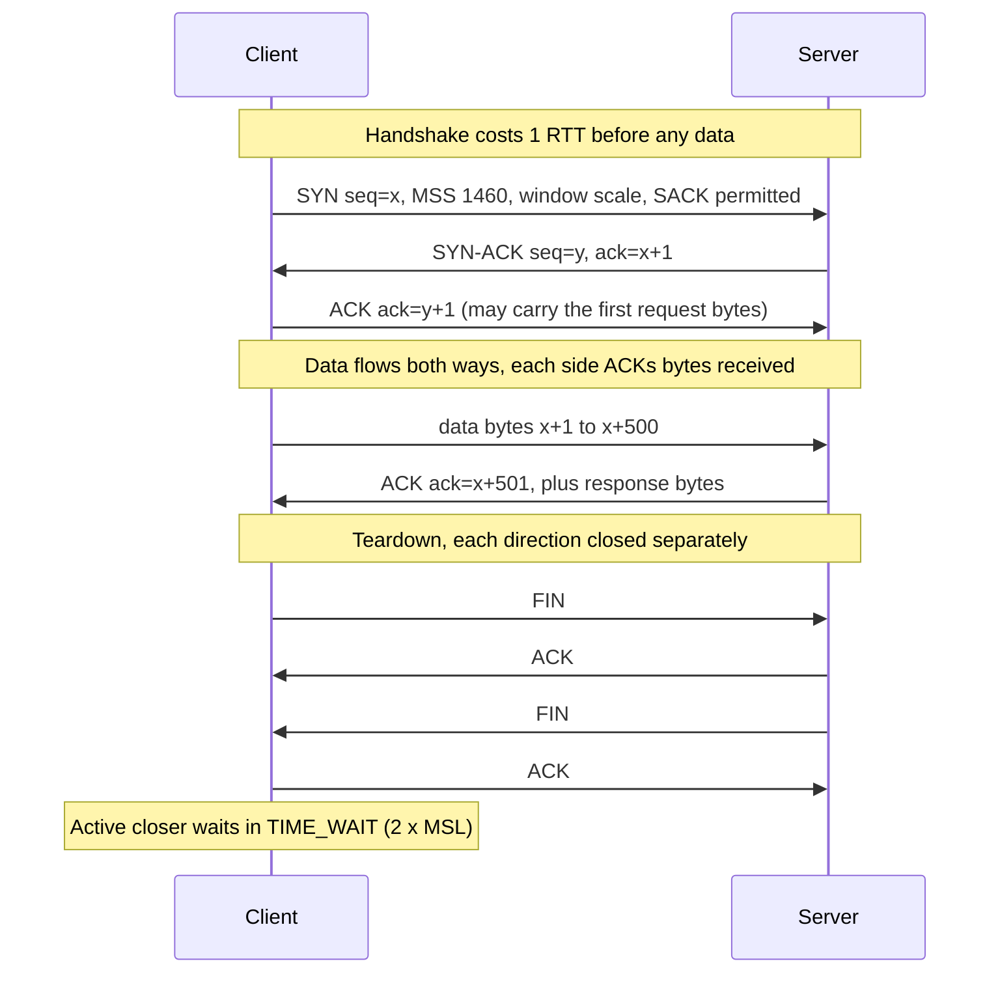
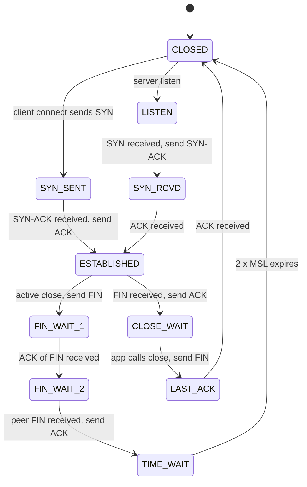
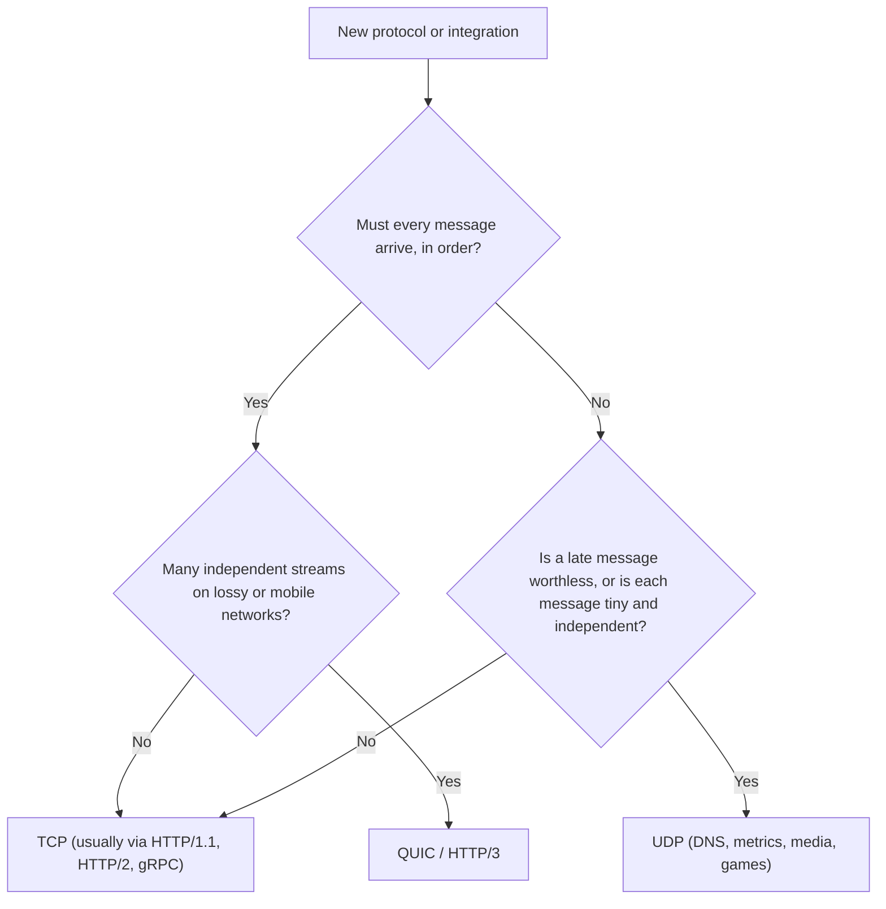

# OSI/TCP-IP, TCP vs UDP

!!! abstract "Key takeaways"
    - **OSI has 7 layers, the Internet uses 4.** OSI (ISO/IEC 7498-1) is the vocabulary: "L4 load balancer", "L7 proxy". The TCP/IP model (RFC 1122) is what runs: **link, internet (IP), transport (TCP/UDP), application** (HTTP, DNS, TLS, gRPC). Each layer wraps the one above in its own header (**encapsulation**).
    - **TCP** is connection-oriented and gives a **reliable, ordered, flow- and congestion-controlled byte stream**: 3-way handshake (1 RTT before data), sequence numbers and ACKs, retransmission, receive window, congestion window. It has **no message boundaries**, so the application must frame its messages.
    - **UDP** is an 8-byte header on top of IP: **connectionless datagrams, no delivery, ordering or congestion guarantees**, but message boundaries are kept and there is no handshake or head-of-line blocking. Used by DNS, QUIC/HTTP/3, VoIP and video, metrics and games.
    - **Head-of-line blocking:** one lost TCP segment stalls every byte behind it until it's retransmitted. **QUIC** (RFC 9000) rebuilds reliability over UDP with independent streams, 1-RTT (or 0-RTT) setup with TLS 1.3 built in, and connection migration.
    - Production gotchas live at the socket: **always set connect and read timeouts**, **reuse connections** (handshakes cost RTTs and closed sockets sit in **TIME_WAIT**), know that idle connections are silently dropped by NATs and load balancers (AWS NAT gateway and NLB: 350 s), and watch Nagle + delayed ACK on small request/response protocols.

## Why it matters

Every remote call a Spring Boot service makes (HTTP to an upstream, a Kafka produce, a Redis `GET`, a MongoDB query, a JDBC statement) is a TCP connection underneath, and the DNS lookup before it is usually UDP. When those calls are slow or fail in strange ways, the cause is often below HTTP: a connect that hangs for two minutes because no timeout was set, ephemeral port exhaustion from opening a connection per request, a pooled connection that a NAT dropped silently while idle, or 40 ms stalls from Nagle's algorithm.

Juniors get "name the OSI layers" and "TCP vs UDP?"; seniors get "why does HTTP/3 use UDP?" and "why do I have 30,000 sockets in TIME_WAIT?". Show **what each layer guarantees, what it costs, and where it breaks**. This page is the base for [HTTP/1.1 vs HTTP/2 vs HTTP/3](02-http-1-1-vs-http-2-vs-http-3.md), the [TLS handshake](03-tls-handshake.md) and [L4 vs L7 load balancers](05-load-balancers-reverse-proxies-and-cdns.md).

## Core concepts

### Two models: OSI as vocabulary, TCP/IP as reality

The **OSI reference model** (ISO/IEC 7498-1, 1984) has seven layers; its protocol suite lost to TCP/IP, but its layer numbers survived as vocabulary. The **TCP/IP model** (RFC 1122, 1989) has four layers and is what the Internet runs.

| OSI layer | TCP/IP layer | Unit (PDU) | Examples | Where you meet it |
|---|---|---|---|---|
| 7 Application | Application | Message | HTTP, gRPC, DNS, SMTP, Kafka protocol | REST and GraphQL APIs, L7 load balancers (ALB), API gateways |
| 6 Presentation | Application | | TLS (roughly), encoding, compression | TLS termination, JSON vs Protobuf |
| 5 Session | Application | | Sessions, RPC dialogue | Rarely discussed separately |
| 4 Transport | Transport | Segment (TCP) / datagram (UDP) | TCP, UDP, QUIC (over UDP) | Ports, L4 load balancers (NLB), connection pools, timeouts |
| 3 Network | Internet | Packet | IPv4, IPv6, ICMP | IP addresses, routing, VPC route tables, security groups |
| 2 Data link | Link | Frame | Ethernet, Wi-Fi, ARP | MAC addresses, VLANs, MTU |
| 1 Physical | Link | Bits | Copper, fibre, radio | Not your problem as an app engineer |

TLS doesn't fit neatly: it runs on top of TCP and below HTTP, so people call it L6, "L4.5" or just part of the application layer. Saying "the model is a simplification and TLS sits between TCP and HTTP" is the right senior answer.

### Encapsulation, MTU and MSS

Each layer treats the layer above as opaque data and adds its own header. The receiver strips them in reverse order. Routers look only at the IP header; switches at the Ethernet header; the TCP header is end to end (until a proxy terminates it).

{ loading=lazy }
*Each layer only reads its own header. The 1,500-byte Ethernet MTU limits each segment to about 1,460 bytes of data.*

- **MTU** (maximum transmission unit): the largest IP packet a link carries without fragmentation, 1,500 bytes on standard Ethernet (AWS allows 9,001-byte jumbo frames inside a VPC, but traffic leaving the VPC is limited to 1,500).
- **MSS** (maximum segment size): the largest TCP payload, announced in the SYN. With IPv4 and no options, MSS = 1,500 − 20 − 20 = **1,460 bytes**.
- **Path MTU discovery** relies on ICMP "fragmentation needed" messages. Firewalls that block all ICMP break it, with a classic symptom: the handshake and small requests work, large responses hang.

### Ports, sockets and the 5-tuple

IP delivers to a host; the transport layer delivers to a **process**, using 16-bit **ports**. A TCP connection is identified by the **5-tuple** `(protocol, source IP, source port, destination IP, destination port)`. A server listens on one port (e.g. 8443) and serves many connections because each client brings a different source IP and port.

The client's source port is an **ephemeral port** picked by the OS. On Linux the default range (`net.ipv4.ip_local_port_range`) is **32768–60999**, about 28,000 ports. For one destination IP and port, that's the limit of concurrent connections from one source IP, including those still in TIME_WAIT. This is the maths behind port exhaustion.

### TCP: a reliable byte stream over an unreliable network

IP is best effort: packets can be lost, duplicated, reordered or corrupted. TCP (RFC 9293, which in 2022 consolidated the original RFC 793 and its updates) builds a reliable stream on top.

**1. Connection setup: the 3-way handshake.** Both sides pick a random initial sequence number (random to resist spoofing, RFC 6528) and agree on options such as MSS, window scaling and selective ACK.


*Notice the full round trip before the first request byte, and that the side that closes first, not the server by definition, ends up in TIME_WAIT.*

**2. Sequence numbers and ACKs.** Every byte has a sequence number. The receiver sends a **cumulative ACK**: "I have everything up to byte N". With **SACK** (selective acknowledgement, RFC 2018) it can also say "and I have these later blocks", so the sender resends only the gaps.

**3. Retransmission.** The sender keeps unacknowledged data and resends it when either (a) the **retransmission timeout (RTO)** expires, computed from smoothed RTT and its variance (RFC 6298), doubling on each retry; or (b) it sees **three duplicate ACKs**, which signals that a later segment arrived but one is missing (**fast retransmit**, RFC 5681). Fast retransmit costs about one RTT; an RTO costs hundreds of milliseconds or more.

**4. In-order delivery and head-of-line blocking.** TCP delivers bytes to the application strictly in order. If segment 3 is lost, segments 4 and 5 sit in the receive buffer until 3 is retransmitted, even if they belong to a different HTTP/2 stream. That's **head-of-line (HOL) blocking** at the transport layer.

{ loading=lazy }
*Same loss, two contracts: TCP trades latency for completeness and order; UDP hands the gap to the application.*

**5. Flow control.** Each ACK carries a **receive window (rwnd)**: how many more bytes the receiver can buffer. A slow consumer shrinks it, eventually to zero, and the sender stops. Window scaling (RFC 7323) lets the 16-bit field express windows beyond 64 KB, which high-bandwidth, high-latency links need: throughput ≤ window ÷ RTT.

**6. Congestion control.** The sender also keeps a **congestion window (cwnd)** to avoid overloading the network, and sends at most `min(rwnd, cwnd)` unacknowledged bytes.

- **Slow start:** a new connection starts with an initial window of **10 segments** (about 14 KB, RFC 6928) and roughly doubles cwnd every RTT until loss or a threshold.
- **Congestion avoidance:** then cwnd grows more slowly; on loss it is cut. Linux defaults to **CUBIC** (RFC 9438); Google's **BBR** models bandwidth and RTT instead of reacting only to loss.
- **Why it matters for apps:** a brand-new connection can't use the full bandwidth for its first few RTTs, which is another reason to **reuse connections** and keep responses small.

**7. Teardown and TIME_WAIT.** Each direction is closed with its own FIN, so a connection can be **half-closed**. The side that closes first enters **TIME_WAIT** for 2 × MSL (maximum segment lifetime) so that late duplicates of old segments can't be mistaken for a new connection with the same 5-tuple, and so the final ACK can be resent if lost. RFC 9293 keeps MSL at 2 minutes; **Linux hard-codes TIME_WAIT at 60 seconds**. A `RST` instead aborts a connection immediately (e.g. connecting to a closed port, or a load balancer killing an idle flow).


*Notice the two ways out of ESTABLISHED. Many sockets stuck in CLOSE_WAIT mean **your application** received a FIN but never called `close()`, a connection leak. Many in TIME_WAIT mean your side closes lots of short-lived connections.*

### UDP: datagrams and nothing else

UDP (RFC 768, 1980, three pages long) adds only an **8-byte header**: source port, destination port, length and checksum. What you get:

- **No connection:** no handshake, so the first datagram carries data (0 RTT). No per-connection state on the server, which is why DNS servers scale to huge query rates.
- **Message boundaries:** one `send` is one datagram is one `receive`. TCP gives you a stream you must split yourself.
- **No guarantees:** datagrams may be lost, duplicated or reordered, and nothing tells the sender. No flow or congestion control, so the application must pace itself (RFC 8085 gives the rules).
- **Size:** up to 65,507 bytes in theory over IPv4, but anything above the path MTU is fragmented and losing one fragment loses the datagram, so practical protocols stay around **1,200 bytes** (QUIC's minimum; DNS recommends a 1,232-byte EDNS buffer).
- **Multicast and broadcast** work only with UDP.

**Who uses UDP:** DNS (port 53, falling back to TCP when a response is truncated, RFC 7766), QUIC and HTTP/3, DHCP, NTP, SNMP, syslog, StatsD-style metrics, VoIP and video (RTP, WebRTC media), online games, and VPN tunnels such as WireGuard. The pattern: **small independent messages, or real-time data where a late packet is worthless**.

### QUIC: TCP's guarantees, rebuilt over UDP

TCP lives in OS kernels and is inspected by middleboxes, so changing it takes a decade. QUIC (RFC 9000, 2021) moves transport into user space over UDP; HTTP/3 (RFC 9114) runs on it:

- **Reliability per stream:** a lost packet blocks only the stream it belonged to, removing TCP's HOL blocking for multiplexed requests.
- **Faster setup:** transport and TLS 1.3 handshakes are combined, **1 RTT** for a new connection and **0-RTT** on resumption (vs 2 RTT for TCP + TLS 1.3).
- **Connection IDs** instead of the 5-tuple, so a phone moving from Wi-Fi to mobile data keeps its connection (**connection migration**).
- **Always encrypted**, including most transport headers, so middleboxes can't ossify it.

The cost: more CPU per byte, and some networks block UDP, so clients fall back to HTTP/2 over TCP. See [HTTP versions](02-http-1-1-vs-http-2-vs-http-3.md).

### Choosing a transport


*Notice that the default answer is TCP, normally through a higher-level protocol. You pick raw UDP only when you're prepared to own loss, ordering and pacing.*

| | TCP | UDP |
|---|---|---|
| Connection | Yes, 3-way handshake (1 RTT) | No, first datagram carries data |
| Reliability | ACKs and retransmission | None; loss is silent |
| Ordering | Strict, per connection | None |
| Boundaries | Byte stream, app must frame | Preserved per datagram |
| Flow / congestion control | Yes (rwnd, cwnd) | No; app must pace |
| Header | 20–60 bytes | 8 bytes |
| HOL blocking | Yes | No |
| Server state | Per connection (buffers, TIME_WAIT) | None |
| Multicast / broadcast | No | Yes |
| Typical uses | HTTP/1.1, HTTP/2, gRPC, TLS, databases, Kafka, Redis, SSH | DNS, QUIC, VoIP, video, metrics, DHCP, NTP, games |

## In practice: code & configuration

Most services never touch a socket directly, but integrations with legacy systems sometimes do: healthcare HL7 v2 feeds over **MLLP**, banking messages over **ISO 8583** links, or a vendor's custom TCP protocol. Two mistakes dominate: no timeouts, and assuming one `read()` returns one message.

=== "❌ Common mistake"
    ```java
    // Raw TCP client to a legacy claims system
    try (Socket socket = new Socket("claims-gw.internal", 9100)) {   // no connect timeout: OS default (~2 min on Linux)
        socket.getOutputStream().write(request.getBytes(UTF_8));      // no framing: peer can't tell where the message ends
        byte[] buf = new byte[4096];
        int n = socket.getInputStream().read(buf);                    // no read timeout: can block forever
        return new String(buf, 0, n, UTF_8);                          // assumes one read() == one whole message
    }
    ```

=== "✅ Correct approach"
    ```java
    // Length-prefixed framing, explicit timeouts, TCP options set deliberately (Java 21)
    static final int MAX_FRAME = 1 << 20;   // 1 MiB guard against a corrupt or hostile length

    String call(String host, int port, String request) throws IOException {
        try (Socket socket = new Socket()) {
            socket.setTcpNoDelay(true);                        // small request/response: avoid Nagle + delayed-ACK stalls
            socket.setKeepAlive(true);                         // detect dead peers on long-lived connections
            socket.connect(new InetSocketAddress(host, port), 2_000);   // connect timeout: fail fast, ms
            socket.setSoTimeout(5_000);                        // read timeout per blocking read, ms

            var out = new DataOutputStream(new BufferedOutputStream(socket.getOutputStream()));
            byte[] body = request.getBytes(UTF_8);
            out.writeInt(body.length);                         // frame = 4-byte length + payload
            out.write(body);
            out.flush();                                       // one write for header + body

            var in = new DataInputStream(new BufferedInputStream(socket.getInputStream()));
            int len = in.readInt();
            if (len < 0 || len > MAX_FRAME) throw new ProtocolException("bad frame length " + len);
            byte[] resp = in.readNBytes(len);                  // loops until len bytes or EOF: TCP may split them
            if (resp.length != len) throw new EOFException("peer closed mid-frame");
            return new String(resp, UTF_8);
        }                                                      // SocketTimeoutException surfaces as a clear failure
    }
    ```

For HTTP, the same rules apply through the client: one shared, pooled client with explicit timeouts, never a new client per request.

```java
// Spring Framework 6.1+ / Boot 3.2+: one RestClient bean, backed by the JDK HttpClient's connection pool
@Bean
RestClient memberClient(RestClient.Builder builder) {
    HttpClient jdk = HttpClient.newBuilder()
            .connectTimeout(Duration.ofSeconds(2))       // TCP (and TLS) connection establishment
            .version(HttpClient.Version.HTTP_2)          // multiplexes requests over one TCP connection where supported
            .build();                                    // build ONCE: the pool lives inside this object
    var factory = new JdkClientHttpRequestFactory(jdk);
    factory.setReadTimeout(Duration.ofSeconds(3));       // time to wait for the response
    return builder.baseUrl("https://members.internal").requestFactory(factory).build();
}
```

{ loading=lazy }
*Handshakes are pure latency. Reusing connections removes them from every call after the first, and avoids TIME_WAIT build-up.*

A UDP sender is the opposite: no connection, no ACK, keep datagrams small.

```java
// Fire-and-forget StatsD-style metric over UDP: losing one sample is acceptable, blocking the request is not
try (DatagramChannel ch = DatagramChannel.open()) {
    ch.connect(new InetSocketAddress("statsd.monitoring", 8125)); // "connect" only fixes the peer; no handshake happens
    ch.write(ByteBuffer.wrap("claims.submitted:1|c".getBytes(UTF_8))); // one write = one datagram, well under 1,200 bytes
}
```

Linux commands worth knowing when a connection problem is suspected:

```bash
ss -s                                        # totals by state: estab, timewait, closed
ss -tan state time-wait | wc -l              # TIME_WAIT count (many = short-lived outbound connections)
ss -tanp state close-wait                    # CLOSE_WAIT with owning process: an app not closing sockets
ss -ti dst 10.0.4.17                         # per-connection rtt, cwnd, retransmits, mss
sysctl net.ipv4.ip_local_port_range net.ipv4.tcp_keepalive_time net.ipv4.tcp_syn_retries
tcpdump -nn -i any 'host 10.0.4.17 and (tcp[tcpflags] & (tcp-syn|tcp-rst|tcp-fin) != 0)'  # handshakes, resets, closes
```

## Real-world usage

- **DNS** is the canonical UDP service: a query and an answer, each one datagram, no handshake. Large answers (DNSSEC, many records) set the truncation bit and the client retries over TCP. In Kubernetes, UDP DNS through conntrack has caused well-known 5-second lookup delays (a race when A and AAAA queries leave the same socket in parallel); **NodeLocal DNSCache** was introduced partly to avoid it.
- **QUIC and HTTP/3**: built at Google, now standard in major browsers and CDNs, mainly to cut setup time and HOL blocking on lossy mobile networks.
- **Kafka, Redis, PostgreSQL, MongoDB** all use long-lived, pooled TCP connections with their own length-prefixed binary framing, the pattern shown above.
- **Idle-timeout failures in the cloud**: AWS NAT gateways drop idle connections after **350 seconds**; NLB's default TCP idle timeout is also 350 s (configurable 60–6,000 s since 2024), and ALB's default is 60 s. A pooled database or HTTP connection idle longer than that is silently dead. The next request fails with a reset or hangs until the read timeout. Fix with TCP keep-alive or application-level pings shorter than the timeout, and a pool max-idle time below it.
- **Healthcare and banking**: HL7 v2 messages over **MLLP** (TCP with start and end block characters as framing), ISO 8583 card networks over persistent TCP with length headers, and TLS (often mutual TLS) on top for HIPAA and PCI DSS. VoIP and video consultations (telehealth) use UDP-based RTP or WebRTC.

## Trade-offs & production gotchas

| Option | Pros | Cons | Use when |
|---|---|---|---|
| TCP (via HTTP/gRPC) | Reliable, ordered, universal, debuggable | Handshake RTT, HOL blocking, per-connection state | Default for APIs and data |
| Raw TCP + custom framing | Low overhead, full control | You own framing, timeouts, versioning, TLS | Legacy or partner protocols (MLLP, ISO 8583) |
| UDP | No handshake, no HOL blocking, multicast, stateless | No reliability, ordering or pacing; NAT and firewall issues | DNS, metrics, real-time media, games |
| QUIC / HTTP/3 | 1-RTT/0-RTT setup, per-stream loss, migration | More CPU, UDP sometimes blocked, newer tooling | Public, mobile-heavy, high-latency clients |
| New connection per request | Simple | Handshake per call, TIME_WAIT, port exhaustion, cold cwnd | Almost never |
| Pooled keep-alive connections | No setup cost, warm cwnd | Stale connections after idle timeouts, pool sizing | Service-to-service calls |

!!! warning "Gotcha: no connect timeout"
    On Linux, `connect()` retries the SYN `tcp_syn_retries` times (default 6) with exponential backoff: 1 + 2 + 4 + … + 64 ≈ **127 seconds** before it gives up. A Java `Socket` or HTTP client without a connect timeout can tie up a thread for two minutes when an upstream is blackholed (a security group dropping packets rather than rejecting them). Set connect timeouts in the low seconds and read timeouts from your latency budget; see [retries and timeouts](../distributed-systems/05-retries-backoff-jitter-timeouts.md).

!!! warning "Gotcha: TIME_WAIT and ephemeral port exhaustion"
    With 28,232 ephemeral ports and a 60 s TIME_WAIT, one client IP can open only about **470 new connections per second** to the same destination IP and port before `connect` fails with `EADDRNOTAVAIL` ("Cannot assign requested address"). The fix is connection reuse (keep-alive, pooling, HTTP/2), not kernel tricks. `tcp_tw_reuse` helps outbound connections; the old `tcp_tw_recycle` broke clients behind NAT and was removed in Linux 4.12.

!!! warning "Gotcha: Nagle + delayed ACK"
    Nagle's algorithm (RFC 896) holds back small segments while earlier data is unacknowledged; the receiver's delayed ACK holds back ACKs hoping to piggyback them (Linux: about 40 ms). A protocol that writes a request in two small pieces and then waits can stall for 40 ms on every call. Write each message in one buffered write and set `TCP_NODELAY` for request/response traffic.

!!! warning "Gotcha: TCP keep-alive defaults are useless for idle timeouts"
    Keep-alive is off by default, and when enabled the first probe is sent after **2 hours** idle (`tcp_keepalive_time = 7200` on Linux, matching RFC 1122's minimum default). That's far longer than a 350 s NAT or 60 s ALB timeout. Lower it per socket (Java 11+ `jdk.net.ExtendedSocketOptions.TCP_KEEPIDLE`), or set the pool's idle eviction below the shortest middlebox timeout.

## How this connects to my experience

- **Where I used it:** not a specific resume claim; position it as transferable knowledge behind work that is on the resume. The **GraphQL Consumer Service** on OptumRx Meteor is the integration layer over **5 upstream systems**, so every resolver call is an HTTPS request over a pooled TCP connection, and the same service talks to **Kafka, MongoDB and Redis** over long-lived TCP connections.
- **Talking points:**
    - Upstream calls need **connect and read timeouts** and **connection pooling** per upstream; a slow or blackholed upstream must fail fast instead of exhausting threads *[confirm the HTTP client and timeout values used]*.
    - **Redis caching** for frequently accessed queries removes a network round trip (and its tail) from hot paths; the Redis client keeps persistent TCP connections rather than reconnecting per command.
    - On AWS (Deloitte, ConvergeHealth: **ECS, EKS, API Gateway, EC2**) the L4 vs L7 distinction shows up as NLB vs ALB, and idle timeouts on load balancers and NAT gateways explain "connection reset" errors on pooled connections *[confirm whether this was hit in practice]*.
    - CipherTrust CCKM **HSM integrations (Thales Luna, SafeNet)** talk to network HSMs over TLS-protected TCP connections *[confirm transport details if asked]*.
- **Likely follow-up chain:** "TCP vs UDP?" → guarantees and costs, the table above → "Why does HTTP/3 use UDP if it needs reliability?" → HOL blocking, kernel ossification, QUIC rebuilds reliability per stream with 1-RTT setup → "Your service throws `Cannot assign requested address` under load. Why?" → ephemeral ports plus TIME_WAIT, the 470/s maths, fix with keep-alive and a shared pooled client → "And intermittent `Connection reset` after quiet periods?" → idle timeout on NAT or load balancer, keep-alive or idle eviction below 350 s, retry idempotent calls once.

## Interview questions

### Fundamentals

??? question "Q1. Name the OSI layers and map them to the TCP/IP model."
    **Answer:** OSI has seven: physical, data link, network, transport, session, presentation, application. TCP/IP (RFC 1122) has four: link (OSI 1–2), internet (3, IP), transport (4, TCP/UDP) and application (5–7, HTTP, DNS, TLS-ish). OSI is mainly vocabulary today ("L4 vs L7 load balancer"); TCP/IP is what runs. I'd add that the boundaries are fuzzy: TLS sits between TCP and HTTP, and QUIC is a transport running in user space over UDP.

    **Interviewer listens for:** both models, the mapping, examples per layer, awareness that the models are simplifications.

    **Common wrong answer:** Putting HTTP at layer 4 or IP at layer 2, or claiming OSI is what the Internet implements.

??? question "Q2. What's the difference between TCP and UDP?"
    **Answer:** TCP is connection-oriented: a 3-way handshake, then a reliable, ordered byte stream with retransmission, flow control (receive window) and congestion control (cwnd). UDP is connectionless: 8-byte header, independent datagrams, no delivery or ordering guarantees and no congestion control, but it keeps message boundaries, has no handshake and no head-of-line blocking. TCP fits APIs, databases and file transfer; UDP fits DNS, real-time media, metrics and games, and is the base for QUIC.

    **Interviewer listens for:** stream vs datagram, guarantees vs cost, a use case for each, mention of QUIC.

    **Common wrong answer:** "UDP is faster so it's better for performance." It avoids handshake and HOL blocking, but you must rebuild whatever reliability you need.

??? question "Q3. Walk through the TCP 3-way handshake. Why three messages and not two?"
    **Answer:** Client sends SYN with its initial sequence number x; server replies SYN-ACK with its own ISN y and ack x+1; client sends ACK y+1. Three are needed because each side must announce its ISN **and** have it acknowledged: the server's SYN needs an ACK from the client. It also lets the server reject stale duplicate SYNs from old connections. ISNs are random (RFC 6528) to make spoofing and injection harder. The cost is one RTT before data.

    **Interviewer listens for:** ISNs exchanged and acknowledged in both directions, stale duplicates, 1 RTT cost.

    **Common wrong answer:** "Three times to make sure the connection is reliable" without explaining sequence-number synchronisation.

### Intermediate

??? question "Q4. What happens when a TCP segment is lost?"
    **Answer:** The receiver keeps ACKing the last in-order byte, so the sender sees duplicate ACKs; after three it does a fast retransmit (about one RTT of delay). If there aren't enough later segments to trigger that, the retransmission timeout fires instead (RTO, based on smoothed RTT, doubling per retry), which is much slower. SACK tells the sender exactly which blocks are missing. Meanwhile later bytes wait in the receive buffer (head-of-line blocking), and congestion control cuts cwnd, reducing throughput.

    **Interviewer listens for:** dup ACKs vs RTO, SACK, HOL blocking, cwnd reduction.

    **Common wrong answer:** "The receiver asks for the packet again." TCP is ACK-driven; the sender decides to resend.

??? question "Q5. What is TIME_WAIT, who ends up in it, and is it a problem?"
    **Answer:** The side that closes first (active closer) stays in TIME_WAIT for 2 × MSL (60 s on Linux) so late segments from the old connection can't corrupt a new one with the same 5-tuple, and so it can resend the last ACK. It's harmless on servers that close connections (they're not using ephemeral ports), but on a client opening many short connections to one destination it uses up ephemeral ports: about 28k ports / 60 s ≈ 470 new connections per second. The fix is connection reuse, not shortening TIME_WAIT.

    **Interviewer listens for:** active closer, why it exists, the port maths, reuse as the fix.

    **Common wrong answer:** "It's a bug, turn on `tcp_tw_recycle`." That option broke NAT clients and was removed.

??? question "Q6. Explain flow control vs congestion control."
    **Answer:** Flow control protects the **receiver**: it advertises a receive window (rwnd) of free buffer space, and a slow reader shrinks it to zero. Congestion control protects the **network**: the sender keeps a congestion window (cwnd), starting at 10 segments and growing via slow start then congestion avoidance (CUBIC by default on Linux, BBR as an alternative), shrinking on loss. The sender may have `min(rwnd, cwnd)` bytes in flight.

    **Interviewer listens for:** receiver vs network, both windows, slow start, `min()`.

    **Common wrong answer:** Treating them as the same mechanism.

### Senior

??? question "Q7. HTTP/3 needs reliability. Why build it on UDP rather than improve TCP?"
    **Answer:** Two reasons. Technical: TCP's single ordered byte stream means one lost packet stalls all multiplexed HTTP/2 streams; QUIC gives each stream its own ordering. Practical: TCP lives in OS kernels and is inspected and rewritten by middleboxes, so new TCP features take years to deploy (TCP Fast Open largely failed for this reason). UDP passes through most networks, and QUIC runs in user space, encrypts almost all of its headers so middleboxes can't depend on them, combines the transport and TLS 1.3 handshakes (1-RTT, 0-RTT on resumption) and supports connection migration via connection IDs.

    **Interviewer listens for:** HOL blocking, ossification, user-space deployment, combined handshake, migration, fallback to TCP when UDP is blocked.

    **Common wrong answer:** "Because UDP is faster."

??? question "Q8. You're designing a protocol over a raw TCP socket for a partner integration. What must you handle?"
    **Answer:** Framing (length prefix or escaped delimiters, since `read()` can return partial or multiple messages), a maximum frame size, connect and read timeouts, heartbeats for idle NAT and LB timeouts, request IDs if pipelined, versioning, TLS (ideally mutual), reconnect with backoff, idempotent retries and graceful shutdown. First I'd ask whether gRPC or HTTPS would do, since they solve all of this.

    **Interviewer listens for:** framing first, timeouts, heartbeats, security, idempotent retries, and "prefer an existing protocol".

    **Common wrong answer:** Writing a string and reading into a 4 KB buffer, assuming one read is one message.

### Scenario-based

??? question "Q9. Under load, a service starts failing with `java.net.BindException: Cannot assign requested address` on outbound calls. Diagnose it."
    **Answer:** That's `EADDRNOTAVAIL`: no free ephemeral port for the destination. Check `ss -s` and `ss -tan state time-wait` for thousands of TIME_WAIT sockets to one upstream. The usual cause is a new HTTP client or connection per request, or `Connection: close` from a proxy. Fix by sharing one pooled client (or HTTP/2), checking keep-alive headers on both sides, and sizing the pool. Short-term mitigations: widen `ip_local_port_range`, enable `tcp_tw_reuse`, or spread across more source IPs.

    **Interviewer listens for:** ephemeral ports + TIME_WAIT, `ss` evidence, reuse as the real fix.

    **Common wrong answer:** Increasing the thread pool or the file descriptor limit.

??? question "Q10. A pooled HTTP client gets intermittent `Connection reset` or long hangs on the first request after quiet periods, on AWS. What's going on?"
    **Answer:** An idle-timeout mismatch. The NAT gateway (350 s), NLB (350 s default) or ALB (60 s) dropped the idle flow, but the client still thinks the pooled connection is alive. Its next write gets a RST, or packets are silently dropped and it waits for the read timeout. Fixes: evict idle connections before the shortest middlebox timeout, enable TCP keep-alive with a short idle time or use protocol pings (HTTP/2 PING), validate connections on borrow where the pool supports it, and retry idempotent requests once on a stale-connection error. Check the server's keep-alive timeout too: the client's idle timeout should be shorter than the server's.

    **Interviewer listens for:** middlebox idle timeouts with numbers, stale pool connections, idle eviction and keep-alive, safe retries.

    **Common wrong answer:** "The upstream is flaky", without looking at the timing pattern.

## Cheat sheet

| Concept | Remember |
|---|---|
| OSI | 7 layers: physical, data link, network, transport, session, presentation, application |
| TCP/IP | 4 layers: link, internet, transport, application (RFC 1122) |
| PDUs | frame (L2), packet (L3), segment / datagram (L4), message (L7) |
| MTU / MSS | 1,500 B Ethernet; MSS 1,460 B for IPv4 without options |
| 5-tuple | proto, src IP, src port, dst IP, dst port; Linux ephemeral ports 32768–60999 |
| Handshake | SYN, SYN-ACK, ACK; 1 RTT; random ISNs |
| Reliability | seq numbers, cumulative ACK, SACK, fast retransmit (3 dup ACKs), RTO |
| Windows | rwnd = receiver (flow), cwnd = network (congestion); initial cwnd 10 segments |
| Close | FIN each way; active closer → TIME_WAIT (60 s Linux); CLOSE_WAIT = app didn't close |
| UDP | 8-byte header, datagrams, no guarantees, keep under ~1,200 B |
| QUIC | over UDP, per-stream reliability, TLS 1.3 built in, 1-RTT / 0-RTT, migration |
| Timeouts | Linux connect without timeout ≈ 127 s; NAT gw / NLB idle 350 s; ALB 60 s |
| Keep-alive | Off by default; first probe after 2 h; tune per socket or evict idle |
| Small messages | One write per message, `TCP_NODELAY` for request/response |

## Sources
1. [RFC 9293: Transmission Control Protocol](https://www.rfc-editor.org/rfc/rfc9293): TCP specification, handshake, state machine, TIME_WAIT and MSL, keep-alive rules.
2. [RFC 768: User Datagram Protocol](https://www.rfc-editor.org/rfc/rfc768) and [RFC 8085: UDP Usage Guidelines](https://www.rfc-editor.org/rfc/rfc8085): UDP header and semantics, congestion and message-size guidance.
3. [RFC 1122: Requirements for Internet Hosts](https://www.rfc-editor.org/rfc/rfc1122): the four-layer Internet model, keep-alive default of no less than two hours.
4. [RFC 5681: TCP Congestion Control](https://www.rfc-editor.org/rfc/rfc5681), [RFC 6298: Computing TCP's Retransmission Timer](https://www.rfc-editor.org/rfc/rfc6298), [RFC 6928: Increasing TCP's Initial Window](https://www.rfc-editor.org/rfc/rfc6928), [RFC 9438: CUBIC](https://www.rfc-editor.org/rfc/rfc9438), [RFC 2018: SACK](https://www.rfc-editor.org/rfc/rfc2018), [RFC 7323: Window scaling](https://www.rfc-editor.org/rfc/rfc7323), [RFC 6528: ISN generation](https://www.rfc-editor.org/rfc/rfc6528), [RFC 896: Nagle](https://www.rfc-editor.org/rfc/rfc896).
5. [RFC 9000: QUIC](https://www.rfc-editor.org/rfc/rfc9000) and [RFC 9114: HTTP/3](https://www.rfc-editor.org/rfc/rfc9114): QUIC streams, handshake, connection IDs, 1,200-byte minimum.
6. [RFC 7766: DNS Transport over TCP](https://www.rfc-editor.org/rfc/rfc7766) and [DNS Flag Day 2020](https://www.dnsflagday.net/2020/): TCP fallback and the 1,232-byte EDNS buffer.
7. [Linux kernel: ip-sysctl documentation](https://docs.kernel.org/networking/ip-sysctl.html): `ip_local_port_range`, `tcp_syn_retries`, `tcp_keepalive_time`, `tcp_tw_reuse`, `tcp_congestion_control`.
8. [AWS: NAT gateway troubleshooting (350-second idle timeout)](https://docs.aws.amazon.com/vpc/latest/userguide/nat-gateway-troubleshooting.html), [NLB: TCP idle timeout](https://docs.aws.amazon.com/elasticloadbalancing/latest/network/update-idle-timeout.html), [ALB: connection idle timeout](https://docs.aws.amazon.com/elasticloadbalancing/latest/application/edit-load-balancer-attributes.html), [EC2 network MTU](https://docs.aws.amazon.com/AWSEC2/latest/UserGuide/network_mtu.html).
9. [Kubernetes: Using NodeLocal DNSCache](https://kubernetes.io/docs/tasks/administer-cluster/nodelocaldns/): conntrack races and DNS latency with UDP.
10. [Java SE 21: `java.net.Socket`](https://docs.oracle.com/en/java/javase/21/docs/api/java.base/java/net/Socket.html), [`jdk.net.ExtendedSocketOptions`](https://docs.oracle.com/en/java/javase/21/docs/api/jdk.net/jdk/net/ExtendedSocketOptions.html) and [Spring Framework: REST clients](https://docs.spring.io/spring-framework/reference/integration/rest-clients.html): timeouts, keep-alive options, `RestClient` with `JdkClientHttpRequestFactory`.
11. W. Richard Stevens and Kevin Fall, *TCP/IP Illustrated, Volume 1* (2nd ed.), and Ilya Grigorik, [*High Performance Browser Networking*](https://hpbn.co/): TCP internals, slow start, HOL blocking, UDP and connection reuse.
