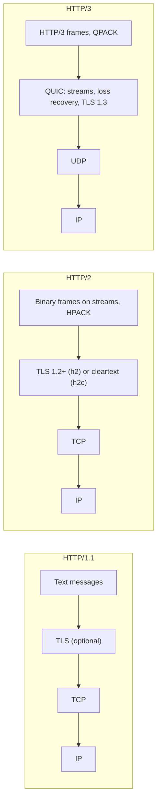
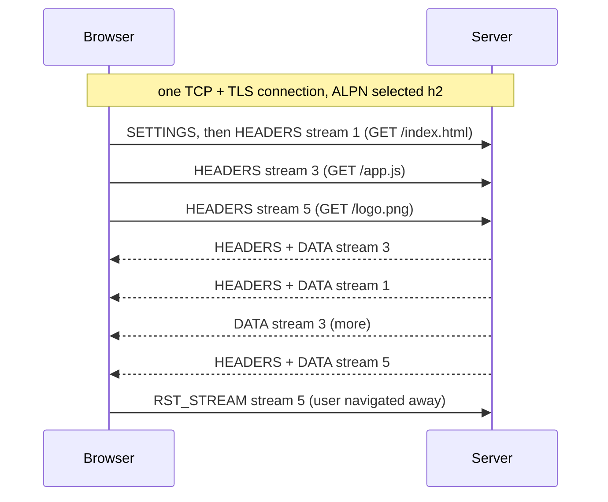
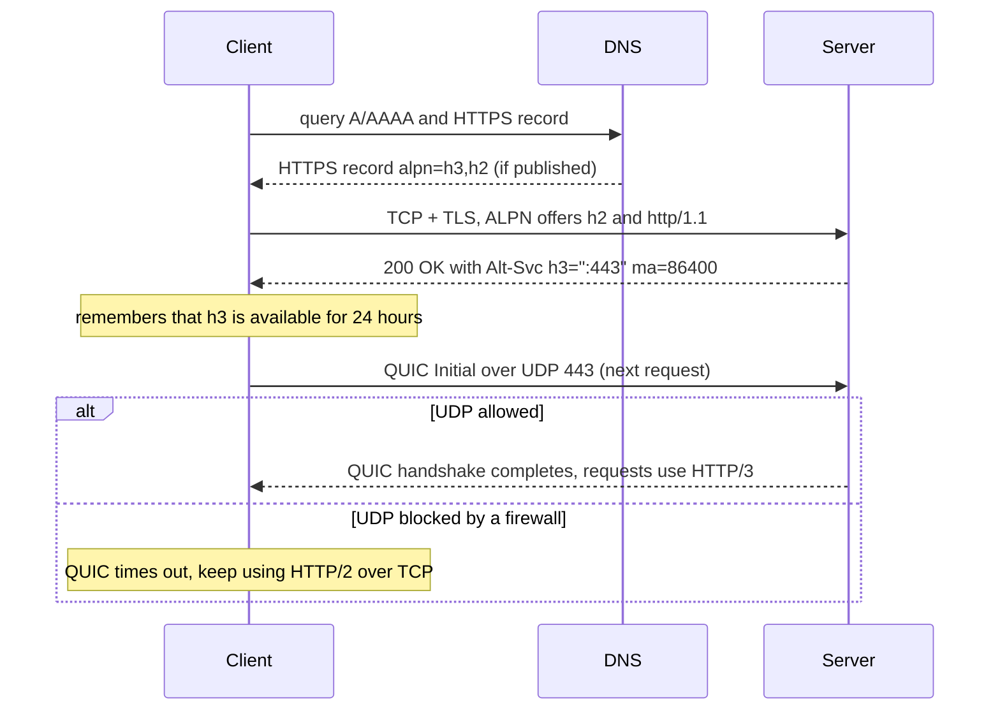

# HTTP/1.1 vs HTTP/2 vs HTTP/3

!!! abstract "Key takeaways"
    - All three versions share **the same semantics** (methods, status codes, headers, caching; RFC 9110). They differ only in how messages are put on the wire, so an upgrade needs no change to your REST controllers.
    - **HTTP/1.1** sends text messages, one exchange at a time per connection. Browsers open ~6 connections per origin to get parallelism, and a slow response blocks the ones behind it (**application-level head-of-line blocking**). Pipelining never worked in practice.
    - **HTTP/2** splits messages into binary **frames** on numbered **streams**, multiplexed over **one TCP connection**, with **HPACK** header compression and per-stream flow control. It removes HTTP-level blocking but keeps **TCP head-of-line blocking**: one lost packet stalls every stream.
    - **HTTP/3** maps HTTP onto **QUIC**, a transport over UDP with TLS 1.3 built in. Streams are ordered independently, so a loss stalls only its own stream. It also gives a **1-RTT handshake** (0-RTT on resumption, with replay risk), **connection migration** across networks, and **QPACK** compression.
    - Clients find HTTP/2 through **ALPN** in the TLS handshake (`h2`) and HTTP/3 through **`Alt-Svc`** or the **HTTPS DNS record**, falling back to TCP when UDP is blocked. The biggest gains are on lossy, high-latency mobile networks; inside a data centre the version matters less than connection reuse.

## Why it matters

HTTP/1.0 opened a new TCP connection for every request. HTTP/1.1 (1997, now RFC 9112) made connections persistent, but still allowed only one request in flight per connection. As pages grew to hundreds of resources, web teams invented workarounds that were really protocol bugs in disguise: domain sharding, image sprites, concatenated bundles and inlined assets. Google's SPDY experiment showed that multiplexing over one connection was faster, and it became HTTP/2 in 2015 (now RFC 9113). Google's next experiment, QUIC, moved the transport itself into user space over UDP; the IETF standardised it as RFC 9000 in 2021 and HTTP/3 as RFC 9114 in 2022.

You meet these versions every day in backend work, often without noticing: browsers talk HTTP/2 or HTTP/3 to a CDN or load balancer, which usually talks HTTP/1.1 to your Spring Boot pods; gRPC requires HTTP/2; and the 2023 **HTTP/2 Rapid Reset** attack was a record-breaking DDoS built on a protocol feature. Interviewers use the topic to test whether you understand layering (what TCP guarantees and what it costs) and whether you can reason about latency rather than recite version numbers. The transport basics are on [TCP vs UDP](01-osi-tcp-ip-tcp-vs-udp.md) and the handshake details on [the TLS handshake](03-tls-handshake.md).

## Core concepts

### One set of semantics, three wire formats

RFC 9110 defines what HTTP *means*: methods, status codes, header fields, content negotiation, conditional requests. RFC 9111 defines caching. Each version then has its own mapping onto a connection:


*Notice that HTTP/2 changes only the top layer, while HTTP/3 replaces TCP and TLS with QUIC. Everything above the framing (your controllers, status codes, headers) stays the same.*

### HTTP/1.1: persistent text connections

An HTTP/1.1 request is human-readable text: a request line, header lines, a blank line, an optional body. Key features:

- **Persistent connections** by default (`Connection: close` opts out), so one TCP and TLS handshake serves many requests.
- **Mandatory `Host` header**, which made virtual hosting (many sites on one IP) possible.
- **Chunked transfer encoding**, so a server can stream a body without knowing its length up front.
- **Pipelining**: the client may send several requests without waiting, but responses must come back **in order**. One slow response blocks all those behind it, and buggy proxies mishandled it, so browsers never enabled it.

So in practice one connection carries one exchange at a time. Browsers compensate by opening up to about **six connections per origin**, each with its own handshake, congestion window and memory on the server. That is the **head-of-line (HOL) blocking** problem at the application layer, and it drove the HTTP/1.1-era tricks: sharding assets across `img1.example.com` and `img2.example.com` to get more connections, sprites and concatenation to make fewer requests. Headers are sent uncompressed on every request, so cookies and tokens repeat in full each time.

### HTTP/2: binary framing and multiplexing

HTTP/2 keeps the semantics but replaces the text format with a binary **framing layer**:

- A **stream** is one request/response exchange, identified by a 31-bit ID. Client-initiated streams use **odd** IDs (1, 3, 5…); stream 0 is the connection itself.
- A **frame** is the unit on the wire: a 9-byte header (length, type, flags, stream ID) and a payload. Requests and responses become a `HEADERS` frame (plus `CONTINUATION` if large) followed by `DATA` frames. Control frames include `SETTINGS`, `WINDOW_UPDATE`, `PING`, `RST_STREAM` and `GOAWAY`.
- **Multiplexing**: frames from many streams interleave on **one TCP connection**, and the receiver reassembles each stream by ID. A slow response no longer blocks the others at the HTTP layer. `SETTINGS_MAX_CONCURRENT_STREAMS` caps how many streams the peer may open (RFC 9113 recommends allowing at least 100).

{ loading=lazy }
*Same requests, different wire format. Compare the six-connection workaround with frames from three streams sharing one pipe.*


*Notice that responses come back in whatever order the server produces them, and that one stream can be cancelled with `RST_STREAM` without closing the connection, unlike HTTP/1.1, where cancelling meant dropping the connection.*

**HPACK header compression** (RFC 7541). HTTP/2 doesn't gzip headers, because compressing secrets alongside attacker-controlled data leaked them (the CRIME attack). HPACK instead uses a **static table** of 61 common header fields, a **dynamic table** of headers already sent on this connection, and Huffman coding for literals. A repeated `authorization` or `cookie` header costs a few bytes after the first request. The dynamic table depends on frames being processed **in order**, which is fine over TCP.

**Flow control.** Each stream and the connection as a whole has a receive window (initially 65,535 bytes), advanced with `WINDOW_UPDATE`. This lets a slow consumer of one stream push back without blocking others. A too-small window caps throughput on high-latency links, a classic cause of "HTTP/2 is slower for big downloads".

**Prioritisation.** RFC 7540 defined a dependency tree with weights; it was complex and implemented inconsistently, so RFC 9113 deprecated it. The replacement, RFC 9218 **Extensible Priorities**, is a simple `Priority` header (`u=0`–`7` urgency, default 3, plus an `i` incremental flag) that works for both HTTP/2 and HTTP/3.

**Server push** let a server send responses the client hadn't asked for yet. It was hard to use well (it pushed resources already in the browser cache), and Chrome removed it in version 106 (2022). Use **`103 Early Hints`** (RFC 8297) with `Link: rel=preload` instead, which tells the browser what to fetch while the server is still preparing the page.

**Negotiation.** Over TLS, client and server agree on the protocol inside the TLS handshake with **ALPN**: the client offers `h2, http/1.1` and the server picks. This costs no extra round trip. Cleartext HTTP/2 (**h2c**) needs either prior knowledge or an `Upgrade: h2c` request; browsers don't support h2c at all, but it's used between services and proxies. RFC 9113 requires TLS 1.2 or later for `h2`, with some weak cipher suites banned.

**What HTTP/2 didn't fix: TCP head-of-line blocking.** TCP delivers one ordered byte stream. If one packet is lost, the kernel holds back every later byte until the retransmission arrives, even bytes that belong to other streams. With one connection carrying everything, a single loss now stalls **all** streams, whereas HTTP/1.1's six connections would have stalled only one. On lossy networks (around 1–2% loss and up), HTTP/2 can therefore perform worse than HTTP/1.1.

### HTTP/3 and QUIC: fixing the transport

Changing TCP itself was impractical: it lives in operating system kernels and is inspected and "normalised" by middleboxes (firewalls, NAT, load balancers), so new TCP features take a decade to deploy. QUIC sidesteps this by running over **UDP** and implementing reliability, congestion control and streams in **user space**, with almost all of its headers encrypted so middleboxes can't ossify it.

**Independent streams.** QUIC numbers and orders bytes **per stream**. A lost packet delays only the streams whose data it carried; the others keep being delivered to the application. This is the main reason HTTP/3 exists.

{ loading=lazy }
*Watch the red X: on TCP it freezes all three bars, on QUIC only B's. B itself finishes at the same time either way.*

**TLS 1.3 built in** (RFC 9001). QUIC's handshake *is* the TLS 1.3 handshake, carried in QUIC packets, so transport and crypto setup take one round trip together instead of TCP's handshake followed by TLS's. Encryption is mandatory; there is no cleartext HTTP/3.

{ loading=lazy }
*Each round trip saved matters most on high-latency links such as mobile networks, and only for new connections.*

**0-RTT resumption.** A client that has talked to the server before can send its first request in the very first flight, using keys from the previous session. The catch: **0-RTT data can be replayed** by an attacker who captures it, because it isn't bound to a fresh server handshake. Servers should accept only safe, idempotent requests (`GET` without side effects) as early data, and can answer **`425 Too Early`** (RFC 8470) to make the client retry after the handshake. TLS 1.3 over TCP has the same feature and the same risk.

**Connection migration.** A TCP connection is identified by the 4-tuple (source IP, source port, destination IP, destination port), so switching from Wi-Fi to cellular kills it. QUIC identifies connections by **connection IDs**, so a phone that changes network can keep the same connection after path validation, without a new handshake.

**QPACK** (RFC 9204) replaces HPACK. Because QUIC streams arrive out of order relative to each other, HPACK's assumption of in-order table updates would reintroduce head-of-line blocking. QPACK sends dynamic-table updates on separate unidirectional streams and lets the encoder choose how much blocking risk to accept. Its static table has 99 entries.

**Other details** worth knowing: QUIC has its own loss detection and congestion control (RFC 9002), lets either side open bidirectional or unidirectional streams, and has a **QUIC version 2** (RFC 9369) that exists mainly to exercise version negotiation and stop middleboxes ossifying on version 1.

### How a client finds HTTP/3

A client can't know in advance that a server speaks QUIC on UDP port 443, so it usually starts over TCP:


*Notice the two discovery paths: the `Alt-Svc` response header (RFC 7838) upgrades from the second connection onwards, while the HTTPS DNS record (RFC 9460) lets a client try HTTP/3 on the very first connection. Browsers often race QUIC and TCP so blocked UDP costs little.*

### Side by side

| | HTTP/1.1 | HTTP/2 | HTTP/3 |
|---|---|---|---|
| Spec | RFC 9112 | RFC 9113 (was 7540) | RFC 9114, QUIC RFC 9000 |
| Format | Text | Binary frames | Binary frames over QUIC streams |
| Transport | TCP | TCP | QUIC over UDP |
| Concurrency | One exchange per connection; ~6 connections | Many streams on one connection | Many independent streams on one connection |
| HOL blocking | Application and TCP | TCP only | Per stream only |
| Header compression | None | HPACK | QPACK |
| Encryption | Optional | Optional in spec, required by browsers | Always (TLS 1.3) |
| New connection to first byte | 2–4 RTT (TCP + TLS + request) | Same as HTTP/1.1 | 2 RTT, 1 RTT with 0-RTT |
| Negotiation | Default | ALPN `h2`, or `h2c` | `Alt-Svc` or HTTPS DNS record, `h3` |
| Survives network change | No | No | Yes (connection IDs) |

## In practice: code & configuration

The most common backend mistake isn't picking the wrong version; it's throwing away connection reuse, which every version depends on.

=== "❌ Common mistake"
    ```java
    // A new client (and connection pool) per call: every request pays TCP + TLS again,
    // and HTTP/2 multiplexing never gets a chance to share a connection.
    public Formulary fetch(String planId) throws Exception {
        HttpClient client = HttpClient.newHttpClient();
        HttpRequest req = HttpRequest.newBuilder(URI.create(baseUrl + "/formulary/" + planId)).build();
        return parse(client.send(req, HttpResponse.BodyHandlers.ofString()).body());
    }
    ```

=== "✅ Correct approach"
    ```java
    @Configuration
    class HttpClientConfig {
        @Bean
        HttpClient httpClient() {
            return HttpClient.newBuilder()
                    .version(HttpClient.Version.HTTP_2)       // prefer h2; falls back to HTTP/1.1 if the server doesn't offer it
                    .connectTimeout(Duration.ofSeconds(2))
                    .build();                                  // one shared, thread-safe client = pooled, reused connections
        }

        @Bean
        RestClient formularyClient(HttpClient httpClient, @Value("${formulary.base-url}") String baseUrl) {
            return RestClient.builder()
                    .baseUrl(baseUrl)
                    .requestFactory(new JdkClientHttpRequestFactory(httpClient)) // Spring 6.1+ RestClient on the JDK client
                    .build();
        }
    }
    ```

To verify which version you actually got, log `HttpResponse.version()` or use curl: `curl -sI --http2 https://api.example.com` prints `HTTP/2 200` when `h2` was negotiated; `curl --http3-only` forces QUIC (needs a curl built with HTTP/3).

**Serving HTTP/2 from Spring Boot 3.x.** Set one property; the embedded server (Tomcat, Jetty, Undertow or Reactor Netty) uses ALPN from the JDK. With SSL configured you get `h2`; without SSL, recent Boot versions serve `h2c`, which only non-browser clients and proxies use.

```yaml
server:
  port: 8443
  http2:
    enabled: true          # h2 via ALPN when SSL is on
  ssl:
    bundle: web            # Spring Boot 3.1+ SSL bundles
spring:
  ssl:
    bundle:
      pem:
        web:
          keystore:
            certificate: "classpath:certs/server.crt"
            private-key: "classpath:certs/server.key"
```

In most deployments TLS and HTTP/2 or HTTP/3 terminate at the edge instead (CDN, ALB, ingress controller), and the hop to the pod is HTTP/1.1 or h2c inside the cluster. That's usually fine: the round-trip and loss problems that HTTP/2 and HTTP/3 solve are much smaller on a data-centre network.

**Enabling HTTP/3 at an nginx edge** (nginx 1.25+ built with QUIC support):

```nginx
server {
    listen 443 ssl;                # TCP: HTTP/1.1 and HTTP/2
    listen 443 quic reuseport;     # UDP: HTTP/3
    http2 on;
    http3 on;
    ssl_protocols TLSv1.2 TLSv1.3; # QUIC itself always uses TLS 1.3

    # Advertise HTTP/3 on the same port for 24 hours
    add_header Alt-Svc 'h3=":443"; ma=86400' always;

    location / { proxy_pass http://claims-api; }
}
```

Remember to open **UDP** 443 on firewalls and security groups; forgetting it is the usual reason "HTTP/3 is enabled but nothing uses it".

**HTTP/3 from Java (JDK 26+).** JEP 517 added `HttpClient.Version.HTTP_3`. HTTP/2 stays the default; you opt in, and the client falls back to HTTP/2 or HTTP/1.1 unless told otherwise:

```java
HttpClient client = HttpClient.newBuilder()
        .version(HttpClient.Version.HTTP_3)        // prefer HTTP/3, fall back over TCP if unavailable
        .build();

HttpRequest strict = HttpRequest.newBuilder(URI.create("https://edge.example.com/health"))
        .setOption(HttpOption.H3_DISCOVERY, HttpOption.Http3DiscoveryMode.HTTP_3_URI_ONLY) // fail instead of falling back
        .build();
```

The discovery modes are `ANY` (the default when HTTP/3 is preferred: try QUIC and TCP), `ALT_SVC` (start on TCP and switch when the server advertises `h3`) and `HTTP_3_URI_ONLY`. On the reactive side, Reactor Netty 1.2 added experimental HTTP/3 support.

## Real-world usage

- **Google** built SPDY (the basis of HTTP/2) and gQUIC (the basis of QUIC) and ran them at scale in Chrome and its services before standardisation; the IETF version of QUIC differs (it uses TLS 1.3 rather than Google's own crypto handshake).
- **Uber** moved its rider and driver apps' HTTPS traffic to QUIC because TCP performed poorly on lossy wireless networks, and reported a **10–30% reduction in tail latency**. This is the typical HTTP/3 win: mobile clients, high RTT, packet loss, network changes.
- **CDNs and cloud edges** (Cloudflare, Akamai, Amazon CloudFront, Google Cloud load balancing) serve HTTP/3 to browsers, while the origin connection usually stays on HTTP/1.1 or HTTP/2. **AWS ALB** accepts HTTP/2 from clients on HTTPS listeners and by default forwards HTTP/1.1 to targets; a target group with protocol version HTTP/2 or gRPC changes that.
- **gRPC** is built on HTTP/2: streams carry calls, trailers carry the status, and bidirectional streaming maps onto HTTP/2 streams. See [REST vs GraphQL vs gRPC](../api-design/08-rest-vs-graphql-vs-grpc.md).
- **HTTP/2 Rapid Reset (CVE-2023-44487)**, August–October 2023: attackers opened streams and immediately cancelled them with `RST_STREAM`. Cancellation doesn't count against `MAX_CONCURRENT_STREAMS`, so each connection could generate unbounded server work. Google saw a peak of over **398 million requests per second**, Cloudflare 201 million and AWS 155 million. Fixes were server patches (Tomcat, Jetty, Netty, nginx, Envoy, Go and others) that limit reset rates and close abusive connections. Lesson: multiplexing moves concurrency limits from the TCP layer into the HTTP layer, where your server must enforce them.
- **Healthcare and banking** member apps are often used on phones in poor coverage (pharmacies, hospitals, commuting). HTTP/3 at the edge helps those users the most, while back-office service-to-service traffic gains little.

## Trade-offs & production gotchas

| Option | Pros | Cons | Use when |
|---|---|---|---|
| HTTP/1.1 | Universal, simple to debug (text), every proxy understands it | One exchange per connection, no header compression, many connections | Internal hops behind an edge, legacy clients, simple tools |
| HTTP/2 | Multiplexing, HPACK, one connection per origin, needed for gRPC | TCP HOL blocking under loss, long-lived connections complicate load balancing, larger attack surface | Default for browsers and APIs over TLS; gRPC between services |
| HTTP/3 | No cross-stream HOL blocking, 1-RTT/0-RTT setup, connection migration | UDP may be blocked, more CPU per byte (user-space crypto and stack), fewer mature tools, 0-RTT replay risk | Public, mobile or global traffic at the edge (CDN, load balancer) |

!!! warning "Gotcha: HTTP/2 and gRPC connections defeat Kubernetes Service load balancing"
    A Kubernetes `ClusterIP` Service balances **connections**, not requests (kube-proxy works at L4). An HTTP/2 or gRPC client opens one long-lived connection and multiplexes every request over it, so one pod gets all of a client's traffic and new pods after a scale-out get none. Fixes: an L7 proxy or service mesh that balances per request (Envoy, Linkerd), client-side load balancing over a headless Service, or a maximum connection age on the server so clients reconnect. See [Services and ingress](../docker-kubernetes/04-services-ingress-and-networking.md) and [load balancers](05-load-balancers-reverse-proxies-and-cdns.md).

!!! warning "Gotcha: HTTP/1.1-era optimisations hurt on HTTP/2"
    Domain sharding forces extra connections and handshakes and defeats HPACK and prioritisation; giant concatenated bundles mean one changed line invalidates the whole cached file. On HTTP/2+ prefer one origin (or coalescable origins on the same certificate and IP) and reasonably granular, cacheable chunks. Bundling still helps compression, so don't go to hundreds of tiny files either.

!!! warning "Gotcha: 0-RTT and non-idempotent requests"
    If you enable TLS 1.3 or QUIC early data at a load balancer, a captured `POST /payments` sent as 0-RTT data can be replayed. Restrict early data to safe methods, check the `Early-Data: 1` header the proxy adds, and return `425 Too Early` otherwise. Pair it with [idempotency keys](../api-design/05-idempotency-keys-and-safe-retries.md) for anything that changes state.

!!! tip "Measure before switching"
    Compare real-user p75/p95 load times by network type, not a lab test on office Wi-Fi. HTTP/3 typically helps the tail on mobile and lossy networks and changes little on fast wired ones; see [tail latency](../performance-engineering/06-latency-percentiles-tail-latency.md).

## How this connects to my experience

- **Where I used it:** not a specific resume claim; position it as transferable knowledge that sits under several projects. On **OptumRx Meteor**, the **ReactJS application and micro-frontends** serve **750K+ users**, so how assets and API calls are delivered (HTTP/2 multiplexing, caching, bundle granularity) directly shapes page load. The **GraphQL Consumer Service** sits behind the edge and calls **5 upstream systems**, so connection reuse and timeouts on those HTTP clients matter more than the version. At **Deloitte**, services on **AWS (API Gateway, ECS, EKS)** sat behind managed edges that terminate TLS and choose the client-facing protocol.
- **Talking points:**
    - The edge negotiates HTTP/2 or HTTP/3 with browsers; the hop to Spring Boot pods is often HTTP/1.1 or h2c. Know which protocol each hop uses *[confirm what the Meteor edge and ingress were configured with]*.
    - Micro-frontends load many separately deployed bundles; HTTP/2 makes that affordable over one connection, which is part of why the architecture works without heavy bundling tricks *[confirm the CDN or hosting used for the micro-frontends]*.
    - Shared, pooled HTTP clients for upstream calls (no per-request clients), with explicit connect and read timeouts, avoid paying the handshake cost repeatedly.
    - From the security work (OAuth2, JWT, TLS on **CipherTrust CCKM** APIs): HPACK makes large `Authorization` and cookie headers cheap after the first request, but token size still matters on HTTP/1.1 hops.
- **Likely follow-up chain:** "What's the difference between HTTP/2 and HTTP/3?" → framing vs transport, TCP HOL blocking, QUIC streams → "Should we enable HTTP/3 for the member app?" → yes at the CDN or load balancer for mobile users, keep HTTP/2 fallback, open UDP 443, measure real-user p95 by network type → "Would you use HTTP/2 between microservices?" → for gRPC yes; for REST the win is small, and long-lived connections need L7 or client-side load balancing in Kubernetes.

## Interview questions

### Fundamentals

??? question "Q1. What is head-of-line blocking, and how does each HTTP version deal with it?"
    **Answer:** It's when one delayed item holds up everything queued behind it. In HTTP/1.1 it happens at the application layer: a connection carries one exchange at a time (pipelined responses must also come back in order), so a slow response blocks the next request; browsers open ~6 connections to work around it. HTTP/2 multiplexes streams over one connection, which removes HTTP-level blocking, but TCP still delivers a single ordered byte stream, so one lost packet stalls all streams until it's retransmitted. HTTP/3 runs on QUIC, which orders bytes per stream, so a loss stalls only the streams whose data was in that packet.

    **Interviewer listens for:** the two layers (HTTP and TCP), that HTTP/2 only fixes the first, and QUIC's per-stream ordering.

    **Common wrong answer:** "HTTP/2 completely solved head-of-line blocking."

??? question "Q2. Do I need to change my REST API to move from HTTP/1.1 to HTTP/2 or HTTP/3?"
    **Answer:** No. All three versions share the same semantics (RFC 9110): methods, status codes, headers, caching. Only the wire format and transport change, which the server, proxy and client libraries handle. What you might change is deployment: enable TLS and ALPN, open UDP 443 for HTTP/3, update load-balancer settings, and drop HTTP/1.1-era tricks like domain sharding.

    **Interviewer listens for:** separation of semantics from framing, and the operational changes that do matter.

    **Common wrong answer:** "Yes, HTTP/2 uses different methods" or "you must rewrite endpoints for streaming".

??? question "Q3. What are streams and frames in HTTP/2?"
    **Answer:** A stream is one request/response exchange inside a connection, identified by a 31-bit ID (odd for client-initiated, 0 for the connection). A frame is the unit on the wire: a 9-byte header with length, type, flags and stream ID, then a payload. A request becomes a HEADERS frame and DATA frames; control frames such as SETTINGS, WINDOW_UPDATE, PING, RST_STREAM and GOAWAY manage the connection. Frames from different streams interleave, which is how multiplexing works.

    **Interviewer listens for:** the stream/frame distinction, IDs, a few frame types, interleaving.

    **Common wrong answer:** "A stream is a separate TCP connection."

### Intermediate

??? question "Q4. Why does HTTP/3 use UDP instead of improving TCP?"
    **Answer:** TCP is implemented in OS kernels and inspected by middleboxes, so changing it (for example per-stream ordering or a combined crypto handshake) would take many years to deploy and would be broken by boxes that "normalise" unknown TCP behaviour. UDP passes through almost everywhere and lets QUIC implement reliability, congestion control and streams in user space, so it can evolve with application releases. QUIC encrypts nearly all its headers to stop middleboxes ossifying it again.

    **Interviewer listens for:** kernel and middlebox ossification, user-space evolution, that QUIC adds reliability on top of UDP.

    **Common wrong answer:** "Because UDP is faster and doesn't need reliability."

??? question "Q5. How does a client know a server supports HTTP/2 or HTTP/3?"
    **Answer:** For HTTP/2 over TLS, ALPN inside the TLS handshake: the client offers `h2` and `http/1.1` and the server picks, with no extra round trip. For h2c there's prior knowledge or an `Upgrade` request. For HTTP/3 the client usually connects over TCP first and receives `Alt-Svc: h3=":443"`, then uses QUIC for later connections; or it reads an HTTPS DNS record advertising `alpn=h3` and tries QUIC first. Clients fall back to TCP if UDP is blocked, often by racing the two.

    **Interviewer listens for:** ALPN, Alt-Svc, HTTPS record, fallback.

    **Common wrong answer:** "The URL scheme tells it", or "the server redirects to an h3:// URL".

??? question "Q6. What is 0-RTT, and what's the risk?"
    **Answer:** On resumption, a TLS 1.3 or QUIC client can send application data in its first flight using keys from a previous session, so the request goes out with zero round trips of setup. That early data isn't protected against replay: an attacker who captures it can resend it. Servers should accept only idempotent, side-effect-free requests as early data, and can reply `425 Too Early` so the client retries after the full handshake. Anything that changes state needs idempotency keys anyway.

    **Interviewer listens for:** replay, idempotent methods only, 425 Too Early.

    **Common wrong answer:** "0-RTT means no handshake at all, so it's always safe and faster."

### Senior

??? question "Q7. Can HTTP/2 be slower than HTTP/1.1? When?"
    **Answer:** Yes. On lossy networks one lost packet stalls every stream on the single TCP connection, while HTTP/1.1's six connections lose only one, and six connections also get six congestion windows. Small flow-control windows can cap throughput for large downloads on high-latency links. Poor prioritisation can send low-priority bytes before critical CSS. And HTTP/1.1-era optimisations (sharding) can make HTTP/2 open extra connections and lose its benefits. HTTP/3 addresses the loss case.

    **Interviewer listens for:** packet loss and TCP HOL, congestion windows, flow control, prioritisation.

    **Common wrong answer:** "No, newer is always faster."

??? question "Q8. You enabled HTTP/2 for gRPC between services on Kubernetes and one pod is at 90% CPU while the others are idle. Why?"
    **Answer:** A ClusterIP Service is L4: kube-proxy picks a pod per connection. gRPC keeps one long-lived HTTP/2 connection per client and multiplexes all calls over it, so each client's traffic sticks to one pod, and pods added later get nothing until clients reconnect. Fixes: per-request L7 load balancing through a service mesh or Envoy, client-side load balancing over a headless Service (gRPC's round_robin policy with DNS), or a server-side maximum connection age so connections are recycled.

    **Interviewer listens for:** connection vs request balancing, long-lived connections, concrete fixes.

    **Common wrong answer:** "Add more replicas" (they won't receive traffic).

??? question "Q9. Explain the HTTP/2 Rapid Reset attack and what it teaches about multiplexed protocols."
    **Answer:** CVE-2023-44487, exploited from August 2023. The attacker opens a stream with HEADERS and immediately sends RST_STREAM, repeatedly, on each connection. Reset streams don't count toward MAX_CONCURRENT_STREAMS, but the server has already started work on each request, so a modest botnet produced record floods (Google saw over 398 million requests per second). Mitigations were patches that limit the rate of resets or streams per connection and send GOAWAY to abusive clients, plus edge DDoS protection. The lesson: with multiplexing, per-connection limits at the TCP layer no longer bound work; the HTTP layer must enforce limits on streams, resets, header sizes and CONTINUATION frames.

    **Interviewer listens for:** mechanism (cancel doesn't consume the concurrency limit), mitigation, the broader lesson.

    **Common wrong answer:** "It was a TLS vulnerability" or "it only affected HTTP/1.1".

### Scenario-based

??? question "Q10. Product asks you to 'turn on HTTP/3' for the member-facing app. What do you do and how do you know it worked?"
    **Answer:** Enable it at the edge (CDN or load balancer) rather than in each Spring Boot service, keep HTTP/2 and HTTP/1.1 fallback, advertise it with Alt-Svc (and optionally an HTTPS DNS record), and open UDP 443 in firewalls and security groups. Keep 0-RTT off or limited to idempotent GETs. Roll out gradually and compare real-user metrics (p75/p95 page load, API latency, error rate) split by protocol and network type; expect gains on mobile and lossy networks and little change on fast connections. Watch CPU on the edge, since QUIC costs more per byte.

    **Interviewer listens for:** edge termination, fallback, UDP, 0-RTT caution, measurement by segment.

    **Common wrong answer:** "Upgrade Tomcat and redeploy all services."

??? question "Q11. A client reports intermittent 'connection reset' and GOAWAY errors from an HTTP/2 API behind a load balancer after long idle periods. What could be wrong?"
    **Answer:** Long-lived HTTP/2 connections meet idle timeouts: the load balancer or server closes an idle connection (often with GOAWAY) while the client still thinks it's usable, so the next request fails. Check that the client's idle timeout is shorter than the load balancer's, enable HTTP/2 PING keep-alives where supported, make clients retry idempotent requests on a fresh connection after GOAWAY, and check whether deploys drain connections gracefully (GOAWAY tells the client which streams were processed, so it knows what's safe to retry).

    **Interviewer listens for:** idle timeouts on each hop, GOAWAY semantics, safe retries, graceful draining.

    **Common wrong answer:** "Switch back to HTTP/1.1."

## Cheat sheet

| Concept | Remember |
|---|---|
| Semantics | Same in all versions (RFC 9110); only framing and transport differ |
| HTTP/1.1 | Text, persistent connections, one exchange per connection, ~6 connections per origin, pipelining unused |
| HTTP/2 | Binary frames, streams (odd IDs from client), one TCP connection, HPACK, flow control, ALPN `h2` |
| HTTP/2 limits | TCP HOL blocking under loss; push removed (use 103 Early Hints); priority tree deprecated (RFC 9218 `Priority` header) |
| HTTP/3 | QUIC over UDP, per-stream ordering, TLS 1.3 built in, QPACK, connection IDs for migration |
| Handshakes | TCP+TLS1.2 → 4 RTT, TCP+TLS1.3 → 3, QUIC → 2, 0-RTT → 1 (to first response byte) |
| 0-RTT | Replayable: idempotent requests only, `425 Too Early` |
| Discovery | ALPN for h2; `Alt-Svc: h3=":443"` or HTTPS DNS record for h3; fall back if UDP blocked |
| Spring Boot | `server.http2.enabled=true` + SSL bundle; usually terminate at the edge |
| Java client | Shared `HttpClient` (default HTTP_2); `Version.HTTP_3` in JDK 26+ |
| K8s | HTTP/2/gRPC needs L7 or client-side LB; Services balance connections |
| Rapid Reset | CVE-2023-44487, RST_STREAM floods, 398M rps at Google; patch servers, limit resets |

## Sources
1. [RFC 9110: HTTP Semantics](https://www.rfc-editor.org/rfc/rfc9110) and [RFC 9112: HTTP/1.1](https://www.rfc-editor.org/rfc/rfc9112): shared semantics, persistent connections, pipelining ordering.
2. [RFC 9113: HTTP/2](https://www.rfc-editor.org/rfc/rfc9113): frames, streams, flow control, ALPN `h2`, deprecated priority scheme, TLS requirements.
3. [RFC 7541: HPACK](https://www.rfc-editor.org/rfc/rfc7541): static and dynamic tables, CRIME motivation.
4. [RFC 9000: QUIC](https://www.rfc-editor.org/rfc/rfc9000), [RFC 9001: QUIC-TLS](https://www.rfc-editor.org/rfc/rfc9001), [RFC 9002: Loss detection and congestion control](https://www.rfc-editor.org/rfc/rfc9002): streams, connection IDs and migration, combined handshake.
5. [RFC 9114: HTTP/3](https://www.rfc-editor.org/rfc/rfc9114) and [RFC 9204: QPACK](https://www.rfc-editor.org/rfc/rfc9204): HTTP mapping onto QUIC, header compression without HOL blocking.
6. [RFC 9218: Extensible Prioritization Scheme](https://www.rfc-editor.org/rfc/rfc9218), [RFC 8297: 103 Early Hints](https://www.rfc-editor.org/rfc/rfc8297), [RFC 8470: Using Early Data in HTTP](https://www.rfc-editor.org/rfc/rfc8470), [RFC 7838: Alt-Svc](https://www.rfc-editor.org/rfc/rfc7838), [RFC 9460: SVCB and HTTPS records](https://www.rfc-editor.org/rfc/rfc9460).
7. [MDN: Evolution of HTTP](https://developer.mozilla.org/en-US/docs/Web/HTTP/Guides/Evolution_of_HTTP) and Ilya Grigorik, [*High Performance Browser Networking*](https://hpbn.co/) (O'Reilly): history, HTTP/1.1 workarounds, HTTP/2 performance trade-offs.
8. [JEP 517: HTTP/3 for the HTTP Client API](https://openjdk.org/jeps/517) and [Inside Java: HTTP/3 support in JDK 26](https://inside.java/2025/10/22/http3-support/): `Version.HTTP_3`, `H3_DISCOVERY` modes, fallback.
9. [Spring Boot reference: Configure HTTP/2](https://docs.spring.io/spring-boot/how-to/webserver.html) and [Spring blog: HTTP/3 support in Reactor 2024.0](https://spring.io/blog/2024/11/26/http3-in-reactor-2024).
10. [nginx: ngx_http_v3_module](https://nginx.org/en/docs/http/ngx_http_v3_module.html): `listen ... quic`, `http3 on`, Alt-Svc.
11. [Google Cloud: HTTP/2 Rapid Reset, the largest DDoS attack to date](https://cloud.google.com/blog/products/identity-security/google-cloud-mitigated-largest-ddos-attack-peaking-above-398-million-rps) and [Cloudflare: HTTP/2 Rapid Reset technical breakdown](https://blog.cloudflare.com/technical-breakdown-http2-rapid-reset-ddos-attack/): mechanism, peak rates, mitigations.
12. [Uber Engineering: Employing QUIC Protocol to Optimize Uber's App Performance](https://www.uber.com/blog/employing-quic-protocol/): 10–30% tail-latency reduction on mobile.
13. [AWS: Application Load Balancer target groups, protocol version](https://docs.aws.amazon.com/elasticloadbalancing/latest/application/load-balancer-target-groups.html#target-group-protocol-version): HTTP/2 to clients, HTTP/1.1 / HTTP/2 / gRPC to targets.
14. [Chrome for Developers: Removing HTTP/2 Server Push from Chrome](https://developer.chrome.com/blog/removing-push): push removal in Chrome 106, Early Hints as the replacement.
