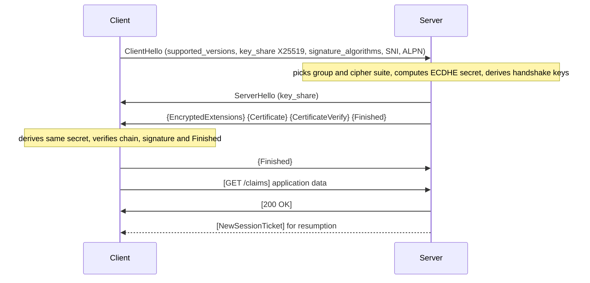
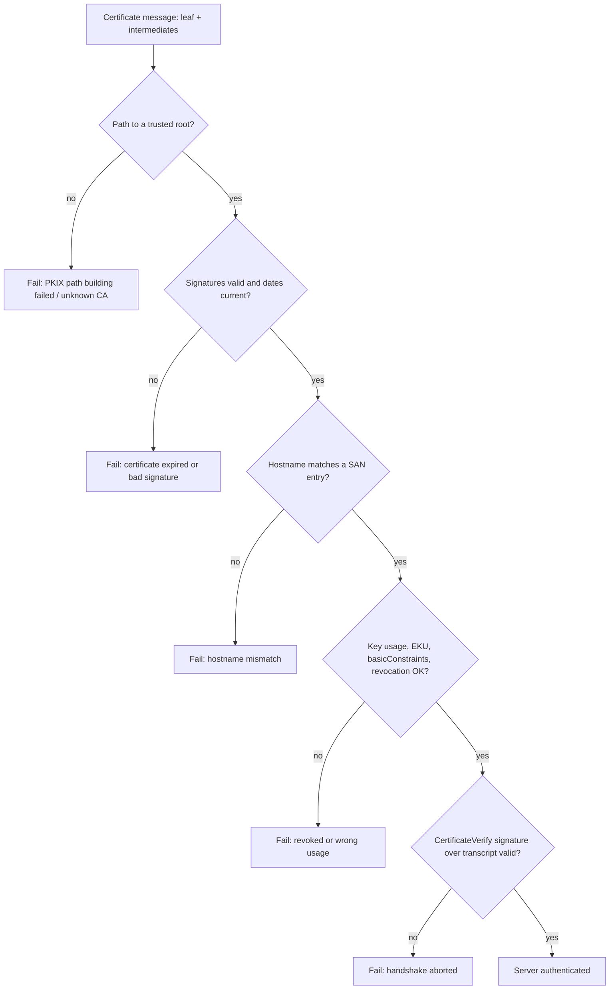
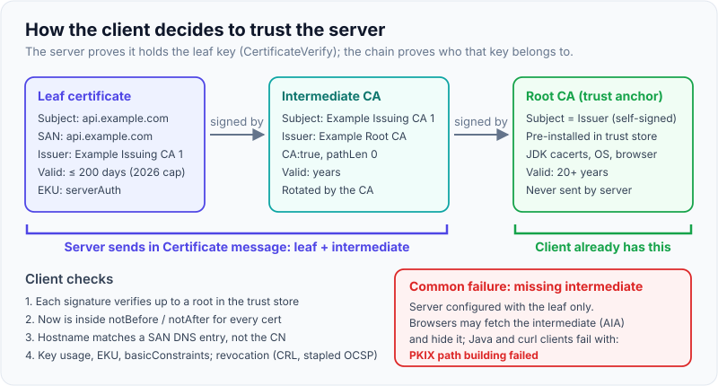
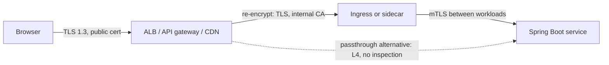

# TLS handshake

!!! abstract "Key takeaways"
    - The handshake does three jobs: **agree on fresh symmetric keys** (ephemeral (EC)DHE), **authenticate the server** (certificate chain + a signature over the handshake), and **confirm nobody tampered with the negotiation** (`Finished` MACs over the transcript). Bulk data is then protected with an AEAD cipher such as AES-GCM or ChaCha20-Poly1305.
    - **TLS 1.2 needs 2 round trips** before the first request; **TLS 1.3 needs 1**, because the client sends its key share in `ClientHello`. Resumed TLS 1.3 sessions can send **0-RTT early data**, which is **replayable**, so it must be limited to idempotent requests.
    - TLS 1.3 (RFC 8446, 2018) removed RSA key transport, static DH, CBC and RC4, SHA-1 signatures, compression and renegotiation. Every TLS 1.3 handshake has **forward secrecy**, and everything after `ServerHello` (including the certificate) is encrypted. TLS 1.0 and 1.1 are deprecated (RFC 8996).
    - The client trusts the server because the chain **leaf → intermediate → root** verifies to a root in its trust store, the dates are valid, and the hostname matches a **SAN** entry. The most common production failure is a **missing intermediate** (`PKIX path building failed` in Java).
    - In practice: TLS is usually terminated at the edge (ALB, API gateway, ingress) and re-established or replaced by **mTLS** inside the mesh; **connection reuse** matters more for latency than handshake tuning; and certificate lifetimes are shrinking (200 days from March 2026, 47 days by 2029), so rotation must be automated.

## Why it matters

Every HTTPS call, every OAuth2 token exchange, every Kafka or database connection with encryption in transit starts with a TLS handshake. TLS provides **confidentiality** (an eavesdropper sees ciphertext), **integrity** (tampering is detected) and **authentication** (you are talking to the holder of `api.example.com`'s private key, vouched for by a CA you trust). Bearer tokens such as OAuth2 access tokens and JWTs are only as safe as the TLS channel that carries them.

The history explains most interview questions. SSL 2.0 and 3.0 (Netscape, 1995–96) were broken; TLS 1.0 (1999) and 1.1 (2006) carried CBC and RC4 weaknesses (BEAST, POODLE-style padding oracles, RC4 biases); TLS 1.2 (RFC 5246, 2008) added AEAD ciphers and SHA-256 but kept many risky options. TLS 1.3 (RFC 8446, 2018) was a redesign: fewer options, faster handshake, encrypted certificates, forward secrecy always. RFC 8996 (2021) formally deprecated TLS 1.0 and 1.1, and the JDK disabled them by default from 8u291 / 11.0.11 / 16.

Interviewers use the topic to test whether you can explain the handshake step by step, reason about latency (round trips), and debug real failures: expired or incomplete certificate chains, hostname mismatches, protocol or cipher mismatches, and mTLS misconfiguration.

## Core concepts

### Building blocks

| Primitive | Role in TLS | TLS 1.3 examples |
|---|---|---|
| Key exchange | Two parties derive a shared secret over an open network | ECDHE with X25519 or P-256; hybrid post-quantum X25519MLKEM768 |
| Signatures | Server proves it owns the certificate's private key | ECDSA, RSA-PSS, Ed25519 |
| Certificates (X.509) | Bind a public key to a name, signed by a CA | Leaf, intermediate, root |
| Key derivation | Turn the shared secret into traffic keys | HKDF with SHA-256 or SHA-384 |
| AEAD cipher | Encrypt and authenticate every record | AES-128-GCM, AES-256-GCM, ChaCha20-Poly1305 |

Asymmetric crypto is slow, so it is used only in the handshake. The bulk of the traffic uses fast symmetric AEAD keys derived from the handshake.

### TLS 1.2: two round trips

In a TLS 1.2 full handshake the client sends `ClientHello` (random, cipher suites, extensions). The server replies with `ServerHello` (chosen suite), `Certificate`, `ServerKeyExchange` (its ephemeral ECDHE public key, signed with the certificate key) and `ServerHelloDone`. The client sends `ClientKeyExchange` (its ECDHE public key), `ChangeCipherSpec` and an encrypted `Finished`; the server answers with its own `ChangeCipherSpec` and `Finished`. Only then can the client send the HTTP request: **2 RTT** on top of the TCP handshake.

TLS 1.2 also allowed **RSA key transport**: the client encrypted the pre-master secret with the server's RSA public key. That has no forward secrecy: anyone who later obtains the server's private key (theft, legal order, a future break) can decrypt every recorded session. That is the main reason TLS 1.3 removed it.

### TLS 1.3: one round trip

TLS 1.3 saves a round trip by having the client **guess** the key exchange group and send a key share up front.


*Notice that only `ClientHello` and `ServerHello` travel in clear. Braces mark messages encrypted with handshake keys, brackets mark application traffic keys, and the request leaves after one round trip.*

Step by step:

1. **ClientHello**: a random value, cipher suites (only five are defined for 1.3, such as `TLS_AES_128_GCM_SHA256`), `supported_versions` (lists 1.3), `key_share` (an ECDHE public key for the client's preferred group), `signature_algorithms`, `server_name` (SNI) and `application_layer_protocol_negotiation` (ALPN, e.g. `h2`, `http/1.1`).
2. **ServerHello**: the server picks a version, suite and group, and returns its own `key_share`. Both sides can now compute the same ECDHE shared secret and derive **handshake traffic keys**. If the client guessed a group the server doesn't support, the server sends **HelloRetryRequest** and the handshake costs an extra round trip.
3. **EncryptedExtensions, Certificate, CertificateVerify, Finished**: all encrypted. `CertificateVerify` is a signature over the hash of the handshake transcript with the certificate's private key; it proves possession of the key and binds the certificate to *this* handshake. `Finished` is an HMAC over the transcript; it proves both sides saw the same messages, so a downgrade or tampering attempt is detected.
4. **Client Finished**: the client verifies the chain, the signature and the server's `Finished`, sends its own `Finished`, and can send application data immediately.

{ loading=lazy }
*Watch when the first green arrow (the HTTP request) leaves the client in each column: after 2, 1 and 0 round trips.*

### The key schedule (in one paragraph)

TLS 1.3 derives keys in stages with HKDF: an **Early Secret** (from a pre-shared key, or zeros), then a **Handshake Secret** (mixing in the ECDHE secret), then a **Master Secret**. Each stage produces separate client and server traffic secrets, derived together with the transcript hash, so keys are tied to exactly the messages exchanged. Because the ECDHE keys are ephemeral and discarded, stealing the server's certificate key later does not decrypt recorded traffic: **forward secrecy**.

### Downgrade and middlebox compatibility

For compatibility with middleboxes that choke on unknown versions, a TLS 1.3 `ClientHello` claims to be TLS 1.2 in its legacy version field and lists 1.3 in the `supported_versions` extension, and may send a dummy `ChangeCipherSpec`. To stop an attacker forcing a 1.2 handshake, a 1.3-capable server that negotiates 1.2 puts a fixed **downgrade sentinel** (`DOWNGRD` followed by `01`) in the last bytes of `ServerHello.random`; a 1.3 client that sees it aborts.

### Certificate validation: why the client trusts the server

The server sends its **leaf** certificate plus the **intermediate** CA certificate(s). The client builds a path to a **root** in its own trust store (the JDK `cacerts`, the OS store or the browser store) and checks:


*Notice that the chain only says whose key it is; `CertificateVerify` is what proves the server actually holds that key in this handshake.*

{ loading=lazy }
*The root is never sent: trust comes from what the client already has, not from what the server says.*

**Revocation** is the weak spot. CRLs are large, and OCSP leaks browsing to the CA and adds latency; OCSP stapling lets the server attach a fresh signed response. The industry is moving to **short-lived certificates** instead: Let's Encrypt shut down its OCSP service in August 2025 and relies on CRLs, and CA/Browser Forum ballot SC-081 cuts maximum public certificate lifetime to 200 days (March 2026), 100 days (March 2027) and 47 days (March 2029).

### SNI, ALPN and ECH

- **SNI** (Server Name Indication) puts the hostname in `ClientHello` so one IP can serve many certificates (virtual hosting, CDNs, ingress controllers). It is sent in clear, so on-path observers see which site you visit.
- **ALPN** lets the client offer `h2` and `http/1.1` and the server pick one inside the handshake, without an extra round trip. HTTP/2 over TLS requires ALPN; HTTP/3 runs TLS 1.3 inside QUIC.
- **ECH** (Encrypted Client Hello, RFC 9849) encrypts the real `ClientHello`, including SNI and ALPN, under a key published in DNS (HTTPS records), leaving only an outer, generic name visible.

### Resumption and 0-RTT

A full handshake costs CPU (signature, ECDHE) and a round trip. After a handshake the TLS 1.3 server sends `NewSessionTicket`; next time the client offers that **pre-shared key** (PSK) in `ClientHello` and skips certificate verification. With `psk_dhe_ke` it still does a fresh ECDHE exchange for forward secrecy. (TLS 1.2 had session IDs and session tickets for the same purpose.)

With **0-RTT**, the client also sends **early data** encrypted with keys derived from the PSK in its first flight. The cost: early data has **no protection against replay** across connections, and weaker forward secrecy. An attacker can't read it but can resend it.

{ loading=lazy }
*The attacker never decrypts anything; resending the same bytes is enough to repeat a non-idempotent action.*

Mitigations from RFC 8446 §8 and RFC 8470: accept early data only for **safe, idempotent** requests; use single-use tickets or a replay cache within a freshness window; forward the `Early-Data: 1` header to the origin, which can answer **`425 Too Early`** to make the client retry after the handshake completes.

### mTLS

In mutual TLS the server also sends `CertificateRequest`, and the client returns its own `Certificate` and `CertificateVerify`. The server now knows the caller's identity from a certificate instead of (or in addition to) a token. Service meshes (Istio, Linkerd) issue short-lived workload certificates (SPIFFE IDs) and do mTLS between sidecars automatically; banks and healthcare partners use mTLS for B2B APIs. OAuth2 can bind tokens to the client certificate (RFC 8705), so a stolen token is useless without the key.

### Where TLS terminates


*Notice that each hop is a separate TLS session with its own certificate and trust store. "Encrypted in transit" in a compliance audit means every hop, not only the internet-facing one.*

## In practice: code & configuration

The classic mistake is "fixing" a certificate error by trusting everything.

=== "❌ Common mistake"
    ```java
    // Copied from a forum to get past "PKIX path building failed".
    // Disables ALL server authentication: any on-path attacker can impersonate the upstream.
    TrustManager[] trustAll = { new X509TrustManager() {
        public void checkClientTrusted(X509Certificate[] c, String a) {}
        public void checkServerTrusted(X509Certificate[] c, String a) {}   // accepts anything
        public X509Certificate[] getAcceptedIssuers() { return new X509Certificate[0]; }
    }};
    SSLContext ctx = SSLContext.getInstance("TLS");
    ctx.init(null, trustAll, new SecureRandom());
    HttpsURLConnection.setDefaultHostnameVerifier((host, session) -> true); // and no hostname check
    ```

=== "✅ Correct approach"
    ```java
    // Java 21: trust the corporate root CA explicitly, keep hostname verification on.
    KeyStore trust = KeyStore.getInstance(KeyStore.getDefaultType());
    trust.load(null, null);
    try (var in = Files.newInputStream(Path.of("/etc/certs/corp-root-ca.pem"))) {
        var cf = CertificateFactory.getInstance("X.509");
        trust.setCertificateEntry("corp-root", cf.generateCertificate(in)); // add the ROOT, not the leaf
    }
    var tmf = TrustManagerFactory.getInstance(TrustManagerFactory.getDefaultAlgorithm());
    tmf.init(trust);
    SSLContext ctx = SSLContext.getInstance("TLS");
    ctx.init(null, tmf.getTrustManagers(), null);

    SSLParameters params = new SSLParameters();
    params.setProtocols(new String[] {"TLSv1.3", "TLSv1.2"});        // no 1.0 / 1.1
    HttpClient client = HttpClient.newBuilder()
            .sslContext(ctx)
            .sslParameters(params)
            .version(HttpClient.Version.HTTP_2)                      // ALPN negotiates h2
            .build();                                                // reuse this instance: pooled connections skip handshakes
    ```

In Spring Boot 3.1+ the same thing is configuration, using **SSL bundles** (PEM or JKS), which also cover mTLS and, from 3.2, hot reload of rotated server certificates:

```yaml
spring:
  ssl:
    bundle:
      pem:
        claims-upstream:                    # client side: trust the upstream's CA, present our cert for mTLS
          truststore:
            certificate: "file:/etc/certs/upstream-ca.pem"
          keystore:
            certificate: "file:/etc/certs/client.crt"
            private-key: "file:/etc/certs/client.key"
        server:
          keystore:
            certificate: "file:/etc/certs/server-fullchain.pem"   # leaf + intermediate
            private-key: "file:/etc/certs/server.key"
          truststore:
            certificate: "file:/etc/certs/clients-ca.pem"         # CA that issues caller certs (mTLS)
          options:
            enabled-protocols: TLSv1.3,TLSv1.2
          reload-on-update: true            # Tomcat/Netty pick up rotated files without a restart
server:
  ssl:
    bundle: server
    client-auth: need                       # mTLS: reject callers without a trusted client cert
```

```java
@Bean
RestClient claimsClient(RestClient.Builder builder, RestClientSsl ssl) {
    return builder.baseUrl("https://claims.internal.example.com")
            .apply(ssl.fromBundle("claims-upstream"))   // trust store + client cert from the bundle
            .build();
}
```

Debugging toolkit:

```bash
# What chain does the server send, what version and cipher are negotiated, which ALPN?
openssl s_client -connect api.example.com:443 -servername api.example.com -alpn h2 -showcerts </dev/null
# Force a version to test support
openssl s_client -connect api.example.com:443 -tls1_2 </dev/null
# Java side: log the handshake (very verbose)
java -Djavax.net.debug=ssl:handshake -jar app.jar
# Expiry date of the served leaf
echo | openssl s_client -connect api.example.com:443 -servername api.example.com 2>/dev/null | openssl x509 -noout -enddate
```

## Real-world usage

- **CDNs and browsers** turned on TLS 1.3 early; Cloudflare offers 0-RTT but only forwards early data for requests it considers safe and adds the `Early-Data` header so origins can refuse with 425.
- **Expired certificates** are a recurring outage cause: Microsoft Teams (February 2020) went down because an authentication certificate expired, and the expiry of the IdenTrust DST Root CA X3 in September 2021 broke older clients that didn't trust Let's Encrypt's newer ISRG Root X1. The US House report on the 2017 Equifax breach noted that an expired certificate on a traffic-inspection device let exfiltration go unnoticed for months.
- **Implementation bugs, not protocol bugs**, caused the most famous incident: Heartbleed (2014) was an OpenSSL buffer over-read in the heartbeat extension that leaked server memory, including private keys.
- **Post-quantum**: "harvest now, decrypt later" means today's recorded traffic could be decrypted by a future quantum computer. Browsers and Cloudflare already default to hybrid X25519MLKEM768 key exchange; in Java, JEP 527 adds it to `javax.net.ssl` in JDK 27, enabled by default. Java 21 and 25 LTS do not have it.
- **Healthcare and banking**: HIPAA's transmission-security safeguard and PCI DSS expect strong cryptography in transit (TLS 1.2+ in practice), and partner integrations (pharmacy networks, payment processors) commonly require mTLS with pinned partner CAs.

## Trade-offs & production gotchas

| Option | Pros | Cons | Use when |
|---|---|---|---|
| Terminate at the edge only | Simple, offloads CPU, enables L7 routing and WAF | Plaintext inside the VPC; fails "encrypt everywhere" audits | Low-sensitivity internal traffic, legacy |
| Terminate and re-encrypt | L7 features plus encryption on every hop | Two certificates and trust stores to manage | Default for regulated data (PHI, PCI) |
| TLS passthrough (L4) | End-to-end, the LB never sees plaintext | No path routing, header inspection or WAF at the LB | Strict end-to-end requirements, non-HTTP protocols |
| mTLS via service mesh | Workload identity, automatic rotation | Sidecar overhead, operational complexity | Many services, zero-trust networks |
| 0-RTT early data | Saves a round trip on resumed connections | Replayable; must be limited to idempotent requests | Static or read-only GETs at a CDN |
| RSA vs ECDSA certificates | RSA is universally supported | RSA-2048 signing is slower and bigger than ECDSA P-256 | ECDSA where all clients support it; dual certs otherwise |

!!! warning "Gotcha: missing intermediate"
    The server is configured with only the leaf certificate. Chrome on a laptop works (it may have the intermediate cached or fetch it via the AIA extension), but a Java service fails with `PKIX path building failed`. Always deploy the **full chain** (`fullchain.pem`) and test with `openssl s_client -showcerts` or a Java client, not only a browser.

!!! warning "Gotcha: handshakes on every request"
    Creating a new `HttpClient`, `RestTemplate` or `WebClient` per call, or disabling keep-alive, pays a TCP plus TLS handshake every time: CPU for the signature and ECDHE on both sides, and 2–3 round trips of latency. Reuse clients and connection pools; it is usually a bigger win than any TLS tuning.

!!! warning "Gotcha: trust store drift"
    A custom trust store set with `-Djavax.net.ssl.trustStore` **replaces** `cacerts` rather than adding to it, so public endpoints suddenly fail. Also: base images with old `cacerts` miss new roots, and pinning a leaf certificate breaks on every rotation. Pin CAs, not leaves, and keep the JDK updated.

!!! tip "Rotation is a process, not an event"
    With 200-day (and soon 47-day) certificates, rotation must be automated: ACME or AWS ACM for public certificates, cert-manager or the mesh CA inside Kubernetes, Spring Boot SSL bundle `reload-on-update` for the embedded server, and an alert on days-to-expiry for every endpoint you depend on.

## How this connects to my experience

- **Where I used it:** not a specific resume claim; position as transferable knowledge. The closest fits are **building secure enterprise APIs with OAuth2, PingFederate and Active Directory** on OptumRx Meteor (OAuth2 tokens are bearer credentials that rely on TLS between the React app, the GraphQL Consumer Service, PingFederate and the 5 upstream systems), and **CipherTrust Cloud Key Management** at Coriolis, where I worked with **AWS KMS, HSM integrations (Thales Luna, SafeNet) and automated key rotation**, the same key-management discipline that TLS certificates and private keys need.
- **Talking points:**
    - Why TLS 1.3 is faster (1-RTT, key share in `ClientHello`) and safer (forward secrecy by default, encrypted certificate), and why 0-RTT is only for idempotent reads.
    - How OAuth2 depends on TLS: tokens, client secrets and authorization codes travel over it; mTLS-bound tokens (RFC 8705) reduce the damage of a stolen token. Whether PingFederate or partner integrations used mTLS: *[confirm]*.
    - Where TLS terminated on the AWS side at Deloitte (API Gateway, ALB with ACM certificates, re-encryption to ECS/EKS): *[confirm the actual setup]*.
    - Key management from CCKM: rotating keys without downtime needs overlap (old and new both valid), which is exactly how certificate rotation and trust-store updates must work.
- **Likely follow-up chain:** "Walk me through a TLS 1.3 handshake" → `ClientHello` with key share, `ServerHello`, encrypted certificate, `CertificateVerify`, `Finished` → "What does `CertificateVerify` prove that the certificate doesn't?" → possession of the private key in this handshake → "A service starts failing with PKIX errors after a cert renewal. What do you check?" → full chain served, new intermediate, trust store contents, hostname/SAN, clock, using `openssl s_client` and `javax.net.debug`.

## Interview questions

### Fundamentals

??? question "Q1. What does TLS give you, and what happens in a TLS 1.3 handshake?"
    **Answer:** Confidentiality, integrity and server (optionally client) authentication. The client sends `ClientHello` with supported versions, cipher suites, an ECDHE key share, signature algorithms, SNI and ALPN. The server replies with `ServerHello` and its key share; both derive handshake keys from the ECDHE secret. The server then sends, encrypted, `EncryptedExtensions`, `Certificate`, `CertificateVerify` (a signature over the transcript) and `Finished` (an HMAC over the transcript). The client verifies the chain, signature and `Finished`, sends its own `Finished` and can send application data: one round trip.

    **Interviewer listens for:** key share in the first message, the role of `CertificateVerify` and `Finished`, what is encrypted, 1-RTT.

    **Common wrong answer:** "The client encrypts a session key with the server's public key." That is TLS 1.2 RSA key transport, removed in 1.3.

??? question "Q2. What are the main differences between TLS 1.2 and TLS 1.3?"
    **Answer:** 1.3 completes in 1-RTT instead of 2, supports 0-RTT resumption, encrypts everything after `ServerHello` including the certificate, and has only five AEAD cipher suites. It removed RSA key transport and static DH (so forward secrecy is mandatory), CBC and RC4, SHA-1 and MD5 signatures, compression, renegotiation and custom DHE groups. The cipher suite no longer names the key exchange or signature; those are negotiated separately. It uses HKDF for a cleaner key schedule and has built-in downgrade protection.

    **Interviewer listens for:** round trips, forward secrecy, removed options, encrypted certificate.

    **Common wrong answer:** "1.3 just has stronger ciphers."

??? question "Q3. How does a client decide to trust a server's certificate?"
    **Answer:** It builds a chain from the leaf through the intermediates the server sent to a root already in its trust store, checks each signature, validity dates, basic constraints and key usage, checks the requested hostname against the SAN entries, and, depending on the client, revocation via CRL or stapled OCSP. Then `CertificateVerify` proves the server holds the leaf's private key for this handshake.

    **Interviewer listens for:** trust anchors in the client, SAN not CN, possession proof.

    **Common wrong answer:** "The server sends the root certificate and the client checks it."

### Intermediate

??? question "Q4. What is forward secrecy and why did TLS 1.3 make it mandatory?"
    **Answer:** Forward secrecy means compromising the server's long-term private key later does not let an attacker decrypt traffic recorded earlier. It comes from ephemeral (EC)DHE: each session derives its secret from throwaway key pairs that are discarded. With RSA key transport the session secret was encrypted to the long-term RSA key, so one key leak decrypted every recorded session. TLS 1.3 removed RSA key transport and static DH, so every handshake is ephemeral.

    **Interviewer listens for:** ephemeral keys, recorded traffic, the RSA key transport contrast.

    **Common wrong answer:** "Forward secrecy means keys are rotated regularly."

??? question "Q5. What are SNI and ALPN, and why do they matter for a Kubernetes ingress or HTTP/2?"
    **Answer:** SNI carries the hostname in `ClientHello` so a single IP and port can present the right certificate for many hosts; ingress controllers and CDNs route on it. ALPN lets client and server agree on the application protocol (`h2` or `http/1.1`) during the handshake; HTTP/2 over TLS requires it. A client that omits SNI typically gets the default certificate and a hostname mismatch. SNI is visible to observers; ECH (RFC 9849) encrypts it.

    **Interviewer listens for:** virtual hosting, protocol negotiation without an extra round trip, privacy of SNI.

    **Common wrong answer:** "SNI is part of the HTTP Host header."

??? question "Q6. How does session resumption work, and what is the risk of 0-RTT?"
    **Answer:** After a handshake the server issues a session ticket (a PSK). On reconnect the client offers it, skipping certificate verification, usually still doing ECDHE (`psk_dhe_ke`) for forward secrecy. With 0-RTT the client also sends early data encrypted under the PSK in its first flight. Early data can be replayed by an attacker who recorded it, so servers accept it only for idempotent requests, use single-use tickets or replay caches, and can reply `425 Too Early` (RFC 8470) to force a retry after the handshake.

    **Interviewer listens for:** PSK, replay, idempotency, 425.

    **Common wrong answer:** "0-RTT is just a faster handshake with no downside."

??? question "Q7. mTLS or OAuth2 tokens for service-to-service authentication?"
    **Answer:** They answer different questions and are often combined. mTLS authenticates the calling workload at the connection level, with no secrets in headers, and a mesh can automate it with short-lived certificates. OAuth2 tokens carry user or client identity, scopes and claims through multiple hops and work through TLS-terminating proxies. Certificate-bound tokens (RFC 8705) combine them so a stolen token is useless without the private key. For B2B partner APIs in banking or healthcare, mTLS plus OAuth2 is common.

    **Interviewer listens for:** connection vs request identity, proxies, combining both.

    **Common wrong answer:** "mTLS replaces authorisation."

### Senior

??? question "Q8. Where would you terminate TLS for a regulated (PHI or PCI) workload on AWS or Kubernetes?"
    **Answer:** Terminate the public certificate at the edge (CloudFront, ALB or API Gateway with ACM) to get WAF and L7 routing, then **re-encrypt** to the ingress or pods with certificates from an internal CA, and use mTLS between services, ideally via a mesh with automated rotation. Use passthrough only when the LB must never see plaintext and you can give up L7 features. Enforce TLS 1.2+ policies, alert on certificate expiry, and remember the edge is where tokens become visible in logs, so scrub headers.

    **Interviewer listens for:** every hop encrypted, trade-off with L7 inspection, rotation, policy.

    **Common wrong answer:** "TLS at the load balancer is enough because the VPC is private."

??? question "Q9. What is the post-quantum concern for TLS and what is being done?"
    **Answer:** A large quantum computer could break ECDHE and RSA. Signatures only need to be safe at handshake time, but key exchange must hold for as long as the recorded traffic must stay secret ("harvest now, decrypt later"). The answer so far is **hybrid key exchange**: combine X25519 with ML-KEM-768 (`X25519MLKEM768`) so the session is safe if either holds. Browsers and major CDNs use it by default; JDK 27 enables it in `javax.net.ssl` (JEP 527). Post-quantum certificates are further off because of their size.

    **Interviewer listens for:** key exchange first, hybrid, harvest-now-decrypt-later.

    **Common wrong answer:** "Just use AES-256 and you're quantum-safe."

### Scenario-based

??? question "Q10. After a certificate renewal, Java clients fail with `PKIX path building failed` but browsers work. How do you debug it?"
    **Answer:** Run `openssl s_client -connect host:443 -servername host -showcerts` and check whether the server sends the intermediate; a renewal that deployed only the leaf (or a new CA intermediate that isn't in the bundle) is the usual cause, and browsers hide it via cached intermediates or AIA fetching. Then check the Java trust store actually contains the root (custom `-Djavax.net.ssl.trustStore` replaces `cacerts`, old base images miss new roots), the hostname is in the SAN, and the client's clock. `-Djavax.net.debug=ssl:handshake` shows the received chain. Fix by deploying the full chain; never by trust-all code.

    **Interviewer listens for:** full chain, trust store contents, browsers vs Java, tools.

    **Common wrong answer:** "Import the server's leaf certificate into cacerts", which breaks again at the next renewal.

??? question "Q11. p99 latency between two internal services is high, and traces show long connection setup. What do you look at?"
    **Answer:** Check whether a new TLS handshake happens per request: clients created per call, keep-alive disabled, idle timeouts on the LB shorter than the client pool's, or HTTP/1.1 pools too small so new connections open under load. Each new connection adds TCP plus TLS round trips and asymmetric CPU on both sides. Fix by reusing clients and pools, aligning idle timeouts, enabling HTTP/2 via ALPN to multiplex, and making sure resumption works across LB nodes (shared ticket keys). Only after that consider ECDSA certificates or 0-RTT for reads.

    **Interviewer listens for:** connection reuse first, timeouts, HTTP/2, resumption.

    **Common wrong answer:** "Turn off TLS internally."

## Cheat sheet

| Concept | Remember |
|---|---|
| Goals | Confidentiality, integrity, authentication |
| TLS 1.2 | 2 RTT; RSA key transport allowed (no forward secrecy) |
| TLS 1.3 | 1 RTT; key share in `ClientHello`; certificate encrypted; ECDHE always |
| 0-RTT | Early data under a PSK; replayable; idempotent only; `425 Too Early` |
| `CertificateVerify` | Signature over the transcript: proves possession of the key |
| `Finished` | HMAC over the transcript: detects tampering and downgrade |
| Chain | Leaf + intermediates sent; root from the client trust store; hostname in SAN |
| SNI / ALPN / ECH | Hostname / protocol (`h2`) / encrypted ClientHello (RFC 9849) |
| mTLS | Server sends `CertificateRequest`; client proves its identity |
| Lifetimes | 200 days (2026) → 100 (2027) → 47 (2029); automate rotation |
| Java | TLS 1.3 since JDK 11; 1.0/1.1 disabled by default; PQ hybrid in JDK 27 |
| Debug | `openssl s_client -servername -showcerts`, `-Djavax.net.debug=ssl:handshake` |

## Sources
1. [RFC 8446: The Transport Layer Security (TLS) Protocol Version 1.3](https://www.rfc-editor.org/rfc/rfc8446): handshake messages, key schedule, downgrade sentinel, 0-RTT and replay (§2.3, §4, §7, §8, Appendix D).
2. [RFC 5246: TLS 1.2](https://www.rfc-editor.org/rfc/rfc5246): the 2-RTT full handshake and RSA key exchange.
3. [RFC 8996: Deprecating TLS 1.0 and TLS 1.1](https://www.rfc-editor.org/rfc/rfc8996): formal deprecation.
4. [RFC 8470: Using Early Data in HTTP](https://www.rfc-editor.org/rfc/rfc8470): `Early-Data` header and `425 Too Early`.
5. [RFC 9849: TLS Encrypted Client Hello](https://www.rfc-editor.org/rfc/rfc9849): ECH and what plaintext SNI leaks.
6. [RFC 8705: OAuth 2.0 Mutual-TLS Client Authentication and Certificate-Bound Access Tokens](https://www.rfc-editor.org/rfc/rfc8705): mTLS-bound tokens.
7. [JEP 332: Transport Layer Security (TLS) 1.3](https://openjdk.org/jeps/332) and [JEP 527: Post-Quantum Hybrid Key Exchange for TLS 1.3](https://openjdk.org/jeps/527): Java support for TLS 1.3 (JDK 11) and X25519MLKEM768 (JDK 27).
8. [Spring Boot reference: SSL bundles](https://docs.spring.io/spring-boot/reference/features/ssl.html): PEM/JKS bundles, `reload-on-update`, `RestClientSsl`.
9. [Let's Encrypt: Ending OCSP Support in 2025](https://letsencrypt.org/2024/12/05/ending-ocsp/): the move from OCSP to CRLs and short-lived certificates.
10. [CA/Browser Forum Ballot SC-081v3](https://cabforum.org/2025/04/11/ballot-sc081v3-introduce-schedule-of-reducing-validity-and-data-reuse-periods/): 200 / 100 / 47-day certificate lifetime schedule.
11. [Cloudflare: Introducing Zero Round Trip Time Resumption (0-RTT)](https://blog.cloudflare.com/introducing-0-rtt/): 0-RTT in production and replay handling.
12. [The Illustrated TLS 1.3 Connection](https://tls13.xargs.org/): byte-by-byte walkthrough of a real handshake.
