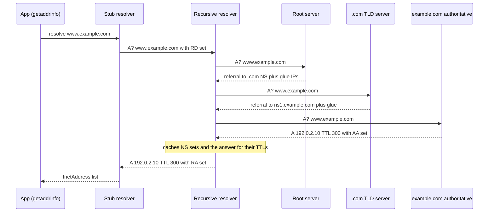
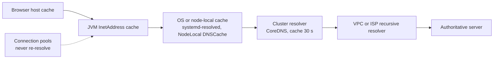

# DNS Resolution

!!! abstract "Key takeaways"
    - DNS is a **distributed, cached, hierarchical database**. Your app asks a **stub resolver** (libc, the JVM), which asks a **recursive resolver** (CoreDNS, Route 53 Resolver, 8.8.8.8), which walks **root → TLD → authoritative** servers and caches every answer for its **TTL**.
    - Queries go over **UDP port 53** by default; big responses set the **TC** (truncated) bit and the client retries over **TCP**. **EDNS(0)** raises the UDP size limit beyond the original 512 bytes.
    - There is no "propagation". A change becomes visible when **every cache in the path** (browser, OS, JVM, CoreDNS, recursive resolver) has let the old answer expire. Worst-case staleness is the **sum of what each layer adds**, and long-lived connections ignore DNS entirely.
    - The JVM caches lookups itself: `networkaddress.cache.ttl` (about **30 s** by default without a security manager; `-1` means forever) and `networkaddress.cache.negative.ttl` (**10 s**). JDK 21 adds `networkaddress.cache.stale.ttl` to keep serving the old answer when the resolver is down.
    - In Kubernetes, **`ndots:5`** plus search domains turns one external lookup like `api.stripe.com` into several NXDOMAIN queries first. Use a trailing dot, a lower `ndots`, or NodeLocal DNSCache. DNS is a frequent root cause of large outages (Dyn 2016, Facebook 2021, AWS us-east-1 2025).

## Why it matters

Every network call starts with a name. Before ARPANET switched to DNS, every host downloaded a single `HOSTS.TXT` file from a central server; that didn't scale, so Paul Mockapetris designed DNS (RFC 882/883 in 1983, replaced by RFC 1034/1035 in 1987) as a delegated hierarchy where each organisation runs its own part of the namespace and everyone caches.

It shows up in interviews in three ways:

- **"What happens when you type a URL"**: DNS is step one; see [the full walk-through](06-what-happens-when-you-type-a-url.md).
- **Failover and load balancing**: blue/green cut-overs, RDS Multi-AZ failover and multi-region active/passive all move traffic by changing DNS answers, and caches decide how fast that really happens.
- **Debugging**: "it works on my laptop but not in the pod", 5-second latency spikes, a DNS change that "didn't take", a database failover that took 30 minutes for one service. These are DNS caching and resolver-configuration problems.

## Core concepts

### The four roles

| Role | What it does | Examples |
|---|---|---|
| **Stub resolver** | Library in the client. Reads `/etc/hosts` and `/etc/resolv.conf`, sends one *recursive* query, waits | glibc `getaddrinfo`, musl, Java `InetAddress`, Netty's resolver |
| **Recursive resolver** (caching resolver) | Does the walk on the client's behalf, caches results, returns the final answer | CoreDNS / kube-dns, Route 53 Resolver (VPC `.2` address), ISP resolvers, 8.8.8.8, 1.1.1.1, systemd-resolved (local cache) |
| **Authoritative server** | Holds the zone data and answers with the **AA** flag; never recurses | Route 53 hosted zones, Azure DNS, Cloudflare, your own BIND |
| **Root and TLD servers** | Authoritative for `.` and for `com`, `org`, `in`... They only return **referrals** (NS records) to the next level down | `a`–`m.root-servers.net`; Verisign for `.com` |

The root is 13 named server identities (A to M) run by 12 operators, but each is **anycast** from many sites: root-servers.org counted about 2,000 instances by late 2025. Public resolvers like 8.8.8.8 and 1.1.1.1 are also anycast, so "the" server you reach is the nearest instance.

### Recursive vs iterative queries

The stub sets the **RD** (recursion desired) bit and expects a final answer. The recursive resolver then asks *iteratively*: each server it contacts returns either the answer or a referral ("I don't know, ask these name servers"). Walking `www.example.com` with an empty cache:


*Notice that only the recursive resolver walks the tree; the client sends one query. On a warm cache the resolver skips straight to the step it still has cached (the `.com` NS set has a 2-day TTL, so root queries are rare).*

{ loading=lazy }
*Watch the second lookup: once the resolver has cached the answer, the whole walk collapses into one round trip until the TTL runs out.*

**Glue records** break the chicken-and-egg problem: if `example.com` is served by `ns1.example.com`, the `.com` server includes `ns1`'s IP address in the referral, otherwise the resolver would need to resolve `example.com` to find out how to resolve `example.com`.

**QNAME minimisation** (RFC 9156) makes modern resolvers send only the next label to each level (`com` to the root, `example.com` to the TLD) instead of the full name, so root and TLD operators learn less about what you browse.

### The wire protocol in one paragraph

A DNS message is a 12-byte header (16-bit ID; flags **QR**, **AA**, **TC**, **RD**, **RA**; a response code), then question, answer, authority and additional sections. It runs over **UDP port 53**; the original limit for a UDP message was 512 bytes (RFC 1035). **EDNS(0)** (RFC 6891) lets a client advertise a bigger buffer; since DNS Flag Day 2020 the recommended size is 1,232 bytes to avoid IP fragmentation. If an answer doesn't fit, the server sets **TC** and the client retries over **TCP port 53**, which every server must support (RFC 7766). Zone transfers (AXFR/IXFR) also use TCP.

Response codes worth knowing: **NOERROR** (answer may still be empty, called NODATA, for example an AAAA query for an IPv4-only name), **NXDOMAIN** (the name doesn't exist), **SERVFAIL** (the resolver couldn't get an answer, often an unreachable authoritative or a DNSSEC validation failure) and **REFUSED**.

### Record types you'll be asked about

| Type | Holds | Notes |
|---|---|---|
| `A` / `AAAA` | IPv4 / IPv6 address | Several records = client-side round robin |
| `CNAME` | Alias to another name | Resolver follows the chain. **Not allowed at the zone apex** and can't coexist with other records at the same name |
| `ALIAS` / Route 53 *alias* | Provider-side alias, answered as `A`/`AAAA` | Vendor feature (not a standard type) that solves "point `example.com` at a load balancer" |
| `NS` | Name servers for a zone | Delegation; must match at parent and child |
| `SOA` | Zone metadata: primary server, serial, timers, negative TTL | The `MINIMUM` field drives negative caching |
| `MX` | Mail exchangers with priority | |
| `TXT` | Free text | SPF, DKIM, DMARC, domain-ownership proofs (ACM, Google) |
| `SRV` | Host and port for a service | `_ldap._tcp.example.com`; Kubernetes named ports |
| `PTR` | Reverse lookup (IP → name) | `in-addr.arpa` / `ip6.arpa` |
| `CAA` | Which CAs may issue certificates | Checked by CAs before issuing; see [TLS handshake](03-tls-handshake.md) |
| `HTTPS` / `SVCB` | Endpoint hints: ALPN (`h2`, `h3`), IP hints, ECH keys | RFC 9460; lets a browser try HTTP/3 on the first connection |

### TTLs and caching at every layer

Each record carries a **TTL** in seconds. A cache counts it down and serves the record until it reaches zero, then asks again. Negative answers are cached too (RFC 2308): an NXDOMAIN is cached for the smaller of the SOA record's TTL and its `MINIMUM` field, so querying a name *before* you create it can hide the new record for that long.

The catch is that there are several caches in series, each with its own rules:


*Notice that each hop may hold the old answer for up to its own TTL (or longer if it ignores TTLs), and an open pooled connection doesn't look at DNS at all. The effective cut-over time is the sum, not the record TTL.*

So "DNS propagation" is a misnomer: nothing is pushed. A change is visible to a client when every cache between it and the authoritative server has expired the old value.

{ loading=lazy }
*The record TTL is only the first layer. Look at which clients are still on the old IP long after "the DNS change".*

### The JVM's own DNS cache

`InetAddress.getByName()` calls the OS resolver (`getaddrinfo`) through the JDK's built-in resolver, but caches results inside the JVM, controlled by **security properties** (set in `$JAVA_HOME/conf/security/java.security` or with `Security.setProperty` before the first lookup):

| Property | Default | Meaning |
|---|---|---|
| `networkaddress.cache.ttl` | Not set → **30 s** (implementation-specific); **forever** when a security manager is installed | `-1` caches forever, `0` disables caching. Ignores the record's real TTL |
| `networkaddress.cache.negative.ttl` | **10 s** | How long a failed lookup is cached |
| `networkaddress.cache.stale.ttl` (JDK 21+) | Not set (off) | Keep serving an expired answer for this long if re-resolution fails; `cache.ttl` becomes the refresh interval |
| `sun.net.inetaddr.ttl` | | Legacy system-property equivalent of `cache.ttl` |

Two facts interviewers like: the JVM cache **ignores the record's TTL** (it uses its own fixed value), and very old guidance to "cache forever" came from the security-manager default, which is why AWS documents setting the JVM TTL to **60 seconds or less** for services behind ELB or RDS endpoints. Java 18 added an **`InetAddressResolverProvider` SPI** (JEP 418) for plugging in a custom resolver, and Reactor Netty (`WebClient`) uses Netty's own asynchronous DNS resolver with separate cache settings, so `networkaddress.cache.ttl` doesn't govern it.

### The stub resolver and Kubernetes `ndots`

On Linux, `/etc/nsswitch.conf` (`hosts: files dns`) says to check `/etc/hosts` before DNS, and `/etc/resolv.conf` configures the stub: up to three `nameserver` lines, `search` domains, and `options` such as `timeout:5` (seconds per try, the glibc default), `attempts:2` and `ndots:1`.

**`ndots:n`** means "if the name has fewer than n dots, try it with each search domain appended before trying it as-is". A Kubernetes pod gets:

```text
nameserver 10.96.0.10                      # the kube-dns ClusterIP (CoreDNS)
search payments.svc.cluster.local svc.cluster.local cluster.local ec2.internal
options ndots:5
```

That's what makes `orders` and `orders.payments` work. But `api.stripe.com` has only 2 dots, so the stub first tries `api.stripe.com.payments.svc.cluster.local`, then `...svc.cluster.local`, `...cluster.local`, `...ec2.internal`, each for **A and AAAA**, collecting NXDOMAINs before the real query. That's up to 10 queries for one name. The [Kubernetes networking page](../docker-kubernetes/04-services-ingress-and-networking.md#dns) covers the related conntrack race that causes 5-second DNS timeouts.

{ loading=lazy }
*Count the red rows: every external lookup from a pod with default settings pays for the search list first.*

### DNS for load balancing and failover

- **Round robin:** several `A` records; resolvers and clients rotate or pick. It spreads load coarsely but knows nothing about health or load, and clients cache their pick.
- **Health-checked answers:** Route 53, Azure Traffic Manager and Cloudflare remove unhealthy endpoints from answers (failover, weighted, latency-based, geolocation policies). See [Route 53 on the AWS networking page](../aws/09-networking-vpc-subnets-security-groups-vs-nacls-route-53-clo.md#route-53).
- **GeoDNS and CDNs:** the authoritative server picks an edge close to the **resolver**. **EDNS Client Subnet** (RFC 7871) passes a truncated client subnet so the answer matches the user, not the resolver's location.
- **Happy Eyeballs v2** (RFC 8305): clients query `AAAA` and `A` in parallel and race IPv6 and IPv4 connections, so a broken IPv6 path costs ~250 ms, not a timeout.

DNS steers **new** connections at coarse granularity. For per-request balancing and fast health ejection, you need an L4/L7 load balancer behind the name; see [load balancers, reverse proxies and CDNs](05-load-balancers-reverse-proxies-and-cdns.md).

### Security

| Threat | What happens | Defence |
|---|---|---|
| **Cache poisoning** (Kaminsky, 2008) | Attacker floods a resolver with forged responses, guessing the 16-bit query ID, to plant a fake record | Source-port randomisation (RFC 5452), 0x20 case randomisation, **DNSSEC** validation |
| On-path snooping / tampering | Plain DNS is unencrypted; anyone on the path sees and can alter queries | **DoT** (RFC 7858, TCP 853), **DoH** (RFC 8484, HTTPS 443), DoQ |
| Dangling CNAME / subdomain takeover | `promo.example.com CNAME old-bucket.s3...` survives after the bucket is deleted; an attacker re-creates it | Remove DNS records before deleting the resource; audit CNAMEs |
| DNS rebinding | A malicious name flips to `127.0.0.1` or an internal IP after the page loads | Validate the `Host` header, bind admin endpoints to localhost with auth |
| Exfiltration / C2 over DNS | Data encoded in query names to an attacker's zone | Route 53 Resolver DNS Firewall, egress resolver logging |

**DNSSEC** (RFC 4033–4035) signs records (`RRSIG`, `DNSKEY`, chain of trust via `DS` records up to the root). It gives **authenticity and integrity, not confidentiality**; DoH/DoT give confidentiality to the resolver, not authenticity of the data. They are complementary.

## In practice: code & configuration

=== "❌ Common mistake"
    ```java
    // 1. Caching forever "for performance" (or inheriting it from an old java.security)
    //    -> after an RDS Multi-AZ failover or ALB IP change, this JVM keeps the dead IP
    //       until it restarts.
    java.security.Security.setProperty("networkaddress.cache.ttl", "-1");

    // 2. Resolving once at startup and pinning the IP
    InetAddress ledger = InetAddress.getByName("ledger.internal.example.com");
    var client = HttpClient.newHttpClient();
    var request = HttpRequest.newBuilder(
            URI.create("https://" + ledger.getHostAddress() + "/api/v1/balance")) // TLS SNI and cert check now break too
        .build();

    // 3. A pool whose connections live forever: DNS changes never reach it
    //    spring.datasource.hikari.max-lifetime: 0   (0 = infinite)
    ```

=== "✅ Correct approach"
    ```java
    public static void main(String[] args) {
        // Set before the first lookup: refresh every 30 s, but if the resolver is down,
        // keep using the last good answer for up to 10 minutes (JDK 21+).
        Security.setProperty("networkaddress.cache.ttl", "30");
        Security.setProperty("networkaddress.cache.stale.ttl", "600");
        Security.setProperty("networkaddress.cache.negative.ttl", "5"); // don't pin NXDOMAIN for long
        SpringApplication.run(App.class, args);
    }

    // Always connect by name: SNI, certificate validation and DNS failover keep working.
    var request = HttpRequest.newBuilder(URI.create("https://ledger.internal.example.com/api/v1/balance")).build();
    ```
    ```yaml
    # application.yml: recycle pooled DB connections so they re-resolve after a failover
    spring:
      datasource:
        hikari:
          max-lifetime: 600000        # 10 min, below any LB or DB idle cut-off
          keepalive-time: 120000
    ```

Kubernetes: lower `ndots` for pods that mostly call external names, or use FQDNs with a trailing dot:

```yaml
apiVersion: apps/v1
kind: Deployment
metadata:
  name: payments-gateway
spec:
  template:
    spec:
      dnsConfig:
        options:
          - name: ndots
            value: "2"          # names with 2+ dots (api.stripe.com) go out as-is first
          - name: single-request-reopen   # glibc: avoid the parallel A/AAAA conntrack race
      containers:
        - name: app
          image: registry.example.com/payments-gateway:1.8.0
          env:
            - name: STRIPE_HOST
              value: "api.stripe.com."   # trailing dot = absolute name, no search list
```

Debugging toolkit:

```bash
dig +trace www.example.com            # do the root -> TLD -> authoritative walk yourself
dig @8.8.8.8 api.example.com A +noall +answer   # what a public resolver has cached (TTL counts down)
dig api.example.com AAAA              # NOERROR with no answer = NODATA
dig -x 10.0.12.7                       # reverse (PTR) lookup
getent hosts orders                    # what the libc stub returns (includes /etc/hosts, search list)
kubectl exec -it deploy/orders -- cat /etc/resolv.conf
```

`nslookup` and `dig` bypass `/etc/hosts` and `nsswitch.conf`; `getent hosts` shows what an application using `getaddrinfo` sees.

## Real-world usage

- **Dyn, 21 October 2016:** a Mirai-botnet DDoS against the managed DNS provider Dyn made Twitter, GitHub, Netflix, Reddit and others unreachable for hours in parts of the world, even though their own servers were up. Lesson: authoritative DNS is a dependency; large sites now use **two DNS providers**.
- **Facebook, 4 October 2021:** a maintenance command disconnected Facebook's backbone. Its authoritative DNS servers, built to stop advertising their BGP routes when they can't reach the data centres, withdrew themselves, so `facebook.com` stopped resolving worldwide for about six hours. The resulting retry storm also loaded public resolvers.
- **AWS us-east-1, 19–20 October 2025:** a latent race condition in DynamoDB's automated DNS management left the regional endpoint `dynamodb.us-east-1.amazonaws.com` with an empty record. Clients couldn't resolve DynamoDB, and the impact cascaded into EC2 launches, load balancers and many AWS services; the DNS fix itself took about 2.5 hours but recovery of dependent systems took most of the day.
- **Slack, September 2021:** a DNSSEC rollout went wrong and some users' validating resolvers returned SERVFAIL for `slack.com` for up to a day, partly because of cached negative and DS records. DNSSEC adds a failure mode that plain DNS doesn't have.
- **Healthcare and banking:** private hosted zones and split-horizon DNS (internal names resolve only inside the VPC, or from on-premises via Route 53 Resolver endpoints) keep internal APIs off the internet; DNS query logs are an exfiltration control.

## Trade-offs & production gotchas

| Option | Pros | Cons | Use when |
|---|---|---|---|
| Short TTL (30–60 s) | Fast failover and cut-over | More queries, more resolver load and latency; more exposed if DNS fails | Endpoints that fail over (DB writers, regional entry points) |
| Long TTL (hours to a day) | Fewer lookups, survives a DNS outage longer | Changes take hours; can't steer traffic quickly | Stable records: MX, NS, verification TXT |
| DNS-based load balancing | Global, no extra hop, cheap | Coarse, cached, health lag, clients pick badly | Region or edge selection, in front of real LBs |
| L4/L7 load balancer behind one name | Per-request balancing, fast ejection | Extra hop and cost | Inside a region or cluster |
| JVM `cache.stale.ttl` | Rides out resolver outages | May keep a genuinely retired IP longer | JDK 21+, endpoints whose IPs rarely change |
| NodeLocal DNSCache | Lower latency, avoids conntrack race, less CoreDNS load | Another component per node | Larger clusters, DNS-heavy workloads |

!!! warning "Gotcha: lowering the TTL on the day of the migration"
    Resolvers already cached the record with the **old** TTL. Lower it at least one old-TTL period **before** the cut-over (e.g. from 86,400 s to 60 s, a day ahead), switch, then raise it again afterwards.

!!! warning "Gotcha: connections outlive DNS"
    A DNS change affects only **new** connections. HTTP keep-alive pools, HikariCP, Kafka clients and gRPC channels holding connections to the old IP keep using them until they're closed. Set a max connection lifetime, and for gRPC configure `MAX_CONNECTION_AGE` on the server so clients reconnect and re-resolve.

## How this connects to my experience

- **Where I used it:** not a resume claim, so I'd position it as working knowledge from the platforms I've built on. The closest touchpoints are **Kubernetes (EKS/AKS)**, where service-to-service calls in the OptumRx Meteor microservices go through CoreDNS names, and the **AWS microservices at Deloitte** (ECS, EKS, API Gateway, RDS), where load balancer and RDS endpoints are DNS names whose IPs change.
- **Talking points:**
    - The GraphQL Consumer Service calls **5 upstream systems** by hostname, so DNS lookup time and caching sit on the critical path of every new connection; connection pooling and keep-alive are what keep DNS out of the per-request path *[confirm the HTTP client and pool settings used]*.
    - On AWS, I'd explain why the JVM DNS TTL matters for **RDS failover** and ALB IP changes, and how pooled connections must be recycled to follow a failover *[confirm whether RDS Multi-AZ was used and any failover tests]*.
    - At Coriolis, the **CCKM** product talked to AWS KMS, Azure Key Vault and GCP KMS endpoints, all resolved by regional DNS names; private endpoints change what those names resolve to inside a VPC *[confirm whether private endpoints were used]*.
- **Likely follow-up chain:** "Walk me through DNS resolution" → stub, recursive, root → TLD → authoritative, caching and TTL → "We changed a record and some services still hit the old IP" → JVM cache, CoreDNS cache, pooled connections, TTL lowered too late → "How would you design failover for a regional API?" → health-checked DNS failover with a short TTL in front of regional load balancers, plus client connection lifetimes and retries with backoff, and a second DNS provider if DNS itself is a single point of failure.

## Interview questions

### Fundamentals

??? question "Q1. Walk me through how `www.example.com` is resolved with empty caches."
    **Answer:** The application calls the stub resolver (`getaddrinfo` or `InetAddress`), which checks `/etc/hosts` and then sends a recursive query (RD bit) over UDP 53 to the configured recursive resolver. The resolver starts at a root server from its root hints, which returns a referral to the `.com` name servers with glue addresses. The `.com` server returns a referral to `example.com`'s name servers. The authoritative server returns the `A` record with the AA bit and a TTL. The resolver caches every step for its TTL and returns the answer; the stub (and the JVM) may cache it too.

    **Interviewer listens for:** stub vs recursive vs authoritative, referrals, glue, caching at each step, UDP 53.

    **Common wrong answer:** "The browser asks the root server, which knows every IP address."

??? question "Q2. What's the difference between a CNAME and an A record, and why can't you put a CNAME at the zone apex?"
    **Answer:** An `A` record maps a name to an IPv4 address; a `CNAME` says "this name is an alias of that name" and the resolver restarts the lookup at the target. A CNAME can't coexist with other records at the same name, and the apex must have `SOA` and `NS`, so a CNAME there is illegal. Provider alias records (Route 53 alias, CNAME flattening) resolve the target server-side and answer with `A`/`AAAA`.

    **Interviewer listens for:** CNAME exclusivity rule, SOA/NS at apex, provider alias records.

    **Common wrong answer:** "CNAME is slower so it's not allowed."

??? question "Q3. Does DNS use UDP or TCP?"
    **Answer:** Both. Normal queries use UDP 53 for speed (one packet each way, no handshake). If the answer exceeds the UDP size (512 bytes originally, larger with EDNS(0), ~1,232 bytes recommended), the server sets the TC bit and the client retries over TCP 53. Zone transfers use TCP, and RFC 7766 requires TCP support. DoT uses TCP 853 and DoH uses HTTPS on 443.

    **Interviewer listens for:** TC bit fallback, EDNS(0), TCP mandatory, encrypted transports.

    **Common wrong answer:** "Only UDP; TCP is just for zone transfers."

### Intermediate

??? question "Q4. You changed a DNS record with a 300 s TTL an hour ago and some services still hit the old IP. Why?"
    **Answer:** Something in their path isn't honouring the record TTL or isn't looking at DNS. Candidates: the JVM `InetAddress` cache set to forever (`networkaddress.cache.ttl=-1`, or a security manager default); pooled or keep-alive connections that were opened before the change and never closed (HikariCP, HTTP clients, gRPC channels); an IP pinned in config; a misbehaving intermediate resolver; or, if the TTL was reduced only at change time, resolvers that cached the old, longer TTL. I'd check with `dig` against the resolver the pod uses, `getent hosts` inside the container, and the client's connection table.

    **Interviewer listens for:** layered caches, JVM cache, long-lived connections, TTL-lowering timing.

    **Common wrong answer:** "DNS takes 24–48 hours to propagate."

??? question "Q5. How does the JVM cache DNS, and what would you configure for a Spring Boot service on AWS?"
    **Answer:** `InetAddress` keeps its own cache governed by security properties: `networkaddress.cache.ttl` (about 30 s by default if unset and no security manager; forever with a security manager or `-1`), and `networkaddress.cache.negative.ttl` (10 s). It ignores the record's TTL. On AWS I'd set the TTL to 60 s or less as AWS recommends for ELB/RDS endpoints, consider `networkaddress.cache.stale.ttl` on JDK 21 to survive resolver blips, and set a connection `max-lifetime` so pools re-resolve. If I use WebClient, I'd remember Reactor Netty has its own resolver cache settings.

    **Interviewer listens for:** property names and defaults, TTL ignored, AWS guidance, pools.

    **Common wrong answer:** "Java uses the OS cache, so the record TTL is respected."

??? question "Q6. What does `ndots:5` do in Kubernetes, and why does it matter?"
    **Answer:** Names with fewer than 5 dots are first tried with each search domain appended (`<ns>.svc.cluster.local`, `svc.cluster.local`, `cluster.local`, plus the node's domains) before the absolute name. That makes short service names work, but external names like `api.stripe.com` generate several NXDOMAIN queries, doubled for A and AAAA, before the real lookup. That adds latency and CoreDNS load. Fixes: a trailing dot on external FQDNs, `dnsConfig` with `ndots: 2`, NodeLocal DNSCache, and autopath in CoreDNS.

    **Interviewer listens for:** search list expansion, A+AAAA doubling, concrete fixes.

    **Common wrong answer:** "It limits the number of DNS servers."

### Senior

??? question "Q7. Design DNS for an active-passive multi-region API with a 5-minute RTO."
    **Answer:** Route 53 (or another provider) failover routing: a primary record pointing at the primary region's load balancer with a health check that tests a deep health endpoint, and a secondary record for the standby region. Use alias records to the load balancers and a short TTL (60 s) so resolvers re-ask quickly; the health-check interval times the failure threshold (30 s × 3 by default, or 10 s with fast checks) sets detection time. Clients must cooperate: JVM TTL ≤ 60 s, connection max lifetime of a few minutes, retries with backoff. Rehearse failover regularly; consider a second DNS provider or Route 53's highly available data plane for DNS itself, and avoid depending on control-plane API calls during the failover.

    **Interviewer listens for:** health checks, TTL budgeting, client-side caching and connections, testing, DNS as a single point of failure.

    **Common wrong answer:** "Set TTL to 0 so it's instant."

??? question "Q8. What problems do DNSSEC and DNS over HTTPS solve, and what don't they solve?"
    **Answer:** DNSSEC signs zone data so a validating resolver can prove an answer came from the zone owner and wasn't modified, which defeats cache poisoning; it doesn't encrypt anything and adds operational risk (key rollover and DS mistakes cause SERVFAIL outages, as Slack saw in 2021). DoH/DoT encrypt the client-to-resolver hop, so on-path observers can't read or alter queries, but the resolver still sees everything and the data isn't authenticated end to end. Neither protects against a dangling CNAME or a compromised registrar account.

    **Interviewer listens for:** authenticity vs confidentiality, operational risk, what's out of scope.

    **Common wrong answer:** "DNSSEC encrypts DNS."

### Scenario-based

??? question "Q9. Latency dashboards show occasional requests taking exactly 5 s longer in your EKS cluster. What do you suspect?"
    **Answer:** A DNS retry: glibc waits `timeout:5` before retrying when a UDP query or response is lost. In Kubernetes the classic cause is the conntrack race when glibc sends A and AAAA queries in parallel from the same socket, plus CoreDNS overload or CPU throttling, `ndots:5` multiplying queries, or hitting the VPC resolver's 1,024 packets per second per ENI limit. I'd confirm with CoreDNS metrics and packet captures, then deploy NodeLocal DNSCache, add `single-request-reopen` or lower `ndots`, scale CoreDNS, and make sure the app reuses connections.

    **Interviewer listens for:** the 5 s glibc timeout, conntrack race, ndots, CoreDNS capacity, cloud limits.

    **Common wrong answer:** "Garbage collection pauses."

??? question "Q10. During an RDS Multi-AZ failover, most services recovered in two minutes but one Spring Boot service kept failing for 25 minutes. What happened?"
    **Answer:** The failover repoints the endpoint's DNS name to the new primary. The other services re-resolved within a minute or two; this one probably kept using the old IP. Likely causes: a JVM DNS cache set to forever or a long TTL, and a connection pool whose connections were stuck on the old host (half-open TCP connections waiting on a long socket timeout, or a pool that validated lazily). Fix: JVM TTL ≤ 60 s, HikariCP `max-lifetime` and `keepalive-time`, sensible connect and socket timeouts so dead connections are detected, and, for Aurora or RDS, the AWS Advanced JDBC Wrapper, which tracks the cluster topology instead of relying only on DNS.

    **Interviewer listens for:** DNS-based failover, JVM caching, stale pooled connections, timeouts.

    **Common wrong answer:** "RDS failover takes 25 minutes."

## Cheat sheet

| Concept | Remember |
|---|---|
| Roles | Stub → recursive (caches) → root → TLD → authoritative (AA) |
| Transport | UDP 53; TC bit → TCP 53; EDNS(0) ~1,232 B; DoT 853, DoH 443 |
| Root | 13 identities A–M, 12 operators, ~2,000 anycast instances |
| Codes | NOERROR (maybe NODATA), NXDOMAIN, SERVFAIL, REFUSED |
| CNAME | Alias; not at apex, no other records at that name; use ALIAS/alias |
| TTL | Caches count down; negative caching = min(SOA TTL, MINIMUM) |
| Cut-over | Sum of every cache + connection lifetime; lower TTL a TTL ahead |
| JVM | `cache.ttl` ~30 s default, `-1` forever; negative 10 s; `stale.ttl` JDK 21 |
| Kubernetes | `ndots:5` + search list; trailing dot, `ndots:2`, NodeLocal DNSCache |
| 5 s spikes | glibc `timeout:5` retry: conntrack race, CoreDNS, VPC 1,024 pps/ENI |
| Security | Poisoning → port randomisation, DNSSEC (integrity); DoH/DoT (privacy) |
| Outages | Dyn 2016, Facebook 2021, Slack DNSSEC 2021, AWS us-east-1 2025 |

## Sources
1. [RFC 1034: Domain Names, Concepts and Facilities](https://www.rfc-editor.org/rfc/rfc1034) and [RFC 1035: Implementation and Specification](https://www.rfc-editor.org/rfc/rfc1035): roles, referrals, CNAME rules, message format, UDP 512-byte limit.
2. [RFC 2308: Negative Caching of DNS Queries](https://www.rfc-editor.org/rfc/rfc2308): NXDOMAIN/NODATA caching and the SOA minimum.
3. [RFC 6891: EDNS(0)](https://www.rfc-editor.org/rfc/rfc6891), [RFC 7766: DNS Transport over TCP](https://www.rfc-editor.org/rfc/rfc7766) and [DNS Flag Day 2020](https://www.dnsflagday.net/2020/): UDP size, TC fallback, 1,232-byte recommendation.
4. [RFC 9156: QNAME Minimisation](https://www.rfc-editor.org/rfc/rfc9156), [RFC 9460: SVCB and HTTPS records](https://www.rfc-editor.org/rfc/rfc9460), [RFC 8305: Happy Eyeballs v2](https://www.rfc-editor.org/rfc/rfc8305), [RFC 7871: Client Subnet](https://www.rfc-editor.org/rfc/rfc7871).
5. [RFC 4033: DNSSEC Introduction](https://www.rfc-editor.org/rfc/rfc4033), [RFC 5452: Resilience against forged answers](https://www.rfc-editor.org/rfc/rfc5452), [RFC 7858: DoT](https://www.rfc-editor.org/rfc/rfc7858), [RFC 8484: DoH](https://www.rfc-editor.org/rfc/rfc8484).
6. [Root Server Technical Operations (root-servers.org)](https://root-servers.org/): 13 identities, 12 operators, anycast instance count.
7. [Java `InetAddress` API docs: InetAddress caching](https://docs.oracle.com/en/java/javase/21/docs/api/java.base/java/net/InetAddress.html) and [JDK-8304885: Reuse stale data to improve DNS resolver resiliency](https://bugs.openjdk.org/browse/JDK-8304885): cache properties, defaults, `stale.ttl`; [JEP 418: Internet-Address Resolution SPI](https://openjdk.org/jeps/418).
8. [AWS SDK for Java: Setting the JVM TTL for DNS name lookups](https://docs.aws.amazon.com/sdk-for-java/latest/developer-guide/jvm-ttl-dns.html): 60-second guidance.
9. [Kubernetes: DNS for Services and Pods](https://kubernetes.io/docs/concepts/services-networking/dns-pod-service/) and [NodeLocal DNSCache](https://kubernetes.io/docs/tasks/administer-cluster/nodelocaldns/): search domains, `ndots:5`, `dnsConfig`.
10. [Amazon Route 53 Resolver and VPC DNS quotas](https://docs.aws.amazon.com/vpc/latest/userguide/AmazonDNS-concepts.html): VPC `.2` resolver, 1,024 packets per second per ENI.
11. [Meta Engineering: More details about the October 4 outage](https://engineering.fb.com/2021/10/05/networking-traffic/outage-details/), [AWS: Summary of the Amazon DynamoDB service disruption in us-east-1 (October 2025)](https://aws.amazon.com/message/101925/), [Slack Engineering: What happened during Slack's DNSSEC rollout](https://slack.engineering/what-happened-during-slacks-dnssec-rollout/), and [Dyn's statement on the 21 October 2016 DDoS attack (archived)](https://web.archive.org/web/2016/https://dyn.com/blog/dyn-statement-on-10212016-ddos-attack/).
12. Cricket Liu and Paul Albitz, *DNS and BIND* (O'Reilly, 5th ed.): resolver behaviour, delegation and glue.
