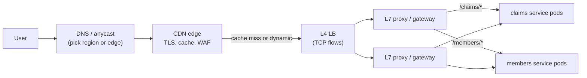
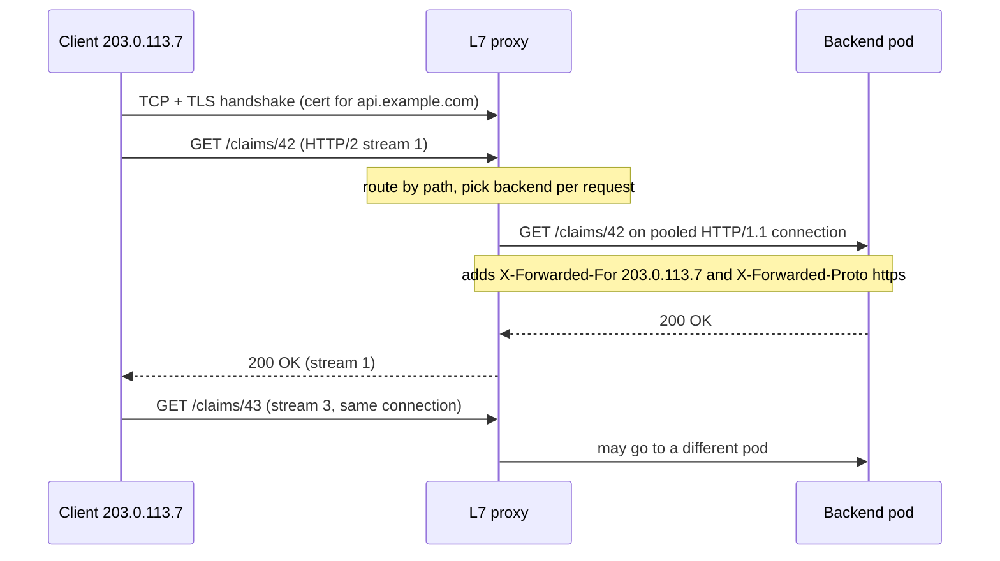
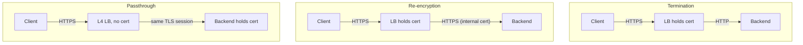

# Load Balancers (L4 vs L7), Reverse Proxies & CDNs

!!! abstract "Key takeaways"
    - An **L4 load balancer** works on TCP/UDP flows: it picks a backend **once per connection** (usually by hashing the 5-tuple) and forwards bytes without reading them. An **L7 load balancer** is a **reverse proxy**: it terminates the client connection, parses each HTTP request, and picks a backend **per request** over its own pooled connections.
    - That difference explains most interview questions: L7 can route by host, path or header, retry, add headers and balance HTTP/2 and gRPC streams; L4 is faster, protocol-agnostic and can pass TLS through untouched, but pins every request on a long-lived connection to one backend.
    - A proxy hides the client. The backend learns the real client IP and scheme from **`X-Forwarded-For` / `X-Forwarded-Proto`** (or RFC 7239 `Forwarded`, or the **PROXY protocol** at L4), and must trust those headers **only from known proxies**, because clients can send them too.
    - Production failures cluster around **timeouts and lifecycle**: backend keep-alive shorter than the proxy's idle timeout gives random **502s**; missing readiness checks, draining and graceful shutdown drop requests during deploys.
    - A **CDN** is a globally distributed reverse proxy with a cache: anycast or DNS steers users to a nearby edge, which terminates TLS, serves cached objects, collapses concurrent misses, shields the origin and absorbs attacks. The danger is caching something personal: shared caches must never store per-user responses.

## Why it matters

A single server has a single point of failure and a ceiling. As soon as there are two, something must decide which one each user talks to, notice when one dies, and take it out of rotation. Early sites did this with round-robin DNS, which can't see health or load and is cached for minutes. Hardware load balancers (F5, Citrix NetScaler) followed, then software: HAProxy, NGINX, Envoy, and the cloud services (AWS ALB/NLB, Azure Application Gateway and Front Door, Google Cloud Load Balancing) that most teams now use.

In a modern request path there are usually several layers: DNS or anycast picks a region or edge location, a CDN serves what it can, an L4 balancer spreads connections across a fleet of L7 proxies, the L7 proxy or API gateway routes requests to services, and inside the cluster a Kubernetes Service or service mesh balances again. Interviewers use this topic to check whether you can place each component, explain what it can and can't see, and debug the classic failures: 502s, lost client IPs, uneven gRPC load and stale or leaked cached content.

This page covers the networking mechanics. The AWS products are in [EC2, Auto Scaling and ELB/ALB/NLB](../aws/03-compute-ec2-auto-scaling-elb-alb-nlb.md) and [VPC, Route 53 and CloudFront](../aws/09-networking-vpc-subnets-security-groups-vs-nacls-route-53-clo.md); balancing algorithms and scaling are in [scalability and load balancing](../system-design/03-scalability-vertical-vs-horizontal-stateless-services-load-b.md); HTTP caching headers in depth are in [caching strategies and CDN](../system-design/04-caching-strategies-and-cdn.md).

## Core concepts

### The layers in front of a service


*Notice that each layer balances something different: DNS and anycast pick a location, L4 spreads connections across proxies, L7 routes individual requests to services. Smaller systems collapse layers (a single ALB is both L4 and L7).*

### Forward proxy vs reverse proxy

Both sit in the middle of an HTTP conversation; the difference is **whom they act for**.

| | Forward proxy | Reverse proxy |
|---|---|---|
| Acts for | Clients (a company's users, a build server) | Servers (your services) |
| Client knows about it? | Yes, configured explicitly (`HTTPS_PROXY`, PAC file) | No, it looks like the origin server |
| Typical jobs | Egress control, URL filtering, caching, audit | TLS termination, routing, load balancing, caching, WAF, compression, auth |
| Examples | Squid, Zscaler, corporate egress proxies | NGINX, HAProxy, Envoy, ALB, API gateways, CDNs |

A load balancer at L7, an API gateway and a CDN edge are all **reverse proxies** with different emphasis. A gateway adds API concerns (auth, rate limits, request transformation; see [API gateway and BFF](../microservices/03-api-gateway-and-bff-pattern.md)); a CDN adds geographic distribution and caching.

### L4 load balancing: connections, not requests

An L4 balancer sees IP addresses, ports and TCP/UDP. When a new flow arrives it chooses a backend (hash of the 5-tuple: source IP, source port, destination IP, destination port, protocol; or round robin, least connections) and records the choice in a **connection table** so every later packet of that flow goes to the same backend. It never parses HTTP, so it can carry anything: HTTPS it can't decrypt, gRPC, database protocols, MQTT, Kafka, game traffic over UDP.

Three common forwarding modes:

- **NAT (full proxy at the packet level):** the LB rewrites the destination address (and often the source, SNAT) and both directions flow through it. Simple; the LB sees every byte; the backend sees the LB's IP unless the source is preserved.
- **Direct server return (DSR):** the LB rewrites only the destination MAC or encapsulates the packet; the backend replies **directly** to the client. Responses (usually the bulk of the bytes) skip the LB, so one balancer handles huge traffic. Linux IPVS "DR" mode, Google's **Maglev** and Facebook's Katran work this way.
- **TCP proxy:** the LB terminates TCP and opens a second TCP connection to the backend, but still doesn't read the payload (HAProxy `mode tcp`, NGINX `stream`). It's "L4" in what it understands even though there are two connections.

At scale the L4 tier is itself a fleet behind routers using ECMP. Maglev (NSDI 2016) uses **consistent hashing** plus connection tracking so that any balancer in the fleet sends a given flow to the same backend, and adding or losing a balancer or backend disturbs few existing connections.

### L7 load balancing: a reverse proxy that reads requests

An L7 balancer terminates the client's TCP (and usually TLS) connection, parses HTTP, and then decides **per request**. Because it understands the protocol, it can:

- route by host, path, method, header, cookie or query (`/claims/*` to one service, `api.` vs `www.`, a canary header to v2);
- balance **each request or HTTP/2 stream** separately, and keep warm, pooled connections to backends;
- **retry** an idempotent request on another backend, apply per-route timeouts, and eject backends with high error rates (outlier detection);
- add or rewrite headers (`X-Forwarded-For`, `X-Request-Id`, trace context), compress, cache, enforce body size limits;
- terminate TLS and offload authentication, WAF rules and rate limiting;
- translate protocols: HTTP/2 or HTTP/3 to clients, HTTP/1.1 to the backend; WebSocket upgrades; gRPC-Web to gRPC.

The price: more CPU per request (TLS, parsing), an extra hop, two connections to tune, and the proxy is in the path of everything, so a bad config change has a large blast radius.


*Notice the two independent connections: the client's ends at the proxy, so the backend sees the proxy's IP, not the client's, and learns the original client and scheme only from the headers the proxy adds.*

### Why L4 vs L7 matters for HTTP/2 and gRPC

HTTP/2 and gRPC multiplex many requests over **one long-lived connection** ([HTTP/1.1 vs HTTP/2 vs HTTP/3](02-http-1-1-vs-http-2-vs-http-3.md)). An L4 balancer picks a backend per connection, so every request from that client goes to the same backend for hours. With a few clients and many backends, some backends are overloaded and others idle, and new pods added by an autoscaler get no traffic until clients reconnect.

{ loading=lazy }
*Watch where the dots land: the L4 balancer never sees requests, only one connection, so it can't spread them.*

This is exactly what happens with gRPC behind a plain **Kubernetes Service**: kube-proxy (iptables or IPVS) balances at L4, per connection. Fixes, in order of preference:

1. An L7 proxy that understands HTTP/2: a service mesh sidecar (Envoy, Linkerd), an ingress or gateway with gRPC support, or an ALB target group with protocol version gRPC.
2. **Client-side load balancing**: a headless Service returns all pod IPs and the gRPC client balances across them (see [client-side load balancing](../microservices/04-service-discovery-and-client-side-load-balancing.md)).
3. A server-side **max connection age** (gRPC `MaxConnectionAge`) so clients reconnect periodically and get rebalanced. A mitigation, not a fix.

### L4 vs L7 at a glance

| | L4 (transport) | L7 (application) |
|---|---|---|
| Unit of balancing | Connection / flow | Request / stream |
| Sees | IPs, ports, TCP/UDP | Full HTTP: method, path, headers, body |
| TLS | Passes through (or terminates, e.g. NLB TLS listener) | Terminates (can re-encrypt to backend) |
| Routing | By port | By host, path, header, cookie, weight |
| Retries | No (can't tell where a request ends) | Yes, per request, idempotent only |
| Client IP at backend | Preserved (no SNAT, DSR) or via PROXY protocol | Via `X-Forwarded-For` / `Forwarded` |
| Performance | Very high throughput, microseconds of added latency | More CPU per request, but connection reuse to backends |
| Protocols | Anything over TCP/UDP | HTTP/1.1, HTTP/2, gRPC, WebSocket (whatever it parses) |
| Examples | AWS NLB, Azure Load Balancer, IPVS/kube-proxy, Maglev, HAProxy `mode tcp` | AWS ALB, Azure Application Gateway, NGINX, Envoy, HAProxy `mode http`, Traefik |

### TLS: terminate, re-encrypt or pass through


*Notice where the plaintext exists: termination exposes it inside the network, re-encryption only inside the proxy, passthrough nowhere but the backend (at the cost of all L7 features).*

- **Termination** at the edge is the default: the proxy holds the certificate (managed with ACM, cert-manager, Key Vault), does the handshake ([TLS handshake](03-tls-handshake.md)) and can inspect requests. Fine inside a trusted network, but regulated environments often require encryption in transit end to end.
- **Re-encryption** (TLS bridging) keeps L7 features and encrypts the hop to the backend; a service mesh does the same with automatic **mTLS** between pods.
- **Passthrough** needs an L4 balancer. It can still route by hostname by reading the unencrypted **SNI** field of the ClientHello (NGINX `ssl_preread`, HAProxy `req.ssl_sni`), but can't see paths or headers. Use it when the backend must own the key (client-certificate authentication, strict compliance) or the protocol isn't HTTP.

### Who is the client? Forwarded headers and the PROXY protocol

Behind a proxy, `request.getRemoteAddr()` returns the proxy's IP, `request.getScheme()` says `http` even though the user used HTTPS, and redirects built from them point to the wrong place. Proxies pass the original values on:

| Mechanism | Layer | Carries |
|---|---|---|
| `X-Forwarded-For: client, proxy1, proxy2` | L7 header, de facto standard | Client IP plus each proxy appended in order |
| `X-Forwarded-Proto`, `X-Forwarded-Host`, `X-Forwarded-Port` | L7 headers | Original scheme, host, port |
| `Forwarded: for=203.0.113.7;proto=https;host=api.example.com` | L7 header, **RFC 7239** | The same, standardised in one header |
| PROXY protocol v1 (text) / v2 (binary) | Prefix on the TCP connection | Original source/destination IP and port, for L4 proxies that can't add headers |

`X-Forwarded-For` is **client-controllable**: an attacker can send `X-Forwarded-For: 10.0.0.1` and each proxy appends to it. The only trustworthy entries are those added by proxies you control, so read the list **from the right**, skip your own proxies, and take the first address that isn't one of them. Better still, have the **outermost** proxy overwrite the header instead of appending. Getting this wrong breaks IP allow-lists, rate limiting and audit logs (see the code below).

### Health checks, draining and slow start

- **Active health checks:** the LB probes each backend (`GET /actuator/health/readiness` every few seconds; N failures mark it unhealthy, M successes bring it back). Probe **readiness** (can this instance serve?), not deep dependencies, or one database blip takes every backend out at once.
- **Passive health checks / outlier detection:** watch real traffic and eject backends returning 5xx or timing out (NGINX `max_fails`, Envoy outlier detection). They react faster than probes and catch "up but broken" instances.
- **Connection draining / deregistration delay:** when a backend is removed, stop sending **new** requests but let in-flight ones finish (ALB default 300 s). The backend must cooperate: fail readiness first, then shut down gracefully.
- **Slow start:** ramp traffic to a new instance over a window so a cold JVM (no JIT, empty caches, no pooled connections) isn't hit with a full share at once.

### Keep-alive and idle timeouts: the classic 502

A proxy keeps **idle connections to backends** open for reuse, and both sides have an idle timeout. If the backend's is shorter, the backend closes a connection that the proxy still considers usable; the next request the proxy sends on it gets a reset, and the client sees **502 Bad Gateway**. It's intermittent, load-dependent and maddening to debug.

{ loading=lazy }
*The side that closes first must be the proxy. Make the backend's keep-alive timeout longer than the load balancer's idle timeout.*

AWS documents this for the ALB (default idle timeout 60 s, configurable 1–4,000 s): set the application's keep-alive timeout **higher** than the load balancer's. Watch the defaults: Node.js's `server.keepAliveTimeout` is 5 s; Tomcat's `keepAliveTimeout` defaults to its `connectionTimeout` (60 s in the connector's own default, 20 s in the stock `server.xml`), which is equal to or below the ALB's. An NLB has a TCP idle timeout of 350 s by default (configurable 60–6,000 s since 2024) and silently drops idle flows after it; long-lived idle connections (database pools, gRPC) need TCP keepalives or application pings shorter than that.

### Balancing algorithms and affinity

Covered in depth in [scalability and load balancing](../system-design/03-scalability-vertical-vs-horizontal-stateless-services-load-b.md). The short version: **round robin** for uniform short requests; **least outstanding requests** (often implemented as **power of two choices**, Envoy's `LEAST_REQUEST` default) for variable request costs; **consistent hashing** (ring hash, Maglev) when the same key should hit the same backend for cache locality. **Sticky sessions** (a cookie such as ALB's `AWSALB`, or a source-IP hash) keep a user on one backend; they're a crutch for in-memory session state, cause uneven load and lose sessions when a backend dies. Prefer stateless services with sessions in Redis or tokens.

### Global load balancing: DNS vs anycast

To pick a **region** or edge location, there are two main tools ([DNS resolution](04-dns-resolution.md)):

- **DNS-based (GSLB):** the authoritative DNS answers with different IPs by geography, latency or health (Route 53 latency, geolocation and failover routing; Azure Traffic Manager). Simple and works with any backend, but resolvers cache answers for the TTL (and some ignore it), the decision is based on the **resolver's** location, not the user's (EDNS Client Subnet helps), and failover is only as fast as caches expire.
- **Anycast:** the **same IP** is announced via BGP from many locations, and internet routing delivers each packet to the nearest one. Failover is a BGP withdrawal (seconds), and the IP never changes. CDNs (Cloudflare, Fastly), DNS providers, Google Cloud's global load balancer and AWS Global Accelerator use it. Routing changes can move a flow mid-connection, which operators handle with stable routing and connection-aware L4 tiers.

### CDNs: reverse proxies at the edge

A CDN runs reverse proxies with caches in many points of presence (PoPs). Users reach a nearby PoP (anycast or DNS), which:

- **terminates TLS close to the user**, so the handshake round trips are short, and reuses warm, long-lived connections back to the origin;
- **serves cached responses** according to `Cache-Control` (`s-maxage` for shared caches, `max-age`, `private`, `no-store`) and the configured **cache key** (path, selected query parameters and headers, `Vary`);
- uses **tiered caching / origin shield**: edge misses go to a regional cache first, so the origin sees one request per object instead of one per PoP;
- does **request collapsing**: concurrent misses for the same object wait for a single origin fetch instead of stampeding the origin;
- serves stale content during refresh or failure with **`stale-while-revalidate`** and **`stale-if-error`** (RFC 5861);
- absorbs **DDoS** traffic across its whole network, runs **WAF** and bot rules, and hides the origin (the origin accepts traffic only from the CDN);
- runs **edge compute** (CloudFront Functions, Lambda@Edge, Cloudflare Workers) for redirects, header rewrites, A/B tests and auth checks.

{ loading=lazy }
*Count the requests that reach the origin: one fetch and one cheap 304 serve every user in the animation.*

Even uncacheable **dynamic** requests benefit from a CDN: TLS ends near the user, the edge-to-origin path uses warm connections and the provider's backbone, and the origin is shielded from attacks. Invalidation is the hard part; prefer **versioned file names** (`app.3f9a1c.js` with a one-year `immutable` TTL and a short-lived `index.html`) to purges.

!!! question "Interview angle"
    "Where would you put the cache?" is often a trap for personalised APIs. A shared cache (CDN, reverse proxy) may only store responses that are identical for everyone who sends the same cache key. Per-user responses need `Cache-Control: private` or `no-store`, or a cache key that includes the identity, which usually destroys the hit ratio.

## In practice: code & configuration

Reading the client IP in a Spring Boot 3 service behind a load balancer:

=== "❌ Common mistake"
    ```java
    @GetMapping("/admin/report")
    ResponseEntity<Report> report(HttpServletRequest request) {
        // Leftmost X-Forwarded-For entry is whatever the CLIENT sent: trivially spoofed.
        String xff = request.getHeader("X-Forwarded-For");
        String clientIp = xff != null ? xff.split(",")[0].trim() : request.getRemoteAddr();

        if (!officeAllowList.contains(clientIp)) {          // attacker sends "X-Forwarded-For: 10.20.0.5"
            return ResponseEntity.status(HttpStatus.FORBIDDEN).build();
        }
        // Redirects built from request.getScheme() also say "http" behind a TLS-terminating LB.
        return ResponseEntity.ok(reportService.build());
    }
    ```

=== "✅ Correct approach"
    ```yaml
    # application.yml: let the server resolve forwarded headers, trusting only our proxies
    server:
      forward-headers-strategy: native        # Tomcat RemoteIpValve (auto-enabled on Kubernetes/Cloud Foundry/Heroku)
      tomcat:
        remoteip:
          internal-proxies: "10\\.20\\.\\d{1,3}\\.\\d{1,3}"   # regex: ONLY the LB/ingress subnet, not all of 10/8
          remote-ip-header: x-forwarded-for
          protocol-header: x-forwarded-proto
        keep-alive-timeout: 75s               # longer than the ALB idle timeout (60 s) to avoid 502s
      shutdown: graceful                      # finish in-flight requests while the LB drains
    spring:
      lifecycle:
        timeout-per-shutdown-phase: 25s
    ```
    ```java
    @GetMapping("/admin/report")
    ResponseEntity<Report> report(HttpServletRequest request) {
        // RemoteIpValve walked X-Forwarded-For from the right, skipped trusted proxies,
        // and set remoteAddr to the first untrusted address: the real client.
        String clientIp = request.getRemoteAddr();
        if (!officeAllowList.contains(clientIp)) {
            return ResponseEntity.status(HttpStatus.FORBIDDEN).build();
        }
        return ResponseEntity.ok(reportService.build()); // request.isSecure() is now true for HTTPS clients
    }
    ```

Use `framework` instead of `native` when the app runs on a server without built-in support or when you need RFC 7239 `Forwarded`; Spring's `ForwardedHeaderFilter` then does the rewriting. Either way, the trust boundary is the point: anything from an untrusted hop is data, not identity.

An NGINX reverse proxy in front of two Spring Boot instances:

```nginx
upstream claims_api {
    least_conn;                                   # variable request cost: prefer the least busy
    server 10.20.1.10:8080 max_fails=3 fail_timeout=10s;   # passive health checks (open-source NGINX)
    server 10.20.1.11:8080 max_fails=3 fail_timeout=10s;
    keepalive 32;                                 # idle keep-alive connections kept per worker
}

server {
    listen 443 ssl;
    http2 on;                                     # NGINX 1.25.1+ syntax
    server_name api.example.com;
    ssl_certificate     /etc/nginx/tls/api.crt;
    ssl_certificate_key /etc/nginx/tls/api.key;

    location /claims/ {
        proxy_pass http://claims_api;
        proxy_http_version 1.1;                   # required for upstream keep-alive
        proxy_set_header Connection "";           # don't forward "Connection: close"
        proxy_set_header Host $host;
        proxy_set_header X-Forwarded-For $remote_addr;   # outermost proxy: overwrite, don't append
        proxy_set_header X-Forwarded-Proto $scheme;

        proxy_connect_timeout 2s;
        proxy_read_timeout 30s;                   # match the route's latency budget
        proxy_next_upstream error timeout;        # retry on another server; POST/PATCH not retried once sent
        proxy_next_upstream_tries 2;
        client_max_body_size 5m;
    }
}
```

!!! tip "Inner proxies append, the edge overwrites"
    If NGINX sits behind another proxy you control (an ALB, a CDN), use `$proxy_add_x_forwarded_for` there and configure `set_real_ip_from` + `real_ip_header X-Forwarded-For` with `real_ip_recursive on`, so NGINX itself resolves the client address with the same right-to-left trust rule.

## Real-world usage

- **Google Maglev** has served Google traffic since 2008 and backs Google Cloud's network load balancing: a fleet of commodity Linux machines behind ECMP routers, consistent hashing plus connection tracking, and direct server return.
- **AWS** splits the roles: NLB (L4, static IPs, TLS passthrough, PrivateLink, preserved source IP), ALB (L7, path/host routing, gRPC, WAF, OIDC auth), CloudFront (CDN with Origin Shield and request collapsing) and Global Accelerator (anycast static IPs in front of regional endpoints). A common pattern is CloudFront → ALB → ECS/EKS, with the ALB accepting traffic only from CloudFront.
- **Kubernetes**: a `Service` is L4 (kube-proxy); an `Ingress` or the newer **Gateway API** is L7 (NGINX, Envoy-based gateways, the AWS Load Balancer Controller creating ALBs). Service meshes add L7 balancing, retries and mTLS between pods.
- **Incidents worth knowing:**
    - **Cloudflare, 2 July 2019:** a WAF rule with a pathological regular expression exhausted CPU across the edge, and sites behind Cloudflare returned 502s for about half an hour. Lesson: the proxy layer is a shared fate for everyone behind it; stage config rollouts.
    - **Fastly, 8 June 2021:** a valid customer configuration change triggered a latent bug and much of Fastly's network returned errors; Fastly reported 95% of the network recovered within 49 minutes. Major news, government and commerce sites went down together.
    - **Steam, 25 December 2015:** during a DDoS, a caching configuration change caused pages generated for logged-in users to be cached and served to others; Valve said about 34,000 users' pages may have been seen by others. This is the textbook case for never shared-caching personalised responses.
- **Healthcare and banking:** PHI and account data must not land in shared caches (`Cache-Control: private, no-store` on those APIs, CDN rules that bypass cache for authenticated paths). Many security policies require **encryption in transit inside the network**, so TLS re-encryption to backends or mesh mTLS rather than plain HTTP behind the LB. Audit logs need the real client IP, so forwarded-header handling is a compliance concern, not just a convenience.

## Trade-offs & production gotchas

| Option | Pros | Cons | Use when |
|---|---|---|---|
| L4 LB (NLB, IPVS) | Fast, cheap per request, any protocol, TLS passthrough, static IPs, source IP preserved | No content routing, no retries, connection-level balancing pins HTTP/2 and gRPC | Non-HTTP, extreme throughput, passthrough, front tier for an L7 fleet |
| L7 LB / reverse proxy (ALB, NGINX, Envoy) | Path/host routing, per-request balancing, retries, header control, WAF, observability | More CPU, extra hop, protocol must be supported, big blast radius for config errors | HTTP/gRPC microservices, most web APIs |
| TLS termination at the LB | Central certs, L7 features, offloads backends | Plaintext behind the LB | Trusted internal network, no end-to-end requirement |
| Re-encryption / mesh mTLS | Encryption on every hop, keeps L7 features | Cert management, CPU | Regulated data (PHI, PCI), zero-trust networks |
| DNS-based global balancing | Simple, any backend | Cached answers, resolver location, slow failover | Region failover with modest RTO |
| Anycast | Fast failover, one IP, nearest PoP | Needs BGP and a global network (or a provider) | CDNs, global edges, DNS |
| CDN | Latency, origin offload, DDoS absorption | Caching mistakes leak data or serve stale content; vendor outage is your outage | Public static assets, cacheable APIs, any public site needing protection |

!!! warning "Gotcha: idle timeout mismatch"
    Random 502s under moderate load, gone when you retry, usually mean the backend closed a pooled keep-alive connection before the proxy did. Set the backend keep-alive timeout above the proxy's idle timeout, and check every hop (CDN → ALB → ingress → app).

!!! warning "Gotcha: health checks that check too much"
    A readiness endpoint that fails when the database is slow makes the LB remove **every** instance at once, turning a degradation into a full outage. Health checks should answer "can this instance take traffic?"; dependency failures belong in circuit breakers and alerts.

!!! warning "Gotcha: scale-out with long-lived connections"
    New pods behind an L4 balancer get no traffic from clients that already hold HTTP/2, gRPC or WebSocket connections. Autoscaling looks broken and old pods stay hot. Use L7 balancing, client-side balancing or a max connection age.

!!! warning "Gotcha: caching errors and cookies"
    A CDN can cache a 500 or 404 (negative caching) and keep serving it after the origin recovers, and a response carrying `Set-Cookie` should never be stored in a shared cache. Check what the CDN does with error TTLs and cookies before go-live.

## How this connects to my experience

Not ★. Not a specific resume claim; position it as working knowledge from the platforms I built on, plus the **AWS Certified Solutions Architect – Associate (2023)**, whose syllabus covers ELB types, CloudFront and Route 53 routing policies.

- **Where I used it:**
    - **Deloitte, ConvergeHealth Data Asset Explorer:** "cloud-native microservices on AWS using Lambda, EC2, ECS, EKS, API Gateway…" Services on ECS/EKS sit behind load balancers or an ingress. *[confirm: ALB vs NLB, ingress controller used on EKS, whether CloudFront fronted anything]*
    - **OptumRx Meteor:** the **GraphQL Consumer Service** for 750K+ users and the ReactJS application "built from the ground up" with a micro-frontend architecture. The service sits behind a gateway or load balancer, and the React bundles are static assets typically served via a CDN. *[confirm: which LB/gateway and CDN were in front, and whether TLS was re-encrypted to pods]*
    - **Kubernetes (EKS/AKS)** from the skills list: Services (L4) vs Ingress (L7) is the everyday version of this topic. *[confirm: ingress controller]*
- **Talking points:**
    - "A GraphQL endpoint is a single path (`/graphql`), so path-based routing at the LB doesn't help much; the routing happens in resolvers. What the LB does matter for is TLS, timeouts aligned with the query's latency budget, and readiness during deploys." *[confirm timeout values]*
    - "Behind the LB we relied on forwarded headers for the client IP and scheme, which matters for OAuth2 redirects with PingFederate: a redirect URI built as `http://` behind a TLS-terminating LB breaks the login flow." *[confirm whether this came up]*
    - "Static React assets get long-cache, fingerprinted file names; the HTML shell and authenticated API responses are not shared-cached, because member data is PHI."
- **Likely follow-up chain:** "What sits in front of your service?" → "ALB or NLB, and why?" → "How does your app know the user's IP?" → "Users see occasional 502s, what do you check?" Answer: CDN/LB/ingress/pods layers → L7 for HTTP routing and per-request balancing, NLB only for non-HTTP or static IPs → `X-Forwarded-For` resolved by the server with trusted proxies only → keep-alive vs idle timeout, draining and graceful shutdown on deploys, target health, LB access logs (`elb_status_code` vs `target_status_code`).

## Interview questions

### Fundamentals

??? question "Q1. What is the difference between an L4 and an L7 load balancer?"
    **Answer:** An L4 balancer works on TCP/UDP flows: it picks a backend per connection, usually by hashing the 5-tuple, and forwards bytes without reading them, so it's fast, protocol-agnostic and can pass TLS through. An L7 balancer is a reverse proxy: it terminates the client connection (and usually TLS), parses HTTP, and chooses a backend per request, which enables routing by host/path/header, retries, header injection, WAF and per-stream balancing of HTTP/2 and gRPC, at the cost of more CPU and an extra hop.

    **Interviewer listens for:** connection vs request granularity, termination, what each can see, a concrete consequence (gRPC pinning, path routing).

    **Common wrong answer:** "L7 is just a faster/newer L4" or "L4 balances by IP, L7 by URL" without the connection-vs-request distinction.

??? question "Q2. What's a reverse proxy, and how is it different from a forward proxy?"
    **Answer:** A reverse proxy acts for servers: clients connect to it as if it were the origin, and it forwards to backends while handling TLS, routing, load balancing, caching, compression and security. A forward proxy acts for clients: they're configured to send outbound traffic through it for egress control, filtering or caching. Load balancers at L7, API gateways and CDNs are all reverse proxies.

    **Interviewer listens for:** whom it represents, whether the client knows, typical jobs of each.

    **Common wrong answer:** "A reverse proxy is a proxy that sends responses back."

??? question "Q3. What does a CDN do besides caching static files?"
    **Answer:** It terminates TLS near the user and reuses warm connections to the origin, which speeds up even dynamic requests; it shields the origin with tiered caching and request collapsing; it serves stale content during refresh or origin failure; it absorbs DDoS traffic and runs WAF and bot rules; it hides the origin's address; and it can run edge code for redirects, headers, A/B tests and auth checks. Users reach the nearest PoP through anycast or DNS.

    **Interviewer listens for:** TLS at the edge, origin shield/collapsing, security, dynamic acceleration.

    **Common wrong answer:** "It's only useful for images and JS."

### Intermediate

??? question "Q4. Your gRPC service on Kubernetes has 10 pods but two of them get almost all the traffic. Why, and how do you fix it?"
    **Answer:** A Kubernetes Service is L4: kube-proxy picks a pod per TCP connection. gRPC uses long-lived HTTP/2 connections that multiplex all calls, so each client stays on the pod it first connected to, and pods added later get nothing. Fix with L7 balancing that understands HTTP/2 (a mesh sidecar such as Envoy or Linkerd, or a gRPC-aware gateway), or client-side balancing using a headless Service so the client sees all pod IPs; as a mitigation, set a server max connection age so clients reconnect and rebalance.

    **Interviewer listens for:** per-connection balancing, HTTP/2 multiplexing, the three fixes.

    **Common wrong answer:** "Change the algorithm to least connections", which still counts connections, not requests.

??? question "Q5. How does a backend behind a load balancer get the client's real IP, and what can go wrong?"
    **Answer:** At L7 the proxy adds `X-Forwarded-For` (and `X-Forwarded-Proto`/`Host`) or RFC 7239 `Forwarded`; at L4 the LB either preserves the source IP (no SNAT, DSR) or prepends the PROXY protocol header. The trap is trust: clients can send their own `X-Forwarded-For`, and proxies append to it, so the leftmost value is attacker-controlled. Resolve from the right, skipping only known proxies (Tomcat's RemoteIpValve with a tight `internal-proxies`, NGINX `real_ip_recursive`), or have the edge overwrite the header. Otherwise IP allow-lists, rate limits and audit logs can be bypassed.

    **Interviewer listens for:** headers vs PROXY protocol, spoofing, right-to-left with trusted proxies.

    **Common wrong answer:** "Take the first IP in X-Forwarded-For."

??? question "Q6. Compare TLS termination, re-encryption and passthrough at the load balancer."
    **Answer:** Termination: the LB holds the certificate and forwards plain HTTP, giving all L7 features and central certificate management, but traffic behind the LB is unencrypted. Re-encryption: the LB terminates and opens a new TLS connection to the backend, keeping L7 features with encryption on every hop (meshes do this with mTLS). Passthrough: an L4 LB forwards the encrypted stream and the backend terminates; the LB can route only by SNI and loses path routing, header injection and WAF, but the backend keeps the key and can do client-certificate auth itself.

    **Interviewer listens for:** where plaintext exists, which features each loses, compliance reasons for re-encryption.

    **Common wrong answer:** "Passthrough is more secure, so always use it."

### Senior

??? question "Q7. Users report intermittent 502 errors through the ALB, mostly under moderate load, and retries succeed. How do you investigate?"
    **Answer:** Check the ALB access logs: `elb_status_code` 502 with a `target_status_code` of `-` means the target didn't return a valid response, often because the connection was closed. The classic cause is a backend keep-alive timeout shorter than the ALB's 60 s idle timeout, so the ALB reuses a connection the backend just closed; fix by setting the app's keep-alive above the LB idle timeout at every hop. Other causes: targets killed during deploys without draining and graceful shutdown, crashes or OOM kills, response headers too large, or a protocol mismatch (HTTPS to an HTTP port). Correlate the 502 timestamps with deploys and pod restarts.

    **Interviewer listens for:** access-log fields, keep-alive race, deploy lifecycle, systematic correlation.

    **Common wrong answer:** "Increase the ALB timeout", which makes the keep-alive race worse.

??? question "Q8. How do you deploy behind a load balancer without dropping requests?"
    **Answer:** New instances join only when **readiness** passes, ideally with slow start. On shutdown: flip readiness to failing (or receive the deregistration), let the LB stop sending new requests, wait out the propagation (a Kubernetes `preStop` sleep, because endpoint removal is asynchronous), then shut down gracefully so in-flight requests finish (`server.shutdown=graceful`), with a deregistration delay longer than the slowest request. Keep long-lived connections in mind: WebSocket and gRPC clients need to reconnect, so send GOAWAY or close politely. Verify with a load test during a rolling deploy watching for 5xx.

    **Interviewer listens for:** readiness, draining, preStop delay, graceful shutdown ordering, long-lived connections.

    **Common wrong answer:** "Kubernetes rolling updates handle it automatically."

??? question "Q9. How would you design global traffic routing for an API served from two regions?"
    **Answer:** Choose between DNS-based routing (Route 53 latency or failover records with health checks) and anycast (Global Accelerator, a global L7 LB, or a CDN in front). DNS is simple but failover waits on TTLs and resolver caches, and steering uses the resolver's location; anycast gives one stable IP and fast failover. Inside each region an L7 balancer routes to services. The hard parts are data: where writes go, replication lag, session and token validity across regions, and a tested failover runbook with capacity in the surviving region for the full load.

    **Interviewer listens for:** DNS vs anycast trade-offs, health-based failover, the data-layer caveat, capacity.

    **Common wrong answer:** "Put a load balancer in front of both regions", with no answer for where that balancer lives.

### Scenario-based

??? question "Q10. After putting a CDN in front of the member portal, a user reports seeing another member's name on the dashboard. What happened and how do you fix it?"
    **Answer:** A personalised response was stored in a shared cache and served to someone with the same cache key, usually because the origin sent cacheable headers (or none, and the CDN applied a default TTL) and the cache key didn't include identity. Contain first: bypass or purge the cache for that path and treat it as a potential PHI disclosure with the privacy team. Fix: `Cache-Control: private, no-store` on authenticated responses, CDN behaviours that never cache authenticated paths or requests with auth headers or cookies, and a test that asserts these headers. Steam's 2015 incident is the same failure.

    **Interviewer listens for:** shared vs private cache, cache key, incident handling, regulatory angle.

    **Common wrong answer:** "Add the user ID to the URL" without addressing cache headers.

??? question "Q11. A partner needs to allow-list fixed IPs for your HTTPS API, and you also need path-based routing to several services. What do you put in front?"
    **Answer:** An ALB has no static IPs, so put something with fixed addresses in front of it: an NLB with Elastic IPs per AZ forwarding to an ALB target (NLB supports ALB as a target), or AWS Global Accelerator's two static anycast IPs in front of the ALB. The ALB keeps the L7 path routing and WAF; the NLB or accelerator provides the stable IPs. Client IP comes through as `X-Forwarded-For` from the ALB; confirm the chain preserves it end to end.

    **Interviewer listens for:** knowing which LB gives static IPs, layering L4 in front of L7, keeping L7 features.

    **Common wrong answer:** "Give the partner the ALB's current IPs", which change.

## Cheat sheet

| Concept | Remember |
|---|---|
| L4 | Per connection, 5-tuple hash, any protocol, TLS passthrough, no retries |
| L7 | Reverse proxy, per request, routes by host/path/header, retries, adds headers |
| HTTP/2, gRPC | L4 pins all streams to one backend; use L7, client-side LB or max connection age |
| L4 modes | NAT, DSR (responses bypass LB), TCP proxy |
| TLS | Terminate / re-encrypt / pass through (SNI routing only) |
| Client IP | `X-Forwarded-For` from the right, trust only your proxies; RFC 7239 `Forwarded`; PROXY protocol at L4 |
| Spring Boot | `server.forward-headers-strategy=native`, `server.tomcat.remoteip.internal-proxies` |
| 502 race | Backend keep-alive > LB idle timeout (ALB 60 s); NLB TCP idle 350 s default |
| Health | Readiness, not deep dependencies; passive outlier detection; draining; slow start |
| Global | DNS GSLB (TTL, resolver location) vs anycast (one IP, BGP failover) |
| CDN | Edge TLS, cache key, `s-maxage`, origin shield, request collapsing, `stale-while-revalidate`, WAF/DDoS |
| Never | Shared-cache personalised responses or `Set-Cookie` |

## Sources
1. [AWS: Application Load Balancer attributes (connection idle timeout, HTTP client keepalive, X-Forwarded-For processing)](https://docs.aws.amazon.com/elasticloadbalancing/latest/application/edit-load-balancer-attributes.html): 60 s default, 1–4,000 s range, keep application keep-alive above the idle timeout.
2. [AWS: Network Load Balancer configurable TCP idle timeout (2024)](https://aws.amazon.com/blogs/networking-and-content-delivery/introducing-nlb-tcp-configurable-idle-timeout/): 350 s default, 60–6,000 s range.
3. [AWS: Troubleshoot Application Load Balancers (HTTP 502)](https://docs.aws.amazon.com/elasticloadbalancing/latest/application/load-balancer-troubleshooting.html) and [Target group deregistration delay](https://docs.aws.amazon.com/elasticloadbalancing/latest/application/load-balancer-target-groups.html): 502 causes, 300 s default draining.
4. Eisenbud et al., ["Maglev: A Fast and Reliable Software Network Load Balancer"](https://research.google/pubs/maglev-a-fast-and-reliable-software-network-load-balancer/), NSDI 2016: ECMP, consistent hashing, connection tracking, in production since 2008.
5. [RFC 7239: Forwarded HTTP Extension](https://www.rfc-editor.org/rfc/rfc7239) and [HAProxy PROXY protocol specification](https://www.haproxy.org/download/2.9/doc/proxy-protocol.txt): forwarded client information at L7 and L4.
6. [Spring Boot: Running behind a front-end proxy server](https://docs.spring.io/spring-boot/how-to/webserver.html#howto.webserver.use-behind-a-proxy-server) and [Deploying to the cloud](https://docs.spring.io/spring-boot/how-to/deployment/cloud.html): `forward-headers-strategy`, RemoteIpValve, automatic enablement on cloud platforms.
7. [Apache Tomcat 10.1: HTTP connector](https://tomcat.apache.org/tomcat-10.1-doc/config/http.html) and [RemoteIpValve](https://tomcat.apache.org/tomcat-10.1-doc/config/valve.html#Remote_IP_Valve): `keepAliveTimeout` and `connectionTimeout` defaults, right-to-left proxy resolution.
8. [NGINX: ngx_http_upstream_module](https://nginx.org/en/docs/http/ngx_http_upstream_module.html), [ngx_http_proxy_module](https://nginx.org/en/docs/http/ngx_http_proxy_module.html) and [ngx_http_realip_module](https://nginx.org/en/docs/http/ngx_http_realip_module.html): upstream keepalive, `proxy_next_upstream` and non-idempotent requests, real IP resolution.
9. [Envoy: Load balancers](https://www.envoyproxy.io/docs/envoy/latest/intro/arch_overview/upstream/load_balancing/load_balancers) and [Outlier detection](https://www.envoyproxy.io/docs/envoy/latest/intro/arch_overview/upstream/outlier): least request with power of two choices, ring hash and Maglev, passive health checking.
10. [Kubernetes blog: gRPC Load Balancing on Kubernetes without Tears](https://kubernetes.io/blog/2018/11/07/grpc-load-balancing-on-kubernetes-without-tears/): why Services don't balance gRPC requests.
11. [RFC 9111: HTTP Caching](https://www.rfc-editor.org/rfc/rfc9111) and [RFC 5861: stale-while-revalidate and stale-if-error](https://www.rfc-editor.org/rfc/rfc5861): shared vs private caches, `s-maxage`, stale serving.
12. [AWS: Amazon CloudFront Origin Shield](https://docs.aws.amazon.com/AmazonCloudFront/latest/DeveloperGuide/origin-shield.html): tiered caching and request collapsing.
13. [Cloudflare: Details of the Cloudflare outage on July 2, 2019](https://blog.cloudflare.com/details-of-the-cloudflare-outage-on-july-2-2019/), [Fastly: Summary of June 8 outage](https://www.fastly.com/blog/summary-of-june-8-outage) and [Security Affairs: Steam caching configuration exposed 34,000 users' data](https://securityaffairs.com/43189/security/steam-users-data-exposed.html): CDN incidents.
