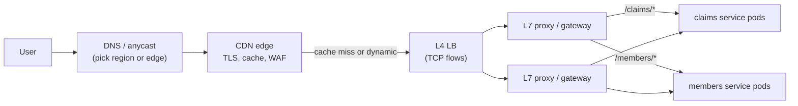
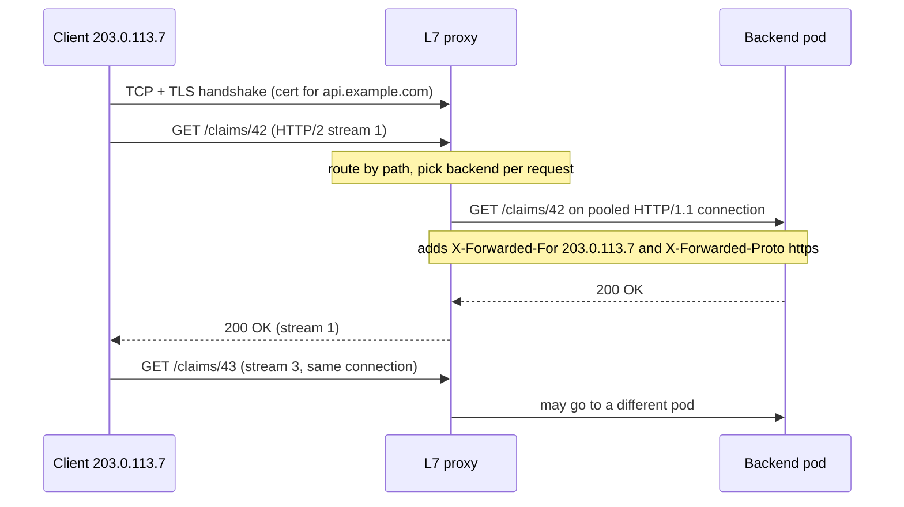
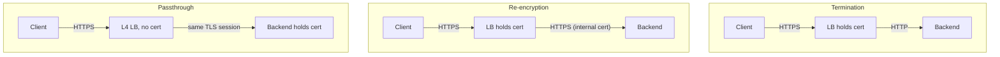

# Load Balancers (L4 vs L7), Reverse Proxies & CDNs

!!! abstract "Key takeaways"
    - An **L4 load balancer** works on TCP/UDP flows: it picks a backend **once per connection** (usually by hashing the 5-tuple) and forwards bytes without reading them. An **L7 load balancer** is a **reverse proxy**: it terminates the client connection, parses each HTTP request, and picks a backend **per request** over its own pooled connections.
    - That difference explains most interview questions: L7 can route by host, path or header, retry, add headers and balance HTTP/2 and gRPC streams; L4 is faster, protocol-agnostic and can pass TLS through untouched, but pins every request on a long-lived connection to one backend.
    - A proxy hides the client. The backend learns the real client IP and scheme from **`X-Forwarded-For` / `X-Forwarded-Proto`** (or RFC 7239 `Forwarded`, or the **PROXY protocol** at L4), and must trust those headers **only from known proxies**, because clients can send them too.
    - Production failures cluster around **timeouts and lifecycle**: backend keep-alive shorter than the proxy's idle timeout gives random **502s**; missing readiness checks, draining and graceful shutdown drop requests during deploys.
    - A **CDN** is a globally distributed reverse proxy with a cache: anycast or DNS steers users to a nearby edge, which terminates TLS, serves cached objects, collapses concurrent misses, shields the origin and absorbs attacks. The danger is caching something personal: shared caches must never store per-user responses.

## Why it matters

A single server is a single point of failure with a ceiling. With two or more, something must pick a server for each user, notice failures and take dead servers out of rotation. Round-robin DNS did this badly (no health, cached for minutes); hardware balancers (F5, NetScaler) and then software (HAProxy, NGINX, Envoy) and cloud services (AWS ALB/NLB, Azure Application Gateway and Front Door, Google Cloud Load Balancing) took over.

Interviewers use this topic to check whether you can place each component in the request path, explain what it can and can't see, and debug the classic failures: 502s, lost client IPs, uneven gRPC load and leaked cached content.

This page covers the networking mechanics. The AWS products are in [EC2, Auto Scaling and ELB/ALB/NLB](../aws/03-compute-ec2-auto-scaling-elb-alb-nlb.md) and [VPC, Route 53 and CloudFront](../aws/09-networking-vpc-subnets-security-groups-vs-nacls-route-53-clo.md); balancing algorithms and scaling are in [scalability and load balancing](../system-design/03-scalability-vertical-vs-horizontal-stateless-services-load-b.md); HTTP caching headers in depth are in [caching strategies and CDN](../system-design/04-caching-strategies-and-cdn.md).

## Core concepts

### The layers in front of a service


*Notice that each layer balances something different: DNS and anycast pick a location, L4 spreads connections across proxies, L7 routes individual requests to services. Smaller systems collapse layers (a single ALB is both L4 and L7).*

### Forward proxy vs reverse proxy

A **forward proxy** acts for clients: they're configured to send outbound traffic through it (`HTTPS_PROXY`, a PAC file) for egress control, filtering and audit (Squid, Zscaler). A **reverse proxy** acts for servers: clients think it *is* the origin, and it handles TLS, routing, load balancing, caching, compression and security (NGINX, HAProxy, Envoy, ALB). A load balancer at L7, an API gateway and a CDN edge are all **reverse proxies** with different emphasis. A gateway adds API concerns (auth, rate limits, request transformation; see [API gateway and BFF](../microservices/03-api-gateway-and-bff-pattern.md)); a CDN adds geographic distribution and caching.

### L4 load balancing: connections, not requests

An L4 balancer sees IPs, ports and TCP/UDP. For a new flow it picks a backend (typically a hash of the 5-tuple: source and destination IP and port, plus protocol) and records it in a **connection table** so later packets follow. It never parses the payload, so it carries anything: HTTPS it can't decrypt, gRPC, database protocols, Kafka, UDP.

Three common forwarding modes:

- **NAT:** the LB rewrites the destination (and often the source, SNAT); both directions flow through it, and with SNAT the backend sees the LB's IP.
- **Direct server return (DSR):** the LB rewrites only the MAC or encapsulates the packet and the backend replies **directly** to the client, so responses (most of the bytes) skip the LB. IPVS "DR" mode, Google's **Maglev** and Facebook's Katran work this way.
- **TCP proxy:** two TCP connections, but the payload is still not parsed (HAProxy `mode tcp`, NGINX `stream`).

At scale the L4 tier is itself a fleet behind ECMP routers; Maglev uses **consistent hashing** plus connection tracking so any balancer sends a given flow to the same backend and membership changes disturb few connections.

### L7 load balancing: a reverse proxy that reads requests

An L7 balancer terminates the client's TCP (and usually TLS) connection, parses HTTP and decides **per request**. So it can:

- route by host, path, header, cookie or weight (`/claims/*` to one service, a canary header to v2);
- balance **each request or HTTP/2 stream**, over warm pooled backend connections;
- **retry** idempotent requests elsewhere, apply per-route timeouts, eject failing backends;
- add headers (`X-Forwarded-For`, trace context), compress, cache, limit body size, run WAF, auth and rate limits;
- translate protocols (HTTP/2 or HTTP/3 outside, HTTP/1.1 inside; WebSocket upgrades; gRPC-Web).

The price: more CPU per request, an extra hop, two connections to tune, and a large blast radius for a bad config change.


*Notice the two independent connections: the client's ends at the proxy, so the backend sees the proxy's IP, not the client's, and learns the original client and scheme only from the headers the proxy adds.*

### Why L4 vs L7 matters for HTTP/2 and gRPC

HTTP/2 and gRPC multiplex many requests over **one long-lived connection** ([HTTP/1.1 vs HTTP/2 vs HTTP/3](02-http-1-1-vs-http-2-vs-http-3.md)). An L4 balancer picks a backend per connection, so a client's requests all go to one backend for hours, and pods added by an autoscaler get nothing until clients reconnect.

{ loading=lazy }
*Watch where the dots land: the L4 balancer never sees requests, only one connection, so it can't spread them.*

This is what happens with gRPC behind a plain **Kubernetes Service** (kube-proxy balances at L4). Fixes, in order of preference:

1. An HTTP/2-aware L7 proxy: mesh sidecar (Envoy, Linkerd), a gRPC-capable ingress, or an ALB gRPC target group.
2. **Client-side balancing** over a headless Service's pod IPs ([client-side load balancing](../microservices/04-service-discovery-and-client-side-load-balancing.md)).
3. A server **max connection age** (gRPC `MaxConnectionAge`) so clients reconnect: a mitigation, not a fix.

### L4 vs L7 at a glance

| | L4 (transport) | L7 (application) |
|---|---|---|
| Unit of balancing | Connection / flow | Request / stream |
| Sees | IPs, ports, TCP/UDP | Full HTTP: method, path, headers, body |
| TLS | Passes through (or terminates, e.g. NLB TLS listener) | Terminates (can re-encrypt to backend) |
| Routing | By port | By host, path, header, cookie, weight |
| Retries | No (can't tell where a request ends) | Yes, per request, idempotent only |
| Client IP at backend | Preserved (no SNAT, DSR) or via PROXY protocol | Via `X-Forwarded-For` / `Forwarded` |
| Examples | AWS NLB, Azure Load Balancer, IPVS/kube-proxy, Maglev, HAProxy `mode tcp` | AWS ALB, Azure Application Gateway, NGINX, Envoy, HAProxy `mode http`, Traefik |

### TLS: terminate, re-encrypt or pass through


*Notice where the plaintext exists: termination exposes it inside the network, re-encryption only inside the proxy, passthrough nowhere but the backend (at the cost of all L7 features).*

- **Termination** is the default: the proxy holds the certificate (ACM, cert-manager, Key Vault) and does the [TLS handshake](03-tls-handshake.md). Regulated environments often also require encryption behind it.
- **Re-encryption** keeps L7 features and encrypts the backend hop; a mesh does this with automatic **mTLS**.
- **Passthrough** needs L4. It can still route by the unencrypted **SNI** in the ClientHello (NGINX `ssl_preread`), but sees no paths or headers. Use it when the backend must own the key (client-certificate auth) or the protocol isn't HTTP.

### Who is the client? Forwarded headers and the PROXY protocol

Behind a proxy, `request.getRemoteAddr()` returns the proxy's IP and `request.getScheme()` says `http` though the user used HTTPS. Proxies pass the originals on:

| Mechanism | Layer | Carries |
|---|---|---|
| `X-Forwarded-For: client, proxy1, proxy2` | L7 header, de facto standard | Client IP plus each proxy appended in order |
| `X-Forwarded-Proto`, `X-Forwarded-Host`, `X-Forwarded-Port` | L7 headers | Original scheme, host, port |
| `Forwarded: for=203.0.113.7;proto=https;host=api.example.com` | L7 header, **RFC 7239** | The same, standardised in one header |
| PROXY protocol v1 (text) / v2 (binary) | Prefix on the TCP connection | Original source/destination IP and port, for L4 proxies that can't add headers |

`X-Forwarded-For` is **client-controllable**: an attacker can send `X-Forwarded-For: 10.0.0.1` and proxies append to it. Read it **from the right**, skip your own proxies, and take the first address that isn't one; or have the **outermost** proxy overwrite it. Getting this wrong breaks IP allow-lists, rate limits and audit logs.

### Health checks, draining and slow start

- **Active checks:** probe **readiness** (`/actuator/health/readiness`), not deep dependencies, or one database blip removes every backend at once.
- **Passive checks / outlier detection:** eject backends that return 5xx or time out on real traffic (NGINX `max_fails`, Envoy); faster than probes.
- **Draining (deregistration delay):** no new requests, in-flight ones finish (ALB default 300 s); the app fails readiness, then shuts down gracefully.
- **Slow start:** ramp traffic to a cold JVM instead of giving it a full share at once.

### Keep-alive and idle timeouts: the classic 502

A proxy keeps **idle backend connections** for reuse, and both sides have an idle timeout. If the backend's is shorter, it closes a connection the proxy still considers usable; the next request on it gets a reset and the client sees an intermittent **502 Bad Gateway**.

{ loading=lazy }
*The side that closes first must be the proxy. Make the backend's keep-alive timeout longer than the load balancer's idle timeout.*

AWS says it for the ALB (idle timeout 60 s by default, 1–4,000 s): keep the application's keep-alive timeout **higher**. Defaults bite: Node.js's `server.keepAliveTimeout` is 5 s; Tomcat's `keepAliveTimeout` falls back to `connectionTimeout` (60 s connector default, 20 s in the stock `server.xml`), equal to or below the ALB's. An NLB silently drops TCP flows idle for 350 s (default; 60–6,000 s since 2024), so idle pooled connections need keepalives shorter than that.

### Balancing algorithms and affinity

In depth in [scalability and load balancing](../system-design/03-scalability-vertical-vs-horizontal-stateless-services-load-b.md): **round robin** for uniform requests, **least outstanding requests** via **power of two choices** (Envoy `LEAST_REQUEST`) for variable cost, **consistent hashing** (ring hash, Maglev) for cache locality. **Sticky sessions** (ALB's `AWSALB` cookie, IP hash) prop up in-memory sessions but unbalance load and lose sessions on failure; prefer stateless services.

### Global load balancing: DNS vs anycast

To pick a **region** or edge location, there are two main tools ([DNS resolution](04-dns-resolution.md)):

- **DNS-based (GSLB):** DNS answers differ by geography, latency or health (Route 53 routing policies, Azure Traffic Manager). Works with any backend, but answers are cached for the TTL, steering uses the **resolver's** location (EDNS Client Subnet helps), and failover waits for caches.
- **Anycast:** the **same IP** is announced via BGP from many sites and routing delivers packets to the nearest. Failover is a route withdrawal and the IP never changes; CDNs, Google Cloud's global LB and AWS Global Accelerator use it.

### CDNs: reverse proxies at the edge

A CDN runs reverse proxies with caches in many points of presence (PoPs). Users reach a nearby PoP (anycast or DNS), which:

- **terminates TLS near the user** (short handshakes) and reuses warm connections to the origin;
- **serves cached responses** per `Cache-Control` (`s-maxage`, `private`, `no-store`) and the **cache key** (path, chosen query parameters and headers, `Vary`);
- uses an **origin shield** (tiered cache) and **request collapsing**, so the origin sees about one request per object, not one per PoP or per user;
- serves stale content with **`stale-while-revalidate`** / **`stale-if-error`** (RFC 5861);
- absorbs **DDoS**, runs **WAF** and bot rules, hides the origin, and runs **edge compute** (CloudFront Functions, Lambda@Edge, Workers).

{ loading=lazy }
*Count the requests that reach the origin: one fetch and one cheap 304 serve every user in the animation.*

Dynamic requests benefit too (edge TLS, warm connections, protection). For invalidation prefer **versioned file names** (`app.3f9a1c.js`, `immutable`, a short-lived `index.html`) to purges.

!!! question "Interview angle"
    "Where would you put the cache?" is often a trap for personalised APIs. A shared cache (CDN, reverse proxy) may only store responses that are identical for everyone who sends the same cache key. Per-user responses need `Cache-Control: private` or `no-store`, or a cache key that includes the identity, which usually destroys the hit ratio.

## In practice: code & configuration

Reading the client IP in a Spring Boot 3 service behind a load balancer:

=== "❌ Common mistake"
    ```java
    @GetMapping("/admin/report")
    ResponseEntity<Report> report(HttpServletRequest request) {
        // Leftmost X-Forwarded-For entry is whatever the CLIENT sent: trivially spoofed.
        String xff = request.getHeader("X-Forwarded-For");
        String clientIp = xff != null ? xff.split(",")[0].trim() : request.getRemoteAddr();

        if (!officeAllowList.contains(clientIp)) {          // attacker sends "X-Forwarded-For: 10.20.0.5"
            return ResponseEntity.status(HttpStatus.FORBIDDEN).build();
        }
        // Redirects built from request.getScheme() also say "http" behind a TLS-terminating LB.
        return ResponseEntity.ok(reportService.build());
    }
    ```

=== "✅ Correct approach"
    ```yaml
    # application.yml: let the server resolve forwarded headers, trusting only our proxies
    server:
      forward-headers-strategy: native        # Tomcat RemoteIpValve (auto-enabled on Kubernetes/Cloud Foundry/Heroku)
      tomcat:
        remoteip:
          internal-proxies: "10\\.20\\.\\d{1,3}\\.\\d{1,3}"   # regex: ONLY the LB/ingress subnet, not all of 10/8
          remote-ip-header: x-forwarded-for
          protocol-header: x-forwarded-proto
        keep-alive-timeout: 75s               # longer than the ALB idle timeout (60 s) to avoid 502s
      shutdown: graceful                      # finish in-flight requests while the LB drains
    spring:
      lifecycle:
        timeout-per-shutdown-phase: 25s
    ```
    ```java
    @GetMapping("/admin/report")
    ResponseEntity<Report> report(HttpServletRequest request) {
        // RemoteIpValve walked X-Forwarded-For from the right, skipped trusted proxies,
        // and set remoteAddr to the first untrusted address: the real client.
        String clientIp = request.getRemoteAddr();
        if (!officeAllowList.contains(clientIp)) {
            return ResponseEntity.status(HttpStatus.FORBIDDEN).build();
        }
        return ResponseEntity.ok(reportService.build()); // request.isSecure() is now true for HTTPS clients
    }
    ```

`framework` instead uses Spring's `ForwardedHeaderFilter` (also handles RFC 7239 `Forwarded`). Either way, headers from untrusted hops are data, not identity.

An NGINX reverse proxy in front of two Spring Boot instances:

```nginx
upstream claims_api {
    least_conn;                                   # variable request cost: prefer the least busy
    server 10.20.1.10:8080 max_fails=3 fail_timeout=10s;   # passive health checks (open-source NGINX)
    server 10.20.1.11:8080 max_fails=3 fail_timeout=10s;
    keepalive 32;                                 # idle keep-alive connections kept per worker
}

server {
    listen 443 ssl;
    http2 on;                                     # NGINX 1.25.1+ syntax
    server_name api.example.com;
    ssl_certificate     /etc/nginx/tls/api.crt;
    ssl_certificate_key /etc/nginx/tls/api.key;

    location /claims/ {
        proxy_pass http://claims_api;
        proxy_http_version 1.1;                   # required for upstream keep-alive
        proxy_set_header Connection "";           # don't forward "Connection: close"
        proxy_set_header Host $host;
        proxy_set_header X-Forwarded-For $remote_addr;   # outermost proxy: overwrite, don't append
        proxy_set_header X-Forwarded-Proto $scheme;

        proxy_connect_timeout 2s;
        proxy_read_timeout 30s;                   # match the route's latency budget
        proxy_next_upstream error timeout;        # retry on another server; POST/PATCH not retried once sent
        proxy_next_upstream_tries 2;
        client_max_body_size 5m;
    }
}
```

!!! tip "Inner proxies append, the edge overwrites"
    Behind another proxy you control, use `$proxy_add_x_forwarded_for` and resolve the client with `set_real_ip_from` + `real_ip_recursive on`.

## Real-world usage

- **Google Maglev** has served Google traffic since 2008 and backs Google Cloud network load balancing: commodity Linux machines behind ECMP, consistent hashing, DSR.
- **AWS** pattern: CloudFront → ALB (accepting only CloudFront traffic) → ECS/EKS; NLB for non-HTTP, static IPs and PrivateLink; Global Accelerator for anycast static IPs.
- **Kubernetes**: a `Service` is L4; `Ingress` and the **Gateway API** are L7; a service mesh adds per-request balancing, retries and mTLS between pods.
- **Incidents:**
    - **Cloudflare, 2 July 2019:** a WAF rule with a pathological regex exhausted edge CPU; sites returned 502s for about half an hour. The proxy layer is shared fate: stage config rollouts.
    - **Fastly, 8 June 2021:** a valid customer config change triggered a latent bug; Fastly reported 95% of its network recovered within 49 minutes, after major sites went down together.
    - **Steam, 25 December 2015:** a caching config change during a DDoS served pages generated for logged-in users to others (about 34,000 users affected): the textbook case against shared-caching personalised responses.
- **Healthcare and banking:** PHI and account data must bypass shared caches (`private, no-store`); policies often demand encryption behind the LB (re-encryption or mesh mTLS); audit logs need the real client IP.

## Trade-offs & production gotchas

| Option | Pros | Cons | Use when |
|---|---|---|---|
| L4 LB (NLB, IPVS) | Fast, cheap per request, any protocol, TLS passthrough, static IPs, source IP preserved | No content routing, no retries, connection-level balancing pins HTTP/2 and gRPC | Non-HTTP, extreme throughput, passthrough, front tier for an L7 fleet |
| L7 LB / reverse proxy (ALB, NGINX, Envoy) | Path/host routing, per-request balancing, retries, header control, WAF, observability | More CPU, extra hop, protocol must be supported, big blast radius for config errors | HTTP/gRPC microservices, most web APIs |
| Re-encryption / mesh mTLS | Encryption on every hop, keeps L7 features | Cert management, CPU | Regulated data (PHI, PCI), zero-trust networks |
| DNS-based global balancing | Simple, any backend | Cached answers, resolver location, slow failover | Region failover with modest RTO |
| Anycast | Fast failover, one IP, nearest PoP | Needs BGP and a global network (or a provider) | CDNs, global edges, DNS |
| CDN | Latency, origin offload, DDoS absorption | Caching mistakes leak data or serve stale content; vendor outage is your outage | Public static assets, cacheable APIs, any public site needing protection |

!!! warning "Gotcha: idle timeout mismatch"
    Random 502s that vanish on retry usually mean the backend closed a pooled connection first. Check every hop (CDN → ALB → ingress → app).

!!! warning "Gotcha: health checks that check too much"
    A readiness check that fails when the database is slow removes **every** instance at once, turning a degradation into an outage. Dependency failures belong in circuit breakers and alerts.

!!! warning "Gotcha: scale-out with long-lived connections"
    New pods behind an L4 balancer get no traffic from clients already holding HTTP/2, gRPC or WebSocket connections, so autoscaling looks broken.

!!! warning "Gotcha: caching errors and cookies"
    A CDN may cache 404s or 5xx (negative caching) after the origin recovers, and a response with `Set-Cookie` must never be shared-cached. Check error TTLs and cookie handling before go-live.

## How this connects to my experience

Not ★ and not a resume claim: position it as working knowledge from the platforms I built on, plus the **AWS Certified Solutions Architect – Associate (2023)** (ELB types, CloudFront, Route 53 are on the syllabus).

- **Where I used it:**
    - **Deloitte, ConvergeHealth Data Asset Explorer:** "cloud-native microservices on AWS using Lambda, EC2, ECS, EKS, API Gateway…" Services on ECS/EKS sit behind load balancers or an ingress. *[confirm: ALB vs NLB, ingress controller used on EKS, whether CloudFront fronted anything]*
    - **OptumRx Meteor:** the **GraphQL Consumer Service** (750K+ users) behind a gateway or LB, and the ReactJS micro-frontend app whose bundles are static assets, typically CDN-served. *[confirm: which LB/gateway and CDN, and whether TLS was re-encrypted to pods]*
    - **Kubernetes (EKS/AKS)** from the skills list: Service (L4) vs Ingress (L7) is the everyday version of this topic. *[confirm: ingress controller]*
- **Talking points:**
    - "GraphQL is one path (`/graphql`), so LB path routing barely helps; what matters is TLS, timeouts matching the query budget, and readiness during deploys." *[confirm timeout values]*
    - "Forwarded headers matter for OAuth2 with PingFederate: a redirect URI built as `http://` behind a TLS-terminating LB breaks login." *[confirm whether this came up]*
    - "Static React assets get long-cache, fingerprinted file names; the HTML shell and authenticated API responses are not shared-cached, because member data is PHI."
- **Likely follow-up chain:** "What sits in front of your service?" → "ALB or NLB, and why?" → "How does your app know the user's IP?" → "Users see occasional 502s, what do you check?" Answer: CDN/LB/ingress/pods layers → L7 for HTTP routing and per-request balancing, NLB only for non-HTTP or static IPs → `X-Forwarded-For` resolved by the server with trusted proxies only → keep-alive vs idle timeout, draining and graceful shutdown on deploys, target health, LB access logs (`elb_status_code` vs `target_status_code`).

## Interview questions

### Fundamentals

??? question "Q1. What is the difference between an L4 and an L7 load balancer?"
    **Answer:** An L4 balancer works on TCP/UDP flows: it picks a backend per connection, usually by hashing the 5-tuple, and forwards bytes without reading them, so it's fast, protocol-agnostic and can pass TLS through. An L7 balancer is a reverse proxy: it terminates the client connection (and usually TLS), parses HTTP, and chooses a backend per request, which enables routing by host/path/header, retries, header injection, WAF and per-stream balancing of HTTP/2 and gRPC, at the cost of more CPU and an extra hop.

    **Interviewer listens for:** connection vs request granularity, termination, what each can see, a concrete consequence (gRPC pinning, path routing).

    **Common wrong answer:** "L7 is just a faster/newer L4" or "L4 balances by IP, L7 by URL" without the connection-vs-request distinction.

??? question "Q2. What's a reverse proxy, and how is it different from a forward proxy?"
    **Answer:** A reverse proxy acts for servers: clients connect to it as if it were the origin, and it forwards to backends while handling TLS, routing, load balancing, caching, compression and security. A forward proxy acts for clients: they're configured to send outbound traffic through it for egress control, filtering or caching. Load balancers at L7, API gateways and CDNs are all reverse proxies.

    **Interviewer listens for:** whom it represents, whether the client knows, typical jobs of each.

    **Common wrong answer:** "A reverse proxy is a proxy that sends responses back."

### Intermediate

??? question "Q3. Your gRPC service on Kubernetes has 10 pods but two of them get almost all the traffic. Why, and how do you fix it?"
    **Answer:** A Kubernetes Service is L4: kube-proxy picks a pod per TCP connection. gRPC uses long-lived HTTP/2 connections that multiplex all calls, so each client stays on the pod it first connected to, and pods added later get nothing. Fix with L7 balancing that understands HTTP/2 (a mesh sidecar such as Envoy or Linkerd, or a gRPC-aware gateway), or client-side balancing using a headless Service so the client sees all pod IPs; as a mitigation, set a server max connection age so clients reconnect and rebalance.

    **Interviewer listens for:** per-connection balancing, HTTP/2 multiplexing, the three fixes.

    **Common wrong answer:** "Change the algorithm to least connections", which still counts connections, not requests.

??? question "Q4. How does a backend behind a load balancer get the client's real IP, and what can go wrong?"
    **Answer:** At L7 the proxy adds `X-Forwarded-For` (and `X-Forwarded-Proto`/`Host`) or RFC 7239 `Forwarded`; at L4 the LB either preserves the source IP (no SNAT, DSR) or prepends the PROXY protocol header. The trap is trust: clients can send their own `X-Forwarded-For`, and proxies append to it, so the leftmost value is attacker-controlled. Resolve from the right, skipping only known proxies (Tomcat's RemoteIpValve with a tight `internal-proxies`, NGINX `real_ip_recursive`), or have the edge overwrite the header. Otherwise IP allow-lists, rate limits and audit logs can be bypassed.

    **Interviewer listens for:** headers vs PROXY protocol, spoofing, right-to-left with trusted proxies.

    **Common wrong answer:** "Take the first IP in X-Forwarded-For."

??? question "Q5. Compare TLS termination, re-encryption and passthrough at the load balancer."
    **Answer:** Termination: the LB holds the certificate and forwards plain HTTP, giving all L7 features and central certificate management, but traffic behind the LB is unencrypted. Re-encryption: the LB terminates and opens a new TLS connection to the backend, keeping L7 features with encryption on every hop (meshes do this with mTLS). Passthrough: an L4 LB forwards the encrypted stream and the backend terminates; the LB can route only by SNI and loses path routing, header injection and WAF, but the backend keeps the key and can do client-certificate auth itself.

    **Interviewer listens for:** where plaintext exists, which features each loses, compliance reasons for re-encryption.

    **Common wrong answer:** "Passthrough is more secure, so always use it."

### Senior

??? question "Q6. Users report intermittent 502 errors through the ALB, mostly under moderate load, and retries succeed. How do you investigate?"
    **Answer:** Check the ALB access logs: `elb_status_code` 502 with a `target_status_code` of `-` means the target didn't return a valid response, often because the connection was closed. The classic cause is a backend keep-alive timeout shorter than the ALB's 60 s idle timeout, so the ALB reuses a connection the backend just closed; fix by setting the app's keep-alive above the LB idle timeout at every hop. Other causes: targets killed during deploys without draining and graceful shutdown, crashes or OOM kills, response headers too large, or a protocol mismatch (HTTPS to an HTTP port). Correlate the 502 timestamps with deploys and pod restarts.

    **Interviewer listens for:** access-log fields, keep-alive race, deploy lifecycle, systematic correlation.

    **Common wrong answer:** "Increase the ALB timeout", which makes the keep-alive race worse.

??? question "Q7. How do you deploy behind a load balancer without dropping requests?"
    **Answer:** New instances join only when **readiness** passes, ideally with slow start. On shutdown: flip readiness to failing (or receive the deregistration), let the LB stop sending new requests, wait out the propagation (a Kubernetes `preStop` sleep, because endpoint removal is asynchronous), then shut down gracefully so in-flight requests finish (`server.shutdown=graceful`), with a deregistration delay longer than the slowest request. Keep long-lived connections in mind: WebSocket and gRPC clients need to reconnect, so send GOAWAY or close politely. Verify with a load test during a rolling deploy watching for 5xx.

    **Interviewer listens for:** readiness, draining, preStop delay, graceful shutdown ordering, long-lived connections.

    **Common wrong answer:** "Kubernetes rolling updates handle it automatically."

### Scenario-based

??? question "Q8. After putting a CDN in front of the member portal, a user reports seeing another member's name on the dashboard. What happened and how do you fix it?"
    **Answer:** A personalised response was stored in a shared cache and served to someone with the same cache key, usually because the origin sent cacheable headers (or none, and the CDN applied a default TTL) and the cache key didn't include identity. Contain first: bypass or purge the cache for that path and treat it as a potential PHI disclosure with the privacy team. Fix: `Cache-Control: private, no-store` on authenticated responses, CDN behaviours that never cache authenticated paths or requests with auth headers or cookies, and a test that asserts these headers. Steam's 2015 incident is the same failure.

    **Interviewer listens for:** shared vs private cache, cache key, incident handling, regulatory angle.

    **Common wrong answer:** "Add the user ID to the URL" without addressing cache headers.

??? question "Q9. A partner needs to allow-list fixed IPs for your HTTPS API, and you also need path-based routing to several services. What do you put in front?"
    **Answer:** An ALB has no static IPs, so put something with fixed addresses in front of it: an NLB with Elastic IPs per AZ forwarding to an ALB target (NLB supports ALB as a target), or AWS Global Accelerator's two static anycast IPs in front of the ALB. The ALB keeps the L7 path routing and WAF; the NLB or accelerator provides the stable IPs. Client IP comes through as `X-Forwarded-For` from the ALB; confirm the chain preserves it end to end.

    **Interviewer listens for:** knowing which LB gives static IPs, layering L4 in front of L7, keeping L7 features.

    **Common wrong answer:** "Give the partner the ALB's current IPs", which change.

## Cheat sheet

| Concept | Remember |
|---|---|
| L4 | Per connection, 5-tuple hash, any protocol, TLS passthrough, no retries |
| L7 | Reverse proxy, per request, routes by host/path/header, retries, adds headers |
| HTTP/2, gRPC | L4 pins all streams to one backend; use L7, client-side LB or max connection age |
| L4 modes | NAT, DSR (responses bypass LB), TCP proxy |
| TLS | Terminate / re-encrypt / pass through (SNI routing only) |
| Client IP | `X-Forwarded-For` from the right, trust only your proxies; RFC 7239 `Forwarded`; PROXY protocol at L4 |
| Spring Boot | `server.forward-headers-strategy=native`, `server.tomcat.remoteip.internal-proxies` |
| 502 race | Backend keep-alive > LB idle timeout (ALB 60 s); NLB TCP idle 350 s default |
| Health | Readiness, not deep dependencies; passive outlier detection; draining; slow start |
| Global | DNS GSLB (TTL, resolver location) vs anycast (one IP, BGP failover) |
| CDN | Edge TLS, cache key, `s-maxage`, origin shield, request collapsing, `stale-while-revalidate`, WAF/DDoS |
| Never | Shared-cache personalised responses or `Set-Cookie` |

## Sources
1. [AWS: Application Load Balancer attributes (connection idle timeout, HTTP client keepalive, X-Forwarded-For processing)](https://docs.aws.amazon.com/elasticloadbalancing/latest/application/edit-load-balancer-attributes.html): 60 s default, 1–4,000 s range, keep application keep-alive above the idle timeout.
2. [AWS: Network Load Balancer configurable TCP idle timeout (2024)](https://aws.amazon.com/blogs/networking-and-content-delivery/introducing-nlb-tcp-configurable-idle-timeout/): 350 s default, 60–6,000 s range.
3. [AWS: Troubleshoot Application Load Balancers (HTTP 502)](https://docs.aws.amazon.com/elasticloadbalancing/latest/application/load-balancer-troubleshooting.html) and [Target group deregistration delay](https://docs.aws.amazon.com/elasticloadbalancing/latest/application/load-balancer-target-groups.html): 502 causes, 300 s default draining.
4. Eisenbud et al., ["Maglev: A Fast and Reliable Software Network Load Balancer"](https://research.google/pubs/maglev-a-fast-and-reliable-software-network-load-balancer/), NSDI 2016: ECMP, consistent hashing, connection tracking, in production since 2008.
5. [RFC 7239: Forwarded HTTP Extension](https://www.rfc-editor.org/rfc/rfc7239) and [HAProxy PROXY protocol specification](https://www.haproxy.org/download/2.9/doc/proxy-protocol.txt): forwarded client information at L7 and L4.
6. [Spring Boot: Running behind a front-end proxy server](https://docs.spring.io/spring-boot/how-to/webserver.html#howto.webserver.use-behind-a-proxy-server) and [Deploying to the cloud](https://docs.spring.io/spring-boot/how-to/deployment/cloud.html): `forward-headers-strategy`, RemoteIpValve, automatic enablement on cloud platforms.
7. [Apache Tomcat 10.1: HTTP connector](https://tomcat.apache.org/tomcat-10.1-doc/config/http.html) and [RemoteIpValve](https://tomcat.apache.org/tomcat-10.1-doc/config/valve.html#Remote_IP_Valve): `keepAliveTimeout` and `connectionTimeout` defaults, right-to-left proxy resolution.
8. [NGINX: ngx_http_upstream_module](https://nginx.org/en/docs/http/ngx_http_upstream_module.html), [ngx_http_proxy_module](https://nginx.org/en/docs/http/ngx_http_proxy_module.html) and [ngx_http_realip_module](https://nginx.org/en/docs/http/ngx_http_realip_module.html): upstream keepalive, `proxy_next_upstream` and non-idempotent requests, real IP resolution.
9. [Envoy: Load balancers](https://www.envoyproxy.io/docs/envoy/latest/intro/arch_overview/upstream/load_balancing/load_balancers) and [Outlier detection](https://www.envoyproxy.io/docs/envoy/latest/intro/arch_overview/upstream/outlier): least request with power of two choices, ring hash and Maglev, passive health checking.
10. [Kubernetes blog: gRPC Load Balancing on Kubernetes without Tears](https://kubernetes.io/blog/2018/11/07/grpc-load-balancing-on-kubernetes-without-tears/): why Services don't balance gRPC requests.
11. [RFC 9111: HTTP Caching](https://www.rfc-editor.org/rfc/rfc9111) and [RFC 5861: stale-while-revalidate and stale-if-error](https://www.rfc-editor.org/rfc/rfc5861): shared vs private caches, `s-maxage`, stale serving.
12. [AWS: Amazon CloudFront Origin Shield](https://docs.aws.amazon.com/AmazonCloudFront/latest/DeveloperGuide/origin-shield.html): tiered caching and request collapsing.
13. [Cloudflare: Details of the Cloudflare outage on July 2, 2019](https://blog.cloudflare.com/details-of-the-cloudflare-outage-on-july-2-2019/), [Fastly: Summary of June 8 outage](https://www.fastly.com/blog/summary-of-june-8-outage) and [Security Affairs: Steam caching configuration exposed 34,000 users' data](https://securityaffairs.com/43189/security/steam-users-data-exposed.html): CDN incidents.
