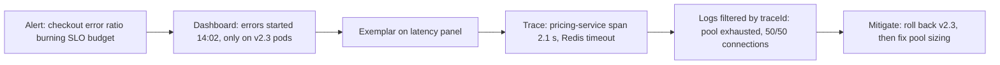
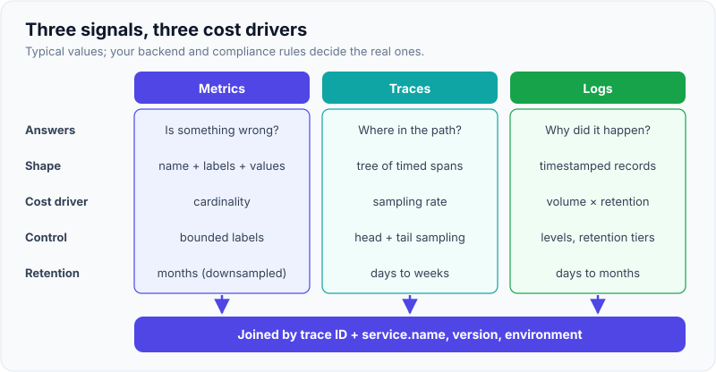

# Logs, Metrics & Traces (Three Pillars)

!!! abstract "Key takeaways"
    - **Metrics** tell you *that* something is wrong (cheap, aggregated numbers over time, ideal for alerts and dashboards). **Traces** tell you *where* (one request's path across services). **Logs** tell you *why* (detailed, per-event context).
    - The pillars are only useful **together**: a shared **trace ID** in every log line, **exemplars** that link a metric bucket to a trace, and the same **`service.name`** and environment labels on all three.
    - Cost is driven by different things: metrics by **cardinality** (unique label combinations), logs by **volume**, traces by **sampling rate**. Never put user IDs or raw URLs in metric labels.
    - Start every service with the **four golden signals** (latency, traffic, errors, saturation), or **RED** for request-driven services and **USE** for resources.
    - **OpenTelemetry** is the vendor-neutral standard for all three signals; in Spring Boot 3, **Micrometer** (metrics + Observation API) and **Micrometer Tracing** bridge into it.

## Why it matters

A monolith fails in one process: you open its log file and read the stack trace. A system of 20 microservices, Kafka topics and managed databases fails *between* processes. The slow request touched six services; the error log is in a different pod from the user-facing timeout; and the pod that logged it has been rescheduled.

**Monitoring** answers questions you knew to ask in advance ("is CPU above 80%?", "is the error rate above 1%?"). **Observability** is the property of being able to answer *new* questions from the outside without shipping new code. The OpenTelemetry primer describes it as understanding "a system from the outside" so you can debug "unknown unknowns". That property comes from the telemetry you emit: if the trace ID isn't in the log line, no dashboard will join them later.

Interviewers use this topic to check whether you have actually supported production: can you go from a page at 2 a.m. to a root cause in minutes, and do you know what each signal costs?

## Core concepts

### The three signals

| | Metrics | Traces | Logs |
|---|---|---|---|
| **Question answered** | Is something wrong? How much? Trend? | Where in the request path? Which dependency? | Why? What exactly happened? |
| **Shape** | Numeric time series: name + labels + value at timestamps | Tree of spans (timed operations) sharing one trace ID | Timestamped records, ideally structured key-value |
| **Aggregation** | Pre-aggregated in the app or at scrape | Per request; aggregated later (service graphs, RED from spans) | Per event; aggregated at query time |
| **Cost driver** | Cardinality (series count) | Sampling rate × spans per trace | Volume (bytes/day) × retention |
| **Typical retention** | Months to a year (downsampled) | Days to weeks | Days to months (compliance can force longer) |
| **Alert on it?** | Yes, primary source | Rarely directly; derive metrics from spans | Sometimes (log-based metrics), carefully |
| **Example tools** | Prometheus, Mimir, CloudWatch metrics, Datadog | Jaeger, Grafana Tempo, Zipkin, X-Ray | Loki, Elasticsearch/OpenSearch, Splunk, CloudWatch Logs |

### Metrics

A metric is a number measured over time and identified by a name and labels, for example `http_server_requests_seconds_count{uri="/orders/{id}",status="500"}`. Four building blocks cover almost everything:

- **Counter**: only goes up (requests, errors, bytes sent). You query its **rate**, not its raw value.
- **Gauge**: goes up and down (queue depth, pool connections in use, heap used).
- **Histogram**: counts observations into buckets (latency ≤ 50 ms, ≤ 100 ms ...), so percentiles can be computed **and aggregated** across instances.
- **Summary**: percentiles computed in the client; cheap to query but **cannot be aggregated** across pods.

Every unique combination of label values is a separate time series. Prometheus's naming guide warns against labels for "user IDs, email addresses, or other unbounded sets of values". A metric with `customerId` as a label and a million customers is a million series per metric, and it will take the metrics backend down before it helps you.

### Traces

A **trace** is the record of one request's journey. It is a tree of **spans**; each span is a timed operation (an HTTP call, a DB query, a Kafka publish) with a name, start and end time, attributes, events and a status. The **trace context** (trace ID + parent span ID + sampled flag) travels between services in the W3C `traceparent` header, so each service attaches its spans to the same tree. The deep dive is in [Distributed tracing with OpenTelemetry](04-distributed-tracing-with-opentelemetry.md).

Traces are the only signal that shows **causality and timing across processes**: "the checkout took 2.4 s because the pricing service waited 2.1 s on a Redis call that timed out."

### Logs

A log is a timestamped record of a discrete event. Unstructured text (`"Order 42 failed for user bob"`) is for humans; **structured logs** (JSON with fields such as `level`, `service`, `traceId`, `orderId`, `error.type`) are for machines and are searchable at scale. Logs carry the detail that metrics aggregate away and traces don't capture: the validation message, the upstream response body summary, the retry count. See [Structured logging & correlation IDs](02-structured-logging-and-correlation-ids.md).

### Connecting the pillars

The value is in the joins:

1. **Trace ID in every log line.** Spring Boot 3 with Micrometer Tracing puts `traceId` and `spanId` in the SLF4J MDC and, by default, in the console pattern. From a trace you jump to its logs; from an error log you open its trace.
2. **Exemplars.** A histogram bucket can carry the trace ID of one example request. On a Grafana latency panel you click the dot on the p99 spike and land on a slow trace.
3. **Shared resource attributes.** `service.name`, `service.version`, `deployment.environment` and the Kubernetes pod name are identical on metrics, traces and logs, so a filter applies to all three.
4. **Metrics from traces.** Collectors and backends (span metrics, service graphs) derive RED metrics from spans, which keeps the two consistent.


*Notice the order: metrics detect, traces localise, logs explain. Each hop works only because the IDs and labels are shared.*

{ loading=lazy }
*Watch the trace ID carried from panel to panel; without it, each hop is a manual time-window search.*

### Golden signals, RED and USE

| Method | Signals | Apply to | Source |
|---|---|---|---|
| Four golden signals | Latency, traffic, errors, saturation | User-facing services | Google SRE book, ch. 6 |
| RED | Rate, Errors, Duration | Request-driven microservices | Tom Wilkie (Grafana Labs) |
| USE | Utilisation, Saturation, Errors | Resources: CPU, memory, disks, pools, queues | Brendan Gregg |

The SRE book adds two rules worth quoting: measure latency of **failed and successful requests separately** ("a slow error is even worse than a fast error"), and watch the **tail**, because "the 99th percentile of one backend can easily become the median response of your frontend."

### Beyond three pillars

The "three pillars" framing is useful for interviews but incomplete. **Continuous profiling** (CPU and allocation flame graphs over time) is being added to OpenTelemetry as a fourth signal; **events** (deploys, feature-flag flips, config changes) annotated on dashboards explain a large share of incidents; and the "wide event" school (Honeycomb) argues for one rich, high-cardinality structured event per request from which metrics are computed at query time. A senior answer acknowledges the framing and then talks about **correlation** rather than silos.

{ loading=lazy }
*Each signal has a different cost driver, so each needs a different control: label limits, sampling, and log levels with retention tiers.*

## In practice: code & configuration

A Spring Boot 3.x service that emits all three signals with consistent identity. Dependencies (Maven coordinates, versions managed by the Boot BOM):

```xml
<!-- Metrics: Actuator + Prometheus registry -->
<dependency><groupId>org.springframework.boot</groupId><artifactId>spring-boot-starter-actuator</artifactId></dependency>
<dependency><groupId>io.micrometer</groupId><artifactId>micrometer-registry-prometheus</artifactId></dependency>
<!-- Traces: Micrometer Tracing bridged to OpenTelemetry, exported over OTLP -->
<dependency><groupId>io.micrometer</groupId><artifactId>micrometer-tracing-bridge-otel</artifactId></dependency>
<dependency><groupId>io.opentelemetry</groupId><artifactId>opentelemetry-exporter-otlp</artifactId></dependency>
```

```yaml
# application.yml (Spring Boot 3.4+)
spring:
  application:
    name: checkout-service
management:
  endpoints.web.exposure.include: health,info,prometheus
  metrics:
    tags:
      application: ${spring.application.name}   # same identity on every metric
      env: ${DEPLOY_ENV:dev}
    distribution:
      percentiles-histogram:
        http.server.requests: true               # buckets -> aggregatable p99 + exemplars
  tracing:
    sampling.probability: 0.1                     # Boot's default is 0.1, stated explicitly
  otlp:
    tracing.endpoint: http://otel-collector:4318/v1/traces
logging:
  structured.format.console: ecs                  # JSON logs; traceId/spanId come from MDC
```

!!! tip "Spring Boot 4"
    In Spring Boot 4.x the single `spring-boot-starter-opentelemetry` replaces the bridge + exporter pair, and the OTLP tracing properties moved to `management.opentelemetry.tracing.export.otlp.*`. Check which line your interviewer's stack uses; the concepts are identical.

One instrumentation point, three signals. The **Observation API** produces a timer metric *and* a span from the same code, and the log line inside it inherits the trace ID:

=== "❌ Common mistake"
    ```java
    @Service
    class PaymentService {
        private static final Logger log = LoggerFactory.getLogger(PaymentService.class);
        private final MeterRegistry registry;

        PaymentResult charge(String customerId, Money amount) {
            long start = System.currentTimeMillis();
            log.info("Charging customer " + customerId + " amount " + amount); // string concat, PII, unstructured
            PaymentResult r = gateway.charge(customerId, amount);
            // customerId as a tag: one time series per customer -> cardinality explosion
            registry.timer("payment.time", "customer", customerId)
                    .record(System.currentTimeMillis() - start, TimeUnit.MILLISECONDS);
            return r;                                                      // no span: invisible in traces
        }
    }
    ```

=== "✅ Correct approach"
    ```java
    @Service
    class PaymentService {
        private static final Logger log = LoggerFactory.getLogger(PaymentService.class);
        private final ObservationRegistry observations;
        private final PaymentGateway gateway;

        PaymentService(ObservationRegistry observations, PaymentGateway gateway) {
            this.observations = observations;
            this.gateway = gateway;
        }

        PaymentResult charge(String customerId, Money amount) {
            return Observation.createNotStarted("payment.charge", observations)
                    .lowCardinalityKeyValue("payment.method", amount.method().name()) // bounded: metric tag + span attr
                    .highCardinalityKeyValue("customer.ref", hash(customerId))       // span attribute only, never a metric tag
                    .observe(() -> {
                        // traceId/spanId are already in MDC, so this line joins the trace
                        log.atInfo().addKeyValue("amount.minor", amount.minorUnits())
                           .log("charging payment");
                        return gateway.charge(customerId, amount);                    // errors recorded on metric + span
                    });
        }
    }
    ```

The correct version yields a `payment_charge_seconds` histogram tagged only by bounded values, a `payment.charge` span carrying the hashed customer reference, and a structured log line with the trace ID. Low-cardinality key-values become metric tags and span attributes; high-cardinality ones go **only** to spans.

A quick PromQL check that the golden signals are there:

```promql
# Traffic (requests/s) and error ratio per service, 5-minute window
sum by (application) (rate(http_server_requests_seconds_count[5m]))
sum by (application) (rate(http_server_requests_seconds_count{status=~"5.."}[5m]))
  / sum by (application) (rate(http_server_requests_seconds_count[5m]))

# p99 latency, aggregated correctly across pods from histogram buckets
histogram_quantile(0.99, sum by (le, application) (rate(http_server_requests_seconds_bucket[5m])))
```

## Real-world usage

- **Google** built Dapper (2010 paper) for low-overhead sampled tracing; it inspired Twitter's **Zipkin**, Uber's **Jaeger** and, through OpenTracing and OpenCensus, today's **OpenTelemetry**, a CNCF project supported by every major vendor.
- **Grafana's LGTM stack** (Loki logs, Grafana, Tempo traces, Mimir metrics) is built around the joins described above: exemplars from Mimir to Tempo, trace-to-logs from Tempo to Loki by trace ID.
- **AWS** offers CloudWatch metrics and logs plus X-Ray traces, and the AWS Distro for OpenTelemetry (ADOT) to export OTel data to them; **Azure Monitor / Application Insights** ingests OpenTelemetry too.
- **Healthcare and banking:** telemetry is a data-leak path. Member IDs, names, card numbers and tokens must never appear in metric labels or logs; span attributes need the same review. Retention for audit logs is often mandated separately from debugging logs.

## Trade-offs & production gotchas

| Option | Pros | Cons | Use when |
|---|---|---|---|
| Metrics-first (Prometheus) | Cheap, fast queries, great for alerting | No per-request detail; cardinality limits | Always: the baseline for every service |
| Logs-first (ELK, Splunk) | Rich detail, ad-hoc search | Expensive at volume; slow for trends | Debugging, audit, business events |
| Traces (OTel + Tempo/Jaeger) | Cross-service causality, latency breakdown | Sampling hides rare cases unless tail-sampled; instrumentation gaps | Microservices, fan-out APIs, async flows |
| Wide events (Honeycomb style) | One source of truth, high-cardinality questions | Needs a backend built for it; cost model differs | Teams optimising for exploratory debugging |
| All-in-one vendor APM | Fast to adopt, correlation built in | Cost, lock-in, agent opacity | Small platform teams, short timelines |

!!! warning "Gotchas"
    - **Cardinality explosions** are the most common way teams break Prometheus: raw URLs with IDs (`/orders/123`), user IDs, exception messages as label values. Use route templates and bounded enums.
    - **Averages lie.** A 120 ms average can hide a 4 s p99. Use histograms and percentiles; never average percentiles across pods.
    - **Log volume is a bill.** DEBUG left on in production, or logging every Kafka message payload, can cost more than the service. Sample noisy logs; keep audit logs separate.
    - **Sampling hides errors.** At 10% head sampling, 90% of failing requests have no trace. Use tail sampling in the Collector to keep errors and slow traces.
    - **Clock skew** across hosts makes spans appear to start before their parent. Backends compensate partly; keep NTP healthy.

!!! question "Interview angle"
    "We have logs. Why do we need metrics and traces?" Strong answer: logs are expensive to aggregate and can't tell you a trend or a p99 cheaply (metrics), or which of six services added the latency (traces). Then name the joins: trace ID in logs, exemplars, shared service labels.

## How this connects to my experience

- **Where I used it:** not a ★ resume claim. The closest bridge is "Led ... release management, and production support" and the OptumRx Meteor GraphQL Consumer Service, which integrates 5 upstream systems: in an aggregation layer, "which upstream is slow?" is exactly the question traces and per-upstream metrics answer.
- **Talking points:**
    - Which signals the team relied on in production support and what tool held each. *[confirm: e.g. Splunk/ELK for logs, Prometheus/Grafana or a vendor APM, whether tracing existed]*
    - Per-upstream latency and error metrics on the GraphQL layer, and whether trace IDs were in logs. *[confirm]*
    - At Deloitte (AWS Lambda, ECS, EKS), CloudWatch metrics and logs are the default path. *[confirm whether X-Ray or ADOT was used]*
- **Likely follow-up chain:** "How did you find which upstream was slow?" → "How did you correlate logs across services?" → "What would you add now?" Answer with per-upstream RED metrics, trace ID in MDC, and (if not used then) say plainly that you would add OTel tracing with tail sampling, rather than claiming it.

## Interview questions

### Fundamentals

??? question "Q1. What are the three pillars of observability and what is each best at?"
    **Answer:** Metrics are aggregated numeric time series, best for detecting problems, trends and alerting cheaply. Traces record one request across services as a tree of timed spans, best for locating where latency or errors come from. Logs are per-event records with detail, best for explaining why something happened. They are most valuable when linked by trace ID and shared service labels.

    **Interviewer listens for:** "that / where / why", plus the idea of correlation.

    **Common wrong answer:** describing them as three separate tools with no link between them.

??? question "Q2. What is the difference between monitoring and observability?"
    **Answer:** Monitoring checks predefined conditions you knew to watch (known unknowns): dashboards and threshold alerts. Observability is the ability to ask new questions of a system from its telemetry without deploying new code (unknown unknowns). It depends on rich, correlated, high-cardinality-friendly telemetry, mainly traces and structured events.

    **Interviewer listens for:** known vs unknown unknowns; observability as a property of the system and its telemetry, not a product.

    **Common wrong answer:** "Observability is just monitoring with a new name."

??? question "Q3. What are the four golden signals? How do RED and USE differ?"
    **Answer:** Latency, traffic, errors and saturation (Google SRE book). RED (rate, errors, duration) is the request-service subset; USE (utilisation, saturation, errors) is for resources like CPU, disks, connection pools and queues. Use RED per service and endpoint, USE per resource.

    **Interviewer listens for:** saturation as "how full", and separating latency of errors from successes.

    **Common wrong answer:** listing CPU and memory as the golden signals.

### Intermediate

??? question "Q4. What is cardinality and why does it matter for metrics?"
    **Answer:** The number of unique label-value combinations, each of which is a separate time series. Memory, storage and query cost scale with series count. Unbounded labels such as user IDs, order IDs, raw URLs or exception messages can create millions of series and crash or bankrupt the backend. Keep labels bounded (route templates, status class, enum values) and put high-cardinality detail on spans or logs.

    **Interviewer listens for:** the per-combination multiplication and a concrete fix (route template, MeterFilter).

    **Common wrong answer:** "Cardinality is how many metrics you have."

??? question "Q5. How do you correlate a metric spike with logs and traces?"
    **Answer:** Use exemplars on histogram metrics to jump from the spike to a sample trace; the trace shows which span is slow; the trace ID in every structured log line lets you filter logs for that request. Shared resource labels (`service.name`, version, pod) let you filter all three by the same dimensions, and deploy events annotated on dashboards explain many spikes.

    **Interviewer listens for:** exemplars and trace ID in MDC, not "search logs around that time".

    **Common wrong answer:** grep logs by timestamp across every pod.

??? question "Q6. Why are percentiles from a summary not aggregatable, and what do you use instead?"
    **Answer:** A summary computes p99 inside each instance; the p99 of a fleet is not the average (or max) of per-pod p99s. Histograms export bucket counts, which can be summed across pods and then turned into a percentile with `histogram_quantile`. In Micrometer, enable `percentiles-histogram` for the timers you need.

    **Interviewer listens for:** "sum the buckets, then compute the quantile".

    **Common wrong answer:** `avg(p99)` across pods.

### Senior

??? question "Q7. How would you control observability cost in a 100-service platform?"
    **Answer:** Treat each signal's cost driver separately. Metrics: cardinality budgets per service, MeterFilters, recording rules, downsampling for long retention. Traces: head sampling at a few percent plus tail sampling that keeps all errors and slow traces. Logs: INFO by default, structured, sampled for high-volume paths, tiered retention (hot 7–14 days, cold archive), audit logs separate. Make cost visible per team.

    **Interviewer listens for:** different controls per signal and ownership/showback.

    **Common wrong answer:** "Reduce retention for everything."

??? question "Q8. Is 'three pillars' the right model?"
    **Answer:** It's a useful vocabulary but it encourages silos. What matters is correlation and the ability to slice by high-cardinality fields. Profiles are becoming a fourth signal in OpenTelemetry; change events (deploys, flags) explain many incidents; wide structured events can generate metrics and replace some logs. I'd design for shared context (trace ID, resource attributes) rather than three tools.

    **Interviewer listens for:** nuance without dismissing the basics.

    **Common wrong answer:** rigid defence or rejection of the framing with no alternative.

### Scenario-based

??? question "Q9. Users report checkout is 'sometimes slow', but the average latency dashboard is flat. What do you do?"
    **Answer:** Look at p95/p99 from histograms, split by endpoint, status and version; check whether slow requests cluster on one pod, region or upstream. Click an exemplar on the p99 to open slow traces and see which span dominates. Read logs for those trace IDs. If there are no histograms or traces, add them: averages cannot show a tail.

    **Interviewer listens for:** distrust of averages and a concrete pivot path.

    **Common wrong answer:** "The dashboard says it's fine."

??? question "Q10. Prometheus memory usage doubled after a release. What happened?"
    **Answer:** Almost certainly a cardinality explosion: a new label with unbounded values (raw path, user ID, error message) or a new histogram with many buckets per label combination. Find it with the TSDB status page or `topk(10, count by (__name__)({__name__=~".+"}))`, then drop the label with a MeterFilter or relabelling, and add a CI check or series limit per scrape target.

    **Interviewer listens for:** cardinality diagnosis and prevention (sample_limit, review).

    **Common wrong answer:** "Give Prometheus more memory."

## Cheat sheet

| Concept | Remember |
|---|---|
| Metrics / traces / logs | That / where / why |
| Cost drivers | Cardinality / sampling rate / volume × retention |
| Joins | Trace ID in MDC, exemplars, shared `service.name` + version labels |
| Counter vs gauge | Counter only increases: query `rate()`; gauge goes up and down |
| Histogram vs summary | Histogram buckets aggregate across pods; summary percentiles don't |
| Golden signals | Latency, traffic, errors, saturation |
| RED / USE | Services / resources |
| Boot 3 defaults | Trace sampling 0.1; `traceId`/`spanId` in MDC and log correlation pattern |
| Never as labels | User/order IDs, raw URLs, emails, exception messages |

## Sources
1. [OpenTelemetry: Observability primer](https://opentelemetry.io/docs/concepts/observability-primer/): definitions of observability, telemetry, logs, spans and traces.
2. [Google SRE book, ch. 6: Monitoring Distributed Systems](https://sre.google/sre-book/monitoring-distributed-systems/): four golden signals, slow errors, tail latency, symptoms vs causes.
3. [Prometheus: Metric and label naming](https://prometheus.io/docs/practices/naming/): base units, `_total`, cardinality warning.
4. [Micrometer: Histograms and percentiles](https://docs.micrometer.io/micrometer/reference/concepts/histogram-quantiles.html): client-side percentiles are not aggregable; percentile histograms are.
5. [Spring Boot reference: Tracing](https://docs.spring.io/spring-boot/reference/actuator/tracing.html): 10% default sampling, log correlation IDs from MDC, Observation API, Boot 4 starter.
6. [Spring Boot reference: Logging](https://docs.spring.io/spring-boot/reference/features/logging.html): structured logging formats (ECS, GELF, Logstash).
7. [Dapper, a Large-Scale Distributed Systems Tracing Infrastructure (Google, 2010)](https://research.google/pubs/dapper-a-large-scale-distributed-systems-tracing-infrastructure/): origin of modern sampled tracing.
8. [Brendan Gregg: The USE Method](https://www.brendangregg.com/usemethod.html) and [Grafana: The RED method](https://grafana.com/blog/2018/08/02/the-red-method-how-to-instrument-your-services/): resource and service methods.
9. [Grafana docs: Exemplars](https://grafana.com/docs/grafana/latest/fundamentals/exemplars/): linking metric samples to traces.
