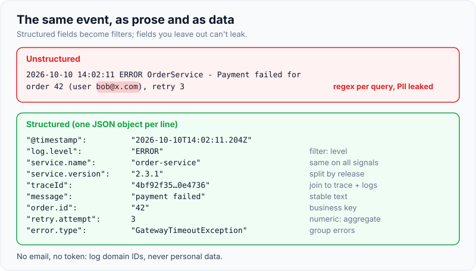
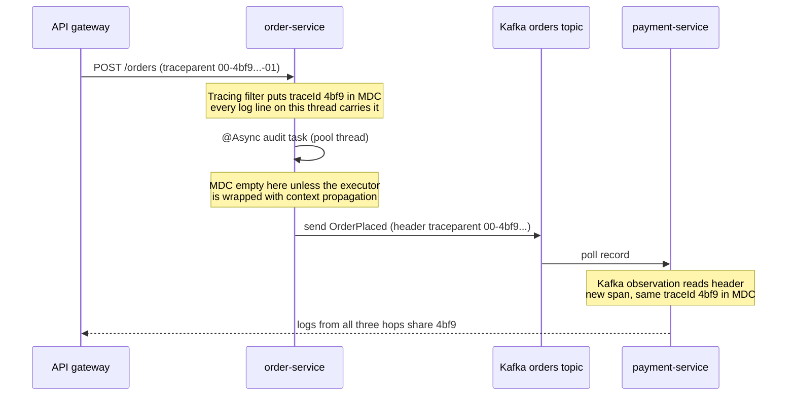

# Structured Logging & Correlation IDs

!!! abstract "Key takeaways"
    - A **structured log** is one event as key-value data (usually one JSON object per line), so a log backend can filter `level=ERROR AND orderId=42` instead of running regexes over prose.
    - A **correlation ID** is one value shared by every log line of one request or business flow. In a traced system the **W3C trace ID** *is* the correlation ID; a separate business ID (order, claim) can travel as **baggage**.
    - In Java the ID lives in the **MDC** (a thread-local map). Thread-locals do not cross thread pools, `@Async`, reactive operators or Kafka on their own: you need **context propagation** (Micrometer Context Propagation, task decorators, message headers).
    - Spring Boot **3.4+** has built-in structured logging: `logging.structured.format.console=ecs` (or `logstash`, `gelf`); Micrometer Tracing puts `traceId` and `spanId` into the MDC automatically.
    - Logs are a **cost and a data-leak path**: log at INFO, use parameterised messages, never log tokens, passwords, card numbers or patient data, and keep audit logs separate from debug logs.

## Why it matters

When one user action crosses an API gateway, three services and a Kafka topic, its log lines end up in thousands of lines per second from dozens of pods. Without a shared ID you search by timestamp and guess. With unstructured text you write a regex per service, and it breaks the day someone rewords a message.

Structured logging and correlation IDs fix both problems: every line is a record with known fields, and every record of one request carries the same ID. In [Logs, metrics & traces](01-logs-metrics-and-traces.md) that ID is the join between the pillars; this page is about producing it correctly.

Interviewers ask about this because it separates people who have debugged production from people who have only read about it. The follow-ups are always about the edges: "what happens to the ID on an `@Async` method?", "how does it cross Kafka?", "what must never go in a log?".

## Core concepts

### Unstructured vs structured

```text
2026-10-10 14:02:11 ERROR OrderService - Payment failed for order 42 (user bob@x.com), retry 3
```

```json
{"@timestamp":"2026-10-10T14:02:11.204Z","log.level":"ERROR","service.name":"order-service",
 "service.version":"2.3.1","traceId":"4bf92f3577b34da6a3ce929d0e0e4736","spanId":"00f067aa0ba902b7",
 "message":"payment failed","order.id":"42","retry.attempt":3,"error.type":"GatewayTimeoutException"}
```

The second line answers questions the first can't without parsing: "all `GatewayTimeoutException` errors on version 2.3.1 in the last hour", "every line for trace `4bf9…`". It also left out the email address, which the first line leaked. (Field names are illustrative ECS-style; Spring Boot's encoder writes MDC entries under their MDC keys, such as `traceId`.)

Use a **standard schema** so fields mean the same thing in every service: Elastic Common Schema (ECS), the Logstash JSON layout, GELF, or the OpenTelemetry log data model and semantic conventions. A shared schema is what lets one dashboard query span 50 services.

{ loading=lazy }
*Every field you split out becomes a filter; every field you leave out (like the email) is one less leak.*

### Correlation ID vs trace ID vs business ID

| ID | Scope | Who creates it | Travels as |
|---|---|---|---|
| **Trace ID** (W3C) | One distributed request, all services | First instrumented hop (gateway or edge service) | `traceparent` header, Kafka header |
| **Span ID** | One operation inside the trace | Each service, per operation | `traceparent` (as parent ID) |
| **Correlation / request ID** (legacy) | One request | Gateway or load balancer (`X-Request-ID`, `X-Correlation-ID`, `X-Amzn-Trace-Id`) | Custom header |
| **Business ID** | One order, claim or member journey, possibly many requests | Domain code | Baggage, message payload, log field |

Before OpenTelemetry, teams wrote a servlet filter that read or generated `X-Correlation-ID` and put it in the MDC. That still works, but if you already run Micrometer Tracing or the OTel agent, the **trace ID is the better correlation ID**: it is generated for you, propagated by every instrumented client, and links logs to the trace. Keep a custom header only for systems outside your tracing (a partner API, a legacy mainframe) and log it as an extra field.

### How the MDC works

SLF4J's **Mapped Diagnostic Context** is a per-thread `Map<String,String>`. The logging backend copies it into every event logged on that thread, and structured encoders write each entry as a JSON field. Micrometer Tracing updates `traceId` and `spanId` in the MDC when a span becomes current and removes them when the scope closes.

Because it is thread-local, the MDC breaks exactly where the work changes thread:

- `@Async` methods and `ExecutorService` tasks run on pool threads with someone else's (or no) MDC.
- `CompletableFuture.supplyAsync` without an executor uses the common pool.
- Reactor (WebFlux) hops threads between operators; the MDC is not the source of truth there, the Reactor `Context` is.
- Kafka: the consumer thread has nothing to do with the producer's thread or process.
- Virtual threads (Java 21) each have their own thread-locals; a new virtual thread starts with an empty MDC.


*Notice that the ID survives the network hops because it is in a header, but would be lost on the `@Async` hop inside the same JVM unless the executor propagates context.*

{ loading=lazy }
*Watch the log lines on the right: the gap appears only at the thread-pool hop, not at the network hops.*

### Propagation mechanisms in Spring Boot 3

- **HTTP in:** the Observation filter on Spring MVC/WebFlux reads `traceparent` (W3C, the default) or B3 headers.
- **HTTP out:** clients built from the auto-configured `RestClient.Builder`, `WebClient.Builder` or `RestTemplateBuilder` add the header. A `new RestTemplate()` does not.
- **Kafka:** set `spring.kafka.template.observation-enabled=true` and `spring.kafka.listener.observation-enabled=true`; the trace context goes in record headers.
- **Thread pools:** wrap executors with `ContextExecutorService.wrap(...)` from Micrometer Context Propagation, or set a `ContextPropagatingTaskDecorator` on Spring's `ThreadPoolTaskExecutor`.
- **Reactor:** `Hooks.enableAutomaticContextPropagation()` (Reactor 3.5.3+), or `spring.reactor.context-propagation=auto` in Boot 3.2+, restores the MDC from the Reactor context in each operator.
- **Business IDs:** `management.tracing.baggage.remote-fields=x-claim-id` sends a baggage field over the wire; `management.tracing.baggage.correlation.fields=x-claim-id` also copies it into the MDC so it appears in logs.

### Log levels and what to log

| Level | Use for | Production default |
|---|---|---|
| ERROR | Request or job failed, needs attention | On |
| WARN | Unexpected but handled (fallback used, retry) | On |
| INFO | Business-significant events (order placed, job finished), one or two per request | On |
| DEBUG | Developer detail | Off; enable per logger at runtime via `/actuator/loggers` |
| TRACE | Very verbose internals | Off |

Log **events and decisions**, not every line of code. A good rule: one INFO line at the end of each request (the "canonical log line" Stripe popularised) with status, latency, user tier and IDs is more useful than ten scattered lines.

## In practice: code & configuration

Built-in JSON logs with trace correlation and a business ID (Spring Boot 3.4+, Micrometer Tracing on the classpath):

```yaml
spring:
  application:
    name: order-service
logging:
  structured:
    format:
      console: ecs                      # one ECS JSON object per line on stdout
    ecs:
      service:
        version: ${APP_VERSION:dev}     # appears as service.version
        environment: ${DEPLOY_ENV:dev}
  level:
    root: INFO
    com.example.orders: INFO
management:
  tracing:
    sampling.probability: 0.1           # logs keep traceId even when the trace isn't sampled
    baggage:
      remote-fields: x-claim-id         # propagate business ID over HTTP and Kafka
      correlation.fields: x-claim-id    # and copy it into MDC, so it lands in every log line
spring.kafka:
  template.observation-enabled: true
  listener.observation-enabled: true
```

=== "❌ Common mistake"
    ```java
    @Service
    class OrderService {
        private static final Logger log = LoggerFactory.getLogger(OrderService.class);
        private final ExecutorService pool = Executors.newFixedThreadPool(8); // plain pool: MDC lost

        void place(Order order, String bearerToken) {
            // string concatenation runs even if INFO is off; token and email leak into logs
            log.info("Placing order " + order + " for " + order.email() + " token=" + bearerToken);
            MDC.put("orderId", order.id());              // never removed: leaks to the next request on this thread
            pool.submit(() -> log.info("auditing"));     // runs with no traceId and no orderId
        }
    }
    ```

=== "✅ Correct approach"
    ```java
    @Configuration
    class ExecutorConfig {
        @Bean
        ThreadPoolTaskExecutor auditExecutor() {
            var ex = new ThreadPoolTaskExecutor();
            ex.setCorePoolSize(8);
            ex.setTaskDecorator(new ContextPropagatingTaskDecorator()); // copies tracing context + MDC to the worker
            return ex;
        }
    }

    @Service
    class OrderService {
        private static final Logger log = LoggerFactory.getLogger(OrderService.class);
        private final ThreadPoolTaskExecutor auditExecutor;

        OrderService(ThreadPoolTaskExecutor auditExecutor) { this.auditExecutor = auditExecutor; }

        void place(Order order) {
            try (var ignored = MDC.putCloseable("order.id", order.id())) { // removed when the block ends
                log.atInfo()
                   .addKeyValue("order.items", order.items().size())      // JSON field, no string building
                   .addKeyValue("order.channel", order.channel())
                   .log("order placed");                                  // no PII, no token
                auditExecutor.execute(() -> log.info("audit queued"));    // same traceId and order.id
            }
        }
    }
    ```

For a service outside the tracing setup, the classic correlation filter is short. It reuses an incoming ID, generates one if missing, returns it to the caller and always clears the MDC:

```java
@Component
@Order(Ordered.HIGHEST_PRECEDENCE)
class CorrelationIdFilter extends OncePerRequestFilter {
    static final String HEADER = "X-Correlation-ID";

    @Override
    protected void doFilterInternal(HttpServletRequest req, HttpServletResponse res, FilterChain chain)
            throws ServletException, IOException {
        String id = Optional.ofNullable(req.getHeader(HEADER))
                .filter(v -> v.matches("[A-Za-z0-9-]{8,64}"))   // validate: never trust raw header into logs
                .orElseGet(() -> UUID.randomUUID().toString());
        MDC.put("correlation.id", id);
        res.setHeader(HEADER, id);                               // support can quote it from the client
        try {
            chain.doFilter(req, res);
        } finally {
            MDC.remove("correlation.id");                        // pooled threads: always clean up
        }
    }
}
```

On the browser side, a React 19 app can send the same header and show it in error screens so users and support can quote it:

```ts
export async function api<T>(path: string, init: RequestInit = {}): Promise<T> {
  const id = crypto.randomUUID();                       // one ID per user action
  const res = await fetch(path, { ...init, headers: { ...init.headers, "X-Correlation-ID": id } });
  if (!res.ok) throw new Error(`Request failed (ref ${res.headers.get("X-Correlation-ID") ?? id})`);
  return res.json() as Promise<T>;
}
```

## Real-world usage

- **Stripe** describes "canonical log lines": one dense, structured line per request with all key facts, which became the basis for many of their internal analytics. The idea is the same as Honeycomb's "wide events".
- **AWS** load balancers add `X-Amzn-Trace-Id`; API Gateway exposes `$context.requestId`; CloudWatch Logs Insights queries JSON fields directly (`filter level = "ERROR" | stats count() by service`).
- **Kubernetes** collects stdout per container; agents such as Fluent Bit or the OpenTelemetry Collector ship JSON lines to Loki, Elasticsearch or Splunk and add pod, namespace and node fields. This is why apps should log JSON to stdout, not to files inside the container.
- **Healthcare and banking:** HIPAA and PCI DSS make logs part of the compliance scope. PHI, card numbers (PAN) and credentials must not be logged; PCI DSS also requires that audit logs exist, are protected and are retained (at least a year, three months immediately available). Masking at the source plus a redaction processor in the pipeline is the usual defence in depth.

## Trade-offs & production gotchas

| Option | Pros | Cons | Use when |
|---|---|---|---|
| Boot 3.4+ built-in structured logging | Zero extra deps, ECS/Logstash/GELF, MDC + key-values included | Fewer knobs than dedicated encoders | New services on Boot 3.4+ |
| logstash-logback-encoder | Mature, very configurable, markers and arguments | Extra dependency and XML config | Boot < 3.4 or custom layouts |
| OTel Java agent log bridge (OTLP logs) | Logs, traces, metrics in one pipeline with resource attributes | Newer; backend must accept OTLP logs | OTel-first platforms |
| Custom `X-Correlation-ID` filter | Simple, works without tracing | Hand-propagate to every client, queue and pool | Legacy or partner boundaries |
| Trace ID as correlation ID | Automatic propagation, links to traces | Needs tracing instrumentation everywhere | Default for Boot 3 microservices |

!!! warning "Gotchas"
    - **MDC leaks across requests** when you `put` without `remove` on pooled threads (Tomcat, executors). Use `MDC.putCloseable` or `try/finally`.
    - **Unsampled requests still have trace IDs.** With 10% sampling, the log line has a trace ID for which no trace exists. That's fine for log correlation; just don't expect every ID to open a trace.
    - **Log injection:** writing raw user input (headers, query strings) into text logs lets attackers forge lines with `\n`. JSON encoders escape it; still validate IDs you accept from headers (OWASP Logging Cheat Sheet).
    - **Exceptions as strings:** `log.error("failed: " + e.getMessage())` drops the stack trace. Pass the exception as the last argument: `log.error("payment failed", e)`.
    - **Volume:** a DEBUG line per Kafka record at 5,000 msg/s is 432 million lines a day. Sample, aggregate into metrics, or log only failures.

!!! question "Interview angle"
    "How do you trace one user's request across 10 microservices using logs only?" Strong answer: the edge assigns a trace ID (W3C `traceparent`), every service propagates it through instrumented clients and Kafka headers, it sits in the MDC, a JSON encoder writes it as a field, and the log backend filters by it. Then mention the thread-pool gotcha unprompted.

## How this connects to my experience

- **Where I used it:** not a ★ resume claim. Bridges: "Led ... production support" on OptumRx Meteor, the GraphQL Consumer Service that fans out to 5 upstream systems, and "Kafka-based event-driven workflows with retry and DLQ handling", where a message that ends up in a DLQ is only debuggable if its trace or correlation ID survived the retries.
- **Talking points:**
    - How a request was followed from the React app through the GraphQL layer to the upstreams: which header or ID, and which log tool. *[confirm: e.g. Splunk/ELK/CloudWatch, X-Correlation-ID vs trace ID]*
    - Whether Kafka headers carried the ID into consumers and into DLQ records. *[confirm]*
    - PHI-safe logging in a healthcare app serving 750K+ users: what was masked and how. *[confirm the actual rules used]*
- **Likely follow-up chain:** "How did you correlate?" → "What happened on async boundaries?" → "How did you stop PHI reaching logs?" Answer with the MDC + propagation story, the task-decorator fix, and source masking plus pipeline redaction; if a piece wasn't in place, say what you would add.

## Interview questions

### Fundamentals

??? question "Q1. What is structured logging and why is it better than plain text?"
    **Answer:** Each log event is emitted as key-value data, typically one JSON object per line with consistent field names (timestamp, level, service, trace ID, message, domain fields). Backends index fields, so you can filter and aggregate without regexes, and changing the message text doesn't break queries. A shared schema (ECS, OTel) lets one query span all services.

    **Interviewer listens for:** fields over prose, a shared schema, one JSON object per line to stdout.

    **Common wrong answer:** "It's prettier formatting."

??? question "Q2. What is a correlation ID and how is it different from a trace ID?"
    **Answer:** A correlation ID is any value shared by all log lines of one request or flow. A W3C trace ID is a standardised correlation ID that tracing libraries create and propagate automatically and that also identifies the trace. With tracing in place, use the trace ID as the correlation ID and add business IDs (order, claim) as baggage or log fields.

    **Interviewer listens for:** trace ID as the default; business IDs as a separate, longer-lived key.

    **Common wrong answer:** generating a new UUID in every service.

??? question "Q3. What is the MDC?"
    **Answer:** SLF4J's Mapped Diagnostic Context, a thread-local map whose entries are added to every log event on that thread. Tracing and filters put IDs there. Because it's thread-local, it must be cleared after each request and copied when work moves to another thread.

    **Interviewer listens for:** thread-local, cleanup, propagation.

    **Common wrong answer:** "A global map of request data."

### Intermediate

??? question "Q4. Your @Async method's logs have no trace ID. Why, and how do you fix it?"
    **Answer:** `@Async` runs on a pool thread whose MDC and tracing context are not the caller's. Configure the executor with `ContextPropagatingTaskDecorator` (Micrometer Context Propagation), or wrap an `ExecutorService` with `ContextExecutorService.wrap`. For Reactor, enable automatic context propagation. Then the span and MDC are restored on the worker and cleared afterwards.

    **Interviewer listens for:** thread-local cause and a library-level fix rather than manual copying everywhere.

    **Common wrong answer:** "Pass the ID as a method parameter to every method."

??? question "Q5. How does a correlation ID cross Kafka?"
    **Answer:** In record headers. With observation enabled on `KafkaTemplate` and the listener container, Spring Kafka writes `traceparent` into headers on send and starts a consumer span from it on receive, so the consumer's MDC has the same trace ID. Retries and DLQ forwarding keep the original headers, so a dead-lettered record still carries the ID.

    **Interviewer listens for:** headers not payload; observation flags; DLQ keeps context.

    **Common wrong answer:** "Kafka can't carry it, so put it in the JSON payload."

??? question "Q6. What must never be logged, and how do you enforce it?"
    **Answer:** Credentials and tokens, session IDs, card numbers, bank account numbers, government IDs, PHI and most PII. Enforce in layers: log domain IDs instead of personal data, use explicit fields not `toString()` of entities, mask in custom `toString`/serializers, add a redaction processor in the Collector or Fluent Bit, scan logs in CI or with DLP tools, and restrict access and retention.

    **Interviewer listens for:** defence in depth and avoiding entity `toString()`.

    **Common wrong answer:** "We mask it in Kibana."

### Senior

??? question "Q7. Design the logging standard for 40 microservices."
    **Answer:** JSON to stdout with a shared schema (ECS or OTel semantic conventions); mandatory fields: timestamp, level, service name and version, environment, trace and span IDs, plus domain IDs where relevant. INFO default with one canonical line per request; runtime level changes via Actuator. Collection by an agent (OTel Collector or Fluent Bit) with redaction, tiered retention (hot 7–14 days, archive for audit), audit logs on a separate stream. Ship a shared starter so teams get it by default, and lint for PII and string concatenation.

    **Interviewer listens for:** a platform default (starter), schema, retention tiers, audit separation.

    **Common wrong answer:** a long list of log statements to add.

??? question "Q8. Logs cost more than compute. What do you do?"
    **Answer:** Measure volume by service and logger. Remove per-message DEBUG/INFO noise, turn repetitive logs into metrics, sample successful-request logs while keeping all errors, shorten hot retention and move the rest to cheap storage, drop unused fields, and make cost visible per team.

    **Interviewer listens for:** measure first, convert to metrics, sampling with error retention.

    **Common wrong answer:** "Turn logging off in production."

### Scenario-based

??? question "Q9. A user says 'I got an error at about 3 pm'. How do you find their request?"
    **Answer:** Best case, the UI showed a reference ID (the correlation or trace ID) and you search for it. Otherwise filter by a non-sensitive user or account key that's logged as a field, the endpoint and a time window, find the trace ID on the error line, then pull every line and the trace for it. Afterwards, add the reference ID to error screens.

    **Interviewer listens for:** a user-visible reference ID and pivot via trace ID.

    **Common wrong answer:** grep every pod's logs around 3 pm.

??? question "Q10. After moving to WebFlux, half the log lines lost their trace IDs. Why?"
    **Answer:** In reactive code, operators run on different threads, so a thread-local MDC set at the start doesn't follow. Enable Reactor automatic context propagation (`Hooks.enableAutomaticContextPropagation()` or `spring.reactor.context-propagation=auto`) so Micrometer restores the MDC from the Reactor `Context` in each operator, and avoid writing to the MDC by hand.

    **Interviewer listens for:** Reactor Context as the source of truth.

    **Common wrong answer:** "Set MDC at the start of the controller."

## Cheat sheet

| Concept | Remember |
|---|---|
| Structured log | One JSON object per line, shared schema (ECS / OTel), to stdout |
| Boot 3.4+ | `logging.structured.format.console=ecs\|logstash\|gelf` |
| Correlation ID | Use the W3C trace ID; business IDs as baggage |
| Baggage to logs | `management.tracing.baggage.remote-fields` + `correlation.fields` |
| MDC | Thread-local; `putCloseable`/`finally`; propagate to pools |
| Pools / @Async | `ContextPropagatingTaskDecorator`, `ContextExecutorService.wrap` |
| Reactor | Automatic context propagation |
| Kafka | `observation-enabled` on template and listener; headers |
| Never log | Tokens, passwords, PAN, PHI, raw entity `toString()` |
| Exceptions | Pass `e` as last argument, not `e.getMessage()` |

## Sources
1. [Spring Boot reference: Logging, structured logging](https://docs.spring.io/spring-boot/reference/features/logging.html#features.logging.structured): ECS, GELF and Logstash formats, MDC and key-value pairs in JSON, `logging.structured.*` properties.
2. [Spring Boot reference: Tracing](https://docs.spring.io/spring-boot/reference/actuator/tracing.html): trace and span IDs in logs, baggage `remote-fields` and `correlation.fields`, auto-configured client builders.
3. [Micrometer Context Propagation](https://docs.micrometer.io/context-propagation/reference/): `ContextExecutorService`, thread-local accessors, Reactor integration.
4. [W3C Trace Context](https://www.w3.org/TR/trace-context/): `traceparent` header format.
5. [OWASP Logging Cheat Sheet](https://cheatsheetseries.owasp.org/cheatsheets/Logging_Cheat_Sheet.html): what not to log, log injection, data protection.
6. [Stripe: Canonical log lines](https://stripe.com/blog/canonical-log-lines): one structured summary line per request.
7. [Spring for Apache Kafka: Observation](https://docs.spring.io/spring-kafka/reference/kafka/micrometer.html): trace propagation through record headers.
8. [Elastic Common Schema reference](https://www.elastic.co/guide/en/ecs/current/index.html): shared field names.
9. [PCI DSS v4.0 Requirement 10](https://www.pcisecuritystandards.org/): audit logging and retention requirements.
